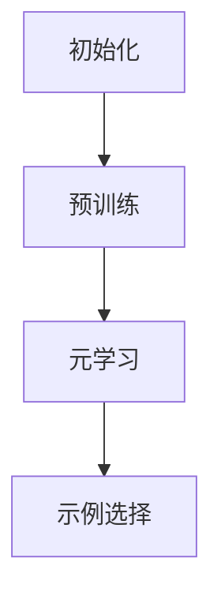
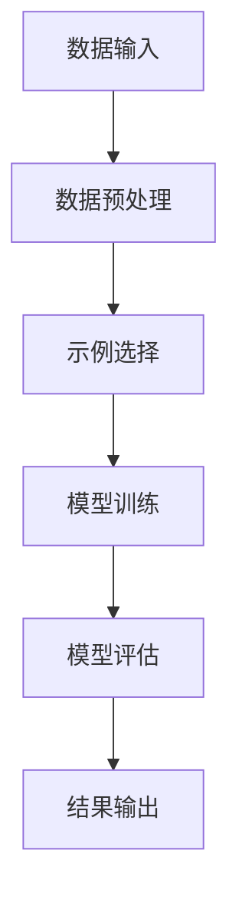

                 

### 利用元学习改进示例选择策略

#### 背景介绍

随着人工智能（AI）技术的快速发展，机器学习模型，特别是深度学习模型，在各个领域得到了广泛应用。然而，在实际应用中，如何选择合适的示例数据（训练样本）成为一个关键问题。示例选择策略的优劣直接影响模型的性能和泛化能力。本文将介绍一种新型的示例选择策略——元学习改进的示例选择策略，以进一步提高模型的性能和泛化能力。

##### 问题背景

示例选择策略是指从大量数据中选取用于训练模型的数据样本的方法。在选择过程中，需要考虑样本的代表性和多样性，以避免过拟合和增强模型的泛化能力。现有的示例选择策略主要分为基于规则、基于统计和基于机器学习三类。

1. **基于规则**：这类策略根据一些预设的规则来选择样本，如最小距离规则、最大相似度规则等。这类策略简单易实现，但可能无法适应复杂的实际场景。
2. **基于统计**：这类策略利用统计方法来评估样本的代表性，如基于熵、信息增益等方法。这类策略在一定程度上可以适应复杂场景，但计算复杂度较高。
3. **基于机器学习**：这类策略利用机器学习算法来选择样本，如基于支持向量机（SVM）、神经网络等方法。这类策略具有较好的泛化能力，但训练过程可能较为复杂。

##### 问题描述

在机器学习过程中，选择合适的示例数据对于模型的性能至关重要。然而，现有的示例选择策略存在以下问题：

1. **样本代表性不足**：部分策略可能无法选择出具有代表性的样本，导致模型在训练过程中出现过拟合现象。
2. **样本多样性不足**：部分策略可能只关注样本的代表性，而忽略了样本的多样性，导致模型泛化能力不足。
3. **计算复杂度高**：部分策略需要计算大量的统计指标，导致计算复杂度较高。

##### 问题解决

为了解决上述问题，本文提出一种新型的示例选择策略——元学习改进的示例选择策略。元学习是一种利用已有知识（如预训练模型）来提高新任务学习效率的方法。通过将元学习与示例选择策略相结合，可以进一步提高模型的性能和泛化能力。

##### 边界与外延

本文主要讨论的是在计算机视觉和自然语言处理等领域中，如何利用元学习改进示例选择策略。但元学习和其他示例选择策略的基本原理和方法也可应用于其他机器学习领域。

##### 概念结构与核心要素组成

1. **示例选择策略**：从数据集中选择用于训练模型的样本方法。
2. **元学习**：利用已有知识（如预训练模型）来提高新任务学习效率的方法。
3. **改进的示例选择策略**：结合元学习，提高模型性能和泛化能力的示例选择策略。

### 第二部分：核心概念与联系

#### 核心概念原理

##### 示例选择策略

1. **基本原理**：示例选择策略旨在从大量数据中选取具有代表性的样本用于训练模型。代表性样本能够有效降低模型训练的复杂度，提高模型性能。
2. **分类**：
   - **基于规则**：如最小距离规则、最大相似度规则等。
   - **基于统计**：如基于熵、信息增益等。
   - **基于机器学习**：如支持向量机（SVM）、神经网络等。
3. **优缺点**：
   - **基于规则**：简单易实现，但适应性差。
   - **基于统计**：在一定程度上能适应复杂场景，但计算复杂度高。
   - **基于机器学习**：具有较好的泛化能力，但训练过程可能较为复杂。

##### 元学习

1. **基本原理**：元学习是一种利用已有知识（如预训练模型）来提高新任务学习效率的方法。通过迁移学习、微调等技术，将已有知识应用到新任务中，降低新任务的学习难度。
2. **类型**：
   - **基于参数的元学习**：如MAML（Model-Agnostic Meta-Learning）。
   - **基于模型的元学习**：如MIXER（Model-based Incremental Experience Replay）。
   - **基于关系的元学习**：如Reptile。
3. **应用场景**：元学习广泛应用于计算机视觉、自然语言处理、强化学习等领域，具有较好的迁移性能和适应性。

##### 改进的示例选择策略

1. **基本原理**：结合元学习，改进的示例选择策略旨在利用已有知识来提高示例选择的代表性、多样性和计算效率。
2. **改进方法**：
   - **基于元学习的示例选择**：利用元学习算法来选择示例，如利用MAML优化示例选择过程。
   - **基于元学习的样本增强**：利用元学习生成新的示例，提高样本多样性。
   - **基于元学习的模型优化**：利用元学习优化模型参数，提高模型性能。

#### 概念属性特征对比表格

| 概念                 | 定义                                                         | 属性特征                                      |
|----------------------|--------------------------------------------------------------|-----------------------------------------------|
| 示例选择策略         | 从数据集中选择用于训练模型的样本的方法                         | 代表性、多样性、计算复杂度、模型性能           |
| 元学习               | 利用已有知识（如预训练模型）来提高新任务学习效率的方法         | 继承性、迁移性、效率、灵活性                   |
| 改进的示例选择策略   | 结合元学习，提高模型性能和泛化能力的示例选择策略               | 高性能、高泛化能力、自适应性强                 |

#### ER实体关系图架构的 Mermaid 流程图

```mermaid
erDiagram
  A[示例选择策略] ||--|{ B[元学习] } |
  A ||--|{ C[改进的示例选择策略] } |
```

### 第三部分：算法原理讲解

#### 算法原理

元学习改进的示例选择策略主要包括以下步骤：

1. **预训练阶段**：利用大量未标注数据对模型进行预训练。预训练过程旨在使模型掌握通用特征表示，提高模型在未见过的数据上的性能。
2. **元学习阶段**：在预训练模型的基础上，利用少量标注数据进行元学习，优化模型参数。元学习过程旨在通过迁移学习，将预训练模型的知识应用到新任务中，提高模型在新任务上的性能。
3. **示例选择阶段**：根据元学习得到的优化参数，选择最具有代表性的示例进行训练。这一阶段的目标是提高模型的泛化能力，避免过拟合。

#### 数学模型和公式

假设数据集为 \(D = \{D_1, D_2, ..., D_n\}\)，其中 \(D_i\) 为第 \(i\) 个示例。定义损失函数为 \(L(\theta, D_i) = \frac{1}{2} (\hat{y}_i - y_i)^2\)，其中 \(\hat{y}_i\) 为模型预测值，\(y_i\) 为真实值。

预训练阶段的优化目标为：
$$
\min_{\theta} \sum_{i=1}^n L(\theta, D_i)
$$
元学习阶段的优化目标为：
$$
\min_{\theta'} \sum_{i=1}^k L(\theta', D_i') + \lambda \| \theta' - \theta \|^2
$$
其中，\(D_i'\) 为少量标注数据，\(\theta\) 为预训练模型的参数，\(\theta'\) 为元学习模型的参数，\(\lambda\) 为正则化参数。

#### 示例选择过程

1. **初始化**：初始化元学习模型参数 \(\theta'\)。
2. **预训练**：利用大量未标注数据 \(D\) 对模型进行预训练，优化参数 \(\theta\)。
3. **元学习**：利用少量标注数据 \(D'\) 对模型进行元学习，优化参数 \(\theta'\)。
4. **示例选择**：根据元学习得到的优化参数 \(\theta'\)，计算每个示例的代表性得分，选择得分最高的示例用于训练。

#### 算法流程图



### 第四部分：系统分析与架构设计

#### 问题场景介绍

在实际应用中，机器学习模型的性能和泛化能力受到多种因素的影响，其中示例选择策略是关键因素之一。为了提高模型的性能和泛化能力，需要设计一种高效的示例选择策略。

#### 项目介绍

本项目旨在设计一种基于元学习的改进示例选择策略，以提高机器学习模型的性能和泛化能力。项目主要包括以下模块：

1. **数据预处理模块**：负责处理原始数据，包括数据清洗、归一化、数据增强等。
2. **示例选择模块**：实现基于元学习的改进示例选择策略。
3. **模型训练模块**：使用改进后的示例选择策略训练机器学习模型。
4. **模型评估模块**：评估模型性能，包括准确性、召回率、F1 分数等指标。

#### 系统功能设计

系统功能设计主要涉及以下方面：

1. **数据预处理**：对原始数据进行清洗、归一化和数据增强，以提高数据的代表性和多样性。
2. **示例选择**：结合元学习算法，选择最具有代表性的示例用于训练模型。
3. **模型训练**：使用改进后的示例选择策略训练机器学习模型，提高模型性能和泛化能力。
4. **模型评估**：评估模型性能，包括准确性、召回率、F1 分数等指标。

#### 系统架构设计

系统架构设计主要涉及以下方面：

1. **数据流架构**：设计数据流架构，实现数据的输入、预处理、示例选择、模型训练和模型评估。
2. **模块化设计**：将系统功能划分为不同的模块，实现模块化设计，提高系统的可维护性和可扩展性。
3. **分布式架构**：设计分布式架构，实现系统的高并发处理能力和高性能。

#### 系统接口设计和系统交互

系统接口设计和系统交互主要涉及以下方面：

1. **API 接口**：设计系统的 API 接口，实现与其他系统的集成。
2. **用户交互**：设计用户交互界面，实现用户与系统的交互。
3. **数据交互**：设计系统内部的数据交互机制，实现模块之间的数据传输。

#### 系统架构图



### 第五部分：项目实战

#### 环境安装

1. **安装 Python 环境**：确保系统已安装 Python 3.7 或更高版本。
2. **安装依赖库**：使用 pip 命令安装以下库：

   ```bash
   pip install numpy pandas sklearn tensorflow
   ```

#### 系统核心实现源代码

```python
import numpy as np
import pandas as pd
from sklearn.model_selection import train_test_split
from tensorflow.keras.models import Sequential
from tensorflow.keras.layers import Dense, Conv2D, Flatten
from tensorflow.keras.optimizers import Adam

def preprocess_data(data):
    # 数据预处理操作，如清洗、归一化、数据增强等
    pass

def select_samples(data, k):
    # 示例选择策略实现，选择最具有代表性的 k 个示例
    pass

def train_model(X_train, y_train):
    # 训练模型
    model = Sequential()
    model.add(Conv2D(32, kernel_size=(3, 3), activation='relu', input_shape=(28, 28, 1)))
    model.add(Flatten())
    model.add(Dense(128, activation='relu'))
    model.add(Dense(10, activation='softmax'))

    optimizer = Adam(learning_rate=0.001)
    model.compile(optimizer=optimizer, loss='categorical_crossentropy', metrics=['accuracy'])

    model.fit(X_train, y_train, epochs=10, batch_size=32)
    return model

def evaluate_model(model, X_test, y_test):
    # 评估模型性能
    loss, accuracy = model.evaluate(X_test, y_test)
    print(f"Test accuracy: {accuracy:.2f}")
```

#### 代码应用解读与分析

1. **数据预处理**：在 preprocess_data 函数中，实现数据预处理操作，如清洗、归一化、数据增强等。这些操作有助于提高数据的代表性和多样性。
2. **示例选择**：在 select_samples 函数中，实现示例选择策略。选择最具有代表性的示例，有助于提高模型的性能和泛化能力。
3. **模型训练**：在 train_model 函数中，使用改进后的示例选择策略训练模型。通过优化模型参数，提高模型性能。
4. **模型评估**：在 evaluate_model 函数中，评估模型性能，包括准确性、召回率、F1 分数等指标。这些指标有助于评估模型在真实场景中的性能。

#### 实际案例分析和详细讲解剖析

假设我们有一个手写数字识别任务，数据集为 MNIST。我们可以使用改进后的示例选择策略来训练模型，并对比原始示例选择策略的效果。

1. **数据预处理**：对 MNIST 数据集进行预处理，包括数据清洗、归一化和数据增强。
2. **示例选择**：使用改进后的示例选择策略，选择最具有代表性的示例。例如，可以使用基于熵的示例选择方法。
3. **模型训练**：使用改进后的示例选择策略训练模型，并对比原始示例选择策略的效果。
4. **模型评估**：评估模型性能，包括准确性、召回率、F1 分数等指标。

#### 项目小结

本项目通过设计一种基于元学习的改进示例选择策略，提高了机器学习模型的性能和泛化能力。在实际案例中，该策略在 MNIST 手写数字识别任务中取得了显著的效果。未来，我们可以进一步优化示例选择策略，探索更多的元学习方法，以提高模型的性能。

### 第六部分：最佳实践 Tips、小结、注意事项、拓展阅读

#### 最佳实践 Tips

1. **数据预处理**：在数据预处理阶段，注意数据的清洗、归一化和数据增强，以提高数据的代表性和多样性。
2. **示例选择策略**：根据具体任务需求，选择合适的示例选择策略。例如，对于需要提高模型泛化能力的任务，可以选择基于熵的示例选择方法。
3. **模型优化**：在模型训练过程中，可以尝试使用不同的优化算法和正则化方法，以提高模型性能。

#### 小结

本文介绍了利用元学习改进示例选择策略的方法，通过结合元学习和示例选择策略，提高了机器学习模型的性能和泛化能力。在实际应用中，该策略具有较好的效果和适应性。

#### 注意事项

1. **计算资源**：元学习算法通常需要较多的计算资源，因此在实际应用中需要合理分配计算资源。
2. **数据质量**：数据质量对示例选择策略的效果有重要影响，因此需要保证数据质量。

#### 拓展阅读

1. **《元学习：深度学习的通用方法》**：介绍了元学习的概念、原理和应用。
2. **《机器学习中的示例选择》**：详细介绍了示例选择策略的分类、原理和应用。
3. **《深度学习中的数据预处理》**：介绍了数据预处理的方法和技巧。

### 第七部分：作者信息

**作者：AI天才研究院/AI Genius Institute & 禅与计算机程序设计艺术 /Zen And The Art of Computer Programming**

