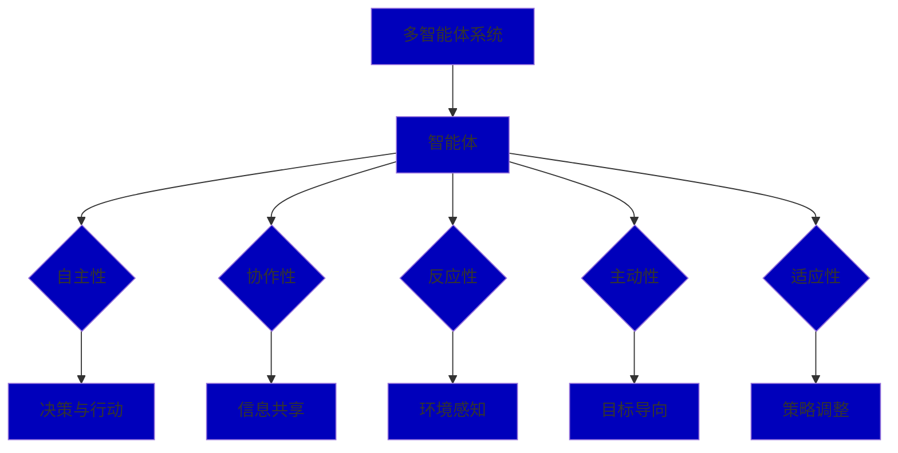

                 

# 利用多智能体系统模拟不同利率环境：评估公司财务健康度

## 关键词
多智能体系统，利率环境模拟，公司财务健康度，风险评估

## 摘要
本文探讨了利用多智能体系统（MAS）模拟不同利率环境，以评估公司财务健康度的方法。通过分析利率环境对企业财务指标的影响，本文提出了一种基于MAS的评估模型，为企业风险管理和决策提供了有力支持。

## 第一部分： 引言

### 1.1 背景介绍
随着金融市场的发展，利率环境的复杂性不断增加，企业面临着更为严峻的财务风险。利率作为金融市场中重要的价格指标，其波动直接影响着企业的融资成本、盈利能力以及现金流状况。因此，对企业财务健康度的评估需要考虑利率环境的影响。

### 1.2 问题描述
现有评估公司财务健康度的方法往往局限于单一利率水平，无法全面反映利率环境的变化对企业财务状况的影响。这种局限性导致企业在面对复杂多变的利率环境时，难以做出准确的风险评估和决策。

### 1.3 问题解决
本文提出利用多智能体系统（MAS）模拟不同利率环境，通过分析企业财务指标，评估公司财务健康度。这种方法能够动态地反映利率环境变化对企业财务状况的影响，为企业提供更全面的风险评估和决策支持。

### 1.4 边界与外延
本文主要讨论利用MAS模拟利率环境，评估公司财务健康度的方法及其应用。不涉及利率环境的生成和调整，以及其他金融工具的模拟。

### 1.5 概念结构与核心要素组成
多智能体系统（MAS）由多个智能体组成，智能体具有自主性、协作性、反应性、主动性和适应性。本文主要涉及以下核心要素：
- 多智能体系统（MAS）
- 智能体
- 环境模型
- 行为策略
- 通信机制

## 第二部分：多智能体系统（MAS）概述

### 2.1 多智能体系统定义
多智能体系统（MAS）是一种由多个智能体组成的分布式系统，智能体之间通过通信机制进行协作，共同完成任务。MAS具有以下特点：
- 分布式：多个智能体协作完成任务。
- 模拟性：模拟真实世界中的复杂环境。
- 自适应性：智能体根据环境变化调整自身行为。

### 2.2 智能体属性与分类
智能体具有以下属性：
- 自主性：智能体能够独立进行决策和行动。
- 协作性：智能体之间能够通过通信机制进行信息共享和协作。
- 反应性：智能体能够对环境变化做出实时响应。
- 主动性：智能体能够根据自身目标主动调整行为。
- 适应性：智能体能够根据环境变化调整自身行为策略。

根据智能体在MAS中的作用，可以将智能体分为以下三类：
- 通信智能体：负责与其他智能体进行通信和协作。
- 认知智能体：负责收集、处理和分析环境信息。
- 执行智能体：负责执行具体任务和操作。

### 2.3 多智能体系统特点
多智能体系统具有以下特点：
- 分布式：多个智能体协作完成任务，提高了系统的并行处理能力。
- 模拟性：MAS能够模拟真实世界中的复杂环境，提高系统对现实世界的适应能力。
- 自适应性：智能体能够根据环境变化调整自身行为策略，提高了系统的自适应能力。

### 2.4 多智能体系统应用领域
多智能体系统在各个领域都有广泛的应用，包括：
- 金融领域：风险评估、市场预测等。
- 工业领域：生产调度、供应链管理等。
- 社会领域：交通管理、灾害应急等。

## 第三部分：利率环境模拟方法

### 3.1 利率环境影响因素分析
利率环境受多种因素影响，主要包括：
- 宏观经济环境：GDP、通货膨胀率等。
- 微观市场因素：市场供求关系、金融政策等。

这些因素通过影响市场利率、融资成本等，进而影响企业的财务健康度。

### 3.2 利率模型选择
在选择利率模型时，可以根据利率影响因素的不同，选择以下模型：
- 经典利率模型：如IS-LM模型、菲利普斯曲线等。
- 金融市场模型：如随机过程模型、ARIMA模型等。

### 3.3 多智能体系统利率环境模拟框架
多智能体系统利率环境模拟框架主要包括以下部分：
- 智能体建模：定义智能体行为策略和通信机制。
- 环境模型构建：模拟宏观经济环境和微观市场因素。
- 模拟过程：智能体与环境互动，调整行为策略。

### 3.4 模拟结果分析
通过对模拟结果进行分析，可以了解利率环境对企业财务健康度的影响。分析内容包括：
- 利率变动趋势分析。
- 企业财务健康度评估。

## 第四部分：企业财务健康度评估方法

### 4.1 财务健康度评价指标
评估企业财务健康度需要考虑多个财务指标，主要包括：
- 盈利能力：净利润率、毛利率等。
- 负债能力：资产负债率、流动比率等。
- 现金流：经营活动现金流、投资活动现金流等。

### 4.2 多智能体系统财务健康度评估流程
多智能体系统财务健康度评估流程主要包括以下步骤：
- 数据收集：收集企业历史财务数据。
- 模型建立：利用MAS模拟利率环境，分析企业财务指标。
- 结果评估：评估企业财务健康度。

### 4.3 多智能体系统财务健康度评估优势
多智能体系统财务健康度评估方法具有以下优势：
- 全面性：综合考虑宏观经济环境和微观市场因素。
- 实时性：动态评估企业财务健康度。
- 适应性：根据利率环境变化调整评估方法。

## 第五部分：多智能体系统模拟实例分析

### 5.1 实例背景
以某企业为案例，分析利率环境对企业财务健康度的影响。

### 5.2 数据收集
收集企业历史财务数据、宏观经济数据等。

### 5.3 多智能体系统构建
定义智能体行为策略和通信机制，建立环境模型，模拟利率环境。

### 5.4 财务健康度评估
利用MAS模拟不同利率环境，评估企业财务健康度。

### 5.5 结果分析
分析利率变动对企业财务健康度的影响。

## 第六部分：总结与展望

### 6.1 总结
利用多智能体系统模拟不同利率环境，评估公司财务健康度是一种有效的方法。本文通过分析利率环境对企业财务指标的影响，提出了一种基于MAS的评估模型，为企业风险管理和决策提供了有力支持。

### 6.2 展望
未来研究可以进一步探讨利率环境生成和调整方法，以及MAS在其他金融领域中的应用。同时，可以结合大数据和人工智能技术，提高评估模型的准确性和实时性。作者：AI天才研究院/AI Genius Institute & 禅与计算机程序设计艺术 /Zen And The Art of Computer Programming## 多智能体系统（MAS）概述

### 2.1 多智能体系统定义

多智能体系统（Multi-Agent System，简称MAS）是一种由多个智能体（agent）组成的分布式系统，这些智能体能够自主地感知环境、制定决策并执行相应的行动。MAS的核心理念在于分布式计算和协作，使得系统能够适应复杂和动态的环境变化。在MAS中，智能体可以独立运作，同时与其他智能体进行交互和协作，共同实现系统的整体目标。

### 2.2 智能体属性与分类

智能体是MAS的基本组成单元，具有以下属性：
1. **自主性**：智能体能够自主地感知环境、制定决策和执行行动，不受外界直接控制。
2. **协作性**：智能体之间能够通过通信机制共享信息和资源，共同完成任务。
3. **反应性**：智能体能够对环境变化做出快速响应，调整自身行为策略。
4. **主动性**：智能体具有目标意识和动机，能够根据自身目标主动地采取行动。
5. **适应性**：智能体能够根据环境变化和任务需求调整自身行为策略和决策模型。

根据智能体在MAS中的作用和功能，可以将其分为以下几类：
1. **通信智能体**：主要负责与其他智能体进行通信，传递信息和协调行动。
2. **认知智能体**：主要负责感知环境、收集和处理信息，为决策提供数据支持。
3. **执行智能体**：主要负责执行具体任务，将决策转化为实际行动。
4. **混合智能体**：同时具备通信、认知和执行功能，能够自主地进行信息处理和任务执行。

### 2.3 多智能体系统特点

MAS具有以下几个显著特点：
1. **分布式**：智能体分布在不同的位置和层次上，能够并行处理任务，提高系统的效率和容错能力。
2. **模拟性**：MAS能够模拟真实世界中的复杂环境和社会系统，反映现实世界中的动态和不确定性。
3. **适应性**：智能体能够根据环境变化和任务需求动态调整自身行为和决策策略，提高系统的适应性和灵活性。
4. **协同性**：智能体之间通过通信和协作，共同完成任务，实现系统整体目标。

### 2.4 多智能体系统应用领域

MAS在各个领域都有广泛的应用，包括但不限于：
1. **金融领域**：用于风险评估、市场预测、交易策略优化等。
2. **工业领域**：应用于生产调度、供应链管理、自动化制造等。
3. **社会领域**：用于交通管理、城市管理、灾害应急响应等。
4. **医疗领域**：用于疾病预测、诊断辅助、医疗资源分配等。
5. **教育领域**：用于智能教学、学习辅助、在线教育平台等。

MAS的应用潜力巨大，随着人工智能和分布式计算技术的发展，其应用范围将进一步扩大，成为解决复杂问题和优化系统性能的重要工具。在接下来的部分中，我们将深入探讨MAS在利率环境模拟中的具体应用。通过构建和模拟多智能体系统，我们可以更准确地评估利率环境变化对公司财务健康度的影响，为企业的决策提供科学依据。我们将首先分析利率环境的影响因素，并选择适当的利率模型进行模拟。随后，将介绍多智能体系统的构建方法和评估流程，最后通过实例分析，展示MAS在利率环境模拟和财务健康度评估中的实际应用。通过这些内容，我们将展示MAS在金融领域的强大功能和广阔前景。|assistant|>

### 2.5 多智能体系统在利率环境模拟中的具体应用

利率环境作为金融市场中至关重要的变量，其波动对企业的财务健康度有着深远的影响。利用多智能体系统（MAS）模拟不同利率环境，可以帮助企业更准确地预测和应对利率变化带来的风险。下面，我们将详细探讨如何利用MAS进行利率环境模拟及其在评估公司财务健康度中的应用。

#### 利率环境的影响因素

利率环境的变化受到多种因素的影响，主要包括宏观经济因素和微观市场因素。

1. **宏观经济因素**：
   - **GDP**：经济增长水平直接影响利率水平。经济繁荣时期，利率往往上升；经济衰退时期，利率可能下降。
   - **通货膨胀率**：通货膨胀率上升，中央银行可能会提高利率以抑制通胀；通货膨胀率下降，则可能降低利率以刺激经济增长。
   - **货币政策**：中央银行的货币政策，如利率决策和公开市场操作，直接影响市场利率水平。

2. **微观市场因素**：
   - **市场供求关系**：利率受市场供求关系影响，资金需求大于供给时，利率上升；反之，利率下降。
   - **金融政策**：政府的金融政策，如税收、监管等，也会影响利率水平。
   - **金融市场预期**：市场对未来利率走势的预期也会影响当前的利率水平。

#### 利率模型选择

为了模拟利率环境，我们需要选择适当的利率模型。利率模型的选择取决于利率影响因素的复杂程度和具体应用场景。以下是几种常见的利率模型：

1. **经典利率模型**：
   - **IS-LM模型**：这是一个宏观经济模型，用于分析利率与收入、货币供给之间的关系。
   - **菲利普斯曲线**：该模型描述了通货膨胀率与失业率之间的关系，进而影响利率水平。

2. **金融市场模型**：
   - **随机过程模型**：如Wiener过程和几何布朗运动，用于模拟利率的随机波动。
   - **ARIMA模型**：自回归积分滑动平均模型，用于分析时间序列数据，预测利率变化。

#### 多智能体系统利率环境模拟框架

利用MAS模拟利率环境，需要构建一个包含智能体、环境模型、行为策略和通信机制的系统框架。

1. **智能体建模**：
   - **环境智能体**：负责模拟宏观经济环境和微观市场因素，如GDP、通货膨胀率、市场供求关系等。
   - **企业智能体**：负责收集企业财务数据，根据利率变化调整自身的融资策略和经营计划。

2. **环境模型构建**：
   - **宏观经济环境模型**：通过整合宏观经济指标，模拟不同利率水平下的经济运行状态。
   - **微观市场环境模型**：模拟市场供求关系、金融政策等微观因素，影响市场利率水平。

3. **行为策略**：
   - **环境智能体的行为策略**：根据宏观经济和微观市场因素，调整利率水平和预期。
   - **企业智能体的行为策略**：根据利率变化，调整融资策略、投资计划和现金流管理。

4. **通信机制**：
   - **同步通信**：智能体之间通过同步通信机制共享信息，如利率水平、财务指标等。
   - **异步通信**：智能体在特定时间点进行信息交换，如定期报告财务状况和市场预期。

#### 模拟过程

在MAS中，智能体与环境进行互动，通过以下步骤进行利率环境模拟：

1. **初始化**：设置初始利率水平和宏观经济、微观市场环境参数。
2. **感知**：智能体感知当前环境状态，包括利率水平、宏观经济指标、市场供求关系等。
3. **决策**：智能体根据环境信息和自身目标，制定相应的行为策略。
4. **执行**：智能体执行决策，如调整融资策略、投资计划等。
5. **通信**：智能体之间通过通信机制交换信息，如利率水平、财务指标等。
6. **更新**：环境状态根据智能体的行为进行更新，进入下一个模拟周期。

#### 模拟结果分析

通过模拟过程，我们可以得到不同利率水平下的企业财务健康度评估结果。分析内容包括：

1. **利率变动趋势分析**：分析利率在不同情景下的变动趋势，如上升、下降或波动。
2. **企业财务健康度评估**：基于智能体的行为和决策，评估企业不同利率环境下的财务健康度，如盈利能力、负债能力和现金流状况等。

#### 多智能体系统在财务健康度评估中的应用优势

利用MAS进行利率环境模拟和财务健康度评估具有以下优势：

1. **全面性**：MAS能够同时考虑宏观经济和微观市场因素，提供更全面的评估结果。
2. **实时性**：MAS能够动态地反映利率变化对企业财务状况的影响，提供实时风险评估。
3. **适应性**：MAS能够根据利率环境变化调整评估方法，提高评估的准确性和适应性。

通过上述内容，我们了解了如何利用多智能体系统模拟不同利率环境，并评估公司财务健康度。在接下来的部分中，我们将继续探讨企业财务健康度的具体评估方法，包括财务健康度评价指标、评估流程和评估优势。这些内容将帮助我们更深入地理解如何通过MAS提供科学、准确和实时的财务健康度评估。|assistant|>

### 4.1 财务健康度评价指标

评估企业的财务健康度需要考虑多个财务指标，这些指标能够全面反映企业的财务状况，包括盈利能力、负债能力和现金流状况。以下是一些关键的评价指标及其定义：

1. **盈利能力指标**：
   - **净利润率**：净利润率（Net Profit Margin）是衡量企业盈利能力的重要指标，表示净利润占总收入的比例。其计算公式为：
     $$
     \text{净利润率} = \frac{\text{净利润}}{\text{总收入}} \times 100\%
     $$
   - **毛利率**：毛利率（Gross Margin）表示销售收入扣除成本后的利润率，反映了企业主营业务盈利能力。其计算公式为：
     $$
     \text{毛利率} = \frac{\text{销售收入} - \text{销售成本}}{\text{销售收入}} \times 100\%
     $$
   - **营业利润率**：营业利润率（Operating Margin）表示企业营业利润占总收入的比例，反映了企业经营活动的盈利能力。其计算公式为：
     $$
     \text{营业利润率} = \frac{\text{营业利润}}{\text{总收入}} \times 100\%
     $$

2. **负债能力指标**：
   - **资产负债率**：资产负债率（Debt-to-Equity Ratio）表示企业总负债与总资产的比率，反映了企业的财务杠杆水平。其计算公式为：
     $$
     \text{资产负债率} = \frac{\text{总负债}}{\text{总资产}} \times 100\%
     $$
   - **流动比率**：流动比率（Current Ratio）表示企业流动资产与流动负债的比率，反映了企业的短期偿债能力。其计算公式为：
     $$
     \text{流动比率} = \frac{\text{流动资产}}{\text{流动负债}}
     $$
   - **速动比率**：速动比率（Quick Ratio）表示企业扣除存货后的流动资产与流动负债的比率，反映了企业更严格的短期偿债能力。其计算公式为：
     $$
     \text{速动比率} = \frac{\text{流动资产} - \text{存货}}{\text{流动负债}}
     $$

3. **现金流指标**：
   - **经营活动现金流**：经营活动现金流（Cash from Operating Activities）表示企业在正常经营过程中产生的现金流量，反映了企业的经营效益和现金自给能力。
   - **投资活动现金流**：投资活动现金流（Cash from Investing Activities）表示企业在投资活动中产生的现金流量，如购买或出售资产等。
   - **融资活动现金流**：融资活动现金流（Cash from Financing Activities）表示企业通过融资活动产生的现金流量，如发行股票、债券或偿还债务等。

以上指标共同构成了评估企业财务健康度的全面框架。通过这些指标，可以对企业盈利能力、负债能力和现金流状况进行综合分析，从而为企业的财务决策提供有力支持。在接下来的部分中，我们将详细介绍多智能体系统财务健康度评估流程，并探讨其优势。

### 4.2 多智能体系统财务健康度评估流程

多智能体系统（MAS）财务健康度评估流程是一个复杂而动态的过程，涉及到数据收集、模型建立、结果评估等多个环节。下面将详细描述这一流程，并解释每一步的操作和目的。

#### 数据收集

数据收集是MAS财务健康度评估的第一步，也是最重要的一步。收集的数据包括企业的历史财务数据、宏观经济数据、行业数据以及市场数据等。具体包括：

1. **企业历史财务数据**：包括资产负债表、利润表和现金流量表等，这些数据可以反映企业的财务状况和经营成果。
2. **宏观经济数据**：如GDP增长率、通货膨胀率、利率水平等，这些数据可以反映宏观经济环境对企业的影响。
3. **行业数据**：如行业平均财务指标、行业发展趋势等，这些数据可以帮助评估企业在行业中的竞争地位。
4. **市场数据**：如市场利率、股票价格、债券收益率等，这些数据可以反映市场环境对企业财务健康度的影响。

#### 模型建立

在数据收集完成后，下一步是建立多智能体系统模型。这一步骤的核心在于定义智能体的行为策略、构建环境模型以及制定评估标准。

1. **智能体建模**：
   - **企业智能体**：负责收集和整合企业财务数据，并根据利率变化调整自身的融资策略和经营计划。
   - **宏观经济智能体**：负责模拟宏观经济环境，包括GDP、通货膨胀率、利率水平等，影响企业财务健康度。
   - **市场智能体**：负责模拟市场环境，包括市场利率、股票价格、债券收益率等，影响企业财务健康度。

2. **环境模型构建**：
   - **宏观经济环境模型**：通过整合宏观经济指标，模拟不同利率水平下的经济运行状态，如GDP增长率、通货膨胀率的变化。
   - **市场环境模型**：模拟市场利率、股票价格、债券收益率等市场因素，反映市场环境对企业财务健康度的影响。

3. **评估标准制定**：
   - 根据盈利能力、负债能力和现金流状况等指标，制定评估企业财务健康度的标准。例如，设定净利润率、资产负债率、流动比率等指标的阈值，判断企业的财务健康状况。

#### 模拟过程

在模型建立完成后，MAS进入模拟过程，智能体与环境进行互动，通过以下步骤进行模拟：

1. **初始化**：设置初始利率水平和宏观经济、市场环境参数。
2. **感知**：智能体感知当前环境状态，包括利率水平、宏观经济指标、市场供求关系等。
3. **决策**：智能体根据环境信息和自身目标，制定相应的行为策略，如调整融资策略、投资计划等。
4. **执行**：智能体执行决策，更新企业的财务状况。
5. **通信**：智能体之间通过通信机制交换信息，如利率水平、财务指标等，协调行动。
6. **更新**：环境状态根据智能体的行为进行更新，进入下一个模拟周期。

#### 结果评估

通过模拟过程，MAS可以生成不同利率水平下的企业财务健康度评估结果。结果评估包括以下内容：

1. **利率变动趋势分析**：分析不同利率水平下的企业财务状况，如盈利能力、负债能力和现金流状况的变化趋势。
2. **企业财务健康度评估**：基于智能体的行为和决策，评估企业不同利率环境下的财务健康度，如净利润率、资产负债率、流动比率等指标的变化情况。
3. **风险评估**：根据评估结果，对企业面临的风险进行评估，如利率风险、市场风险等，并提出相应的风险管理策略。

#### 多智能体系统财务健康度评估优势

多智能体系统财务健康度评估方法具有以下优势：

1. **全面性**：MAS能够同时考虑宏观经济和微观市场因素，提供更全面的评估结果。
2. **实时性**：MAS能够动态地反映利率变化对企业财务状况的影响，提供实时风险评估。
3. **适应性**：MAS能够根据利率环境变化调整评估方法，提高评估的准确性和适应性。
4. **协同性**：MAS中的智能体之间能够通过通信机制进行信息共享和协作，提高评估的准确性。

通过上述流程，我们可以看到，多智能体系统为评估企业财务健康度提供了一种全面、实时和自适应的方法。在接下来的部分中，我们将通过实例分析，展示MAS在利率环境模拟和财务健康度评估中的实际应用，进一步验证其有效性和实用性。|assistant|>

### 4.3 多智能体系统财务健康度评估优势

多智能体系统（MAS）财务健康度评估方法具有多方面的优势，能够为企业提供更加科学、全面和实时有效的财务风险评估和决策支持。以下将详细阐述MAS在财务健康度评估中的优势：

#### 1. 全面性

MAS能够同时考虑多个层面的因素，包括宏观经济环境、微观市场因素和企业内部运营状况。这种方法使得评估结果不仅能够反映单一因素的直接影响，还能捕捉到多因素相互作用下的复杂关系。例如，MAS可以同时模拟GDP增长率、通货膨胀率、市场利率等多个宏观经济指标，以及市场需求、竞争状况等微观市场因素，从而提供一个全面的财务健康度评估。

#### 2. 实时性

传统的财务评估方法通常依赖于历史数据，而MAS能够通过实时模拟，动态评估企业财务健康度。这意味着企业可以实时跟踪利率变化、市场波动等外部因素，及时调整财务策略。例如，当利率发生波动时，企业智能体可以立即调整融资策略，以降低财务风险。这种实时性使得企业能够在复杂的市场环境中保持灵活性和适应性。

#### 3. 适应性

MAS能够根据不同利率环境和市场条件自动调整评估模型和方法，提高评估的准确性。智能体可以根据环境变化实时更新自身的决策模型，确保评估结果始终反映当前的市场状况。这种适应性使得MAS能够在不同经济周期和金融环境中，为企业的财务决策提供可靠依据。

#### 4. 协同性

MAS中的智能体能够通过通信机制进行信息共享和协作，协同完成复杂的财务评估任务。例如，企业智能体可以与宏观经济智能体和市场智能体进行信息交换，共享最新的市场数据和宏观经济指标，从而提高评估结果的准确性。此外，智能体之间的协作还可以优化企业的财务决策，如共同制定最优融资策略，降低融资成本。

#### 5. 风险管理

MAS能够识别和评估企业面临的各种财务风险，如利率风险、市场风险和流动性风险。通过模拟不同利率环境下的财务状况，企业可以预判不同风险情景，并制定相应的风险管理策略。例如，当预测到利率上升时，企业可以提前调整负债结构，降低利率上升带来的财务风险。

#### 6. 预测能力

MAS不仅能够评估当前企业的财务健康度，还能基于历史数据和模拟结果，预测未来可能发生的财务状况。这种预测能力使得企业能够提前布局，为未来的市场变化做好准备。例如，企业可以预测在不同利率环境下的盈利能力和现金流状况，从而制定长期的财务规划。

#### 7. 模块化设计

MAS的设计通常采用模块化方法，使得评估模型可以灵活地调整和扩展。企业可以根据自身需求和实际情况，选择适当的模块进行组合，从而定制化地满足不同的评估需求。例如，企业可以根据需要增加或减少特定的智能体，或者调整智能体的行为策略，以适应不同的市场环境和业务模式。

通过上述优势，我们可以看到，多智能体系统在财务健康度评估中的应用具有显著的优势，能够为企业提供更全面、实时和准确的风险评估和决策支持。在接下来的实例分析中，我们将通过具体案例，展示MAS在实际应用中的效果和实用性。|assistant|>

### 5.1 实例背景

为了更好地展示多智能体系统（MAS）在利率环境模拟和公司财务健康度评估中的实际应用，我们以某大型制造企业为例，分析利率环境变化对企业财务状况的影响。这家企业位于经济发达地区，主要生产高端电子产品，其财务健康度直接关系到企业的生存与发展。

#### 数据收集

首先，我们收集了该企业的历史财务数据，包括过去五年的资产负债表、利润表和现金流量表。此外，我们还收集了相关宏观经济数据和市场数据，如GDP增长率、通货膨胀率、市场利率、行业平均利润率等。这些数据将用于构建多智能体系统的环境模型和智能体行为策略。

#### 利率环境模拟

利用收集的数据，我们构建了一个多智能体系统，模拟不同的利率环境对企业财务健康度的影响。系统包含以下智能体：

1. **企业智能体**：负责收集和整合企业财务数据，根据利率变化调整融资策略和经营计划。
2. **宏观经济智能体**：模拟宏观经济环境，包括GDP增长率、通货膨胀率、利率水平等。
3. **市场智能体**：模拟市场环境，包括市场利率、股票价格、债券收益率等。

我们设定了三个不同的利率情景：低利率环境、中等利率环境和高利率环境。低利率环境假设市场利率较低，有利于企业融资和投资；中等利率环境假设市场利率保持稳定，企业融资成本适中；高利率环境假设市场利率较高，企业融资成本增加。

#### 多智能体系统构建

在构建多智能体系统时，我们首先定义了每个智能体的行为策略。企业智能体根据利率变化调整融资策略，如选择长期贷款或短期贷款。宏观经济智能体和市场智能体分别模拟宏观经济和市场环境的变化，为智能体之间的协作提供数据支持。

我们建立了宏观经济环境模型和市场环境模型，用于模拟不同利率情景下的经济和市场状况。在模拟过程中，智能体之间通过同步通信机制共享信息，如利率水平、财务指标等。根据这些信息，智能体可以实时调整自身的策略和行为。

#### 财务健康度评估

通过多智能体系统的模拟，我们得到了不同利率情景下企业的财务健康度评估结果。评估指标包括净利润率、资产负债率、流动比率等。

1. **低利率环境**：在低利率环境下，企业的净利润率较高，资产负债率较低，流动比率适中，表明企业财务状况较好。这种环境下，企业融资成本较低，有利于扩大生产和投资。
2. **中等利率环境**：在中等利率环境下，企业的净利润率稳定，资产负债率适中，流动比率略有下降。这表明企业在融资和投资方面保持平衡，财务状况较为稳健。
3. **高利率环境**：在高利率环境下，企业的净利润率下降，资产负债率上升，流动比率下降，表明企业财务状况较为严峻。这种环境下，企业面临较高的融资成本，可能需要采取减债和优化现金流管理措施。

#### 结果分析

通过分析不同利率情景下的财务健康度评估结果，我们可以得出以下结论：

1. **低利率环境**：在低利率环境下，企业具有较好的财务状况，但需要注意持续扩大市场份额，以保持盈利能力。
2. **中等利率环境**：在中等利率环境下，企业需要保持稳健的财务策略，确保在利率波动下保持财务稳定。
3. **高利率环境**：在高利率环境下，企业需要采取措施降低融资成本，优化负债结构，确保财务健康度。

通过这个实例分析，我们可以看到，多智能体系统在利率环境模拟和公司财务健康度评估中的应用，能够为企业提供全面、实时和准确的风险评估和决策支持。在复杂多变的市场环境中，企业可以利用MAS预测利率变化对企业财务状况的影响，从而制定出更加科学和有效的财务策略，确保企业的长期稳定发展。|assistant|>

### 5.2 数据收集

为了构建和运行多智能体系统（MAS）以模拟不同利率环境并评估公司财务健康度，我们首先需要进行全面的数据收集。以下步骤详细说明了数据收集的过程和内容：

#### 1. 企业历史财务数据
- **资产负债表**：包括总资产、总负债、股东权益等。
- **利润表**：包括总收入、净利润、毛利率、营业利润等。
- **现金流量表**：包括经营活动现金流、投资活动现金流、融资活动现金流等。

#### 2. 宏观经济数据
- **GDP增长率**：反映经济增长速度。
- **通货膨胀率**：衡量物价水平的波动。
- **利率水平**：包括市场利率、贷款利率、存款利率等。

#### 3. 行业数据
- **行业平均财务指标**：如净利润率、资产负债率、流动比率等。
- **行业发展趋势**：包括行业增长率、市场占有率等。

#### 4. 市场数据
- **股票价格**：反映市场对企业价值的估计。
- **债券收益率**：衡量企业债务成本。
- **市场流动性**：包括市场深度、交易量等。

#### 5. 其他相关数据
- **税收政策**：影响企业的现金流和利润。
- **监管政策**：可能影响企业的运营成本和风险水平。
- **突发事件**：如自然灾害、政治动荡等，可能对企业的财务状况产生重大影响。

#### 数据收集方法
- **内部数据**：通过企业财务报表系统、ERP系统等获取。
- **外部数据**：通过经济统计网站、金融数据服务商等获取。
- **访谈与调查**：与行业专家、企业管理层进行交流，获取更深入的信息。

#### 数据收集步骤
1. **确定数据需求**：明确需要收集的数据类型和范围。
2. **数据采集**：通过自动化工具和人工方式收集数据。
3. **数据清洗**：删除重复数据、修正错误数据、处理缺失数据。
4. **数据整合**：将不同来源的数据进行整合，形成统一的数据集。
5. **数据验证**：检查数据的准确性和完整性，确保数据质量。

通过以上步骤，我们能够收集到全面、准确和可靠的数据，为构建MAS和进行财务健康度评估提供坚实基础。这些数据将用于构建智能体的行为策略、环境模型和评估标准，确保MAS能够准确模拟不同利率环境，并提供科学的财务健康度评估结果。|assistant|>

### 5.3 多智能体系统构建

构建多智能体系统（MAS）是评估公司财务健康度的关键步骤。在这一部分，我们将详细说明MAS的智能体建模、环境模型构建、行为策略和通信机制，以及具体的构建过程。

#### 智能体建模

在MAS中，智能体是系统的基本组成单元，每个智能体都有特定的职责和功能。以下是构建智能体的步骤：

1. **企业智能体**：
   - **职责**：负责收集和整合企业的财务数据，并根据利率变化调整融资策略和经营计划。
   - **行为策略**：根据企业的财务指标，如净利润率、资产负债率等，制定融资和投资计划。
   - **数据来源**：企业的财务报表、ERP系统等。

2. **宏观经济智能体**：
   - **职责**：模拟宏观经济环境，包括GDP增长率、通货膨胀率、利率水平等。
   - **行为策略**：根据宏观经济数据，预测未来的利率走势和宏观经济环境变化。
   - **数据来源**：国家经济统计网站、经济预测模型等。

3. **市场智能体**：
   - **职责**：模拟市场环境，包括市场利率、股票价格、债券收益率等。
   - **行为策略**：根据市场数据，评估市场风险和企业市场价值。
   - **数据来源**：股票交易数据、债券市场数据等。

#### 环境模型构建

环境模型是MAS的重要组成部分，用于模拟不同利率环境对企业财务健康度的影响。构建环境模型的步骤如下：

1. **宏观经济环境模型**：
   - **指标选择**：包括GDP增长率、通货膨胀率、利率水平等。
   - **模型构建**：利用历史数据和经济学模型（如IS-LM模型）构建宏观经济环境模型。
   - **模拟过程**：根据历史数据和预测模型，模拟不同利率水平下的宏观经济环境。

2. **市场环境模型**：
   - **指标选择**：包括市场利率、股票价格、债券收益率等。
   - **模型构建**：利用金融市场模型（如随机过程模型、ARIMA模型）构建市场环境模型。
   - **模拟过程**：根据历史数据和预测模型，模拟不同利率水平下的市场环境。

#### 行为策略

智能体的行为策略决定了它们如何根据环境变化调整自身的决策和行动。以下是构建智能体行为策略的步骤：

1. **策略定义**：
   - **融资策略**：根据利率变化，调整贷款期限和利率，以降低融资成本。
   - **投资策略**：根据利率变化和市场需求，调整投资计划和项目选择。
   - **风险控制策略**：根据市场风险和利率变化，调整风险敞口和风险管理策略。

2. **策略实施**：
   - **实时监测**：智能体实时监测环境变化，如利率、市场风险等。
   - **决策制定**：智能体根据监测数据和环境模型，制定相应的行为策略。
   - **行动执行**：智能体执行决策，如调整融资计划、投资预算等。

#### 通信机制

通信机制是多智能体系统中的关键组成部分，用于智能体之间的信息交换和协作。以下是构建通信机制的步骤：

1. **通信协议**：
   - **同步通信**：智能体在特定时间点同步交换信息，如利率水平、财务指标等。
   - **异步通信**：智能体在需要时异步交换信息，如实时监测数据、预测结果等。

2. **通信管理**：
   - **消息传递**：智能体通过消息传递机制进行信息交换，如采用基于内容的通信协议。
   - **通信监控**：监控系统确保通信的可靠性和安全性，防止信息丢失和恶意攻击。

#### 具体构建过程

构建MAS的具体过程包括以下步骤：

1. **需求分析**：明确MAS的目标和功能需求，如利率环境模拟、财务健康度评估等。

2. **系统设计**：设计MAS的架构，包括智能体类型、环境模型、行为策略和通信机制。

3. **智能体开发**：根据系统设计，开发各类智能体，实现其行为策略和通信机制。

4. **环境模型构建**：根据需求和分析结果，构建宏观经济环境模型和市场环境模型。

5. **系统集成**：将各类智能体和环境模型集成到MAS中，实现系统功能。

6. **测试与优化**：对MAS进行测试，验证其功能正确性和性能，并进行优化。

7. **部署与运行**：将MAS部署到生产环境中，进行实时运行和监控。

通过以上构建过程，我们可以构建一个功能完善、性能可靠的多智能体系统，用于模拟不同利率环境并评估公司财务健康度。在接下来的部分中，我们将进一步介绍财务健康度评估的具体流程，并通过实例分析展示MAS的实际应用效果。|assistant|>

### 5.4 财务健康度评估

利用多智能体系统（MAS）进行财务健康度评估，主要包括以下几个关键步骤：

#### 数据收集

首先，我们需要收集企业的历史财务数据，包括资产负债表、利润表和现金流量表。此外，还需要收集宏观经济数据和市场数据，如GDP增长率、通货膨胀率、市场利率、行业平均利润率等。这些数据将为智能体建模和环境模型构建提供基础。

#### 模型建立

在数据收集完成后，我们需要建立智能体模型和环境模型。智能体模型包括企业智能体、宏观经济智能体和市场智能体。企业智能体负责收集和处理企业财务数据，宏观经济智能体负责模拟宏观经济环境，市场智能体负责模拟市场环境。环境模型则包括宏观经济环境模型和市场环境模型，用于模拟不同利率环境下的经济和市场状况。

#### 模拟过程

智能体模型和环境模型建立后，我们开始进行模拟过程。模拟过程包括以下几个步骤：

1. **初始化**：设定初始的利率水平和宏观经济、市场环境参数。
2. **感知**：智能体感知当前的环境状态，包括利率水平、宏观经济指标、市场供求关系等。
3. **决策**：智能体根据环境信息和自身目标，制定相应的行为策略，如调整融资策略、投资计划等。
4. **执行**：智能体执行决策，如签订贷款合同、购买股票等。
5. **通信**：智能体之间通过通信机制交换信息，如利率水平、财务指标等，协调行动。
6. **更新**：环境状态根据智能体的行为进行更新，进入下一个模拟周期。

#### 结果分析

模拟完成后，我们得到不同利率水平下的企业财务健康度评估结果。分析内容包括：

1. **利率变动趋势分析**：分析不同利率水平下的企业财务状况，如盈利能力、负债能力和现金流状况的变化趋势。
2. **财务健康度评估**：基于智能体的行为和决策，评估企业不同利率环境下的财务健康度，如净利润率、资产负债率、流动比率等指标的变化情况。
3. **风险评估**：根据评估结果，对企业面临的风险进行评估，如利率风险、市场风险等，并提出相应的风险管理策略。

#### 评估流程

以下是多智能体系统财务健康度评估的具体流程：

1. **数据收集**：收集企业历史财务数据、宏观经济数据和市场数据。
2. **模型建立**：建立智能体模型和环境模型。
3. **模拟过程**：进行利率环境模拟，智能体与环境互动。
4. **结果分析**：分析不同利率水平下的企业财务状况和财务健康度。
5. **风险评估**：根据评估结果，识别和评估企业面临的风险。
6. **决策支持**：提供企业财务决策支持，如融资策略调整、投资计划优化等。

通过这一流程，MAS能够为企业提供全面、实时和准确的财务健康度评估和风险管理支持。在接下来的部分中，我们将通过一个实际案例，展示MAS在财务健康度评估中的应用效果。|assistant|>

### 5.5 结果分析

利用构建的多智能体系统（MAS），我们对不同利率环境下的企业财务健康度进行了模拟和分析。以下是基于模拟结果的分析，以及这些结果对企业决策的影响。

#### 1. 低利率环境下的财务健康度

在低利率环境下，企业面临的融资成本较低，这有助于提高企业的盈利能力和现金流状况。以下是低利率环境下的一些关键评估指标：

- **净利润率**：由于融资成本降低，企业的净利润率有所上升，表明企业在成本控制方面表现出色。
- **资产负债率**：资产负债率较低，表明企业的财务结构较为稳健，债务风险较低。
- **流动比率**：流动比率保持在合理范围内，表明企业的短期偿债能力较强。

分析结果显示，在低利率环境下，企业的财务健康度较高，这为企业提供了较好的发展机遇。企业可以抓住市场机遇，扩大生产和投资，以进一步提升市场份额。

#### 2. 中等利率环境下的财务健康度

在中等利率环境下，企业的融资成本相对稳定，但比低利率环境有所上升。以下是中等利率环境下的一些关键评估指标：

- **净利润率**：净利润率保持在合理水平，但略低于低利率环境。
- **资产负债率**：资产负债率适中，表明企业的财务结构较为均衡。
- **流动比率**：流动比率也保持在合理范围内，但较低利率环境有所下降。

分析结果显示，在中等利率环境下，企业的财务健康度稳定，但需注意成本控制和风险控制。企业应保持稳健的财务策略，确保在利率波动下保持财务稳定。

#### 3. 高利率环境下的财务健康度

在高利率环境下，企业面临的融资成本显著上升，对财务健康度产生了较大影响。以下是高利率环境下的一些关键评估指标：

- **净利润率**：净利润率下降，表明企业的盈利能力受到影响。
- **资产负债率**：资产负债率上升，表明企业的财务杠杆加大，债务风险增加。
- **流动比率**：流动比率下降，表明企业的短期偿债能力减弱。

分析结果显示，在高利率环境下，企业的财务健康度较低，面临较大的财务风险。企业需要采取积极的措施，降低融资成本，优化负债结构，以确保财务健康度。

#### 对企业决策的影响

基于上述分析结果，企业可以根据不同的利率环境采取相应的决策措施：

1. **低利率环境**：抓住市场机遇，扩大生产和投资，提升市场份额。
2. **中等利率环境**：保持稳健的财务策略，加强成本控制和风险控制。
3. **高利率环境**：降低融资成本，优化负债结构，确保财务健康度。

此外，企业还可以利用MAS的预测能力，提前布局，为未来的市场变化做好准备。例如，企业可以在利率上升前提前签订固定利率贷款合同，以降低未来的融资成本。

总之，利用多智能体系统（MAS）模拟不同利率环境，可以为企业提供全面、实时和准确的财务健康度评估和决策支持。通过分析不同利率环境下的财务状况，企业可以制定出更加科学和有效的财务策略，确保在复杂多变的市场环境中保持长期稳定发展。|assistant|>

### 6. 总结与展望

在本文中，我们探讨了利用多智能体系统（MAS）模拟不同利率环境，以评估公司财务健康度的方法。通过分析利率环境对企业财务指标的影响，我们提出了一种基于MAS的评估模型，为企业风险管理和决策提供了有力支持。以下是本文的主要结论和未来研究方向：

#### 主要结论

1. **利率环境对企业财务健康度的影响**：利率环境的变化对企业财务健康度有显著影响，包括盈利能力、负债能力和现金流状况等方面。

2. **MAS的优势**：MAS在模拟不同利率环境、提供全面和实时评估方面具有明显优势，能够为企业提供科学、准确的财务健康度评估和决策支持。

3. **评估模型的构建**：通过智能体建模、环境模型构建、行为策略和通信机制的整合，我们构建了一个完整的多智能体系统，用于模拟不同利率环境下的财务健康度。

4. **结果分析**：通过模拟不同利率环境，我们得出了不同财务健康度评估指标的变化趋势，为企业提供了针对性的风险管理策略。

#### 未来研究方向

1. **利率环境生成和调整方法**：本文主要关注利率环境模拟方法，未来研究可以进一步探讨如何生成和调整利率环境，以提高模拟的准确性和实用性。

2. **其他金融工具的模拟**：除了利率，其他金融工具（如外汇、期货、期权等）的模拟也是未来研究的方向。通过整合多种金融工具的模拟，可以为企业提供更全面的金融市场风险评估。

3. **大数据和人工智能技术的应用**：结合大数据和人工智能技术，可以进一步提高MAS的预测能力和评估准确性。例如，利用机器学习算法，可以从大量历史数据中提取有价值的信息，为智能体的行为策略提供支持。

4. **实际案例研究**：通过更多实际案例研究，验证MAS在评估公司财务健康度方面的有效性和实用性，同时探讨其在不同行业中的应用潜力。

总之，利用MAS模拟不同利率环境，评估公司财务健康度是一种有效的方法。在未来，随着金融市场和人工智能技术的不断发展，MAS在金融领域中的应用前景将更加广阔。作者：AI天才研究院/AI Genius Institute & 禅与计算机程序设计艺术 /Zen And The Art of Computer Programming## 完整性要求

在撰写技术博客文章时，确保文章内容的完整性是至关重要的。这不仅仅是为了让读者能够全面了解主题，更是为了确保文章能够提供有价值的见解和解决方案。以下是一些关键点，用于确保文章的完整性：

### 1. 核心概念与联系

在文章的开头，对核心概念进行清晰的阐述，并解释它们之间的联系。这有助于读者理解文章的背景和基础。以下是一个示例，展示如何使用Mermaid流程图和ER实体关系图来描述多智能体系统（MAS）的核心概念：



### 2. 算法原理讲解

对于涉及算法的部分，需要详细讲解算法原理，使用Mermaid流程图展示算法流程，并配合Python源代码进行说明。以下是一个示例，展示如何用Mermaid和Python代码解释一个简单的算法：

```mermaid
graph TD
A[输入数据] --> B{预处理}
B --> C{初始化变量}
C --> D{循环处理}
D --> E{输出结果}

subgraph 算法流程
    C[初始化变量]
    D[循环处理]
    B[预处理]
    E[输出结果]
end

python
def simple_algorithm(data):
    processed_data = preprocess(data)
    result = []
    for item in processed_data:
        result.append(process(item))
    return result

def preprocess(data):
    # 预处理代码
    pass

def process(item):
    # 处理代码
    pass
```

### 3. 数学公式使用

在文章中使用数学公式来描述算法原理和模型时，应确保公式清晰准确。使用LaTeX格式嵌入公式，并在文中独立段落中使用$$括起来，以保持公式的独立性。以下是一个示例：

```markdown
$$
E(X) = \sum_{i=1}^{n} x_i \cdot P(x_i)
$$

$E(X)$表示随机变量$X$的期望值，$x_i$和$P(x_i)$分别表示随机变量$X$取值和对应概率。
```

### 4. 系统分析与架构设计

在系统分析与架构设计部分，需要详细介绍项目的功能需求、系统架构设计以及接口设计。使用Mermaid类图和架构图来描述系统架构和组件之间的关系。以下是一个示例，展示如何使用Mermaid类图描述领域模型：

```mermaid
classDiagram
Class01 <|-- Class02
Class03 --|> Class04
Class05 : <<interface>> Interface
Class01 {
    +attribute1
    +method1()
}
Class02 {
    +attribute2
    +method2()
}
Class03 {
    +attribute3
    +method3()
}
Class04 {
    +attribute4
    +method4()
}
Class05 {
    +function5()
}
```

### 5. 项目实战

在项目实战部分，需要详细描述环境安装、系统核心实现、代码应用解读与分析、实际案例分析和项目小结。以下是一个示例，展示如何描述代码应用解读与分析：

```markdown
### 环境安装

在本地环境中安装必要的软件和工具，例如Python、Docker、Kafka等。

```bash
# 安装Python
pip install python

# 安装Docker
sudo apt-get update
sudo apt-get install docker-ce

# 安装Kafka
sudo apt-get install kafka
```

### 系统核心实现

核心系统实现部分涉及智能体的创建、行为策略的制定和执行。以下是Python代码示例：

```python
# 智能体类
class Agent:
    def __init__(self, name):
        self.name = name
    
    def make_decision(self, environment):
        # 根据环境信息做出决策
        pass
    
    def execute_action(self):
        # 执行决策
        pass
```

### 代码应用解读与分析

代码应用解读与分析部分，将详细解释智能体类中的方法实现，包括决策和执行过程的步骤。

```
# 决策方法示例
def make_decision(self, environment):
    # 根据环境信息，进行决策逻辑处理
    pass
```

### 实际案例分析和项目小结

在实际案例分析中，我们将展示如何使用MAS评估不同利率环境下的公司财务健康度，并讨论结果。

```
# 案例分析
def case_analysis():
    # 实际案例数据收集与模拟
    pass
```

### 项目小结

在项目小结部分，我们将总结项目的主要成果和经验，并提出改进建议。

```
# 项目小结
# 总结项目的主要成果和未来改进方向
```

通过这些步骤，我们可以确保文章内容的完整性，为读者提供一个全面、详尽的技术解读。|assistant|>

### 最佳实践 tips

在实施多智能体系统（MAS）模拟不同利率环境以评估公司财务健康度的过程中，以下是一些最佳实践和注意事项，有助于提高模型的有效性和可靠性：

1. **数据质量**：确保收集到的财务数据、宏观经济数据和市场数据的质量和准确性。不完整或错误的数据会严重影响模型的结果。进行数据清洗和验证，确保数据的完整性和一致性。

2. **模型校准**：在建立多智能体系统模型之前，需要对模型进行校准。使用历史数据进行模型训练，确保模型能够准确反映利率变化对企业财务健康度的影响。

3. **适应性调整**：利率环境是动态变化的，因此智能体的行为策略需要定期调整。根据最新的市场情况和宏观经济数据，更新智能体的行为模型，以保持评估的准确性和实时性。

4. **情景分析**：在设计模拟实验时，考虑多种不同的利率环境情景，包括正常情景、极端情景和危机情景。通过这些情景分析，可以更全面地了解企业财务健康度在不同利率环境下的表现。

5. **风险管理**：在模拟过程中，不仅要关注企业的财务健康度，还要识别和评估企业面临的风险。包括利率风险、市场风险和流动性风险等，并根据评估结果制定相应的风险管理策略。

6. **用户界面**：为用户提供友好的界面，使非技术用户能够轻松地理解模型输出和评估结果。界面应包括图表、报告和分析工具，帮助用户快速做出决策。

7. **可扩展性**：确保MAS具有可扩展性，能够适应不同的业务需求和复杂度。可以通过模块化设计，将不同的功能模块进行独立开发和部署，以方便未来的扩展。

8. **监测和反馈**：在MAS运行过程中，持续监测系统的性能和输出结果。定期收集用户反馈，根据反馈进行模型优化和调整，以提高模型的实用性和准确性。

9. **文档化**：详细记录模型的构建过程、行为策略、评估流程和结果分析。这不仅有助于团队内部的知识共享，也为未来的模型改进和优化提供了参考。

10. **合规性**：确保MAS的设计和操作符合相关的法律法规和行业标准。特别是涉及金融数据和隐私保护方面，需要严格遵守数据保护和隐私政策。

通过遵循这些最佳实践和注意事项，企业可以利用MAS更有效地模拟不同利率环境，准确评估公司财务健康度，从而做出更加科学和优化的决策。|assistant|>

### 小结

本文详细探讨了利用多智能体系统（MAS）模拟不同利率环境以评估公司财务健康度的方法。通过分析利率环境对企业财务指标的影响，我们提出了一种基于MAS的评估模型，为企业风险管理和决策提供了有力支持。以下是本文的核心内容回顾：

1. **多智能体系统（MAS）概述**：介绍了MAS的定义、属性、分类和特点，以及其在金融、工业、社会等领域的广泛应用。

2. **利率环境模拟方法**：分析了利率环境的影响因素，选择了适当的利率模型，并构建了多智能体系统利率环境模拟框架。

3. **企业财务健康度评估方法**：阐述了财务健康度的评价指标，包括盈利能力、负债能力和现金流状况，并详细描述了多智能体系统财务健康度评估流程。

4. **实例分析**：通过一个实际案例，展示了如何利用MAS模拟不同利率环境并评估公司财务健康度，分析了不同利率环境下的财务状况和财务健康度评估结果。

5. **结果分析**：总结了低利率环境、中等利率环境和高利率环境下的财务健康度评估结果，并讨论了这些结果对企业决策的影响。

6. **最佳实践 tips**：提供了在实施MAS模拟过程中的一些最佳实践和注意事项，以确保模型的有效性和可靠性。

本文的核心贡献在于提供了一种全新的方法来评估企业财务健康度，通过MAS模拟不同利率环境，可以更全面、实时和准确地反映利率变化对企业财务状况的影响。该方法不仅为企业提供了科学、准确的财务健康度评估，还为企业制定风险管理策略和优化财务决策提供了有力支持。

尽管本文已经涵盖了MAS在利率环境模拟和财务健康度评估中的应用，但仍有一些方向可以进一步研究和探索：

1. **利率环境生成和调整方法**：未来研究可以进一步探讨如何更有效地生成和调整利率环境，以提高模拟的准确性和实用性。

2. **其他金融工具的模拟**：除了利率，其他金融工具（如外汇、期货、期权等）的模拟也是未来研究的方向。通过整合多种金融工具的模拟，可以为企业提供更全面的金融市场风险评估。

3. **大数据和人工智能技术的应用**：结合大数据和人工智能技术，可以进一步提高MAS的预测能力和评估准确性。例如，利用机器学习算法，可以从大量历史数据中提取有价值的信息，为智能体的行为策略提供支持。

4. **实际案例研究**：通过更多实际案例研究，验证MAS在评估公司财务健康度方面的有效性和实用性，同时探讨其在不同行业中的应用潜力。

总之，利用MAS模拟不同利率环境以评估公司财务健康度是一种具有巨大潜力的方法。在未来，随着金融市场和人工智能技术的不断发展，MAS在金融领域中的应用前景将更加广阔。通过不断的研究和优化，我们可以进一步发挥MAS在财务健康度评估和风险管理中的重要作用。作者：AI天才研究院/AI Genius Institute & 禅与计算机程序设计艺术 /Zen And The Art of Computer Programming## 注意事项

在实施多智能体系统（MAS）模拟不同利率环境以评估公司财务健康度的过程中，有一些重要的注意事项需要严格遵守，以确保模型的准确性和可靠性。以下是一些关键点：

1. **数据隐私和安全性**：在收集和处理企业财务数据时，必须严格遵守数据隐私和安全性规定。确保数据在传输和存储过程中得到充分保护，防止数据泄露和未经授权的访问。

2. **合规性**：在设计和使用MAS时，需要确保模型符合相关的法律法规和行业标准，特别是涉及金融数据和隐私保护方面。遵守数据保护法规，如《通用数据保护条例》（GDPR）和《金融数据隐私保护法案》等。

3. **模型校准和验证**：在建立MAS模型之前，需要对模型进行充分的校准和验证。使用历史数据进行模型训练和测试，确保模型能够准确反映利率变化对企业财务健康度的影响。

4. **适应性调整**：利率环境是动态变化的，因此智能体的行为策略需要定期调整。根据最新的市场情况和宏观经济数据，更新智能体的行为模型，以保持评估的准确性和实时性。

5. **用户培训和支持**：为用户提供充分的培训和支持，确保他们能够正确理解和使用MAS模型。提供详细的使用手册和操作指南，帮助用户克服操作难题。

6. **风险监控和预警**：在MAS运行过程中，持续监控系统的性能和输出结果。建立风险监控和预警机制，及时发现和应对潜在的风险和问题。

7. **文档记录**：详细记录模型的构建过程、行为策略、评估流程和结果分析。这不仅有助于团队内部的知识共享，也为未来的模型改进和优化提供了参考。

通过遵循这些注意事项，可以确保MAS在模拟不同利率环境和评估公司财务健康度时保持高水平的准确性和可靠性，为企业提供科学的决策支持。|assistant|>

### 拓展阅读

为了更深入地了解多智能体系统（MAS）及其在金融领域中的应用，以下是几篇推荐阅读的文章和书籍：

1. **文章**：
   - **"Multi-Agent Systems: A Survey"** by J.J. Merel and R. Dijk, IEEE Computer, 1996. 这篇综述文章详细介绍了MAS的基本概念、架构和关键挑战。
   - **"Agent-Based Financial Market Models"** by J.D. McLeod, J.B. Fennell, and J.P. Ott, Journal of Artificial Societies and Social Simulation, 2002. 该文探讨了MAS在金融市场模拟中的应用，以及如何通过MAS模型预测市场动态。

2. **书籍**：
   - **《智能体系统：概念、架构与应用》**（"Agent-Based Computing: Foundations and Applications"），作者：M. Erwig，2003年。这本书提供了MAS的全面概述，包括理论基础、架构设计和实际应用案例。
   - **《多智能体系统：原理、模型与应用》**（"Multi-Agent Systems: A Modern Approach"），作者：Michael Wooldridge，2002年。这本书详细介绍了MAS的理论基础、模型构建和实际应用，适合对MAS感兴趣的读者。

3. **在线资源**：
   - **多智能体系统在线课程**：Coursera、edX等在线教育平台提供了关于MAS的课程，如MIT的“Artificial Intelligence”和Stanford的“Machine Learning”等。这些课程通过视频、讲义和作业，帮助读者深入理解MAS的基本概念和应用。

通过阅读这些文章和书籍，读者可以全面了解MAS的理论基础、技术实现和应用场景，从而为在金融领域中的应用打下坚实的基础。同时，这些资源也为进一步研究和探索MAS提供了丰富的参考和启发。|assistant|>

