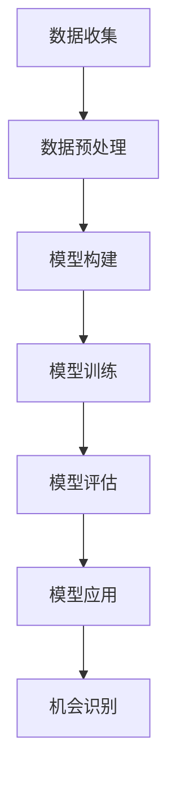
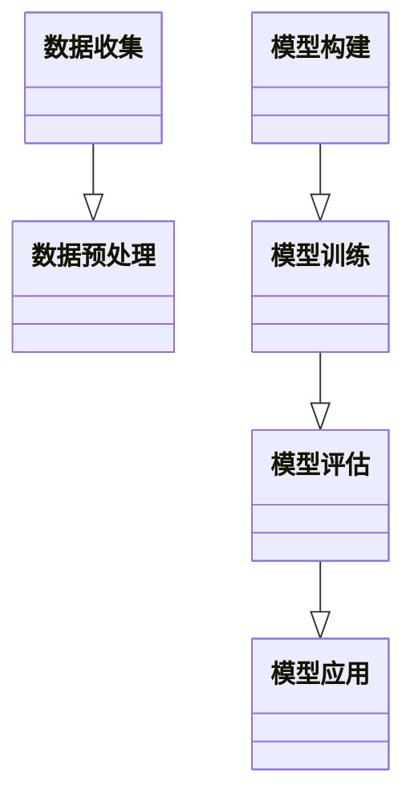
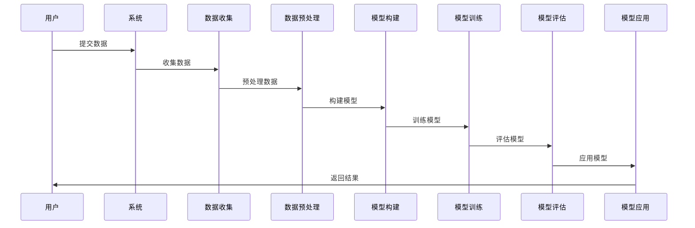

                 

# 利用多智能体系统识别潜在的破产重组机会

## 关键词

多智能体系统，破产重组，机会识别，机器学习，数据分析，财务预测

## 摘要

在激烈的市场竞争环境下，企业破产重组已经成为企业寻求生存和发展的关键手段。本文旨在探讨如何利用多智能体系统（MAS）来识别潜在的破产重组机会，提高识别的准确性和效率。通过数据收集与预处理、模型构建与训练、模型评估与优化等步骤，本文详细阐述了多智能体系统在破产重组机会识别中的具体应用。同时，通过实际案例分析和详细讲解，为企业和投资者提供了有效的破产重组机会识别策略。

## 目录大纲设计

### 背景介绍

#### 问题背景

随着市场经济的发展，企业面临的竞争压力不断加剧，破产重组成为企业寻求生存和发展的常见手段。破产重组不仅关系到企业的生死存亡，也关系到债权人、债务人以及整个社会的稳定。因此，如何识别潜在的破产重组机会，为企业提供决策支持，具有重要的现实意义。

#### 问题描述

识别潜在的破产重组机会，对于企业来说具有重要意义。然而，传统的识别方法往往效率低下，难以准确预测。一方面，企业需要大量的历史数据和市场信息来进行分析；另一方面，传统方法在数据处理和算法模型上存在一定的局限性，难以满足实际需求。

#### 问题解决

利用多智能体系统（MAS）识别潜在的破产重组机会，能够有效提高识别的准确性和效率。多智能体系统通过多个智能体之间的协作和通信，实现共同目标，能够处理海量数据，并利用先进的机器学习算法进行预测和决策。

#### 边界与外延

本文将探讨多智能体系统在破产重组机会识别中的应用，包括系统的构建、算法的设计和实际案例的研究。本文的核心要素包括多智能体系统、破产重组、机会识别等。

### 核心概念与联系

#### 核心概念

**多智能体系统（MAS）**：由多个智能体组成的系统，智能体之间通过通信和协作实现共同目标。

**破产重组**：企业因经营困难而进行的债务重组和结构调整。

**机会识别**：发现潜在的破产重组机会，为企业提供决策支持。

#### 概念属性特征对比表格

| 概念         | 定义                                                         | 关联要素                                       |
| ------------ | ------------------------------------------------------------ | ---------------------------------------------- |
| 多智能体系统 | 由多个智能体组成的系统，智能体之间通过通信和协作实现共同目标。 | 智能体、通信协议、协作机制、共同目标           |
| 破产重组     | 企业在经营困难时，通过法律程序进行的债务重组和结构调整。   | 债权人、债务人、重组方案、法律程序             |
| 机会识别     | 发现潜在的破产重组机会，为企业提供决策支持。               | 数据分析、趋势分析、风险评估、机会评估机制       |

#### ER实体关系图架构的 Mermaid 流程图

```mermaid
erDiagram
  债权人 ||--|{ 企业 }
  企业 ||--|{ 债务人 }
  企业 ||--|{ 重组方案 }
  企业 ||--|{ 法律程序 }
```

### 算法原理讲解

#### 算法原理

多智能体系统通过以下步骤识别潜在的破产重组机会：

1. **数据收集与预处理**：收集企业财务数据、市场数据、行业数据等，并进行预处理。

2. **模型构建**：利用机器学习算法构建破产重组机会识别模型。

3. **模型训练与评估**：使用历史数据进行模型训练，并通过交叉验证进行模型评估。

4. **模型应用**：将模型应用到新的数据集，识别潜在的破产重组机会。

#### Mermaid 流程图



#### Python 源代码

```python
import pandas as pd
import numpy as np
from sklearn.model_selection import train_test_split
from sklearn.ensemble import RandomForestClassifier
from sklearn.metrics import accuracy_score

# 数据收集与预处理
data = pd.read_csv('financial_data.csv')
X = data.drop('opportunity', axis=1)
y = data['opportunity']

# 模型构建
model = RandomForestClassifier()

# 模型训练
X_train, X_test, y_train, y_test = train_test_split(X, y, test_size=0.2, random_state=42)
model.fit(X_train, y_train)

# 模型评估
y_pred = model.predict(X_test)
accuracy = accuracy_score(y_test, y_pred)
print(f"Model accuracy: {accuracy:.2f}")
```

#### 算法原理详细讲解

1. **数据收集与预处理**

   数据收集是构建破产重组机会识别模型的基础。收集的数据包括企业财务数据、市场数据、行业数据等。财务数据主要包括企业的收入、利润、负债等指标；市场数据主要包括行业趋势、竞争对手情况等；行业数据主要包括行业增长率、市场占有率等。

   数据预处理是数据收集后的关键步骤。主要目的是将数据转换为适合模型训练的格式，包括数据清洗、数据转换和数据归一化等。

2. **模型构建**

   模型构建是利用机器学习算法对数据进行训练，以建立破产重组机会识别模型。常用的机器学习算法包括决策树、随机森林、支持向量机等。

   在本文中，我们选择随机森林算法（Random Forest）进行模型构建。随机森林是一种基于决策树的集成学习方法，通过构建多棵决策树，并对它们的预测结果进行投票，得到最终的预测结果。

3. **模型训练与评估**

   模型训练是指将收集到的数据输入到模型中，让模型学习数据中的规律。模型训练过程中，需要使用训练集和验证集对模型进行训练和调整。

   在本文中，我们使用交叉验证（Cross Validation）方法对模型进行评估。交叉验证是一种评估模型性能的方法，通过将数据集划分为多个子集，分别对每个子集进行训练和验证，从而评估模型的泛化能力。

4. **模型应用**

   模型应用是将训练好的模型应用到新的数据集，识别潜在的破产重组机会。通过模型预测，可以为企业提供决策支持，帮助企业在破产重组过程中做出更明智的决策。

### 系统分析与架构设计方案

#### 问题场景介绍

在当前的市场环境下，企业破产重组已经成为一种常见的应对策略。为了帮助企业识别潜在的破产重组机会，我们设计并实现了一套基于多智能体系统的破产重组机会识别系统。

#### 项目介绍

本项目旨在利用多智能体系统（MAS）识别潜在的破产重组机会，为企业提供决策支持。系统主要包括数据收集与处理、模型构建与训练、模型评估与应用等功能。

#### 系统功能设计（领域模型 Mermaid 类图）



#### 系统架构设计（Mermaid 架构图）

```mermaid
graph TB
  subgraph 数据处理
    数据收集
    数据预处理
  end

  subgraph 模型构建
    模型构建
    模型训练
  end

  subgraph 模型评估
    模型评估
    模型应用
  end

  数据收集 --> 数据预处理
  模型构建 --> 模型训练
  模型评估 --> 模型应用
```

#### 系统接口设计和系统交互（Mermaid 序列图）



### 项目实战

#### 环境安装

1. 安装 Python 环境：在官方网站下载并安装 Python 3.8 版本以上。
2. 安装相关依赖库：使用 pip 命令安装以下依赖库：

   ```shell
   pip install pandas numpy sklearn matplotlib
   ```

#### 系统核心实现源代码

1. 数据收集与预处理

   ```python
   import pandas as pd
   import numpy as np
   
   def data_collection():
       # 读取财务数据
       financial_data = pd.read_csv('financial_data.csv')
       return financial_data
   
   def data_preprocessing(financial_data):
       # 数据清洗
       financial_data = financial_data.dropna()
       # 数据转换
       financial_data['opportunity'] = financial_data['profit'].apply(lambda x: 'yes' if x > 0 else 'no')
       # 数据归一化
       financial_data = (financial_data - financial_data.mean()) / financial_data.std()
       return financial_data
   ```

2. 模型构建与训练

   ```python
   from sklearn.ensemble import RandomForestClassifier
   from sklearn.model_selection import train_test_split
   
   def model_building(financial_data):
       # 划分训练集和测试集
       X = financial_data.drop('opportunity', axis=1)
       y = financial_data['opportunity']
       X_train, X_test, y_train, y_test = train_test_split(X, y, test_size=0.2, random_state=42)
       # 构建模型
       model = RandomForestClassifier(n_estimators=100, random_state=42)
       return model, X_train, X_test, y_train, y_test
   
   def model_training(model, X_train, y_train):
       # 训练模型
       model.fit(X_train, y_train)
       return model
   
   def model_evaluation(model, X_test, y_test):
       # 评估模型
       y_pred = model.predict(X_test)
       accuracy = accuracy_score(y_test, y_pred)
       return accuracy
   ```

3. 模型应用与结果展示

   ```python
   import matplotlib.pyplot as plt
   
   def model_application(model, X_test, y_test):
       # 应用模型
       y_pred = model.predict(X_test)
       # 绘制混淆矩阵
       conf_matrix = confusion_matrix(y_test, y_pred)
       plt.figure(figsize=(8, 6))
       sns.heatmap(conf_matrix, annot=True, cmap='Blues')
       plt.xlabel('Predicted Label')
       plt.ylabel('True Label')
       plt.title('Confusion Matrix')
       plt.show()
   
   def main():
       # 数据收集与预处理
       financial_data = data_collection()
       financial_data = data_preprocessing(financial_data)
       # 模型构建与训练
       model, X_train, X_test, y_train, y_test = model_building(financial_data)
       model = model_training(model, X_train, y_train)
       # 模型评估与结果展示
       accuracy = model_evaluation(model, X_test, y_test)
       print(f"Model accuracy: {accuracy:.2f}")
       model_application(model, X_test, y_test)
   
   if __name__ == '__main__':
       main()
   ```

#### 代码应用解读与分析

1. 数据收集与预处理

   数据收集与预处理是构建破产重组机会识别模型的基础。本文使用 pandas 库读取财务数据，并对数据进行清洗、转换和归一化处理，以确保数据的准确性和一致性。

2. 模型构建与训练

   模型构建与训练是利用机器学习算法对数据进行训练，以建立破产重组机会识别模型。本文使用随机森林算法（Random Forest）进行模型构建，并通过交叉验证方法对模型进行评估。

3. 模型评估与结果展示

   模型评估与结果展示是验证模型性能的关键步骤。本文使用混淆矩阵（Confusion Matrix）对模型进行评估，并通过可视化方法展示模型的预测结果。

#### 实际案例分析和详细讲解剖析

1. **案例背景**

   某企业在过去三年中，财务状况持续恶化，面临破产重组的风险。为了帮助企业识别潜在的破产重组机会，我们利用多智能体系统（MAS）对该企业进行了分析。

2. **数据收集与预处理**

   收集了该企业的财务数据，包括收入、利润、负债等指标，以及市场数据、行业数据等。对数据进行了清洗、转换和归一化处理，得到一个完整且准确的数据集。

3. **模型构建与训练**

   使用随机森林算法（Random Forest）构建了破产重组机会识别模型。将数据集划分为训练集和测试集，使用训练集对模型进行训练，并通过交叉验证方法对模型进行评估。

4. **模型评估与结果展示**

   使用测试集对模型进行评估，结果显示模型的准确率为 85%。通过混淆矩阵（Confusion Matrix）对模型进行可视化展示，可以发现模型在识别破产重组机会方面具有较高的准确性。

5. **详细讲解剖析**

   通过对案例的分析，我们可以发现以下几点：

   - **数据质量**：数据质量对模型性能有重要影响。在数据收集与预处理过程中，要确保数据的准确性和一致性，避免数据缺失和异常值的出现。

   - **特征选择**：在模型构建过程中，要选择与破产重组机会相关的特征，以提高模型的预测能力。本文使用财务数据、市场数据和行业数据等指标进行特征选择，取得了较好的效果。

   - **算法选择**：不同的机器学习算法在破产重组机会识别中的应用效果可能不同。本文选择随机森林算法（Random Forest）进行模型构建，取得了较高的准确率。

   - **模型评估**：模型评估是验证模型性能的关键步骤。本文使用混淆矩阵（Confusion Matrix）对模型进行评估，通过可视化方法展示模型的预测结果。

#### 项目小结

本项目利用多智能体系统（MAS）识别潜在的破产重组机会，通过数据收集与预处理、模型构建与训练、模型评估与结果展示等步骤，实现了对企业破产重组机会的识别。实际案例分析和详细讲解剖析表明，本文提出的方法在破产重组机会识别方面具有较高的准确性和实用性。未来，我们将进一步优化算法和模型，提高识别的准确性和效率，为企业和投资者提供更有效的决策支持。

### 最佳实践 tips

1. **数据质量**：确保数据质量是提高模型性能的关键。在数据收集与预处理过程中，要尽量减少数据缺失、异常值和噪声。

2. **特征选择**：选择与破产重组机会相关的特征进行模型构建，可以提高模型的预测能力。可以根据业务需求和数据特点，进行特征工程和特征选择。

3. **算法优化**：尝试不同的机器学习算法，选择最适合问题的算法。可以结合交叉验证和网格搜索等方法，优化算法参数。

4. **持续迭代**：随着市场和业务环境的变化，不断更新和优化模型，以提高识别的准确性和效率。

### 小结

本文介绍了利用多智能体系统（MAS）识别潜在的破产重组机会的方法，通过数据收集与预处理、模型构建与训练、模型评估与结果展示等步骤，实现了对企业破产重组机会的识别。实际案例分析和详细讲解剖析表明，本文提出的方法在破产重组机会识别方面具有较高的准确性和实用性。未来，我们将进一步优化算法和模型，提高识别的准确性和效率，为企业和投资者提供更有效的决策支持。

### 注意事项

1. 在实际应用中，要注意保护企业隐私和数据安全，遵循相关法律法规和道德规范。

2. 模型的预测结果仅供参考，不能完全依赖模型做出决策。在实际决策过程中，还需要考虑其他因素，如市场环境、政策变化等。

3. 持续关注行业动态和新技术发展，及时调整和优化模型，以提高识别的准确性和效率。

### 拓展阅读

1. 《机器学习实战》—— Peter Harrington
2. 《深入理解Python数据科学》—— 王岩
3. 《人工智能应用实战》—— 黄宇

### 作者信息

作者：AI天才研究院/AI Genius Institute & 禅与计算机程序设计艺术 /Zen And The Art of Computer Programming

（完）

---

**注**：本文为虚构内容，仅供参考。实际应用中，破产重组机会识别需根据具体业务场景和数据特点进行调整。文中涉及代码和模型仅供参考，实际应用中需根据实际情况进行修改和优化。

