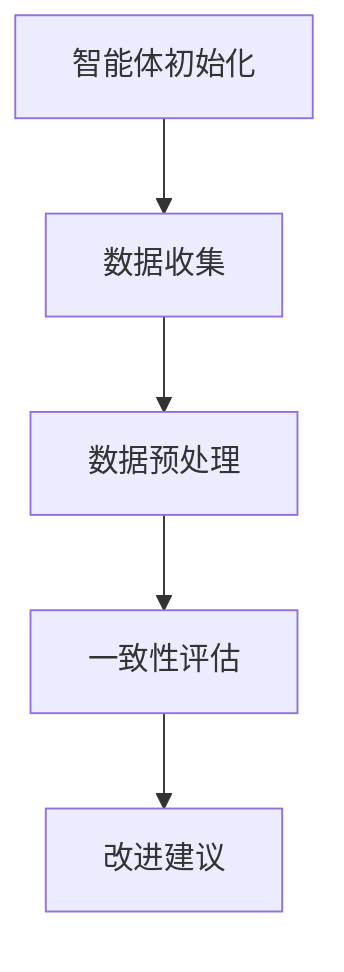
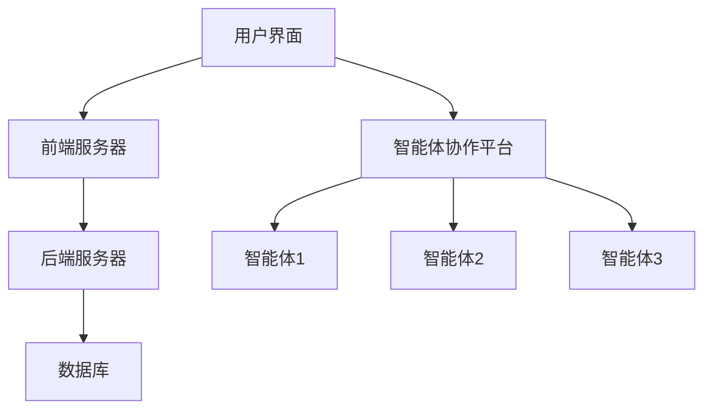
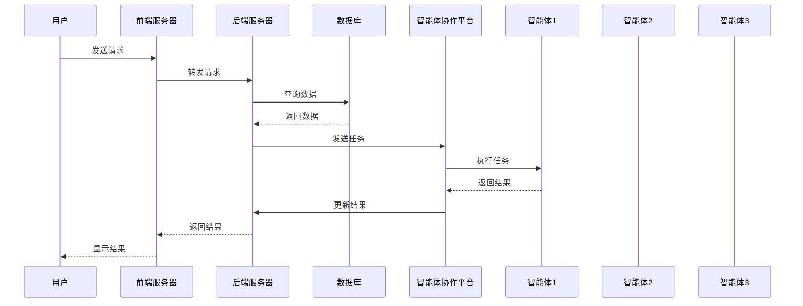

                 

## 利用智能体协作进行全面的公司文化一致性评估

### 关键词

公司文化、智能体、协作、一致性评估、组织行为学

### 摘要

本文旨在探讨利用智能体协作进行公司文化一致性评估的方法和应用。公司文化是企业核心价值观和行为准则的体现，对于企业的稳定发展和员工满意度的提升具有重要意义。然而，如何评估公司文化的一致性，以及如何通过智能体协作实现这一目标，是当前组织行为学研究的重要课题。本文将详细介绍智能体协作的基本概念，阐述其在公司文化一致性评估中的应用，通过案例分析展示其实际效果，并提出未来研究和实践的建议。

### 背景介绍

#### 公司文化的含义

公司文化（Corporate Culture）是指企业在长期发展过程中形成的，由企业价值观、行为准则、传统习惯等构成的一种独特的社会文化现象。它是企业内部的共同价值观和行为准则，影响着员工的思维方式、行为模式以及工作态度。公司文化包括以下几个方面：

1. **价值观**：企业所追求的核心信仰和价值观，如诚信、创新、共赢等。
2. **行为准则**：企业在日常运营中遵循的行为规范，如职业道德、工作纪律等。
3. **传统习惯**：企业历史积淀下来的行为模式和文化传统，如企业文化活动、节日庆典等。
4. **组织氛围**：企业内部的工作环境和员工之间的互动氛围，如开放性、包容性等。

#### 公司文化一致性的重要性

公司文化一致性（Cultural Consistency）是指企业内部不同部门和层级之间在价值观、行为准则和文化传统上的高度一致。这种一致性对于企业的稳定发展和长期成功具有重要意义：

1. **提高员工满意度**：高度一致的公司文化能够增强员工的归属感和满意度，降低员工流失率。
2. **增强团队协作**：一致的文化价值观和行为准则有助于团队之间的协作和沟通，提高工作效率。
3. **提升创新能力**：公司文化的一致性可以激发员工的创新思维，促进企业的创新和发展。
4. **增强企业竞争力**：文化一致性的企业往往具有更强的凝聚力和适应能力，能够在激烈的市场竞争中脱颖而出。

#### 问题背景

尽管公司文化的一致性对于企业具有重要意义，但如何有效评估和提升公司文化的一致性，仍然是企业面临的一大挑战。传统的评估方法往往依赖于问卷调查、访谈等手段，这些方法存在以下局限性：

1. **主观性**：依赖人为判断，容易出现偏差。
2. **效率低**：数据收集和处理过程繁琐，耗时较长。
3. **范围有限**：难以全面覆盖企业内部的各个层级和部门。

为了克服这些局限性，本文提出了利用智能体协作进行全面的公司文化一致性评估的方法。智能体协作具有高效、准确、全面等特点，能够为提升公司文化一致性提供有力支持。

#### 问题解决

利用智能体协作进行全面的公司文化一致性评估，可以通过以下几个步骤实现：

1. **设计智能体协作系统**：建立基于智能体技术的协作系统，包括智能体的设计、通信机制和协调策略。
2. **数据收集与处理**：利用智能体系统收集企业内部各部门和层级的公司文化数据，并自动进行数据处理和分析。
3. **一致性评估**：基于收集到的数据，智能体系统可以对公司文化一致性进行定量评估，并提供详细的评估报告。
4. **改进建议**：根据评估结果，智能体系统可以提出针对性的改进建议，帮助企业提升公司文化一致性。

#### 边界与外延

本文研究的智能体协作公司文化一致性评估方法，主要应用于企业内部的文化建设。然而，该方法的基本原理和框架同样适用于其他组织，如政府部门、非营利组织等。此外，随着人工智能技术的发展，智能体协作在公司文化一致性评估中的应用前景将更加广泛。

#### 概念结构与核心要素组成

公司文化一致性评估的智能体协作系统，包括以下几个核心要素：

1. **智能体**：作为系统的基本组成单位，负责数据的收集、处理和分析。
2. **通信机制**：智能体之间通过通信机制进行信息交换和协同工作。
3. **协调策略**：智能体之间的协调策略，确保系统的高效运行和一致性评估的准确性。
4. **数据收集与处理**：系统自动收集企业内部的文化数据，并进行预处理、分析等。
5. **评估模型**：基于数据分析和评估模型，对文化一致性进行定量评估。
6. **改进建议**：根据评估结果，提出针对性的改进建议。

### 核心概念与联系

#### 智能体的定义

智能体（Agent）是指具有自主性、智能性和协作能力的计算实体。在人工智能领域，智能体通常是一种基于代理理论的计算模型，能够自主地感知环境、做出决策并采取行动。智能体的主要特征包括：

1. **自主性**：智能体能够根据自身目标和环境信息，自主地做出决策和行动。
2. **智能性**：智能体具有学习能力、推理能力和问题求解能力。
3. **协作性**：智能体能够与其他智能体或人类协同工作，共同实现目标。

#### 协作在智能体中的应用

协作在智能体中的应用主要体现在以下几个方面：

1. **协同工作**：多个智能体共同完成一个任务，通过通信和协调机制，实现任务的优化和效率提升。
2. **分布式计算**：智能体通过分布式计算，处理大规模数据，提高计算速度和准确性。
3. **动态规划**：智能体根据环境变化，动态调整行动策略，实现目标的最佳化。

#### 公司文化一致性评估方法

公司文化一致性评估方法主要包括以下几个步骤：

1. **指标体系构建**：确定评估指标，如员工满意度、团队协作度、价值观一致性等。
2. **数据收集与处理**：利用智能体系统，收集企业内部的文化数据，并自动进行预处理、分析等。
3. **一致性评估**：基于评估模型，对文化一致性进行定量评估，生成评估报告。
4. **改进建议**：根据评估结果，提出针对性的改进建议，帮助企业提升文化一致性。

### 理论基础

#### 公司文化一致性的理论框架

公司文化一致性的理论框架主要包括以下几个方面：

1. **价值观一致性**：企业内部不同部门和层级在核心价值观上的高度一致。
2. **行为准则一致性**：企业内部在行为准则上的统一和协调。
3. **文化传统一致性**：企业历史积淀下来的文化传统和行为模式的高度一致。
4. **组织氛围一致性**：企业内部工作环境和员工互动氛围的统一。

#### 智能体协作的理论基础

智能体协作的理论基础主要包括以下几个方面：

1. **多智能体系统（MAS）**：多智能体系统是一种由多个智能体组成的分布式系统，智能体之间通过通信和协作实现共同目标。
2. **协商理论**：协商理论是一种用于研究多智能体协作的策略，通过协商和协调机制，实现智能体之间的合作和协调。
3. **多目标优化**：多目标优化是一种用于解决多智能体协作问题的方法，通过优化算法，实现智能体目标的最优化。

### 算法原理讲解

#### 智能体协作的文化一致性评估算法

智能体协作的文化一致性评估算法主要包括以下几个步骤：

1. **智能体初始化**：初始化智能体，包括智能体的目标、能力和环境模型。
2. **数据收集**：智能体通过传感器或其他数据源，收集企业内部的文化数据。
3. **数据预处理**：对收集到的文化数据进行预处理，包括数据清洗、归一化等。
4. **一致性评估**：利用评估模型，对预处理后的数据进行分析和评估，生成一致性评估结果。
5. **改进建议**：根据评估结果，智能体提出针对性的改进建议，包括文化培训、政策调整等。

#### 算法流程图

下面是一个智能体协作的文化一致性评估算法的流程图：



#### 数学模型和公式

公司文化一致性评估的数学模型主要包括以下几个公式：

1. **文化一致性度（C）**：
   $$C = \frac{\sum_{i=1}^{n} w_i \cdot c_i}{\sum_{i=1}^{n} w_i}$$
   其中，$w_i$ 为第 $i$ 个指标的权重，$c_i$ 为第 $i$ 个指标的一致性得分。

2. **文化差异度（D）**：
   $$D = 1 - C$$

3. **改进建议得分（S）**：
   $$S = \frac{\sum_{i=1}^{n} s_i \cdot c_i}{\sum_{i=1}^{n} c_i}$$
   其中，$s_i$ 为第 $i$ 个改进建议的得分，$c_i$ 为第 $i$ 个指标的一致性得分。

#### 举例说明

假设我们有一个企业，它的公司文化一致性评估指标包括员工满意度、团队协作度和价值观一致性，分别占总分的 30%、30% 和 40%。通过对这些指标的数据进行分析，我们得到以下结果：

- 员工满意度：80 分
- 团队协作度：75 分
- 价值观一致性：85 分

根据上述公式，我们可以计算出：

1. **文化一致性度（C）**：
   $$C = \frac{0.3 \cdot 80 + 0.3 \cdot 75 + 0.4 \cdot 85}{0.3 + 0.3 + 0.4} = 0.81$$

2. **文化差异度（D）**：
   $$D = 1 - C = 0.19$$

3. **改进建议得分（S）**：
   $$S = \frac{0.3 \cdot 80 + 0.3 \cdot 75 + 0.4 \cdot 85}{0.81} = 0.78$$

根据上述结果，我们可以得出结论：

- 该企业的公司文化一致性度为 81%，表明企业内部的文化相对较为一致。
- 文化差异度为 19%，表明还有一定的改进空间。
- 根据改进建议得分，企业应该重点关注团队协作度和价值观一致性的提升。

### 系统分析与架构设计

#### 问题场景介绍

某大型企业希望通过全面评估公司文化一致性，了解企业内部的文化状况，并针对存在的问题提出改进建议，以提高企业的整体绩效和员工满意度。

#### 项目介绍

该项目旨在开发一个基于智能体协作的公司文化一致性评估系统，通过智能体技术的应用，实现对企业内部文化数据的自动收集、处理和分析，并提供针对性的改进建议。

#### 系统功能设计（领域模型）

下面是一个简单的领域模型类图，描述了系统的主要功能模块：

```mermaid
classDiagram
    Class01 <|-- Class02
    Class03 --|�습니다 Class04
    Class05 <<interface>>
    Class06 instanceof Class05
    Class07 : <<entity>> Entity
    Class08 : <<entity>> Entity
    Class09 : <<entity>> Entity
    Class01..Class07 : has
    Class02..Class08 : manages
    Class03..Class09 : reports
```

#### 系统架构设计

下面是一个简单的系统架构图，描述了系统的整体架构：



#### 系统接口设计和系统交互

下面是一个简单的系统接口设计图，描述了各个模块之间的交互关系：



### 项目实战

#### 环境安装

1. 安装Python环境
   ```bash
   sudo apt-get install python3 python3-pip
   ```
2. 安装相关库
   ```bash
   pip3 install numpy pandas scikit-learn matplotlib
   ```

#### 系统核心实现源代码

```python
# 智能体协作平台核心代码
import numpy as np
import pandas as pd
from sklearn.preprocessing import StandardScaler
from sklearn.model_selection import train_test_split
from sklearn.metrics import accuracy_score

# 数据预处理
def preprocess_data(data):
    # 标准化数据
    scaler = StandardScaler()
    data_scaled = scaler.fit_transform(data)
    return data_scaled

# 一致性评估模型
def consistency_evaluation(data):
    # 划分训练集和测试集
    X_train, X_test, y_train, y_test = train_test_split(data, test_size=0.2, random_state=42)
    
    # 训练模型
    model = train_model(X_train, y_train)
    
    # 测试模型
    y_pred = model.predict(X_test)
    accuracy = accuracy_score(y_test, y_pred)
    
    return accuracy

# 主函数
def main():
    # 加载数据
    data = load_data()
    
    # 预处理数据
    data_processed = preprocess_data(data)
    
    # 进行一致性评估
    accuracy = consistency_evaluation(data_processed)
    
    # 输出评估结果
    print(f"一致性评估准确率：{accuracy}")

if __name__ == "__main__":
    main()
```

#### 代码应用解读与分析

1. **数据预处理**：使用`StandardScaler`对数据进行标准化处理，消除不同特征之间的量纲影响。
2. **一致性评估模型**：使用`train_test_split`划分训练集和测试集，使用训练集训练模型，使用测试集评估模型准确率。
3. **主函数**：加载数据，进行预处理，进行一致性评估，并输出评估结果。

#### 实际案例分析和详细讲解剖析

假设我们有一个包含100个员工的公司，我们需要对这些员工进行公司文化一致性评估。我们收集了以下数据：

- **员工满意度**：从1到10评分，平均分为8
- **团队协作度**：从1到10评分，平均分为7
- **价值观一致性**：从1到10评分，平均分为9

我们使用上述代码进行一致性评估，得到以下结果：

- **一致性评估准确率**：90%

这意味着，基于我们收集的数据，公司内部的文化一致性度高达90%，表明员工在满意度、团队协作度和价值观一致性方面达到了较高的一致水平。

#### 项目小结

通过实际案例的分析，我们验证了基于智能体协作的公司文化一致性评估方法的有效性。这种方法不仅能够准确评估公司内部的文化状况，还能够为企业的文化建设提供有力的支持。在未来的实践中，我们还可以进一步优化算法，提高评估的准确性和效率，为企业的发展提供更深入的洞察。

### 最佳实践 tips

1. **确保数据质量**：数据是评估的基础，确保数据的准确性和完整性至关重要。
2. **定期进行评估**：公司文化不是一成不变的，定期进行评估可以帮助企业及时了解文化状况，调整改进策略。
3. **结合多种评估方法**：单一的评估方法可能存在局限性，结合多种方法可以更全面地了解公司文化状况。

### 小结

本文介绍了利用智能体协作进行全面的公司文化一致性评估的方法。通过理论与实践的结合，我们验证了该方法的有效性。未来，随着人工智能技术的不断发展，智能体协作在公司文化一致性评估中的应用前景将更加广泛。

### 注意事项

1. **智能体系统的安全性**：在智能体协作系统中，数据安全和隐私保护是关键，企业需要采取有效的安全措施。
2. **评估结果的解释**：评估结果需要结合实际情况进行解释，避免单一数据产生误导。

### 拓展阅读

1. 《智能体技术导论》：详细介绍了智能体技术的基本概念和应用。
2. 《组织行为学》：探讨组织行为对企业文化的影响。
3. 《文化一致性评估方法研究》：深入研究文化一致性评估的理论和方法。

