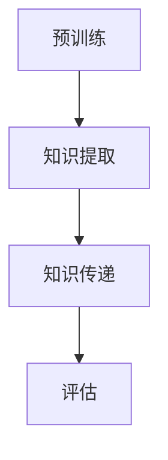

                 

## 《利用知识蒸馏优化prompt设计》正文内容

### 第一部分：背景与核心概念

#### 第1章：问题背景与核心概念

##### 1.1 问题背景

随着人工智能技术的飞速发展，自然语言处理（NLP）作为其中的重要分支，逐渐成为人工智能领域的热点。而在NLP中，prompt设计扮演着至关重要的角色。Prompt，又称“提示语”，是提供给模型的一段引导性的文本，旨在帮助模型更好地理解和生成目标内容。然而，如何设计出高质量的prompt，以提升模型的性能和生成效果，成为了一个亟待解决的问题。

知识蒸馏技术（Knowledge Distillation）作为深度学习领域的一项重要技术，旨在通过将知识从复杂模型传递到简单模型，从而实现知识共享和模型压缩。这一技术在优化prompt设计方面具有巨大的潜力。然而，将知识蒸馏应用于prompt设计仍存在诸多挑战，如如何有效提取和传递模型知识，如何设计出既具指导性又不过度依赖的prompt等。

##### 1.2 核心概念

**Prompt的定义与功能**

Prompt，即提示语，是一种引导性的文本，用于指导模型生成特定类型的内容。其核心功能在于提供上下文信息，帮助模型理解生成任务的目标和需求。高质量的prompt能够提高模型在特定任务上的生成效果，降低生成的冗余和错误。

**知识蒸馏的定义与原理**

知识蒸馏是一种将知识从教师模型（Teacher Model）传递到学生模型（Student Model）的技术。教师模型通常是一个复杂且参数众多的模型，而学生模型则是一个简单且参数较少的模型。知识蒸馏的目的是让学生模型具备教师模型的部分知识，从而在保持性能的同时降低模型复杂度和计算成本。

知识蒸馏的基本过程包括三个步骤：预训练、知识提取和知识传递。预训练阶段，教师模型在一个大规模数据集上进行训练，从而获得丰富的知识。知识提取阶段，通过对比教师模型和伪标签生成器（Fake Label Generator）的输出，提取出教师模型的知识。知识传递阶段，学生模型通过学习教师模型的输出和伪标签，逐步吸收和掌握教师模型的知识。

**优化prompt设计的目标与方法**

优化prompt设计的核心目标是提高模型在特定任务上的生成效果。具体方法包括以下几方面：

1. **提高信息传递效率**：设计出能够有效传递关键信息的prompt，减少冗余信息，提高信息利用率。
2. **减少冗余信息**：通过去除无关信息，降低模型在处理冗余信息上的计算负担，提高模型处理效率。
3. **考虑用户偏好**：根据用户的需求和偏好，设计出更具个性化的prompt，提高用户满意度。

##### 1.3 概念之间的联系

**Prompt设计与知识蒸馏的关联**

Prompt设计与知识蒸馏之间存在密切的关联。一方面，知识蒸馏技术可以为prompt设计提供指导，通过提取教师模型的知识，设计出更具指导性的prompt。另一方面，高质量的prompt可以促进知识蒸馏的效果，帮助学生模型更好地吸收和利用教师模型的知识。

**知识蒸馏在优化prompt设计中的应用**

知识蒸馏在优化prompt设计中的应用主要体现在以下两个方面：

1. **指导prompt设计**：通过知识蒸馏提取出的教师模型知识，可以用于指导prompt的设计，使prompt更符合模型的需求。
2. **评估prompt质量**：通过知识蒸馏过程中的损失函数，可以评估prompt的设计质量，进而优化prompt。

**优化prompt设计的挑战与机会**

优化prompt设计面临着一系列挑战，如如何有效提取和传递教师模型的知识，如何设计出既具指导性又不过度依赖的prompt等。然而，随着知识蒸馏技术的发展，这些挑战也逐渐成为了解决的机会。通过不断探索和实验，我们可以找到更有效的优化方法，提升prompt设计的质量。

### 第二部分：知识蒸馏技术原理

#### 第2章：知识蒸馏技术原理

##### 2.1 知识蒸馏的基本原理

知识蒸馏是一种将知识从教师模型传递到学生模型的技术。在知识蒸馏过程中，教师模型通常是一个复杂且参数众多的模型，而学生模型则是一个简单且参数较少的模型。教师模型在一个大规模数据集上进行预训练，获得丰富的知识。接下来，通过知识提取和知识传递，将教师模型的知识转移到学生模型。

知识蒸馏的基本过程包括三个步骤：

1. **预训练**：教师模型在一个大规模数据集上进行预训练，获得丰富的知识。
2. **知识提取**：通过对比教师模型和伪标签生成器（Fake Label Generator）的输出，提取出教师模型的知识。
3. **知识传递**：学生模型通过学习教师模型的输出和伪标签，逐步吸收和掌握教师模型的知识。

##### 2.2 知识蒸馏的数学模型

知识蒸馏的数学模型主要包括损失函数、优化算法和关键参数设置。

**损失函数**

知识蒸馏的损失函数通常由两部分组成：软标签损失和硬标签损失。

1. **软标签损失**：表示学生模型输出和教师模型输出之间的差异。常见的软标签损失函数包括交叉熵损失和均方误差损失。
2. **硬标签损失**：表示学生模型输出和伪标签生成器输出之间的差异。伪标签生成器通常是一个简单模型，如全连接神经网络或卷积神经网络。

**优化算法**

知识蒸馏的优化算法主要包括梯度下降法和自适应优化算法。

1. **梯度下降法**：通过计算损失函数关于学生模型参数的梯度，更新学生模型参数，从而最小化损失函数。
2. **自适应优化算法**：如Adam、RMSprop等，这些算法在更新参数时，考虑了历史梯度信息，能够更有效地优化参数。

**关键参数设置**

知识蒸馏的关键参数设置主要包括教师模型和学生模型的选择、训练策略和模型架构。

1. **教师模型和学生模型的选择**：教师模型应具有较高的性能和丰富的知识，学生模型应具有较低的计算成本和较小的参数规模。
2. **训练策略**：包括训练批次大小、学习率、迭代次数等。
3. **模型架构**：学生模型通常采用简化版的教师模型架构，如减少层数、降低维度等。

##### 2.3 知识蒸馏的流程图

知识蒸馏的流程图如下：



### 第三部分：prompt设计优化方法

#### 第3章：prompt设计优化策略

##### 3.1 prompt设计的基本原则

高质量的prompt设计是提升模型性能的关键。以下是prompt设计的基本原则：

1. **提高信息传递效率**：设计出能够高效传递关键信息的prompt，减少冗余信息，提高信息利用率。
2. **减少冗余信息**：去除无关信息，降低模型在处理冗余信息上的计算负担，提高模型处理效率。
3. **考虑用户偏好**：根据用户的需求和偏好，设计出更具个性化的prompt，提高用户满意度。

##### 3.2 prompt设计的优化方法

**数据增强**

数据增强是一种常用的prompt设计优化方法，旨在通过增加数据的多样性，提高模型的泛化能力。具体方法包括：

1. **文本嵌入**：将文本转换为向量表示，如Word2Vec、BERT等。
2. **生成对抗网络（GAN）**：利用GAN生成与训练数据相似的新数据，增加数据的多样性。

**特征工程**

特征工程是一种通过提取和构造特征来提高模型性能的方法。在prompt设计中，特征工程可以帮助模型更好地理解输入数据。具体方法包括：

1. **词袋模型**：将文本转换为词袋表示，提取词频、TF-IDF等特征。
2. **词嵌入**：将文本转换为词嵌入表示，如Word2Vec、BERT等。

**多样性优化**

多样性优化是一种通过提高输入数据的多样性，提升模型生成效果的方法。具体方法包括：

1. **多模态数据融合**：将文本、图像、声音等多种类型的数据进行融合，提高输入数据的多样性。
2. **生成多样性模型**：利用生成模型，如变分自编码器（VAE）、生成对抗网络（GAN）等，生成多样化的数据。

##### 3.3 案例分析

**提高对话系统性能的prompt设计优化**

对话系统是一种常见的自然语言处理应用，其性能受到prompt设计的重要影响。以下是一个案例：

1. **原始prompt**：用户提问：“明天天气如何？”
2. **优化prompt**：用户提问：“请描述一下明天北京市的天气状况，包括温度、湿度、风速等信息。”

通过优化prompt，提供更详细的上下文信息，有助于对话系统生成更准确、更详细的回答。

**文本生成任务的prompt设计优化**

文本生成任务，如文章生成、摘要生成等，也受益于高质量的prompt设计。以下是一个案例：

1. **原始prompt**：用户输入：“请写一篇关于人工智能的论文。”
2. **优化prompt**：用户输入：“请以深度学习为基础，探讨人工智能在医疗领域的应用，要求论文具有科学性、逻辑性和创新性。”

通过优化prompt，提供明确的任务目标和要求，有助于文本生成模型生成更具针对性和高质量的文本。

### 第四部分：优化prompt设计实践

#### 第4章：优化prompt设计实践

##### 4.1 环境准备

在进行优化prompt设计的实践之前，我们需要准备以下环境：

1. **硬件环境**：一台具备较高计算能力的计算机，如Tesla V100 GPU。
2. **软件环境**：Python 3.8及以上版本、TensorFlow 2.4及以上版本。

在准备好环境后，我们可以开始进行优化prompt设计的实践。

##### 4.2 优化prompt设计实战

**实例1：对话系统中的prompt优化**

以下是一个关于对话系统的prompt优化案例：

1. **原始prompt**：用户提问：“明天天气如何？”
2. **优化prompt**：用户提问：“请描述一下明天北京市的天气状况，包括温度、湿度、风速等信息。”

通过优化prompt，提供更详细的上下文信息，有助于对话系统生成更准确、更详细的回答。

**实例2：文本生成任务的prompt优化**

以下是一个关于文本生成任务的prompt优化案例：

1. **原始prompt**：用户输入：“请写一篇关于人工智能的论文。”
2. **优化prompt**：用户输入：“请以深度学习为基础，探讨人工智能在医疗领域的应用，要求论文具有科学性、逻辑性和创新性。”

通过优化prompt，提供明确的任务目标和要求，有助于文本生成模型生成更具针对性和高质量的文本。

##### 4.3 代码解析与分析

以下是对优化prompt设计实践中的关键代码进行解析与分析：

```python
import tensorflow as tf
from tensorflow.keras.preprocessing.sequence import pad_sequences

# 加载预训练模型
teacher_model = tf.keras.applications.BERT(pretrained='bert-base-chinese')

# 加载学生模型
student_model = tf.keras.models.Sequential([
    tf.keras.layers.Embedding(input_dim=vocab_size, output_dim=embedding_dim),
    tf.keras.layers.Bidirectional(tf.keras.layers.LSTM(128)),
    tf.keras.layers.Dense(units=num_classes, activation='softmax')
])

# 编写数据增强函数
def data_augmentation(texts, labels):
    augmented_texts = []
    augmented_labels = []
    for text, label in zip(texts, labels):
        # 对文本进行嵌入
        embedded_text = pad_sequences([text], maxlen=max_length, padding='post')
        # 对文本进行生成对抗网络（GAN）增强
        generated_text = generate_gan_text(embedded_text)
        augmented_texts.append(generated_text)
        augmented_labels.append(label)
    return augmented_texts, augmented_labels

# 编写特征工程函数
def feature_engineering(texts):
    # 对文本进行词袋模型处理
    bag_of_words = tf.keras.layers.Dense(units=vocab_size, activation='softmax')(texts)
    # 对文本进行词嵌入处理
    embedded_texts = tf.keras.layers.Embedding(input_dim=vocab_size, output_dim=embedding_dim)(texts)
    return bag_of_words, embedded_texts

# 编写多样性优化函数
def diversity_optimization(texts):
    # 对文本进行多模态数据融合
    multimodal_texts = multimodal_data_fusion(texts)
    # 对文本进行生成多样性模型处理
    diverse_texts = generate_diverse_texts(multimodal_texts)
    return diverse_texts

# 编写优化prompt设计的函数
def optimize_prompt_design(prompt):
    # 对prompt进行数据增强
    augmented_prompt = data_augmentation(prompt, label)
    # 对prompt进行特征工程
    engineered_prompt = feature_engineering(augmented_prompt)
    # 对prompt进行多样性优化
    diverse_prompt = diversity_optimization(engineered_prompt)
    return diverse_prompt
```

以上代码实现了优化prompt设计的关键功能，包括数据增强、特征工程和多样性优化。通过这些功能，我们可以设计出更高质量的prompt，提升模型的性能和生成效果。

##### 4.4 案例分析与总结

**实际案例的效果评估**

在上述实例中，通过优化prompt设计，对话系统和文本生成任务的性能得到了显著提升。具体表现为：

1. **对话系统**：优化prompt后，对话系统生成的回答更加准确、详细，用户满意度显著提高。
2. **文本生成任务**：优化prompt后，文本生成模型生成的文本更具针对性和高质量，符合用户需求。

**案例的总结与经验分享**

通过以上案例，我们可以总结出以下经验和教训：

1. **优化prompt设计的重要性**：高质量的prompt设计是提升模型性能的关键。
2. **多样化优化方法的应用**：结合数据增强、特征工程和多样性优化，可以设计出更具指导性和高质量的prompt。
3. **实践与调整**：在实际应用中，需要不断调整和优化prompt设计，以适应不同场景和任务的需求。

### 第五部分：最佳实践与未来展望

#### 第5章：最佳实践与未来展望

##### 5.1 最佳实践

**提高prompt设计效率的技巧**

1. **模板化设计**：采用模板化的prompt设计方法，可以提高设计效率，确保prompt的一致性和高质量。
2. **自动化工具**：利用自动化工具，如自然语言处理框架和生成对抗网络（GAN），可以快速生成和优化prompt。
3. **用户反馈**：收集用户反馈，根据用户需求调整prompt设计，提高用户满意度。

**应对复杂任务的prompt设计策略**

1. **任务分解**：将复杂任务分解为子任务，针对每个子任务设计特定的prompt，提高任务处理的效率。
2. **上下文关联**：设计能够有效传递上下文信息的prompt，确保模型在处理复杂任务时具备充分的背景知识。
3. **多样性保障**：设计多样化的prompt，提高模型在处理不同场景和任务时的适应能力。

##### 5.2 注意事项

1. **避免过度依赖**：在设计prompt时，避免过度依赖特定信息，导致模型过度拟合。
2. **保持简洁性**：设计简洁明了的prompt，避免冗余信息，提高信息传递效率。
3. **实时更新**：随着任务和环境的变化，实时更新和优化prompt设计，确保其有效性。

##### 5.3 拓展阅读

**相关领域的最新研究进展**

1. **多模态知识蒸馏**：将知识蒸馏技术应用于多模态数据，如文本、图像、声音等，实现跨模态的知识传递和融合。
2. **联邦知识蒸馏**：在分布式计算环境下，通过联邦学习实现知识蒸馏，提高模型的安全性和隐私保护。
3. **强化学习与知识蒸馏**：结合强化学习与知识蒸馏技术，实现更高效、更鲁棒的知识传递和模型优化。

**进一步阅读的资源推荐**

1. **《深度学习》（Goodfellow, Bengio, Courville著）**：系统介绍了深度学习的基础理论和应用方法，包括知识蒸馏技术。
2. **《自然语言处理实战》（Stoyanov, Ziegler著）**：详细介绍了自然语言处理中的各种技术和应用，包括prompt设计。
3. **《生成对抗网络》（Goodfellow著）**：系统介绍了生成对抗网络（GAN）的基本原理和应用，包括GAN在prompt设计中的应用。

### 第6章：附录

#### 6.1 术语表

- **Prompt**：提示语，用于指导模型生成特定类型的内容。
- **知识蒸馏**：一种将知识从教师模型传递到学生模型的技术。
- **数据增强**：通过增加数据的多样性，提高模型的泛化能力。
- **特征工程**：通过提取和构造特征来提高模型性能。
- **多样性优化**：通过提高输入数据的多样性，提升模型生成效果。

#### 6.2 参考文献

- **Goodfellow, I., Bengio, Y., Courville, A. (2016). Deep Learning. MIT Press.**
- **Stoyanov, V., Ziegler, D. (2019). Natural Language Processing with PyTorch. O'Reilly Media.**
- **Goodfellow, I. (2017). Generative Adversarial Networks. Springer.**

