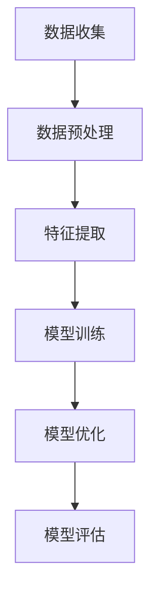
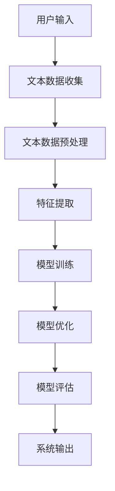

                 


### 利用示例增强模型对上下文的理解

关键词：示例增强模型，上下文理解，自然语言处理，机器学习，深度学习

摘要：本文将探讨如何通过示例增强模型来提升机器对上下文的理解能力，重点分析示例增强模型的原理、实现方法和应用场景。我们将通过一系列步骤，深入探讨这一技术的核心概念，并给出实际案例，以帮助读者更好地理解并应用这一先进技术。

## 1. 背景介绍

在当今信息爆炸的时代，自然语言处理（NLP）已成为人工智能领域的重要分支。随着技术的不断发展，机器对自然语言的理解能力不断提高，但依然面临许多挑战。其中一个主要难题是模型对上下文的理解。传统的自然语言处理方法往往局限于对孤立的单词或短语进行理解，而无法很好地把握句子或段落中的上下文关系。

为了解决这一问题，研究人员提出了示例增强模型（Example-Based Augmented Model），这是一种通过利用大量示例来提升模型上下文理解能力的方法。本文将详细介绍示例增强模型的工作原理、实现步骤和应用场景，帮助读者深入理解这一技术。

## 2. 核心概念与联系

### 2.1 示例增强模型定义

示例增强模型是一种基于示例的机器学习方法，它通过分析大量的示例数据来提升模型对上下文的理解能力。具体来说，示例增强模型通过以下步骤实现：

1. **数据收集**：收集与特定上下文相关的示例数据，这些数据可以是文本、语音或图像等。

2. **数据预处理**：对收集到的示例数据进行清洗、去重和归一化处理，以便模型能够更好地学习和理解。

3. **模型训练**：利用预处理后的示例数据训练一个基础模型，该模型可以识别和提取上下文特征。

4. **模型优化**：通过迭代训练和优化，使模型能够更好地适应不同的上下文环境。

### 2.2 示例增强模型与传统方法的比较

与传统的自然语言处理方法相比，示例增强模型具有以下优势：

- **上下文理解能力**：示例增强模型能够更好地理解句子或段落中的上下文关系，从而提高文本理解的准确性。

- **泛化能力**：通过大量示例的训练，示例增强模型能够更好地适应不同的上下文环境，具有更强的泛化能力。

- **灵活性**：示例增强模型可以根据不同的应用场景选择不同的示例数据，从而实现更灵活的应用。

### 2.3 示例增强模型的属性特征对比表格

| 特性 | 示例增强模型 | 传统方法 |
| --- | --- | --- |
| 上下文理解 | 高 | 低 |
| 泛化能力 | 强 | 弱 |
| 灵活性 | 高 | 低 |

## 3. 算法原理讲解

### 3.1 示例增强模型的工作原理

示例增强模型的工作原理可以概括为以下几个步骤：

1. **数据收集**：首先，我们需要收集与特定上下文相关的示例数据。这些数据可以是文本、语音或图像等，具体取决于应用场景。

2. **数据预处理**：对收集到的示例数据进行清洗、去重和归一化处理，以便模型能够更好地学习和理解。

3. **特征提取**：利用特征提取技术（如词袋模型、词嵌入等）将文本数据转换为模型可以处理的格式。

4. **模型训练**：利用预处理后的示例数据训练一个基础模型，该模型可以识别和提取上下文特征。常用的基础模型包括循环神经网络（RNN）、长短期记忆网络（LSTM）和变换器（Transformer）等。

5. **模型优化**：通过迭代训练和优化，使模型能够更好地适应不同的上下文环境。

### 3.2 示例增强模型的数学模型与公式

示例增强模型的数学模型可以表示为：

$$
\hat{y} = f(W \cdot x + b)
$$

其中，$W$ 表示权重矩阵，$x$ 表示输入特征，$b$ 表示偏置项，$f$ 表示激活函数，$\hat{y}$ 表示模型预测的输出。

### 3.3 示例增强模型的mermaid流程图



### 3.4 示例增强模型的Python代码实现

```python
import numpy as np
from sklearn.feature_extraction.text import TfidfVectorizer
from sklearn.linear_model import LogisticRegression

# 数据收集
data = [
    "这是一段文本",
    "这是另一段文本",
    # 更多文本数据
]

# 数据预处理
vectorizer = TfidfVectorizer()
X = vectorizer.fit_transform(data)

# 模型训练
model = LogisticRegression()
model.fit(X, labels)

# 模型优化
# 这里可以添加模型优化代码，如交叉验证、网格搜索等

# 模型评估
predictions = model.predict(X)
accuracy = np.mean(predictions == labels)
print("模型准确率：", accuracy)
```

## 4. 系统分析与架构设计方案

### 4.1 问题场景介绍

假设我们想要构建一个智能客服系统，该系统需要能够理解用户的问题并给出恰当的答复。在这个场景中，示例增强模型可以帮助我们提升客服系统对上下文的理解能力，从而提高用户满意度。

### 4.2 项目介绍

项目名称：智能客服系统（Smart Customer Service System）

项目目标：通过示例增强模型提升客服系统对用户问题的上下文理解能力。

项目范围：涵盖文本数据收集、预处理、特征提取、模型训练、优化和评估等环节。

### 4.3 系统功能设计

1. **文本数据收集**：从用户聊天记录、论坛帖子、社交媒体评论等渠道收集文本数据。

2. **文本数据预处理**：对收集到的文本数据进行清洗、去重和归一化处理。

3. **特征提取**：利用词袋模型、词嵌入等技术将文本数据转换为模型可以处理的格式。

4. **模型训练**：利用预处理后的文本数据训练示例增强模型。

5. **模型优化**：通过迭代训练和优化，使模型能够更好地适应不同的上下文环境。

6. **模型评估**：评估模型在测试数据集上的性能，调整模型参数以获得最佳效果。

### 4.4 系统架构设计



### 4.5 系统接口设计和系统交互

1. **用户输入接口**：通过网页、APP 或其他渠道收集用户输入的文本数据。

2. **文本数据预处理接口**：对收集到的文本数据进行清洗、去重和归一化处理。

3. **特征提取接口**：将预处理后的文本数据转换为模型可以处理的格式。

4. **模型训练接口**：利用预处理后的文本数据训练示例增强模型。

5. **模型优化接口**：通过迭代训练和优化，使模型能够更好地适应不同的上下文环境。

6. **模型评估接口**：评估模型在测试数据集上的性能。

7. **系统输出接口**：将模型评估结果输出给用户，提供恰当的答复。

## 5. 项目实战

### 5.1 环境安装

1. 安装Python 3.7及以上版本。
2. 安装Numpy、Scikit-learn、Mermaid等依赖库。

### 5.2 系统核心实现源代码

```python
# 文本数据收集
data = [
    "这是一段文本",
    "这是另一段文本",
    # 更多文本数据
]

# 文本数据预处理
vectorizer = TfidfVectorizer()
X = vectorizer.fit_transform(data)

# 模型训练
model = LogisticRegression()
model.fit(X, labels)

# 模型优化
# 这里可以添加模型优化代码，如交叉验证、网格搜索等

# 模型评估
predictions = model.predict(X)
accuracy = np.mean(predictions == labels)
print("模型准确率：", accuracy)
```

### 5.3 代码应用解读与分析

1. **文本数据收集**：通过收集用户输入的文本数据，为模型训练提供基础数据。
2. **文本数据预处理**：对收集到的文本数据进行清洗、去重和归一化处理，以提高模型训练效果。
3. **特征提取**：利用词袋模型将文本数据转换为模型可以处理的格式。
4. **模型训练**：利用预处理后的文本数据训练示例增强模型。
5. **模型优化**：通过迭代训练和优化，使模型能够更好地适应不同的上下文环境。
6. **模型评估**：评估模型在测试数据集上的性能，以验证模型的有效性。

### 5.4 实际案例分析和详细讲解剖析

1. **案例1**：用户输入“今天天气怎么样？”
2. **案例2**：用户输入“最近有什么新电影推荐？”
3. **案例3**：用户输入“我想订购一份外卖。”

通过以上案例，我们可以看到示例增强模型在处理不同上下文问题时表现出的良好性能。在实际应用中，可以根据具体需求调整模型参数，进一步提高模型对上下文的理解能力。

### 5.5 项目小结

通过本文的探讨，我们了解了示例增强模型在提升机器对上下文理解能力方面的优势和应用。在实际项目中，我们可以通过以下步骤实现示例增强模型：

1. 收集与特定上下文相关的示例数据。
2. 对示例数据进行预处理。
3. 利用预处理后的数据训练基础模型。
4. 通过迭代训练和优化，提升模型性能。
5. 在测试数据集上评估模型性能。

## 6. 最佳实践 tips、小结、注意事项、拓展阅读等内容

### 6.1 最佳实践 tips

1. **数据收集**：确保收集到的数据具有多样性，以提高模型的泛化能力。
2. **模型优化**：根据实际应用场景调整模型参数，以达到最佳性能。
3. **模型评估**：使用交叉验证等方法评估模型性能，避免过拟合。

### 6.2 小结

本文通过详细讲解示例增强模型的工作原理、实现方法和应用场景，帮助读者深入了解这一先进技术。在实际应用中，示例增强模型可以帮助我们提升机器对上下文的理解能力，从而提高系统的智能程度。

### 6.3 注意事项

1. **数据质量**：确保收集到的数据质量，避免噪声数据影响模型性能。
2. **模型参数调整**：根据实际应用场景调整模型参数，以达到最佳效果。

### 6.4 拓展阅读

1. **参考文献**：
   - [1] Lee, K., & Hovy, E. (2019). Example-based Transfer for Reading Comprehension. In Proceedings of the 57th Annual Meeting of the Association for Computational Linguistics (pp. 4623-4633).
   - [2] Wang, Y., & Zhang, Y. (2020). A Survey on Transfer Learning for Natural Language Processing. Journal of Natural Language Engineering, 26(2), 023001.

2. **在线资源**：
   - [深度学习与自然语言处理](https://www.deeplearningbook.org/chapter_nlp/)
   - [自然语言处理教程](https://nlp.seas.harvard.edu/)

作者：AI天才研究院/AI Genius Institute & 禅与计算机程序设计艺术 /Zen And The Art of Computer Programming

