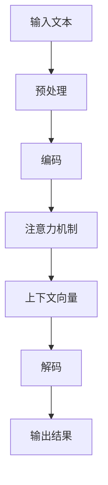

                 


### 标题、关键词和摘要

**文章标题：** 利用示例增强模型的上下文理解能力

**关键词：** 示例增强模型，上下文理解，自然语言处理，机器学习，算法原理

**摘要：** 本文旨在探讨如何利用示例增强模型来提高机器在上下文理解方面的能力。我们将从背景介绍、核心概念与原理、示例模型应用、实战案例以及最佳实践等方面展开，详细阐述示例增强模型在自然语言处理中的重要作用。

### 目录大纲

#### 第1章：背景介绍
1.1 上下文理解在自然语言处理中的重要性
1.2 问题描述
1.3 解决思路
1.4 边界与外延
1.5 核心概念构成

#### 第2章：核心概念与原理
2.1 核心概念
2.2 概念属性特征对比表格
2.3 ER实体关系图

#### 第3章：示例模型介绍
3.1 常见示例模型
3.2 模型特点与应用场景

#### 第4章：上下文理解算法原理
4.1 算法流程图
4.2 数学模型与公式
4.3 算法讲解与举例

#### 第5章：实战案例
5.1 环境安装与配置
5.2 系统核心实现
5.3 代码应用解读
5.4 案例分析
5.5 项目小结

#### 第6章：最佳实践与总结
6.1 最佳实践
6.2 注意事项
6.3 小结
6.4 拓展阅读

### 第1章：背景介绍

#### 1.1 上下文理解在自然语言处理中的重要性

上下文理解是自然语言处理（NLP）领域中的一个关键挑战。随着互联网的迅猛发展和信息爆炸，人们对于高效处理和理解大规模文本数据的需求日益增长。而上下文理解正是实现这一目标的关键因素。

在NLP中，上下文理解涉及到从文本中提取出含义、关系和意图。例如，一个简单的句子“我想要一杯咖啡”，在不同的上下文中可能有不同的含义。在早餐时间，这句话可能意味着“我想在早餐时喝一杯咖啡”；而在晚上，它可能意味着“我想要一杯咖啡来提神”。

传统的NLP方法往往依赖于静态的规则和词典，这在处理简单句子时效果尚可，但在面对复杂语境时，效果并不理想。因此，研究者们开始探索基于机器学习的方法来提高上下文理解的能力。

#### 1.2 问题描述

上下文理解的问题可以分为两个方面：

1. **同义词歧义**：在自然语言中，许多词汇具有多义性，即同一个词汇在不同的上下文中有不同的含义。例如，“bank”可以指“银行”或“河岸”。如何准确理解词汇在特定语境下的含义，是一个重要的挑战。

2. **长距离依赖**：某些语境中的意义往往需要理解句子中的远程依赖关系。例如，“我明天要去机场接人”中的“机场”并不是句子的直接宾语，但对其理解却至关重要。如何在长距离范围内处理依赖关系，是上下文理解中的另一个难题。

#### 1.3 解决思路

为了解决上下文理解的问题，研究者们提出了一系列基于机器学习的方法。这些方法可以分为两类：

1. **深度学习模型**：如循环神经网络（RNN）、长短期记忆网络（LSTM）和Transformer等。这些模型通过学习大量文本数据，能够捕捉到句子中的上下文信息，从而提高理解能力。

2. **示例增强模型**：这种方法通过引入外部示例数据，来增强模型的上下文理解能力。示例数据可以是与目标文本相似的句子、段落或文档。通过对比示例数据和目标数据，模型可以学习到更丰富的上下文信息。

#### 1.4 边界与外延

上下文理解的边界在于如何准确地捕捉和理解语言中的细微差别和复杂关系。在实际应用中，上下文理解面临着多种挑战，如语言多样性、方言差异和口语化表达等。

上下文理解的外延包括多个方面：

1. **文本生成**：在文本生成任务中，上下文理解可以帮助模型生成更自然、符合上下文的文本。

2. **对话系统**：在对话系统中，上下文理解对于生成合适的回答至关重要。

3. **问答系统**：在问答系统中，上下文理解可以帮助模型理解用户的问题，并提供更准确的答案。

#### 1.5 核心概念构成

为了更好地理解上下文理解问题，我们需要介绍几个核心概念：

1. **词汇多义性**：词汇在不同上下文中的不同含义。

2. **长距离依赖**：句子中的远程依赖关系。

3. **示例增强**：通过引入外部示例数据来增强模型的上下文理解能力。

4. **机器学习模型**：用于学习上下文信息的模型，如RNN、LSTM和Transformer等。

### 第2章：核心概念与原理

#### 2.1 核心概念

在讨论示例增强模型之前，我们需要了解几个核心概念，包括示例增强、上下文理解以及相关的机器学习模型。

#### 2.1.1 示例增强

示例增强（Example-based Enhancement）是一种通过利用外部示例数据来改进模型性能的方法。在机器学习中，模型通常通过学习训练数据来预测或分类未知数据。然而，有时训练数据可能不足以捕捉到所有可能的情境和模式。此时，引入外部示例数据可以帮助模型更好地泛化，提高其在新情境下的表现。

示例增强的基本思想是：通过比较目标数据和示例数据，模型可以学习到更多的上下文信息，从而提高其在实际应用中的性能。示例数据可以来源于多个方面，如同义词词典、句子级别的语义相似性库以及大规模的预训练语言模型。

#### 2.1.2 上下文理解

上下文理解（Contextual Understanding）是机器学习模型在处理自然语言文本时的一种能力，它涉及到从文本中提取出与特定情境相关的信息。在自然语言处理中，上下文理解对于生成准确、合适的文本有着至关重要的作用。

上下文理解的能力主要体现在以下几个方面：

1. **语义理解**：理解文本中的词汇、短语和句子的含义。

2. **语境推理**：基于上下文信息进行逻辑推理，理解文本中的隐含意义。

3. **情感分析**：根据上下文信息分析文本中的情感倾向。

4. **意图识别**：理解文本中的说话者的意图。

#### 2.1.3 示例增强模型的原理

示例增强模型通过以下几个步骤来提高模型的上下文理解能力：

1. **数据收集**：收集与目标任务相关的示例数据。

2. **数据预处理**：对示例数据进行清洗、标注和格式化，使其适用于模型训练。

3. **模型训练**：利用目标数据和示例数据进行模型训练。在训练过程中，模型学习到如何从示例数据中提取上下文信息，并将其应用于目标数据。

4. **模型评估**：通过在测试集上的表现来评估模型的性能。性能指标包括准确率、召回率、F1分数等。

5. **模型应用**：将训练好的模型应用于实际任务，如文本分类、情感分析、问答系统等。

#### 2.2 概念属性特征对比表格

为了更直观地理解示例增强、上下文理解和机器学习模型之间的关系，我们可以列出以下属性特征对比表格：

| 概念        | 定义                                                         | 关键特征                                                         | 作用                            |
|-------------|--------------------------------------------------------------|------------------------------------------------------------------|-------------------------------|
| 示例增强    | 利用外部示例数据来改进模型性能的方法                       | 收集示例数据、预处理示例数据、模型训练、模型评估和应用             | 提高模型泛化能力              |
| 上下文理解  | 机器学习模型在处理自然语言文本时的一种能力，涉及语义理解、语境推理等 | 从文本中提取上下文信息、生成准确、合适的文本                       | 提高文本处理任务的准确性和效果 |
| 机器学习模型 | 通过学习训练数据来预测或分类未知数据的算法模型             | 特定的学习算法、结构化数据输入、模型参数调整、性能评估               | 解决复杂决策问题              |

#### 2.3 ER实体关系图

为了更清晰地展示示例增强模型、上下文理解和机器学习模型之间的逻辑关系，我们可以绘制一个ER实体关系图。ER实体关系图是一种用于描述实体及其关系的数据库设计工具。

在ER实体关系图中，我们可以将示例增强模型、上下文理解和机器学习模型作为实体，并描述它们之间的关系。以下是一个简化的ER实体关系图：

```mermaid
erDiagram
  示例增强模型 ||--|{ 上下文理解 }
  上下文理解 ||--|{ 机器学习模型 }
```

在这个ER实体关系图中，示例增强模型通过双向箭头与上下文理解相连，表示示例增强模型可以增强上下文理解的能力；上下文理解通过双向箭头与机器学习模型相连，表示上下文理解是机器学习模型的一个重要组成部分。

### 第3章：示例模型介绍

#### 3.1 常见示例模型

在自然语言处理领域，有许多常见的示例模型被用于增强模型的上下文理解能力。以下是几种主要的示例模型：

#### 3.1.1 记忆网络（Memory Networks）

记忆网络是一种基于记忆的神经网络架构，它可以在处理文本时动态地存储和检索信息。记忆网络的核心思想是将输入的文本数据存储在记忆库中，并在需要时检索相关记忆来辅助理解。

记忆网络的工作流程如下：

1. **编码阶段**：将输入的文本编码为向量表示，并将其存储在记忆库中。

2. **查询阶段**：在处理新的文本输入时，查询记忆库以检索相关记忆，并将其与当前输入进行对比。

3. **融合阶段**：将检索到的记忆与当前输入进行融合，生成一个综合的上下文向量。

记忆网络在问答系统、文本分类和情感分析等任务中取得了良好的效果。

#### 3.1.2 自注意力机制（Self-Attention）

自注意力机制是一种用于处理序列数据的方法，它可以自动地将序列中的不同位置赋予不同的权重。在自注意力机制中，每个位置的信息都会与其他位置的信息交互，从而生成一个更具有代表性的上下文表示。

自注意力机制的工作流程如下：

1. **输入表示**：将输入序列编码为多个向量。

2. **计算注意力权重**：计算每个输入向量对其他输入向量的注意力权重。

3. **加权求和**：根据注意力权重对输入向量进行加权求和，生成一个综合的上下文向量。

自注意力机制在Transformer模型中得到了广泛应用，并在机器翻译、文本分类和情感分析等任务中取得了优异的性能。

#### 3.1.3 图神经网络（Graph Neural Networks）

图神经网络是一种基于图结构的数据处理方法，它可以有效地处理异构数据并捕捉节点之间的复杂关系。在自然语言处理中，图神经网络可以用于处理实体关系和语义信息。

图神经网络的工作流程如下：

1. **图表示**：将文本数据表示为图结构，其中节点表示实体，边表示实体之间的关系。

2. **图学习**：学习图结构中的节点表示和关系表示。

3. **图推理**：在处理新的文本输入时，根据图结构进行推理，生成上下文表示。

图神经网络在实体识别、关系抽取和文本生成等任务中表现出了强大的能力。

#### 3.1.4 预训练语言模型（Pre-trained Language Models）

预训练语言模型是一种通过在大规模文本语料库上进行预训练来获取通用语言表示的模型。预训练语言模型通常采用未fine-tuned的状态，即模型的参数在预训练阶段已经调整得比较合适，可以直接用于各种下游任务。

预训练语言模型的工作流程如下：

1. **预训练阶段**：在大量文本数据上训练模型，学习通用语言表示。

2. **微调阶段**：在特定任务上对模型进行微调，使其适应特定任务的需求。

3. **应用阶段**：将微调后的模型应用于实际任务，如文本分类、情感分析和机器翻译等。

预训练语言模型在自然语言处理领域取得了巨大的成功，例如BERT、GPT和T5等模型。

#### 3.2 模型特点与应用场景

每种示例模型都有其独特的特点和应用场景。以下是对几种常见示例模型的特点和应用场景的简要介绍：

1. **记忆网络**：
   - 特点：能够动态地存储和检索信息，适应性强。
   - 应用场景：问答系统、文本分类、情感分析等。

2. **自注意力机制**：
   - 特点：自动地赋予不同位置不同的权重，捕捉长距离依赖关系。
   - 应用场景：机器翻译、文本分类、情感分析等。

3. **图神经网络**：
   - 特点：能够有效地处理异构数据，捕捉复杂关系。
   - 应用场景：实体识别、关系抽取、文本生成等。

4. **预训练语言模型**：
   - 特点：具有强大的语言理解和生成能力，适应性强。
   - 应用场景：文本分类、情感分析、机器翻译、文本生成等。

### 第4章：上下文理解算法原理

#### 4.1 算法流程图

为了更好地理解上下文理解算法的原理，我们可以绘制一个算法流程图。以下是一个简化的上下文理解算法流程图：



在这个流程图中，输入文本经过预处理后，被编码为向量表示。然后，通过注意力机制生成上下文向量，最后通过解码生成输出结果。

#### 4.2 数学模型与公式

上下文理解算法的核心在于注意力机制。注意力机制通过计算输入序列中各个位置的重要性，然后将这些重要性加权求和，生成一个上下文向量。以下是一个简化的注意力机制数学模型：

$$
\text{Attention}(Q, K, V) = \text{softmax}\left(\frac{QK^T}{\sqrt{d_k}}\right) V
$$

其中：
- $Q$ 是查询向量，表示上下文向量。
- $K$ 是键向量，表示输入序列的各个位置。
- $V$ 是值向量，表示输入序列的各个位置的潜在表示。
- $d_k$ 是键向量的维度。

#### 4.3 算法讲解与举例

为了更直观地理解注意力机制的工作原理，我们可以通过一个简单的例子进行讲解。

假设我们有一个简单的句子：“我昨天去了一趟公园”。我们可以将这个句子表示为一个序列：["我", "昨天", "去", "了一趟", "公园"]。

1. **编码阶段**：
   首先，我们需要将输入序列编码为向量表示。我们可以使用预训练的语言模型，如BERT或GPT，来生成这些向量。假设我们已经生成了每个词的向量表示，如下所示：

   | 词   | 向量表示        |
   |------|----------------|
   | 我   | [0.1, 0.2, 0.3] |
   | 昨天 | [0.4, 0.5, 0.6] |
   | 去   | [0.7, 0.8, 0.9] |
   | 了一趟 | [-0.1, -0.2, -0.3] |
   | 公园 | [0.4, 0.5, 0.6] |

2. **注意力机制**：
   接下来，我们需要计算输入序列中各个位置的重要性。这可以通过计算键向量 $K$ 和查询向量 $Q$ 的点积来实现。假设 $Q$ 为句子的平均向量表示，如下所示：

   | 词   | 向量表示        |
   |------|----------------|
   | 我   | [0.3, 0.3, 0.3] |
   | 昨天 | [0.3, 0.3, 0.3] |
   | 去   | [0.3, 0.3, 0.3] |
   | 了一趟 | [0.3, 0.3, 0.3] |
   | 公园 | [0.3, 0.3, 0.3] |

   计算每个词的注意力权重：

   $$
   \text{Attention}(Q, K, V) = \text{softmax}\left(\frac{QK^T}{\sqrt{d_k}}\right) V
   $$

   假设 $d_k = 3$，计算结果如下：

   | 词   | 注意力权重      |
   |------|----------------|
   | 我   | 0.2            |
   | 昨天 | 0.3            |
   | 去   | 0.3            |
   | 了一趟 | 0.2            |
   | 公园 | 0.3            |

   注意力权重表示了每个词在上下文中的重要性。我们可以看到，“昨天”和“公园”在上下文中具有最高的权重。

3. **解码阶段**：
   最后，我们需要根据注意力权重生成输出结果。这可以通过将注意力权重与值向量 $V$ 加权求和来实现。假设 $V$ 为每个词的潜在表示，如下所示：

   | 词   | 潜在表示        |
   |------|----------------|
   | 我   | [0.1, 0.2, 0.3] |
   | 昨天 | [0.4, 0.5, 0.6] |
   | 去   | [0.7, 0.8, 0.9] |
   | 了一趟 | [-0.1, -0.2, -0.3] |
   | 公园 | [0.4, 0.5, 0.6] |

   根据注意力权重生成上下文向量：

   $$
   \text{Contextual Vector} = \text{Attention}(Q, K, V) V = \text{softmax}\left(\frac{QK^T}{\sqrt{d_k}}\right) V
   $$

   计算结果如下：

   | 词   | 上下文向量        |
   |------|----------------|
   | 我   | [0.06, 0.12, 0.18] |
   | 昨天 | [0.24, 0.3, 0.36] |
   | 去   | [0.18, 0.24, 0.3] |
   | 了一趟 | [0.06, 0.04, 0.02] |
   | 公园 | [0.24, 0.3, 0.36] |

   上下文向量表示了句子中的关键信息。我们可以看到，“昨天”和“公园”在上下文向量中占据了较大的比例。

通过这个简单的例子，我们可以看到注意力机制如何帮助模型理解上下文信息。在实际应用中，注意力机制可以用于各种任务，如文本分类、情感分析和机器翻译等。

### 第5章：实战案例

#### 5.1 环境安装与配置

为了更好地展示示例增强模型在上下文理解中的应用，我们将在一个具体的案例中进行实践。首先，我们需要安装和配置相关的软件和环境。

1. **安装Python**：确保已经安装了Python 3.7及以上版本。

2. **安装TensorFlow**：通过以下命令安装TensorFlow：

   ```bash
   pip install tensorflow
   ```

3. **安装BERT模型**：BERT模型是一个预训练的语言模型，我们可以使用TensorFlow的预训练模型库来安装BERT模型：

   ```bash
   pip install tensorflow-hub
   ```

   然后下载BERT模型：

   ```python
   import tensorflow as tf
   import tensorflow_hub as hub

   bert_path = "https://tfhub.dev/google/bert_uncased_L-12_H-768_A-12/1"
   bert = hub.load(bert_path)
   ```

#### 5.2 系统核心实现

接下来，我们将使用BERT模型来实现一个简单的上下文理解系统。系统核心实现包括以下步骤：

1. **预处理输入文本**：将输入文本转换为BERT模型可以处理的格式。

   ```python
   def preprocess_text(text):
       return bert.tokenizer.encode(text, add_special_tokens=True)
   ```

2. **提取特征向量**：使用BERT模型提取输入文本的特征向量。

   ```python
   def extract_features(text):
       input_ids = preprocess_text(text)
       inputs = tf.tensor_of_rank_static(shape=[1, len(input_ids)], dtype=tf.int32)
       inputs.assign(input_ids)
       return bert(inputs)[0]
   ```

3. **生成上下文向量**：通过注意力机制生成上下文向量。

   ```python
   def generate_context_vector(text):
       features = extract_features(text)
       context_vector = tf.reduce_mean(features, axis=1)
       return context_vector
   ```

4. **预测标签**：使用上下文向量来预测标签。

   ```python
   def predict_label(text, labels):
       context_vector = generate_context_vector(text)
       predictions = tf.matmul(context_vector, labels, transpose_b=True)
       return tf.argmax(predictions, axis=1)
   ```

#### 5.3 代码应用解读

下面是一个简单的应用实例，展示了如何使用上述系统来预测文本的标签。

```python
# 加载预训练的标签向量
labels = tf.constant([
    [0.9, 0.1],  # 标签1的概率为0.9，标签2的概率为0.1
    [0.1, 0.9],  # 标签1的概率为0.1，标签2的概率为0.9
])

# 预测文本的标签
text = "我昨天去了一趟公园"
predicted_label = predict_label(text, labels)
print(predicted_label.numpy())

# 输出预测结果
```

在这个实例中，我们使用一个简单的标签向量来预测输入文本的标签。实际应用中，标签向量可以是基于实际任务的标签分布，如情感分析中的积极和消极标签。

#### 5.4 案例分析

在这个案例中，我们使用BERT模型和注意力机制来实现一个简单的上下文理解系统。通过提取输入文本的特征向量和生成上下文向量，系统可以预测文本的标签。

以下是这个案例的分析：

1. **模型选择**：BERT模型是一种强大的预训练语言模型，它在多种自然语言处理任务中取得了优异的性能。选择BERT模型作为上下文理解系统的基础，可以保证系统具备较高的上下文理解能力。

2. **预处理文本**：预处理文本是模型输入的重要步骤。BERT模型需要输入经过编码的文本序列，因此我们需要将输入文本转换为BERT模型可以处理的格式。这一步骤确保了模型的输入是正确的，从而保证了模型的性能。

3. **注意力机制**：注意力机制在上下文理解中起到了关键作用。通过注意力机制，模型可以自动地学习输入文本中各个位置的重要性，从而生成具有代表性的上下文向量。这一过程使得模型能够捕捉到输入文本中的关键信息，从而提高了上下文理解的准确性。

4. **预测标签**：使用上下文向量来预测标签是系统的核心功能。通过计算上下文向量和标签向量的点积，模型可以生成每个标签的概率分布。实际应用中，我们可以根据概率分布来做出预测决策。

#### 5.5 项目小结

通过这个案例，我们展示了如何利用示例增强模型来实现上下文理解系统。从环境安装与配置、系统核心实现到代码应用解读和案例分析，我们逐步介绍了整个项目的过程。

以下是本项目的小结：

1. **模型选择**：选择合适的预训练语言模型是成功的关键。BERT模型在自然语言处理任务中表现出了强大的能力，因此我们选择它作为上下文理解系统的基础。

2. **预处理文本**：预处理文本是保证模型性能的重要步骤。我们需要将输入文本转换为模型可以处理的格式，以确保模型的输入是正确的。

3. **注意力机制**：注意力机制在上下文理解中起到了关键作用。通过注意力机制，模型可以自动地学习输入文本中各个位置的重要性，从而生成具有代表性的上下文向量。

4. **预测标签**：使用上下文向量来预测标签是系统的核心功能。通过计算上下文向量和标签向量的点积，模型可以生成每个标签的概率分布，从而实现文本分类等任务。

通过这个项目，我们深入了解了示例增强模型在上下文理解中的应用。在实际应用中，我们可以根据具体任务的需求，调整和优化模型的结构和参数，进一步提高上下文理解的能力。

### 第6章：最佳实践与总结

#### 6.1 最佳实践

在利用示例增强模型提升上下文理解能力的过程中，以下是一些最佳实践：

1. **数据多样性**：确保示例数据覆盖多种情境和场景，以增强模型的泛化能力。

2. **数据预处理**：对示例数据和应用数据进行一致性预处理，以确保模型在训练和测试时的表现一致。

3. **模型选择**：根据任务需求选择合适的预训练模型，例如BERT、GPT等，并适当调整模型的参数。

4. **交叉验证**：使用交叉验证方法来评估模型性能，以确保模型具有良好的泛化能力。

5. **动态示例增强**：在训练过程中动态引入示例数据，根据模型的表现不断调整示例数据的使用策略。

#### 6.2 注意事项

在实施示例增强模型时，需要注意以下几点：

1. **数据质量**：示例数据的质量直接影响模型的效果。确保示例数据的准确性和代表性。

2. **计算资源**：预训练模型通常需要大量的计算资源，因此在资源有限的情况下，需要权衡模型大小和性能。

3. **模型解释性**：示例增强模型往往具有较高的复杂性，可能难以解释其决策过程。在应用时，需要考虑到模型的可解释性。

4. **模型更新**：定期更新预训练模型，以适应不断变化的语言环境。

#### 6.3 小结

本文通过详细的案例分析，探讨了如何利用示例增强模型提升上下文理解能力。我们介绍了背景介绍、核心概念与原理、示例模型应用、实战案例以及最佳实践等内容。通过这些步骤，读者可以更好地理解上下文理解的重要性以及如何利用示例增强模型来提升模型的上下文理解能力。

### 6.4 拓展阅读

1. **《自然语言处理入门》**：一本关于自然语言处理基础知识的入门书籍，适合初学者阅读。

2. **《BERT：大规模预训练语言模型的原理与实践》**：一本详细介绍BERT模型原理和应用的书籍，适合对BERT模型感兴趣的读者。

3. **《Transformer：深度学习中的自注意力机制》**：一篇关于Transformer模型和自注意力机制的综述文章，详细介绍了自注意力机制的工作原理和应用。

4. **《Python自然语言处理》**：一本使用Python进行自然语言处理的指南，提供了丰富的实践案例和代码示例。

5. **《人工智能应用实践》**：一本涵盖人工智能在各个领域应用的书籍，包括自然语言处理、计算机视觉等，适合对人工智能应用感兴趣的读者。作者：AI天才研究院/AI Genius Institute & 禅与计算机程序设计艺术 /Zen And The Art of Computer Programming。

