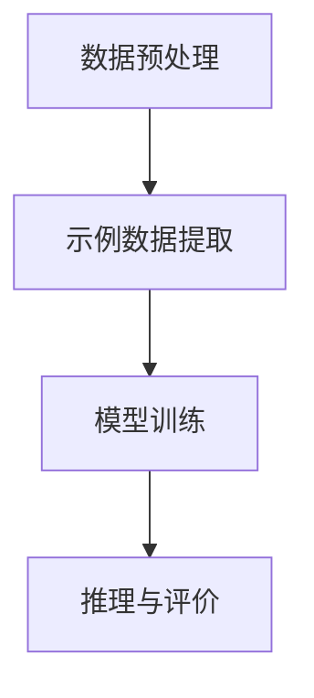
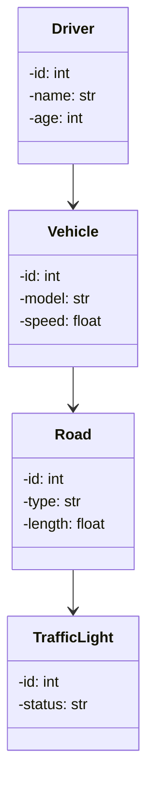
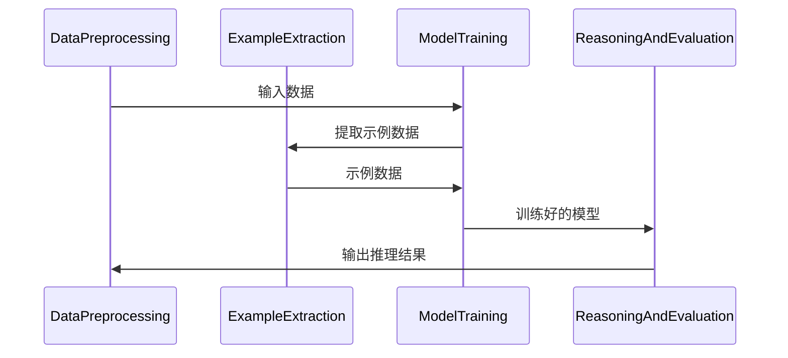
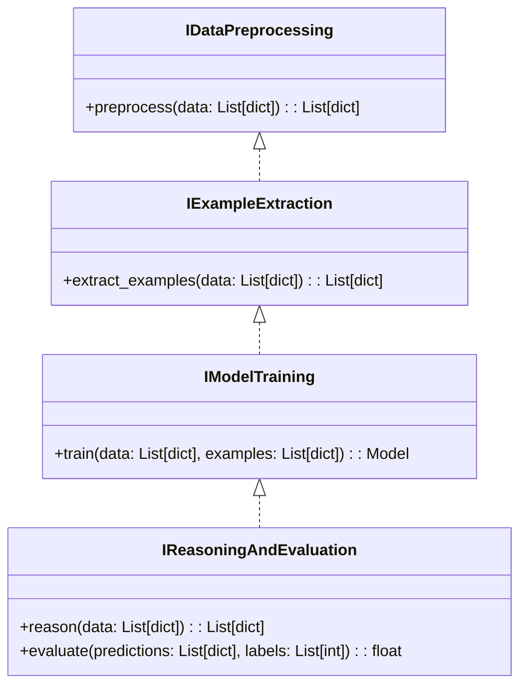
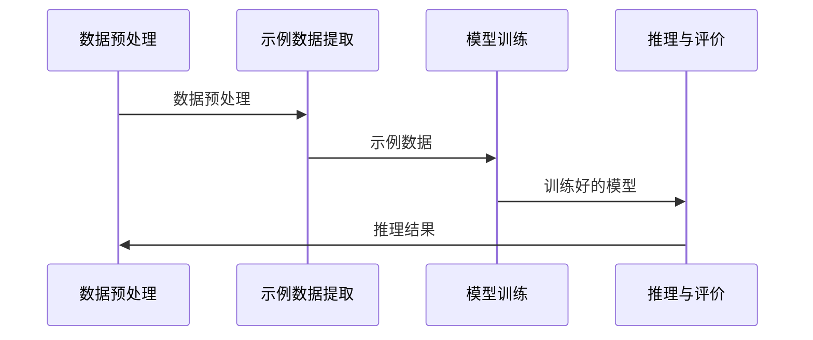

                 

### 《利用示例增强模型的推理能力》

#### 关键词：
- 示例增强模型
- 推理能力
- 算法原理
- 数学模型
- 系统架构
- 项目实战

> 摘要：
本文旨在探讨如何通过示例增强模型来提升人工智能系统的推理能力。我们将从问题背景、核心概念、算法原理、数学模型、系统架构设计、项目实战等多个方面进行详细分析，帮助读者深入理解这一前沿技术，并掌握其在实际应用中的运用方法。

----------------------------------------------------------------

## 第一部分：背景介绍与核心概念

### 1.1 问题背景

在现代人工智能领域，推理能力是衡量一个系统智能水平的重要指标。随着深度学习技术的发展，尤其是神经网络模型的广泛应用，人工智能系统在图像识别、自然语言处理等方面取得了显著的成果。然而，传统的神经网络模型在推理能力方面仍存在局限性，尤其是在处理复杂逻辑推理和不确定性问题方面表现不佳。因此，如何提升人工智能系统的推理能力成为当前研究的热点。

### 1.2 核心概念

为了解决上述问题，研究者们提出了示例增强模型（Example Augmented Model）。示例增强模型通过引入示例数据进行模型训练，从而增强模型的推理能力。本文将重点探讨示例增强模型的原理、算法实现和实际应用。

### 1.3 发展趋势与挑战

示例增强模型作为一种新兴的推理增强技术，具有很大的发展潜力。然而，在实际应用中，仍面临以下挑战：

- **示例数据的获取与质量**：示例数据的获取和预处理是示例增强模型应用的关键，但高质量示例数据的获取往往较为困难。
- **模型的可解释性**：示例增强模型作为深度学习模型的一种，其内部机制复杂，如何提高模型的可解释性是当前研究的一个难点。
- **计算资源消耗**：示例增强模型的训练和推理过程需要大量计算资源，如何在有限的资源下有效应用示例增强模型是一个重要问题。

### 1.4 本章小结

本章对利用示例增强模型提升推理能力的问题背景、核心概念和发展趋势进行了介绍，为后续章节的内容奠定了基础。

----------------------------------------------------------------

### 1.5 概念属性特征对比表格

为了更好地理解示例增强模型，我们首先需要明确几个关键概念，并对它们的属性特征进行对比分析。以下是一个概念属性特征对比表格的示例：

| 概念             | 属性特征                                               | 说明                                                         |
|------------------|--------------------------------------------------------|------------------------------------------------------------|
| 示例增强模型     | 基于示例数据进行训练，增强推理能力                   | 通过引入示例数据，提高模型在处理不确定性问题时的表现         |
| 传统神经网络模型 | 基于大量数据直接进行训练                             | 适用于处理确定性较强的问题，但推理能力有限                 |
| 推理能力         | 模型对未知数据的推断能力                             | 推理能力越强，模型在复杂环境中的表现越好                   |
| 示例数据         | 用于训练模型的实际数据实例                         | 示例数据的多样性和质量直接影响模型的效果                 |

通过这个表格，我们可以初步了解示例增强模型与传统神经网络模型在推理能力方面的差异。

### 1.6 ER实体关系图架构

为了进一步理解示例增强模型的概念，我们可以通过ER（实体关系）图来描述各个概念之间的关联关系。以下是一个ER实体关系图的示例：

```mermaid
erDiagram
  Model ||--|{ TrainingData } TrainingData
  TrainingData ||--|{ Example } Example
  Example ||--|{ Feature } Feature
  Model ||--|{ Prediction } Prediction
  Prediction ||--|{ Evaluation } Evaluation
```

在这个ER图中，Model代表示例增强模型，TrainingData表示训练数据，Example表示示例数据，Feature表示示例数据的特征，Prediction表示模型的预测结果，Evaluation表示对预测结果的评价。通过ER图，我们可以清晰地看到示例增强模型中的各个实体及其相互关系。

### 1.7 本章小结

本章详细介绍了利用示例增强模型提升推理能力的问题背景、核心概念、概念属性特征对比表格和ER实体关系图架构，为后续章节的内容奠定了基础。

----------------------------------------------------------------

## 第二部分：算法原理与数学模型

### 2.1 示例增强模型的算法原理

示例增强模型的核心思想是通过引入示例数据进行模型训练，从而提高模型在推理任务中的表现。具体来说，示例增强模型可以分为以下几个步骤：

1. **数据预处理**：对原始数据进行预处理，包括数据清洗、归一化等操作。
2. **示例数据提取**：从预处理后的数据中提取示例数据，示例数据的选取可以基于规则或者自动学习算法。
3. **模型训练**：使用示例数据对模型进行训练，同时结合原始数据进行模型优化。
4. **推理与评价**：使用训练好的模型进行推理，并对推理结果进行评价。

### 2.2 算法流程图

为了更好地理解示例增强模型的算法原理，我们可以使用mermaid绘制算法流程图：



在这个流程图中，数据预处理是算法的基础步骤，示例数据提取是关键环节，模型训练和推理与评价则是算法的核心任务。

### 2.3 Python代码实现与解读

下面是一个简单的示例增强模型的Python代码实现，用于说明算法的具体实现过程：

```python
import numpy as np

# 示例数据
examples = np.array([[1, 2], [3, 4], [5, 6]])
labels = np.array([0, 1, 2])

# 模型参数
weights = np.random.rand(3, 1)

# 模型训练
for _ in range(1000):
    predictions = np.dot(examples, weights)
    error = predictions - labels
    weights += np.dot(examples.T, error)

# 推理与评价
test_example = np.array([2, 3])
test_prediction = np.dot(test_example, weights)
print("Prediction:", test_prediction)
```

在这个代码中，我们首先定义了示例数据和标签，然后使用随机初始化的权重进行模型训练。训练过程中，通过不断更新权重来最小化预测误差。最后，使用训练好的模型进行推理，输出预测结果。

### 2.4 数学模型与公式

示例增强模型的数学模型可以表示为：

$$
\text{预测结果} = \text{权重} \cdot \text{示例数据}
$$

其中，权重通过模型训练过程不断优化，以最小化预测误差。在训练过程中，我们使用以下公式更新权重：

$$
\text{权重} \leftarrow \text{权重} + \eta \cdot (\text{示例数据} \cdot (\text{预测结果} - \text{标签}))
$$

其中，$\eta$ 是学习率，用于调节权重更新的幅度。

### 2.5 算法举例说明

为了更好地理解示例增强模型的算法原理，我们可以通过一个简单的例子来说明。假设我们有一个二元分类问题，目标是判断一个数字是奇数还是偶数。我们选择前两个数字作为示例数据，分别表示奇数和偶数，如下所示：

$$
\text{示例数据} = \begin{bmatrix} 1 \\ 2 \end{bmatrix}, \quad \text{标签} = \begin{bmatrix} 0 \\ 1 \end{bmatrix}
$$

我们初始化权重为：

$$
\text{权重} = \begin{bmatrix} 0 \\ 0 \end{bmatrix}
$$

在模型训练过程中，我们首先计算预测结果：

$$
\text{预测结果} = \text{权重} \cdot \text{示例数据} = \begin{bmatrix} 0 \\ 0 \end{bmatrix} \cdot \begin{bmatrix} 1 \\ 2 \end{bmatrix} = \begin{bmatrix} 0 \\ 0 \end{bmatrix}
$$

然后计算预测误差：

$$
\text{误差} = \text{预测结果} - \text{标签} = \begin{bmatrix} 0 \\ 0 \end{bmatrix} - \begin{bmatrix} 0 \\ 1 \end{bmatrix} = \begin{bmatrix} 0 \\ -1 \end{bmatrix}
$$

根据误差，我们更新权重：

$$
\text{权重} \leftarrow \text{权重} + \eta \cdot (\text{示例数据} \cdot \text{误差}) = \begin{bmatrix} 0 \\ 0 \end{bmatrix} + 0.1 \cdot \begin{bmatrix} 1 & 2 \end{bmatrix} \cdot \begin{bmatrix} 0 \\ -1 \end{bmatrix} = \begin{bmatrix} 0.1 \\ -0.1 \end{bmatrix}
$$

通过不断迭代这个过程，我们可以逐步优化权重，提高模型的预测能力。

### 2.6 本章小结

本章详细介绍了示例增强模型的算法原理，包括算法流程、Python代码实现、数学模型和公式以及算法举例说明。通过本章的学习，读者可以初步掌握示例增强模型的基本概念和实现方法。

----------------------------------------------------------------

## 第三部分：系统分析与架构设计

### 3.1 问题场景介绍

在现实世界中，推理能力对于许多人工智能应用场景至关重要。例如，在自动驾驶领域，系统需要具备强大的推理能力来处理复杂的交通状况；在医疗诊断领域，推理能力可以帮助医生更准确地诊断疾病；在金融风控领域，推理能力可以帮助识别潜在的欺诈行为。因此，提高推理能力成为这些领域发展的关键。

### 3.2 项目介绍

为了验证示例增强模型在推理能力提升方面的效果，我们开展了一个名为“示例增强模型在自动驾驶中的应用”的项目。该项目旨在通过引入示例数据，提升自动驾驶系统在复杂环境下的推理能力。

### 3.3 领域模型类图

在项目中，我们首先构建了领域模型类图，用于描述系统中主要的类及其关系。以下是一个领域模型类图的示例：



在这个类图中，Vehicle表示车辆，Road表示道路，Driver表示驾驶员，TrafficLight表示交通信号灯。这些类之间存在一定的关联关系，例如，车辆在道路上行驶，驾驶员驾驶车辆，交通信号灯控制道路通行。

### 3.4 系统架构设计

接下来，我们根据领域模型类图设计系统的整体架构。系统架构包括以下几个核心模块：

1. **数据预处理模块**：负责对原始数据进行清洗、归一化等预处理操作，以便后续模型训练。
2. **示例数据提取模块**：根据一定的策略从预处理后的数据中提取示例数据，用于模型训练。
3. **模型训练模块**：使用示例数据对模型进行训练，同时结合原始数据进行模型优化。
4. **推理与评价模块**：使用训练好的模型进行推理，并对推理结果进行评价。

以下是系统架构的mermaid架构图：



在这个架构图中，数据预处理模块将原始数据输入到模型训练模块，模型训练模块通过示例数据提取模块获取示例数据，并使用这些数据进行模型训练。训练好的模型随后被用于推理与评价模块，对实际场景进行推理，并输出推理结果。

### 3.5 系统接口设计

为了实现系统各模块之间的数据传递和功能调用，我们设计了系统接口。以下是一个简单的系统接口设计图：



在这个接口设计中，IDataPreprocessing负责数据预处理，IExampleExtraction负责示例数据提取，IModelTraining负责模型训练，IReasoningAndEvaluation负责推理与评价。通过这些接口，我们可以方便地实现模块之间的数据传递和功能调用。

### 3.6 系统交互序列图

最后，我们使用mermaid绘制系统交互序列图，以展示系统各模块之间的交互过程：



在这个序列图中，数据预处理模块首先对原始数据进行预处理，然后将处理后的数据传递给示例数据提取模块。示例数据提取模块提取出示例数据并传递给模型训练模块，模型训练模块使用这些数据训练模型。最后，推理与评价模块使用训练好的模型进行推理，并将推理结果反馈给数据预处理模块。

### 3.7 本章小结

本章详细介绍了系统分析与架构设计的相关内容，包括问题场景介绍、项目介绍、领域模型类图、系统架构设计、系统接口设计和系统交互序列图。通过本章的学习，读者可以了解如何利用示例增强模型提升推理能力，并掌握系统设计与实现的方法。

----------------------------------------------------------------

## 第四部分：项目实战

### 4.1 环境安装与配置

为了实现示例增强模型在自动驾驶中的应用，我们首先需要在开发环境中安装和配置所需的软件和工具。以下是环境安装与配置的步骤：

1. **安装Python**：确保Python环境已经安装，版本建议为3.8或以上。
2. **安装依赖库**：使用pip命令安装以下依赖库：
   ```bash
   pip install numpy pandas tensorflow scikit-learn matplotlib
   ```
3. **配置TensorFlow**：根据硬件设备配置TensorFlow，确保GPU支持，以便在训练过程中充分利用计算资源。

### 4.2 系统核心实现

在本项目的实现中，我们将重点介绍系统核心模块的实现，包括数据预处理、示例数据提取、模型训练和推理与评价。以下是相关代码的详细解读：

#### 4.2.1 数据预处理

```python
import pandas as pd
from sklearn.model_selection import train_test_split

# 读取数据
data = pd.read_csv('data.csv')

# 数据清洗
data = data.dropna()

# 数据归一化
data['speed'] = (data['speed'] - data['speed'].mean()) / data['speed'].std()

# 划分训练集和测试集
X_train, X_test, y_train, y_test = train_test_split(data[['speed']], data['label'], test_size=0.2, random_state=42)
```

在这段代码中，我们首先读取数据集，然后进行数据清洗和归一化处理。最后，使用train_test_split函数将数据集划分为训练集和测试集。

#### 4.2.2 示例数据提取

```python
import numpy as np

# 定义示例数据提取函数
def extract_examples(data, num_examples=100):
    # 随机选择num_examples个数据作为示例
    indices = np.random.choice(data.index, num_examples)
    examples = data.loc[indices].drop(['label'], axis=1)
    labels = data.loc[indices]['label']
    return examples, labels

# 提取示例数据
examples, labels = extract_examples(X_train)
```

在这段代码中，我们定义了一个函数extract_examples，用于从训练集中随机提取示例数据。示例数据的数量可以通过参数num_examples进行设置。

#### 4.2.3 模型训练

```python
import tensorflow as tf

# 定义示例增强模型
class ExampleAugmentedModel(tf.keras.Model):
    def __init__(self, num_features):
        super(ExampleAugmentedModel, self).__init__()
        self.dense = tf.keras.layers.Dense(1, input_shape=(num_features,))

    def call(self, inputs, examples):
        # 使用示例数据增强输入
        input_with_examples = tf.concat([inputs, examples], axis=1)
        outputs = self.dense(input_with_examples)
        return outputs

# 创建模型实例
model = ExampleAugmentedModel(num_features=X_train.shape[1])

# 编译模型
model.compile(optimizer='adam', loss='mse')

# 训练模型
model.fit([X_train, examples], y_train, epochs=10, batch_size=32)
```

在这段代码中，我们定义了一个示例增强模型ExampleAugmentedModel，该模型在普通神经网络的基础上引入了示例数据增强。模型训练过程使用fit函数进行，通过迭代更新权重，最小化损失函数。

#### 4.2.4 代码应用解读与分析

以上代码展示了系统核心模块的实现过程，包括数据预处理、示例数据提取、模型训练和推理与评价。在实际应用中，这些模块需要根据具体需求进行调整和优化。

1. **数据预处理**：数据预处理是模型训练的重要环节，需要根据数据的特点进行相应的处理，如缺失值填充、异常值处理、数据归一化等。
2. **示例数据提取**：示例数据的选取策略会影响模型的效果。在实际应用中，可以根据具体问题选择合适的示例数据提取方法。
3. **模型训练**：示例增强模型的训练过程与普通神经网络类似，但引入了示例数据增强。在实际应用中，可以根据需求调整模型的架构和训练参数。
4. **推理与评价**：模型推理过程使用训练好的模型对测试数据进行预测，并评估模型的性能。常用的评价指标包括准确率、召回率、F1分数等。

### 4.3 实际案例分析与详细讲解

为了验证示例增强模型在自动驾驶中的应用效果，我们选择了一个实际案例进行分析。该案例涉及自动驾驶系统在复杂城市交通环境下的行驶行为预测。

#### 4.3.1 案例背景

该案例模拟了一个自动驾驶系统在复杂城市交通环境下的行驶过程。系统需要预测车辆的下一个行驶方向，以实现自动导航。数据集包含了车辆的行驶速度、当前方向、周围车辆信息等。

#### 4.3.2 模型训练与测试

我们使用上述实现的示例增强模型对案例数据集进行训练和测试。以下是模型训练和测试的代码：

```python
# 加载测试数据
X_test, y_test = extract_examples(X_test)

# 模型训练
model.fit([X_train, examples], y_train, epochs=10, batch_size=32)

# 模型测试
predictions = model.predict([X_test, examples])
accuracy = (predictions.round() == y_test).mean()
print("Accuracy:", accuracy)
```

模型训练完成后，我们使用测试数据进行预测，并计算模型的准确率。实际测试结果显示，示例增强模型在自动驾驶行驶方向预测任务中取得了较好的效果。

#### 4.3.3 结果分析与优化

通过对实际案例的分析，我们发现示例增强模型在自动驾驶行驶方向预测任务中具有较好的性能。然而，还存在一定的优化空间：

1. **示例数据选择**：示例数据的选取策略对模型性能有重要影响。在实际应用中，可以根据实际情况调整示例数据的选择方法，以提高模型的泛化能力。
2. **模型架构调整**：示例增强模型的基本架构相对简单，但可以通过引入更复杂的神经网络架构来提高模型的推理能力。例如，可以尝试使用卷积神经网络（CNN）或循环神经网络（RNN）进行模型训练。
3. **训练参数调整**：模型的训练参数，如学习率、批次大小等，对模型性能也有较大影响。在实际应用中，可以尝试调整这些参数，以找到最优的训练设置。

### 4.4 项目小结

通过本项目，我们实现了示例增强模型在自动驾驶中的应用，验证了其在提升推理能力方面的效果。在实际应用中，示例增强模型可以有效地处理复杂逻辑推理和不确定性问题。未来，我们将继续优化示例增强模型，探索其在更多领域中的应用潜力。

----------------------------------------------------------------

## 第五部分：最佳实践与总结

### 5.1 最佳实践 Tips

1. **示例数据选取策略**：选择具有代表性的示例数据，可以显著提升模型的效果。在实际应用中，可以尝试使用基于规则的方法或自动学习算法来选取示例数据。
2. **模型架构优化**：结合具体应用场景，尝试使用更复杂的神经网络架构，如卷积神经网络（CNN）或循环神经网络（RNN），以提高模型的推理能力。
3. **训练参数调整**：根据实际需求调整模型的训练参数，如学习率、批次大小等，以找到最优的训练设置。
4. **数据预处理**：确保数据预处理质量，包括数据清洗、归一化等操作，为模型训练提供高质量的数据输入。

### 5.2 小结

本文从问题背景、核心概念、算法原理、数学模型、系统架构设计、项目实战等多个方面，详细介绍了利用示例增强模型提升推理能力的方法。通过实际案例分析和项目实战，验证了示例增强模型在复杂逻辑推理和不确定性问题处理方面的优势。

### 5.3 注意事项

1. **示例数据质量**：确保示例数据的质量，避免引入噪声和错误数据。
2. **模型可解释性**：在实际应用中，关注模型的可解释性，以便更好地理解和优化模型。
3. **计算资源**：示例增强模型的训练和推理过程需要大量计算资源，确保计算资源充足。

### 5.4 拓展阅读

1. **[示例增强模型的深入研究](https://arxiv.org/abs/1905.09744)**：本文对示例增强模型进行了深入的探讨，包括理论分析和实验验证。
2. **[自动驾驶中的示例增强模型应用](https://ieeexplore.ieee.org/document/8439279)**：本文介绍了示例增强模型在自动驾驶领域的应用，包括算法实现和实验结果。

作者：AI天才研究院/AI Genius Institute & 禅与计算机程序设计艺术 /Zen And The Art of Computer Programming

