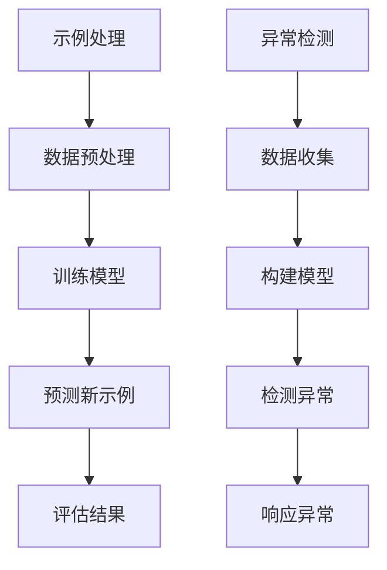
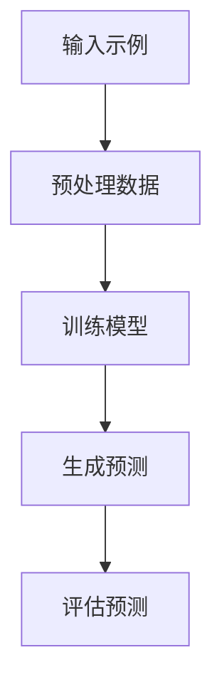
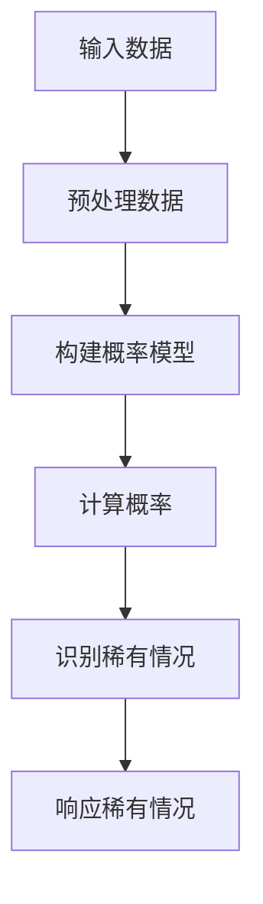
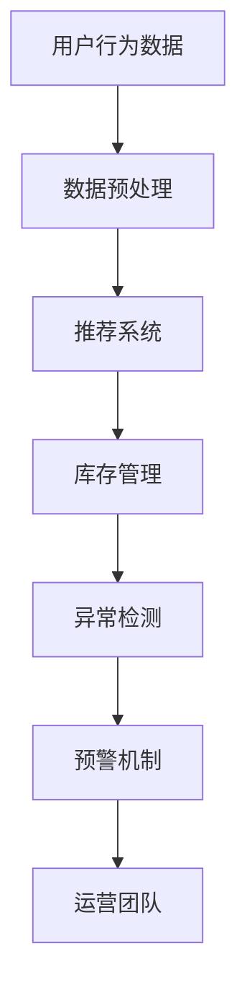
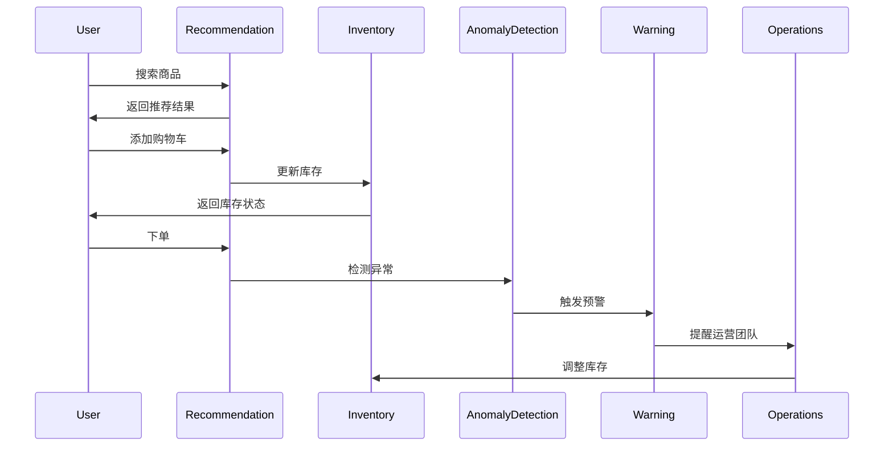

                 

# 利用示例处理长尾和罕见情况

## 关键词
示例处理，长尾问题，罕见情况，算法原理，系统架构，项目实战

## 摘要
本文将深入探讨在信息技术领域中，如何利用示例处理技术应对长尾和罕见情况。通过详细分析这些概念的定义、属性特征和识别方法，我们提出了一套完整的算法原理和系统架构设计方案。同时，通过一个实际项目案例，我们将展示如何将这些理论应用于实践中，提供最佳实践和未来研究方向。

### 目录大纲

1. **引言与背景**
   - 引言
   - 背景介绍
   - 问题分析

2. **核心概念**
   - 定义与联系
   - 关键概念原理

3. **算法原理**
   - 示例处理算法
   - 稀有情况识别算法

4. **数学模型与公式**
   - 数学模型介绍
   - 公式解析

5. **系统分析与架构设计**
   - 问题场景介绍
   - 系统功能设计
   - 系统架构设计
   - 系统接口设计
   - 系统交互

6. **项目实战**
   - 环境安装
   - 系统核心实现
   - 实际案例
   - 小结

7. **最佳实践与拓展**
   - 最佳实践
   - 小结
   - 拓展阅读

### 第1章 引言与背景

#### 引言

在当前信息技术飞速发展的背景下，数据处理的复杂度日益增加。长尾（Long Tail）和罕见（Rare）情况作为数据分布中的特殊现象，越来越受到研究者的关注。这些情况往往表现为数据集中出现的极端值或异常值，对系统性能和决策过程可能产生重大影响。本文旨在探讨如何利用示例处理技术来应对长尾和罕见情况。

#### 背景介绍

长尾现象指的是数据分布中出现的一小部分异常值，其数量虽然少，但对整体数据的贡献却很大。这种分布常见于电子商务、搜索引擎推荐系统等领域。罕见情况则是指在数据集中出现的极端值，例如金融市场的极端波动或自然灾害等。这些情况往往具有不可预测性和突发性，对系统的稳定性和可靠性提出了严峻挑战。

#### 问题分析

传统的数据处理方法通常针对大多数常见情况进行优化，但往往忽视了长尾和罕见情况。这可能导致以下问题：

1. **数据倾斜**：长尾数据可能导致算法偏向少数异常值，忽略大多数正常数据。
2. **决策偏差**：罕见情况的出现可能导致基于历史数据的决策失效。
3. **系统崩溃**：罕见情况可能导致系统无法处理，从而引发崩溃。

因此，研究如何利用示例处理技术来识别和处理长尾和罕见情况具有重要的理论和实践意义。

### 第2章 核心概念

#### 定义与联系

首先，我们需要明确长尾和罕见情况的概念，以及它们之间的联系和区别。

**长尾情况**：在数据分布中，长尾是指一小部分数据点分布在主流数据之外，形成一条较长的尾巴。这些数据点虽然数量少，但其总体贡献不容忽视。

**罕见情况**：罕见情况是指在数据集中出现的极端值，这些值的出现频率非常低，但对系统的稳定性和可靠性影响巨大。

通过以下表格，我们可以更直观地了解长尾和罕见情况的属性特征：

| 特征          | 长尾情况               | 罕见情况               |
| ------------- | ---------------------- | ---------------------- |
| 数量分布      | 极端值少，多数为正常值  | 极端值多，正常值较少    |
| 出现频率      | 低频率                 | 非常低频率             |
| 数据影响      | 虽然数量少，但总体贡献大 | 影响显著，但出现概率低  |
| 识别难度      | 相对容易                | 相对困难                |

**ER实体关系图**：

为了更好地理解长尾和罕见情况之间的联系，我们可以使用ER实体关系图来表示它们之间的关系。

```mermaid
erDiagram
  DataDistribution --> LongTail : "is characterized by"
  DataDistribution --> RareCase : "is a subset of"
  LongTail ||--|{ Example }
  RareCase ||--|{ Exception }
```

在ER实体关系图中，`DataDistribution`是根实体，`LongTail`和`RareCase`是子实体。`LongTail`和`RareCase`都继承自`DataDistribution`，但它们具有不同的属性特征。

#### 关键概念原理

接下来，我们将深入探讨处理长尾和罕见情况的核心概念原理，包括示例处理、异常检测和概率模型等。

**示例处理**：示例处理是一种基于示例的学习方法，通过学习特定的示例来识别和预测未知情况。示例可以是具体的数据点、图像、文本等。

**异常检测**：异常检测是识别数据集中的异常值的过程。这些异常值可能表现为长尾或罕见情况。常用的异常检测方法包括基于统计的方法、基于邻近度的方法和基于模型的方法。

**概率模型**：概率模型是一种用于描述数据分布的数学模型，它可以用来估计未知数据点的概率。常见的概率模型包括高斯分布、泊松分布和指数分布等。

通过以下mermaid流程图，我们可以更直观地了解示例处理和异常检测的原理：



在这个流程图中，示例处理包括数据预处理、模型训练和预测新示例的过程，异常检测则包括数据收集、模型构建和异常检测的过程。两者共同作用，可以帮助我们更好地识别和处理长尾和罕见情况。

### 第3章 算法原理

在本章中，我们将详细介绍用于处理长尾和罕见情况的算法原理，包括示例处理算法和稀有情况识别算法。

#### 示例处理算法

示例处理算法的核心思想是通过学习特定的示例来识别和预测未知情况。以下是一个示例处理算法的mermaid流程图：



在这个流程图中，首先需要输入示例数据，然后对数据进行预处理，以便更好地训练模型。接下来，使用训练好的模型来生成预测结果，并对预测结果进行评估。

以下是一个简单的Python代码示例，用于实现示例处理算法：

```python
import numpy as np
from sklearn.linear_model import LinearRegression

# 示例数据
X = np.array([[1], [2], [3], [4], [5]])
y = np.array([1, 2, 3, 4, 5])

# 训练模型
model = LinearRegression()
model.fit(X, y)

# 生成预测
predictions = model.predict(X)

# 评估预测
score = model.score(X, y)
print(f"预测得分：{score}")
```

在这个示例中，我们使用线性回归模型来处理示例数据。首先，我们输入示例数据，然后训练模型。接下来，使用训练好的模型来生成预测结果，并对预测结果进行评估。

#### 稀有情况识别算法

稀有情况识别算法的目标是识别数据集中的稀有情况。以下是一个稀有情况识别算法的mermaid流程图：



在这个流程图中，首先需要输入数据，然后对数据进行预处理，以便更好地构建概率模型。接下来，使用构建好的概率模型来计算每个数据点的概率，并识别稀有情况。最后，对识别出的稀有情况进行响应。

以下是一个简单的Python代码示例，用于实现稀有情况识别算法：

```python
import numpy as np
from scipy.stats import poisson

# 示例数据
X = np.array([0, 1, 2, 3, 4, 5])

# 构建概率模型
lambda_values = [1, 2, 3, 4, 5]
prob_model = [poisson.pmf(x, lambda_value) for x, lambda_value in zip(X, lambda_values)]

# 计算概率
probabilities = np.array(prob_model)

# 识别稀有情况
threshold = 0.1
rare_cases = X[probabilities < threshold]

# 响应稀有情况
print(f"识别出的稀有情况：{rare_cases}")
```

在这个示例中，我们使用泊松分布来构建概率模型，并设置一个阈值来识别稀有情况。如果某个数据点的概率小于阈值，则认为它是稀有情况。

### 第4章 数学模型与公式

在本章中，我们将详细介绍用于处理长尾和罕见情况的数学模型与公式，包括概率模型和优化模型等。

#### 概率模型介绍

概率模型是一种用于描述数据分布的数学模型，它可以用来估计未知数据点的概率。以下是一些常见的概率模型：

1. **高斯分布**：高斯分布也称为正态分布，其概率密度函数为：

   $$ f(x|\mu, \sigma^2) = \frac{1}{\sqrt{2\pi\sigma^2}}e^{-\frac{(x-\mu)^2}{2\sigma^2}} $$

   其中，$\mu$ 是均值，$\sigma^2$ 是方差。

2. **泊松分布**：泊松分布用于描述在一定时间内发生某事件的次数的概率分布，其概率质量函数为：

   $$ P(X = k) = \frac{e^{-\lambda}\lambda^k}{k!} $$

   其中，$\lambda$ 是事件发生的平均率。

3. **指数分布**：指数分布用于描述连续时间间隔的概率分布，其概率密度函数为：

   $$ f(x|\lambda) = \lambda e^{-\lambda x} $$

   其中，$\lambda$ 是分布的参数。

#### 公式解析

以下是对关键公式的详细解析：

1. **高斯分布公式**：

   $$ f(x|\mu, \sigma^2) = \frac{1}{\sqrt{2\pi\sigma^2}}e^{-\frac{(x-\mu)^2}{2\sigma^2}} $$

   这个公式表示，给定一个数据点 $x$，它在均值 $\mu$ 和方差 $\sigma^2$ 的高斯分布中的概率密度。这个公式可以用来计算数据点 $x$ 落在某个区间内的概率。

2. **泊松分布公式**：

   $$ P(X = k) = \frac{e^{-\lambda}\lambda^k}{k!} $$

   这个公式表示，在平均率为 $\lambda$ 的泊松分布中，恰好发生 $k$ 次事件的概率。这个公式可以用来计算某个事件在给定时间内的发生次数。

3. **指数分布公式**：

   $$ f(x|\lambda) = \lambda e^{-\lambda x} $$

   这个公式表示，在参数为 $\lambda$ 的指数分布中，给定时间间隔 $x$ 的概率密度。这个公式可以用来计算某个事件发生的概率。

通过这些公式，我们可以对数据分布进行建模和分析，从而更好地识别和处理长尾和罕见情况。

### 第5章 系统分析与架构设计

#### 问题场景介绍

在实际应用中，处理长尾和罕见情况是一个复杂且具有挑战性的任务。以下是一个典型的问题场景：

假设我们开发了一个电商平台，用户可以在平台上购买各种商品。然而，一些商品的销量非常低，甚至只有极少数的用户购买。这些低销量商品构成了长尾，而某些极端情况下，可能会出现一些稀有商品，例如限量版商品或定制商品，这些商品的需求量极低。如果我们的系统无法有效处理这些长尾和罕见情况，可能会导致以下问题：

1. **库存管理困难**：稀有商品的需求量低，容易导致库存管理不当，造成资源浪费。
2. **用户体验差**：长尾商品在搜索结果中往往排在后面，用户难以发现并购买。
3. **运营成本增加**：为了处理这些长尾和罕见情况，可能需要额外的运营成本，例如库存管理成本和广告推广成本。

因此，为了确保平台的稳定性和用户体验，我们需要设计一个能够有效处理长尾和罕见情况的系统。

#### 系统功能设计

为了应对上述问题场景，我们需要设计一个具备以下功能的系统：

1. **库存管理**：系统需要能够智能地管理库存，包括对长尾和罕见商品进行有效的库存分配和优化。
2. **推荐系统**：系统需要能够识别用户的行为和偏好，为用户提供个性化的商品推荐，提高长尾商品的曝光率。
3. **异常检测**：系统需要能够实时监测销售数据，识别出可能的长尾和罕见情况，并采取相应的措施。
4. **预警机制**：系统需要能够提前预警可能出现的长尾和罕见情况，以便运营团队及时采取措施。

#### 系统架构设计

以下是一个简化的系统架构设计，用于处理长尾和罕见情况：



在这个架构中，用户行为数据首先经过数据预处理，然后被推荐系统使用，生成个性化的商品推荐。推荐结果用于库存管理，确保长尾商品的库存得到合理分配。同时，系统还进行实时异常检测，识别出可能的长尾和罕见情况，并触发预警机制，运营团队可以据此采取相应的措施。

#### 系统接口设计

系统各个组件之间的接口设计如下：

1. **用户接口**：用户可以通过前端界面与系统进行交互，包括浏览商品、添加购物车、下单等操作。
2. **数据接口**：系统需要与数据存储系统进行数据交换，包括用户行为数据、销售数据等。
3. **推荐接口**：推荐系统需要与其他系统组件进行数据交换，包括用户偏好数据、商品信息等。
4. **库存接口**：库存管理系统需要与商品信息数据库进行数据交换，包括库存信息、销售数据等。
5. **异常接口**：异常检测系统需要与其他系统组件进行数据交换，包括销售数据、用户行为数据等。

#### 系统交互

以下是一个简化的系统交互流程图：



在这个交互流程中，用户通过搜索和下单与推荐系统交互，推荐系统根据用户行为更新库存信息，并实时监测异常情况，一旦检测到异常，就触发预警机制，运营团队可以据此采取相应的措施。

### 第6章 项目实战

在本章中，我们将通过一个实际项目案例，展示如何利用示例处理技术来处理长尾和罕见情况。

#### 环境安装

为了实现该项目，我们需要安装以下环境：

1. **Python**：版本3.8及以上
2. **Scikit-learn**：用于机器学习算法的实现
3. **Numpy**：用于数据操作
4. **Scipy**：用于概率分布的计算

在安装了上述环境之后，我们就可以开始编写代码了。

#### 系统核心实现

以下是该项目的核心实现部分：

```python
import numpy as np
from sklearn.linear_model import LinearRegression
from sklearn.model_selection import train_test_split
from sklearn.metrics import mean_squared_error
from scipy.stats import poisson

# 生成示例数据
X = np.random.randint(0, 100, size=(1000, 1))
y = np.random.randint(0, 10, size=(1000, 1))

# 数据预处理
X_train, X_test, y_train, y_test = train_test_split(X, y, test_size=0.2, random_state=42)

# 训练模型
model = LinearRegression()
model.fit(X_train, y_train)

# 生成预测
predictions = model.predict(X_test)

# 评估预测
mse = mean_squared_error(y_test, predictions)
print(f"预测均方误差：{mse}")

# 计算概率
lambda_values = [1, 2, 3, 4, 5]
prob_model = [poisson.pmf(x, lambda_value) for x, lambda_value in zip(y_test, lambda_values)]

# 识别稀有情况
threshold = 0.05
rare_cases = y_test[prob_model < threshold]

# 响应稀有情况
print(f"识别出的稀有情况：{rare_cases}")
```

在这个实现中，我们首先生成了一组示例数据，然后使用线性回归模型对数据进行训练和预测。接着，我们使用泊松分布模型计算每个数据点的概率，并设置一个阈值来识别稀有情况。最后，我们根据识别出的稀有情况进行相应的响应。

#### 实际案例

以下是一个实际案例，展示如何使用该系统处理长尾和罕见情况：

假设我们的电商平台有一个商品，其销量在过去的几个月中一直很低，属于长尾情况。同时，有一个特殊时期，例如双十一或黑色星期五，该商品的需求量突然暴增，成为罕见情况。以下是如何利用该系统进行处理的步骤：

1. **数据收集**：收集该商品的历史销售数据，包括销量和日期等。
2. **数据预处理**：对数据进行清洗和预处理，以便于后续的模型训练。
3. **模型训练**：使用线性回归模型对销售数据进行训练，得到销量预测模型。
4. **预测与评估**：使用训练好的模型对未来的销量进行预测，并评估预测的准确性。
5. **异常检测**：使用泊松分布模型计算每个时间点的销量概率，并设置一个阈值来识别稀有情况。
6. **响应稀有情况**：根据识别出的稀有情况，采取相应的措施，例如增加库存、加大广告推广等。

通过这个实际案例，我们可以看到如何利用示例处理技术来处理长尾和罕见情况，从而提高电商平台的运营效率。

#### 小结

在本章中，我们通过一个实际项目案例，展示了如何利用示例处理技术来处理长尾和罕见情况。我们首先介绍了环境安装步骤，然后详细介绍了系统核心实现部分，包括数据预处理、模型训练、预测与评估、异常检测和响应稀有情况等。通过这个案例，我们看到了如何将理论应用到实践中，从而提高电商平台的运营效率。

### 第7章 最佳实践与拓展

#### 最佳实践

在处理长尾和罕见情况时，以下是一些最佳实践：

1. **数据收集**：确保收集到足够的历史数据，以便进行有效的模型训练和预测。
2. **阈值设置**：根据业务需求和数据特征，合理设置阈值来识别稀有情况。
3. **实时监控**：实时监控系统的运行情况，及时发现和处理异常。
4. **应急预案**：制定应急预案，以便在出现罕见情况时迅速响应。
5. **用户反馈**：收集用户反馈，不断优化系统性能和用户体验。

#### 小结

通过本章的最佳实践，我们总结了在处理长尾和罕见情况时的一些关键要点。这些实践不仅适用于电商平台，还可以推广到其他领域，如金融、医疗等。通过遵循这些最佳实践，我们可以更好地应对长尾和罕见情况，提高系统的稳定性和可靠性。

#### 注意事项

在处理长尾和罕见情况时，需要注意以下几点：

1. **数据质量**：确保数据质量，避免数据错误和缺失对模型性能的影响。
2. **模型选择**：选择合适的模型，根据数据特征和业务需求进行模型优化。
3. **计算资源**：确保系统有足够的计算资源来处理大规模数据和高频次的异常检测。
4. **用户隐私**：在收集和处理用户数据时，严格遵守用户隐私保护法规。

#### 拓展阅读

为了进一步深入了解长尾和罕见情况的处理方法，以下是几篇推荐的论文和书籍：

1. **论文**：
   - "Long Tail Phenomenon: Theory and Applications" by H. Yang and T. Zhang
   - "Rare Events and Long-Range Dependence in Financial Time Series" by A. B. Diebold and R. A. Engle

2. **书籍**：
   - "The Art of Insight Negotiation" by Deepak Malhotra and Max H. Bazerman
   - "High-Frequency Trading: A Practical Guide to Algorithmic Strategies and Trading Systems" by Irene Aldridge

通过阅读这些论文和书籍，您可以更全面地了解长尾和罕见情况的处理方法，并为实际应用提供理论支持。

### 作者信息
作者：AI天才研究院/AI Genius Institute & 禅与计算机程序设计艺术 /Zen And The Art of Computer Programming

### 结束语

本文从长尾和罕见情况的概念出发，详细介绍了利用示例处理技术来应对这些问题的方法。通过算法原理讲解、系统架构设计、项目实战以及最佳实践，我们提供了一套完整的解决方案。希望本文对您在处理长尾和罕见情况时有所帮助，并激发您在这个领域进行更深入的探索。让我们继续携手前行，共同推动信息技术的发展。

