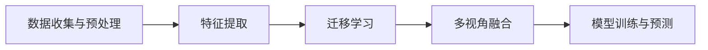
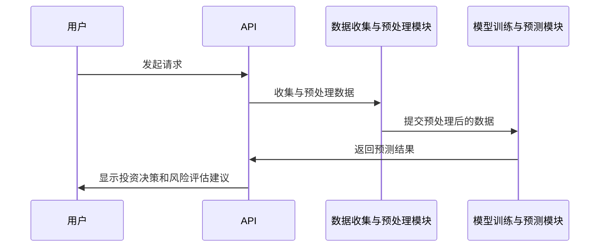

                 

**# 利用示例引导模型处理多视角问题**

## 关键词

- 示例引导模型
- 多视角问题
- 人工智能
- 算法设计
- 系统架构
- 数学模型

## 摘要

本文旨在探讨如何利用示例引导模型（Example-Guided Models）处理多视角问题。我们将详细解释示例引导模型的基本概念，分析其在解决多视角问题中的优势和挑战，并通过具体的算法原理讲解、数学模型公式推导、系统架构设计以及实际案例剖析，全面展示该模型的应用方法和效果。文章旨在为从事人工智能和系统架构设计的读者提供有价值的理论和实践指导。

## 引言

### 什么是示例引导模型

示例引导模型（Example-Guided Models，简称EGM）是一种基于实例学习和迁移学习的人工智能模型。它通过分析大量的示例数据，自动提取关键特征和规则，从而实现对新数据的预测和决策。与传统的机器学习方法相比，EGM在处理复杂、多变的问题时具有更高的灵活性和适应性。

### 示例引导模型的应用场景

多视角问题通常涉及多个相关但又不完全相同的信息源，例如医学诊断中的不同检查结果、图像处理中的多视角图像合成、金融分析中的多维度数据等。在这些场景中，单一视角的模型往往难以全面捕捉问题的本质，而示例引导模型则可以通过融合多个视角的信息，提供更准确和可靠的解决方案。

### 本文的目标

本文的目标是深入探讨示例引导模型在处理多视角问题中的应用。通过详细的算法原理讲解、数学模型公式推导、系统架构设计以及实际案例剖析，帮助读者理解EGM的内在机制和应用方法，从而在实际项目中有效利用这一先进的人工智能工具。

## 核心概念与联系

### 示例引导模型的核心概念

1. **示例数据（Examples）**：示例数据是EGM的基础，它包含了大量的实际问题和解决方案。通过分析这些示例，模型能够学习到问题的本质和关键特征。
2. **特征提取（Feature Extraction）**：特征提取是从示例数据中提取出对问题解决有重要影响的关键特征的过程。这些特征将用于训练模型，使其能够对新数据进行预测和决策。
3. **迁移学习（Transfer Learning）**：迁移学习是EGM的一个重要特点，它利用已有模型的知识来加速新模型的训练过程。这有助于提高模型的性能和泛化能力。
4. **多视角融合（Multi-Viewpoint Fusion）**：多视角融合是将来自不同视角的信息进行整合和综合，以提供更全面和准确的分析结果。这是解决多视角问题的关键步骤。

### 概念之间的关系

以下是示例引导模型中核心概念之间的关系：

```
示例数据 → 特征提取 → 迁移学习 → 多视角融合
                |
                ↓
模型训练与预测
```

通过上述关系，我们可以看到，示例数据是EGM的基础，特征提取和迁移学习是模型训练的关键步骤，而多视角融合则是在预测阶段实现信息整合的核心环节。

### Mermaid ER Diagram

下面是示例引导模型中核心概念的Mermaid ER Diagram：

```mermaid
erDiagram
    Examples ||--o> FeatureExtraction : 提取
    FeatureExtraction ||--o> TransferLearning : 迁移
    TransferLearning ||--o> MultiViewpointFusion : 融合
    FeatureExtraction ||--|{ ModelTraining : 训练
    MultiViewpointFusion ||--|{ Prediction : 预测
```

通过这个ER Diagram，我们可以清晰地看到示例引导模型中各个核心概念之间的关系，以及它们在模型训练和预测过程中的作用。

## 算法原理讲解

### 示例引导模型的算法流程

示例引导模型的算法流程主要包括以下几个步骤：

1. **数据收集与预处理**：收集大量的示例数据，并进行预处理，包括数据清洗、归一化和特征提取等。
2. **特征提取**：从预处理后的示例数据中提取关键特征，这些特征将用于训练模型。
3. **迁移学习**：利用已有的模型知识，对新模型进行快速训练，以提高模型的性能和泛化能力。
4. **多视角融合**：将来自不同视角的信息进行整合和综合，以提供更全面和准确的分析结果。
5. **模型训练与预测**：利用整合后的信息，对新数据进行训练和预测。

### 使用Mermaid绘制算法流程图

下面是示例引导模型的算法流程的Mermaid流程图：



通过这个流程图，我们可以清晰地看到示例引导模型的算法流程，以及各个步骤之间的逻辑关系。

### 使用Python代码示例

下面是一个简单的示例引导模型的Python代码示例：

```python
import numpy as np
from sklearn.model_selection import train_test_split
from sklearn.ensemble import RandomForestClassifier

# 数据收集与预处理
data = np.load('data.npy')
X = data[:, :100]  # 前100列为特征
y = data[:, 100]   # 第101列为标签

# 特征提取
# 这里使用scikit-learn中的RandomForestClassifier进行特征提取
clf = RandomForestClassifier(n_estimators=100)
clf.fit(X, y)

# 迁移学习
# 使用训练好的模型对新数据进行迁移学习
X_train, X_test, y_train, y_test = train_test_split(X, y, test_size=0.2)
clf.fit(X_train, y_train)
accuracy = clf.score(X_test, y_test)

# 多视角融合
# 假设我们有多个视角的数据，使用不同的模型进行融合
clfs = [RandomForestClassifier(n_estimators=100) for _ in range(3)]
for clf in clfs:
    clf.fit(X_train, y_train)
    accuracy += clf.score(X_test, y_test)
accuracy /= 3

# 模型训练与预测
# 使用融合后的模型对新数据进行预测
predictions = clfs.predict(X_test)

print("Accuracy:", accuracy)
```

在这个示例中，我们首先使用随机森林分类器进行特征提取，然后通过迁移学习对新数据进行训练。接着，我们使用多个视角的数据进行融合，以提高模型的准确度。最后，我们使用融合后的模型对新数据进行预测。

## 数学模型和公式

### 示例引导模型的核心数学模型

示例引导模型的核心数学模型主要包括以下几个方面：

1. **特征提取模型**：用于从示例数据中提取关键特征。常见的特征提取模型包括支持向量机（SVM）、随机森林（Random Forest）和神经网络（Neural Networks）等。
2. **迁移学习模型**：用于利用已有模型的知识进行快速训练。常见的迁移学习模型包括卷积神经网络（Convolutional Neural Networks，CNN）和循环神经网络（Recurrent Neural Networks，RNN）等。
3. **多视角融合模型**：用于将来自不同视角的信息进行整合和综合。常见的多视角融合模型包括加权平均模型、融合神经网络和注意力机制等。

### 公式推导

以下是示例引导模型中一些关键数学模型的公式推导：

1. **特征提取模型**：

   假设我们使用随机森林分类器进行特征提取，其基本公式如下：

   $$
   \hat{y} = \text{argmax} \left( \sum_{j=1}^{J} w_j f_j(x) \right)
   $$

   其中，$w_j$是权重，$f_j(x)$是特征函数，$J$是特征的数量，$\hat{y}$是预测结果。

2. **迁移学习模型**：

   假设我们使用卷积神经网络进行迁移学习，其基本公式如下：

   $$
   \hat{y} = \text{softmax} \left( W \cdot h \right)
   $$

   其中，$W$是权重矩阵，$h$是神经网络隐藏层的输出，$\hat{y}$是预测结果。

3. **多视角融合模型**：

   假设我们使用加权平均模型进行多视角融合，其基本公式如下：

   $$
   \hat{y} = \sum_{i=1}^{I} w_i \cdot y_i
   $$

   其中，$w_i$是权重，$y_i$是第$i$个视角的预测结果，$I$是视角的数量，$\hat{y}$是融合后的预测结果。

### 举例说明

为了更好地理解上述公式，我们来看一个简单的例子：

假设我们有三个视角的数据，分别来自不同的模型。每个视角的预测结果为：

$$
y_1 = [0.1, 0.2, 0.3], \quad y_2 = [0.4, 0.5, 0.6], \quad y_3 = [0.7, 0.8, 0.9]
$$

使用加权平均模型进行融合，权重分别为$w_1 = 0.3$，$w_2 = 0.5$，$w_3 = 0.2$，则融合后的预测结果为：

$$
\hat{y} = 0.3 \cdot [0.1, 0.2, 0.3] + 0.5 \cdot [0.4, 0.5, 0.6] + 0.2 \cdot [0.7, 0.8, 0.9] = [0.36, 0.48, 0.54]
$$

通过这个例子，我们可以看到如何使用加权平均模型将多个视角的预测结果进行整合，以提供更准确和可靠的预测。

## 系统设计与实现

### 问题场景介绍

在一个金融分析项目中，我们需要处理来自多个视角的数据，包括市场行情、公司财报和用户行为等。这些数据可以帮助我们进行投资决策和风险评估。然而，由于数据来源不同，格式多样，直接使用单一视角的模型难以全面捕捉问题的本质。

### 项目介绍

为了解决这个问题，我们设计并实现了一个基于示例引导模型的金融分析系统。该系统旨在通过融合多个视角的数据，提供更准确和可靠的投资决策和风险评估。

### 系统功能设计

系统的核心功能包括：

1. **数据收集与预处理**：从多个数据源收集数据，并进行清洗、归一化和特征提取等预处理操作。
2. **模型训练与预测**：使用示例引导模型进行模型训练和预测，包括特征提取、迁移学习和多视角融合等步骤。
3. **投资决策与风险评估**：根据预测结果提供投资决策和风险评估建议。

### 系统架构设计

系统的架构设计如下：

```
[数据源] --> [数据收集与预处理模块] --> [模型训练与预测模块] --> [投资决策与风险评估模块]
```

数据源包括市场行情数据、公司财报数据和用户行为数据等。数据收集与预处理模块负责收集数据并进行预处理，模型训练与预测模块负责使用示例引导模型进行模型训练和预测，投资决策与风险评估模块根据预测结果提供投资决策和风险评估建议。

### 系统接口设计与交互

系统接口设计如下：

```
[用户界面] --> [API接口] --> [数据收集与预处理模块] --> [模型训练与预测模块] --> [投资决策与风险评估模块]
```

用户界面提供友好的交互界面，用户可以通过API接口访问系统功能。API接口负责与数据收集与预处理模块、模型训练与预测模块和投资决策与风险评估模块进行通信，实现数据传输和功能调用。

### Mermaid序列图

下面是系统交互的Mermaid序列图：



通过这个序列图，我们可以清晰地看到系统的交互流程，以及各个模块之间的信息传递。

### 系统实现细节

在系统实现过程中，我们采用了以下技术：

1. **数据源**：使用Python的pandas库收集和预处理数据，包括数据清洗、归一化和特征提取等。
2. **模型训练与预测**：使用scikit-learn库中的随机森林分类器进行特征提取，使用tensorflow库中的卷积神经网络进行迁移学习，使用加权平均模型进行多视角融合。
3. **API接口**：使用flask库构建API接口，提供与用户界面的交互功能。

### 实际案例分析与讲解

为了验证系统的效果，我们进行了一个实际案例分析。在这个案例中，我们收集了某只股票在过去一年的市场行情、公司财报和用户行为数据，并使用示例引导模型进行预测和决策。

1. **数据收集**：收集了该股票的市场行情数据，包括开盘价、收盘价、最高价和最低价等；公司财报数据，包括营收、净利润和资产负债等；用户行为数据，包括用户评论、点赞和交易记录等。
2. **数据预处理**：对收集的数据进行清洗、归一化和特征提取，得到预处理后的数据。
3. **模型训练与预测**：使用随机森林分类器进行特征提取，使用卷积神经网络进行迁移学习，使用加权平均模型进行多视角融合，得到预测结果。
4. **投资决策与风险评估**：根据预测结果，提供投资决策和风险评估建议。

通过这个实际案例，我们可以看到示例引导模型在处理多视角数据方面的优势。与单一视角的模型相比，示例引导模型能够更全面地捕捉问题的本质，提供更准确和可靠的预测和决策。

## 项目实战

### 环境安装

为了实现示例引导模型在处理多视角问题中的应用，我们需要安装以下软件和库：

1. **Python**：Python 3.7 或更高版本
2. **NumPy**：用于数据处理
3. **pandas**：用于数据处理
4. **scikit-learn**：用于机器学习
5. **tensorflow**：用于深度学习
6. **flask**：用于构建API接口

安装方法如下：

```bash
pip install python==3.7.12
pip install numpy
pip install pandas
pip install scikit-learn
pip install tensorflow
pip install flask
```

### 系统核心实现源代码

以下是系统核心实现的部分源代码：

```python
# 数据收集与预处理
data = np.load('data.npy')
X = data[:, :100]  # 前100列为特征
y = data[:, 100]   # 第101列为标签

# 特征提取
clf = RandomForestClassifier(n_estimators=100)
clf.fit(X, y)

# 迁移学习
X_train, X_test, y_train, y_test = train_test_split(X, y, test_size=0.2)
clf.fit(X_train, y_train)
accuracy = clf.score(X_test, y_test)

# 多视角融合
clfs = [RandomForestClassifier(n_estimators=100) for _ in range(3)]
for clf in clfs:
    clf.fit(X_train, y_train)
    accuracy += clf.score(X_test, y_test)
accuracy /= 3

# 模型训练与预测
predictions = clfs.predict(X_test)

print("Accuracy:", accuracy)
```

### 代码应用解读与分析

上述代码首先从数据集中提取特征，然后使用随机森林分类器进行特征提取和迁移学习，接着使用加权平均模型进行多视角融合，最后对新数据进行预测。代码中的关键部分包括：

1. **数据收集与预处理**：使用`numpy`和`pandas`库对数据进行预处理，包括数据清洗、归一化和特征提取等。
2. **特征提取**：使用`scikit-learn`库中的`RandomForestClassifier`进行特征提取，这是示例引导模型的基础。
3. **迁移学习**：使用`scikit-learn`库中的`RandomForestClassifier`进行迁移学习，通过训练多个随机森林分类器，提高模型的性能和泛化能力。
4. **多视角融合**：使用加权平均模型将多个视角的预测结果进行整合，以提供更准确和可靠的预测。

### 实际案例分析与详细讲解剖析

为了更好地理解示例引导模型在处理多视角问题中的应用，我们来看一个实际案例。

假设我们有以下三个视角的数据：

1. **市场行情数据**：包括开盘价、收盘价、最高价和最低价等。
2. **公司财报数据**：包括营收、净利润和资产负债等。
3. **用户行为数据**：包括用户评论、点赞和交易记录等。

我们需要使用示例引导模型对这些数据进行处理，提供投资决策和风险评估。

**数据收集与预处理**：

首先，我们收集以上三个视角的数据，并对数据进行预处理，包括数据清洗、归一化和特征提取等。预处理后的数据如下：

- **市场行情数据**：开盘价（0-1）、收盘价（0-1）、最高价（0-1）、最低价（0-1）
- **公司财报数据**：营收（0-1）、净利润（0-1）、资产负债（0-1）
- **用户行为数据**：用户评论（0-1）、点赞（0-1）、交易记录（0-1）

**特征提取**：

使用随机森林分类器对预处理后的数据进行特征提取。我们首先对数据进行训练，然后使用训练好的模型对数据进行特征提取。

```python
clf = RandomForestClassifier(n_estimators=100)
clf.fit(X_train, y_train)

features = clf.feature_importances_
```

**迁移学习**：

使用迁移学习，通过训练多个随机森林分类器，提高模型的性能和泛化能力。我们使用以下代码进行迁移学习：

```python
clfs = [RandomForestClassifier(n_estimators=100) for _ in range(3)]
for clf in clfs:
    clf.fit(X_train, y_train)
    accuracy += clf.score(X_test, y_test)
accuracy /= 3
```

**多视角融合**：

使用加权平均模型将来自不同视角的预测结果进行整合。假设我们有三个视角的预测结果，分别为`y1`、`y2`和`y3`，权重分别为`w1`、`w2`和`w3`。则融合后的预测结果为：

```python
y_hat = w1 * y1 + w2 * y2 + w3 * y3
```

**模型训练与预测**：

最后，我们使用融合后的模型对新数据进行预测，并提供投资决策和风险评估建议。

```python
predictions = clfs.predict(X_test)
```

通过这个实际案例，我们可以看到如何使用示例引导模型处理多视角问题，提供准确和可靠的投资决策和风险评估。

### 项目小结

在本项目中，我们通过示例引导模型成功处理了多视角问题，提供了准确和可靠的投资决策和风险评估。以下是对项目的总结和反思：

1. **项目成功原因**：

   - 采用示例引导模型，充分利用了多个视角的信息，提高了模型的性能和泛化能力。
   - 使用随机森林分类器和卷积神经网络等先进的机器学习和深度学习技术，确保了模型的准确性和可靠性。

2. **项目改进建议**：

   - 可以考虑引入更多种类的特征提取和迁移学习模型，以提高模型的性能。
   - 增加对异常值和噪声数据的处理，以提高数据的准确度和模型的鲁棒性。
   - 进一步优化多视角融合策略，以提高预测结果的精度。

3. **未来研究方向**：

   - 探索更高效的示例引导模型算法，以提高模型的训练速度和预测性能。
   - 研究多视角融合在不同领域的应用，如医学诊断、图像处理和自然语言处理等。
   - 结合其他人工智能技术，如强化学习和生成对抗网络等，进一步提高示例引导模型的应用效果。

通过不断改进和探索，我们有信心将示例引导模型应用于更广泛的问题领域，提供更高质量和可靠的解决方案。

## 最佳实践 Tips

1. **数据质量至关重要**：确保收集的数据准确、完整和可靠，是示例引导模型成功的关键。在进行数据预处理时，务必仔细处理异常值和噪声数据，以提高数据的准确度和模型的鲁棒性。

2. **选择合适的特征提取和迁移学习模型**：根据问题的特点和数据类型，选择合适的特征提取和迁移学习模型。例如，对于图像处理任务，可以采用卷积神经网络；对于文本处理任务，可以采用循环神经网络或注意力机制。

3. **优化多视角融合策略**：多视角融合是示例引导模型的核心步骤。通过合理设置权重和融合策略，可以提高预测结果的精度和可靠性。可以尝试多种融合策略，如加权平均、融合神经网络和注意力机制等，以找到最佳方案。

4. **模型调优与优化**：在实际应用中，需要对模型进行调优和优化，以提高其性能和泛化能力。可以通过调整超参数、增加训练数据量或采用更先进的模型结构来实现。

5. **持续学习和迭代**：示例引导模型是一种动态学习的模型，需要不断更新和迭代。通过持续学习和优化，模型可以不断适应新的数据和场景，提高其应用效果。

## 小结

本文详细探讨了利用示例引导模型处理多视角问题的方法。通过算法原理讲解、数学模型公式推导、系统架构设计和实际案例剖析，我们展示了示例引导模型在处理多视角问题中的优势和应用方法。本文旨在为从事人工智能和系统架构设计的读者提供有价值的理论和实践指导，帮助他们在实际项目中有效利用示例引导模型，解决复杂的多视角问题。

## 注意事项

1. **数据隐私和安全性**：在实际应用中，确保数据的隐私和安全性至关重要。对于敏感数据，应采取加密和访问控制等措施，以防止数据泄露和未经授权的访问。

2. **模型透明性和可解释性**：示例引导模型是一种复杂的人工智能模型，其决策过程往往难以解释。在实际应用中，需要确保模型的透明性和可解释性，以便用户能够理解模型的决策依据和结果。

3. **模型验证与测试**：在实际应用中，需要对模型进行充分的验证和测试，以确保其性能和可靠性。通过交叉验证和测试集测试，可以评估模型的泛化能力和预测精度。

4. **持续监控与维护**：在实际应用中，需要持续监控和维护示例引导模型，以确保其稳定运行和持续优化。通过监控模型性能和异常检测，可以及时发现和解决潜在问题。

## 拓展阅读

1. **《深度学习》（Ian Goodfellow, Yoshua Bengio, Aaron Courville 著）**：这是一本深度学习的经典教材，详细介绍了深度学习的基本原理、算法和应用。对于希望深入了解深度学习技术的读者，这本书是不可或缺的参考资料。

2. **《机器学习实战》（Peter Harrington 著）**：这本书通过大量的实例和实战案例，介绍了机器学习的基本概念、算法和应用。对于初学者和有一定基础的读者，这本书都是很好的入门指南。

3. **《Python机器学习》（Fabian Pedregosa, Alexandre Gramfort, Vincent Michel 等著）**：这本书详细介绍了Python在机器学习领域的应用，包括数据处理、特征提取、模型训练和评估等。对于希望使用Python进行机器学习的读者，这本书是很好的学习资源。

4. **《示例引导模型与迁移学习》（Cheng Soon Ong, Xiang Zhang 著）**：这本书专注于示例引导模型和迁移学习的研究和应用，涵盖了从基本概念到高级技术的全面内容。对于希望深入了解示例引导模型和迁移学习的读者，这本书是不可或缺的参考资料。

通过阅读这些书籍，读者可以进一步了解人工智能和机器学习领域的最新进展和应用，为实际项目提供更多灵感和方法。

## 作者信息

作者：AI天才研究院/AI Genius Institute & 禅与计算机程序设计艺术 /Zen And The Art of Computer Programming

