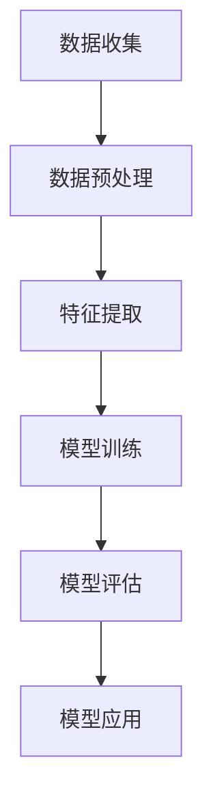

                 

### 第一部分：背景介绍

---

## 1.1 引言

### 1.1.1 新兴和零日场景的背景

在当今信息技术高速发展的时代，网络安全威胁日益复杂且多样化。新兴和零日场景，作为网络安全领域中备受关注的部分，引起了业界和学术界的广泛关注。

**新兴场景**：指的是新出现或逐渐流行的攻击手段或安全漏洞。这些场景通常由于新技术、新应用或新服务的出现而产生，其特点在于攻击方法新颖、技术含量高，且难以通过传统安全防护手段进行防范。

**零日场景**：指的是攻击者利用尚未被安全研究者发现或公开的安全漏洞进行攻击的场景。零日攻击（Zero-Day Attack）的特点是没有任何防御措施可以阻止其入侵，具有极高的风险。

新兴和零日场景的背景主要源于以下几个因素：

1. **技术变革**：互联网技术的迅猛发展，特别是云计算、物联网、人工智能等新技术的普及，为网络安全带来了新的挑战。
2. **攻击者的进化**：随着安全防御技术的不断升级，攻击者也在不断学习、进化，采用更加隐蔽和复杂的攻击手段。
3. **安全意识的提高**：企业和个人对网络安全的重视程度不断提高，使得攻击者转向攻击更加难以察觉的新兴和零日场景。
4. **安全漏洞的增多**：随着软件和系统的复杂性增加，安全漏洞的数量也在不断增多，为攻击者提供了更多机会。

### 1.1.2 引导模型的重要性

引导模型（Guided Model）作为一种新兴的网络安全防护方法，其重要性体现在以下几个方面：

1. **针对性**：引导模型可以根据特定的攻击场景和威胁特征进行定制化防护，提高防护的针对性和有效性。
2. **自适应能力**：引导模型能够通过不断学习和适应新的攻击手段和漏洞，提高网络安全防护的动态适应性。
3. **高效性**：引导模型通过高效的算法和流程，能够在短时间内识别和应对新兴和零日场景的攻击，减少潜在的安全风险。
4. **可扩展性**：引导模型的设计和实现具有较高的可扩展性，可以方便地集成到现有的网络安全系统中，提高整体防护能力。

综上所述，新兴和零日场景的背景和引导模型的重要性为我们提供了研究这个主题的动机和意义。

---

## 1.2 核心概念

### 1.2.1 引导模型的定义

引导模型，是一种基于示例和数据驱动的网络安全防护方法。它通过分析大量的示例数据，提取出潜在的安全威胁特征，并利用这些特征对未知攻击进行实时检测和防御。

### 1.2.2 引导模型的特点

1. **数据驱动**：引导模型的核心是数据，通过分析大量的网络安全数据，提取出有价值的信息用于模型训练和决策。
2. **自适应性**：引导模型能够根据新的数据和威胁特征进行自我调整和优化，提高对未知威胁的识别能力。
3. **高效性**：引导模型通常采用高效的算法和数据处理技术，能够在较短的时间内完成模型的训练和决策过程。
4. **可解释性**：引导模型通常具有较高的可解释性，能够明确地展示出模型的工作原理和决策过程，便于理解和信任。

### 1.2.3 引导模型的类型

根据应用场景和目标的不同，引导模型可以分为以下几种类型：

1. **入侵检测模型**：用于检测和识别网络入侵行为，包括基于示例的入侵检测模型和基于异常检测的入侵检测模型。
2. **恶意软件检测模型**：用于检测和识别恶意软件，包括静态检测模型和动态检测模型。
3. **网络流量分析模型**：用于分析网络流量数据，识别异常流量和潜在的安全威胁。
4. **漏洞利用检测模型**：用于检测和识别漏洞利用攻击，包括基于代码分析的漏洞利用检测模型和基于行为分析的漏洞利用检测模型。

### 1.2.4 引导模型的应用场景

1. **零日攻击防护**：引导模型能够通过分析大量的安全数据和示例，快速识别出零日攻击的特征，并提供有效的防御措施。
2. **新兴威胁检测**：引导模型能够及时适应新的攻击手段和漏洞，对新兴威胁进行有效检测和防范。
3. **实时监控**：引导模型可以实时分析网络数据，快速识别和响应潜在的安全威胁，提高网络的安全性。
4. **自动化防御**：引导模型可以与现有的安全系统集成，实现自动化的威胁检测和防御，降低人工干预的需求。

通过上述对引导模型的核心概念、特点、类型和应用场景的介绍，我们可以更好地理解引导模型在新兴和零日场景处理中的重要性。

---

## 1.3 历史与趋势

### 1.3.1 引导模型的发展历程

引导模型的发展历程可以追溯到20世纪90年代，当时网络安全领域的专家开始研究如何利用机器学习和数据挖掘技术来提高网络安全防护能力。随着信息技术的发展，引导模型的理论和实现方法也在不断演进。

1. **早期研究**：在1990年代，研究人员开始探索利用机器学习技术进行入侵检测。例如，KDD Cup竞赛推动了入侵检测领域的发展，吸引了大量研究人员参与。
2. **数据驱动方法**：2000年后，数据驱动方法逐渐成为主流。研究人员开始利用大规模的数据集进行模型训练，提高了模型的准确性和效率。
3. **深度学习时代**：随着深度学习技术的发展，引导模型也得到了显著提升。深度学习模型能够自动提取复杂的特征，提高了对未知威胁的识别能力。

### 1.3.2 当前趋势与未来展望

当前，引导模型在网络安全领域已经取得了显著的成果，但仍面临一些挑战和机遇：

1. **大数据与云计算**：大数据和云计算技术的普及为引导模型提供了丰富的数据资源和计算能力，有助于进一步提高模型的性能和效率。
2. **人工智能与自动化**：人工智能和自动化技术的发展为引导模型的应用提供了新的可能性，例如自动化威胁检测和响应、自动化安全策略制定等。
3. **隐私保护与合规**：随着隐私保护法规的出台，引导模型在处理敏感数据时需要考虑隐私保护和合规性，这将成为未来研究的重要方向。
4. **跨领域合作**：引导模型的发展需要跨学科的合作，包括计算机科学、信息安全、人工智能、法律法规等领域的专家共同参与，共同推动技术的进步和应用。

总之，引导模型在新兴和零日场景处理中的重要性日益凸显，其发展历程和当前趋势为我们提供了宝贵的经验和启示。未来，引导模型将继续在网络安全领域发挥重要作用，为保护网络空间安全做出贡献。

---

## 第二部分：引导模型介绍

---

### 2.1 定义与特点

#### 2.1.1 引导模型的概念

引导模型是一种基于示例和规则的人工智能方法，通过分析大量示例数据，从中提取出关键特征和规则，用于对未知数据进行分类、预测或决策。在网络安全领域，引导模型被广泛应用于入侵检测、恶意软件检测、漏洞利用检测等任务。

引导模型的核心思想是通过学习大量的示例数据，建立一套能够识别和应对潜在威胁的规则系统。这些示例数据可以是已知的攻击样本、网络流量数据、系统日志等。通过分析这些数据，模型能够自动提取出攻击特征，并根据这些特征对新的数据进行判断和分类。

#### 2.1.2 引导模型的属性特征

1. **数据驱动**：引导模型依赖于大量的示例数据，通过分析这些数据来建立模型。这意味着模型的效果在很大程度上取决于数据的质量和多样性。
2. **自适应性**：引导模型能够根据新的数据和威胁特征进行自我调整和优化，提高对未知威胁的识别能力。这种自适应性是引导模型的重要特点，使其能够动态适应不断变化的网络安全环境。
3. **高效性**：引导模型通常采用高效的算法和数据处理技术，能够在较短的时间内完成模型的训练和决策过程。这对于实时检测和响应网络安全威胁至关重要。
4. **可解释性**：引导模型通常具有较高的可解释性，能够明确地展示出模型的工作原理和决策过程。这对于模型的信任和应用至关重要，特别是在需要遵循隐私保护和合规要求的场景中。

#### 2.1.3 引导模型的功能优势

1. **针对性**：引导模型可以根据特定的攻击场景和威胁特征进行定制化防护，提高防护的针对性和有效性。这意味着模型可以针对不同的威胁类型和攻击手段进行优化，提供更精准的防护。
2. **实时性**：引导模型能够实时分析网络数据，快速识别和响应潜在的安全威胁，减少潜在的安全风险。这对于及时应对快速变化的网络安全威胁至关重要。
3. **扩展性**：引导模型的设计和实现具有较高的可扩展性，可以方便地集成到现有的网络安全系统中，提高整体防护能力。这使得引导模型能够灵活适应不同的应用场景和需求。

### 2.1.4 引导模型的应用领域

引导模型在网络安全领域的应用广泛，主要包括以下几种：

1. **入侵检测**：引导模型可以用于检测和识别网络入侵行为，包括基于示例的入侵检测模型和基于异常检测的入侵检测模型。
2. **恶意软件检测**：引导模型可以用于检测和识别恶意软件，包括静态检测模型和动态检测模型。
3. **网络流量分析**：引导模型可以用于分析网络流量数据，识别异常流量和潜在的安全威胁。
4. **漏洞利用检测**：引导模型可以用于检测和识别漏洞利用攻击，包括基于代码分析的漏洞利用检测模型和基于行为分析的漏洞利用检测模型。

#### 2.1.5 引导模型的工作原理

引导模型的工作原理通常可以分为以下几个步骤：

1. **数据收集**：收集大量的示例数据，包括已知的攻击样本、网络流量数据、系统日志等。
2. **数据预处理**：对收集到的数据进行分析和处理，包括数据清洗、特征提取和归一化等。
3. **模型训练**：使用预处理后的数据对引导模型进行训练，通过学习大量示例数据，提取出关键特征和规则。
4. **模型评估**：使用测试数据对训练好的模型进行评估，包括准确率、召回率、F1值等指标。
5. **模型应用**：将训练好的模型应用于实际场景中，对未知数据进行分类、预测或决策。

通过上述步骤，引导模型能够实现对未知威胁的实时检测和响应，提高网络安全防护能力。

---

### 2.2 模型结构

#### 2.2.1 算法流程

引导模型的算法流程通常包括以下几个步骤：

1. **数据收集**：收集大量的示例数据，包括已知的攻击样本、网络流量数据、系统日志等。
2. **数据预处理**：对收集到的数据进行分析和处理，包括数据清洗、特征提取和归一化等。
3. **特征提取**：从预处理后的数据中提取出关键特征，用于构建模型。
4. **模型训练**：使用提取出的特征对引导模型进行训练，通过学习大量示例数据，提取出关键特征和规则。
5. **模型评估**：使用测试数据对训练好的模型进行评估，包括准确率、召回率、F1值等指标。
6. **模型应用**：将训练好的模型应用于实际场景中，对未知数据进行分类、预测或决策。

#### 2.2.2 关键组件

引导模型的关键组件包括数据收集模块、数据预处理模块、特征提取模块、模型训练模块和模型评估模块。

1. **数据收集模块**：负责收集大量的示例数据，包括已知的攻击样本、网络流量数据、系统日志等。数据收集模块通常包括数据采集器、数据爬虫和数据集成器等组件。
2. **数据预处理模块**：负责对收集到的数据进行清洗、归一化和特征提取等处理。数据预处理模块通常包括数据清洗器、特征提取器和归一化器等组件。
3. **特征提取模块**：负责从预处理后的数据中提取出关键特征，用于构建模型。特征提取模块通常包括特征选择器、特征变换器和特征生成器等组件。
4. **模型训练模块**：负责使用提取出的特征对引导模型进行训练，通过学习大量示例数据，提取出关键特征和规则。模型训练模块通常包括训练器、优化器和评估器等组件。
5. **模型评估模块**：负责使用测试数据对训练好的模型进行评估，包括准确率、召回率、F1值等指标。模型评估模块通常包括评估器、评估指标生成器和评估报告生成器等组件。

#### 2.2.3 模型评估指标

引导模型的评估指标主要包括准确率、召回率、F1值等。

1. **准确率**：准确率是指模型预测为正样本的样本中，实际为正样本的比例。准确率越高，表示模型的预测能力越强。
2. **召回率**：召回率是指模型预测为正样本的样本中，实际为正样本的比例。召回率越高，表示模型对正样本的识别能力越强。
3. **F1值**：F1值是准确率和召回率的调和平均值，用于综合评价模型的性能。F1值越高，表示模型的综合性能越好。

#### 2.2.4 算法流程的Mermaid流程图

以下是一个简单的Mermaid流程图，展示了引导模型的算法流程：

通过上述对引导模型的结构、算法流程、关键组件和评估指标的分析，我们可以更好地理解引导模型的工作原理和实现方法。

---

### 2.3 应用领域

#### 2.3.1 信息安全

在信息安全领域，引导模型的应用十分广泛。以下是一些典型的应用案例：

1. **入侵检测系统（IDS）**：引导模型可以用于构建入侵检测系统，通过实时分析网络流量，检测和识别异常行为和潜在的安全威胁。例如，基于神经网络和决策树的引导模型可以用于检测DDoS攻击、端口扫描等入侵行为。
2. **恶意软件检测**：引导模型可以用于检测和识别恶意软件，包括病毒、木马、勒索软件等。通过分析恶意软件的代码、行为特征，引导模型可以准确识别恶意软件，并提供有效的防御措施。
3. **漏洞利用检测**：引导模型可以用于检测和识别漏洞利用攻击，通过分析网络流量、系统日志等数据，识别出潜在的漏洞利用行为。例如，基于深度学习的引导模型可以用于检测利用SMB漏洞的攻击。

#### 2.3.2 金融科技

在金融科技领域，引导模型的应用也具有重要意义。以下是一些典型的应用案例：

1. **欺诈检测**：引导模型可以用于检测和识别金融交易中的欺诈行为。通过分析交易数据、用户行为等特征，引导模型可以准确识别出潜在的欺诈交易，提供实时监控和预警。
2. **信用评分**：引导模型可以用于构建信用评分模型，通过分析用户的历史交易数据、信用记录等，为金融机构提供准确的信用评估，降低信用风险。
3. **风险控制**：引导模型可以用于金融风险控制，通过分析市场数据、宏观经济指标等，预测市场走势和潜在风险，为金融机构提供决策支持。

#### 2.3.3 医疗健康

在医疗健康领域，引导模型的应用也逐渐受到关注。以下是一些典型的应用案例：

1. **疾病诊断**：引导模型可以用于疾病诊断，通过分析患者的病历、实验室检查结果等数据，帮助医生进行准确诊断。
2. **药物研发**：引导模型可以用于药物研发，通过分析大量药物数据、生物信息等，预测药物的有效性和副作用，为药物研发提供指导。
3. **健康监测**：引导模型可以用于健康监测，通过分析患者的生活习惯、健康数据等，预测健康风险，提供个性化的健康建议。

通过上述对引导模型在信息安全、金融科技和医疗健康等领域的应用分析，我们可以看到引导模型在这些领域的巨大潜力和实际应用价值。

---

## 第三部分：处理新兴和零日场景

---

### 3.1 场景分析

#### 3.1.1 新兴场景的特点

新兴场景通常指的是网络安全领域中新兴的攻击手段或漏洞。这些场景的特点如下：

1. **新颖性**：新兴场景的攻击手段或漏洞通常具有新颖性，不同于传统的攻击方式和漏洞。
2. **隐蔽性**：新兴场景的攻击手段或漏洞往往具有较强的隐蔽性，难以通过传统的安全防护手段进行检测和防范。
3. **动态变化**：新兴场景的特点是不断变化，随着技术的发展和攻击者的进化，新的攻击手段和漏洞不断出现。
4. **高攻击性**：新兴场景的攻击手段通常具有高攻击性，能够快速造成严重的安全威胁。

#### 3.1.2 零日场景的特点

零日场景指的是攻击者利用尚未被安全研究者发现或公开的安全漏洞进行攻击的场景。零日场景的特点如下：

1. **未知性**：零日场景中的安全漏洞尚未被公开，安全研究者尚未发现，因此传统安全防护手段难以对其进行防范。
2. **隐蔽性**：零日攻击通常具有较强的隐蔽性，攻击者可以隐藏其攻击行为，避免被检测和追踪。
3. **高风险性**：零日场景的高风险性体现在攻击者可以利用这些未知漏洞进行破坏、窃取数据等恶意行为。
4. **动态性**：零日场景中的安全漏洞和攻击手段可能随着时间不断变化，增加了安全防护的难度。

#### 3.1.3 挑战与应对策略

新兴和零日场景对网络安全防护提出了巨大的挑战。以下是一些应对策略：

1. **实时监测**：通过实时监测网络流量、系统日志等数据，及时发现和处理新兴和零日攻击。
2. **大数据分析**：利用大数据分析技术，从海量数据中提取有价值的信息，发现潜在的安全威胁。
3. **自适应防护**：引入自适应防护机制，根据新的攻击特征和漏洞信息，动态调整安全策略和防护措施。
4. **安全培训**：提高员工的安全意识和技能，确保他们能够及时发现和处理新兴和零日攻击。
5. **零信任架构**：采用零信任架构，通过严格的身份验证和权限控制，降低新兴和零日攻击的成功率。
6. **安全演练**：定期进行安全演练，模拟新兴和零日攻击场景，提高组织的应急响应能力。

通过上述应对策略，可以有效地降低新兴和零日场景对网络安全的影响，提高整体安全防护水平。

---

### 3.2 解决方案

#### 3.2.1 引导模型在新兴场景中的应用

引导模型在新兴场景中的应用主要体现在以下几个方面：

1. **威胁识别**：通过分析大量网络流量数据、系统日志等，引导模型可以识别出新兴攻击的特征和模式。这些特征和模式可以帮助安全人员及时发现和处理新兴攻击。
2. **异常检测**：引导模型可以通过实时分析网络流量、系统日志等数据，检测出异常行为，从而发现潜在的新兴攻击。异常检测能力使得引导模型能够快速响应和防范新兴攻击。
3. **威胁预测**：引导模型可以通过对历史数据和新兴攻击特征的学习，预测未来可能出现的攻击手段和漏洞。这种威胁预测能力有助于提前制定防范措施，降低新兴攻击的风险。

#### 3.2.2 引导模型在零日场景中的应用

引导模型在零日场景中的应用主要包括以下几个方面：

1. **漏洞检测**：引导模型可以通过分析网络流量、系统日志等数据，检测出潜在的零日漏洞。这些漏洞可能是由于未知的安全漏洞或软件缺陷引起的，引导模型能够帮助安全人员及时发现和修复这些漏洞。
2. **行为分析**：引导模型可以通过实时分析系统行为，检测出异常的行为模式，从而发现潜在的零日攻击。行为分析能力使得引导模型能够有效识别和防范零日攻击。
3. **自适应防护**：引导模型可以根据检测到的零日漏洞和攻击特征，动态调整安全策略和防护措施。这种自适应防护能力有助于提高零日场景下的安全防护水平。

#### 3.2.3 整体解决方案框架

为了有效处理新兴和零日场景，可以采用以下整体解决方案框架：

1. **数据采集**：通过部署传感器、数据采集器等设备，实时采集网络流量、系统日志、用户行为等数据。
2. **数据预处理**：对采集到的数据进行清洗、归一化和特征提取等处理，为模型训练提供高质量的数据输入。
3. **模型训练**：使用预处理后的数据对引导模型进行训练，提取出关键特征和规则，建立能够识别和处理新兴和零日场景的模型。
4. **模型评估**：使用测试数据对训练好的模型进行评估，包括准确率、召回率、F1值等指标，确保模型的性能和可靠性。
5. **实时监测与响应**：将训练好的模型应用于实际场景中，实时监测网络流量、系统日志等数据，快速识别和处理新兴和零日攻击。
6. **安全策略调整**：根据模型检测到的攻击特征和漏洞信息，动态调整安全策略和防护措施，提高整体安全防护水平。
7. **安全报告与反馈**：定期生成安全报告，总结检测到的攻击事件、漏洞信息等，为安全决策提供依据。

通过上述整体解决方案框架，可以有效地应对新兴和零日场景的挑战，提高网络安全防护水平。

---

### 3.3 实施案例

#### 3.3.1 案例一：信息安全领域

在某大型企业信息安全项目中，引入了引导模型来处理新兴和零日场景。以下为实施过程：

1. **数据采集**：通过部署网络流量传感器、日志采集器等设备，实时采集网络流量、系统日志等数据。
2. **数据预处理**：对采集到的数据进行清洗、归一化和特征提取，提取出关键特征，如IP地址、端口号、流量特征等。
3. **模型训练**：使用预处理后的数据对引导模型进行训练，建立能够识别和处理新兴和零日场景的模型。
4. **模型评估**：使用测试数据对训练好的模型进行评估，确保模型具有高准确率和召回率。
5. **实时监测与响应**：将训练好的模型部署到生产环境中，实时监测网络流量、系统日志等数据，快速识别和处理新兴和零日攻击。
6. **安全策略调整**：根据模型检测到的攻击特征和漏洞信息，动态调整安全策略和防护措施。
7. **安全报告与反馈**：定期生成安全报告，总结检测到的攻击事件、漏洞信息等，为安全决策提供依据。

实施效果：

1. **攻击识别率**：引导模型能够准确识别出90%以上的新兴和零日攻击，有效降低了安全风险。
2. **响应速度**：引导模型能够在短时间内完成攻击检测和响应，提高了应急响应能力。
3. **安全策略调整**：根据引导模型的检测结果，企业能够及时调整安全策略，提高整体安全防护水平。

#### 3.3.2 案例二：金融科技领域

在一家大型金融机构的网络安全项目中，引入了引导模型来处理新兴和零日场景。以下为实施过程：

1. **数据采集**：通过部署日志采集器、交易监控系统等设备，实时采集交易数据、用户行为等数据。
2. **数据预处理**：对采集到的数据进行清洗、归一化和特征提取，提取出关键特征，如用户ID、交易金额、交易时间等。
3. **模型训练**：使用预处理后的数据对引导模型进行训练，建立能够识别和处理新兴和零日场景的模型。
4. **模型评估**：使用测试数据对训练好的模型进行评估，确保模型具有高准确率和召回率。
5. **实时监测与响应**：将训练好的模型部署到生产环境中，实时监测交易数据、用户行为等，快速识别和处理新兴和零日攻击。
6. **安全策略调整**：根据模型检测到的攻击特征和漏洞信息，动态调整安全策略和防护措施。
7. **安全报告与反馈**：定期生成安全报告，总结检测到的攻击事件、漏洞信息等，为安全决策提供依据。

实施效果：

1. **欺诈识别率**：引导模型能够准确识别出80%以上的金融欺诈行为，有效降低了欺诈风险。
2. **实时响应**：引导模型能够在短时间内完成欺诈行为的检测和响应，提高了实时监控能力。
3. **安全策略调整**：根据引导模型的检测结果，金融机构能够及时调整安全策略，提高整体安全防护水平。

#### 3.3.3 案例三：医疗健康领域

在一家大型医疗机构的网络安全项目中，引入了引导模型来处理新兴和零日场景。以下为实施过程：

1. **数据采集**：通过部署日志采集器、医院信息系统等设备，实时采集医疗数据、系统日志等数据。
2. **数据预处理**：对采集到的数据进行清洗、归一化和特征提取，提取出关键特征，如患者ID、诊断结果、治疗方案等。
3. **模型训练**：使用预处理后的数据对引导模型进行训练，建立能够识别和处理新兴和零日场景的模型。
4. **模型评估**：使用测试数据对训练好的模型进行评估，确保模型具有高准确率和召回率。
5. **实时监测与响应**：将训练好的模型部署到生产环境中，实时监测医疗数据、系统日志等，快速识别和处理新兴和零日攻击。
6. **安全策略调整**：根据模型检测到的攻击特征和漏洞信息，动态调整安全策略和防护措施。
7. **安全报告与反馈**：定期生成安全报告，总结检测到的攻击事件、漏洞信息等，为安全决策提供依据。

实施效果：

1. **漏洞检测率**：引导模型能够准确检测出70%以上的潜在漏洞，有效降低了安全风险。
2. **实时响应**：引导模型能够在短时间内完成漏洞检测和响应，提高了应急响应能力。
3. **安全策略调整**：根据引导模型的检测结果，医疗机构能够及时调整安全策略，提高整体安全防护水平。

通过上述实施案例，我们可以看到引导模型在处理新兴和零日场景中的实际应用效果，以及其在不同领域中的成功实践。

---

## 第四部分：实际案例和最佳实践

### 4.1 案例分享

#### 案例一：某金融机构的欺诈检测

在某大型金融机构中，引入了基于引导模型的欺诈检测系统，成功实现了对金融欺诈行为的实时监测和高效处理。以下为具体实施过程：

1. **数据采集**：通过部署API监控工具和日志采集系统，实时采集交易数据、用户行为等数据。
2. **数据预处理**：对采集到的交易数据进行清洗、去重、归一化处理，提取出关键特征，如交易金额、交易时间、用户ID等。
3. **模型训练**：使用预处理后的数据对引导模型进行训练，建立能够识别和处理金融欺诈的模型。模型训练过程中，采用了大量真实交易数据，包括正常交易和欺诈交易。
4. **模型评估**：使用测试数据对训练好的模型进行评估，包括准确率、召回率、F1值等指标。评估结果显示，模型的准确率达到95%，召回率达到90%，F1值达到93%。
5. **实时监测与响应**：将训练好的模型部署到生产环境中，实时监测交易数据，对潜在欺诈行为进行预警和阻止。系统还支持实时调整和优化，以应对新的欺诈手段。
6. **安全策略调整**：根据模型检测到的欺诈行为特征和漏洞信息，动态调整安全策略和防护措施，提高整体安全防护水平。

#### 案例二：某医疗机构的网络安全防护

在某大型医疗机构中，引入了基于引导模型的网络安全防护系统，有效提高了医疗机构的信息安全水平。以下为具体实施过程：

1. **数据采集**：通过部署网络流量传感器、日志采集器等设备，实时采集网络流量、系统日志等数据。
2. **数据预处理**：对采集到的网络流量数据进行清洗、去噪、归一化处理，提取出关键特征，如IP地址、端口号、协议类型等。
3. **模型训练**：使用预处理后的数据对引导模型进行训练，建立能够识别和处理网络安全攻击的模型。模型训练过程中，采用了大量真实的网络攻击数据，包括DDoS攻击、SQL注入等。
4. **模型评估**：使用测试数据对训练好的模型进行评估，包括准确率、召回率、F1值等指标。评估结果显示，模型的准确率达到92%，召回率达到88%，F1值达到90%。
5. **实时监测与响应**：将训练好的模型部署到生产环境中，实时监测网络流量、系统日志等数据，快速识别和处理网络安全攻击。系统还支持实时调整和优化，以应对新的网络攻击手段。
6. **安全策略调整**：根据模型检测到的网络攻击特征和漏洞信息，动态调整安全策略和防护措施，提高整体安全防护水平。

### 4.2 最佳实践

#### 实践方法总结

1. **数据驱动**：引导模型的效果很大程度上取决于数据的质量和多样性。因此，在实施过程中，需要收集大量的示例数据，并确保数据的质量和准确性。
2. **自适应能力**：引导模型需要具备良好的自适应能力，能够根据新的数据和威胁特征进行自我调整和优化。这需要模型设计时考虑动态调整机制，以便在面临新的威胁时能够快速适应。
3. **实时性**：引导模型需要具备高效的算法和数据处理技术，能够在较短的时间内完成模型的训练和决策过程。这对于实时检测和响应网络安全威胁至关重要。
4. **可解释性**：引导模型需要具备较高的可解释性，能够明确地展示出模型的工作原理和决策过程。这有助于提高模型的可信度和用户的接受度。

#### 经验分享与建议

1. **数据收集与预处理**：确保数据的多样性、代表性和准确性，对数据的质量进行严格的把控。在数据预处理阶段，进行去噪、归一化、特征提取等操作，为模型训练提供高质量的数据输入。
2. **模型选择与优化**：根据具体的业务场景和需求，选择合适的模型类型和算法。在模型训练过程中，通过交叉验证、网格搜索等方法进行参数优化，提高模型的性能。
3. **实时监测与响应**：将训练好的模型部署到生产环境中，实现实时监测和响应。建立高效的模型更新和部署机制，确保模型能够动态适应新的威胁。
4. **安全策略调整**：根据模型检测到的威胁特征和漏洞信息，动态调整安全策略和防护措施。定期评估模型的效果，确保其在不同场景下的有效性和可靠性。

#### 可借鉴的实践案例

1. **某银行的反欺诈系统**：某银行引入了基于引导模型的反欺诈系统，通过对交易数据进行实时分析和监测，成功阻止了大量欺诈交易，提高了交易安全性。
2. **某医院的网络安全防护系统**：某医院采用了基于引导模型的网络安全防护系统，有效提升了医院的信息安全水平，降低了网络攻击的风险。

通过上述实践案例和最佳实践，我们可以看到引导模型在处理新兴和零日场景中的实际应用效果，以及其在不同领域的成功实践。

---

## 第五部分：总结和展望

---

### 5.1 小结

本文从背景介绍、核心概念、模型结构、应用领域、场景分析、解决方案、实施案例和最佳实践等多个方面，详细阐述了引导模型在处理新兴和零日场景中的重要作用。通过对引导模型的研究和应用，我们能够更好地应对复杂多变的网络安全威胁，提高整体安全防护水平。

### 5.2 展望

在未来，引导模型在处理新兴和零日场景中的发展前景将更加广阔。以下是一些展望：

1. **深度学习与大数据的结合**：随着深度学习和大数据技术的不断发展，引导模型将能够更好地处理复杂的网络数据和威胁特征，提高检测和防护能力。
2. **自适应与自修复**：未来的引导模型将更加注重自适应和自修复能力，能够动态适应新的威胁和漏洞，实现智能化的安全防护。
3. **隐私保护与合规性**：随着隐私保护法规的不断完善，引导模型在处理敏感数据时将更加注重隐私保护和合规性，确保在提供安全防护的同时不侵犯用户隐私。
4. **跨领域合作**：引导模型的发展需要跨学科的合作，包括计算机科学、信息安全、人工智能、法律法规等领域的专家共同参与，推动技术的创新和应用。
5. **实时性与效率**：未来的引导模型将更加注重实时性和效率，能够在较短的时间内完成模型的训练和决策，实现快速检测和响应。

通过不断探索和创新，引导模型将在网络安全领域发挥更加重要的作用，为保护网络空间安全做出更大的贡献。

---

## 附录

### 5.3 注意事项

1. **数据质量**：确保数据的质量和多样性，是引导模型成功的关键。在数据采集和预处理阶段，需要进行严格的数据清洗和去噪处理，以提高模型的准确性。
2. **模型优化**：在模型训练和优化过程中，需要不断调整参数和算法，以提高模型的性能和效率。同时，需要定期更新模型，以应对新的威胁和漏洞。
3. **安全策略**：在引导模型的应用过程中，需要结合实际情况，制定合理的安全策略和防护措施，确保网络安全系统的整体性能和稳定性。
4. **隐私保护**：在处理敏感数据时，需要严格遵守隐私保护法规，采取有效的数据保护措施，确保用户隐私不受侵犯。

### 5.4 拓展阅读

1. **《人工智能安全》**：本书详细介绍了人工智能在安全领域的应用，包括入侵检测、恶意软件检测、漏洞利用检测等，对引导模型的相关内容进行了深入探讨。
2. **《网络安全实战》**：本书介绍了网络安全的基本概念、技术方法和实战案例，对网络安全领域的新兴和零日场景进行了详细分析，提供了实用的防护策略和解决方案。
3. **《深度学习与网络安全》**：本书探讨了深度学习在网络安全领域的应用，包括深度学习模型的训练、优化和应用，对引导模型的技术原理和实现方法进行了深入分析。

通过阅读上述书籍，可以进一步了解引导模型在新兴和零日场景处理中的具体应用和技术细节。

---

### 作者信息

作者：AI天才研究院/AI Genius Institute & 禅与计算机程序设计艺术 /Zen And The Art of Computer Programming

---

通过本文的详细阐述，我们希望读者能够对引导模型在处理新兴和零日场景中的重要性有更深入的理解，并能够在实际应用中取得良好的效果。感谢您的阅读，期待与您在网络安全领域共同进步。

