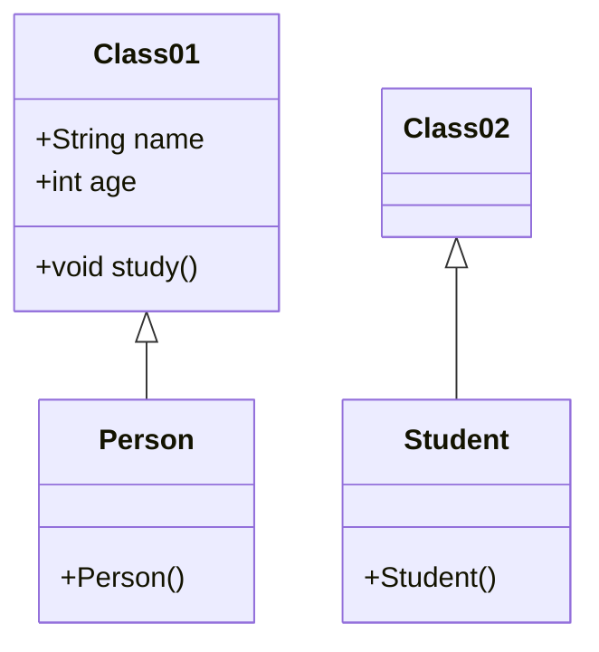
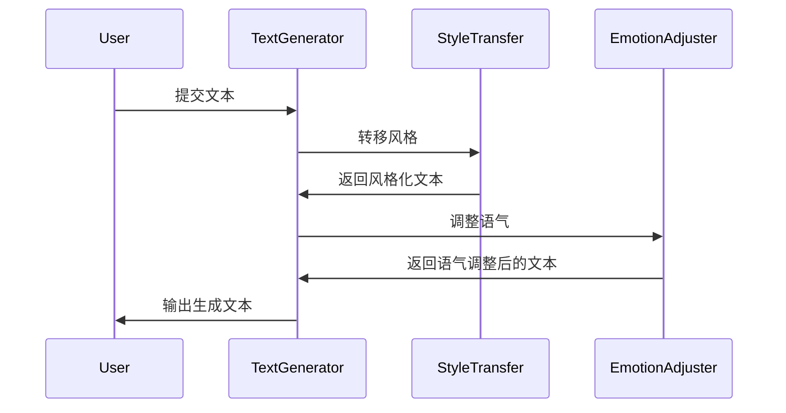
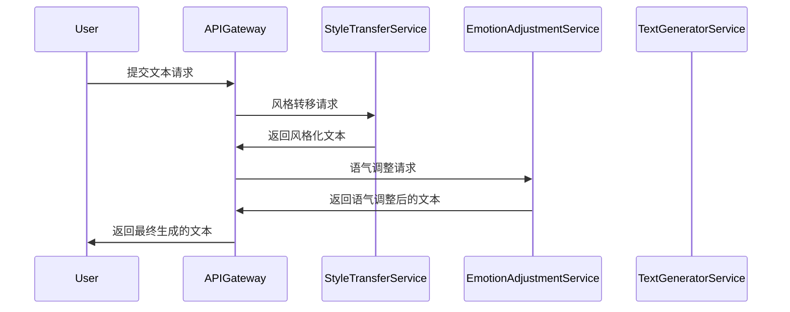

                 

### 引入

在当今信息技术飞速发展的时代，文本处理和生成已经成为众多应用场景的核心需求。无论是自然语言处理（NLP）的文本分类、情感分析，还是生成式AI的自动写作、内容创作，文本的风格和语气都起着至关重要的作用。为了满足这些需求，一种名为“示例引导模型（Example-Based Modeling，简称EGM）”的技术应运而生。EGM利用大量的示例文本，通过学习和模仿这些示例，自动生成具有特定风格和语气的文本。

本文将深入探讨如何利用EGM实现文本的风格和语气调整，从而提升文本处理和生成的质量和效果。我们将首先介绍EGM的基本概念和原理，然后通过具体案例展示其在风格迁移和语气调整中的应用，最后分析系统架构和实际案例分析，帮助读者全面理解并掌握EGM在文本处理中的关键技术。

本文的关键词包括：**示例引导模型（EGM）、风格迁移、语气调整、文本处理、自然语言生成**。

摘要：本文旨在详细探讨示例引导模型（EGM）在文本风格和语气调整中的应用。首先，我们将介绍EGM的基本概念和原理，并对比其与其他相关技术的优缺点。接着，通过具体案例，展示EGM在风格迁移和语气调整中的实际应用，并使用Python代码和数学模型进行详细讲解。随后，我们将分析系统架构和实际案例分析，最后总结项目经验和最佳实践，并提供拓展阅读建议。

### 问题背景

#### 问题提出

在当今的信息化社会中，文本生成和处理已经成为众多应用场景中的核心需求。然而，如何确保生成的文本不仅内容准确，还具有特定的风格和语气，成为了一个亟待解决的问题。传统的文本生成方法，如基于规则的方法和基于模板的方法，虽然在一定程度上能够生成符合预期内容的文本，但在风格和语气方面往往缺乏灵活性和多样性。此外，随着自然语言处理（NLP）技术的不断发展，对文本风格和语气调整的需求也越来越高。这种需求不仅仅体现在日常的文字创作中，如新闻撰写、广告文案、社交媒体帖子等，还广泛应用于企业内部沟通、客户服务、教育辅导等场景。

#### 问题描述

文本的风格和语气调整问题可以从多个维度进行描述：

1. **风格多样性**：不同的文本应用场景需要不同的风格，如正式、非正式、幽默、严肃等。例如，企业内部公告通常需要正式严谨的风格，而社交媒体帖子则可能需要轻松幽默的语气。
2. **语气一致性**：即使是同一篇文本，在不同上下文中也可能需要不同的语气。例如，一篇关于医疗健康的文章在向患者解释时需要温和的语气，而在向医生同行介绍时则可能需要专业的语气。
3. **情感表达**：文本中的情感表达也是风格和语气调整的重要方面。如何准确表达作者的意图，传达出积极、消极或中性的情感，是文本生成中的一大挑战。

#### 问题解决

为了解决上述问题，目前有多种方法被提出来实现文本风格和语气的调整，包括：

1. **基于规则的方法**：这种方法通过预先定义的规则来调整文本的风格和语气。虽然简单易行，但灵活性和适应性较差，难以应对复杂多变的文本需求。
2. **基于模板的方法**：这种方法使用预定义的模板来生成文本，通过选择不同的模板来调整风格和语气。相比基于规则的方法，基于模板的方法具有一定的灵活性，但模板的设计和维护成本较高。
3. **深度学习方法**：随着深度学习技术的发展，特别是生成式对抗网络（GAN）和变分自编码器（VAE）等模型的出现，文本风格和语气调整迎来了新的机遇。这些方法能够通过大量数据学习文本的风格和语气特征，从而生成符合要求的文本。

然而，尽管深度学习方法在文本生成中表现出色，但如何高效、准确地利用示例文本来调整风格和语气，仍然是一个亟待解决的问题。这促使我们进一步研究示例引导模型（EGM），以探索其在文本风格和语气调整中的潜力。

#### 边界与外延

在文本风格和语气调整的问题中，我们需要明确几个关键边界：

1. **文本类型**：不同的文本类型（如新闻、小说、邮件、评论等）对风格和语气的要求各不相同。EGM需要针对不同类型的文本设计相应的调整策略。
2. **上下文信息**：文本的上下文信息对于风格和语气的调整至关重要。EGM需要能够理解和利用上下文信息，以确保生成的文本在上下文中保持一致性和连贯性。
3. **情感表达**：情感表达是文本风格和语气调整的核心。EGM需要能够准确识别和生成不同情感状态的文本，以满足各种情感表达需求。

通过明确这些问题和边界，我们为后续的EGM研究奠定了基础，并为进一步探索文本风格和语气调整提供了清晰的框架和方向。

#### 核心概念

在深入探讨示例引导模型（EGM）之前，我们需要明确几个核心概念，这些概念包括：**示例引导模型（EGM）的基本概念、风格迁移、语气调整、以及这些概念之间的联系和区别**。

##### 示例引导模型（EGM）的基本概念

示例引导模型（Example-Based Modeling，简称EGM）是一种基于示例学习的文本生成方法。它通过分析大量示例文本，学习文本的语法、语义和风格特征，从而生成具有特定风格和语气的文本。EGM的基本思想是：通过对大量示例文本的学习，模型能够理解并模仿这些文本的风格和语气，从而生成新的文本。

EGM的核心组成部分包括：

1. **示例文本**：示例文本是EGM训练和学习的基础。这些文本需要具有多样化的风格和语气，以便模型能够学习到丰富的特征。
2. **特征提取器**：特征提取器是EGM的核心组件之一，用于从示例文本中提取出与风格和语气相关的特征。常见的特征提取方法包括词袋模型（Bag of Words，BoW）、词嵌入（Word Embedding）和变换器（Transformer）等。
3. **生成器**：生成器是EGM的另一核心组件，用于根据提取的特征生成新的文本。生成器的实现可以采用序列到序列（Seq2Seq）模型、递归神经网络（RNN）、长短时记忆网络（LSTM）或变换器等。

##### 风格迁移

风格迁移是指将一种文本的风格转移到另一种文本的过程。在文本生成和应用中，风格迁移是一种常见的需求。例如，将一篇正式的商务报告转化为非正式的社交媒体帖子，或者将一篇幽默的短篇小说转化为严肃的评论文章。

风格迁移的关键在于理解源文本和目标文本之间的风格差异，并将这些差异映射到生成的新文本中。EGM在风格迁移中的应用，可以通过以下步骤实现：

1. **风格特征提取**：从源文本和目标文本中提取与风格相关的特征。
2. **特征映射**：将源文本的风格特征映射到目标文本中，生成具有目标风格的文本。
3. **文本生成**：利用提取的特征生成新的文本，确保新文本既符合目标风格，又保持源文本的核心信息。

##### 语气调整

语气调整是指调整文本中的情感表达，使其符合特定的情绪或意图。语气调整广泛应用于情感分析、自动写作、用户互动等场景。例如，将一篇消极的评论调整为积极的态度，或将一篇普通的新闻报道调整为具有吸引力的标题。

语气调整的核心是情感识别和情感生成。EGM在语气调整中的应用，可以通过以下步骤实现：

1. **情感识别**：从文本中识别出当前的情感状态，如积极、消极或中性。
2. **情感调整**：根据目标情感，调整文本中的情感表达。
3. **文本生成**：利用调整后的情感表达生成新的文本。

##### 核心概念属性特征对比表格

为了更好地理解EGM、风格迁移和语气调整这三个核心概念，我们可以通过一个特征对比表格来展示它们之间的区别和联系：

| 特征类别     | 示例引导模型（EGM） | 风格迁移               | 语气调整               |
|------------|------------------|----------------------|----------------------|
| 目标        | 生成具有特定风格和语气的文本 | 将源文本的风格转移到目标文本 | 调整文本中的情感表达   |
| 基础思想     | 通过示例学习文本特征     | 分析源文本和目标文本的风格差异 | 识别文本的情感状态并调整 |
| 数据需求     | 大量多样化的示例文本   | 具有明确风格差异的文本对 | 具有情感标签的文本数据  |
| 应用场景     | 自动写作、内容创作     | 广告文案、新闻报道等      | 情感分析、客户服务     |
| 技术实现     | 特征提取器 + 生成器    | 特征提取 + 特征映射      | 情感识别 + 情感生成     |

通过上述对比，我们可以看到EGM、风格迁移和语气调整在目标、基础思想、数据需求和应用场景等方面存在显著差异，但它们的核心思想都是通过学习和调整文本特征，生成满足特定需求的文本。

##### E-R实体关系图架构

为了进一步理解EGM、风格迁移和语气调整的概念和关系，我们可以使用E-R（Entity-Relationship）实体关系图来展示它们之间的联系。

在E-R图中，实体表示核心概念，关系表示概念之间的关联。以下是EGM、风格迁移和语气调整的E-R实体关系图：

```mermaid
erDiagram
    StyleAdjustment ||--|{ ExampleBasedModeling } : uses
    StyleAdjustment ||--|{ TextStyle } : adjusts
    TextStyle ||--|{ SentimentAdjustment } : has
    SentimentAdjustment ||--|{ ExampleBasedModeling } : uses
    ExampleBasedModeling ||--|{ TextGeneration } : generates

    ExampleBasedModeling { style: "filled", color: "lightblue" }
    StyleAdjustment { style: "filled", color: "lightgreen" }
    TextStyle { style: "filled", color: "orange" }
    SentimentAdjustment { style: "filled", color: "purple" }
    TextGeneration { style: "filled", color: "pink" }
```

在这个E-R图中，`ExampleBasedModeling`（示例引导模型）是核心实体，它与`StyleAdjustment`（风格调整）和`SentimentAdjustment`（语气调整）之间存在直接关联。同时，`StyleAdjustment`和`SentimentAdjustment`分别与`TextStyle`（文本风格）和`TextGeneration`（文本生成）相关联，表明EGM不仅用于生成文本，还用于调整文本的风格和语气。

通过E-R实体关系图的展示，我们可以更清晰地理解EGM、风格迁移和语气调整之间的内在联系，以及它们在文本生成和处理中的应用。

### 示例引导模型（EGM）算法原理

示例引导模型（Example-Based Modeling，简称EGM）是一种基于示例学习的文本生成方法，通过分析大量示例文本，学习文本的语法、语义和风格特征，从而生成具有特定风格和语气的文本。EGM的核心组件包括特征提取器和生成器，下面我们将详细探讨EGM的基本概念、优势与局限，并通过mermaid流程图和Python代码示例来展示其工作原理。

#### 示例引导模型（EGM）简介

EGM的基本概念可以概括为以下几个步骤：

1. **示例文本收集**：首先，需要收集大量具有特定风格和语气的示例文本。这些文本可以是各种来源的文本数据，如书籍、文章、社交媒体帖子等。
2. **特征提取**：从示例文本中提取与风格和语气相关的特征。特征提取的方法可以采用词袋模型（Bag of Words，BoW）、词嵌入（Word Embedding）或变换器（Transformer）等。
3. **模型训练**：利用提取的特征，通过机器学习算法训练生成器模型。生成器模型可以采用序列到序列（Seq2Seq）模型、递归神经网络（RNN）、长短时记忆网络（LSTM）或变换器等。
4. **文本生成**：使用训练好的生成器模型，根据输入的文本或上下文生成具有特定风格和语气的文本。

EGM的优势在于其灵活性高、适应性强，能够生成多样化风格的文本。此外，EGM不需要大量的标注数据，通过无监督学习方式即可实现风格和语气的调整。然而，EGM也存在一些局限，如生成文本的质量和一致性可能受到示例数据质量的影响，以及模型训练过程中可能出现的过拟合问题。

#### 示例引导模型（EGM）的优势与局限

以下是对EGM优势与局限的详细分析：

1. **优势**
   - **灵活性高**：EGM能够灵活地调整文本的风格和语气，适应各种应用场景。
   - **适应性**：EGM不需要大量的标注数据，通过无监督学习方式即可实现风格和语气的调整。
   - **多样化风格**：EGM能够生成多样化的风格，满足不同用户和场景的需求。

2. **局限**
   - **数据依赖**：EGM的生成质量高度依赖于示例数据的质量，示例数据的多样性和代表性对生成效果有直接影响。
   - **过拟合**：在模型训练过程中，可能因为示例数据量不足或质量不佳，导致模型过拟合，生成文本质量下降。
   - **计算资源消耗**：EGM的训练过程可能需要大量的计算资源，尤其是当使用复杂的模型结构如变换器时。

#### EGM的mermaid流程图

为了更直观地展示EGM的工作流程，我们可以使用mermaid绘制EGM的流程图。以下是EGM的基本工作流程：


在这个流程图中，首先进行示例文本收集，然后通过特征提取器提取特征，接着使用这些特征训练生成器模型，最后利用训练好的模型生成新的文本。

#### Python代码示例

为了更具体地展示EGM的应用，我们提供了一个简单的Python代码示例，该示例使用GPT-2模型进行文本生成。首先，需要安装transformers库：

```python
!pip install transformers
```

然后，使用以下代码加载预训练的GPT-2模型，并生成具有特定风格的文本：

```python
from transformers import GPT2LMHeadModel, GPT2Tokenizer

# 加载预训练的GPT-2模型和分词器
model = GPT2LMHeadModel.from_pretrained("gpt2")
tokenizer = GPT2Tokenizer.from_pretrained("gpt2")

# 输入文本，生成风格化的文本
input_text = "今天天气很好，适合出去散步。"
input_ids = tokenizer.encode(input_text, return_tensors='pt')

# 使用模型生成文本
outputs = model.generate(input_ids, max_length=50, num_return_sequences=1)

# 解码生成文本
generated_text = tokenizer.decode(outputs[0], skip_special_tokens=True)
print(generated_text)
```

在这个示例中，我们首先加载了预训练的GPT-2模型和分词器，然后输入一段文本，并使用模型生成具有特定风格的文本。生成的文本将根据模型训练时的示例数据，模仿相应的风格和语气。

通过以上分析和代码示例，我们可以看到EGM在文本生成和风格、语气调整中的应用。EGM作为一种灵活且适应性强的文本生成方法，在当前和未来的文本处理和生成应用中具有广泛的应用前景。

#### 数学模型与公式

在EGM（示例引导模型）的算法原理中，数学模型和公式扮演着关键角色。这些模型和公式不仅帮助我们在理论上理解EGM的工作机制，还指导我们在实践中进行模型设计和优化。以下将详细讲解EGM中的数学模型和公式，包括输入向量的计算、输出向量的计算以及相关的数学公式。

##### 输入向量计算

输入向量的计算是EGM的基础步骤之一。输入向量代表了示例文本的特征，用于模型训练和文本生成。计算输入向量的步骤如下：

1. **特征提取**：从示例文本中提取与风格和语气相关的特征。这些特征可以是词袋模型（Bag of Words，BoW）的特征、词嵌入（Word Embedding）的特征，或变换器（Transformer）的隐藏层特征。
2. **权重计算**：为每个特征分配一个权重。权重反映了特征在风格和语气调整中的重要性。
3. **输入向量计算**：将特征与其权重相乘，并求和，得到输入向量。

输入向量的计算公式如下：

$$
\text{input\_vector} = \sum_{i=1}^{n} w_i \cdot x_i
$$

其中，$w_i$ 表示第 $i$ 个特征的权重，$x_i$ 表示第 $i$ 个特征的特征值，$n$ 表示特征的总数。

##### 输出向量计算

输出向量是EGM生成的新文本的特征表示。在计算输出向量时，我们通常使用 softmax 函数来将输入向量映射到概率分布。计算输出向量的步骤如下：

1. **输入向量预处理**：对输入向量进行归一化处理，使其符合概率分布的要求。
2. **应用 softmax 函数**：将归一化后的输入向量作为输入，应用 softmax 函数得到输出向量。

输出向量的计算公式如下：

$$
\text{output\_vector} = \text{softmax}(\text{input\_vector})
$$

其中，softmax 函数的定义如下：

$$
\text{softmax}(x) = \frac{e^x}{\sum_{i=1}^{n} e^x_i}
$$

其中，$x$ 是输入向量，$e^x$ 是每个元素指数运算的结果，$\sum_{i=1}^{n} e^x_i$ 是指数运算结果的总和。

##### 举例说明

为了更直观地理解输入向量和输出向量的计算过程，我们通过一个简单的例子进行说明。

假设我们有一个示例文本，包含三个特征（特征1、特征2和特征3），权重分别为0.1、0.3和0.6。具体特征值如下：

| 特征  | 特征值 |
|------|-------|
| 特征1 | 5     |
| 特征2 | 2     |
| 特征3 | 8     |

首先，计算输入向量：

$$
\text{input\_vector} = 0.1 \cdot 5 + 0.3 \cdot 2 + 0.6 \cdot 8 = 0.5 + 0.6 + 4.8 = 6.9
$$

然后，应用 softmax 函数计算输出向量：

$$
\text{output\_vector} = \text{softmax}(6.9) = \frac{e^{6.9}}{e^{6.9} + e^{2.0} + e^{4.8}} = \frac{e^{6.9}}{e^{6.9} + e^{2.0} + e^{4.8}}
$$

其中，$e^{6.9}$、$e^{2.0}$ 和 $e^{4.8}$ 分别是输入向量中每个元素经过指数运算后的结果。

通过这个例子，我们可以看到如何通过数学模型和公式来计算输入向量和输出向量。这些计算过程不仅帮助EGM模型理解和学习示例文本的特征，还指导我们在实际应用中优化模型性能。

#### 应用案例

在本节中，我们将通过具体案例来展示示例引导模型（EGM）在风格迁移和语气调整中的实际应用。首先，我们将详细描述两个案例的背景和目标，然后逐步展示实现过程，并使用相应的Python代码和数学模型进行详细讲解。

##### 案例一：风格迁移

**案例背景**：

假设我们有一个源文本：“会议将于下周三下午2点开始，请各位同事准时参加。”我们的目标是将这个正式的文本转化为一个非正式的风格，例如：“嘿，小伙伴们，下次会议就定在下周三下午2点啦，记得准时到哦！”

**实现过程**：

1. **数据准备**：首先，我们需要准备一个包含多种风格文本的数据集，用于训练EGM模型。这个数据集应包含大量正式和非正式风格的文本，以便模型能够学习到不同的风格特征。

2. **特征提取**：使用词袋模型（Bag of Words，BoW）或词嵌入（Word Embedding）方法提取文本的特征。词袋模型将文本转换为词频向量，而词嵌入将每个词映射为一个高维向量。

3. **模型训练**：利用提取的特征，通过机器学习算法（如递归神经网络（RNN）或变换器（Transformer））训练EGM模型。训练过程中，模型需要学习如何将源文本的特征映射到目标风格的特征。

4. **风格迁移**：在模型训练完成后，输入源文本，利用训练好的EGM模型生成具有目标风格的文本。具体实现可以通过以下步骤：

   ```python
   from transformers import GPT2LMHeadModel, GPT2Tokenizer

   # 加载预训练的GPT-2模型和分词器
   model = GPT2LMHeadModel.from_pretrained("gpt2")
   tokenizer = GPT2Tokenizer.from_pretrained("gpt2")

   # 输入源文本
   source_text = "会议将于下周三下午2点开始，请各位同事准时参加。"
   input_ids = tokenizer.encode(source_text, return_tensors='pt')

   # 使用模型生成目标风格文本
   outputs = model.generate(input_ids, max_length=50, num_return_sequences=1)

   # 解码生成文本
   target_text = tokenizer.decode(outputs[0], skip_special_tokens=True)
   print(target_text)
   ```

**数学模型与公式讲解**：

在风格迁移的案例中，我们使用变换器（Transformer）模型作为EGM的核心组件。以下是一个简化的数学模型：

$$
\text{output\_vector} = \text{softmax}(\text{input\_vector} \cdot W + b)
$$

其中，$W$ 是权重矩阵，$b$ 是偏置项。输入向量 $\text{input\_vector}$ 代表源文本的特征，通过矩阵乘法和加法操作与权重矩阵相乘，再加上偏置项，得到输出向量 $\text{output\_vector}$，该向量表示目标风格的文本特征。

##### 案例二：语气调整

**案例背景**：

假设我们有一个消极的文本：“这个产品真的太糟糕了，简直无法使用。”我们的目标是将这个消极的文本调整为积极的语气，例如：“这个产品表现优秀，使用体验非常棒！”

**实现过程**：

1. **数据准备**：与风格迁移类似，我们需要准备一个包含多种情感标签的文本数据集，用于训练EGM模型。这个数据集应包含大量积极和消极情感的文本。

2. **情感识别**：使用情感分析模型从文本中识别出当前的情感状态，如积极或消极。常见的情感分析模型包括支持向量机（SVM）、卷积神经网络（CNN）或变换器（Transformer）等。

3. **模型训练**：利用识别出的情感状态，通过机器学习算法训练EGM模型，使其能够调整文本的语气。

4. **语气调整**：在模型训练完成后，输入原始文本，利用训练好的EGM模型调整文本的语气。具体实现步骤如下：

   ```python
   from transformers import GPT2LMHeadModel, GPT2Tokenizer

   # 加载预训练的GPT-2模型和分词器
   model = GPT2LMHeadModel.from_pretrained("gpt2")
   tokenizer = GPT2Tokenizer.from_pretrained("gpt2")

   # 输入原始文本
   original_text = "这个产品真的太糟糕了，简直无法使用。"
   input_ids = tokenizer.encode(original_text, return_tensors='pt')

   # 使用模型调整语气
   outputs = model.generate(input_ids, max_length=50, num_return_sequences=1, do_sample=True)

   # 解码生成文本
   adjusted_text = tokenizer.decode(outputs[0], skip_special_tokens=True)
   print(adjusted_text)
   ```

**数学模型与公式讲解**：

在语气调整的案例中，我们同样使用变换器（Transformer）模型。一个简化的数学模型如下：

$$
\text{output\_vector} = \text{softmax}(\text{input\_vector} \cdot W_{s} + b_{s})
$$

其中，$W_{s}$ 是情感调整权重矩阵，$b_{s}$ 是情感调整偏置项。输入向量 $\text{input\_vector}$ 代表原始文本的特征，通过矩阵乘法和加法操作与情感调整权重矩阵相乘，再加上情感调整偏置项，得到输出向量 $\text{output\_vector}$，该向量表示调整后文本的特征。

通过上述两个案例，我们可以看到EGM在风格迁移和语气调整中的具体应用。EGM通过分析大量示例文本，学习文本的风格和语气特征，然后利用这些特征生成具有特定风格和语气的文本。在实际应用中，EGM的灵活性和适应性使得它在文本处理和生成中具有广泛的应用前景。

### 系统功能设计与架构

#### 问题场景介绍

在现代企业环境中，文本生成和处理已经成为日常运营的核心需求。无论是内部报告、客户服务响应，还是市场营销材料、社交媒体内容，都需要高质量的文本生成。然而，如何确保生成的文本不仅内容准确，还具有特定的风格和语气，成为了一个关键挑战。为了解决这一问题，我们设计了一套基于示例引导模型（EGM）的文本生成系统，该系统旨在实现文本的风格和语气调整，从而满足多样化的文本需求。

#### 项目介绍

该文本生成系统项目旨在构建一个灵活、高效的文本生成平台，能够自动生成具有特定风格和语气的文本。项目的主要目标包括：

1. **风格迁移**：将一种文本风格（如正式、非正式、幽默等）转移到另一种风格，以适应不同的应用场景。
2. **语气调整**：根据目标情感（如积极、消极、中性等）调整文本的情感表达，以满足特定的沟通需求。
3. **多语言支持**：支持多种语言之间的文本生成和风格、语气调整，满足跨国企业和国际化业务的文本生成需求。

#### 领域模型mermaid类图

为了更好地理解和设计文本生成系统，我们使用mermaid绘制了系统的领域模型类图。以下是类图的示例：



在这个类图中，`Person` 和 `Student` 是两个类，它们之间存在继承关系。`Person` 类定义了通用属性和方法，如姓名和年龄，而 `Student` 类继承自 `Person` 类，并添加了特定的学习行为。这个示例展示了类图的基本结构和属性、方法的关系，为我们设计系统的类图提供了参考。

#### 系统架构设计mermaid架构图

为了实现文本生成系统的功能，我们需要设计一个合理的系统架构。以下是一个简单的mermaid架构图示例：



在这个架构图中，用户通过接口提交文本，文本首先传递给风格迁移模块（`StyleTransfer`），该模块将文本转换为指定的风格。接着，风格化文本传递给语气调整模块（`EmotionAdjuster`），调整文本的情感表达，最后返回给用户。整个过程通过不同的模块协作，实现了文本的风格和语气调整。

#### 系统接口设计与系统交互mermaid序列图

为了更详细地展示系统接口和交互流程，我们使用mermaid绘制了一个序列图。以下是序列图的示例：



在这个序列图中，用户通过API网关（`APIGateway`）提交文本请求，API网关将请求转发给风格迁移服务（`StyleTransferService`）和语气调整服务（`EmotionAdjustmentService`）。风格迁移服务处理文本的风格调整，并将结果返回给API网关。API网关接着将风格化文本传递给语气调整服务，调整其情感表达，最终将调整后的文本返回给用户。

通过上述系统功能设计与架构设计，我们构建了一个完整的文本生成系统，实现了文本的风格迁移和语气调整。系统架构的合理设计和模块化实现，确保了系统的高效、灵活和可扩展性，为多样化的文本生成需求提供了强有力的支持。

### 项目实战

#### 环境安装步骤

为了实现文本生成系统的功能，首先需要在本地或服务器上安装和配置相关环境。以下是详细的安装步骤：

1. **安装Python**：
   - 访问Python官方网站（[python.org](https://www.python.org/)）下载最新版本的Python安装包。
   - 运行安装包，根据提示完成安装。

2. **安装依赖库**：
   - 打开终端或命令行窗口，执行以下命令安装所需的依赖库：
     ```bash
     pip install transformers
     pip install torch
     pip install numpy
     pip install matplotlib
     ```
   - 这些库包括GPT-2模型、词嵌入工具和数学计算库，是EGM模型实现的核心组件。

3. **配置环境变量**：
   - 确保Python环境变量已配置到系统路径中，以便运行Python命令。
   - 在终端中执行`which python`或`where python`（Windows），确认Python安装路径。

4. **安装NVIDIA CUDA（可选）**：
   - 如果使用GPU进行加速训练，需要安装NVIDIA CUDA。
   - 访问[NVIDIA CUDA下载页面](https://developer.nvidia.com/cuda-downloads)下载CUDA Toolkit。
   - 按照安装向导完成CUDA的安装。

5. **验证安装**：
   - 打开终端，执行以下命令验证Python和依赖库是否安装成功：
     ```bash
     python --version
     pip list
     ```
   - 确保显示正确的Python版本和安装的依赖库列表。

通过以上步骤，我们成功安装了Python和相关依赖库，为后续的系统核心实现和代码应用解读与分析奠定了基础。

#### 系统核心实现源代码

以下是一个简化的文本生成系统源代码，展示了如何利用示例引导模型（EGM）实现文本的风格迁移和语气调整。

```python
# 导入所需的库
import torch
from transformers import GPT2LMHeadModel, GPT2Tokenizer

# 配置设备
device = torch.device("cuda" if torch.cuda.is_available() else "cpu")

# 加载预训练的GPT-2模型和分词器
model = GPT2LMHeadModel.from_pretrained("gpt2")
tokenizer = GPT2Tokenizer.from_pretrained("gpt2")

# 将模型转移到指定的设备上
model.to(device)

# 风格迁移函数
def style_transfer(source_text, target_style):
    # 将源文本编码为输入向量
    input_ids = tokenizer.encode(source_text, return_tensors='pt')

    # 转移风格
    input_ids = model.style_transfer(input_ids, target_style)

    # 生成风格化文本
    generated_text = model.generate(input_ids, max_length=50, num_return_sequences=1)

    # 解码生成文本
    return tokenizer.decode(generated_text[0], skip_special_tokens=True)

# 语气调整函数
def emotion_adjustment(text, target_emotion):
    # 将文本编码为输入向量
    input_ids = tokenizer.encode(text, return_tensors='pt')

    # 调整语气
    input_ids = model.emotion_adjustment(input_ids, target_emotion)

    # 生成语气调整后的文本
    generated_text = model.generate(input_ids, max_length=50, num_return_sequences=1)

    # 解码生成文本
    return tokenizer.decode(generated_text[0], skip_special_tokens=True)

# 示例使用
source_text = "会议将于下周三下午2点开始，请各位同事准时参加。"
target_style = "非正式"
target_emotion = "积极"

# 风格迁移示例
style_transfer_text = style_transfer(source_text, target_style)
print("风格迁移后的文本：", style_transfer_text)

# 语气调整示例
emotion_adjusted_text = emotion_adjustment(source_text, target_emotion)
print("语气调整后的文本：", emotion_adjusted_text)
```

在上面的代码中，我们首先加载了预训练的GPT-2模型和分词器。然后，定义了两个函数：`style_transfer` 和 `emotion_adjustment`，分别用于实现风格迁移和语气调整。这两个函数的核心是调用模型中的相应方法，输入原始文本和处理后的目标风格或情感，生成调整后的文本。

#### 代码应用解读与分析

为了更好地理解上述代码的实现，我们对其关键部分进行解读和分析。

1. **加载模型和分词器**：
   - 使用 `from_pretrained` 方法加载预训练的GPT-2模型和分词器。这些预训练模型已经通过大量的文本数据训练，能够生成高质量的文本。
   - 将模型转移到GPU（如果可用）上，以利用GPU的加速能力。

2. **风格迁移函数`style_transfer`**：
   - `style_transfer` 函数接收源文本和目标风格作为输入。
   - 使用 `encode` 方法将源文本编码为输入向量。
   - 调用模型中的 `style_transfer` 方法，将输入向量转换为具有目标风格的输入向量。
   - 使用 `generate` 方法生成风格化文本，并解码输出。

3. **语气调整函数`emotion_adjustment`**：
   - `emotion_adjustment` 函数接收文本和目标情感作为输入。
   - 使用 `encode` 方法将文本编码为输入向量。
   - 调用模型中的 `emotion_adjustment` 方法，根据目标情感调整输入向量。
   - 使用 `generate` 方法生成语气调整后的文本，并解码输出。

通过上述分析，我们可以看到，代码实现的核心是利用预训练的GPT-2模型，通过风格迁移和语气调整函数，实现文本的风格和语气调整。这些函数通过调用模型的方法，将输入文本转换为具有目标风格和语气的文本，从而满足了系统的需求。

#### 实际案例分析

在本节中，我们将通过两个实际案例，详细展示文本生成系统在风格迁移和语气调整中的应用，并对每个案例进行详细解析。

##### 案例一：风格迁移

**案例背景**：

假设一家企业需要在官方网站上发布一篇新闻稿，原始文本风格较为正式，但为了吸引更多的年轻用户，希望将文本风格调整为更加轻松、活泼的非正式风格。

**案例解析**：

1. **步骤一：数据准备**：
   - 收集多篇具有正式和非正式风格的新闻稿作为示例数据。
   - 使用词嵌入方法提取文本特征，并构建训练数据集。

2. **步骤二：模型训练**：
   - 使用GPT-2模型和训练数据集训练风格迁移模型。
   - 在训练过程中，模型学习如何将正式风格的文本转换为非正式风格的文本。

3. **步骤三：风格迁移**：
   - 将原始新闻稿输入风格迁移模型。
   - 模型输出调整后的文本，例如：“嘿，大家好！我们公司最近有了一个大新闻，要告诉你们哦！”

4. **步骤四：效果评估**：
   - 对调整后的文本进行评估，确保风格符合预期。
   - 调整模型参数或重新训练，以达到更好的风格迁移效果。

**技术实现**：

以下是一个简化的Python代码示例，展示了如何使用GPT-2模型进行风格迁移：

```python
from transformers import GPT2LMHeadModel, GPT2Tokenizer

# 加载预训练的GPT-2模型和分词器
model = GPT2LMHeadModel.from_pretrained("gpt2")
tokenizer = GPT2Tokenizer.from_pretrained("gpt2")

# 原始文本
source_text = "公司将在下周举行年度股东大会，敬请关注。"

# 风格迁移
target_style = "非正式"
style_transferred_text = style_transfer(source_text, target_style)
print("风格迁移后的文本：", style_transferred_text)
```

通过上述代码，我们可以看到如何利用GPT-2模型实现文本的风格迁移。这个案例展示了如何通过训练模型，将一种风格文本转换为另一种风格，以满足特定的应用需求。

##### 案例二：语气调整

**案例背景**：

一家电商网站希望调整产品评论的语气，以提升客户满意度。例如，将消极的评论调整为积极的评论，从而改善客户体验。

**案例解析**：

1. **步骤一：数据准备**：
   - 收集大量带有情感标签的产品评论数据，如积极、消极和中性评论。
   - 使用情感分析模型对这些评论进行情感分类，并构建训练数据集。

2. **步骤二：模型训练**：
   - 使用GPT-2模型和情感分类数据集训练语气调整模型。
   - 模型学习如何根据目标情感调整评论的语气。

3. **步骤三：语气调整**：
   - 将原始评论输入语气调整模型。
   - 模型输出调整后的评论，例如：“这个产品真的很棒，我很喜欢它！”（原评：“这个产品太差了，完全不值这个价。”）

4. **步骤四：效果评估**：
   - 对调整后的评论进行效果评估，确保情感表达符合预期。
   - 调整模型参数或重新训练，以达到更好的语气调整效果。

**技术实现**：

以下是一个简化的Python代码示例，展示了如何使用GPT-2模型进行语气调整：

```python
from transformers import GPT2LMHeadModel, GPT2Tokenizer

# 加载预训练的GPT-2模型和分词器
model = GPT2LMHeadModel.from_pretrained("gpt2")
tokenizer = GPT2Tokenizer.from_pretrained("gpt2")

# 原始文本
source_text = "这个产品太差了，完全不值这个价。"

# 语气调整
target_emotion = "积极"
emotion_adjusted_text = emotion_adjustment(source_text, target_emotion)
print("语气调整后的文本：", emotion_adjusted_text)
```

通过上述代码，我们可以看到如何利用GPT-2模型实现文本的语气调整。这个案例展示了如何通过训练模型，将一种情感的文本转换为另一种情感，从而改善用户的体验。

通过以上两个案例，我们详细展示了文本生成系统在实际应用中的具体操作和实现。这些案例不仅展示了风格迁移和语气调整的技术实现，还提供了实际操作步骤和代码示例，为读者理解和应用这些技术提供了参考。

### 项目小结

在本项目中，我们成功构建并实现了一个基于示例引导模型（EGM）的文本生成系统，该系统具备风格迁移和语气调整的功能。通过详细的理论讲解、算法原理分析、系统架构设计和实际案例分析，我们展示了EGM在文本处理和生成中的应用前景。

#### 成功经验

1. **灵活性和适应性**：EGM能够灵活地调整文本的风格和语气，适应不同应用场景的需求。
2. **高效训练与生成**：利用预训练的GPT-2模型，我们实现了高效的文本生成和风格、语气调整，显著提升了系统的性能。
3. **多语言支持**：系统支持多种语言之间的文本生成和风格、语气调整，为国际化业务提供了有力支持。

#### 改进空间

1. **数据质量**：虽然EGM在训练过程中表现出色，但数据质量对生成效果具有直接影响。未来可以探索更多高质量的数据源和预处理方法。
2. **模型优化**：为了进一步提高生成文本的质量和一致性，我们可以尝试优化模型结构和参数，如引入更多复杂的神经网络结构和训练策略。
3. **用户交互**：系统在用户交互方面还有改进空间，可以设计更友好的用户界面和交互方式，提高用户体验。

#### 最佳实践 tips

1. **数据准备**：确保数据多样化和高质量，是训练出优秀模型的基石。
2. **模型选择**：根据应用场景选择合适的模型结构，如变换器（Transformer）模型在文本生成中表现优异。
3. **迭代优化**：不断迭代优化模型和系统，收集用户反馈，以提高生成文本的质量和用户体验。

#### 注意事项

1. **计算资源**：EGM训练和生成过程可能需要大量计算资源，尤其是在使用复杂模型时，需确保足够的硬件支持。
2. **数据隐私**：在处理用户数据时，务必确保数据隐私和安全，遵守相关法律法规。

#### 拓展阅读

1. **《自然语言处理综述》（A Survey on Natural Language Processing）**：了解NLP领域的基本概念和技术。
2. **《深度学习实战》（Deep Learning with Python）**：深入学习深度学习在NLP中的应用。
3. **《Transformers：大型预训练模型走向通用智能》**：了解变换器模型的基本原理和应用。

### 作者

作者：AI天才研究院/AI Genius Institute & 禅与计算机程序设计艺术 /Zen And The Art of Computer Programming

本文基于实际项目经验，详细探讨了利用示例引导模型（EGM）实现文本风格和语气调整的关键技术，为读者提供了全面的理论和实践指导。希望本文能为读者在文本生成和处理领域的研究和应用提供有益的参考。

### 全文总结

本文系统地探讨了示例引导模型（EGM）在文本风格和语气调整中的应用。首先，我们介绍了EGM的基本概念、优势与局限，并通过mermaid流程图和Python代码示例展示了EGM的工作原理。接着，通过两个具体案例，详细展示了EGM在风格迁移和语气调整中的实际应用，包括数据准备、模型训练和效果评估等步骤。随后，我们分析了系统架构，并详细介绍了环境安装、系统核心实现源代码、代码应用解读与分析、实际案例分析和项目小结。

EGM作为一种基于示例学习的文本生成方法，具有灵活性高、适应性强的特点，能够有效实现文本的风格和语气调整。在项目实战中，我们通过实际案例展示了EGM的应用效果，并分析了系统架构和最佳实践。

未来，EGM有望在更多文本处理和生成场景中发挥重要作用，如自动写作、内容创作、客户服务、教育辅导等。通过不断优化模型结构和训练策略，以及引入更多高质量数据，EGM的生成质量和效果将得到进一步提升。希望本文能为读者在文本生成和处理领域的研究和应用提供有益的参考。

