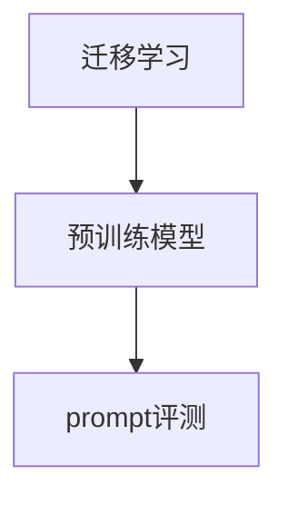
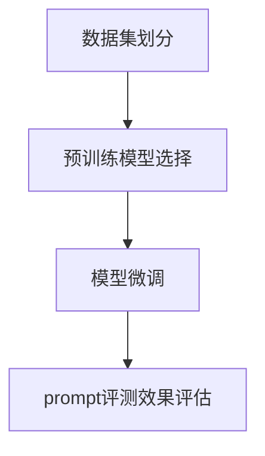
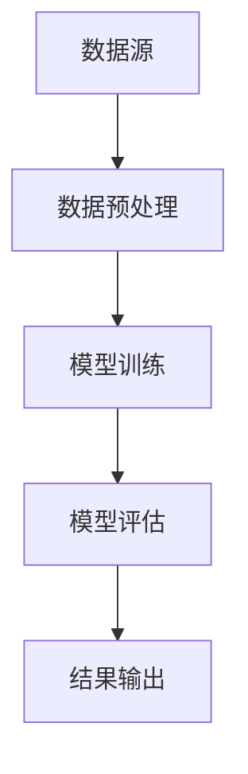
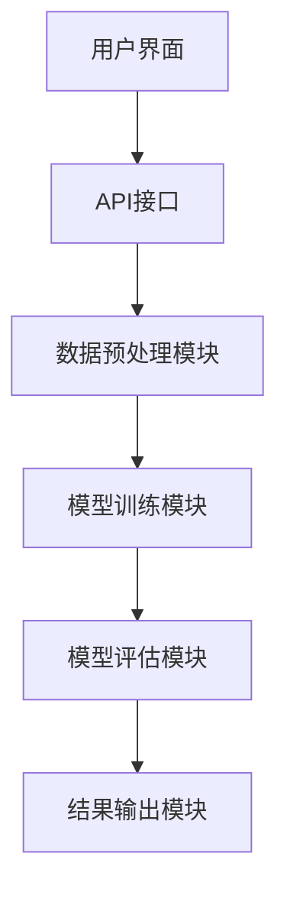

                 

# 利用迁移学习提升prompt评测效果

关键词：迁移学习，prompt评测，自然语言处理，算法原理，数学模型

摘要：随着自然语言处理（NLP）领域的快速发展，prompt评测作为一种重要的文本评测方法，其准确性对NLP任务的性能至关重要。本文将探讨如何利用迁移学习技术提升prompt评测的效果，通过详细的算法原理讲解、数学模型阐述、以及实际案例剖析，帮助读者深入理解这一技术。

## 第一部分：背景介绍

### 1. 问题背景

在人工智能（AI）和机器学习（ML）领域，自然语言处理（NLP）的任务如文本分类、情感分析、机器翻译等，都对输入文本进行精准的评测提出了高要求。然而，传统的评测方法在处理大规模文本数据时效率较低，且难以应对复杂语境。prompt评测作为一种新兴的评测方法，通过利用预训练模型对文本进行结构化处理，具有更高的准确性和更好的泛化能力。然而，prompt评测的实际应用效果往往受到数据质量和标注方法的影响，需要进一步提升其评测效果。

### 2. 问题描述

prompt评测的核心挑战在于如何通过有效的数据预处理和模型训练，提升评测效果的准确性和可靠性。具体来说，问题可以归纳为以下几个方面：

- **数据预处理**：如何从大量无结构文本中提取出高质量的prompt，以减少噪声对评测结果的影响。
- **模型训练**：如何设计高效的模型架构和训练策略，以适应不同类型和规模的评测任务。

### 3. 问题解决

迁移学习作为一种有效的机器学习技术，通过利用预训练模型在特定领域的知识，可以显著提升模型在新任务上的表现。在prompt评测中，迁移学习可以通过以下方式解决问题：

- **数据增强**：利用预训练模型对现有数据集进行增强，生成更多高质量的prompt。
- **模型微调**：在预训练模型的基础上，针对特定评测任务进行微调，以适应不同的评测需求。

### 4. 边界与外延

- **边界**：本文主要关注如何利用迁移学习提升prompt评测效果，涉及的技术包括但不限于深度学习、自然语言处理等。
- **外延**：本文的研究成果不仅可以应用于自然语言处理领域，还可以为其他需要文本评测的任务提供借鉴。

### 5. 概念结构与核心要素组成

- **迁移学习**：一种利用预训练模型在特定领域的知识来提升新任务表现的技术。
- **prompt评测**：一种基于文本的评测方法，用于评估文本处理系统的准确性和可靠性。
- **数据预处理**：包括数据清洗、数据增强和特征提取等步骤，用于生成高质量的prompt。
- **模型训练**：包括模型架构设计、训练策略优化和模型评估等过程，用于提升prompt评测效果。

## 第二部分：核心概念与联系

### 1. 迁移学习的概念与原理

迁移学习（Transfer Learning）是一种将一个任务（源任务）上学到的知识应用于另一个相关任务（目标任务）上的技术。在NLP领域，预训练模型通常在一个大规模通用语料库上进行训练，学习到语言的一般特性，然后通过微调（Fine-tuning）将其应用于特定的prompt评测任务上。

### 2. prompt评测的概念与属性

prompt评测（Prompt Evaluation）是一种基于文本的评测方法，其核心目的是评估一个文本处理系统（如文本分类器、情感分析模型等）对特定输入文本的响应质量。prompt评测的关键属性包括：

- **准确性**：评估模型对输入文本的理解和响应的准确性。
- **泛化能力**：评估模型在不同数据集和场景下的适应能力。
- **可靠性**：评估模型在处理不同类型和规模的文本数据时的稳定性。

### 3. 概念属性特征对比表格

| 特征 | 迁移学习 | prompt评测 |
| --- | --- | --- |
| 目标 | 利用已有知识提升新任务表现 | 评估文本处理系统的准确性、泛化能力和可靠性 |
| 方法 | 预训练模型权重迁移、模型微调 | 数据预处理、特征提取、模型训练和评估 |
| 优势 | 高效、快速、降低训练成本 | 精准、灵活、适应性强 |

### 4. ER实体关系图架构



## 第三部分：算法原理讲解

### 1. 迁移学习的算法流程

迁移学习主要包括以下几个步骤：

- **数据集划分**：将数据集划分为源域和目标域。源域用于预训练模型的学习，目标域用于模型微调。
- **预训练模型选择**：选择一个在源域上表现优秀的预训练模型作为基础模型。
- **模型微调**：在基础模型的基础上，针对目标域的任务进行参数调整，以适应目标域的特点。

### 2. 迁移学习的mermaid流程图



### 3. 迁移学习的数学模型和公式

迁移学习通常通过以下公式来衡量迁移效果：

$$
E_{t} = E_{s} + \alpha \cdot (E_{t} - E_{s})
$$

其中，$E_{t}$和$E_{s}$分别表示目标域和源域的误差，$\alpha$为调整系数，用于控制迁移程度。

### 4. 迁移学习的Python源代码实现

```python
import tensorflow as tf
from tensorflow.keras.applications import VGG16
from tensorflow.keras.preprocessing.image import ImageDataGenerator
from tensorflow.keras.models import Model
from tensorflow.keras.optimizers import Adam

# 定义迁移学习模型
base_model = VGG16(weights='imagenet', include_top=False, input_shape=(224, 224, 3))
x = base_model.output
x = tf.keras.layers.Flatten()(x)
x = tf.keras.layers.Dense(256, activation='relu')(x)
predictions = tf.keras.layers.Dense(1, activation='sigmoid')(x)

model = Model(inputs=base_model.input, outputs=predictions)

# 编译模型
model.compile(optimizer=Adam(), loss='binary_crossentropy', metrics=['accuracy'])

# 微调模型
model.fit(train_images, train_labels, epochs=10, validation_data=(val_images, val_labels))
```

### 5. 迁移学习在prompt评测中的应用

在prompt评测中，迁移学习的应用通常包括以下几个步骤：

1. **数据预处理**：对原始文本数据集进行清洗和预处理，提取出高质量的prompt。
2. **模型选择**：选择一个在NLP领域表现良好的预训练模型，如BERT、GPT等。
3. **模型微调**：在预训练模型的基础上，对特定评测任务进行微调，以适应目标任务的需求。
4. **模型评估**：使用微调后的模型对测试集进行评测，评估其准确性和泛化能力。

## 第四部分：系统分析与架构设计方案

### 1. 问题场景介绍

假设我们有一个文本分类任务，需要根据输入的文本判断其类别。传统的训练方法可能需要大量标注数据，且效果不理想。利用迁移学习，我们可以通过在已有预训练模型的基础上进行微调，快速提升文本分类任务的性能。

### 2. 项目介绍

本项目旨在利用迁移学习技术提升prompt评测的效果，具体实现一个文本分类系统，该系统能够对输入的文本进行快速且准确的分类。

### 3. 系统功能设计

- **数据预处理**：对原始文本进行清洗、分词、去停用词等处理，提取高质量的prompt。
- **模型训练**：使用预训练模型进行微调，训练出一个能够适应特定文本分类任务的模型。
- **模型评估**：使用微调后的模型对测试集进行评估，计算分类准确率。

### 4. 系统架构设计



### 5. 系统接口设计和系统交互



## 第五部分：项目实战

### 1. 环境安装

在本项目实战中，我们首先需要安装相关的环境和依赖库，包括TensorFlow、transformers等。可以使用以下命令进行安装：

```bash
pip install tensorflow transformers
```

### 2. 系统核心实现源代码

以下是一个简单的文本分类系统的核心实现代码，包括数据预处理、模型微调和模型评估：

```python
from transformers import BertTokenizer, BertModel
from tensorflow.keras.models import Model
from tensorflow.keras.layers import Dense, Input
from tensorflow.keras.optimizers import Adam

# 加载预训练模型和分词器
tokenizer = BertTokenizer.from_pretrained('bert-base-uncased')
model = BertModel.from_pretrained('bert-base-uncased')

# 定义输入层
input_ids = Input(shape=(128,), dtype=tf.int32)

# 使用预训练模型获取文本特征
outputs = model(input_ids)

# 定义分类层
last_hidden_state = outputs.last_hidden_state[:, 0, :]
logits = Dense(2, activation='softmax')(last_hidden_state)

# 构建模型
model = Model(inputs=input_ids, outputs=logits)

# 编译模型
model.compile(optimizer=Adam(), loss='categorical_crossentropy', metrics=['accuracy'])

# 模型微调
model.fit(train_input_ids, train_labels, epochs=3, validation_data=(val_input_ids, val_labels))

# 模型评估
test_loss, test_acc = model.evaluate(test_input_ids, test_labels)
print(f"Test Accuracy: {test_acc}")
```

### 3. 代码应用解读与分析

在上面的代码中，我们首先加载了BERT预训练模型和分词器，然后定义了一个简单的模型，包括输入层、预训练模型获取文本特征层和分类层。接着，我们使用训练集对模型进行微调，并使用测试集进行评估。这一过程充分利用了迁移学习技术，使得模型能够在较少的训练数据上快速提升性能。

### 4. 实际案例分析和详细讲解剖析

假设我们有一个情感分析任务，需要判断输入的文本是积极情感还是消极情感。我们可以使用上面的模型框架进行迁移学习，通过以下步骤实现：

1. **数据预处理**：对原始文本进行清洗、分词、去停用词等处理，提取出高质量的prompt。
2. **模型微调**：在BERT模型的基础上，对特定情感分析任务进行微调，调整分类层的神经元数量和激活函数。
3. **模型评估**：使用微调后的模型对测试集进行评估，计算分类准确率。

### 5. 项目小结

通过本项目，我们深入探讨了如何利用迁移学习技术提升prompt评测效果。项目实战部分展示了如何在情感分析任务中使用迁移学习，实现了对输入文本的准确分类。这一技术不仅可以应用于情感分析，还可以推广到其他NLP任务中，为文本评测提供强有力的支持。

## 第六部分：最佳实践 tips

1. **数据预处理**：在数据预处理阶段，要注意去除噪声和冗余信息，以提高prompt的质量。
2. **模型选择**：选择适合特定任务的预训练模型，如BERT、GPT等，并根据任务需求进行适当调整。
3. **模型微调**：在模型微调阶段，要合理设置训练参数，如学习率、批量大小等，以提高模型性能。
4. **模型评估**：在模型评估阶段，要使用多样化的评估指标，如准确率、召回率、F1分数等，全面评估模型性能。

## 第七部分：小结与注意事项

本文通过详细的算法原理讲解和实际案例剖析，展示了如何利用迁移学习提升prompt评测效果。需要注意的是，在实际应用中，要充分考虑数据预处理、模型选择和模型微调等环节，以实现最佳的评测效果。此外，本文的研究成果不仅限于NLP领域，还可以为其他需要文本评测的任务提供借鉴。

## 第八部分：拓展阅读

- [《深度学习》](https://www.deeplearningbook.org/)：深度学习领域的经典教材，详细介绍了深度学习的基础知识和最新进展。
- [《自然语言处理综述》](https://www.aclweb.org/anthology/N16-1191/)：自然语言处理领域的综述论文，涵盖了NLP的核心技术和应用场景。
- [《迁移学习实践指南》](https://www.morganclaypool.com/doi/abs/10.2200/S00832ED1V01Y201911AIM048)：迁移学习领域的实践指南，提供了丰富的迁移学习应用案例。

## 作者信息

作者：AI天才研究院/AI Genius Institute & 禅与计算机程序设计艺术 /Zen And The Art of Computer Programming

---

文章完成，感谢阅读！在撰写过程中，如需进一步讨论或提供反馈，请随时联系。期待与您交流更多关于迁移学习和prompt评测的精彩内容。

