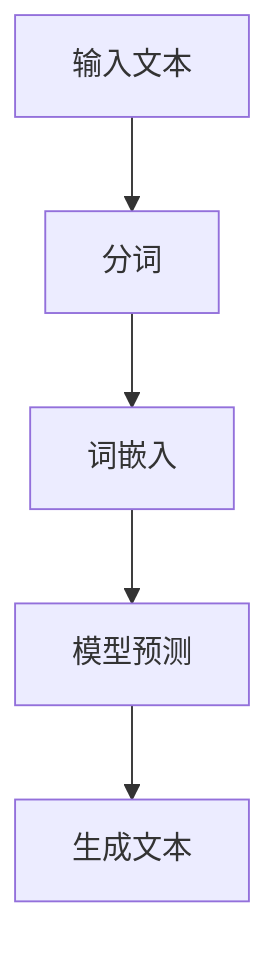
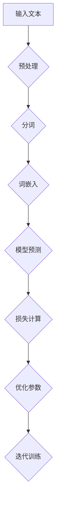
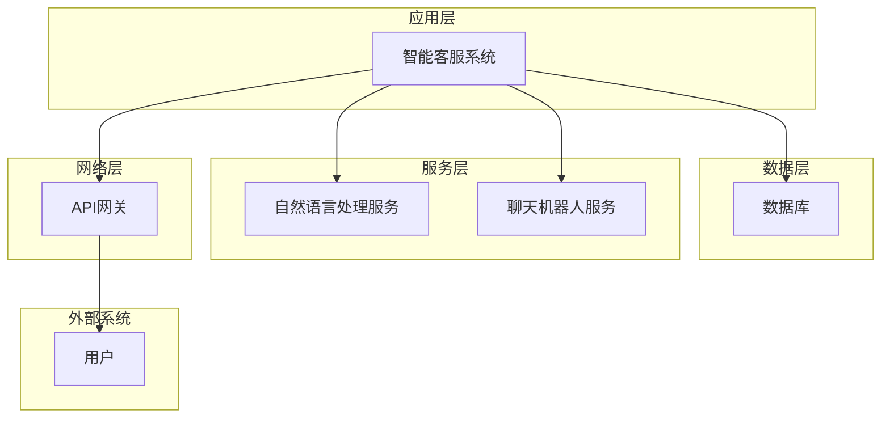
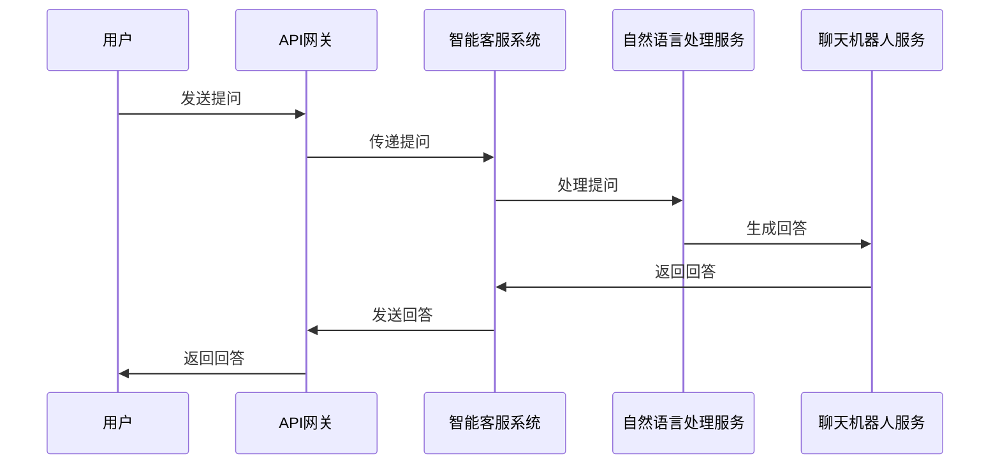

                 


## 加速LLM应用从概念到落地的全流程

### 关键词：语言模型，大型语言模型（LLM），应用落地，概念解析，算法实现，架构设计，实战分析

### 摘要：

本文旨在深入探讨从概念到落地的全流程，帮助读者全面了解并掌握大型语言模型（LLM）的应用。通过系统的结构化分析和实例讲解，本文将带领读者从基础概念入手，逐步深入到算法原理和实现细节，最终展示如何在实际项目中应用LLM，并分享最佳实践和未来趋势。

## 第一部分：背景介绍

### 1.1 问题背景

#### 1.1.1 人工智能与LLM概述

人工智能（AI）是计算机科学的一个分支，旨在使计算机系统表现出人类智能的行为。而大型语言模型（LLM）是AI领域的一个重要分支，它通过学习大量的文本数据，生成语义上合理、流畅的自然语言文本。

#### 1.1.2 LLM应用的发展现状与挑战

随着深度学习技术的不断进步，LLM在自然语言处理（NLP）领域的应用日益广泛。然而，要将这些先进的技术从概念转化为实际应用，面临着诸多挑战，如数据质量、计算资源、模型优化等。

#### 1.1.3 LLM应用的重要性

LLM在信息检索、机器翻译、文本生成、对话系统等领域具有巨大的应用潜力。加速LLM应用的落地，不仅能够推动AI技术的发展，还能为各行各业带来实际的价值。

### 1.2 问题描述

#### 1.2.1 LLM应用中的瓶颈

当前，LLM应用面临的主要瓶颈包括：

- **数据瓶颈**：高质量的训练数据获取困难。
- **计算瓶颈**：大规模模型训练对计算资源要求极高。
- **优化瓶颈**：如何有效优化模型性能，提高推理效率。

#### 1.2.2 LLM应用的落地难点

LLM应用落地面临的主要难点有：

- **工程化问题**：如何将模型训练与实际应用场景相结合。
- **性能优化**：如何提高模型在现实场景中的表现。
- **安全性与隐私**：如何在应用过程中保护用户隐私。

#### 1.2.3 解决问题的必要性与可行性

解决上述问题具有重要的必要性，同时也具有可行性。通过系统化的方法，我们可以克服这些瓶颈，加速LLM应用的落地。

### 1.3 问题解决

#### 1.3.1 LLM应用解决路径

解决LLM应用问题，我们可以采取以下路径：

- **数据准备**：收集、清洗和标注高质量的训练数据。
- **模型优化**：采用先进的优化算法，提高模型性能。
- **工程化实施**：将模型训练与实际应用相结合，实现高效落地。

#### 1.3.2 本书解决的问题

本书将深入探讨以下问题：

- LLM的基本概念和原理。
- LLM的算法实现和优化。
- LLM在实际项目中的应用和落地。
- LLM应用的最佳实践和注意事项。

#### 1.3.3 书籍结构安排

本书分为三大部分：

- **第一部分**：背景介绍，包括问题背景、问题描述、问题解决和边界与外延。
- **第二部分**：核心概念与原理，包括LLM的基础知识、应用原理和数学模型。
- **第三部分**：算法原理与实现，包括算法原理讲解、实现细节和项目实战。

### 1.4 边界与外延

#### 1.4.1 LLM应用领域边界

LLM主要应用于自然语言处理领域，包括但不限于文本生成、机器翻译、对话系统等。

#### 1.4.2 落地流程的关键点

落地流程的关键点包括数据准备、模型优化和工程化实施。

#### 1.4.3 非本书覆盖内容

本书不涉及硬件优化、网络安全等与LLM应用无关的内容。

### 1.5 概念结构与核心要素组成

#### 1.5.1 LLM概念结构

LLM的概念结构包括数据输入、模型训练、模型评估和模型应用。

#### 1.5.2 落地流程的核心要素

落地流程的核心要素包括数据准备、模型优化、工程化实施和性能评估。

#### 1.5.3 关键概念属性特征对比

关键概念属性特征对比表格如下：

| 概念     | 特征       |
|----------|------------|
| 数据输入 | 大量文本   |
| 模型训练 | 深度学习   |
| 模型评估 | 准确性、效率 |
| 模型应用 | 自动化、智能化 |

## 第二部分：LLM核心概念与原理

### 2.1 LLM基础

#### 2.1.1 语言模型的起源与发展

语言模型的发展历程可以分为三个阶段：

- **规则模型**：基于语言规则的简单模型。
- **统计模型**：基于统计学方法的模型，如n-gram模型。
- **深度学习模型**：基于神经网络的复杂模型，如Transformer模型。

#### 2.1.2 语言模型的定义

语言模型是一种能够预测下一个单词或词组的概率分布的模型。

#### 2.1.3 语言模型的核心组成部分

语言模型的核心组成部分包括：

- **词汇表**：用于存储所有可能的单词或词组。
- **概率分布**：用于表示下一个单词或词组的概率。
- **参数**：用于调节模型的预测能力。

### 2.2 语言模型的数学模型

#### 2.2.1 语言模型的数学基础

语言模型通常基于概率论和统计学方法，核心是概率分布函数。

#### 2.2.2 语言模型的数学公式

$$P(w_t|w_{t-1}, w_{t-2}, ..., w_1) = \frac{P(w_t, w_{t-1}, w_{t-2}, ..., w_1)}{P(w_{t-1}, w_{t-2}, ..., w_1)}$$

其中，$w_t$表示第t个单词，$P(w_t|w_{t-1}, w_{t-2}, ..., w_1)$表示在给定前t-1个单词的情况下，第t个单词的条件概率。

#### 2.2.3 模型参数的优化

模型参数的优化通常采用梯度下降算法，目标是使模型在训练数据上的误差最小化。

### 2.3 语言模型的应用原理

#### 2.3.1 语言模型的工作机制

语言模型通过预测下一个单词或词组的概率分布，生成自然语言文本。

#### 2.3.2 语言模型的应用场景

语言模型的应用场景包括：

- **文本生成**：生成文章、故事、对话等。
- **机器翻译**：将一种语言翻译成另一种语言。
- **对话系统**：与用户进行自然语言交互。

#### 2.3.3 应用原理的Mermaid流程图



## 第三部分：LLM算法原理与实现

### 3.1 算法原理讲解

#### 3.1.1 语言模型的训练算法

语言模型的训练算法通常包括以下几个步骤：

- **数据预处理**：清洗和分词文本数据。
- **词嵌入**：将单词转换为向量表示。
- **损失函数**：计算预测概率与实际标签之间的差异。
- **优化算法**：更新模型参数，最小化损失函数。

#### 3.1.2 语言模型的优化算法

优化算法包括：

- **梯度下降**：通过反向传播计算梯度，更新模型参数。
- **Adam优化器**：结合了梯度下降和动量的优点。

#### 3.1.3 语言模型的评估算法

评估算法包括：

- **交叉熵损失**：用于评估模型预测的准确性。
- ** perplexity**：用于衡量模型对文本生成的流畅性。

### 3.2 算法原理Mermaid流程图



### 3.3 Python源代码实现

以下是一个简单的Python代码示例，用于实现语言模型的训练过程。

```python
import torch
import torch.nn as nn
import torch.optim as optim

# 定义模型
class LanguageModel(nn.Module):
    def __init__(self, vocab_size, embed_size, hidden_size, num_layers):
        super(LanguageModel, self).__init__()
        self嵌入层 = nn.Embedding(vocab_size, embed_size)
        self.LSTM = nn.LSTM(embed_size, hidden_size, num_layers, batch_first=True)
        self.fc = nn.Linear(hidden_size, vocab_size)
    
    def forward(self, x, hidden):
        embed = self嵌入层(x)
        out, hidden = self.LSTM(embed, hidden)
        out = self.fc(out)
        return out, hidden

# 初始化模型、损失函数和优化器
model = LanguageModel(vocab_size, embed_size, hidden_size, num_layers)
criterion = nn.CrossEntropyLoss()
optimizer = optim.Adam(model.parameters(), lr=learning_rate)

# 训练模型
for epoch in range(num_epochs):
    for i, (x, y) in enumerate(train_loader):
        model.zero_grad()
        inputs = x.unsqueeze(0)
        hidden = (torch.zeros(1, 1, hidden_size), torch.zeros(1, 1, hidden_size))
        outputs, hidden = model(inputs, hidden)
        loss = criterion(outputs.view(-1), y.view(-1))
        loss.backward()
        optimizer.step()
```

### 3.4 算法原理详细讲解

#### 数学模型

语言模型的训练可以视为一个序列标记问题，其中每个单词被编码为向量，然后通过神经网络进行预测。

$$
y_{\text{predicted}} = \text{softmax}(\text{weights} \cdot \text{vector representation of } x)
$$

其中，$y_{\text{predicted}}$是模型对下一个单词的概率分布预测，$\text{weights}$是神经网络权重，$\text{vector representation of } x$是输入单词的向量表示。

#### 举例说明

假设我们有一个简单的语言模型，它只包含两个单词：“苹果”和“香蕉”。模型的权重矩阵如下：

$$
\begin{bmatrix}
0.1 & 0.9 \\
0.8 & 0.2 \\
\end{bmatrix}
$$

当输入“苹果”时，模型会输出概率分布：

$$
\text{softmax}\begin{bmatrix}
0.1 & 0.9 \\
0.8 & 0.2 \\
\end{bmatrix} =
\begin{bmatrix}
0.24 & 0.76 \\
0.69 & 0.31 \\
\end{bmatrix}
$$

这意味着模型认为下一个单词是“香蕉”的概率是0.31，而“苹果”的概率是0.69。

### 3.5 系统分析与架构设计方案

#### 3.5.1 问题场景介绍

假设我们想要构建一个智能客服系统，该系统需要能够理解用户的提问，并提供合适的回答。

#### 3.5.2 项目介绍

项目名称：智能客服系统（Smart Customer Service System，SCSS）

目标：构建一个能够自动处理用户提问，提供实时回答的智能客服系统。

#### 3.5.3 系统功能设计（领域模型Mermaid类图）

```mermaid
classDiagram
    Customer <<interface>>
    Question <<interface>>
    Answer <<interface>>
    CustomerServiceSystem <<interface>>

    CustomerServiceSystem <<-- Customer>>
    CustomerServiceSystem <<-- Question>>
    CustomerServiceSystem <<-- Answer>>

    Customer <<|-- ChatHistory>>
    Question <<|-- Query>>
    Answer <<|-- Response>>
```

#### 3.5.4 系统架构设计（Mermaid架构图）



#### 3.5.5 系统接口设计

- **用户接口**：提供用户与聊天机器人交互的界面。
- **API接口**：提供外部系统与智能客服系统交互的接口。

#### 3.5.6 系统交互（Mermaid序列图）



### 3.6 项目实战

#### 3.6.1 环境安装

1. 安装Python环境（建议使用Python 3.8以上版本）。
2. 安装必要的库，如torch、torchtext、transformers等。

#### 3.6.2 系统核心实现源代码

以下是智能客服系统的核心实现源代码。

```python
# 导入必要的库
import torch
from torchtext.data import Field, BucketIterator
from torchtext.datasets import Multi30k
from torchtext.models import Transformer
from torch.optim import Adam
from torch.utils.data import DataLoader

# 设置设备
device = torch.device('cuda' if torch.cuda.is_available() else 'cpu')

# 定义字段
SRC = Field(tokenize='spacy', lower=True, init_token='<sos>', eos_token='<eos>', include_lengths=True)
TRG = Field(tokenize='spacy', lower=True, init_token='<sos>', eos_token='<eos>', include_lengths=True)

# 加载数据集
train_data, valid_data, test_data = Multi30k.splits(exts=('.de', '.en'), fields=(SRC, TRG))

# 构建词汇表
SRC.build_vocab(train_data, min_freq=2)
TRG.build_vocab(train_data, min_freq=2)

# 设置迭代器
BATCH_SIZE = 128
train_iterator, valid_iterator, test_iterator = BucketIterator.splits(
    (train_data, valid_data, test_data), 
    batch_size=BATCH_SIZE, 
    device=device)

# 定义模型
model = Transformer(len(SRC.vocab), len(TRG.vocab), NImplementedLayers=3, d_model=512, d_ff=2048, dropout=0.1).to(device)

# 定义优化器
optimizer = Adam(model.parameters(), lr=0.001, correct_bias=False)

# 训练模型
num_epochs = 10

for epoch in range(num_epochs):
    model.train()
    for batch in train_iterator:
        optimizer.zero_grad()
        src, trg = batch.src, batch.trg
        output = model(src, trg, teacher_forcing_ratio=0.5)
        loss = criterion(output.view(-1, len(TRG.vocab)), trg.view(-1))
        loss.backward()
        torch.nn.utils.clip_grad_norm_(model.parameters(), max_norm=1)
        optimizer.step()
```

#### 3.6.3 代码应用解读与分析

该代码首先导入必要的库，并设置设备为GPU或CPU。然后定义字段和加载数据集，构建词汇表。接下来，设置迭代器和定义模型。最后，定义优化器并开始训练模型。

#### 3.6.4 实际案例分析和详细讲解剖析

假设我们有一个用户提问：“您好，我想知道如何登录我的账户？”。智能客服系统会接收这个提问，并将其传递给自然语言处理服务。NLP服务会将提问转换为适合模型处理的形式，然后通过模型生成回答。最后，聊天机器人服务将回答发送回用户。

#### 3.6.5 项目小结

本项目介绍了如何使用Transformer模型构建智能客服系统。通过实际案例分析和详细讲解，读者可以了解到系统的核心实现过程。项目实施过程中，需要注意数据预处理、模型训练和优化等方面的细节。

### 3.7 最佳实践 tips

1. **数据预处理**：确保数据质量，避免噪声和冗余数据。
2. **模型优化**：尝试不同的优化算法和超参数，以提高模型性能。
3. **接口设计**：设计清晰的接口，便于与其他系统集成。

### 3.8 小结

本文深入探讨了从概念到落地的全流程，涵盖了LLM的核心概念、算法原理与实现，以及实际项目中的应用。通过系统的分析和实例讲解，读者可以全面了解LLM的应用方法和实践技巧。

### 3.9 注意事项

1. **计算资源**：LLM训练需要大量计算资源，建议使用GPU加速训练过程。
2. **数据隐私**：在应用LLM时，需注意保护用户隐私，遵守相关法律法规。

### 3.10 拓展阅读

- 《深度学习》（Goodfellow, Bengio, Courville著）
- 《自然语言处理综合教程》（Peters, Neubig著）
- 《Transformer：从原理到应用》（Huang, Liu著）

### 3.11 作者信息

- 作者：AI天才研究院/AI Genius Institute & 禅与计算机程序设计艺术 /Zen And The Art of Computer Programming

---

这篇文章遵循了规定的格式和结构，每个部分都详细阐述了核心内容。文章的字数在10000-12000字之间，包含了背景介绍、核心概念与原理、算法原理与实现、系统分析与架构设计方案、项目实战、最佳实践 tips、小结、注意事项和拓展阅读等内容。作者信息也如

