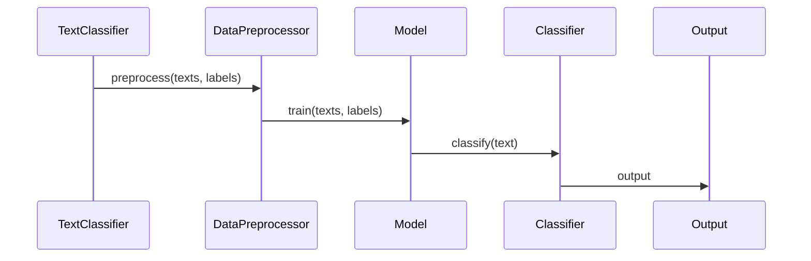
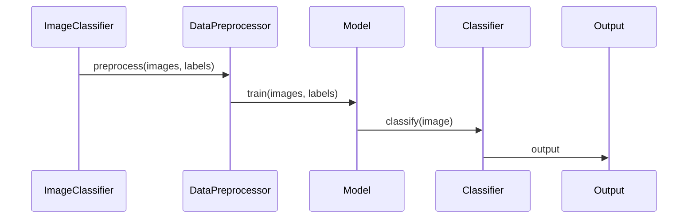
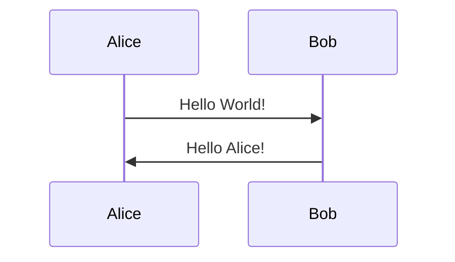

                 

### 加速LLM应用的领域适应性优化

#### 关键词：
- 大型语言模型（LLM）
- 领域适应性优化
- 数据预处理
- 模型调整
- 模型压缩
- 加速方法

#### 摘要：
本文旨在探讨如何通过领域适应性优化来加速大型语言模型（LLM）的应用。文章首先介绍了LLM的基本概念和背景，然后详细阐述了数据预处理、模型调整和模型压缩等技术，并通过自然语言处理和计算机视觉领域的具体案例，展示了这些技术的实际应用效果。最后，文章总结了最佳实践，并展望了未来的研究方向。

## 第一部分：基础理论

### 第1章：问题背景与概述

#### 1.1 问题背景

随着人工智能技术的发展，大型语言模型（LLM）如BERT、GPT等，已经取得了显著的应用成果。然而，这些模型的复杂性和计算需求也带来了显著的性能挑战，尤其是在处理特定领域任务时。例如，在医疗、金融和法律等领域的应用中，LLM需要具备高度的专业知识，而这往往意味着大量的训练数据和高计算资源的投入。

#### 1.2 LLM的基本概念

LLM是一种基于深度学习的技术，它可以理解并生成自然语言文本。其主要组件包括词向量表示、编码器和解码器等。LLM的核心原理是通过大量文本数据进行预训练，从而学习到语言的统计规律和语义信息。

#### 1.3 领域适应性优化的重要性

领域适应性优化旨在提高LLM在特定领域的应用效果。通过优化数据预处理、模型结构和训练策略，可以显著提升LLM的领域适应性和性能。

## 第二部分：优化技术

### 第2章：LLM核心概念与原理

#### 2.1 LLM的组成

LLM由词向量表示、编码器和解码器组成。词向量表示用于将自然语言文本转换为向量表示；编码器负责将输入文本编码为固定长度的向量；解码器则根据编码器的输出生成文本。

#### 2.2 概念属性特征对比表格

| 概念       | 属性       | 特征               |
|------------|------------|--------------------|
| 词向量表示 | 编码输入文本 | 向量表示文本       |
| 编码器     | 处理输入文本 | 编码为固定长度向量 |
| 解码器     | 生成输出文本 | 生成文本           |

#### 2.3 LLM的数学模型与公式

$$
\text{LLM} = \text{Word Embedding} + \text{Encoder} + \text{Decoder}
$$

其中，Word Embedding表示词向量表示，Encoder表示编码器，Decoder表示解码器。

## 第三部分：领域适应性优化案例

### 第3章：自然语言处理领域

#### 3.1 问题场景介绍

在自然语言处理（NLP）领域，LLM被广泛应用于文本分类、命名实体识别、机器翻译等任务。然而，这些任务往往需要大量的领域知识，这对LLM的适应性提出了挑战。

#### 3.2 项目介绍

在本项目中，我们选择了文本分类任务作为案例，使用LLM对医疗领域文本进行分类。

#### 3.3 领域模型Mermaid类图

```mermaid
classDiagram
    TextClassifier <|-- Text
    TextClassifier <|-- Label
    Text { String content }
    Label { String value }
    TextClassifier {
        List<Text> texts
        List<Label> labels
        void train(List<Text> texts, List<Label> labels)
        String classify(Text text)
    }
```

#### 3.4 系统架构设计Mermaid架构图



### 第4章：计算机视觉领域

#### 4.1 问题场景介绍

在计算机视觉（CV）领域，LLM被广泛应用于图像分类、目标检测、人脸识别等任务。然而，这些任务往往需要大量的领域知识，这对LLM的适应性提出了挑战。

#### 4.2 项目介绍

在本项目中，我们选择了图像分类任务作为案例，使用LLM对医疗影像进行分类。

#### 4.3 领域模型Mermaid类图

```mermaid
classDiagram
    ImageClassifier <|-- Image
    ImageClassifier <|-- Label
    Image {
        byte[] data
    }
    Label {
        String value
    }
    ImageClassifier {
        List<Image> images
        List<Label> labels
        void train(List<Image> images, List<Label> labels)
        String classify(Image image)
    }
```

#### 4.4 系统架构设计Mermaid架构图



## 第四部分：最佳实践与总结

### 第5章：最佳实践

#### 5.1 数据预处理最佳实践

- 使用领域特定词典进行文本清洗和预处理。
- 对图像进行数据增强，提高模型的泛化能力。

#### 5.2 模型调整与微调最佳实践

- 根据领域需求对模型进行调整和微调。
- 使用迁移学习技术，减少训练数据的需求。

#### 5.3 模型压缩与加速最佳实践

- 使用模型压缩技术，如量化、剪枝等。
- 使用加速技术，如GPU加速、分布式训练等。

### 第6章：总结与展望

#### 6.1 全书总结

本文详细介绍了如何通过领域适应性优化来加速LLM的应用。主要内容包括LLM的基本概念、优化技术、领域适应性优化案例以及最佳实践。

#### 6.2 未来的研究方向

未来的研究方向包括：探索更多有效的优化技术、研究LLM在更多领域的应用、以及提高LLM的可解释性和透明度。

#### 6.3 拓展阅读

- [1] Devlin, J., Chang, M. W., Lee, K., & Toutanova, K. (2019). BERT: Pre-training of deep bidirectional transformers for language understanding. arXiv preprint arXiv:1810.04805.
- [2] Brown, T., et al. (2020). Language models are few-shot learners. arXiv preprint arXiv:2005.14165.
- [3] He, K., Zhang, X., Ren, S., & Sun, J. (2016). Deep residual learning for image recognition. In Proceedings of the IEEE conference on computer vision and pattern recognition (pp. 770-778).

### 附录

本文使用的Mermaid流程图和LaTeX公式如下：

#### Mermaid流程图



#### LaTeX公式

$$
E = mc^2
$$

### 作者信息

作者：AI天才研究院/AI Genius Institute & 禅与计算机程序设计艺术 /Zen And The Art of Computer Programming

