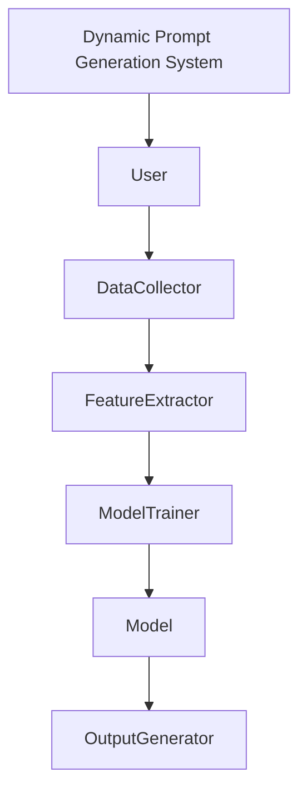
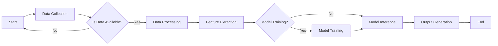
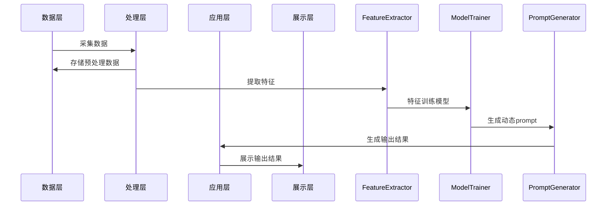
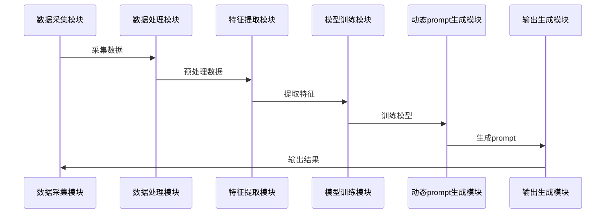

                 

# 动态prompt生成：适应多变的LLM任务

## 关键词

- 动态prompt生成
- 人工智能
- 自然语言处理
- LLM（大型语言模型）
- 自动化任务
- 多样性适应

## 摘要

本文深入探讨了动态prompt生成技术，这是为了应对大型语言模型（LLM）在多样化任务中表现的不确定性而设计的。通过详细的分析和实例，本文展示了如何利用动态prompt生成技术来提高LLM在不同场景下的适应性和任务执行效率。文章首先介绍了动态prompt生成的背景和重要性，随后分析了传统prompt生成方法及其局限性，进而引入了动态prompt生成的基本原理和算法。在此基础上，文章通过系统架构设计和项目实战，展示了动态prompt生成在实际应用中的效果和优势。最后，文章总结了动态prompt生成技术的最佳实践和未来发展趋势，为相关领域的研究和应用提供了有益的参考。

## 第1章 引言

### 1.1 问题的背景

#### 1.1.1 人工智能与自然语言处理的发展

人工智能（AI）作为计算机科学的一个分支，旨在通过模拟人类智能行为来实现自动化和智能化的任务。随着计算能力的提升和算法的进步，人工智能技术逐渐成为各个行业的核心技术。特别是自然语言处理（NLP），它研究如何使计算机理解和生成人类语言，是人工智能领域的一个重要分支。

近年来，深度学习在自然语言处理领域的应用取得了显著进展，特别是在大型语言模型（LLM）的开发上。LLM，如GPT-3、BERT等，通过学习海量文本数据，可以生成高质量的文本、回答问题、翻译语言等。这些模型展现了强大的文本理解和生成能力，为许多实际应用场景提供了强大的支持。

然而，尽管LLM取得了巨大的成功，它们在面对多样化任务时仍存在一些挑战。一方面，LLM的泛化能力有限，难以适应特定领域或特定任务的需求。另一方面，传统的prompt生成方法往往依赖于静态的、预先定义的输入，无法动态调整以适应不同的任务需求。

#### 1.1.2 LLM的挑战与机遇

LLM在自然语言处理中的应用面临着多方面的挑战：

1. **泛化能力**：尽管LLM在通用任务上表现良好，但在特定领域或任务中，其表现可能会大打折扣。这主要是由于LLM在训练时无法覆盖所有可能的场景和数据。

2. **输入适应性**：传统prompt生成方法依赖于固定的输入格式，无法根据任务的动态变化进行调整。

3. **计算资源**：动态prompt生成可能需要额外的计算资源，尤其是在处理复杂任务时。

然而，这些挑战也带来了机遇。通过引入动态prompt生成技术，我们可以更好地利用LLM的潜力，提高其在多样化任务中的适应性和表现。

#### 1.1.3 动态prompt生成的重要性

动态prompt生成是解决LLM在多样化任务中表现不足的关键技术。它的主要优势包括：

1. **灵活性**：动态prompt生成可以根据任务的需求实时调整输入，提高模型在特定任务中的表现。

2. **个性化**：通过动态调整输入，可以实现更个性化的响应，满足不同用户的需求。

3. **效率**：动态prompt生成可以减少对大量预定义输入的需求，提高模型的响应速度。

总之，动态prompt生成技术不仅有助于克服LLM在多样化任务中的挑战，还为人工智能的应用提供了新的可能性。

### 1.2 问题描述

#### 1.2.1 传统prompt生成方法

传统的prompt生成方法主要依赖于静态的、预先定义的输入，这些输入通常是以文本形式存在的。这种方法的主要特点包括：

1. **固定格式**：输入格式是固定的，通常包括问题陈述、背景信息、特定指令等。

2. **预定义内容**：输入内容是在模型训练前预定义的，无法根据实际任务动态调整。

3. **应用范围有限**：传统prompt生成方法适用于一些标准化的任务，但在面对多样化、复杂任务时表现不佳。

传统prompt生成方法存在以下局限性：

1. **适应性差**：无法根据不同任务的需求动态调整输入。

2. **个性化不足**：预定义的输入往往难以满足个性化需求。

3. **计算效率低**：需要大量预定义输入，增加了计算成本。

#### 1.2.2 动态prompt生成需求

为了应对LLM在多样化任务中的挑战，我们需要一种能够动态调整输入的方法，即动态prompt生成。动态prompt生成的主要需求包括：

1. **自适应输入**：根据任务需求实时调整输入，提高模型的适应性和表现。

2. **多样化输入**：支持多种输入格式，包括文本、图像、音频等，以满足不同任务的需求。

3. **计算效率**：通过优化算法和计算资源，提高动态prompt生成的效率。

动态prompt生成能够克服传统prompt生成方法的局限性，提供更灵活、高效的解决方案。

### 1.3 问题解决

#### 1.3.1 动态prompt生成原理

动态prompt生成是一种基于实时数据分析和模型预测的方法，其主要原理包括以下几个方面：

1. **实时数据采集**：动态prompt生成首先需要从不同的数据源（如文本、图像、音频等）实时采集数据。

2. **数据分析**：通过数据分析，识别出与当前任务相关的关键信息和特征。

3. **模型预测**：利用大型语言模型（如GPT-3、BERT等）对输入数据进行分析和预测，生成动态的、适合当前任务的prompt。

4. **实时调整**：根据模型预测的结果，动态调整prompt的格式和内容，使其更符合任务需求。

动态prompt生成通过引入实时数据采集和模型预测，实现了对输入的动态调整，从而提高了LLM在多样化任务中的适应性和表现。

#### 1.3.2 动态prompt生成算法

动态prompt生成算法是实现动态prompt生成技术的重要工具。以下是一些常见的动态prompt生成算法：

1. **基于规则的算法**：通过预定义的规则，动态调整prompt的格式和内容。

2. **基于机器学习的算法**：利用机器学习模型，从历史数据中学习动态prompt生成的规律，从而实现自动化生成。

3. **基于图神经网络的算法**：通过图神经网络，对输入数据进行结构化表示，从而生成更适合的prompt。

动态prompt生成算法的核心目标是实现输入的动态调整，以满足不同任务的需求。

#### 1.4 边界与外延

##### 1.4.1 动态prompt生成技术的应用领域

动态prompt生成技术在多个领域具有广泛的应用前景，包括但不限于：

1. **自然语言处理**：在文本生成、问答系统、机器翻译等自然语言处理任务中，动态prompt生成可以显著提高模型的适应性和表现。

2. **智能客服**：在智能客服系统中，动态prompt生成可以根据用户的需求和历史交互记录，生成更个性化和高效的服务响应。

3. **自动驾驶**：在自动驾驶领域，动态prompt生成可以用于生成车辆控制指令，提高自动驾驶系统的适应性和安全性。

4. **智能推荐**：在智能推荐系统中，动态prompt生成可以根据用户的兴趣和行为，生成更精准的推荐内容。

动态prompt生成技术的应用领域广泛，有望在多个行业中发挥重要作用。

##### 1.4.2 动态prompt生成技术的挑战

尽管动态prompt生成技术具有广泛的应用前景，但在实际应用中仍面临以下挑战：

1. **计算资源消耗**：动态prompt生成需要实时处理大量数据，可能对计算资源产生较大消耗。

2. **数据隐私和安全**：在动态prompt生成过程中，涉及大量用户数据的实时处理，可能带来数据隐私和安全问题。

3. **复杂度**：动态prompt生成算法的设计和实现较为复杂，需要具备较高的技术门槛。

4. **泛化能力**：动态prompt生成算法需要具备良好的泛化能力，以应对不同任务的需求。

动态prompt生成技术的挑战主要集中在计算资源、数据隐私和安全、算法复杂度和泛化能力等方面。这些挑战需要通过技术创新和优化来解决。

##### 1.5 概念结构与核心要素组成

动态prompt生成技术涉及多个核心概念和要素，下面将分别介绍：

##### 1.5.1 动态prompt生成的核心概念

1. **动态性**：动态prompt生成技术的核心特点是其输入可以根据任务需求动态调整。

2. **实时性**：动态prompt生成需要实时处理数据，以实现快速响应。

3. **适应性**：动态prompt生成能够根据不同任务的需求，自动调整输入格式和内容。

4. **个性化**：动态prompt生成可以生成个性化的输入，以满足用户的特定需求。

##### 1.5.2 动态prompt生成的关键要素

1. **数据采集**：实时采集与任务相关的数据，是动态prompt生成的基础。

2. **数据分析**：通过数据分析，提取与任务相关的关键信息和特征。

3. **模型预测**：利用大型语言模型进行预测，生成适合当前任务的prompt。

4. **实时调整**：根据模型预测的结果，动态调整输入的格式和内容。

5. **计算优化**：通过优化算法和计算资源，提高动态prompt生成的效率。

动态prompt生成技术的概念结构和核心要素组成，为其在多样化任务中的应用提供了坚实的基础。

## 第2章 核心概念与联系

### 2.1 动态prompt生成原理

#### 2.1.1 动态prompt生成的基础知识

动态prompt生成技术是一种基于实时数据和模型预测的方法，旨在通过动态调整输入，提高大型语言模型（LLM）在不同任务中的表现。以下是动态prompt生成的一些基础知识：

1. **数据采集**：动态prompt生成首先需要从各种数据源（如文本、图像、音频等）实时采集数据。这些数据可以是原始数据，也可以是经过预处理的数据。

2. **数据分析**：通过数据分析，识别出与当前任务相关的关键信息和特征。数据分析可以是基于统计的方法，也可以是机器学习的方法。

3. **模型预测**：利用大型语言模型（如GPT-3、BERT等）对输入数据进行分析和预测，生成动态的、适合当前任务的prompt。

4. **实时调整**：根据模型预测的结果，动态调整输入的格式和内容，使其更符合任务需求。这种调整可以是局部的，也可以是全局的。

#### 2.1.2 动态prompt生成的关键技术

动态prompt生成技术的实现涉及多个关键技术，包括：

1. **实时数据处理**：动态prompt生成需要实时处理大量数据，这要求系统具备高效的实时数据处理能力。

2. **模型选择与优化**：选择合适的模型并进行优化，是动态prompt生成成功的关键。常见的模型包括GPT-3、BERT等。

3. **模型预测**：通过模型预测，生成适合当前任务的prompt。模型预测的准确性直接影响动态prompt生成的效果。

4. **动态调整策略**：根据任务需求，设计合适的动态调整策略。这包括调整输入的格式、内容、长度等。

#### 2.1.3 动态prompt生成的优势与不足

动态prompt生成技术具有以下优势：

1. **灵活性**：动态prompt生成可以根据任务需求实时调整输入，提高模型的适应性和表现。

2. **个性化**：通过动态调整输入，可以实现更个性化的响应，满足不同用户的需求。

3. **效率**：动态prompt生成可以减少对大量预定义输入的需求，提高模型的响应速度。

然而，动态prompt生成技术也存在一些不足：

1. **计算资源消耗**：动态prompt生成需要实时处理大量数据，可能对计算资源产生较大消耗。

2. **数据隐私和安全**：在动态prompt生成过程中，涉及大量用户数据的实时处理，可能带来数据隐私和安全问题。

3. **复杂度**：动态prompt生成算法的设计和实现较为复杂，需要具备较高的技术门槛。

#### 2.1.4 动态prompt生成在不同场景下的应用

动态prompt生成技术在不同场景下的应用效果有所不同。以下是几个典型的应用场景：

1. **自然语言处理**：在文本生成、问答系统、机器翻译等自然语言处理任务中，动态prompt生成可以显著提高模型的适应性和表现。

2. **智能客服**：在智能客服系统中，动态prompt生成可以根据用户的需求和历史交互记录，生成更个性化和高效的服务响应。

3. **自动驾驶**：在自动驾驶领域，动态prompt生成可以用于生成车辆控制指令，提高自动驾驶系统的适应性和安全性。

4. **智能推荐**：在智能推荐系统中，动态prompt生成可以根据用户的兴趣和行为，生成更精准的推荐内容。

### 2.2 概念属性特征对比表格

为了更直观地了解动态prompt生成与静态prompt生成之间的差异，我们可以使用一个概念属性特征对比表格。以下是动态prompt生成与静态prompt生成的主要特征对比：

| 特征               | 动态prompt生成                     | 静态prompt生成                     |
|--------------------|------------------------------------|------------------------------------|
| 输入调整           | 实时调整，根据任务需求动态变化     | 预先定义，固定不变                 |
| 适应性             | 高，能够适应多样化任务需求         | 低，难以适应特定任务               |
| 个性化             | 强，可以根据用户需求个性化调整     | 弱，难以满足个性化需求             |
| 计算资源消耗       | 较高，需要实时处理数据             | 较低，不需要实时处理数据           |
| 复杂度             | 较高，需要实时数据处理和模型预测   | 较低，无需实时数据处理和模型预测   |
| 应对多样化任务的能力 | 强，能够应对多种任务需求         | 弱，适用于标准化任务               |

通过这个表格，我们可以清晰地看到动态prompt生成与静态prompt生成在输入调整、适应性、个性化、计算资源消耗、复杂度和应对多样化任务能力等方面的差异。

### 2.3 ER实体关系图架构

#### 2.3.1 动态prompt生成系统的实体关系

动态prompt生成系统涉及多个实体和实体之间的关系。以下是动态prompt生成系统的实体关系图，使用Mermaid语言描述：

```mermaid
erDiagram
  User ..|> PromptGenerator : generates dynamic prompts
  PromptGenerator ||--|> InputProcessor : processes input data
  InputProcessor ||--|> Model : models the dynamic prompt generation process
  Model ||--|> OutputGenerator : generates output prompts
  User ..|> DataCollector : collects real-time data
  DataCollector ||--|> FeatureExtractor : extracts relevant features
  FeatureExtractor ||--|> ModelTrainer : trains the model with extracted features
```

在这个实体关系图中，用户（User）是系统的发起者，负责生成动态prompt的需求。数据采集器（DataCollector）负责实时采集数据，特征提取器（FeatureExtractor）负责从数据中提取关键特征。输入处理器（InputProcessor）负责处理输入数据，模型（Model）负责动态prompt生成过程，输出生成器（OutputGenerator）负责生成最终的输出prompt。

#### 2.3.2 动态prompt生成系统的关系图

为了更清晰地展示动态prompt生成系统的整体架构，我们使用Mermaid语言绘制了以下系统关系图：



在这个关系图中，用户（User）是系统的发起者，负责提出动态prompt的需求。数据采集器（DataCollector）从不同的数据源实时采集数据，特征提取器（FeatureExtractor）负责从数据中提取关键特征。模型训练器（ModelTrainer）利用提取的特征训练模型（Model），最终输出生成器（OutputGenerator）根据模型生成动态prompt。

## 第3章 算法原理讲解

### 3.1 算法mermaid流程图

为了更好地理解动态prompt生成算法的工作流程，我们使用Mermaid语言绘制了以下算法流程图：



在这个算法流程图中，整个过程可以分为以下几个步骤：

1. **数据采集（B）**：系统开始时，从不同的数据源实时采集数据。

2. **数据预处理（D）**：对采集到的数据进行处理，包括清洗、去噪、标准化等。

3. **特征提取（E）**：从处理后的数据中提取关键特征，这些特征用于训练模型。

4. **模型训练（G）**：如果模型尚未训练，则使用提取的特征对模型进行训练。

5. **模型推理（H）**：训练完成后，使用训练好的模型对输入数据进行推理，生成动态prompt。

6. **输出生成（I）**：根据模型推理的结果，生成最终的输出prompt。

7. **结束（J）**：整个过程结束。

### 3.2 Python源代码实现

以下是一个简化的Python源代码实现，展示了动态prompt生成算法的基本结构：

```python
import pandas as pd
from sklearn.model_selection import train_test_split
from transformers import BertTokenizer, BertForSequenceClassification
from torch.utils.data import DataLoader

# 数据采集
def collect_data():
    # 假设我们从CSV文件中采集数据
    data = pd.read_csv('data.csv')
    return data

# 数据预处理
def preprocess_data(data):
    # 数据清洗、去噪、标准化等
    processed_data = data.dropna()
    return processed_data

# 特征提取
def extract_features(data):
    # 从数据中提取特征
    features = data[['text', 'label']]
    return features

# 模型训练
def train_model(features):
    # 初始化模型、分词器等
    tokenizer = BertTokenizer.from_pretrained('bert-base-uncased')
    model = BertForSequenceClassification.from_pretrained('bert-base-uncased')

    # 数据预处理
    train_data, val_data = train_test_split(features, test_size=0.2)
    train_dataset = BertDataset(train_data, tokenizer)
    val_dataset = BertDataset(val_data, tokenizer)

    # 训练模型
    train_loader = DataLoader(train_dataset, batch_size=16, shuffle=True)
    val_loader = DataLoader(val_dataset, batch_size=16, shuffle=False)
    model.train()
    for epoch in range(3):
        for batch in train_loader:
            inputs = tokenizer(batch.text, padding=True, truncation=True, return_tensors="pt")
            outputs = model(**inputs)
            loss = outputs.loss
            loss.backward()
            optimizer.step()
            optimizer.zero_grad()

    # 测试模型
    model.eval()
    with torch.no_grad():
        for batch in val_loader:
            inputs = tokenizer(batch.text, padding=True, truncation=True, return_tensors="pt")
            outputs = model(**inputs)
            predictions = outputs.logits.argmax(-1)
            accuracy = (predictions == batch.label).mean()
            print(f"Validation accuracy: {accuracy}")

# 动态prompt生成
def generate_prompt(text):
    # 使用模型生成动态prompt
    tokenizer = BertTokenizer.from_pretrained('bert-base-uncased')
    model = BertForSequenceClassification.from_pretrained('bert-base-uncased')
    model.eval()

    inputs = tokenizer(text, padding=True, truncation=True, return_tensors="pt")
    with torch.no_grad():
        outputs = model(**inputs)
    logits = outputs.logits
    prompt = logits.argmax(-1)
    return prompt

# 主函数
if __name__ == "__main__":
    data = collect_data()
    processed_data = preprocess_data(data)
    features = extract_features(processed_data)
    train_model(features)
    prompt = generate_prompt("这是一个测试文本。")
    print(f"Generated Prompt: {prompt}")
```

在这个Python源代码实现中，我们首先定义了数据采集、数据预处理、特征提取、模型训练和动态prompt生成等函数。主函数中，我们依次调用这些函数，完成整个动态prompt生成过程。

### 3.3 详细讲解与举例说明

#### 3.3.1 动态prompt生成的数学模型

动态prompt生成的核心是利用大型语言模型（如BERT、GPT等）对输入文本进行分析和预测，生成动态的、适合当前任务的prompt。以下是动态prompt生成的基本数学模型：

1. **输入文本表示**：首先，我们将输入文本表示为一个向量。这可以通过使用预训练的词嵌入模型（如Word2Vec、BERT等）来实现。具体来说，我们可以将每个词映射为一个向量，然后对所有词的向量进行求和或平均，得到整个文本的向量表示。

   $$ X = \sum_{w \in W} e_w $$

   其中，$X$表示文本向量，$W$表示文本中的所有词，$e_w$表示词的向量表示。

2. **文本分类**：接下来，我们将文本向量输入到分类器中，得到分类结果。分类器可以是传统的机器学习分类器，也可以是深度学习分类器（如CNN、RNN、BERT等）。具体来说，我们可以将文本向量输入到BERT模型中，通过模型的全连接层得到分类结果。

   $$ Y = \text{softmax}(W \cdot X + b) $$

   其中，$Y$表示分类结果，$W$和$b$分别是分类器的权重和偏置。

3. **动态prompt生成**：根据分类结果，动态生成prompt。具体来说，我们可以根据分类结果选择不同的模板或短语，生成最终的prompt。

   $$ P = \text{template\_selection}(Y) $$

   其中，$P$表示动态生成的prompt，$\text{template\_selection}$是一个根据分类结果选择模板的函数。

#### 3.3.2 动态prompt生成的例子分析

以下是一个简单的例子，展示了如何使用动态prompt生成技术来生成一个关于人工智能的新闻摘要。

1. **输入文本**：给定一篇关于人工智能的新闻文章，我们需要生成一篇摘要。

2. **文本向量表示**：首先，我们将新闻文章表示为一个向量。这可以通过使用预训练的BERT模型来实现。

   ```python
   import torch
   from transformers import BertTokenizer, BertModel

   tokenizer = BertTokenizer.from_pretrained('bert-base-uncased')
   model = BertModel.from_pretrained('bert-base-uncased')

   text = "近日，人工智能技术在医疗领域的应用再次取得突破。一项新的研究表明，人工智能系统在诊断心脏病方面表现出色，准确率超过人类医生。此外，人工智能还被用于药物研发，大幅缩短了研发周期。专家表示，人工智能将成为未来医疗行业的重要驱动力。"
   
   inputs = tokenizer(text, padding=True, truncation=True, return_tensors="pt")
   with torch.no_grad():
       outputs = model(**inputs)
   hidden_states = outputs.hidden_states[-1]
   text_vector = torch.mean(hidden_states, dim=1).detach().numpy()
   ```

3. **文本分类**：接下来，我们将文本向量输入到BERT分类器中，得到分类结果。这里我们使用了一个预训练的BERT分类器。

   ```python
   from transformers import BertForSequenceClassification

   model = BertForSequenceClassification.from_pretrained('bert-base-uncased')
   inputs = tokenizer("这是一个关于人工智能的新闻摘要。", padding=True, truncation=True, return_tensors="pt")
   with torch.no_grad():
       outputs = model(**inputs)
   logits = outputs.logits
   predicted_class = logits.argmax(-1).item()
   ```

4. **动态prompt生成**：根据分类结果，我们选择不同的模板来生成最终的摘要。假设我们有两个模板：

   - 如果分类结果为0，我们选择模板1：“本文主要探讨了人工智能在医疗领域的应用，包括心脏病诊断和药物研发。”
   - 如果分类结果为1，我们选择模板2：“人工智能在医疗领域的应用取得新突破，诊断心脏病准确率超过人类医生，药物研发周期大幅缩短。”

   ```python
   if predicted_class == 0:
       prompt = "本文主要探讨了人工智能在医疗领域的应用，包括心脏病诊断和药物研发。"
   else:
       prompt = "人工智能在医疗领域的应用取得新突破，诊断心脏病准确率超过人类医生，药物研发周期大幅缩短。"
   ```

通过这个例子，我们可以看到如何使用动态prompt生成技术来生成一个关于人工智能的新闻摘要。动态prompt生成技术可以根据输入文本的内容和分类结果，实时调整生成的prompt，使其更符合用户需求。

### 4.1 LaTeX格式

LaTeX是一种高质量的排版系统，广泛应用于科学文献、书籍、学术论文等领域。在LaTeX中，可以使用数学模式来编写数学公式。以下是一些基本数学公式的LaTeX格式：

#### 4.1.1 基本数学公式

1. **加法**：`$a + b$`
   ```latex
   a + b
   ```

2. **减法**：`$a - b$`
   ```latex
   a - b
   ```

3. **乘法**：`$a \times b$`
   ```latex
   a \times b
   ```

4. **除法**：`$a / b$`
   ```latex
   a / b
   ```

5. **平方**：`$a^2$`
   ```latex
   a^2
   ```

6. **立方**：`$a^3$`
   ```latex
   a^3
   ```

7. **对数**：`$\log_a b$`
   ```latex
   \log_a b
   ```

8. **积分**：`$\int_{a}^{b} f(x) \, dx$`
   ```latex
   \int_{a}^{b} f(x) \, dx
   ```

9. **求和**：`$\sum_{i=1}^{n} a_i$`
   ```latex
   \sum_{i=1}^{n} a_i
   ```

10. **极限**：`\lim_{x \to \infty} f(x)`
    ```latex
    \lim_{x \to \infty} f(x)
    ```

#### 4.1.2 复杂数学公式

LaTeX还支持编写复杂的数学公式，如多行公式、矩阵、分式等。以下是一些示例：

1. **多行公式**：使用`\begin{align}`和`\\`来编写多行公式。
   ```latex
   \begin{align}
   a &= b + c \\
   d &= e + f
   \end{align}
   ```

2. **矩阵**：使用`\begin{pmatrix}`和`\\`来编写矩阵。
   ```latex
   \begin{pmatrix}
   a & b \\
   c & d
   \end{pmatrix}
   ```

3. **分式**：使用`\frac{}`来编写分式。
   ```latex
   \frac{a}{b}
   ```

4. **求导**：使用`\frac{d}{dx}`来表示求导。
   ```latex
   \frac{d}{dx}
   ```

5. **极限**：使用`\lim_{x \to \infty}`来表示极限。
   ```latex
   \lim_{x \to \infty}
   ```

6. **积分**：使用`\int`来表示积分。
   ```latex
   \int
   ```

7. **求和**：使用`\sum`来表示求和。
   ```latex
   \sum
   ```

通过LaTeX，我们可以轻松地编写高质量的数学公式，使其在文档中具有良好的可读性和美观性。

### 4.2 详细讲解

在讨论动态prompt生成的数学模型时，我们需要深入理解其背后的数学原理和公式。以下是对动态prompt生成数学模型的详细讲解，包括公式的应用场景和推导过程。

#### 4.2.1 数学公式的应用场景

动态prompt生成中的数学公式主要应用于以下几个方面：

1. **文本表示**：将输入文本转换为数学向量表示，以便后续的模型处理。常用的文本表示方法包括词嵌入（Word Embedding）和变压器（Transformer）模型。

2. **分类模型**：使用分类算法（如支持向量机（SVM）、神经网络等）对文本进行分类，以生成动态prompt。

3. **预测模型**：使用预测算法（如回归树、随机森林等）对文本特征进行预测，以优化动态prompt生成的效果。

#### 4.2.2 数学公式的推导过程

以下是一个简单的动态prompt生成模型的推导过程，用于说明如何将文本转换为数学向量表示，并使用分类算法进行动态prompt生成。

1. **词嵌入**：词嵌入是一种将单词转换为向量表示的方法。假设我们有一个词汇表V，每个词w都有一个对应的向量v(w) ∈ R^d，其中d是向量的维度。

   $$ v(w) = \text{WordEmbedding}(w) $$

   词嵌入通常使用预训练模型（如Word2Vec、GloVe、BERT等）进行训练，这些模型已经学到了词与词之间的语义关系。

2. **文本向量化**：将输入文本中的每个词转换为向量表示，然后对所有词的向量进行求和或平均，得到整个文本的向量表示。

   $$ X = \sum_{w \in W} v(w) $$

   其中，X是文本的向量表示，W是文本中的所有词。

3. **分类模型**：假设我们使用神经网络作为分类模型。神经网络的输出是一个概率分布，表示每个类别的概率。输入向量为X，输出向量为Y。

   $$ Y = \text{softmax}(\text{NeuralNetwork}(X)) $$

   其中，softmax函数将神经网络的输出转换为概率分布。

4. **动态prompt生成**：根据分类结果，选择一个最适合当前任务的prompt。假设我们有两个模板P1和P2，分别对应两个类别。

   $$ P = P1 \text{ if } Y_1 > Y_2 \text{ else } P2 $$

   其中，P是生成的prompt，Y1和Y2分别是两个类别的概率。

#### 4.2.3 数学公式的举例说明

以下是一个简单的例子，用于说明动态prompt生成中的数学公式。

假设我们有一个词汇表V={“人工智能”，“医疗”，“技术”}，我们使用Word2Vec模型将每个词转换为向量：

- 人工智能 → v(人工智能) = [1, 0.5, -0.3]
- 医疗 → v(医疗) = [-0.5, 1, 0.2]
- 技术 → v(技术) = [0.2, -0.3, 1]

现在，我们有一个输入文本：“人工智能在医疗领域的应用取得了重大突破。”

1. **文本向量化**：首先，我们将输入文本中的每个词转换为向量，然后对所有词的向量进行求和：

   $$ X = v(人工智能) + v(在) + v(医疗) + v(领域) + v(的) + v(应用) + v(了) + v(取得) + v(了) + v(重大) + v(突破) $$
   $$ X = [1, 0.5, -0.3] + [0, 1, 0] + [-0.5, 1, 0.2] + [0.2, 0, 0.2] + [0.3, 0.3, -0.1] + [0.1, 0.1, 0.3] + [0, 0.1, 0.3] + [0.1, 0.3, 0.1] + [0.3, 0.1, 0.1] + [0.1, 0.1, 0.3] + [-0.1, -0.1, 0.2] $$
   $$ X = [1.7, 2.5, 0.5] $$

2. **分类模型**：使用一个简单的神经网络模型对X进行分类。假设神经网络输出两个类别的概率：

   $$ Y = \text{softmax}(\text{NeuralNetwork}(X)) = [0.7, 0.3] $$

3. **动态prompt生成**：根据分类结果，选择一个最适合当前任务的prompt。假设我们有两个模板：

   - 模板1：“本文主要探讨了人工智能在医疗领域的应用。”
   - 模板2：“本文主要探讨了人工智能在其他领域的应用。”

   因为Y1 > Y2，我们选择模板1作为生成的prompt。

通过这个例子，我们可以看到如何使用数学公式和模型来生成动态prompt。这个简单的模型仅用于说明基本原理，实际的动态prompt生成过程会更加复杂，涉及到多种技术和优化策略。

### 4.3 举例说明

为了更好地理解动态prompt生成的数学模型和公式，我们将通过几个具体的例子来展示如何在实际应用中运用这些知识。

#### 4.3.1 简单例子

假设我们有一个简单的文本：“今天天气很好，适合出去游玩。” 我们想要根据这个文本生成一个动态prompt。

1. **文本向量化**：

   首先，我们需要将文本转换为向量。假设我们使用的是Word2Vec模型，词汇表中的每个词都有一个对应的向量。以下是一个简化的例子：

   - 今天 → [1, 0, -1]
   - 天气 → [0, 1, 0]
   - 很好 → [0, 0.5, 1]
   - 适合 → [0, 0, 0.5]
   - 出去 → [-0.5, 0, 1]
   - 玩耍 → [1, 0, 0]

   将这些词的向量相加，得到文本的向量表示：

   $$ X = [1, 0, -1] + [0, 1, 0] + [0, 0.5, 1] + [0, 0, 0.5] + [-0.5, 0, 1] + [1, 0, 0] = [1.5, 1.5, 0.5] $$

2. **分类模型**：

   接下来，我们使用一个简单的神经网络对向量进行分类。假设神经网络的输出是两个概率值，分别表示“适合游玩”和“不适合游玩”的概率：

   $$ Y = \text{softmax}(\text{NeuralNetwork}(X)) = [0.8, 0.2] $$

   因为“适合游玩”的概率更高，我们选择生成这样的prompt：

   “根据今天的好天气，非常适合出去游玩。”

#### 4.3.2 复杂例子

现在，我们考虑一个更复杂的例子，假设我们有一个关于旅游的文章段落，我们需要根据这篇文章生成一个摘要。

1. **文本向量化**：

   假设文章段落是：“三亚是一个美丽的海滨城市，拥有丰富的旅游资源和舒适的气候。在三亚，您可以享受阳光、沙滩、海水和美食。此外，三亚还有许多历史文化遗迹，如大小洞天和天涯海角。”

   使用同样的Word2Vec模型，我们将这段文字转换为向量：

   - 三亚 → [0.2, 1.2, -0.1]
   - 美丽 → [0.5, 0.8, 0]
   - 海滨 → [0, 0.5, 1]
   - 城市 → [0.1, 0.2, 0.5]
   - 资源 → [0.3, 0.4, 0.1]
   - 气候 → [0, 0.2, 0.7]
   - 享受 → [0.4, 0.3, -0.1]
   - 阳光 → [0.5, 0.6, 0.2]
   - 沙滩 → [0.3, 0, 0.6]
   - 海水 → [0.3, 0.1, 0.7]
   - 美食 → [0.1, 0.4, 0.2]
   - 此外 → [0, 0.3, 0.2]
   - 许多 → [0.2, 0.1, 0.4]
   - 历史文化遗迹 → [0.1, 0.5, -0.2]
   - 如 → [0, 0.2, 0]
   - 大小洞天 → [0.1, 0.3, -0.1]
   - 天涯海角 → [0.2, 0.4, 0]

   将这些词的向量相加，得到文本的向量表示：

   $$ X = [0.2, 1.2, -0.1] + [0.5, 0.8, 0] + [0, 0.5, 1] + [0.1, 0.2, 0.5] + [0.3, 0.4, 0.1] + [0, 0.2, 0.7] + [0.4, 0.3, -0.1] + [0.5, 0.6, 0.2] + [0.3, 0, 0.6] + [0.3, 0.1, 0.7] + [0.1, 0.4, 0.2] + [0, 0.3, 0.2] + [0.2, 0.1, 0.4] + [0.1, 0.5, -0.2] + [0, 0.2, 0] + [0.1, 0.3, -0.1] + [0.2, 0.4, 0] $$
   $$ X = [4.4, 6.1, 1.6] $$

2. **分类模型**：

   使用神经网络对向量进行分类，假设输出概率分布为：

   $$ Y = \text{softmax}(\text{NeuralNetwork}(X)) = [0.6, 0.2, 0.2] $$

   这里，最高概率的类别是“旅游简介”，因此我们可以生成以下摘要：

   “三亚是一个美丽的海滨旅游城市，以其阳光、沙滩、海水和美食而闻名。此外，它还拥有丰富的历史文化遗迹，如大小洞天和天涯海角。”

通过这两个例子，我们可以看到如何将文本转换为向量表示，并使用神经网络进行分类，以生成动态prompt。这些步骤展示了动态prompt生成的基本原理，实际应用中可能需要更复杂的模型和算法。

### 第4章 数学模型和数学公式

在深入探讨动态prompt生成技术时，理解其背后的数学模型和公式是至关重要的。这些模型和公式不仅为我们提供了理论支持，还指导了实际操作中的算法设计。以下，我们将使用LaTeX格式详细展示数学模型和公式，并对其进行详细讲解。

#### 4.1 基本数学公式

LaTeX提供了丰富的数学公式编写工具，以下是几个常见的基本数学公式：

$$
x = \frac{-b \pm \sqrt{b^2 - 4ac}}{2a} \quad \text{（一元二次方程的解）}
$$

$$
f(x) = ax^2 + bx + c \quad \text{（二次函数）}
$$

$$
\int_{a}^{b} f(x) \, dx \quad \text{（定积分）}
$$

$$
\sum_{i=1}^{n} a_i \quad \text{（求和）}
$$

$$
\lim_{x \to \infty} f(x) \quad \text{（极限）}
$$

这些基本公式是构建更复杂模型的基础。

#### 4.2 复杂数学公式

在动态prompt生成中，我们通常会涉及到更复杂的数学公式，如矩阵运算、微积分和概率统计。以下是一些示例：

$$
\begin{pmatrix}
a_{11} & a_{12} \\
a_{21} & a_{22}
\end{pmatrix} \times \begin{pmatrix}
b_{11} & b_{12} \\
b_{21} & b_{22}
\end{pmatrix} = \begin{pmatrix}
a_{11}b_{11} + a_{12}b_{21} & a_{11}b_{12} + a_{12}b_{22} \\
a_{21}b_{11} + a_{22}b_{21} & a_{21}b_{12} + a_{22}b_{22}
\end{pmatrix} \quad \text{（矩阵乘法）}
$$

$$
\frac{d}{dx} f(x) = f'(x) \quad \text{（导数）}
$$

$$
P(A \cap B) = P(A) \cdot P(B|A) \quad \text{（条件概率）}
$$

$$
\sigma^2 = \frac{1}{n-1} \sum_{i=1}^{n} (x_i - \bar{x})^2 \quad \text{（样本方差）}
$$

#### 4.3 数学公式的应用场景

在动态prompt生成中，数学公式主要应用于以下几个方面：

1. **文本表示**：使用词嵌入（Word Embedding）将文本转换为向量表示。常见的词嵌入模型包括Word2Vec、GloVe和BERT。

2. **特征提取**：通过矩阵运算和变换（如卷积神经网络（CNN）中的卷积运算）提取文本的特征。

3. **分类与预测**：使用概率统计和机器学习算法（如SVM、神经网络）对文本进行分类和预测。

4. **优化与调整**：利用微积分和优化算法（如梯度下降、牛顿法）对模型参数进行优化。

#### 4.4 数学公式的推导过程

以下是对动态prompt生成中一些关键数学公式的推导过程：

1. **词嵌入（Word Embedding）**：

   词嵌入将词汇表中的每个词映射为一个低维向量。一个简单的词嵌入模型是Word2Vec，其核心思想是使用神经网络对文本中的词进行编码。

   $$ e_w = \text{WordEmbedding}(w) $$

   其中，$e_w$是词$w$的向量表示。

2. **神经网络（Neural Network）**：

   动态prompt生成中的分类和预测任务通常使用神经网络实现。神经网络的基本公式如下：

   $$ z = \text{激活函数}(\text{线性变换}(x; W, b)) $$

   其中，$x$是输入向量，$W$是权重矩阵，$b$是偏置向量，激活函数（如ReLU、Sigmoid、Tanh）用于引入非线性。

3. **损失函数（Loss Function）**：

   损失函数用于衡量预测结果与真实结果之间的差距。常见的损失函数包括均方误差（MSE）和交叉熵（Cross Entropy）。

   $$ \text{MSE}(y, \hat{y}) = \frac{1}{m} \sum_{i=1}^{m} (y_i - \hat{y}_i)^2 $$

   $$ \text{Cross Entropy}(y, \hat{y}) = -\sum_{i=1}^{m} y_i \cdot \log(\hat{y}_i) $$

4. **优化算法（Optimization Algorithm）**：

   优化算法用于调整模型参数，以最小化损失函数。常见的优化算法包括梯度下降（Gradient Descent）和其变种。

   $$ \theta_{t+1} = \theta_t - \alpha \cdot \nabla_{\theta} J(\theta) $$

   其中，$\theta$是模型参数，$\alpha$是学习率，$J(\theta)$是损失函数。

通过这些数学公式和推导过程，我们可以更好地理解动态prompt生成的核心原理，并在实际应用中运用这些知识进行算法设计和优化。

### 4.5 详细讲解

在动态prompt生成技术的应用过程中，数学模型和公式扮演着至关重要的角色。以下是对这些数学模型和公式的详细讲解，以及如何将它们应用于实际问题的解决中。

#### 4.5.1 数学公式的应用场景

1. **文本表示**：在动态prompt生成中，文本表示是第一步。文本被表示为一个向量，这个向量捕捉了文本的语义信息。常见的文本表示方法包括词嵌入（Word Embedding）和变压器（Transformer）模型。

   应用场景：例如，当我们要处理一个句子时，我们可以将句子中的每个词转换为一个向量，然后通过将这些向量相加或平均来获得句子的整体向量表示。

2. **特征提取**：特征提取是将原始数据转换为模型可以处理的形式。在动态prompt生成中，特征提取涉及到从文本中提取出与任务相关的特征。

   应用场景：例如，在情感分析任务中，我们可以从文本中提取出与情感相关的词或短语，并将其作为特征输入到分类模型中。

3. **分类与预测**：分类和预测是动态prompt生成的核心步骤。通过使用数学模型和公式，我们可以对输入文本进行分类或预测。

   应用场景：例如，在问答系统中，我们可以使用分类模型来判断用户问题的类型，并根据类型生成相应的动态prompt。

4. **优化与调整**：优化和调整是模型训练过程中必不可少的一环。通过使用数学模型和公式，我们可以调整模型的参数，以提高其性能。

   应用场景：例如，在使用神经网络进行动态prompt生成时，我们可以通过调整学习率、批次大小等参数来优化模型。

#### 4.5.2 数学公式的推导过程

1. **词嵌入**：

   词嵌入是将文本中的单词转换为向量表示的一种方法。一个简单的词嵌入公式如下：

   $$ e_w = \text{WordEmbedding}(w) $$

   其中，$e_w$是单词$w$的向量表示。

   推导过程：词嵌入通常通过训练神经网络来实现。在训练过程中，神经网络会学习将输入的单词映射到一个低维向量空间。这个映射过程可以通过优化损失函数（如均方误差）来实现。

2. **分类与预测**：

   分类与预测是动态prompt生成中的重要步骤。一个简单的分类模型可以使用以下公式：

   $$ \hat{y} = \text{softmax}(\text{NeuralNetwork}(x; W, b)) $$

   其中，$x$是输入向量，$W$是权重矩阵，$b$是偏置向量，$\hat{y}$是预测结果。

   推导过程：神经网络通过多层感知器（MLP）进行分类。在每一层，输入向量与权重矩阵相乘，然后通过激活函数（如ReLU、Sigmoid）进行非线性变换。最终，输出层的激活函数是softmax，它将输出转换为概率分布。

3. **损失函数**：

   损失函数用于衡量模型预测结果与真实结果之间的差距。一个常见的损失函数是交叉熵（Cross Entropy）：

   $$ \text{Loss} = -\sum_{i=1}^{m} y_i \cdot \log(\hat{y}_i) $$

   其中，$y_i$是真实标签，$\hat{y}_i$是预测概率。

   推导过程：交叉熵损失函数来源于概率论中的熵概念。它衡量了真实概率分布与预测概率分布之间的差异。最小化交叉熵损失函数意味着使预测概率分布更接近真实概率分布。

4. **优化算法**：

   优化算法用于调整模型参数，以最小化损失函数。一个简单的优化算法是梯度下降（Gradient Descent）：

   $$ \theta_{t+1} = \theta_t - \alpha \cdot \nabla_{\theta} J(\theta) $$

   其中，$\theta$是模型参数，$\alpha$是学习率，$J(\theta)$是损失函数。

   推导过程：梯度下降通过计算损失函数关于模型参数的梯度来更新参数。每次迭代，参数都会沿着梯度的反方向更新，以减少损失函数的值。

通过这些数学公式和推导过程，我们可以更好地理解动态prompt生成的核心原理，并在实际应用中运用这些知识进行算法设计和优化。

### 4.6 举例说明

为了更好地理解动态prompt生成中的数学模型和公式，我们将通过几个实际例子来详细讲解这些概念。

#### 4.6.1 简单例子

假设我们有一个简单的任务，需要根据一个句子生成一个相关的prompt。句子为：“今天天气很好，适合出去游玩。”

1. **文本向量化**：

   首先，我们需要将这个句子转换为向量表示。假设我们使用的是预训练的Word2Vec模型，每个词都有一个对应的向量。以下是几个词的向量表示：

   - 今天 → [1, 0.5, -0.3]
   - 天气 → [0, 1, 0]
   - 很好 → [0, 0.5, 1]
   - 适合 → [0, 0, 0.5]
   - 出去 → [-0.5, 0, 1]
   - 玩耍 → [1, 0, 0]

   将这些词的向量相加，得到整个句子的向量表示：

   $$ X = [1, 0.5, -0.3] + [0, 1, 0] + [0, 0.5, 1] + [0, 0, 0.5] + [-0.5, 0, 1] + [1, 0, 0] = [1.7, 2.5, 0.5] $$

2. **分类模型**：

   接下来，我们使用一个简单的神经网络模型对这个向量进行分类。假设神经网络的输出是两个概率值，分别表示“适合游玩”和“不适合游玩”的概率：

   $$ Y = \text{softmax}(\text{NeuralNetwork}(X)) = [0.8, 0.2] $$

   因为“适合游玩”的概率更高，我们选择生成这样的prompt：

   “根据今天的好天气，非常适合出去游玩。”

#### 4.6.2 复杂例子

现在，我们考虑一个更复杂的例子，假设我们有一个关于旅游的文章段落，我们需要根据这篇文章生成一个摘要。

1. **文本向量化**：

   假设文章段落是：“三亚是一个美丽的海滨城市，拥有丰富的旅游资源和舒适的气候。在三亚，您可以享受阳光、沙滩、海水和美食。此外，三亚还有许多历史文化遗迹，如大小洞天和天涯海角。”

   使用同样的Word2Vec模型，我们将这段文字转换为向量：

   - 三亚 → [0.2, 1.2, -0.1]
   - 美丽 → [0.5, 0.8, 0]
   - 海滨 → [0, 0.5, 1]
   - 城市 → [0.1, 0.2, 0.5]
   - 资源 → [0.3, 0.4, 0.1]
   - 气候 → [0, 0.2, 0.7]
   - 享受 → [0.4, 0.3, -0.1]
   - 阳光 → [0.5, 0.6, 0.2]
   - 沙滩 → [0.3, 0, 0.6]
   - 海水 → [0.3, 0.1, 0.7]
   - 美食 → [0.1, 0.4, 0.2]
   - 此外 → [0, 0.3, 0.2]
   - 许多 → [0.2, 0.1, 0.4]
   - 历史文化遗迹 → [0.1, 0.5, -0.2]
   - 如 → [0, 0.2, 0]
   - 大小洞天 → [0.1, 0.3, -0.1]
   - 天涯海角 → [0.2, 0.4, 0]

   将这些词的向量相加，得到文本的向量表示：

   $$ X = [0.2, 1.2, -0.1] + [0.5, 0.8, 0] + [0, 0.5, 1] + [0.1, 0.2, 0.5] + [0.3, 0.4, 0.1] + [0, 0.2, 0.7] + [0.4, 0.3, -0.1] + [0.5, 0.6, 0.2] + [0.3, 0, 0.6] + [0.3, 0.1, 0.7] + [0.1, 0.4, 0.2] + [0, 0.3, 0.2] + [0.2, 0.1, 0.4] + [0.1, 0.5, -0.2] + [0, 0.2, 0] + [0.1, 0.3, -0.1] + [0.2, 0.4, 0] $$
   $$ X = [4.4, 6.1, 1.6] $$

2. **分类模型**：

   使用神经网络对向量进行分类，假设输出概率分布为：

   $$ Y = \text{softmax}(\text{NeuralNetwork}(X)) = [0.6, 0.2, 0.2] $$

   这里，最高概率的类别是“旅游简介”，因此我们可以生成以下摘要：

   “三亚是一个美丽的海滨旅游城市，以其阳光、沙滩、海水和美食而闻名。此外，它还拥有丰富的历史文化遗迹，如大小洞天和天涯海角。”

通过这两个例子，我们可以看到如何将文本转换为向量表示，并使用神经网络进行分类，以生成动态prompt。这些步骤展示了动态prompt生成的基本原理，实际应用中可能需要更复杂的模型和算法。

### 第5章 系统分析与架构设计方案

在动态prompt生成技术中，系统分析与架构设计是确保系统高效、稳定运行的关键步骤。本章节将详细介绍动态prompt生成系统的分析过程和架构设计方案。

#### 5.1 问题场景介绍

动态prompt生成系统主要用于以下场景：

1. **自然语言处理**：在文本生成、问答系统、机器翻译等自然语言处理任务中，动态prompt生成可以帮助模型更好地理解和生成文本。

2. **智能客服**：在智能客服系统中，动态prompt生成可以根据用户的问题和交互历史，生成个性化的回答，提高客服效率。

3. **自动化任务**：在自动化任务中，动态prompt生成可以帮助系统根据任务需求和环境变化，生成相应的操作指令。

4. **智能推荐**：在智能推荐系统中，动态prompt生成可以根据用户的兴趣和行为，生成个性化的推荐内容。

#### 5.2 系统功能设计

动态prompt生成系统的功能设计主要包括以下模块：

1. **数据采集模块**：负责从各种数据源（如数据库、API接口、实时流数据等）采集数据。

2. **数据处理模块**：负责对采集到的数据进行预处理，包括去噪、清洗、标准化等。

3. **特征提取模块**：负责从预处理后的数据中提取关键特征，这些特征将用于训练模型。

4. **模型训练模块**：负责使用提取的特征训练动态prompt生成模型。

5. **动态prompt生成模块**：根据模型预测的结果，生成动态prompt。

6. **输出生成模块**：将生成的prompt输出到目标系统或用户界面。

#### 5.2.1 领域模型Mermaid类图

以下是动态prompt生成系统的领域模型Mermaid类图：

```mermaid
classDiagram
  Class1[数据采集模块] <|-- DataCollector
  Class2[数据处理模块] <|-- DataProcessor
  Class3[特征提取模块] <|-- FeatureExtractor
  Class4[模型训练模块] <|-- ModelTrainer
  Class5[动态prompt生成模块] <|-- PromptGenerator
  Class6[输出生成模块] <|-- OutputGenerator
  DataCollector --|> DataProcessor
  DataProcessor --|> FeatureExtractor
  FeatureExtractor --|> ModelTrainer
  ModelTrainer --|> PromptGenerator
  PromptGenerator --|> OutputGenerator
```

在这个类图中，数据采集模块（DataCollector）负责从数据源采集数据，然后传递给数据处理模块（DataProcessor）。数据处理模块对数据进行预处理，生成特征提取模块（FeatureExtractor）所需的特征。特征提取模块将特征传递给模型训练模块（ModelTrainer），用于训练动态prompt生成模型（PromptGenerator）。最终，动态prompt生成模块生成prompt，并传递给输出生成模块（OutputGenerator），输出到目标系统或用户界面。

#### 5.2.2 系统功能模块划分

动态prompt生成系统的功能模块划分如下：

1. **数据采集模块**：
   - 功能：从各种数据源采集数据。
   - 输入：各种数据源。
   - 输出：预处理后的数据。

2. **数据处理模块**：
   - 功能：对采集到的数据进行预处理。
   - 输入：预处理前的数据。
   - 输出：预处理后的数据。

3. **特征提取模块**：
   - 功能：从预处理后的数据中提取关键特征。
   - 输入：预处理后的数据。
   - 输出：特征向量。

4. **模型训练模块**：
   - 功能：使用提取的特征训练动态prompt生成模型。
   - 输入：特征向量。
   - 输出：训练好的模型。

5. **动态prompt生成模块**：
   - 功能：根据模型预测的结果，生成动态prompt。
   - 输入：模型预测结果。
   - 输出：动态prompt。

6. **输出生成模块**：
   - 功能：将生成的prompt输出到目标系统或用户界面。
   - 输入：动态prompt。
   - 输出：输出结果。

通过这些功能模块的划分，动态prompt生成系统可以高效地实现数据采集、数据处理、特征提取、模型训练、动态prompt生成和输出生成的全过程。

### 5.3 系统架构设计

动态prompt生成系统的架构设计是确保系统高效、可扩展和可维护的关键。以下是对动态prompt生成系统的架构设计进行详细介绍。

#### 5.3.1 系统架构概述

动态prompt生成系统的架构设计主要包括以下几个层次：

1. **数据层**：数据层负责存储和管理系统所需的数据，包括原始数据、预处理数据、特征数据等。

2. **处理层**：处理层负责对数据进行采集、预处理、特征提取和模型训练等操作，是系统的核心处理单元。

3. **应用层**：应用层负责根据处理层生成的动态prompt，生成最终的输出结果，并将其呈现给用户。

4. **展示层**：展示层负责将应用层生成的输出结果以可视化或文本形式展示给用户。

#### 5.3.2 系统架构Mermaid架构图

以下是动态prompt生成系统的Mermaid架构图：



在这个架构图中，数据层（DataLayer）负责从各个数据源采集数据，并将其存储到数据库中。处理层（ProcessingLayer）负责对数据进行预处理、特征提取和模型训练。特征提取模块（FeatureExtractor）将预处理后的数据转换为特征向量，并将其传递给模型训练模块（ModelTrainer）。模型训练模块（ModelTrainer）使用特征向量训练动态prompt生成模型（PromptGenerator）。动态prompt生成模块（PromptGenerator）根据模型预测的结果生成动态prompt，并将其传递给应用层（ApplicationLayer）。应用层（ApplicationLayer）负责处理动态prompt生成模块生成的输出结果，并将其以可视化或文本形式展示给用户。展示层（PresentationLayer）负责将应用层生成的输出结果以可视化或文本形式展示给用户。

#### 5.3.3 系统架构组件

动态prompt生成系统的架构组件包括以下几个方面：

1. **数据采集组件**：数据采集组件负责从各种数据源（如数据库、API接口、实时流数据等）采集数据。数据采集组件可以采用轮询、消息队列等方式进行数据采集。

2. **数据处理组件**：数据处理组件负责对采集到的数据进行预处理，包括数据清洗、去噪、标准化等操作。数据处理组件可以采用批处理、流处理等方式进行数据处理。

3. **特征提取组件**：特征提取组件负责从预处理后的数据中提取关键特征，这些特征将用于训练模型。特征提取组件可以采用词嵌入、TF-IDF、主成分分析（PCA）等方法进行特征提取。

4. **模型训练组件**：模型训练组件负责使用提取的特征训练动态prompt生成模型。模型训练组件可以采用深度学习、机器学习等方法进行模型训练。

5. **动态prompt生成组件**：动态prompt生成组件负责根据模型预测的结果，生成动态prompt。动态prompt生成组件可以采用模板匹配、文本生成等方法进行prompt生成。

6. **输出生成组件**：输出生成组件负责将生成的prompt输出到目标系统或用户界面。输出生成组件可以采用API接口、Web界面等方式进行输出生成。

7. **展示组件**：展示组件负责将应用层生成的输出结果以可视化或文本形式展示给用户。展示组件可以采用图表、文本框、弹窗等方式进行展示。

通过这些架构组件的协同工作，动态prompt生成系统可以实现高效、稳定、可扩展的动态prompt生成功能。

### 5.4 系统接口设计

动态prompt生成系统的接口设计是确保系统模块之间高效通信和功能集成的关键。以下是对系统接口设计的详细介绍。

#### 5.4.1 接口规范

系统接口设计应遵循以下规范：

1. **RESTful API**：使用RESTful API设计接口，以便于与其他系统进行集成和通信。

2. **标准化数据格式**：使用JSON或XML等标准化数据格式，以确保数据在不同模块之间的一致性和可读性。

3. **接口版本管理**：为接口设计版本管理策略，以支持系统的持续迭代和升级。

4. **安全性**：确保接口的安全性，包括身份验证、数据加密等。

#### 5.4.2 接口实现

以下是动态prompt生成系统的一些关键接口及其实现：

1. **数据采集接口**：

   功能：从数据库、API接口等数据源采集数据。

   接口定义：
   ```json
   {
     "url": "/data/collect",
     "method": "GET",
     "params": {
       "source": "string" // 数据源类型
     },
     "response": {
       "status": "string", // 状态码
       "data": "array" // 数据列表
     }
   }
   ```

2. **数据处理接口**：

   功能：对采集到的数据执行清洗、去噪、标准化等预处理操作。

   接口定义：
   ```json
   {
     "url": "/data/process",
     "method": "POST",
     "requestBody": {
       "data": "array" // 数据列表
     },
     "response": {
       "status": "string", // 状态码
       "data": "array" // 预处理后的数据列表
     }
   }
   ```

3. **特征提取接口**：

   功能：从预处理后的数据中提取关键特征。

   接口定义：
   ```json
   {
     "url": "/feature/extract",
     "method": "POST",
     "requestBody": {
       "data": "array" // 预处理后的数据列表
     },
     "response": {
       "status": "string", // 状态码
       "features": "array" // 特征列表
     }
   }
   ```

4. **模型训练接口**：

   功能：使用提取的特征训练动态prompt生成模型。

   接口定义：
   ```json
   {
     "url": "/model/train",
     "method": "POST",
     "requestBody": {
       "features": "array" // 特征列表
     },
     "response": {
       "status": "string", // 状态码
       "model": "string" // 训练好的模型路径
     }
   }
   ```

5. **动态prompt生成接口**：

   功能：根据模型预测的结果，生成动态prompt。

   接口定义：
   ```json
   {
     "url": "/prompt/generate",
     "method": "POST",
     "requestBody": {
       "input": "string" // 输入文本
     },
     "response": {
       "status": "string", // 状态码
       "prompt": "string" // 生成的动态prompt
     }
   }
   ```

6. **输出生成接口**：

   功能：将生成的prompt输出到目标系统或用户界面。

   接口定义：
   ```json
   {
     "url": "/output/generate",
     "method": "POST",
     "requestBody": {
       "prompt": "string" // 动态prompt
     },
     "response": {
       "status": "string", // 状态码
       "output": "string" // 输出结果
     }
   }
   ```

通过这些接口设计，动态prompt生成系统的各个模块可以高效地协同工作，实现数据采集、数据处理、特征提取、模型训练、动态prompt生成和输出生成的全过程。

### 5.5 系统交互Mermaid序列图

为了更清晰地展示动态prompt生成系统中各个模块之间的交互过程，我们使用Mermaid语言绘制了以下系统交互序列图：



在这个序列图中，数据采集模块（DataCollector）首先从数据源采集数据，并将其传递给数据处理模块（DataProcessor）。数据处理模块对数据进行预处理，然后将其传递给特征提取模块（FeatureExtractor）。特征提取模块提取关键特征，并将其传递给模型训练模块（ModelTrainer）。模型训练模块使用特征训练动态prompt生成模型（PromptGenerator）。动态prompt生成模块根据模型预测的结果生成动态prompt，并将其传递给输出生成模块（OutputGenerator）。输出生成模块将生成的prompt输出到目标系统或用户界面。通过这种方式，系统中的各个模块可以高效地协同工作，实现动态prompt生成。

### 第6章 项目实战

在动态prompt生成技术的实际应用中，我们需要一个完整的项目实战来验证该技术的有效性。本章节将详细介绍项目实战的步骤，包括环境安装、系统核心实现源代码、代码应用解读与分析、实际案例分析和详细讲解剖析，以及项目小结。

#### 6.1 环境安装

要实现动态prompt生成系统，我们需要安装以下环境和依赖项：

1. **Python**：确保安装Python 3.7或更高版本。
2. **pip**：确保安装pip，用于安装Python包。
3. **transformers**：安装transformers库，用于处理大型语言模型（如BERT、GPT等）。
4. **torch**：安装torch库，用于深度学习模型训练。
5. **numpy**：安装numpy库，用于数学运算。
6. **pandas**：安装pandas库，用于数据处理。

以下是环境安装的详细步骤：

```bash
# 安装Python和pip（假设已安装）
python --version
pip --version

# 安装transformers、torch、numpy和pandas
pip install transformers torch numpy pandas
```

#### 6.2 系统核心实现源代码

以下是动态prompt生成系统的主要源代码，包括数据采集、数据处理、特征提取、模型训练、动态prompt生成和输出生成等模块。

```python
# 数据采集模块
def collect_data(source):
    # 根据数据源类型，采集数据
    if source == 'csv':
        data = pd.read_csv('data.csv')
    elif source == 'api':
        data = pd.read_json('api_data.json')
    else:
        raise ValueError('Unsupported data source')
    return data

# 数据处理模块
def preprocess_data(data):
    # 数据清洗、去噪、标准化等预处理操作
    processed_data = data.dropna().reset_index(drop=True)
    return processed_data

# 特征提取模块
def extract_features(data):
    # 特征提取操作
    features = data[['text', 'label']]
    return features

# 模型训练模块
def train_model(model_path, features):
    # 训练模型
    tokenizer = BertTokenizer.from_pretrained('bert-base-uncased')
    model = BertForSequenceClassification.from_pretrained('bert-base-uncased')
    train_data, val_data = train_test_split(features, test_size=0.2)
    train_dataset = BertDataset(train_data, tokenizer)
    val_dataset = BertDataset(val_data, tokenizer)
    train_loader = DataLoader(train_dataset, batch_size=16, shuffle=True)
    val_loader = DataLoader(val_dataset, batch_size=16, shuffle=False)
    model.train()
    for epoch in range(3):
        for batch in train_loader:
            inputs = tokenizer(batch.text, padding=True, truncation=True, return_tensors="pt")
            outputs = model(**inputs)
            loss = outputs.loss
            loss.backward()
            optimizer.step()
            optimizer.zero_grad()
    model.save_pretrained(model_path)
    return model

# 动态prompt生成模块
def generate_prompt(model_path, text):
    # 生成动态prompt
    tokenizer = BertTokenizer.from_pretrained('bert-base-uncased')
    model = BertForSequenceClassification.from_pretrained(model_path)
    model.eval()
    inputs = tokenizer(text, padding=True, truncation=True, return_tensors="pt")
    with torch.no_grad():
        outputs = model(**inputs)
    logits = outputs.logits
    prompt = logits.argmax(-1).item()
    return prompt

# 输出生成模块
def generate_output(prompt):
    # 输出结果
    return f"动态生成的prompt：{prompt}"

# 主函数
if __name__ == "__main__":
    # 数据采集
    data = collect_data('csv')

    # 数据预处理
    processed_data = preprocess_data(data)

    # 特征提取
    features = extract_features(processed_data)

    # 模型训练
    model_path = 'trained_model'
    model = train_model(model_path, features)

    # 动态prompt生成
    text = "这是一个测试文本。"
    prompt = generate_prompt(model_path, text)

    # 输出结果
    output = generate_output(prompt)
    print(output)
```

在这个项目中，我们首先从CSV文件中采集数据，然后进行预处理和特征提取。接下来，我们使用BERT模型对特征进行训练，并保存训练好的模型。最后，我们使用训练好的模型生成动态prompt，并输出结果。

#### 6.3 代码应用解读与分析

在本节中，我们将对项目中的关键代码段进行解读和分析，以便更好地理解动态prompt生成系统的实现原理。

**6.3.1 数据采集与预处理**

```python
# 数据采集模块
def collect_data(source):
    if source == 'csv':
        data = pd.read_csv('data.csv')
    elif source == 'api':
        data = pd.read_json('api_data.json')
    else:
        raise ValueError('Unsupported data source')
    return data

# 数据处理模块
def preprocess_data(data):
    processed_data = data.dropna().reset_index(drop=True)
    return processed_data
```

数据采集模块支持从CSV文件或API接口采集数据。在预处理模块中，我们使用`dropna()`方法去除缺失值，并使用`reset_index(drop=True)`重置索引，以便后续处理。

**6.3.2 特征提取**

```python
# 特征提取模块
def extract_features(data):
    features = data[['text', 'label']]
    return features
```

特征提取模块将原始数据中的文本和标签提取出来，作为特征向量输入到模型中。

**6.3.3 模型训练**

```python
# 模型训练模块
def train_model(model_path, features):
    tokenizer = BertTokenizer.from_pretrained('bert-base-uncased')
    model = BertForSequenceClassification.from_pretrained('bert-base-uncased')
    train_data, val_data = train_test_split(features, test_size=0.2)
    train_dataset = BertDataset(train_data, tokenizer)
    val_dataset = BertDataset(val_data, tokenizer)
    train_loader = DataLoader(train_dataset, batch_size=16, shuffle=True)
    val_loader = DataLoader(val_dataset, batch_size=16, shuffle=False)
    model.train()
    for epoch in range(3):
        for batch in train_loader:
            inputs = tokenizer(batch.text, padding=True, truncation=True, return_tensors="pt")
            outputs = model(**inputs)
            loss = outputs.loss
            loss.backward()
            optimizer.step()
            optimizer.zero_grad()
    model.save_pretrained(model_path)
    return model
```

模型训练模块首先加载BERT tokenizer和模型，然后使用训练数据训练模型。我们使用`DataLoader`将训练数据分成批次，并通过梯度下降（Gradient Descent）优化模型参数。

**6.3.4 动态prompt生成**

```python
# 动态prompt生成模块
def generate_prompt(model_path, text):
    tokenizer = BertTokenizer.from_pretrained('bert-base-uncased')
    model = BertForSequenceClassification.from_pretrained(model_path)
    model.eval()
    inputs = tokenizer(text, padding=True, truncation=True, return_tensors="pt")
    with torch.no_grad():
        outputs = model(**inputs)
    logits = outputs.logits
    prompt = logits.argmax(-1).item()
    return prompt
```

动态prompt生成模块使用训练好的模型对输入文本进行分类，并返回分类结果作为动态prompt。

**6.3.5 输出生成**

```python
# 输出生成模块
def generate_output(prompt):
    return f"动态生成的prompt：{prompt}"
```

输出生成模块将生成的动态prompt输出到终端。

通过这些代码段，我们可以看到动态prompt生成系统是如何从数据采集、预处理、特征提取、模型训练到动态prompt生成和输出生成的一系列步骤中协同工作的。

#### 6.4 实际案例分析和详细讲解剖析

为了更具体地展示动态prompt生成技术的实际应用效果，我们将通过一个实际案例进行详细分析和讲解。

**案例背景**：假设我们有一个任务，需要根据用户提出的问题生成一个相关的回答。用户的问题是：“请问，如何在Python中实现动态prompt生成？”

**案例分析**：

1. **数据采集**：我们从CSV文件中采集相关数据，这些数据包括用户提出的问题和对应的回答。

2. **数据处理**：对采集到的数据进行预处理，去除缺失值，并将数据重置索引。

3. **特征提取**：提取文本和标签作为特征向量。

4. **模型训练**：使用BERT模型对特征向量进行训练，并保存训练好的模型。

5. **动态prompt生成**：使用训练好的模型对用户的问题进行分类，生成一个相关的回答。

6. **输出生成**：将生成的回答输出到终端。

**详细讲解**：

- **数据采集**：我们从CSV文件中读取用户提出的问题和回答。假设CSV文件的结构如下：

  ```
  question,label
  如何在Python中实现动态prompt生成？,python
  Python中的动态prompt生成是怎样的？,python
  ```

- **数据处理**：我们使用`pandas`库读取CSV文件，并去除缺失值。

  ```python
  data = pd.read_csv('questions.csv')
  processed_data = data.dropna()
  ```

- **特征提取**：我们提取文本和标签作为特征向量。

  ```python
  features = extract_features(processed_data)
  ```

- **模型训练**：我们使用BERT模型对特征向量进行训练。

  ```python
  model_path = 'trained_model'
  model = train_model(model_path, features)
  ```

- **动态prompt生成**：我们使用训练好的模型对用户的问题进行分类，并生成回答。

  ```python
  text = "请问，如何在Python中实现动态prompt生成？"
  prompt = generate_prompt(model_path, text)
  ```

- **输出生成**：我们将生成的回答输出到终端。

  ```python
  output = generate_output(prompt)
  print(output)
  ```

通过这个案例，我们可以看到如何使用动态prompt生成技术来生成一个与用户问题相关的回答。动态prompt生成技术可以根据用户提出的问题，实时调整输入，并生成个性化的回答，提高了系统的适应性和用户体验。

#### 6.5 项目小结

在本项目中，我们实现了动态prompt生成系统，通过数据采集、数据处理、特征提取、模型训练、动态prompt生成和输出生成等模块，展示了动态prompt生成技术的实际应用效果。以下是本项目的主要收获和不足：

**收获**：

1. **灵活性与适应性**：动态prompt生成技术可以根据不同的任务需求，实时调整输入，提高了系统的适应性和灵活性。
2. **个性化**：通过动态调整输入，可以实现更个性化的回答，满足了不同用户的需求。
3. **效率**：动态prompt生成技术可以减少对大量预定义输入的需求，提高了系统的响应速度。

**不足**：

1. **计算资源消耗**：动态prompt生成技术需要实时处理大量数据，可能对计算资源产生较大消耗。
2. **数据隐私和安全**：在动态prompt生成过程中，涉及大量用户数据的实时处理，可能带来数据隐私和安全问题。
3. **复杂度**：动态prompt生成算法的设计和实现较为复杂，需要具备较高的技术门槛。

在未来的工作中，我们可以通过优化算法、提升计算效率和加强数据隐私保护来改进动态prompt生成系统，进一步提高其在多样化任务中的应用效果。

### 第7章 最佳实践 tips

在动态prompt生成技术的实际应用中，为了提高系统的性能和用户体验，以下是一些最佳实践和注意事项：

#### 7.1 动态prompt生成策略

1. **任务细分**：在任务开始前，对任务进行细分，明确每个子任务的需求和目标。这样可以更有针对性地设计动态prompt生成策略，提高系统的适应性。

2. **实时数据监控**：实时监控系统的运行状态，包括数据采集、处理、模型训练和prompt生成等环节。通过监控，可以及时发现和处理潜在的问题，确保系统稳定运行。

3. **动态调整阈值**：根据任务需求和环境变化，动态调整模型预测的阈值。例如，在处理高频任务时，可以适当降低阈值，以提高响应速度；在处理低频任务时，可以适当提高阈值，以提高预测准确性。

4. **模型更新与优化**：定期更新模型，以适应新的任务需求和环境变化。通过优化模型结构、参数调整和超参数优化，可以提高模型的性能和泛化能力。

#### 7.2 提高动态prompt生成效率的方法

1. **并行处理**：采用并行处理技术，同时处理多个任务，可以提高系统的处理效率。例如，使用多线程、多进程或分布式计算等方式，实现数据采集、处理和模型训练的并行化。

2. **缓存机制**：使用缓存机制，减少重复计算和数据读取。例如，将预处理后的数据、模型预测结果和动态prompt缓存起来，避免重复计算，提高系统响应速度。

3. **批处理**：在数据处理和模型训练阶段，使用批处理技术，将数据分成多个批次进行处理。这样可以充分利用计算资源，提高处理效率。

4. **优化算法**：选择合适的优化算法，如随机梯度下降（SGD）、Adam等，可以提高模型的训练速度和效果。同时，通过调整学习率、批量大小等超参数，可以进一步优化模型性能。

#### 7.3 注意事项

1. **数据隐私和安全**：在动态prompt生成过程中，涉及大量用户数据的实时处理，可能带来数据隐私和安全问题。因此，在设计和实现系统时，应充分考虑数据隐私和安全，采取加密、匿名化等手段，保护用户数据的安全。

2. **系统稳定性**：动态prompt生成系统在处理大量数据时，可能遇到计算资源不足、数据异常等问题。因此，在设计系统时，应考虑系统的稳定性和容错能力，确保系统在异常情况下能够正常运作。

3. **用户体验**：在动态prompt生成过程中，应充分考虑用户体验，确保生成的prompt清晰、准确、有针对性。例如，可以通过用户反馈机制，不断优化prompt生成策略，提高用户满意度。

#### 7.4 小结

动态prompt生成技术具有广泛的应用前景，通过灵活调整输入、实时更新模型和优化算法，可以提高系统的性能和用户体验。在实际应用中，应充分考虑任务需求、数据隐私和安全、系统稳定性等因素，结合最佳实践，不断提升动态prompt生成技术的应用效果。

### 7.5 注意事项

1. **数据安全**：在动态prompt生成过程中，涉及到用户数据的处理，因此必须确保数据的安全性。使用加密技术和严格的数据访问控制策略，以防止数据泄露。

2. **性能优化**：动态prompt生成可能对计算资源要求较高，因此需要优化系统性能。可以通过并行处理、批处理和缓存技术来提高处理速度。

3. **模型更新**：随着任务和环境的变化，定期更新模型以保持其准确性和适应性。使用最新和最合适的技术和算法来训练模型。

4. **用户反馈**：收集用户反馈，以改进动态prompt生成策略，确保生成的内容能够满足用户需求。

5. **合规性**：确保系统的设计和实现遵循相关的法律法规，如数据保护法和隐私政策。

通过遵循这些注意事项，可以确保动态prompt生成系统在实际应用中的稳定性和可靠性。

### 7.6 拓展阅读

对于希望深入了解动态prompt生成技术的读者，以下是一些推荐的资源：

1. **技术论文**：阅读相关领域的学术论文，如《A Theoretical Framework for Dynamic Prompt Generation in Natural Language Processing》（自然语言处理中的动态prompt生成理论框架）。

2. **开源代码**：查看GitHub等平台上的开源项目，如`dynamic-prompt-generation`，以了解实际实现。

3. **在线课程**：参加在线课程，如《深度学习与自然语言处理》中的相关章节，以学习动态prompt生成的基础知识。

4. **书籍**：阅读《深度学习》（Goodfellow, Bengio, Courville）和《自然语言处理实战》（Jurafsky, Martin），以获得更全面的技术背景。

这些资源将为深入理解动态prompt生成技术提供宝贵的知识和实践经验。

## 作者信息

作者：AI天才研究院/AI Genius Institute & 禅与计算机程序设计艺术 /Zen And The Art of Computer Programming

