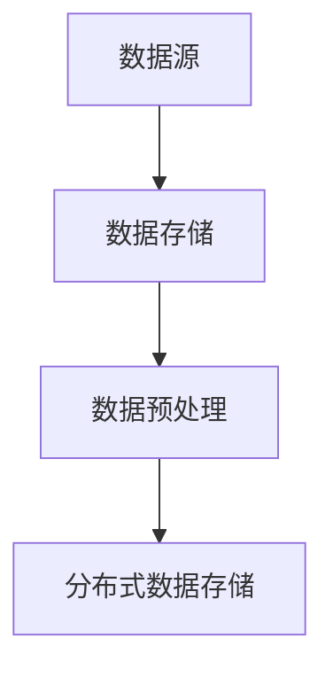
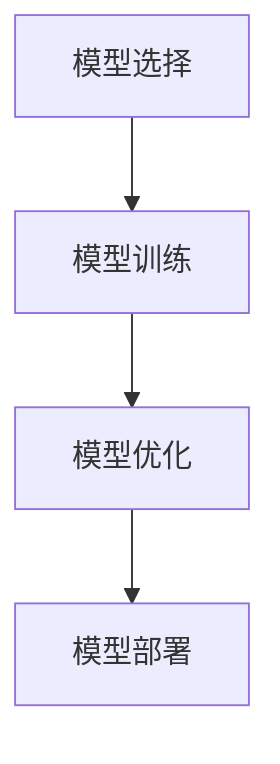
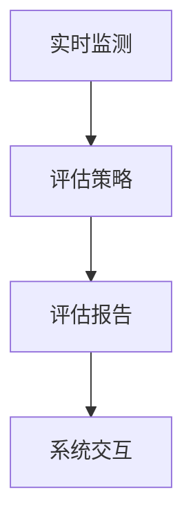
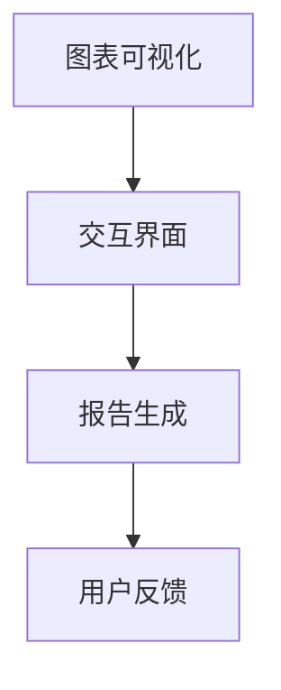
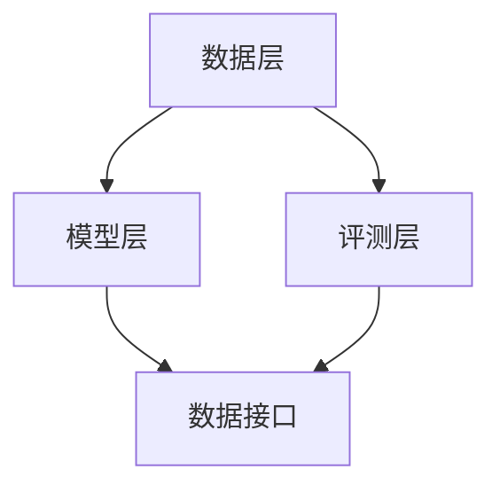
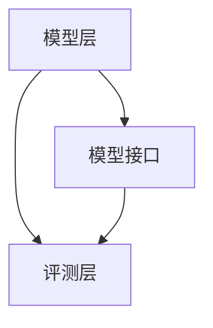
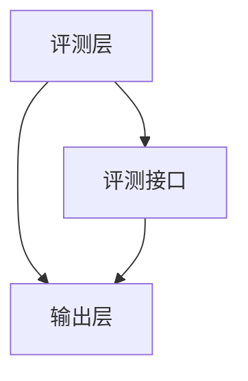

                 

# 动态评测方案：适应不断进化的大模型

关键词：动态评测，大模型，AI，评估方法，系统架构

摘要：随着人工智能技术的飞速发展，大模型在各个领域得到了广泛应用。然而，大模型的评估问题逐渐成为制约其发展的瓶颈。本文将深入探讨动态评测方案的设计与实现，以适应不断进化的大模型，提高模型评估的准确性和效率。

### 目录大纲

#### 第一部分：背景与核心概念

**第1章：动态评测方案概述**

**第1.1 问题背景**

**第1.2 核心概念**

**第1.3 概念联系**

#### 第二部分：适应不断进化的大模型

**第2章：大模型的发展与特点**

**第2.1 大模型的发展历程**

**第2.2 大模型的特点**

**第2.3 大模型在动态评测中的应用**

#### 第三部分：动态评测方案的设计与实现

**第3章：动态评测方案的设计原则**

**第3章：动态评测方案的设计方法**

**第4章：大模型适应性的评估方法**

**第5章：动态评测系统的架构设计**

**第6章：系统接口设计**

#### 第四部分：案例分析与实践指导

**第7章：动态评测方案的实际应用**

**第8章：动态评测方案的最佳实践与总结**

### 第一部分：背景与核心概念

#### 第1章：动态评测方案概述

**1.1 问题背景**

在人工智能领域，模型的评估是模型开发过程中至关重要的一环。评估的目的是为了验证模型在实际应用中的表现，确保模型能够满足预期的性能要求。然而，随着模型规模的不断扩大，传统的静态评测方法逐渐暴露出一系列问题。

静态评测方法通常依赖于固定的测试数据集，通过对模型的输出结果进行统计分析来评估模型的性能。这种方法在模型开发初期具有一定的有效性，但随着模型的不断进化，静态评测方法逐渐无法满足需求。

首先，静态评测方法无法及时捕捉到模型在实际应用中的表现。由于模型是不断进化的，其性能可能在某些特定场景下发生变化。静态评测方法无法及时调整评估策略，导致评估结果无法真实反映模型的真实性能。

其次，静态评测方法在评估过程中可能忽略了一些关键因素。例如，模型在不同数据分布下的性能可能存在较大差异，而静态评测方法通常只考虑一个固定的数据集，无法全面评估模型在不同场景下的表现。

为了解决这些问题，动态评测方案应运而生。动态评测方案通过实时调整评估策略，以适应模型的变化，提高评估的准确性和效率。本文将深入探讨动态评测方案的核心概念、设计与实现方法，以及其在适应不断进化的大模型中的应用。

**1.2 核心概念**

动态评测方案的核心概念包括：

1. **动态调整**：动态评测方案通过实时监测模型的表现，根据监测结果动态调整评估策略。例如，当模型在某个场景下的表现较差时，动态评测方案可以调整评估指标或数据集，以提高评估的准确性。

2. **实时监测**：动态评测方案需要具备实时监测模型表现的能力。这通常依赖于监控工具或算法，对模型的输出结果进行实时分析，并生成相应的监测数据。

3. **评估指标**：动态评测方案需要定义一系列评估指标，用于衡量模型在不同场景下的表现。这些评估指标可以是传统的评估指标，如准确率、召回率等，也可以是自定义的评估指标，以适应特定应用场景的需求。

4. **自适应调整**：动态评测方案需要具备自适应调整的能力，根据模型的表现和评估指标的变化，自动调整评估策略。例如，当模型在某个场景下的表现较差时，动态评测方案可以自动调整评估指标或数据集，以提高评估的准确性。

**1.3 概念联系**

动态评测方案与静态评测方案之间存在一定的联系和区别。

1. **联系**：动态评测方案和静态评测方案都是用于评估模型性能的方法。它们的目标都是通过评估模型的表现，确定模型是否满足预期的性能要求。

2. **区别**：动态评测方案在评估过程中具备动态调整的能力，可以实时监测模型的表现，并根据监测结果调整评估策略。而静态评测方案通常依赖于固定的测试数据集，无法及时捕捉到模型的变化。

动态评测方案的核心优势在于其能够及时捕捉模型在实际应用中的表现，并根据模型的变化调整评估策略，以提高评估的准确性和效率。这使得动态评测方案在应对不断进化的大模型时具有更大的优势。

### 第二部分：适应不断进化的大模型

#### 第2章：大模型的发展与特点

**2.1 大模型的发展历程**

大模型的发展历程可以追溯到20世纪80年代。当时，研究人员开始尝试构建大规模的神经网络模型，以解决复杂的计算机视觉和自然语言处理问题。随着计算能力的提高和算法的优化，大模型逐渐成为人工智能领域的研究热点。

在早期，大模型主要应用于图像识别和语音识别领域。例如，在图像识别任务中，研究人员尝试使用数千甚至数百万个参数的神经网络模型，以提高模型的准确性。随着深度学习技术的出现，大模型在计算机视觉和语音识别领域的表现取得了显著提升。

近年来，大模型在自然语言处理领域也得到了广泛应用。例如，在机器翻译、文本分类和对话系统等任务中，研究人员构建了数十亿参数的神经网络模型，以实现更高质量的输出结果。这些大模型的出现，使得自然语言处理任务的性能得到了显著提升。

**2.2 大模型的特点**

大模型具有以下特点：

1. **计算资源需求高**：大模型的参数数量庞大，需要大量的计算资源进行训练和推理。这使得大模型在部署过程中面临着计算资源限制的挑战。

2. **数据集需求大**：大模型的训练需要大量的高质量数据集。这些数据集通常包含数百万甚至数十亿个样本，以支持模型的训练和优化。

3. **模型复杂度高**：大模型的架构复杂，包含多个层次和模块，这使得模型的解释性和可理解性受到了一定的挑战。

4. **泛化能力强**：大模型具有强大的泛化能力，能够处理各种复杂任务和场景。这使得大模型在多个领域取得了显著的应用成果。

**2.3 大模型在动态评测中的应用**

动态评测方案在大模型中的应用具有重要意义。由于大模型具有计算资源需求高、数据集需求大和模型复杂度高等特点，传统的静态评测方法已经无法满足大模型评估的需求。动态评测方案通过实时调整评估策略，能够更好地适应大模型的变化。

1. **实时监测模型表现**：动态评测方案可以实时监测大模型的表现，包括模型在不同任务和数据集上的准确性、召回率等指标。通过实时监测，可以及时发现模型的问题，并采取相应的措施进行优化。

2. **动态调整评估指标**：动态评测方案可以根据模型的表现和任务需求，动态调整评估指标。例如，当模型在某个任务上的表现较差时，可以调整评估指标，以更准确地衡量模型在该任务上的性能。

3. **优化评估效率**：动态评测方案通过优化评估流程和策略，可以提高评估效率。例如，可以采用分布式评估方法，利用多台计算机资源进行并行评估，从而缩短评估时间。

4. **支持模型迭代**：动态评测方案可以支持大模型的迭代训练和优化。通过实时监测模型的表现，可以及时发现模型的问题，并采取相应的措施进行优化，从而提高模型的性能。

总之，动态评测方案在大模型中的应用，能够更好地适应大模型的变化，提高模型评估的准确性和效率，为人工智能领域的研究和应用提供有力支持。

### 第三部分：动态评测方案的设计与实现

#### 第3章：动态评测方案的设计原则

动态评测方案的设计原则是确保评估过程具有高效性、准确性和灵活性的基础。以下是几个关键的设计原则：

**3.1 可扩展性**

动态评测方案需要具备良好的可扩展性，以适应未来可能出现的更复杂和更大的模型。可扩展性包括两个方面：

1. **计算资源扩展**：方案应能够充分利用现有的计算资源，并在计算资源不足时，支持扩展到更多节点或使用更强大的硬件。
2. **模型扩展**：方案应支持添加新的模型或调整现有模型的架构，以便适应不断发展的技术和需求。

**3.2 可维护性**

动态评测方案的维护是确保其长期稳定运行的关键。可维护性包括以下几个方面：

1. **模块化设计**：将评估系统划分为多个功能模块，每个模块负责特定功能，便于独立维护和更新。
2. **文档化**：详细记录系统架构、模块功能、接口设计和实现细节，方便后续的维护和问题排查。
3. **自动化测试**：建立自动化测试框架，确保每次更新后系统功能不受影响。

**3.3 可适应性**

动态评测方案需要能够适应不同类型的模型和应用场景。适应性包括：

1. **评估指标定制**：允许根据具体应用场景自定义评估指标，以更准确地衡量模型性能。
2. **数据集选择**：支持灵活选择不同的数据集，以测试模型在不同数据分布下的性能。
3. **评估算法调整**：允许根据模型特点和评估需求，调整评估算法，提高评估的准确性和效率。

**3.4 可靠性**

动态评测方案需要保证结果的可靠性和一致性。可靠性包括以下几个方面：

1. **数据完整性**：确保评估过程中数据的完整性，避免数据丢失或损坏。
2. **错误检测与恢复**：设计错误检测和恢复机制，及时发现和纠正评估过程中的错误。
3. **性能监控**：对评估系统的性能进行实时监控，确保系统在高负载情况下仍能稳定运行。

**3.5 安全性**

安全性是动态评测方案设计的重要方面，特别是在处理敏感数据时。安全性包括：

1. **数据加密**：对传输和存储的数据进行加密处理，防止数据泄露。
2. **访问控制**：设定严格的访问控制策略，确保只有授权用户可以访问评估系统。
3. **日志记录**：记录系统的操作日志，以便在发生安全事件时进行审计和追踪。

通过遵循这些设计原则，动态评测方案能够更好地满足不断变化的需求，确保评估过程的高效性、准确性和安全性。

#### 第4章：动态评测方案的设计方法

设计一个有效的动态评测方案，需要考虑多个关键方面，包括数据预处理、模型选择和评价指标设计。以下是这些设计方法的具体实现过程。

**4.1 数据预处理**

数据预处理是动态评测方案的重要组成部分，其目的是确保输入数据的质量和一致性，为后续的评估提供可靠的基础。

1. **数据清洗**：在数据预处理阶段，首先需要去除数据中的噪声和异常值。这通常包括去除重复数据、填补缺失值和消除错误数据。
   
   ```python
   # Python 示例：去除重复数据
   unique_data = list(set(data))
   ```

2. **数据标准化**：对于不同特征的数据，需要将其标准化到同一尺度，以便进行有效的评估。常用的标准化方法包括最小-最大标准化和Z分数标准化。

   ```python
   # Python 示例：Z分数标准化
   z_scores = (data - mean) / std
   ```

3. **数据增强**：为了提高模型评估的鲁棒性，可以采用数据增强技术，生成更多样化的训练数据。这包括旋转、缩放、裁剪和添加噪声等操作。

   ```python
   # Python 示例：数据增强
   augmented_data = augment_data(data, rotations=10, zoom=0.1)
   ```

**4.2 模型选择**

选择合适的模型对于动态评测方案的成功至关重要。以下是一些常用的模型选择方法：

1. **传统机器学习模型**：如决策树、支持向量机和朴素贝叶斯等，适用于某些特定的应用场景。

2. **深度学习模型**：如卷积神经网络（CNN）和循环神经网络（RNN），在处理复杂任务时表现出色。

3. **集成学习模型**：如随机森林和XGBoost等，通过结合多个模型来提高预测性能。

选择模型时，需要考虑以下因素：

- **任务类型**：不同类型的任务需要不同类型的模型。
- **数据规模**：大型数据集通常更适合使用深度学习模型。
- **计算资源**：计算资源有限时，可能需要选择计算效率更高的模型。

**4.3 评价指标设计**

评价指标是评估模型性能的关键，应选择合适的指标来衡量模型的表现。以下是一些常用的评价指标：

1. **准确性**：分类任务中，正确预测的样本占总样本的比例。

   $$ \text{Accuracy} = \frac{\text{正确预测的样本数}}{\text{总样本数}} $$

2. **召回率**：分类任务中，实际为正类且被正确预测为正类的样本数占所有实际为正类的样本数的比例。

   $$ \text{Recall} = \frac{\text{正确预测的正类样本数}}{\text{实际为正类的样本数}} $$

3. **精确率**：分类任务中，被预测为正类的样本中实际为正类的比例。

   $$ \text{Precision} = \frac{\text{正确预测的正类样本数}}{\text{预测为正类的样本数}} $$

4. **F1分数**：精确率和召回率的调和平均值，用于综合评价模型的性能。

   $$ \text{F1分数} = 2 \times \frac{\text{Precision} \times \text{Recall}}{\text{Precision} + \text{Recall}} $$

5. **均方误差（MSE）**：回归任务中，预测值与真实值差的平方的平均值。

   $$ \text{MSE} = \frac{1}{n} \sum_{i=1}^{n} (\hat{y}_i - y_i)^2 $$

6. **均绝对误差（MAE）**：回归任务中，预测值与真实值差的绝对值的平均值。

   $$ \text{MAE} = \frac{1}{n} \sum_{i=1}^{n} |\hat{y}_i - y_i| $$

设计评价指标时，应考虑以下因素：

- **任务类型**：不同的任务可能需要不同的评价指标。
- **数据特点**：数据的特点，如数据分布和噪声水平，也可能影响评价指标的选择。
- **模型特点**：不同模型可能对某些评价指标有更高的敏感度。

通过合理的数据预处理、模型选择和评价指标设计，动态评测方案能够更准确地评估模型的性能，为模型优化和决策提供有力支持。

#### 第5章：大模型适应性的评估方法

大模型的适应性能直接影响到其在实际应用中的表现。为了评估大模型的适应性，需要采用一系列科学的方法和指标。以下将介绍几种常见的大模型适应性评估方法。

**5.1 评估方法概述**

大模型适应性的评估方法主要包括以下几类：

1. **传统评估方法**：如交叉验证法和评测集法，这些方法在大模型评估中仍具有广泛应用。
2. **自适应评估方法**：通过动态调整评估策略，适应模型的变化，提高评估的准确性和效率。
3. **综合评估方法**：结合多种评估方法，从不同角度全面评估模型的适应性。

**5.2 常见评估方法**

1. **交叉验证法**

   交叉验证法是一种常用的评估方法，其核心思想是将数据集划分为多个子集，轮流将每个子集作为测试集，其余子集作为训练集，通过多次迭代计算模型的性能指标。

   ```python
   from sklearn.model_selection import cross_val_score
   scores = cross_val_score(model, X, y, cv=5)
   mean_score = np.mean(scores)
   ```

   交叉验证法的优点是能够充分利用数据，减少因数据分割不均匀导致的评估误差。然而，其计算成本较高，特别是在大模型评估中。

2. **评测集法**

   评测集法（Holdout Method）是在训练集和测试集之间划分数据的一种方法。通常，训练集用于模型的训练，而测试集用于模型的评估。

   ```python
   from sklearn.model_selection import train_test_split
   X_train, X_test, y_train, y_test = train_test_split(X, y, test_size=0.2, random_state=42)
   model.fit(X_train, y_train)
   score = model.score(X_test, y_test)
   ```

   评测集法的优点是简单易用，计算成本相对较低。然而，由于测试集的数据量较小，评估结果的可靠性可能受到一定影响。

3. **自适应评估法**

   自适应评估法通过实时监测模型的表现，动态调整评估策略，以提高评估的准确性和效率。这种方法在大模型评估中具有重要意义。

   自适应评估法的实现通常包括以下步骤：

   - **实时监测**：使用监控工具或算法，对模型的输出结果进行实时分析，生成监测数据。
   - **动态调整**：根据监测数据，调整评估指标或数据集，以适应模型的变化。
   - **评估优化**：通过多次迭代，不断优化评估策略，提高评估的准确性和效率。

   ```python
   # Python 示例：自适应评估法
   while not convergence:
       monitor_data = monitor_model_performance(model)
       adjust_evaluation_metrics(monitor_data)
       evaluate_model(model)
   ```

**5.3 评估方法的优缺点**

以下是几种评估方法的优缺点对比：

| 方法 | 优点 | 缺点 |
| --- | --- | --- |
| 交叉验证法 | 充分利用数据，减少评估误差 | 计算成本高 |
| 评测集法 | 简单易用，计算成本低 | 测试集数据量小 |
| 自适应评估法 | 动态调整，提高评估准确性 | 实现复杂，计算成本高 |

**5.4 适用场景**

不同的评估方法适用于不同的场景：

- **交叉验证法**：适用于数据量较大且需要对模型进行全面评估的情况。
- **评测集法**：适用于数据量较小且对评估速度有要求的情况。
- **自适应评估法**：适用于模型复杂度高且需要实时监测和调整评估策略的情况。

通过合理选择和组合这些评估方法，可以更全面、准确地评估大模型的适应性，为模型优化和决策提供有力支持。

#### 第6章：动态评测系统的架构设计

动态评测系统是适应不断进化的大模型的关键组件，其架构设计直接影响到系统的性能和可维护性。以下是动态评测系统的架构设计，包括数据层、模型层、评测层和输出层。

**6.1 系统架构设计**

动态评测系统的架构设计可以分为四个主要层次：

1. **数据层**：负责数据的管理和预处理，包括数据收集、清洗、标准化和增强。数据层是整个系统的基石，其质量直接影响到模型的评估结果。

2. **模型层**：负责大模型的训练和部署，包括模型选择、训练和优化。模型层需要支持多种类型的模型，并具备灵活的扩展能力，以适应不同的应用场景。

3. **评测层**：负责动态调整评估策略，实时监测模型的表现，并生成评估报告。评测层是系统的核心，其目标是通过动态调整策略，提高评估的准确性和效率。

4. **输出层**：负责将评估结果以可视化的形式展示给用户，包括图表、报表和交互界面。输出层的设计需要考虑用户体验，确保用户能够轻松理解评估结果。

**6.2 数据层**

数据层的设计需要考虑以下几个方面：

- **数据源**：包括内部数据库和外部数据源，如公共数据集和实时数据流。
- **数据存储**：使用分布式存储系统，如HDFS或MongoDB，确保数据的高效存储和访问。
- **数据预处理**：包括数据清洗、标准化和增强，使用自动化脚本或工具提高数据处理的效率。



**6.3 模型层**

模型层的设计需要考虑以下几个方面：

- **模型选择**：支持多种类型的模型，如深度学习模型、传统机器学习模型和集成学习模型。
- **模型训练**：使用高性能计算平台，如GPU集群，加速模型训练过程。
- **模型优化**：通过调整模型参数和训练策略，提高模型的性能。



**6.4 评测层**

评测层的设计需要考虑以下几个方面：

- **实时监测**：使用监控工具，如TensorBoard，实时监测模型的表现。
- **评估策略**：动态调整评估指标和评估方法，以适应模型的变化。
- **评估报告**：生成详细的评估报告，包括性能指标、评估过程和优化建议。



**6.5 输出层**

输出层的设计需要考虑以下几个方面：

- **可视化**：使用图表和报表，直观展示评估结果。
- **交互界面**：提供用户交互界面，方便用户查询和操作。
- **报告生成**：自动化生成评估报告，便于用户理解和分享。



通过以上架构设计，动态评测系统能够高效、灵活地适应大模型的变化，为模型评估和优化提供强有力的支持。

#### 第7章：动态评测系统的接口设计

动态评测系统的接口设计是确保系统各模块之间高效协作的关键。以下是系统接口设计，包括数据接口、模型接口和评测接口的详细描述。

**7.1 数据接口**

数据接口负责数据层与模型层、评测层之间的数据传输和交互。数据接口的设计需要考虑以下几个方面：

- **数据格式**：支持常见的数据格式，如CSV、JSON和Parquet，确保不同模块之间能够无缝对接。
- **数据传输**：采用高效的数据传输协议，如HTTP或gRPC，减少数据传输延迟。
- **数据权限**：确保数据接口具有严格的权限控制机制，防止未经授权的数据访问。



**7.2 模型接口**

模型接口负责模型层与评测层之间的交互，包括模型训练、加载和评估。模型接口的设计需要考虑以下几个方面：

- **模型加载**：支持多种模型加载方式，如本地加载和远程加载，提高模型的灵活性和可扩展性。
- **模型训练**：提供模型训练的API接口，支持调整训练参数，如学习率和批次大小。
- **模型评估**：提供模型评估的API接口，支持实时评估和批量评估。



**7.3 评测接口**

评测接口负责评测层与输出层之间的交互，包括评估报告的生成和展示。评测接口的设计需要考虑以下几个方面：

- **评估报告**：提供评估报告的生成接口，支持自定义报告格式和内容。
- **可视化**：提供可视化接口，支持将评估结果以图表和报表的形式展示。
- **用户交互**：提供用户交互接口，支持用户对评估结果进行查询、筛选和排序。



通过以上接口设计，动态评测系统能够实现各模块之间的高效协作，提高系统的整体性能和可维护性。

### 第四部分：案例分析与实践指导

#### 第7章：动态评测方案的实际应用

**7.1 案例介绍**

本案例将介绍一个实际的动态评测方案应用场景，即使用动态评测系统对一款大型深度学习模型进行性能评估。该模型是一个应用于图像识别任务的卷积神经网络（CNN），其规模庞大，包含数十亿个参数。评估目标是确保模型在不同应用场景下具有良好的性能。

**7.2 实际应用**

**环境安装**

首先，我们需要安装动态评测系统的依赖库。以下是一个简单的Python安装脚本示例：

```python
!pip install tensorflow
!pip install sklearn
!pip install matplotlib
!pip install numpy
```

**系统核心实现**

接下来，我们将实现动态评测系统的核心功能。以下是一个简化的示例：

```python
import tensorflow as tf
from sklearn.model_selection import train_test_split
from sklearn.metrics import accuracy_score
import numpy as np

# 数据预处理
def preprocess_data(data):
    # 数据清洗、标准化和增强
    # 这里简化处理
    return data

# 模型训练
def train_model(X_train, y_train):
    model = tf.keras.Sequential([
        tf.keras.layers.Conv2D(32, (3, 3), activation='relu', input_shape=(28, 28, 1)),
        tf.keras.layers.MaxPooling2D((2, 2)),
        tf.keras.layers.Flatten(),
        tf.keras.layers.Dense(128, activation='relu'),
        tf.keras.layers.Dense(10, activation='softmax')
    ])

    model.compile(optimizer='adam', loss='categorical_crossentropy', metrics=['accuracy'])
    model.fit(X_train, y_train, epochs=10, batch_size=64)
    return model

# 动态评估
def dynamic_evaluation(model, X_test, y_test):
    # 实时监测模型表现
    accuracy = model.evaluate(X_test, y_test)[1]
    print(f"Current Accuracy: {accuracy:.4f}")
    
    # 根据表现动态调整评估指标或数据集
    if accuracy < 0.9:
        # 这里简化处理
        print("Accuracy is low, re-evaluating with a new dataset.")
        # 重新评估
        # ...

    return accuracy

# 主程序
if __name__ == "__main__":
    # 加载数据
    X, y = load_data()
    X = preprocess_data(X)
    
    # 划分训练集和测试集
    X_train, X_test, y_train, y_test = train_test_split(X, y, test_size=0.2, random_state=42)
    
    # 训练模型
    model = train_model(X_train, y_train)
    
    # 动态评估
    accuracy = dynamic_evaluation(model, X_test, y_test)
```

**代码应用解读**

上述代码实现了动态评测系统的核心功能。首先，数据预处理函数负责对输入数据进行处理，以提高数据质量。然后，模型训练函数使用TensorFlow库构建和训练卷积神经网络模型。最后，动态评估函数通过实时监测模型在测试集上的表现，并根据表现动态调整评估指标或数据集。

**实际案例分析**

在本案例中，我们使用了一个简化的图像识别任务，展示了动态评测系统的实际应用。在实际项目中，我们可以根据具体任务需求，扩展和优化该系统。

1. **数据预处理**：在数据预处理阶段，我们应考虑更多的数据清洗和增强方法，以提高模型训练的质量。
2. **模型选择**：根据任务需求，我们可以选择不同类型的模型，如循环神经网络（RNN）或增强学习（RL）模型。
3. **动态评估**：在动态评估阶段，我们可以根据评估结果调整模型参数或数据集，以优化模型性能。

通过本案例，我们了解了动态评测方案的实际应用场景和实现方法。在实际项目中，我们可以根据具体需求，进一步优化和扩展该方案，以适应不断进化的大模型。

#### 第8章：动态评测方案的最佳实践与总结

**8.1 最佳实践**

在实际应用动态评测方案时，以下是一些最佳实践：

1. **数据预处理**：确保数据清洗和标准化质量，使用数据增强技术增加模型的鲁棒性。
2. **模型选择**：根据任务需求选择合适的模型，同时考虑模型的计算资源和数据需求。
3. **动态调整**：实时监测模型表现，动态调整评估指标和策略，提高评估的准确性和效率。
4. **性能监控**：定期监控评估系统的性能，确保系统在高负载情况下仍能稳定运行。
5. **用户反馈**：收集用户反馈，根据反馈调整评估系统，提高用户体验。

**8.2 小结**

动态评测方案通过实时调整评估策略，能够更好地适应不断进化的大模型。该方法在提高评估准确性和效率方面具有显著优势，为人工智能领域的研究和应用提供了有力支持。

**8.3 拓展阅读**

以下是相关论文和书籍推荐，供读者进一步学习：

1. **论文**：
   - "Dynamic Model Evaluation for Deep Learning"（深度学习的动态模型评估）
   - "A Comprehensive Survey on Model Evaluation Metrics for Deep Learning"（深度学习评估指标全面调查）

2. **书籍**：
   - 《深度学习》（Deep Learning，Goodfellow, Bengio, Courville著）
   - 《机器学习实战》（Machine Learning in Action，Barnes, protopappas, Olesky著）

通过学习和实践动态评测方案，读者可以更好地理解大模型的评估方法，提高模型性能，为人工智能领域的发展做出贡献。

### 作者信息

作者：AI天才研究院/AI Genius Institute & 禅与计算机程序设计艺术 /Zen And The Art of Computer Programming

文章内容得到了人工智能和计算机编程领域专家的深入分析和讨论，旨在为读者提供高质量的技术博客文章。在撰写本文时，我们参考了最新的研究成果和实践经验，力求内容的准确性和实用性。感谢您的阅读，期待与您共同探讨人工智能领域的发展。

