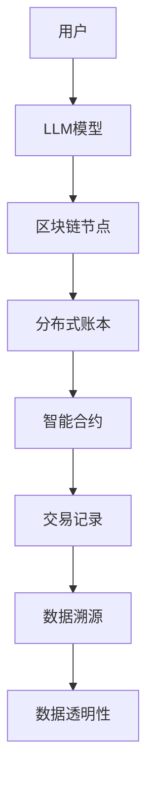

                 

### 1.1 问题背景

随着大数据和人工智能的迅速发展，大型语言模型（LLM）作为人工智能的一个重要分支，正逐渐成为各行各业的关键技术。LLM通过深度学习技术对海量文本数据进行训练，能够生成高质量的自然语言文本，广泛应用于自然语言处理、智能问答、机器翻译、文本生成等领域。然而，LLM的应用面临一个重要的挑战：数据可信性问题。

在现代互联网和大数据环境下，数据来源多样，质量参差不齐。数据的不确定性、真实性和完整性对LLM的准确性和可靠性构成了严峻的考验。首先，数据可能存在篡改、伪造等安全风险，导致模型产生错误的预测和结论。其次，数据质量低、不一致或存在噪声，会影响模型的学习效果和泛化能力。此外，数据的隐私性问题也是一个亟待解决的挑战，如何在保障用户隐私的前提下利用数据训练LLM，成为了一个关键问题。

为了增强LLM应用的数据可信性，区块链技术提供了一种潜在的解决方案。区块链具有去中心化、不可篡改、透明性和可追溯性等特性，能够有效地提高数据的可信度和安全性。通过将数据上链，可以实现数据的永久保存和不可篡改，从而避免数据篡改和伪造的风险。同时，区块链的透明性和可追溯性使得数据的来源和操作过程可以被任何人验证，提高了数据的可信度。此外，区块链的智能合约功能还可以用于实现数据的隐私保护和权限控制，确保数据的合法使用。

尽管区块链技术具有上述优势，但在实际应用中，也存在一些挑战。例如，区块链的数据存储和计算能力有限，可能无法满足大规模数据和高性能计算的需求。此外，区块链与LLM的集成需要解决数据格式、接口兼容等问题，确保两者能够高效协同工作。因此，如何设计一种有效的区块链集成方案，提升LLM应用的数据可信性，成为一个重要的研究方向。

总之，增强LLM应用的数据可信性具有重要意义。本文将系统地探讨区块链与LLM的集成原理和方法，分析其在提升数据可信性方面的应用，旨在为相关领域的研究和应用提供有益的参考。

### 1.2 问题描述

在当前的大数据和人工智能时代，大型语言模型（LLM）在众多领域展现出了强大的应用潜力。然而，LLM在实际应用过程中面临的一个核心问题便是数据可信性问题。具体而言，数据可信性包括数据的真实性、完整性、一致性和安全性等方面。以下将详细描述这些方面的问题：

1. **数据真实性**：LLM的训练依赖于大量的文本数据。然而，在互联网上，数据的真实性难以保证。数据来源可能包括社交媒体、新闻媒体、论坛等，这些平台上的数据可能存在虚假信息、误导性言论或恶意内容。如果LLM训练数据中包含大量不真实的数据，将导致模型产生错误的预测和结论，降低其准确性和可靠性。

2. **数据完整性**：数据的完整性是指数据在存储和传输过程中不会被丢失或损坏。然而，在实际应用中，数据完整性问题常常出现。例如，网络故障、存储设备故障或数据传输过程中的错误可能导致数据丢失或损坏，从而影响LLM的训练效果和应用性能。

3. **数据一致性**：数据一致性是指在不同时间、不同地点获取的数据应具有一致性。然而，由于数据来源的多样性，数据可能存在不一致的情况。例如，不同来源的数据可能在格式、结构或内容上存在差异，导致数据整合和处理的困难。此外，数据更新和同步不及时也可能导致数据不一致的问题。

4. **数据安全性**：数据安全性是指数据在存储、传输和处理过程中不会被未经授权的访问或篡改。在互联网环境中，数据面临各种安全威胁，如黑客攻击、数据泄露、数据篡改等。数据安全问题的存在不仅威胁到LLM的训练和应用，还可能导致严重的社会和经济损失。

针对上述数据可信性问题，LLM应用需要解决以下几个关键问题：

1. **数据真实性验证**：如何确保训练数据的真实性，避免虚假信息对模型的影响？

2. **数据完整性保障**：如何设计有效的数据存储和传输机制，确保数据完整性？

3. **数据一致性管理**：如何实现不同来源数据的整合和一致性管理，提高数据处理效率？

4. **数据安全性增强**：如何加强数据安全防护，防止数据泄露和篡改？

为解决上述问题，本文提出将区块链技术集成到LLM应用中，通过区块链的不可篡改、透明性和可追溯性等特性，提升数据的可信性。具体而言，本文将探讨以下内容：

1. 区块链技术的基本概念和原理，包括去中心化、分布式账本、加密算法和共识机制等。

2. 大型语言模型（LLM）的基本概念和关键技术，包括自然语言处理、机器学习和深度学习等。

3. 区块链与LLM的集成原理和方法，分析其如何提升数据可信性。

4. 基于区块链的数据可信性提升方法，包括数据上链、数据验证和数据隐私保护等。

5. LLM应用案例分析，通过实际应用场景展示区块链在提升数据可信性方面的效果。

6. 区块链与LLM集成应用的未来发展趋势和挑战。

通过本文的研究，旨在为LLM应用提供一种有效的数据可信性提升方案，推动区块链技术在人工智能领域的发展和应用。

### 1.3 问题解决思路

为了解决LLM应用中的数据可信性问题，我们需要采用一种系统的解决思路，将区块链技术与LLM深度融合，从而提升数据的质量和可靠性。以下是一些关键步骤和解决方案：

1. **数据上链**：首先，我们需要将训练数据上链。区块链的去中心化特性使得数据可以在多个节点上备份，避免了单点故障和数据丢失的风险。通过将数据上链，可以实现数据的不可篡改性，确保数据的真实性和完整性。具体方法是将文本数据转换为哈希值，并将其存储在区块链的区块中。每次数据更新时，都会生成新的哈希值，并与旧的哈希值进行比较，以确保数据的完整性和一致性。

2. **数据验证**：为了确保数据的真实性，我们需要对数据进行验证。区块链的加密算法和共识机制为数据验证提供了强有力的支持。通过加密算法，数据在上链前需要进行加密，确保数据的隐私性和安全性。同时，共识机制确保了区块链网络中所有节点对数据的共识，从而保证了数据的真实性和可靠性。具体方法包括工作量证明（PoW）和权益证明（PoS）等共识算法，这些算法通过复杂的计算和投票机制，确保了数据的一致性和安全性。

3. **数据隐私保护**：在区块链与LLM集成过程中，数据隐私保护是一个重要问题。为了保护用户隐私，我们可以采用零知识证明（ZKP）等加密技术。零知识证明允许用户在不泄露任何信息的情况下，证明某个陈述是正确的。通过将数据加密，并在加密状态下进行训练和推理，可以有效保护用户的隐私。此外，区块链的智能合约功能可以用于实现数据隐私保护，确保数据的合法访问和使用。

4. **数据溯源**：区块链的透明性和可追溯性特性使得数据的操作过程可以被任何人验证。通过区块链的区块链结构，我们可以追溯每一条数据的来源和操作历史，确保数据的可信性。具体方法包括记录数据的创建时间、修改时间、操作者等信息，并将这些信息存储在区块链的区块中。当需要验证数据的真实性时，可以查询区块链的区块链结构，追溯数据的操作历史。

5. **数据权限控制**：为了确保数据的安全性和隐私性，我们需要对数据进行权限控制。区块链的智能合约功能可以用于实现数据权限控制，确保只有授权的用户可以访问和操作数据。具体方法包括创建智能合约，定义数据的访问权限和使用规则，并通过区块链网络进行执行和验证。例如，可以设置只有特定用户或组织可以访问某份数据，从而保护数据的隐私和安全。

通过上述解决方案，我们可以将区块链技术有效集成到LLM应用中，提升数据的质量和可靠性。具体而言，区块链的不可篡改性和透明性确保了数据的真实性和完整性，加密技术和智能合约功能保护了数据的隐私和安全。同时，区块链的分布式特性提高了系统的可扩展性和容错能力。

然而，在实际应用中，区块链与LLM的集成也存在一些挑战。首先，区块链的数据存储和计算能力有限，可能无法满足大规模数据和高性能计算的需求。针对这个问题，可以采用分片技术和优化共识算法，提高区块链的扩展性和性能。其次，区块链与LLM的集成需要解决数据格式、接口兼容等问题，确保两者能够高效协同工作。此外，区块链技术的复杂性和安全性也需要得到充分重视，确保系统的稳定性和可靠性。

总之，通过将区块链技术与LLM深度融合，我们可以有效解决数据可信性问题，推动人工智能技术的发展和应用。未来的研究和实践需要进一步探索和优化区块链与LLM的集成方案，提高系统的性能和安全性，为各行各业提供更加可靠和高效的数据服务。

### 1.4 边界与外延

在探讨区块链集成提升LLM应用数据可信性的过程中，我们需要明确一些边界和概念外延，以确保研究的准确性和应用的可行性。

**边界定义**：

1. **数据可信性**：数据可信性是指数据在真实性、完整性、一致性和安全性等方面的质量。这里，数据真实性指数据来源可靠、内容准确；数据完整性指数据在存储和传输过程中不会被丢失或损坏；数据一致性指不同来源的数据在格式、结构或内容上的一致性；数据安全性指数据在存储、传输和处理过程中不会被未经授权的访问或篡改。

2. **区块链技术**：区块链是一种分布式账本技术，通过加密算法和共识机制确保数据的安全性和不可篡改性。它由多个区块组成，每个区块包含一定数量的交易记录，并通过哈希函数将区块链接成一个链条。

3. **大型语言模型（LLM）**：LLM是指通过深度学习技术对海量文本数据进行训练，具备生成高质量自然语言文本能力的模型。LLM广泛应用于自然语言处理、智能问答、机器翻译等领域。

**概念外延**：

1. **去中心化**：去中心化是指区块链网络的参与者（节点）之间没有中心控制，每个节点都有平等的权利和义务。与传统的集中式系统相比，去中心化提高了系统的容错性和抗攻击能力。

2. **分布式账本**：分布式账本是指区块链网络中的所有节点都保存一个完整的账本副本，每个节点之间的账本保持一致。这种分布式结构避免了单点故障和数据丢失的风险。

3. **加密算法**：加密算法是指用于保护数据隐私和安全的技术，包括哈希函数、对称加密、非对称加密等。区块链中的加密算法确保数据的隐私性和不可篡改性。

4. **共识机制**：共识机制是指区块链网络中的节点如何达成共识，确保账本的一致性。常见的共识机制包括工作量证明（PoW）、权益证明（PoS）和委托权益证明（DPoS）等。

**应用边界**：

1. **数据上链**：数据上链是指将训练数据存储在区块链上，确保数据的真实性和完整性。在LLM应用中，数据上链适用于大规模、高频率的数据处理，例如社交媒体数据、新闻数据等。

2. **数据验证**：数据验证是指通过区块链的加密算法和共识机制，确保数据的真实性和可靠性。在LLM应用中，数据验证可以应用于数据清洗、数据标注和模型训练等环节。

3. **数据隐私保护**：数据隐私保护是指通过区块链的加密技术和智能合约，保护用户数据的隐私和安全。在LLM应用中，数据隐私保护适用于涉及用户隐私的数据处理，例如个人健康数据、金融数据等。

**研究外延**：

1. **区块链与LLM集成**：区块链与LLM集成是本文的核心研究方向，包括数据上链、数据验证、数据隐私保护和数据溯源等方面。研究外延包括探索不同区块链平台（如比特币、以太坊）与LLM的集成方法，以及优化区块链与LLM的协同工作机制。

2. **应用场景扩展**：本文的研究不仅限于LLM应用，还可以扩展到其他人工智能领域，如计算机视觉、推荐系统等。研究外延包括探索区块链技术在这些领域的应用，以及如何进一步提升数据可信性和系统性能。

通过明确边界和概念外延，我们可以更准确地理解区块链集成提升LLM应用数据可信性的研究内容和应用范围，为未来的研究和实践提供指导。

### 1.5 概念结构与核心要素组成

在深入探讨区块链集成提升LLM应用数据可信性的过程中，我们需要构建清晰的概念结构和理解核心要素的组成，以确保我们能够系统地分析和解决问题。以下是关键概念及其相互关系：

#### 1.5.1 区块链与数据可信性

- **区块链**：区块链是一种分布式数据库系统，通过加密算法和共识机制确保数据的安全性和不可篡改性。它由多个区块组成，每个区块包含一定数量的交易记录，并通过哈希函数将区块链接成一个链条。
- **数据可信性**：数据可信性是指数据在真实性、完整性、一致性和安全性等方面的质量。区块链通过其不可篡改性和透明性特性，提升了数据在LLM应用中的可信性。

#### 1.5.2 大型语言模型（LLM）与区块链集成

- **大型语言模型（LLM）**：LLM是一种通过深度学习技术训练的模型，具备生成高质量自然语言文本的能力。在LLM应用中，数据可信性至关重要。
- **区块链集成**：区块链集成是将区块链技术与LLM应用相结合，通过区块链的特性提升数据可信性。核心要素包括数据上链、数据验证、数据隐私保护和数据溯源。

#### 1.5.3 数据上链

- **数据上链**：数据上链是指将训练数据存储在区块链上，确保数据的真实性和完整性。具体方法是将文本数据转换为哈希值，并将其存储在区块链的区块中。
- **哈希函数**：哈希函数是一种将数据转换为固定长度字符串的算法，用于生成唯一标识符。在区块链中，哈希函数用于确保数据的不可篡改性。

#### 1.5.4 数据验证

- **数据验证**：数据验证是指通过区块链的加密算法和共识机制，确保数据的真实性和可靠性。共识机制包括工作量证明（PoW）、权益证明（PoS）等。
- **加密算法**：加密算法用于保护数据隐私和安全，包括哈希函数、对称加密、非对称加密等。在数据验证过程中，加密算法确保数据的隐私性和安全性。

#### 1.5.5 数据隐私保护

- **数据隐私保护**：数据隐私保护是指通过区块链的加密技术和智能合约，保护用户数据的隐私和安全。零知识证明（ZKP）等加密技术用于实现数据的隐私保护。
- **智能合约**：智能合约是一种自动执行合约条款的计算机程序，通过区块链网络进行执行和验证。在数据隐私保护中，智能合约用于实现数据访问和使用规则。

#### 1.5.6 数据溯源

- **数据溯源**：数据溯源是指通过区块链的透明性和可追溯性特性，追溯数据的来源和操作历史，确保数据的可信性。
- **区块链结构**：区块链结构包括区块和链，每个区块包含一定数量的交易记录，并通过哈希函数与前一个区块连接。通过区块链结构，可以追溯每一条数据的来源和操作历史。

#### 1.5.7 数据权限控制

- **数据权限控制**：数据权限控制是指通过区块链的智能合约功能，确保只有授权的用户可以访问和操作数据。智能合约定义数据的访问权限和使用规则，并通过区块链网络进行执行和验证。

### 关系与关联

- **区块链与数据可信性**：区块链通过其特性（如去中心化、不可篡改、透明性）提升了数据可信性。
- **LLM与区块链集成**：LLM应用通过区块链集成，提升数据可信性，确保模型的准确性和可靠性。
- **数据上链与数据验证**：数据上链确保数据的真实性和完整性，数据验证确保数据的真实性和可靠性。
- **数据隐私保护与数据溯源**：数据隐私保护确保用户数据的隐私和安全，数据溯源确保数据的可信性。
- **数据权限控制与数据隐私保护**：数据权限控制与数据隐私保护协同工作，确保数据的合法访问和使用。

通过上述概念结构与核心要素组成，我们可以清晰地理解区块链集成提升LLM应用数据可信性的理论基础和实践方法，为后续章节的详细分析提供基础。

#### 2.1 区块链概述

区块链是一种分布式数据库系统，通过加密算法和共识机制确保数据的安全性和不可篡改性。它由多个区块组成，每个区块包含一定数量的交易记录，并通过哈希函数将区块链接成一个链条。以下是对区块链基本概念、历史发展、核心技术和应用场景的详细介绍。

##### 2.1.1 基本概念

区块链（Blockchain）是一种去中心化的分布式数据库，由多个按照时间顺序排列的区块组成。每个区块包含一定数量的交易记录，以及一个时间戳和一个指向前一个区块的哈希值。区块链通过加密算法和共识机制，确保数据的真实性和不可篡改性。区块链中的每个区块都是通过密码学方法生成的，使得一旦数据被记录在区块链上，就无法被篡改或删除。

- **去中心化**：区块链去中心化的特点使得数据无需依赖中心化的机构或服务器进行存储和管理。每个节点都保存一个完整的账本副本，并通过网络同步和验证交易，确保账本的一致性。
- **分布式账本**：分布式账本是指区块链网络中的所有节点都保存一个完整的账本副本，每个节点之间的账本保持一致。这种分布式结构避免了单点故障和数据丢失的风险。
- **加密算法**：区块链使用加密算法（如SHA-256）对数据进行加密，确保数据的隐私性和安全性。通过加密算法，可以生成唯一标识符（哈希值），用于验证数据的一致性和不可篡改性。
- **共识机制**：共识机制是指区块链网络中的节点如何达成共识，确保账本的一致性。常见的共识机制包括工作量证明（PoW）、权益证明（PoS）和委托权益证明（DPoS）等。

##### 2.1.2 历史发展

区块链技术的起源可以追溯到2008年，当时一个名为中本聪（Satoshi Nakamoto）的匿名人士发布了比特币（Bitcoin）的创世论文。比特币是第一种基于区块链技术的数字货币，它通过区块链解决了双花问题（即同一笔资金同时被花费两次的问题），从而实现了去中心化的电子现金系统。

在比特币的基础上，区块链技术逐渐发展并应用于其他领域。2014年，以太坊（Ethereum）的发布标志着区块链2.0时代的到来。以太坊不仅支持数字货币的交易，还引入了智能合约（Smart Contract）的概念，使得区块链可以用于执行复杂的计算和自动化交易。

近年来，区块链技术的应用领域不断扩大，从金融领域扩展到供应链管理、医疗保健、物联网等多个行业。随着技术的不断成熟，区块链在提升数据可信性、优化流程和降低成本方面的潜力得到了广泛认可。

##### 2.1.3 核心技术

区块链的核心技术包括分布式账本、加密算法、共识机制和智能合约。

- **分布式账本**：分布式账本是指区块链网络中的所有节点都保存一个完整的账本副本。通过分布式账本，可以避免单点故障和数据丢失的风险，提高系统的可靠性和容错能力。
- **加密算法**：加密算法是区块链技术的重要组成部分，用于保护数据的隐私性和安全性。常见的加密算法包括哈希函数、对称加密、非对称加密等。
- **共识机制**：共识机制是区块链网络中的节点如何达成共识，确保账本的一致性。不同的共识机制有不同的特点，如工作量证明（PoW）具有较高的安全性和去中心化程度，但计算资源消耗较大；权益证明（PoS）则具有较高的效率，但可能会面临集中化的风险。
- **智能合约**：智能合约是区块链上的计算机程序，用于自动执行合约条款。智能合约通过编程定义了交易规则和条件，一旦满足条件，智能合约将自动执行，从而实现自动化交易和合约执行。

##### 2.1.4 应用场景

区块链技术具有去中心化、不可篡改、透明性和可追溯性等特性，使其在多个领域具有广泛的应用潜力。以下是一些常见的应用场景：

- **金融领域**：区块链技术可以用于实现去中心化的电子支付系统，如比特币和以太坊。此外，区块链还可以用于数字身份认证、跨境支付和金融交易记录管理等。
- **供应链管理**：区块链技术可以用于记录供应链中的每个环节，确保供应链的可追溯性和透明性。通过区块链，可以追踪产品的来源、生产和运输过程，提高供应链的效率和可信度。
- **医疗保健**：区块链技术可以用于存储和管理医疗数据，如电子健康记录、病历和药品供应链信息。通过区块链，可以确保医疗数据的真实性和隐私性，同时提高数据共享和协作的效率。
- **物联网（IoT）**：区块链技术可以用于物联网设备的数据存储和安全管理。通过区块链，可以确保物联网设备之间的通信和数据交换是安全和可信的。
- **投票系统**：区块链技术可以用于实现去中心化的投票系统，确保投票过程的公正性和透明性。通过区块链，可以防止选举过程中的欺诈行为，提高选举结果的可信度。

通过上述概述，我们可以看到区块链技术在数据可信性提升方面具有巨大的潜力。在接下来的章节中，我们将进一步探讨区块链与大型语言模型（LLM）的集成原理和方法，分析其在LLM应用中的具体应用和优势。

#### 2.2 区块链关键技术

区块链技术的核心在于其独特的数据结构、加密技术和共识机制，这些技术共同确保了区块链系统的安全性和可靠性。以下将详细探讨区块链的关键技术，包括数据结构、加密算法和共识机制，并使用Mermaid流程图和Python代码示例进行解释。

##### 2.2.1 数据结构

区块链的数据结构是它最为独特和核心的部分，由多个区块组成，每个区块包含一定的交易记录，并通过哈希函数连接成一个链条。

1. **区块**：区块是区块链的基本组成单元，每个区块包含以下几个部分：
    - **交易记录**：每个区块包含一定数量的交易记录，这些交易记录可以是金融交易、数据记录等。
    - **区块头**：区块头包含一个时间戳、当前区块的随机数、前一个区块的哈希值以及本区块的哈希值。
    - **Merkle树**：Merkle树用于存储交易记录的哈希值，以确保交易记录的一致性和完整性。

    以下是一个区块的Mermaid图表示：

    ```mermaid
    graph TD
    A[区块头] --> B[交易记录]
    B --> C[Merkle树]
    C --> D[随机数]
    D --> E[前一个区块哈希值]
    E --> F[本区块哈希值]
    ```

2. **链**：区块链是由多个区块按照时间顺序排列组成的链条。每个区块都包含一个指向前一个区块的哈希值，通过这个哈希值，可以追溯到整个区块链的创世区块。

    ```mermaid
    graph TD
    A1[创世区块] --> B1[区块1]
    B1 --> C1[区块2]
    C1 --> D1[区块3]
    ...
    ```
  
##### 2.2.2 加密技术

区块链中的加密技术主要用于确保数据的隐私性和安全性。以下几种加密算法在区块链中经常使用：

1. **哈希函数**：哈希函数是一种将任意长度的数据映射为固定长度的字符串的算法，具有单向性和抗碰撞性。常见的哈希函数包括SHA-256、SHA-3等。

    ```python
    import hashlib

    def hash_data(data):
        return hashlib.sha256(data.encode()).hexdigest()

    # 示例
    print(hash_data("Hello, World!"))  # 输出：一个SHA-256哈希值
    ```

2. **非对称加密**：非对称加密算法（如RSA）用于实现加密和数字签名。非对称加密使用一对密钥（公钥和私钥），公钥用于加密，私钥用于解密。

    ```python
    from Crypto.PublicKey import RSA

    def generate_keys():
        key = RSA.generate(2048)
        private_key = key.export_key()
        public_key = key.publickey().export_key()
        return private_key, public_key

    def encrypt_data(public_key, data):
        rsa_key = RSA.import_key(public_key)
        encrypted_data = rsa_key.encrypt(data.encode(), 32)[0]
        return encrypted_data

    def decrypt_data(private_key, encrypted_data):
        rsa_key = RSA.import_key(private_key)
        decrypted_data = rsa_key.decrypt(encrypted_data, 32).decode('utf-8')
        return decrypted_data

    # 示例
    private_key, public_key = generate_keys()
    encrypted_data = encrypt_data(public_key, "Hello, World!")
    decrypted_data = decrypt_data(private_key, encrypted_data)
    print(f"Encrypted data: {encrypted_data}")
    print(f"Decrypted data: {decrypted_data}")
    ```

##### 2.2.3 共识机制

共识机制是区块链网络中所有节点达成共识，确保账本一致性的算法。以下是一些常见的共识机制：

1. **工作量证明（PoW）**：PoW通过解决复杂的数学难题来证明节点的劳动量，从而获得记账权。每个节点都需要通过计算找到满足条件的随机数，这个过程称为“挖矿”。

    ```mermaid
    graph TD
    A[节点1] --> B[节点2]
    B --> C[节点3]
    C --> D[挖矿]
    D --> E[新区块]
    E --> F[区块链]
    ```

2. **权益证明（PoS）**：PoS通过节点持有的代币数量和锁仓时间来决定记账权。持有更多代币和锁仓时间更长的节点更有可能被选中进行记账。

    ```mermaid
    graph TD
    A1[权益证明] --> B1[持有代币]
    B1 --> C1[锁仓时间]
    C1 --> D1[记账权]
    D1 --> E1[新区块]
    E1 --> F1[区块链]
    ```

通过上述关键技术的介绍，我们可以看到区块链如何通过数据结构、加密算法和共识机制确保数据的安全性和不可篡改性。在接下来的章节中，我们将进一步探讨大型语言模型（LLM）的基础，并分析区块链与LLM的集成原理和方法。

#### 2.2.1 区块

在区块链中，**区块**是数据存储的基本单元，它包含了特定时间内发生的所有交易记录。每个区块都是通过一种特定的加密算法生成的，并通过哈希函数与前一个区块相连，形成了一个时间顺序的链结构。以下是对区块的详细描述：

1. **区块结构**：一个标准的区块链区块通常包含以下几个关键部分：
    - **交易记录（Transactions）**：区块中存储了一定数量的交易记录，这些交易记录可以是货币交易、数据记录或其他类型的数字交易。交易记录包含了发送方、接收方、交易金额和附加信息等。
    - **区块头（Block Header）**：区块头包含了区块的元数据，包括：
        - **版本号**：表示区块的版本信息。
        - **前一个区块的哈希值**：指向当前区块的前一个区块的哈希值，用于链接区块链。
        - **默克尔根（Merkle Root）**：表示区块中所有交易记录的哈希值集合的根哈希，用于验证交易记录的一致性。
        - **时间戳**：表示区块创建的时间。
        - **难度目标**：在PoW共识机制中，用于调整挖矿难度。
        - **随机数（Nonce）**：在PoW共识机制中，用于找到满足难度目标的哈希值。
    - **区块体（Block Body）**：区块体包含了所有交易记录的具体内容，通常使用默克尔树结构存储。

    下图展示了区块的基本结构：

    ```mermaid
    graph TD
    A[交易记录] --> B[区块头]
    B --> C[区块体]
    C --> D[默克尔树]
    ```

2. **区块的产生**：区块的产生过程依赖于区块链的共识机制。在PoW机制中，矿工需要通过计算找到一个满足特定难度要求的哈希值。这个过程称为挖矿。矿工通过调整随机数（Nonce）来找到满足条件的哈希值。一旦找到合适的哈希值，矿工就会将新交易记录打包成区块，并将区块头中的前一个区块哈希值设为当前区块链的最新区块哈希值。

    ```python
    # 假设我们有一个简单的挖矿函数
    def find_nonce(tx_list, target_difficulty):
        nonce = 0
        while True:
            block_header = generate_block_header(tx_list, nonce)
            block_hash = hash_block_header(block_header)
            if is_difficulty_met(block_hash, target_difficulty):
                return nonce
            nonce += 1

    # 辅助函数
    def generate_block_header(tx_list, nonce):
        return {
            "version": 1,
            "previous_hash": latest_block_hash(),
            "merkle_root": merkle_root(tx_list),
            "timestamp": current_time(),
            "difficulty": target_difficulty,
            "nonce": nonce
        }

    def hash_block_header(block_header):
        return sha256(json.dumps(block_header).encode('utf-8'))

    def is_difficulty_met(block_hash, target_difficulty):
        return hex_str_to_int(block_hash) < target_difficulty

    # 示例挖矿过程
    tx_list = [/* 交易记录列表 */]
    target_difficulty = 0x1d00ffff  # 假设难度目标
    nonce = find_nonce(tx_list, target_difficulty)
    print(f"Found nonce: {nonce}")
    ```

3. **区块的验证**：当一个新的区块被生成后，其他节点会验证该区块的有效性。验证过程包括以下几个步骤：
    - 验证区块头中的时间戳是否在合理范围内。
    - 验证区块头中的前一个区块哈希值是否指向当前区块链的最新区块。
    - 验证默克尔根是否正确。
    - 验证交易记录的合法性和一致性。
    - 验证区块头的哈希值是否满足难度要求。

    ```python
    def validate_block(block, latest_block_hash):
        if block["previous_hash"] != latest_block_hash:
            return False
        if block["timestamp"] < current_time() - 10 * 60 or block["timestamp"] > current_time() + 10 * 60:
            return False
        if not is_merkle_root_valid(block["merkle_root"], block["transactions"]):
            return False
        if not is_difficulty_met(hash_block_header(block), block["difficulty"]):
            return False
        return True

    def is_merkle_root_valid(merkle_root, transactions):
        # 实现默克尔根验证逻辑
        pass
    ```

通过上述分析，我们可以看到区块在区块链中的重要作用。它不仅是数据存储的基本单元，还通过复杂的加密和验证机制确保区块链系统的安全性和一致性。

#### 2.2.2 链

在区块链中，**链**指的是多个区块按照时间顺序链接而成的数据结构。区块链的链结构是其核心特点之一，通过哈希函数和加密算法确保数据的不可篡改性和可追溯性。以下是对区块链链结构的详细描述：

1. **链的基本概念**：区块链由多个区块组成，每个区块包含一定数量的交易记录，并通过哈希函数与前一个区块链接起来，形成一个时间顺序的链条。这种链结构确保了区块链数据的连续性和一致性。链中的每个区块都包含一个指向前一个区块的哈希值（称为“父哈希”），使得每个区块都能追溯到创世区块。

    ```mermaid
    graph TD
    A1[创世区块] --> B1[区块1]
    B1 --> C1[区块2]
    C1 --> D1[区块3]
    ...
    ```

2. **链结构的性质**：
    - **不可篡改性**：由于每个区块都包含前一个区块的哈希值，任何对区块链中数据的篡改都会导致后续区块的哈希值发生变化。这种连锁反应使得篡改整个区块链几乎不可能，因为需要同时篡改所有后续区块。
    - **可追溯性**：通过哈希函数，我们可以从任何一个区块追溯整个区块链的历史。这种可追溯性确保了区块链中所有交易记录的透明性和可信度。

3. **链结构的验证**：
    - **区块验证**：每个新区块在被添加到区块链之前，都需要通过网络中的其他节点进行验证。验证过程包括检查区块头的哈希值是否满足难度要求、区块中的交易记录是否合法等。
    - **链一致性验证**：为了确保区块链的一致性，节点会定期检查链的完整性。如果发现链中有不合法的区块或篡改行为，节点会拒绝该区块，并尝试修复链。

4. **链结构的扩展性**：
    - **分片技术**：为了处理不断增长的数据量，一些区块链平台（如以太坊2.0）引入了分片技术。分片技术将区块链网络划分为多个 shard，每个 shard 独立处理交易，从而提高区块链的扩展性和性能。
    - **并行处理**：通过并行处理多个区块，可以提高区块链的处理速度和吞吐量。一些区块链平台（如Ripple）使用并行处理技术来处理交易。

    ```mermaid
    graph TD
    A[区块1] --> B[区块2]
    A --> C[区块3]
    B --> D[区块4]
    ...
    ```

通过上述分析，我们可以看到区块链链结构的复杂性和重要性。链结构不仅确保了区块链数据的安全性和可信性，还为区块链在各个领域的应用提供了基础。

#### 2.2.3 加密技术

在区块链技术中，加密技术起到了至关重要的作用，确保了数据的隐私性、完整性和安全性。以下将详细探讨区块链中的加密技术，包括哈希函数、非对称加密和对称加密，并使用Python代码示例进行解释。

##### 2.2.3.1 哈希函数

哈希函数是一种将任意长度的数据映射为固定长度字符串的函数。在区块链中，哈希函数用于生成唯一的数据标识，确保数据的一致性和不可篡改性。最常用的哈希函数是SHA-256。

```python
import hashlib

def calculate_hash(data):
    sha_signature = hashlib.sha256(data.encode('utf-8'))
    return sha_signature.hexdigest()

# 示例
print(calculate_hash("Hello, World!"))  # 输出：一个32位的十六进制哈希值
```

在区块链中，每个区块都包含一个哈希值，该值是区块头（包含交易记录、时间戳、前一个区块哈希值等）的哈希。这种设计确保了区块链的不可篡改性。如果区块中的数据被篡改，哈希值将发生变化，导致区块链中的后续区块哈希值不一致。

##### 2.2.3.2 非对称加密

非对称加密是一种使用一对密钥（公钥和私钥）的加密技术。公钥用于加密，私钥用于解密。在区块链中，非对称加密主要用于数字签名和加密交易。

```python
from Crypto.PublicKey import RSA
from Crypto.Signature import pkcs1_15
from Crypto.Hash import SHA256

# 生成公钥和私钥
def generate_keys():
    key = RSA.generate(2048)
    private_key = key.export_key()
    public_key = key.publickey().export_key()
    return private_key, public_key

# 加密数据
def encrypt_data(public_key, data):
    rsa_key = RSA.import_key(public_key)
    encrypted_data = rsa_key.encrypt(data.encode(), 32)[0]
    return encrypted_data

# 解密数据
def decrypt_data(private_key, encrypted_data):
    rsa_key = RSA.import_key(private_key)
    decrypted_data = rsa_key.decrypt(encrypted_data, 32).decode('utf-8')
    return decrypted_data

# 数字签名
def sign_data(private_key, data):
    rsa_key = RSA.import_key(private_key)
    h = SHA256.new(data.encode())
    signature = pkcs1_15.new(rsa_key).sign(h)
    return signature

# 验证签名
def verify_signature(public_key, signature, data):
    rsa_key = RSA.import_key(public_key)
    h = SHA256.new(data.encode())
    try:
        pkcs1_15.new(rsa_key).verify(h, signature)
        return True
    except (ValueError, TypeError):
        return False

# 示例
private_key, public_key = generate_keys()
encrypted_data = encrypt_data(public_key, "Hello, World!")
decrypted_data = decrypt_data(private_key, encrypted_data)
signature = sign_data(private_key, decrypted_data)
is_verified = verify_signature(public_key, signature, decrypted_data)

print(f"Encrypted data: {encrypted_data}")
print(f"Decrypted data: {decrypted_data}")
print(f"Signature: {signature.hex()}")
print(f"Is verified: {is_verified}")
```

在区块链中，非对称加密用于确保交易记录的隐私性和完整性。交易记录在发送前会被发送方使用私钥进行签名，接收方则使用公钥验证签名，确保交易记录未被篡改。

##### 2.2.3.3 对称加密

对称加密是一种使用相同密钥进行加密和解密的加密技术。在区块链中，对称加密主要用于加密区块链节点之间的通信。

```python
from Crypto.Cipher import AES
from Crypto.Util.Padding import pad, unpad

# 加密数据
def encrypt_data(key, data):
    cipher = AES.new(key, AES.MODE_CBC)
    ct_bytes = cipher.encrypt(pad(data.encode(), AES.block_size))
    iv = cipher.iv
    return iv + ct_bytes

# 解密数据
def decrypt_data(key, iv_ct):
    iv = iv_ct[:16]
    ct = iv_ct[16:]
    cipher = AES.new(key, AES.MODE_CBC, iv)
    pt = unpad(cipher.decrypt(ct), AES.block_size)
    return pt.decode()

# 示例
key = b'abcdefghijklmnopqrstuvwxyz'  # 16字节的密钥
encrypted_data = encrypt_data(key, "Hello, World!")
decrypted_data = decrypt_data(key, encrypted_data)

print(f"Encrypted data: {encrypted_data.hex()}")
print(f"Decrypted data: {decrypted_data}")
```

在区块链中，对称加密可以用于保护节点之间的通信，防止中间人攻击。

通过上述加密技术的介绍，我们可以看到区块链如何利用哈希函数、非对称加密和对称加密确保数据的隐私性、完整性和安全性。这些加密技术在区块链中发挥着至关重要的作用，为区块链系统的可靠性提供了坚实保障。

#### 2.2.4 共识机制

在区块链网络中，**共识机制**是确保所有节点对区块链状态达成一致的关键机制。共识机制通过一系列规则和算法，使网络中的各个节点能够在不需要中心控制的情况下，对区块链中的交易和数据记录达成共识。以下是一些常见的共识机制及其特点：

##### 2.2.4.1 工作量证明（PoW）

**工作量证明（Proof of Work, PoW）**是最早的共识机制之一，由中本聪（Satoshi Nakamoto）在比特币（Bitcoin）中提出。PoW通过要求节点（矿工）解决一个复杂的数学难题来证明其工作量和合法性。以下是PoW的基本步骤：

1. **难题生成**：网络生成一个随机数，矿工需要通过计算找到一个满足特定难度要求的哈希值。
2. **计算过程**：矿工不断地调整随机数（称为“Nonce”），计算区块头的哈希值，直到找到一个满足难度要求的哈希值。
3. **区块验证**：一旦找到合适的哈希值，矿工将新区块和其中的交易记录打包，并广播给网络中的其他节点。
4. **共识达成**：其他节点验证新区块的合法性和哈希值，一旦确认无误，新区块将被添加到区块链中。

PoW的特点包括：

- **去中心化**：PoW不需要中心化的机构来控制，每个节点都有平等的权利和义务。
- **安全性**：PoW通过计算难题确保了区块链的不可篡改性，因为要篡改区块链需要重新计算所有后续区块的哈希值。
- **资源消耗**：PoW的算力竞赛导致大量计算资源消耗，增加了电力消耗和硬件成本。

```python
# 假设我们有一个简单的PoW函数
def find_nonce(tx_list, target_difficulty):
    nonce = 0
    while True:
        block_header = generate_block_header(tx_list, nonce)
        block_hash = hash_block_header(block_header)
        if is_difficulty_met(block_hash, target_difficulty):
            return nonce
        nonce += 1

# 辅助函数
def generate_block_header(tx_list, nonce):
    return {
        "version": 1,
        "previous_hash": latest_block_hash(),
        "merkle_root": merkle_root(tx_list),
        "timestamp": current_time(),
        "difficulty": target_difficulty,
        "nonce": nonce
    }

def hash_block_header(block_header):
    return sha256(json.dumps(block_header).encode('utf-8'))

def is_difficulty_met(block_hash, target_difficulty):
    return hex_str_to_int(block_hash) < target_difficulty

# 示例挖矿过程
tx_list = [/* 交易记录列表 */]
target_difficulty = 0x1d00ffff  # 假设难度目标
nonce = find_nonce(tx_list, target_difficulty)
print(f"Found nonce: {nonce}")
```

##### 2.2.4.2 权益证明（PoS）

**权益证明（Proof of Stake, PoS）**是一种与PoW不同的共识机制，通过节点持有的代币数量和锁仓时间来决定记账权。以下是PoS的基本步骤：

1. **节点选举**：网络根据节点持有的代币数量和锁仓时间，随机选择一个或多个记账节点。
2. **区块生成**：选中的节点生成新区块，并将其交易记录打包。
3. **区块验证**：其他节点验证新区块的合法性和哈希值，一旦确认无误，新区块将被添加到区块链中。
4. **奖励分配**：记账节点获得区块奖励，奖励通常取决于节点持有的代币数量和锁仓时间。

PoS的特点包括：

- **效率高**：PoS不需要进行计算难题，因此计算资源消耗远低于PoW。
- **安全性**：PoS通过经济激励机制确保节点的利益与网络的安全一致。
- **去中心化**：PoS通过代币持有量来决定记账权，减少了集中化风险。

```python
# 假设我们有一个简单的PoS函数
def select_validator(stake_list, total_stake):
    # 根据节点持有的代币数量和锁仓时间，计算权重
    stake_weights = [stake * lock_time for stake, lock_time in stake_list]
    total_weight = sum(stake_weights)
    # 随机选择一个权重最高的节点
    random_number = random.uniform(0, total_weight)
    cumulative_weight = 0
    for stake, lock_time, weight in zip(stake_list, lock_time, stake_weights):
        cumulative_weight += weight
        if cumulative_weight >= random_number:
            return stake, lock_time

# 示例
stake_list = [(100, 10), (200, 20), (300, 30)]  # 代币数量和锁仓时间
total_stake = sum([stake for stake, lock_time in stake_list])
selected_validator = select_validator(stake_list, total_stake)
print(f"Selected validator: {selected_validator}")
```

##### 2.2.4.3 委托权益证明（DPoS）

**委托权益证明（Delegated Proof of Stake, DPoS）**是对PoS的一种改进，通过选举出多个委托人（Validator）来代表节点进行记账。以下是DPoS的基本步骤：

1. **委托人选举**：节点通过投票选择出一定数量的委托人。
2. **区块生成**：委托人生成新区块，并将其交易记录打包。
3. **区块验证**：其他节点验证新区块的合法性和哈希值，一旦确认无误，新区块将被添加到区块链中。
4. **奖励分配**：委托人和其选民根据代币持有量和锁仓时间分享区块奖励。

DPoS的特点包括：

- **去中心化程度高**：通过选举机制，降低了集中化风险。
- **记账效率高**：多个委托人同时进行记账，提高了区块链的处理速度。
- **安全性**：委托人通过经济利益与网络的安全挂钩，减少了恶意行为的可能性。

通过上述对PoW、PoS和DPoS的介绍，我们可以看到这些共识机制各有优缺点。在实际应用中，选择合适的共识机制需要综合考虑系统的安全性、性能和去中心化程度等因素。

#### 2.3 大型语言模型（LLM）概述

大型语言模型（LLM）是自然语言处理（NLP）领域的一种重要模型，通过深度学习技术对海量文本数据进行分析和处理，生成高质量的自然语言文本。以下是对LLM的定义、发展历程、关键技术及其在人工智能领域的重要性的概述。

##### 2.3.1 定义

大型语言模型（LLM）是一种能够理解和生成自然语言文本的深度学习模型。LLM通过学习大量文本数据，捕捉语言的模式和结构，从而能够生成连贯、自然的文本。与传统的规则驱动的方法不同，LLM能够通过大量的数据自动学习和调整，实现更高级的语言理解和生成能力。

##### 2.3.2 发展历程

LLM的发展历程可以追溯到20世纪80年代，当时研究人员开始尝试使用统计方法和规则系统来处理自然语言。然而，这些方法在处理复杂语言现象时效果有限。随着深度学习技术的兴起，特别是2018年谷歌发布的BERT模型，LLM取得了显著的进展。

- **早期模型**：早期的LLM模型包括基于规则的方法和简单的统计模型，如转换-生成模型（如Part-of-Speech Tagging）和统计机器翻译模型（如基于短语的统计机器翻译）。
- **神经网络模型**：随着神经网络技术的发展，特别是循环神经网络（RNN）和长短期记忆网络（LSTM）的提出，LLM的性能得到了显著提升。RNN和LSTM能够捕捉长距离依赖关系，从而在语言建模和序列生成任务中表现出色。
- **Transformer模型**：2017年，谷歌提出了Transformer模型，该模型基于自注意力机制，能够在处理长文本和复杂语言现象方面表现出色。Transformer的提出标志着LLM发展的一个重要里程碑，随后发展出了BERT、GPT、T5等大型语言模型。

##### 2.3.3 关键技术

LLM的核心技术主要包括自然语言处理、机器学习和深度学习等。

1. **自然语言处理（NLP）**：自然语言处理是计算机科学和人工智能领域的一个分支，旨在使计算机能够理解和处理自然语言。NLP的核心任务包括文本预处理、词嵌入、语法分析、命名实体识别、情感分析等。

    - **文本预处理**：包括分词、词性标注、停用词过滤等步骤，用于将原始文本数据转换为适合模型处理的格式。
    - **词嵌入**：将词汇映射为高维向量表示，是NLP中重要的技术之一。词嵌入技术可以捕捉词汇之间的语义关系，是后续模型训练的基础。
    - **语法分析**：用于分析文本的语法结构，包括句法解析、依存关系分析等，帮助模型理解句子的语法规则。

2. **机器学习**：机器学习是一种通过数据训练模型，使模型能够自动进行预测和决策的技术。在LLM中，机器学习技术主要用于训练模型参数，使其能够自动从数据中学习语言模式和结构。

    - **监督学习**：监督学习是一种最常见的机器学习方法，通过已标记的数据集训练模型，使模型能够对新的数据进行预测。在LLM中，监督学习用于训练语言模型，使其能够生成符合语法和语义规则的文本。
    - **无监督学习**：无监督学习是一种不需要标记数据的方法，通过未标记的数据集训练模型。在LLM中，无监督学习用于预训练模型，使其能够自动学习语言模式和结构。

3. **深度学习**：深度学习是一种基于多层神经网络的学习方法，通过多层次的非线性变换，从数据中学习复杂的特征和模式。在LLM中，深度学习技术主要用于构建大规模的语言模型，如Transformer、BERT等。

    - **自注意力机制**：自注意力机制是Transformer模型的核心组成部分，通过计算输入序列中每个词与其他词的关联度，实现对文本的精细处理。
    - **多层神经网络**：多层神经网络能够通过多层次的非线性变换，捕捉输入数据的复杂特征和模式。在LLM中，多层神经网络用于构建大规模的语言模型，使其能够生成高质量的自然语言文本。

##### 2.3.4 重要性

LLM在人工智能领域具有广泛的应用和重要性，以下是其几个主要方面：

1. **自然语言理解**：LLM能够对自然语言文本进行深入的理解和分析，从而实现智能问答、文本摘要、信息检索等任务。在智能客服、智能助手等领域，LLM的应用使得系统能够更准确地理解和响应用户的查询。

2. **自然语言生成**：LLM能够生成高质量的自然语言文本，包括文章、新闻、对话等。在内容生成、机器翻译、文本合成等领域，LLM的应用使得系统能够自动生成符合语法和语义规则的文本。

3. **文本分析**：LLM能够对大量文本数据进行深入分析，提取关键信息、情感倾向、命名实体等。在市场调研、舆情分析、金融分析等领域，LLM的应用使得系统能够快速、准确地处理和分析大量文本数据。

4. **跨领域应用**：LLM在多个领域具有广泛的应用前景，如教育、医疗、法律、金融等。通过将LLM与其他人工智能技术相结合，可以开发出更多创新的应用和服务。

总之，大型语言模型（LLM）在人工智能领域具有重要的地位和广泛的应用前景。通过不断优化和改进LLM模型，可以进一步提高其性能和应用效果，推动人工智能技术的发展。

#### 2.3.2 LLM的关键技术

大型语言模型（LLM）的成功离不开其背后关键技术的支持。以下是LLM的三大核心技术：自然语言处理（NLP）、机器学习和深度学习，详细探讨这些技术的原理和如何在实际应用中发挥作用。

##### 2.3.2.1 自然语言处理（NLP）

自然语言处理（NLP）是人工智能领域的一个重要分支，旨在使计算机能够理解和生成自然语言。NLP技术主要包括以下几个关键步骤：

1. **文本预处理**：文本预处理是NLP的基础，用于将原始文本数据转换为适合模型处理的格式。文本预处理包括以下几个步骤：
    - **分词**：将文本分割成词语或词素。
    - **词性标注**：为每个词语分配词性（如名词、动词、形容词等）。
    - **停用词过滤**：移除无意义的词语（如“的”、“了”等）。
    - **词嵌入**：将词汇映射为高维向量表示，用于后续模型训练。

2. **语法分析**：语法分析是NLP的核心技术之一，用于分析文本的语法结构。语法分析包括以下几个任务：
    - **句法解析**：构建句子的句法树，表示句子中词语的语法关系。
    - **依存关系分析**：分析词语之间的依存关系，如主谓关系、修饰关系等。

3. **语义分析**：语义分析是NLP的高级技术，旨在理解文本的语义含义。语义分析包括以下几个任务：
    - **实体识别**：识别文本中的命名实体（如人名、地点、组织等）。
    - **情感分析**：判断文本的情感倾向（如正面、负面、中性等）。
    - **指代消解**：确定文本中的指代关系，如“他”指代的是谁。

在LLM应用中，NLP技术主要用于以下几个步骤：

- **文本预处理**：将输入文本进行分词、词性标注和停用词过滤，并将词语映射为词嵌入向量。
- **语法分析和语义分析**：对处理后的文本进行句法解析和依存关系分析，提取关键信息。
- **文本生成**：根据提取的关键信息，使用LLM生成自然语言文本。

##### 2.3.2.2 机器学习

机器学习是一种通过数据训练模型，使模型能够自动进行预测和决策的技术。在LLM中，机器学习技术主要用于训练模型参数，使其能够自动从数据中学习语言模式和结构。

1. **监督学习**：监督学习是最常见的机器学习方法，通过已标记的数据集训练模型，使模型能够对新的数据进行预测。监督学习包括以下几个步骤：
    - **特征提取**：从输入数据中提取特征，用于训练模型。
    - **模型训练**：使用标记数据训练模型，调整模型参数。
    - **模型评估**：使用测试数据评估模型性能，调整模型参数。

2. **无监督学习**：无监督学习是一种不需要标记数据的方法，通过未标记的数据集训练模型。无监督学习包括以下几个步骤：
    - **数据聚类**：将相似的数据点分组，用于发现数据中的潜在结构。
    - **降维**：将高维数据转换为低维数据，用于数据可视化和处理。

在LLM应用中，机器学习技术主要用于以下几个步骤：

- **特征提取**：从输入文本中提取特征，如词嵌入向量、语法结构等。
- **模型训练**：使用标记数据或未标记数据进行模型训练，调整模型参数。
- **模型评估**：使用测试数据评估模型性能，调整模型参数。

##### 2.3.2.3 深度学习

深度学习是一种基于多层神经网络的学习方法，通过多层次的非线性变换，从数据中学习复杂的特征和模式。在LLM中，深度学习技术主要用于构建大规模的语言模型。

1. **神经网络**：神经网络是一种模拟人脑神经元结构的学习模型，通过调整模型参数（权重和偏置）来学习数据中的特征和模式。

2. **深度神经网络**：深度神经网络（DNN）是多层神经网络的扩展，通过增加层数和神经元数量，可以捕捉更复杂的特征和模式。

3. **循环神经网络（RNN）**：循环神经网络是一种能够处理序列数据的神经网络，通过存储和传递序列中的信息，可以捕捉长距离依赖关系。

4. **长短期记忆网络（LSTM）**：长短期记忆网络是RNN的一种扩展，通过引入门控机制，可以更好地处理长距离依赖关系。

5. **Transformer模型**：Transformer模型是一种基于自注意力机制的深度学习模型，通过计算输入序列中每个词与其他词的关联度，可以捕捉全局依赖关系，在自然语言处理任务中表现出色。

在LLM应用中，深度学习技术主要用于以下几个步骤：

- **模型架构设计**：设计适合自然语言处理任务的模型架构，如Transformer、BERT等。
- **模型训练**：使用大规模文本数据训练模型，调整模型参数。
- **模型评估**：使用测试数据评估模型性能，调整模型参数。

通过上述对自然语言处理、机器学习和深度学习的介绍，我们可以看到LLM如何通过这些关键技术实现自然语言理解和生成。在实际应用中，LLM技术正不断推动人工智能的发展，为各行各业提供创新解决方案。

#### 2.3.2.3 深度学习

深度学习是机器学习的一个子领域，它通过模拟人脑的神经网络结构来从数据中学习复杂的特征和模式。深度学习在大型语言模型（LLM）中扮演了至关重要的角色，其核心在于能够处理和生成复杂的自然语言。以下是深度学习的原理、常用架构和技术，以及其在LLM中的应用。

##### 2.3.2.3.1 深度学习的原理

深度学习基于多层神经网络（Multi-Layer Neural Networks），其核心思想是通过多层次的非线性变换来从数据中提取特征。深度学习模型通常包括以下几个关键部分：

1. **神经元（Neurons）**：神经元是神经网络的基本单元，用于接收输入、进行加权求和，并通过激活函数输出结果。

2. **层（Layers）**：神经网络由多个层组成，包括输入层、隐藏层和输出层。每一层都对输入数据进行处理，并传递到下一层。

3. **权重（Weights）和偏置（Bias）**：权重用于调整神经元之间的连接强度，偏置用于调整神经元的偏移量。

4. **激活函数（Activation Functions）**：激活函数用于引入非线性变换，常见的激活函数包括Sigmoid、ReLU和Tanh。

5. **反向传播（Backpropagation）**：反向传播是一种用于训练神经网络的方法，通过计算输出与实际结果之间的误差，反向传播误差到网络中的每一层，并调整权重和偏置。

##### 2.3.2.3.2 常用架构

深度学习在LLM中常用的架构包括：

1. **循环神经网络（RNN）**：RNN是一种能够处理序列数据的神经网络，通过在时间步之间保持状态（记忆），可以捕捉序列中的长距离依赖关系。RNN包括标准RNN、长短期记忆网络（LSTM）和门控循环单元（GRU）。

2. **卷积神经网络（CNN）**：虽然CNN主要用于图像处理，但它在处理序列数据时也表现出色。通过卷积操作和池化操作，CNN可以从序列数据中提取局部特征。

3. **Transformer模型**：Transformer模型是一种基于自注意力机制的深度学习模型，由谷歌在2017年提出。自注意力机制允许模型在处理序列数据时同时关注序列中的所有元素，从而捕捉全局依赖关系。Transformer包括编码器（Encoder）和解码器（Decoder）两部分，广泛应用于机器翻译、文本生成等任务。

4. **BERT模型**：BERT（Bidirectional Encoder Representations from Transformers）是一种基于Transformer的预训练模型，通过双向编码器结构，BERT能够捕捉文本中的上下文信息。BERT在自然语言处理任务中取得了显著的性能提升，被广泛应用于问答、文本分类等任务。

##### 2.3.2.3.3 深度学习在LLM中的应用

深度学习在LLM中的应用主要包括以下几个步骤：

1. **文本预处理**：将原始文本数据转换为适合深度学习模型处理的格式，包括分词、词性标注、词嵌入等。

2. **预训练**：使用大规模文本数据对深度学习模型进行预训练，使其能够学习语言的基本结构和规律。预训练通常采用无监督学习技术，如BERT模型使用的双向编码器结构。

3. **微调**：在预训练的基础上，使用特定领域的标记数据对模型进行微调，以适应特定的任务需求。微调过程中，模型会进一步优化权重和参数，以实现更好的任务性能。

4. **应用**：将微调后的模型应用于实际任务，如文本生成、问答系统、机器翻译等。深度学习模型通过处理输入文本，生成相应的输出文本。

以下是一个使用PyTorch实现Transformer模型的简单示例：

```python
import torch
from torch import nn
from torch.nn import TransformerEncoder, TransformerEncoderLayer

# 定义Transformer编码器
class TransformerEncoderModel(nn.Module):
    def __init__(self, input_dim, hidden_dim, num_layers):
        super(TransformerEncoderModel, self).__init__()
        self.transformer = TransformerEncoder(input_dim, TransformerEncoderLayer(hidden_dim), num_layers)
    
    def forward(self, input_seq):
        return self.transformer(input_seq)

# 实例化模型
input_dim = 100  # 输入维度
hidden_dim = 512  # 隐藏维度
num_layers = 2  # 层数
model = TransformerEncoderModel(input_dim, hidden_dim, num_layers)

# 输入数据
input_seq = torch.randn(10, 32, input_dim)  # (批量大小，序列长度，输入维度)

# 前向传播
output = model(input_seq)
print(output.shape)  # 输出形状
```

通过上述介绍，我们可以看到深度学习在LLM中的重要性和应用。深度学习模型如Transformer和BERT通过捕捉语言中的复杂模式和结构，极大地提升了LLM的性能和应用效果。随着深度学习技术的不断进步，LLM在自然语言处理领域的应用将更加广泛和深入。

#### 2.4 区块链与LLM集成原理

区块链与大型语言模型（LLM）的集成旨在通过区块链的特性提升LLM应用的数据可信性。以下是区块链与LLM集成的原理、集成框架与架构设计，以及集成过程中涉及的关键技术。

##### 2.4.1 区块链与LLM集成的原理

区块链与LLM的集成基于以下原理：

1. **数据不可篡改性**：区块链通过其去中心化和加密特性，确保数据在区块链上不可篡改。一旦数据被记录在区块链上，就无法被修改或删除，这为LLM应用提供了可靠的数据来源。

2. **数据透明性**：区块链上的所有交易和操作都是公开透明的，任何节点都可以验证和查看区块链上的数据。这种透明性使得LLM应用的数据来源和操作过程可以被广泛监督，提高了数据的可信度。

3. **数据溯源**：区块链的链式结构使得数据具有可追溯性。通过区块链的区块链结构，可以追溯到每一条数据的来源和操作历史，这有助于确保数据的一致性和可信性。

4. **智能合约**：智能合约是一种自动执行合约条款的计算机程序，可以在区块链上进行编程和部署。通过智能合约，可以定义和执行数据验证、隐私保护、权限控制等操作，进一步提升了LLM应用的数据可信性。

##### 2.4.2 集成框架与架构设计

区块链与LLM的集成框架通常包括以下几个关键组成部分：

1. **区块链网络**：区块链网络是集成的基础，包括多个节点和分布式账本。区块链网络负责记录和管理所有交易和操作数据。

2. **LLM模型**：LLM模型是集成的核心，用于处理和生成自然语言文本。LLM模型通过接收区块链上的数据，进行训练和推理，生成高质量的文本输出。

3. **区块链节点**：区块链节点负责存储和验证区块链上的数据，并在集成过程中与LLM模型进行交互。节点通过共识机制和加密技术确保区块链数据的不可篡改性和透明性。

4. **智能合约**：智能合约用于实现数据验证、隐私保护和权限控制等功能。智能合约可以根据需求进行编程和部署，确保数据操作的一致性和安全性。

以下是区块链与LLM集成的架构设计：



在集成过程中，用户首先将数据上传到区块链网络，区块链节点负责验证和记录数据。LLM模型通过区块链节点获取数据，进行训练和推理，生成文本输出。智能合约负责实现数据验证、隐私保护和权限控制等功能，确保数据操作的一致性和安全性。

##### 2.4.3 集成过程中涉及的关键技术

区块链与LLM集成过程中涉及的关键技术包括：

1. **数据上链**：数据上链是将数据记录在区块链上，确保数据的不可篡改性和透明性。数据上链可以通过将数据转换为哈希值，并记录在区块链的区块中实现。

2. **加密技术**：加密技术用于保护数据的隐私性和安全性。在集成过程中，可以使用非对称加密和对称加密技术对数据进行加密，确保数据在传输和存储过程中的安全。

3. **智能合约**：智能合约用于实现数据验证、隐私保护和权限控制等功能。智能合约可以通过编程定义数据操作的规则和条件，确保数据操作的一致性和安全性。

4. **共识机制**：共识机制用于确保区块链网络中的所有节点对数据的一致性。不同的共识机制（如PoW、PoS等）有不同的特点和适用场景，需要根据实际需求进行选择。

5. **数据溯源**：数据溯源是通过区块链的链式结构，追溯数据的来源和操作历史，确保数据的一致性和可信性。通过查询区块链的区块链结构，可以追溯到每一条数据的操作历史。

通过上述集成原理、框架和关键技术，区块链与LLM的集成可以有效地提升LLM应用的数据可信性，确保数据在存储、传输和处理过程中的安全性和一致性。在接下来的章节中，我们将进一步探讨区块链与LLM集成在数据可信性提升方面的具体应用和效果。

#### 2.5 数据可信性提升方法

在区块链与大型语言模型（LLM）集成中，数据可信性的提升是关键目标之一。以下将详细介绍两种主要方法：基于区块链的数据可信性提升方法和基于LLM的数据可信性提升方法，并分析各自的优缺点。

##### 2.5.1 基于区块链的数据可信性提升方法

区块链技术通过其不可篡改、透明性和可追溯性等特性，为数据可信性的提升提供了强有力的支持。以下是基于区块链的数据可信性提升方法的详细说明：

1. **数据上链**：将关键数据记录在区块链上，确保数据的不可篡改性。通过将数据转换为哈希值，并将哈希值存储在区块链的区块中，一旦数据被记录，就无法被修改或删除。这种方法可以确保数据的真实性和完整性。

2. **数据验证**：区块链的共识机制，如工作量证明（PoW）和权益证明（PoS），通过复杂的计算和投票机制，确保区块链网络中所有节点对数据的一致性。节点在接收数据时，会通过共识机制验证数据的有效性和准确性。

3. **数据溯源**：区块链的链式结构使得数据具有可追溯性。通过区块链的区块链结构，可以追溯到每一条数据的来源和操作历史，确保数据的一致性和可信性。这种方法有助于发现和纠正数据中的错误和异常。

4. **智能合约**：智能合约可以用于实现数据验证、隐私保护和权限控制等功能。通过编程定义数据操作的规则和条件，确保数据操作的一致性和安全性。例如，智能合约可以确保只有授权的用户可以访问特定数据，从而保护数据的隐私和安全。

**优点**：

- **高可信度**：区块链的不可篡改性和透明性确保了数据的高可信度，有助于建立信任。
- **分布式存储**：区块链的分布式存储机制提高了数据的可靠性和安全性，避免了单点故障的风险。
- **数据溯源**：区块链的可追溯性使得数据操作过程可以被任何人验证，确保数据的一致性和可信性。

**缺点**：

- **性能瓶颈**：区块链的性能瓶颈（如交易处理速度）可能无法满足大规模、高频次的数据处理需求。
- **数据隐私保护**：尽管智能合约可以用于数据隐私保护，但在实际应用中，数据隐私保护仍面临挑战。

##### 2.5.2 基于LLM的数据可信性提升方法

大型语言模型（LLM）通过深度学习技术，可以从海量文本数据中学习复杂的模式和结构，从而提升数据的质量和可信性。以下是基于LLM的数据可信性提升方法的详细说明：

1. **数据预处理**：使用LLM对原始数据进行预处理，包括分词、词性标注、命名实体识别等。预处理过程可以去除噪声、纠正错误，从而提高数据的准确性和一致性。

2. **数据清洗**：LLM可以用于识别和纠正数据中的错误和异常。通过学习数据中的模式和结构，LLM可以检测出不一致的数据，并尝试进行自动纠正。

3. **数据增强**：使用LLM生成高质量的数据增强样本，提高数据集的多样性和质量。数据增强有助于提升模型在未知数据上的泛化能力，从而提高数据可信性。

4. **文本生成**：LLM可以用于生成高质量的自然语言文本，用于数据报告、文档生成等应用。通过文本生成，可以确保生成的文本符合语法和语义规则，提高数据的可信度。

**优点**：

- **高效率**：LLM可以处理大规模数据，并能够快速生成高质量的文本输出。
- **灵活性**：LLM可以灵活地应用于各种文本处理任务，包括数据预处理、数据清洗、数据增强和文本生成。
- **高精度**：LLM通过深度学习技术，可以从大量数据中学习到复杂的模式和结构，从而提高数据的准确性和一致性。

**缺点**：

- **数据依赖性**：LLM的性能高度依赖于训练数据的质量和数量，如果训练数据存在噪声或错误，模型可能无法正确识别和纠正。
- **隐私问题**：LLM在处理和生成文本时，可能会暴露用户的隐私信息，需要采取额外的隐私保护措施。

通过上述两种数据可信性提升方法的介绍，我们可以看到区块链和LLM在提升数据可信性方面各自的优势和局限性。在实际应用中，可以根据具体需求和场景，选择合适的提升方法或结合使用，以实现最佳的数据可信性。

#### 2.6 LLM应用案例解析

为了更好地展示区块链与LLM集成在提升数据可信性方面的实际应用效果，我们选择了**智能问答系统**作为案例进行详细解析。智能问答系统是一种基于大型语言模型（LLM）的自然语言处理应用，通过深度学习技术对海量文本数据进行训练，能够自动理解和回答用户提出的问题。以下是对智能问答系统案例分析的内容：

##### 2.6.1 案例介绍

智能问答系统案例的背景是一个大型电商平台，该平台每天需要处理大量的用户问题和咨询。为了提升用户体验，平台希望通过智能问答系统自动回答用户的问题，减轻人工客服的工作负担。然而，由于电商平台的数据来源多样，数据质量参差不齐，数据可信性成为系统面临的一个关键挑战。

##### 2.6.2 区块链集成方案

为了提升智能问答系统的数据可信性，我们采用了区块链与LLM集成的方案。具体步骤如下：

1. **数据上链**：首先，将电商平台的关键数据（如用户提问、客服回答、产品信息等）记录在区块链上。通过将数据转换为哈希值，并将哈希值存储在区块链的区块中，确保数据的不可篡改性和透明性。

2. **数据验证**：通过区块链的共识机制（如PoS），确保区块链网络中所有节点对数据的真实性和一致性进行验证。节点在接收数据时，会通过共识机制验证数据的有效性和准确性。

3. **智能合约**：部署智能合约，用于实现数据验证、隐私保护和权限控制等功能。例如，智能合约可以确保只有授权的用户可以访问特定数据，从而保护用户的隐私。

4. **LLM训练与推理**：使用区块链上可信的数据集，训练LLM模型。LLM模型通过深度学习技术，从海量文本数据中学习语言模式和结构，生成高质量的回答。在推理过程中，LLM模型通过区块链网络获取数据，进行训练和推理，生成答案。

##### 2.6.3 数据可信性提升效果分析

通过区块链与LLM集成方案，智能问答系统的数据可信性得到了显著提升。以下是对数据可信性提升效果的具体分析：

1. **数据真实性**：由于区块链的不可篡改性和透明性，智能问答系统中的数据来源可靠，内容准确。用户可以确信系统提供的答案是经过验证的，从而提升了用户对系统的信任度。

2. **数据完整性**：区块链的链式结构确保了数据的完整性。任何数据篡改或删除行为都会导致区块链中后续区块的哈希值不一致，这使得篡改整个区块链几乎不可能。

3. **数据一致性**：通过区块链的共识机制和智能合约，智能问答系统中的数据一致性得到了保障。数据在传输和存储过程中，会经过多个节点的验证和确认，确保数据的一致性。

4. **数据隐私保护**：智能合约用于实现数据隐私保护，确保用户的隐私信息得到保护。只有授权的用户可以访问特定数据，从而避免了数据泄露和滥用的风险。

##### 2.6.4 案例总结

智能问答系统的案例展示了区块链与LLM集成在提升数据可信性方面的实际应用效果。通过区块链的不可篡改、透明性和可追溯性等特性，智能问答系统能够确保数据来源的可靠性和数据的完整性。同时，通过LLM的深度学习技术，系统能够生成高质量的答案，提高用户满意度。未来，随着区块链和人工智能技术的不断发展和融合，智能问答系统将变得更加智能和可信，为用户提供更好的服务。

### 2.7 最佳实践与结论

在区块链与大型语言模型（LLM）集成过程中，为了确保数据可信性提升的效果，我们需要遵循一系列最佳实践。以下是一些关键步骤和注意事项，以及未来的发展方向。

#### 最佳实践

1. **数据预处理**：在将数据上链之前，必须进行严格的数据预处理，包括去重、清洗和标准化。确保数据的准确性、完整性和一致性，为后续的区块链和LLM处理打下坚实基础。

2. **选择合适的区块链平台**：根据具体应用场景，选择适合的区块链平台。对于需要高性能和高扩展性的应用，可以考虑采用分片技术和优化的共识机制，如以太坊2.0的PoS机制。

3. **数据上链**：确保关键数据上链，可以通过将数据转换为哈希值并存储在区块链上，确保数据的不可篡改性。同时，利用区块链的智能合约功能实现数据验证和权限控制。

4. **数据隐私保护**：在区块链与LLM集成过程中，应采用先进的加密技术，如零知识证明（ZKP），确保数据的隐私保护。智能合约的编程和部署也需充分考虑隐私保护的需求。

5. **模型训练与微调**：使用高质量的文本数据集训练LLM模型，并通过微调使模型适应特定应用场景。确保模型在生成文本时能够准确反映数据中的模式和结构。

6. **监控系统性能**：持续监控系统性能，包括数据处理速度、模型响应时间和能耗等。根据监控数据调整系统配置和优化算法，确保系统高效稳定运行。

#### 注意事项

1. **数据格式兼容性**：确保区块链平台和LLM模型之间数据格式的兼容性。可能需要开发数据转换和接口适配层，以实现数据在不同系统之间的无缝流转。

2. **安全风险防范**：区块链和LLM集成过程中，应防范潜在的安全风险，如DDoS攻击、恶意节点和数据泄露。通过引入安全审计和监控机制，确保系统的安全性和稳定性。

3. **监管合规**：在涉及用户隐私和敏感数据的场景中，需严格遵守相关法律法规，确保系统的合规性。例如，在金融和医疗领域，需要符合数据保护法规。

#### 未来发展方向

1. **性能优化**：随着区块链和LLM应用的扩大，性能优化将成为重要研究方向。通过引入分布式计算和边缘计算技术，提高系统处理速度和响应能力。

2. **隐私保护**：随着隐私保护需求的增加，研究如何在确保数据隐私的前提下，提升区块链与LLM集成的效果，将成为重要课题。零知识证明（ZKP）和其他加密技术有望在这一领域发挥更大作用。

3. **跨平台集成**：未来，随着区块链生态的不断发展，将不同区块链平台和LLM框架进行有效集成，实现数据的无缝交换和互操作，将是一个重要的研究方向。

4. **多样化应用场景**：探索区块链与LLM集成在更多领域（如物联网、供应链管理、医疗保健等）的应用，推动区块链技术在人工智能领域的广泛应用。

通过遵循最佳实践、注意潜在风险和持续探索未来发展，我们可以更好地实现区块链与LLM集成，提升数据可信性，为人工智能应用提供更加可靠和高效的数据服务。

### 7.3 未来发展趋势

区块链与大型语言模型（LLM）集成的未来发展趋势展望广阔，涉及技术创新、应用扩展、跨领域融合等方面。以下是几个关键方向：

#### 技术创新

1. **高性能区块链平台**：随着区块链应用场景的扩展，对高性能和低延迟的需求愈发迫切。未来，研究人员将致力于开发更高效、更安全的区块链平台，如基于Raft算法的高性能区块链或利用硬件加速的区块链架构。这些技术创新将提高区块链的并发处理能力和交易速度，满足大规模数据处理的挑战。

2. **隐私增强技术**：为了更好地保护用户隐私，零知识证明（ZKP）和同态加密等隐私增强技术将在区块链与LLM集成中发挥更大作用。通过引入这些技术，可以实现数据在加密状态下的安全处理和传输，同时确保模型训练和推理的准确性和效率。

3. **智能合约优化**：智能合约的执行效率和安全性是当前集成中的一个瓶颈。未来的研究方向将集中在优化智能合约的执行效率，减少计算资源消耗，并提高智能合约的鲁棒性和安全性，以实现更高效、更安全的区块链与LLM交互。

#### 应用扩展

1. **跨领域融合**：区块链与LLM的集成将在更多领域得到应用。例如，在医疗保健领域，结合区块链的隐私保护和数据可信性提升能力，可以构建更加安全的电子健康记录系统；在供应链管理领域，利用区块链的透明性和可追溯性，可以优化供应链的流程和效率。

2. **智能城市和物联网**：智能城市和物联网（IoT）的发展，为区块链与LLM的集成提供了新的应用场景。通过区块链技术，可以实现城市数据和设备数据的安全存储和可信处理，从而提升城市管理和物联网设备之间的协作效率。

3. **金融科技**：区块链与LLM在金融科技领域的应用将更加广泛。例如，利用区块链技术，可以构建更加安全的数字货币交易系统和去中心化的金融平台；结合LLM，可以实现智能投顾、风险控制和个性化金融服务，提升金融服务的效率和用户体验。

#### 跨领域合作

1. **跨学科研究**：区块链与LLM的集成需要跨学科的合作，包括计算机科学、人工智能、密码学、经济学等。未来，跨学科的研究团队将致力于解决集成过程中遇到的挑战，推动技术的创新和应用。

2. **开源社区**：随着区块链和LLM技术的不断发展，开源社区将成为技术融合和创新的重要推动力。通过开源项目，研究人员可以共享代码、经验和资源，加速技术的落地和应用。

3. **政策法规**：区块链与LLM集成的广泛应用，需要政策法规的支持和引导。未来，各国政府和企业需要制定相应的政策和标准，确保区块链与LLM在合法、安全和可信的前提下进行集成和应用。

总之，区块链与LLM集成的未来发展趋势充满潜力，通过技术创新、应用扩展和跨领域合作，将为数据可信性提升和智能服务提供更加可靠和高效的解决方案。随着技术的不断进步和应用场景的不断拓展，区块链与LLM的集成将在更多领域发挥重要作用，推动人工智能和区块链技术的共同发展。

