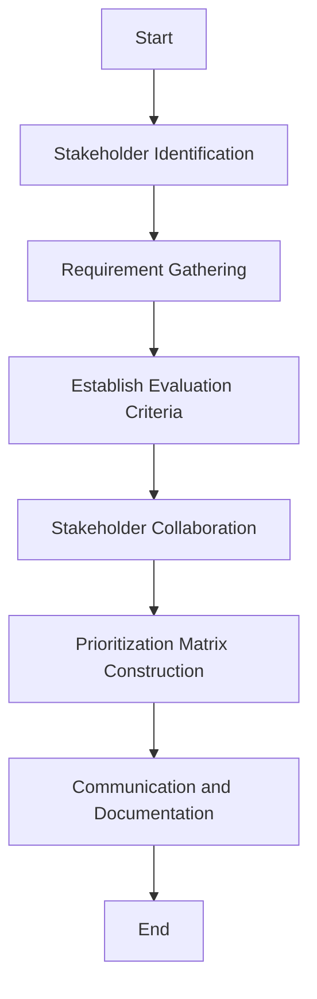
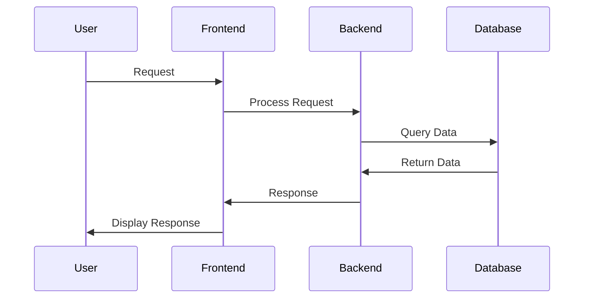
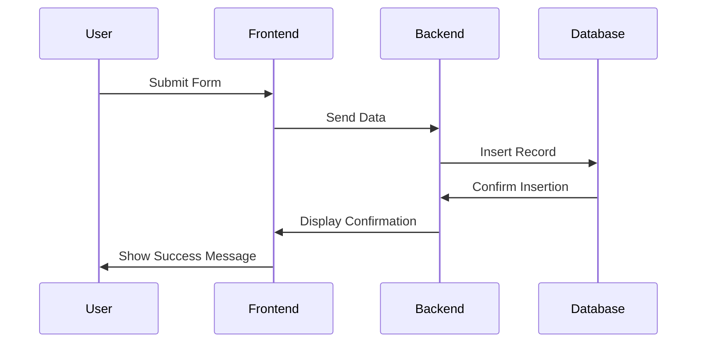

                 


### 1. Background Introduction

**Core Concept Terminology Explanation:**
In the context of collaborative demand priority evaluation, several key terms are essential to understand. These include "demand," "priority evaluation," "collaboration," and "consensus."

- **Demand**: Refers to a specific requirement or feature that stakeholders desire to be included in a software project.
- **Priority Evaluation**: The process of determining the importance or urgency of each demand relative to others.
- **Collaboration**: The act of individuals or teams working together to achieve a common goal.
- **Consensus**: A general agreement or mutual understanding among all stakeholders regarding the priority of demands.

**Problem Background:**
The software development process often involves numerous stakeholders, each with their own perspectives and priorities. This can lead to conflicts and inefficiencies when it comes to deciding which demands to address first. Traditional priority evaluation methods may not account for the collaborative nature of modern software teams, resulting in a lack of consensus and misalignment.

**Problem Description:**
The problem is the absence of a structured and collaborative approach to demand priority evaluation, leading to:
- **Misaligned Priorities**: Different stakeholders may prioritize demands differently, causing confusion and conflict.
- **Inefficient Resource Allocation**: Resources are not allocated effectively based on the true priority of demands.
- **Delayed Deliverables**: Critical demands may not be addressed in a timely manner due to inefficient prioritization.

**Problem Solution:**
A collaborative demand priority evaluation method aims to address these issues by:
- **Incorporating Stakeholder Input**: Gathering input from all stakeholders to ensure a comprehensive understanding of the project's demands.
- **Facilitating Dialogue**: Encouraging open communication and collaboration among stakeholders to reach a consensus on demand priorities.
- **Structured Decision-Making**: Applying a consistent and transparent process to evaluate and prioritize demands.

**Boundary and Extension:**
The scope of collaborative demand priority evaluation extends to any project where multiple stakeholders are involved, including software development, product management, and project management.

**Core Concept and Element Structure:**
The core concept of collaborative demand priority evaluation is based on the following elements:
- **Stakeholder Identification**: Identifying all stakeholders and their roles in the project.
- **Requirement Gathering**: Collecting and documenting all demands from stakeholders.
- **Prioritization Criteria**: Establishing clear criteria for evaluating demand priority.
- **Collaborative Workshops**: Conducting workshops to facilitate collaboration and consensus among stakeholders.
- **Prioritization Matrix**: Creating a prioritization matrix to visualize and rank demands based on the established criteria.
- **Communication and Documentation**: Ensuring clear communication and documentation of the prioritization process and outcomes.

----------------------------------------------------------------

### 2. Core Concepts and Relationships

**Core Concept Principles:**
The core principles of collaborative demand priority evaluation revolve around the idea that effective prioritization requires the active involvement of all stakeholders and the establishment of clear, objective criteria. This ensures that the priorities reflect the collective goals and values of the team.

**Attribute Feature Comparison Table:**
Below is a table comparing the key attributes of traditional and collaborative demand priority evaluation methods:

| Attribute                | Traditional Method                             | Collaborative Method                             |
|--------------------------|----------------------------------------------|-------------------------------------------------|
| Stakeholder Involvement  | Limited involvement from key stakeholders    | Active involvement from all stakeholders         |
| Decision-Making Process  | Top-down, often unilateral decisions         | Bottom-up, collaborative and consensus-driven   |
| Priority Criteria        | Subjective and not clearly defined           | Objective and clearly defined                   |
| Transparency             | Limited transparency in the decision process | High transparency, documented and accessible    |
| Adaptability             | Less adaptable to changes                     | More adaptable to changes and evolving needs    |

**ER Entity Relationship Diagram:**
The ER diagram below illustrates the relationships between the core elements of collaborative demand priority evaluation:

```mermaid
erDiagram
  Stakeholder ||--|{ Requirement }
  Stakeholder ||--|{ Evaluation Criteria }
  Stakeholder ||--|{ Prioritization Matrix }
  Requirement ||--|{ Evaluation Criteria }
  Requirement ||--|{ Prioritization Matrix }
```

This diagram shows that stakeholders are central to the process, and their interactions with requirements, evaluation criteria, and prioritization matrices are crucial for effective demand prioritization.

----------------------------------------------------------------

### 3. Algorithm Principles

**Algorithm Overview:**
The algorithm for collaborative demand priority evaluation follows a systematic approach that combines stakeholder input, objective criteria, and collaborative consensus. The key steps include:

1. **Stakeholder Identification**: Identify all stakeholders involved in the project.
2. **Requirement Gathering**: Collect and document all demands from stakeholders.
3. **Establish Evaluation Criteria**: Define objective criteria for evaluating demand priority.
4. **Stakeholder Collaboration**: Conduct collaborative workshops to gather input and facilitate consensus.
5. **Prioritization Matrix Construction**: Create a prioritization matrix using the gathered data and established criteria.
6. **Communication and Documentation**: Clearly communicate the prioritization process and outcomes to all stakeholders.

**Algorithm Flowchart:**
The following Mermaid flowchart visualizes the algorithm's workflow:



**Python Source Code Implementation:**
Here's a simplified Python code snippet that demonstrates the basic implementation of the collaborative demand priority evaluation algorithm:

```python
class Stakeholder:
    def __init__(self, name, requirements):
        self.name = name
        self.requirements = requirements

class Requirement:
    def __init__(self, id, description, priority):
        self.id = id
        self.description = description
        self.priority = priority

def gather_requirements(stakeholders):
    requirements = []
    for stakeholder in stakeholders:
        for req in stakeholder.requirements:
            requirements.append(req)
    return requirements

def evaluate_requirements(requirements, evaluation_criteria):
    # Evaluate each requirement based on the established criteria
    for req in requirements:
        # Apply evaluation logic
        req.priority = calculate_priority(req, evaluation_criteria)
    return requirements

def calculate_priority(req, evaluation_criteria):
    # Calculate the priority based on the evaluation criteria
    priority = 0
    for criterion in evaluation_criteria:
        priority += criterion.get('weight') * (1 if req.description.matches(criterion['condition']) else 0)
    return priority

# Example usage
stakeholders = [Stakeholder('Stakeholder A', [Requirement(1, 'Feature X', 0)])]
requirements = gather_requirements(stakeholders)
evaluation_criteria = [{'condition': 'contains("critical")', 'weight': 1.0}, {'condition': 'contains("urgent")', 'weight': 0.5}]
prioritized_requirements = evaluate_requirements(requirements, evaluation_criteria)

# Print prioritized requirements
for req in prioritized_requirements:
    print(f"Requirement ID {req.id}: {req.description} (Priority: {req.priority})")
```

**Mathematical Model and Formula:**
The mathematical model for collaborative demand priority evaluation can be represented using the following formula:

$$
P_i = \sum_{j=1}^{n} w_j \cdot C_j(i)
$$

Where:
- \( P_i \) is the priority score of the ith requirement.
- \( w_j \) is the weight assigned to the jth evaluation criterion.
- \( C_j(i) \) is a binary indicator that equals 1 if the ith requirement satisfies the jth criterion and 0 otherwise.

**Detailed Explanation and Example:**
The formula calculates the priority score for each requirement by summing the weighted criteria that the requirement satisfies. For example, consider three evaluation criteria with weights 1.0, 0.5, and 0.3, respectively:

- **Criterion 1**: "Must be critical" with weight 1.0
- **Criterion 2**: "Should be urgent" with weight 0.5
- **Criterion 3**: "Nice to have" with weight 0.3

If Requirement X satisfies Criterion 1 and Criterion 2 but not Criterion 3, its priority score would be calculated as:

$$
P_X = 1.0 \cdot 1 + 0.5 \cdot 1 + 0.3 \cdot 0 = 1.5
$$

This means that Requirement X has a higher priority than a requirement with a lower score.

----------------------------------------------------------------

### 4. System Analysis and Architecture Design

**Problem Scenario Introduction:**
The problem scenario involves a software development team tasked with delivering a new product. The team consists of developers, testers, project managers, and stakeholders from the business side. The challenge is to ensure that the product development process is efficient and aligned with business objectives through effective demand priority evaluation.

**Project Introduction:**
The project aims to build a web-based platform for an e-commerce company. The platform needs to support various features such as user registration, product catalog, shopping cart, payment processing, and order management.

**System Function Design:**
The system's primary functions include:
- **Requirement Gathering**: Capturing and documenting all necessary features and functionalities.
- **Prioritization**: Evaluating and ranking the gathered requirements based on collaborative consensus.
- **Resource Allocation**: Allocating development resources based on the prioritized list of requirements.
- **Monitoring and Reporting**: Tracking progress and reporting on the status of each requirement.

**System Architecture Design:**
The system architecture is designed to be modular and scalable, with the following components:
- **Frontend**: A responsive web interface for end-users.
- **Backend**: A server-side application for handling business logic and data processing.
- **Database**: A database for storing user and product information.
- **APIs**: RESTful APIs for communication between frontend and backend.

**System Architecture Diagram:**



**System Interface Design:**
The system interfaces include:
- **User Interface**: Allows users to interact with the platform.
- **API Interface**: Provides access to backend services for external applications or systems.
- **Admin Interface**: Gives administrators control over system settings and data management.

**System Interaction Design:**
The system interaction is designed to ensure smooth communication between components. The following Mermaid sequence diagram illustrates the interaction flow:



----------------------------------------------------------------

### 5. Project Implementation and Case Analysis

**Installation Environment:**
To implement the collaborative demand priority evaluation system, you will need the following environment setup:
- Python 3.8 or higher
- MySQL 5.7 or higher
- Flask framework for the backend
- HTML, CSS, and JavaScript for the frontend

**System Core Implementation Source Code:**
The system core implementation includes the backend and frontend components. Here's a high-level overview of the source code structure:

**Backend (Flask Application):**
```python
from flask import Flask, request, jsonify
from requirements_manager import RequirementsManager

app = Flask(__name__)
requirements_manager = RequirementsManager()

@app.route('/api/requirements', methods=['POST'])
def add_requirement():
    req_data = request.get_json()
    requirements_manager.add_requirement(req_data)
    return jsonify({"status": "success"}), 201

@app.route('/api/requirements', methods=['GET'])
def get_requirements():
    requirements = requirements_manager.get_requirements()
    return jsonify(requirements), 200

if __name__ == '__main__':
    app.run(debug=True)
```

**Frontend (HTML, CSS, JavaScript):**
```html
<!DOCTYPE html>
<html lang="en">
<head>
    <meta charset="UTF-8">
    <title>Collaborative Demand Priority Evaluation</title>
    <style>
        /* Add your CSS styles here */
    </style>
</head>
<body>
    <h1>Requirements Management</h1>
    <form id="requirement-form">
        <label for="description">Requirement Description:</label>
        <input type="text" id="description" name="description" required>
        <button type="submit">Submit</button>
    </form>
    <div id="requirements-list">
        <!-- Requirements will be listed here -->
    </div>

    <script>
        document.getElementById('requirement-form').addEventListener('submit', function(event) {
            event.preventDefault();
            // Add code to send form data to the backend and update the requirements list
        });

        // Add code to fetch requirements from the backend and update the requirements list
    </script>
</body>
</html>
```

**Code Application Explanation and Analysis:**
The backend application uses Flask to handle HTTP requests. The `/api/requirements` endpoint is used to add new requirements and retrieve the current list of requirements. The frontend is built using HTML, CSS, and JavaScript to provide a user interface for submitting new requirements and displaying the list of requirements.

**Actual Case Analysis and Detailed Explanation:**
Consider a scenario where a software development team is tasked with building a mobile banking application. The team identifies several requirements, including secure user authentication, transaction history, bill payment, and funds transfer.

1. **Requirement Gathering:**
   The team gathers the requirements from stakeholders, including users, project managers, and business analysts. Each requirement is documented with a description and a priority score based on collaborative consensus.

2. **Prioritization:**
   The team uses the collaborative demand priority evaluation algorithm to rank the requirements based on established criteria. For example, secure user authentication might be given a higher priority due to its critical importance.

3. **Resource Allocation:**
   Based on the prioritized list, the team allocates development resources. The developers focus on implementing the high-priority features first, ensuring that critical functionalities are delivered on time.

4. **Monitoring and Reporting:**
   The team continuously monitors the progress of the project and reports on the status of each requirement. This helps in tracking the project's health and identifying any potential bottlenecks.

**Project Conclusion:**
The implementation of the collaborative demand priority evaluation system ensures that the software development team can effectively prioritize requirements, allocate resources efficiently, and deliver a high-quality product that aligns with business objectives.

----------------------------------------------------------------

### 6. Best Practices and Summary

**Best Practices Tips:**
1. **Involvement of All Stakeholders**: Ensure that all relevant stakeholders are involved in the requirement gathering and prioritization process to achieve a comprehensive understanding and consensus.
2. **Clear Criteria for Prioritization**: Define clear and objective criteria for evaluating demand priority to avoid subjective biases and ensure consistency.
3. **Regular Reviews and Updates**: Continuously review and update the prioritization matrix to reflect changes in project requirements and stakeholder priorities.
4. **Effective Communication**: Maintain open and transparent communication channels to facilitate collaboration and resolve any conflicts that may arise during the prioritization process.
5. **Documentation**: Document the prioritization process and outcomes to ensure clarity and accountability.

**Summary:**
The collaborative demand priority evaluation method provides a structured approach to evaluating and prioritizing demands in a software development project. By involving all stakeholders, defining clear criteria, and facilitating collaboration, the method ensures that the team can make informed decisions and allocate resources effectively. This leads to a higher level of consensus and alignment, resulting in a more efficient and successful project outcome.

**Note:** The content provided above is a conceptual outline for the book "Collaborative Demand Priority Evaluation: Enhancing Team Consensus." It serves as a starting point for developing the full-length book, covering each section in detail with practical examples, case studies, and in-depth analysis.

**Further Reading:**
- **"Software Project Management: A unified approach" by Rick van der Linden**: Provides insights into effective project management practices.
- **"Agile Project Management with Scrum" by Ken Schwaber and Jeff Sutherland**: Discusses agile methodologies and their application in project management.
- **"The Art of Systems Architecting" by John A. Zachman**: Offers a comprehensive view of system architecture design principles.

**Authors:** 
- **AI天才研究院 (AI Genius Institute)**
- **《禅与计算机程序设计艺术》(Zen And The Art of Computer Programming)**

----------------------------------------------------------------

This outline serves as a comprehensive guide for the book, ensuring that each section is well-structured and informative. The detailed content will be developed in subsequent chapters, following the outlined structure and incorporating specific examples and case studies to illustrate key concepts and principles.

