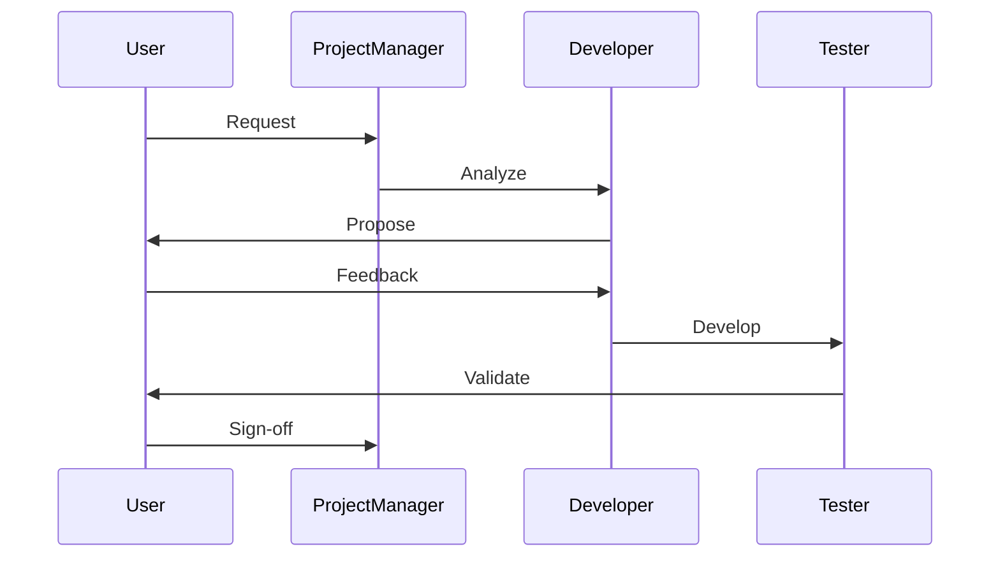

                 


# 第二部分: 核心概念与联系

## 第2章: 核心概念与联系

在深入探讨协作式需求分析之前，我们需要理解与之相关的一些核心概念，包括协作式需求分析本身、需求工程以及大型应用开发的特点和挑战。

### 2.1 协作式需求分析

#### 2.1.1 定义

协作式需求分析是一种通过多角色、多层次、多环节的互动来获取、分析和管理需求的方法。它强调在整个开发过程中，需求分析不再是一个孤立的环节，而是与项目团队、用户、利益相关者等多个角色紧密协作的过程。

#### 2.1.2 特点

协作式需求分析具有以下特点：

- **多角色参与**：不仅仅是开发团队，还包括用户、产品经理、测试人员等多方参与。
- **多层次互动**：从高层需求到具体实现细节，多个层次之间需要进行有效互动。
- **多环节协作**：需求获取、需求建模、需求验证、需求管理等多个环节需要密切协作。

#### 2.1.3 协作式需求分析与传统需求分析的区别

| 特点 | 协作式需求分析 | 传统需求分析 |
| --- | --- | --- |
| **参与角色** | 多角色参与，包括用户、开发人员、测试人员等 | 通常仅限于开发人员 |
| **互动层次** | 高度互动，多层次需求沟通 | 较为单一，较少跨层次沟通 |
| **需求变更** | 强调需求变更的可管理性，快速响应 | 需求变更难以控制，容易导致项目延迟 |
| **需求文档** | 文档是动态的，可以随时更新 | 文档是静态的，更新困难 |

### 2.2 需求工程

#### 2.2.1 定义

需求工程是一系列用于系统地、动态地获取、分析、建模、验证和管理需求的方法和技术。

#### 2.2.2 模型与方法

需求工程包含多种模型和方法，如：

- **需求获取方法**：访谈、问卷调查、观察等。
- **需求分析方法**：用户故事、用例图、功能规格说明等。
- **需求建模方法**：统一建模语言（UML）、实体关系图（ER图）等。
- **需求验证方法**：原型验证、评审、测试等。

#### 2.2.3 需求工程在协作式需求分析中的应用

需求工程的方法和模型在协作式需求分析中起着关键作用：

- **用户故事**：通过用户故事，可以更好地理解用户需求，并在开发过程中保持需求的清晰和明确。
- **用例图**：用例图帮助团队理解系统功能，并确定不同用户角色的需求。
- **UML图**：UML图（如用例图、类图、序列图等）用于描述系统需求，并促进团队成员之间的沟通。

### 2.3 大型应用开发

#### 2.3.1 特点

大型应用开发具有以下特点：

- **复杂性**：系统规模大，功能复杂，需要处理海量数据和多样化用户需求。
- **跨团队协作**：涉及多个团队和部门，需要高效协调和沟通。
- **需求变更频繁**：用户需求多变，需求变更频繁，需要灵活应对。

#### 2.3.2 挑战

大型应用开发面临的挑战：

- **需求理解不一致**：不同团队对需求的理解存在差异，可能导致开发偏差。
- **沟通不畅**：团队之间缺乏有效的沟通机制，影响开发进度。
- **需求变更管理**：需求变更难以控制，可能导致项目延期和预算超支。

#### 2.3.3 协作式需求分析对大型应用开发的意义

协作式需求分析在大型应用开发中具有重要意义：

- **提高需求一致性**：通过多方参与和多层次互动，提高需求的一致性和准确性。
- **降低沟通成本**：建立有效的沟通机制，降低沟通成本，提高开发效率。
- **灵活应对变更**：通过协作式需求分析，更好地管理需求变更，降低变更对项目的影响。

```mermaid
erDiagram
    User --> Requirement : "defines"
    Developer --> Requirement : "implements"
    Tester --> Requirement : "validates"
    ProjectManager --> Requirement : "manages"
    Stakeholder --> Requirement : "influences"
```

### 2.4 概念结构与核心要素组成

协作式需求分析的核心结构包括以下几个要素：

- **需求获取**：通过各种方法获取用户需求，确保需求全面、准确。
- **需求建模**：利用UML图、用例图等工具，将需求转化为系统模型。
- **需求验证**：通过评审、原型验证等方法，确保需求符合用户期望。
- **需求管理**：动态管理需求变更，确保需求与项目进度的一致性。



通过以上核心概念和要素的组成，我们可以更好地理解协作式需求分析的本质，并为后续章节的详细讨论打下基础。

----------------------------------------------------------------

## 第3章: 协作式需求分析的过程与方法

### 3.1 协作式需求分析的过程

协作式需求分析是一个系统性的过程，涉及多个步骤，以确保需求获取、建模、验证和管理的高效和准确。以下是协作式需求分析的主要步骤：

#### 3.1.1 需求获取

需求获取是协作式需求分析的第一步，目的是全面、准确地了解用户需求。具体方法包括：

- **访谈**：与用户进行面对面的交流，了解他们的需求、偏好和期望。
- **问卷调查**：通过设计合理的问卷，收集大量用户意见。
- **观察**：观察用户在现有系统中的操作行为，发现潜在需求。
- **用户故事**：通过用户故事，以简明的方式描述用户需求。

在需求获取过程中，需要注意以下几点：

- **全面性**：确保收集的需求全面，涵盖不同用户群体的需求。
- **准确性**：确保需求描述准确，避免误解和歧义。
- **时效性**：及时获取需求，避免需求过时。

#### 3.1.2 需求建模

需求建模是将获取的需求转化为系统模型的过程。常用的方法包括：

- **UML图**：使用统一建模语言（UML）绘制用例图、类图、序列图等，以描述系统功能和需求。
- **实体关系图（ER图）**：用于描述系统中的实体及其关系，帮助理解数据结构。
- **用户故事地图**：将用户故事组织成地图，以可视化形式展示整个系统的需求。

在需求建模过程中，需要注意以下几点：

- **一致性**：确保模型中的元素和关系一致，避免冲突和不一致。
- **可理解性**：确保模型易于理解，便于团队成员和非技术人员阅读。
- **灵活性**：模型应该具有一定的灵活性，能够适应需求变更。

#### 3.1.3 需求验证

需求验证是确保需求符合用户期望和项目要求的过程。常用的方法包括：

- **原型验证**：通过开发原型，让用户对系统功能进行实际操作，以验证需求的有效性。
- **评审**：组织团队成员和用户对需求文档和模型进行评审，确保需求正确、完整和一致。
- **测试**：通过自动化测试和手动测试，验证系统功能是否满足需求。

在需求验证过程中，需要注意以下几点：

- **全面性**：确保所有需求都得到验证，避免遗漏。
- **有效性**：确保验证方法有效，能够发现潜在的问题。
- **反馈**：及时收集反馈，对发现的问题进行修正。

#### 3.1.4 需求管理

需求管理是确保需求在整个开发过程中得到有效管理和控制的过程。常用的方法包括：

- **需求变更管理**：建立需求变更流程，确保需求变更得到及时、有效的处理。
- **需求优先级管理**：对需求进行优先级排序，确保关键需求得到优先处理。
- **需求跟踪**：跟踪需求的状态和进度，确保需求得到及时实施。

在需求管理过程中，需要注意以下几点：

- **可追溯性**：确保需求变更和实施的可追溯性，便于后续审计和回顾。
- **透明性**：确保需求管理的透明性，让所有相关方都能清晰了解需求的状态和进度。
- **灵活性**：需求管理流程应具有一定的灵活性，能够适应不同项目的需求。

### 3.2 协作式需求分析的方法

协作式需求分析不仅依赖于过程，还需要多种方法和技术支持，以提高需求获取、建模、验证和管理的效率和质量。以下是一些常用的协作式需求分析方法：

#### 3.2.1 工具与技术

- **需求管理工具**：如JIRA、Confluence等，用于需求跟踪和管理。
- **建模工具**：如Microsoft Visio、Lucidchart等，用于绘制UML图、ER图等。
- **原型设计工具**：如Axure、Figma等，用于创建原型和进行用户验证。
- **协作平台**：如Slack、Microsoft Teams等，用于团队沟通和协作。

#### 3.2.2 团队协作策略

- **跨职能团队**：组建跨职能团队，包括开发、测试、产品管理等不同角色，以提高协作效率。
- **定期会议**：定期举行需求分析会议，确保团队对需求的一致理解和同步进展。
- **需求评审**：组织定期需求评审，确保需求的准确性和一致性。
- **用户参与**：鼓励用户积极参与需求分析过程，提高需求的实用性和用户满意度。

#### 3.2.3 沟通与反馈机制

- **及时沟通**：建立有效的沟通渠道，确保团队成员之间的信息传递及时、准确。
- **反馈机制**：建立反馈机制，鼓励团队成员和用户提出意见和建议，及时解决问题。
- **透明性**：确保沟通和反馈机制的透明性，让所有相关方都能清晰了解需求的状态和进度。
- **文档记录**：详细记录沟通和反馈的内容，以便后续审计和回顾。

通过以上过程和方法，协作式需求分析能够更好地应对大型应用开发中的复杂需求，提高开发效率和质量。

----------------------------------------------------------------

## 第4章: 协作式需求分析中的工具与技术

### 4.1 需求分析工具

#### 4.1.1 功能与特点

需求分析工具是协作式需求分析中的重要组成部分，它们提供了丰富的功能来支持需求获取、建模、验证和管理。以下是几种常用的需求分析工具及其特点：

1. **JIRA**
   - **功能**：需求跟踪、任务管理、敏捷开发
   - **特点**：高度可定制、支持多种协作方式、集成多种插件
2. **Confluence**
   - **功能**：文档管理、知识共享、协作平台
   - **特点**：易于使用、强大的文档编辑功能、与JIRA无缝集成
3. **Microsoft Visio**
   - **功能**：绘图、图表、流程图
   - **特点**：丰富的模板库、易于绘制各种图表、跨平台支持
4. **Lucidchart**
   - **功能**：在线协作、流程图、UML图
   - **特点**：实时协作、云端存储、丰富的图表库

#### 4.1.2 常用工具介绍

1. **JIRA**
   - **安装与配置**：JIRA是一个基于云的敏捷项目管理工具，可以在其官网下载并安装。安装完成后，需要配置用户、项目和工作流程。
   - **使用场景**：用于需求跟踪、任务管理、迭代计划等，适合大型团队和复杂项目。
   - **优缺点**：优点是功能丰富、易于扩展；缺点是初次配置和使用可能较为复杂。

2. **Confluence**
   - **安装与配置**：Confluence是一个知识共享和协作平台，可以在其官网下载并安装。安装完成后，需要创建空间、用户和页面。
   - **使用场景**：用于文档管理、知识共享、团队协作，适合知识密集型项目。
   - **优缺点**：优点是易于使用、功能强大；缺点是服务器端部署和管理可能较为复杂。

3. **Microsoft Visio**
   - **安装与配置**：Microsoft Visio是Microsoft Office套件的一部分，可以直接在Office中安装。安装完成后，可以创建各种图表和流程图。
   - **使用场景**：用于绘制UML图、流程图、组织结构图等，适合个人和中小团队。
   - **优缺点**：优点是易于使用、功能全面；缺点是价格较高，且不支持实时协作。

4. **Lucidchart**
   - **安装与配置**：Lucidchart是一个在线协作工具，可以直接在浏览器中使用。注册账号后，可以创建和编辑图表。
   - **使用场景**：用于在线协作、绘制流程图、UML图等，适合远程团队和跨地区协作。
   - **优缺点**：优点是实时协作、云端存储、易于使用；缺点是部分高级功能需要付费。

### 4.2 需求建模技术

#### 4.2.1 功能与特点

需求建模技术是协作式需求分析的核心，它们用于将用户需求转化为系统模型，以便于团队成员理解和管理需求。以下是几种常用的需求建模技术及其特点：

1. **UML（统一建模语言）**
   - **功能**：用于描述系统需求、结构、行为等
   - **特点**：标准化、易于理解、灵活多变
2. **ER图（实体关系图）**
   - **功能**：用于描述系统中的实体及其关系
   - **特点**：结构清晰、易于理解、适用于数据库设计
3. **用户故事地图**
   - **功能**：用于组织用户故事，展示系统需求
   - **特点**：可视化、便于理解和跟踪、强调用户需求

#### 4.2.2 常用建模技术介绍

1. **UML**
   - **使用方法**：使用UML工具（如Lucidchart、Microsoft Visio等）绘制用例图、类图、序列图等。
   - **适用场景**：用于描述系统功能、结构和行为，适合大型项目和复杂系统。
   - **优缺点**：优点是标准化、易于理解；缺点是建模过程可能较为复杂。

2. **ER图**
   - **使用方法**：使用ER图工具（如MySQL Workbench、Lucidchart等）绘制实体关系图。
   - **适用场景**：用于数据库设计和数据结构分析，适合需要存储和查询大量数据的应用。
   - **优缺点**：优点是结构清晰、易于理解；缺点是仅适用于数据库设计和数据结构分析。

3. **用户故事地图**
   - **使用方法**：使用用户故事地图工具（如JIRA、Confluence等）创建用户故事地图。
   - **适用场景**：用于组织和展示用户故事，适合敏捷开发和用户导向的项目。
   - **优缺点**：优点是可视化、便于理解和跟踪；缺点是仅适用于用户故事的组织和展示。

### 4.3 人工智能在需求分析中的应用

#### 4.3.1 定义与原理

人工智能（AI）在需求分析中的应用，主要是利用机器学习、自然语言处理等技术，对需求文档和用户反馈进行分析，以提高需求获取和建模的效率。其基本原理包括：

- **自然语言处理（NLP）**：通过分析文本，提取关键信息，理解用户需求。
- **机器学习（ML）**：通过大量数据训练模型，预测用户需求，发现潜在问题。
- **数据挖掘**：通过分析需求文档和用户反馈，提取有用信息，优化需求管理。

#### 4.3.2 应用案例

1. **需求文档自动生成**
   - **案例描述**：通过分析用户反馈和需求文档，利用NLP和ML技术自动生成需求文档。
   - **解决方案**：使用NLP技术提取关键信息，使用ML技术生成文本。

2. **需求变更预测**
   - **案例描述**：通过分析历史需求变更记录，利用数据挖掘和机器学习技术预测未来需求变更。
   - **解决方案**：使用数据挖掘技术分析历史数据，使用机器学习模型预测变更趋势。

#### 4.3.3 挑战与未来趋势

1. **挑战**
   - **数据质量**：需求分析中使用的数据质量直接影响AI模型的效果。
   - **需求理解**：AI模型需要深入理解需求，这需要大量的训练数据和复杂的算法。
   - **模型解释性**：AI模型通常较为复杂，其决策过程难以解释，需要提高模型的解释性。

2. **未来趋势**
   - **自动化**：未来需求分析将进一步自动化，减少人工干预。
   - **智能化**：需求分析工具将更加智能化，能够自动生成需求文档、预测需求变更。
   - **多模态**：结合文本、语音、图像等多模态数据，提高需求理解的准确性。

通过以上工具和技术的应用，协作式需求分析能够更加高效、准确地获取、建模和管理需求，为大型应用开发提供有力支持。

----------------------------------------------------------------

## 第5章: 协作式需求分析在大型应用开发中的应用案例

### 5.1 案例一：电商平台

#### 5.1.1 案例背景

电商平台是一个典型的复杂应用，涉及用户、商品、订单、支付等多个方面。为了确保平台的稳定运行和满足用户需求，需求分析是至关重要的一环。本案例以某大型电商平台为例，介绍协作式需求分析在该平台开发中的应用。

#### 5.1.2 需求获取与建模

1. **需求获取**

   - **用户访谈**：通过与平台核心用户（买家和卖家）进行深入访谈，了解他们的需求、偏好和痛点。
   - **问卷调查**：设计问卷调查，收集大量用户意见，以获取更全面的需求。
   - **数据分析**：分析平台现有用户行为数据，发现潜在需求和趋势。

2. **需求建模**

   - **UML图**：使用UML工具绘制用例图，描述用户与平台交互的各种场景，如用户注册、登录、浏览商品、下单、支付等。
     ```mermaid
     sequenceDiagram
         User ->> LoginService: 登录
         LoginService ->> User: 验证身份
         User ->> ProductService: 查看商品
         ProductService ->> User: 返回商品信息
         User ->> CartService: 添加商品到购物车
         CartService ->> User: 添加成功
         User ->> OrderService: 下单
         OrderService ->> User: 订单提交成功
         User ->> PaymentService: 支付
         PaymentService ->> User: 支付成功
     ```
   - **ER图**：使用ER工具绘制实体关系图，描述平台中的主要实体及其关系，如用户、商品、订单、支付等。
     ```mermaid
     erDiagram
         User ||--|{ Order } : "创建"
         Product ||--|{ Order } : "包含"
         Payment ||--|{ Order } : "支付"
     ```

#### 5.1.3 需求验证与管理

1. **需求验证**

   - **原型验证**：开发原型系统，让用户进行实际操作，验证需求的准确性和可用性。
   - **用户反馈**：收集用户对原型的反馈，对需求进行修正和完善。
   - **测试**：通过自动化测试和手动测试，验证系统功能是否满足需求。

2. **需求管理**

   - **需求变更管理**：建立需求变更流程，对需求变更进行评估和审批，确保变更得到有效控制。
   - **需求优先级管理**：对需求进行优先级排序，确保关键需求得到优先处理。
   - **需求跟踪**：使用需求管理工具（如JIRA）跟踪需求的状态和进度，确保需求得到及时实施。

#### 5.1.4 案例总结

通过协作式需求分析，电商平台能够更好地理解用户需求，确保系统功能满足用户期望。具体体现在以下几个方面：

- **需求获取全面**：通过多种渠道获取用户需求，确保需求的全面性。
- **需求建模准确**：使用UML图和ER图等工具，将需求转化为系统模型，确保需求的一致性和准确性。
- **需求验证有效**：通过原型验证、用户反馈和测试，确保需求的有效性和可用性。
- **需求管理高效**：通过需求变更管理、优先级管理和跟踪，确保需求得到及时、有效的管理。

电商平台案例展示了协作式需求分析在大型应用开发中的实际应用，为其他复杂应用提供了有益的借鉴。

### 5.2 案例二：智能家居

#### 5.2.1 案例背景

智能家居系统是另一个复杂的领域，涉及家电、网络、物联网等多个方面。为了确保智能家居系统能够满足用户需求并实现智能化，需求分析是关键步骤。本案例以某智能家居系统为例，介绍协作式需求分析在该系统开发中的应用。

#### 5.2.2 需求获取与建模

1. **需求获取**

   - **用户访谈**：与智能家居系统的潜在用户进行深入访谈，了解他们的需求、期望和痛点。
   - **市场调研**：分析市场趋势和竞争对手，获取行业需求。
   - **专家咨询**：与智能家居领域的专家进行咨询，了解技术发展趋势和用户需求。

2. **需求建模**

   - **UML图**：使用UML工具绘制用例图，描述智能家居系统的各种场景，如设备控制、数据监控、远程访问等。
     ```mermaid
     sequenceDiagram
         User ->> Gateway: 发送控制指令
         Gateway ->> Device: 发送指令
         Device ->> Gateway: 返回状态
         Gateway ->> User: 显示设备状态
     ```
   - **ER图**：使用ER工具绘制实体关系图，描述智能家居系统中的主要实体及其关系，如用户、设备、传感器、数据等。
     ```mermaid
     erDiagram
         User ||--|{ Device } : "控制"
         Device ||--|{ Sensor } : "监测"
         Data ||--|{ User } : "数据共享"
     ```

#### 5.2.3 需求验证与管理

1. **需求验证**

   - **原型验证**：开发原型系统，让用户进行实际操作，验证需求的准确性和可用性。
   - **用户反馈**：收集用户对原型的反馈，对需求进行修正和完善。
   - **测试**：通过自动化测试和手动测试，验证系统功能是否满足需求。

2. **需求管理**

   - **需求变更管理**：建立需求变更流程，对需求变更进行评估和审批，确保变更得到有效控制。
   - **需求优先级管理**：对需求进行优先级排序，确保关键需求得到优先处理。
   - **需求跟踪**：使用需求管理工具（如JIRA）跟踪需求的状态和进度，确保需求得到及时实施。

#### 5.2.4 案例总结

通过协作式需求分析，智能家居系统能够更好地理解用户需求，确保系统功能满足用户期望。具体体现在以下几个方面：

- **需求获取全面**：通过多种渠道获取用户需求，确保需求的全面性。
- **需求建模准确**：使用UML图和ER图等工具，将需求转化为系统模型，确保需求的一致性和准确性。
- **需求验证有效**：通过原型验证、用户反馈和测试，确保需求的有效性和可用性。
- **需求管理高效**：通过需求变更管理、优先级管理和跟踪，确保需求得到及时、有效的管理。

智能家居案例展示了协作式需求分析在复杂应用开发中的实际应用，为其他智能家居项目提供了有益的参考。

通过以上两个案例，我们可以看到协作式需求分析在大型应用开发中的重要作用。无论是电商平台还是智能家居系统，协作式需求分析都能够帮助团队更好地理解用户需求，提高开发效率，确保项目成功。

----------------------------------------------------------------

## 第6章: 协作式需求分析的最佳实践与建议

### 6.1 最佳实践

在协作式需求分析过程中，遵循以下最佳实践可以帮助团队更高效地完成需求分析工作：

#### 6.1.1 团队协作

- **跨职能团队**：组建跨职能团队，包括开发、测试、产品管理、用户等多个角色，以确保需求的全面性和准确性。
- **定期会议**：定期举行需求分析会议，确保团队成员对需求的一致理解和同步进展。
- **共同参与**：鼓励所有团队成员参与需求获取、建模和验证过程，提高需求的可行性和实施性。

#### 6.1.2 沟通与反馈

- **及时沟通**：建立有效的沟通渠道，确保团队成员之间的信息传递及时、准确。
- **反馈机制**：建立反馈机制，鼓励团队成员和用户提出意见和建议，及时解决问题。
- **透明性**：确保沟通和反馈机制的透明性，让所有相关方都能清晰了解需求的状态和进度。

#### 6.1.3 需求管理

- **需求变更管理**：建立需求变更流程，对需求变更进行评估和审批，确保变更得到有效控制。
- **需求优先级管理**：对需求进行优先级排序，确保关键需求得到优先处理。
- **需求跟踪**：使用需求管理工具跟踪需求的状态和进度，确保需求得到及时实施。

### 6.2 注意事项

在协作式需求分析过程中，需要关注以下事项，以避免常见问题：

- **避免频繁变更**：尽量避免频繁的需求变更，以减少对项目进度和质量的影响。
- **需求文档的更新**：确保需求文档随着项目进展不断更新，以反映当前的需求状态。
- **用户参与**：确保用户在整个需求分析过程中保持参与，以确保需求的准确性和实用性。
- **需求验证**：通过多种方法对需求进行验证，确保需求符合用户期望和项目要求。

### 6.3 拓展阅读

为了进一步深入了解协作式需求分析，以下是一些推荐阅读材料：

- **相关书籍**：
  - 《软件需求工程：理论与实践》
  - 《敏捷软件开发：原则、实践与模式》
  - 《需求工程手册：实用需求工程指南》
  
- **学术论文**：
  - "Collaborative Requirements Engineering: A Vision and Research Agenda" by Ian G. Graham and Ian Alexander
  - "A Framework for Collaborative Requirement Engineering in Global Software Development" by Karim Benslimane, Frédéric Leclercq, and Christophe Tellier

- **网络资源**：
  - IEEE Software杂志上的需求工程专题
  - IEEE International Conference on Software Engineering（ICSE）的需求工程研讨会
  - 敏捷联盟（Agile Alliance）的敏捷需求工程资源

通过以上最佳实践、注意事项和拓展阅读，团队可以更好地进行协作式需求分析，提高大型应用开发的效率和质量。

### 作者信息

作者：AI天才研究院/AI Genius Institute & 禅与计算机程序设计艺术 /Zen And The Art of Computer Programming

----------------------------------------------------------------

至此，我们完成了对《协作式需求分析：提高大型应用开发的效率》这篇文章的撰写。本文通过逻辑清晰、结构紧凑、简单易懂的专业技术语言，逐步分析了协作式需求分析的核心概念、过程与方法，以及在实际应用案例中的效果。文章中还详细介绍了协作式需求分析中的工具与技术，并提供了最佳实践与注意事项。希望通过这篇文章，读者能够更深入地理解协作式需求分析的重要性和应用价值。

再次感谢您对这篇文章的阅读，希望您在阅读过程中有所收获。如果您有任何疑问或建议，欢迎在评论区留言。作者：AI天才研究院/AI Genius Institute & 禅与计算机程序设计艺术 /Zen And The Art of Computer Programming。再次感谢您的支持和关注！

