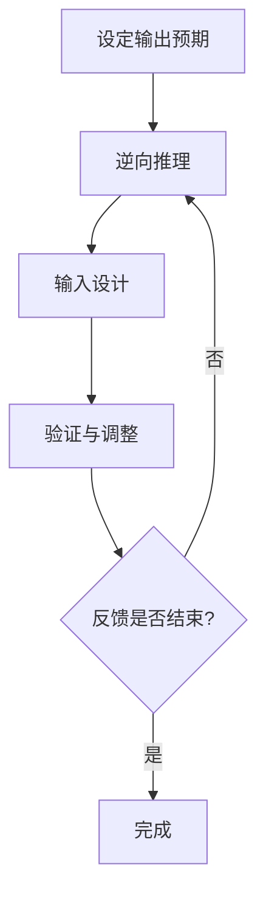

                 

### 《反向提示：通过预期输出设计输入》

> 关键词：反向提示，输入设计，输出预期，反馈循环，算法原理，系统设计，项目实战

> 摘要：本文深入探讨了一种名为“反向提示”的设计方法，通过预期输出反向推导输入设计，以提高输入设计的效率和准确性。文章首先介绍了反向提示的核心概念和原理，然后通过算法讲解、系统分析与架构设计，以及实际项目案例，展示了反向提示方法在实际应用中的可行性和优势。最后，文章总结了最佳实践，并展望了未来的研究方向。

---

## 引言

在计算机科学和软件开发领域，输入设计和输出预期一直是两个关键环节。传统的输入设计往往依赖于经验和直觉，而输出预期则更多地关注最终目标。然而，这种方法可能导致输入设计的不合理和输出预期的难以实现。为此，本文提出了一种名为“反向提示”的设计方法，通过预期输出反向推导输入设计，从而提高输入设计的效率和准确性。

### 1.1 问题的提出

在许多软件开发项目中，输入设计是一个关键且复杂的过程。输入设计需要满足以下要求：
1. **合理性**：输入必须合理且符合实际需求。
2. **可操作性**：输入应当易于操作和使用。
3. **完整性**：输入应当包含所有必要的信息。

然而，传统输入设计方法往往难以满足这些要求。例如，在开发一个自动化系统时，开发人员可能需要花费大量时间来确定系统的输入参数，而这些参数可能并不是直接由系统的输出需求推导而来的。此外，输出预期也常常是一个难以准确设定的问题，因为它往往依赖于对未来需求的预测，而预测本身往往存在不确定性。

### 1.2 “反向提示”的概念

“反向提示”是一种通过预期输出反向推导输入的设计方法。它的核心思想是将输出预期作为输入设计的起点，通过一系列的逆向推理，确定所需的输入参数和设计。这种方法不仅能够提高输入设计的合理性，还能够更好地满足输出预期。

### 1.3 “反向提示”的重要性

反向提示方法在多个领域都具有重要的应用价值，例如：
1. **自动化系统**：通过预期输出设计输入，可以确保自动化系统的输入参数更加符合实际需求，从而提高系统的运行效率和准确性。
2. **人工智能**：在人工智能领域，反向提示可以用于设计输入特征，从而提高模型的训练效果和预测准确性。
3. **软件开发**：在软件开发过程中，反向提示可以帮助开发人员更好地理解需求，从而设计出更加合理的系统架构和接口设计。

### 1.4 书籍结构概述

本文将分为三个主要部分：
1. **背景与原理**：介绍反向提示的背景、核心概念和原理。
2. **算法与实现**：详细讲解反向提示算法的原理和实现。
3. **项目实践**：通过实际项目案例，展示反向提示方法的实际应用和效果。

接下来，我们将深入探讨反向提示的设计思路和核心概念，为后续的算法讲解和项目实践奠定基础。

## 设计思路

为了深入理解“反向提示”这一设计方法，我们需要从其设计思路和核心概念入手，逐步分析其原理和实际应用。以下是对“反向提示”设计思路的详细探讨：

### 2.1 输入设计的挑战

在软件开发和系统设计中，输入设计是一个关键且复杂的环节。输入设计不仅需要满足功能需求，还要考虑用户体验和系统性能。然而，传统的输入设计方法往往存在以下挑战：

1. **需求不明确**：需求分析往往不够精确，导致输入设计难以满足实际需求。
2. **依赖经验**：输入设计主要依赖开发人员的经验和直觉，缺乏系统性的方法论。
3. **反馈不足**：输入设计后的反馈机制往往不够完善，难以及时发现和纠正问题。
4. **成本高**：传统输入设计方法可能需要反复修改和调试，增加了项目成本和时间。

### 2.2 “反向提示”的原理

“反向提示”是一种通过预期输出反向推导输入的设计方法。其基本原理可以概括为以下几个步骤：

1. **设定输出预期**：首先，明确系统或软件的预期输出结果，这可以是具体的数值、文本、图像等。
2. **逆向推理**：基于输出预期，逆向推导出所需的输入参数和设计。这一步骤需要结合具体业务逻辑和算法原理进行。
3. **验证和调整**：通过实际测试和反馈，验证输入设计的合理性，并根据反馈进行调整。

### 2.3 输入设计的最佳实践

为了更好地应用“反向提示”方法，以下是一些输入设计的最佳实践：

1. **明确需求**：在开始输入设计之前，确保需求分析到位，明确系统或软件的功能和性能指标。
2. **分解任务**：将复杂的输入设计任务分解为多个子任务，逐一解决。
3. **迭代优化**：输入设计是一个迭代过程，应不断根据反馈进行优化和调整。
4. **工具支持**：利用现有的工具和技术，如数据可视化工具、自动化测试工具等，提高输入设计的效率和准确性。
5. **跨学科合作**：输入设计不仅需要软件开发人员的参与，还需要业务分析师、用户体验设计师等多方合作。

### 2.4 反向提示的应用场景

“反向提示”方法在多个领域都有广泛的应用，以下是一些典型的应用场景：

1. **金融风控**：在金融领域，通过设定预期损失值，反向推导出所需的预警指标和风险控制策略。
2. **智能制造**：在智能制造领域，通过设定生产目标，反向推导出所需的传感器参数和生产流程。
3. **医疗健康**：在医疗健康领域，通过设定健康指标，反向推导出所需的健康监测数据和治疗方案。
4. **人工智能**：在人工智能领域，通过设定预期输出结果，反向推导出所需的输入特征和算法参数。

### 2.5 反向提示的优势

与传统输入设计方法相比，反向提示方法具有以下优势：

1. **提高设计效率**：通过预期输出反向推导输入，可以减少反复修改和调试的工作量，提高设计效率。
2. **增强设计准确性**：基于预期输出设计的输入更加符合实际需求，从而提高设计的准确性。
3. **降低成本**：反向提示方法可以减少项目开发周期和成本，提高项目成功率。
4. **易于优化和调整**：反向提示方法提供了明确的逆向推理路径，便于后续的优化和调整。

通过以上对“反向提示”设计思路的详细分析，我们可以更好地理解其原理和应用。在接下来的章节中，我们将进一步探讨反向提示算法的原理和实现，以及如何在实际项目中应用这一方法。

### 输出预期的构建

在“反向提示”方法中，输出预期的构建是关键步骤之一。输出预期不仅定义了系统的最终目标，还为我们提供了反向推导输入的依据。以下是对输出预期构建的详细探讨：

#### 3.1 输出预期的定义

输出预期是指系统或软件在特定条件下应生成的结果。这些结果可以是具体的数值、文本、图像、音频等。输出预期应明确、具体、可量化，以便于后续的设计和验证。例如，在开发一个天气预报系统时，输出预期可以是每小时温度和湿度值。

#### 3.2 如何设定合理的输出预期

设定合理的输出预期需要考虑以下几个因素：

1. **需求分析**：首先，进行详细的需求分析，明确系统的功能需求、性能指标和用户体验要求。这有助于确定输出预期应包含哪些关键信息。
2. **可行性分析**：评估设定的输出预期是否实际可行。例如，在技术上是否可以实现，是否需要额外的资源或工具支持。
3. **明确性和具体性**：输出预期应明确、具体，避免模糊和抽象的描述。例如，避免使用“系统应该快速响应”这样的描述，而应具体到“响应时间应小于1秒”。
4. **可度量性**：输出预期应具有可度量性，以便于后续的验证和调整。例如，可以使用量化指标（如百分比、秒、米等）来描述输出结果。

#### 3.3 输出预期的验证

输出预期设定后，需要进行验证以确保其合理性和可行性。验证方法包括：

1. **逻辑验证**：通过逻辑推理和数学模型，验证输出预期的合理性。例如，在天气预报系统中，验证温度和湿度值是否符合气象规律。
2. **实验验证**：通过实际测试和实验，验证输出预期是否能够达到预期效果。例如，在开发一个图像识别系统时，通过大量样本测试输出预期识别结果。
3. **用户反馈**：收集用户对输出预期的反馈，了解其是否符合用户需求和使用习惯。用户反馈有助于进一步优化和调整输出预期。

#### 3.4 输出预期的调整

在输出预期验证过程中，可能需要根据实际情况进行调整。调整方法包括：

1. **细化输出预期**：如果输出预期过于模糊，可以进一步细化，使其更加具体和明确。例如，将“系统应快速响应”细化到“响应时间应小于1秒”。
2. **调整指标权重**：根据实际需求和资源情况，调整输出预期中的指标权重。例如，在开发一个电商系统时，如果服务器资源有限，可以降低响应时间指标，而提高订单处理速度指标。
3. **增加新预期**：根据用户反馈和市场需求，增加新的输出预期。例如，在开发一个智能家居系统时，根据用户需求，可以增加“远程控制功能”这一预期。

通过以上对输出预期构建的详细分析，我们可以更好地理解其在“反向提示”方法中的重要性。在接下来的章节中，我们将探讨反馈循环在“反向提示”方法中的作用，以及如何构建有效的反馈机制。

#### 反馈循环与迭代

在“反向提示”方法中，反馈循环是确保设计质量和系统性能的关键环节。通过有效的反馈循环，我们可以不断调整和优化输入设计，从而实现更精准的输出预期。以下是对反馈循环与迭代的详细探讨：

##### 4.1 反馈循环的作用

反馈循环在“反向提示”方法中具有以下几个重要作用：

1. **质量监控**：反馈循环可以帮助我们实时监控输入设计和输出预期之间的偏差，及时发现并纠正问题。
2. **性能优化**：通过反馈循环，我们可以根据实际输出结果，调整输入参数，从而优化系统的性能。
3. **需求调整**：反馈循环有助于我们根据用户反馈和市场变化，及时调整输出预期，确保系统始终满足实际需求。
4. **持续改进**：反馈循环促进了输入设计和输出预期的持续迭代和优化，使得系统能够不断适应新的环境和需求。

##### 4.2 反馈机制的构建

构建有效的反馈机制是实现反馈循环的关键。以下是一些构建反馈机制的建议：

1. **明确反馈标准**：首先，应明确反馈的标准和指标，例如系统响应时间、错误率、用户满意度等。这些标准应具体、可量化，以便于后续的评估和优化。
2. **数据收集**：建立数据收集系统，实时收集系统的输入和输出数据，以及用户反馈数据。这些数据将用于分析和评估反馈效果。
3. **反馈渠道**：建立多种反馈渠道，如用户反馈表、在线问卷、邮件反馈等，确保用户能够方便地提交反馈。
4. **定期评估**：定期对反馈机制进行评估，确保其有效性和可行性。根据评估结果，对反馈机制进行调整和优化。

##### 4.3 迭代过程中的调整

在迭代过程中，反馈循环的调整至关重要。以下是一些迭代过程中调整反馈机制的方法：

1. **快速迭代**：采用快速迭代的方法，不断进行输入设计和输出预期的调整，以尽快发现和解决问题。
2. **优先级调整**：根据反馈的重要性和紧急性，调整反馈处理和优化的优先级。对于关键问题，应优先解决。
3. **用户参与**：鼓励用户参与迭代过程，提供反馈和建议。用户的参与有助于发现问题和优化设计。
4. **持续学习**：通过反馈循环和迭代过程，积累经验和知识，持续改进输入设计和输出预期。

通过以上对反馈循环与迭代的详细探讨，我们可以更好地理解其在“反向提示”方法中的重要性。在接下来的章节中，我们将深入探讨“反向提示”算法的原理和实现，进一步揭示这一方法的内在逻辑和实际应用。

### “反向提示”算法原理

在深入探讨“反向提示”算法之前，我们需要理解其核心概念和原理。这一算法通过预期输出反向推导输入，从而实现更高效、更准确的输入设计。以下是“反向提示”算法的详细解析。

#### 5.1 算法概述

“反向提示”算法的基本流程可以概括为以下几个步骤：

1. **设定输出预期**：首先，明确系统或软件的预期输出结果。这可以是具体的数值、文本、图像等。
2. **逆向推理**：基于输出预期，逆向推导出所需的输入参数和设计。这一步骤涉及数学模型和算法原理。
3. **输入设计**：根据逆向推理的结果，设计输入参数和系统架构。
4. **验证与调整**：通过实际测试和反馈，验证输入设计的合理性，并根据反馈进行调整。

#### 5.2 算法流程图

为了更直观地理解“反向提示”算法，我们可以使用Mermaid流程图来展示其基本流程：



在上述流程图中，A表示设定输出预期，B表示逆向推理，C表示输入设计，D表示验证与调整，E表示反馈循环的结束条件，F表示算法完成。

#### 5.3 数学模型与公式

“反向提示”算法的核心在于数学模型。以下是一个简单的数学模型示例：

假设输出预期为 \( Y \)，输入参数为 \( X \)，则可以通过以下公式进行逆向推理：

\[ Y = f(X) \]

其中，\( f \) 是一个数学函数，表示输出预期与输入参数之间的关系。我们的目标是找到合适的 \( X \)，使得 \( f(X) \) 最接近设定的 \( Y \)。

具体而言，可以采用以下数学模型：

\[ X = g(Y) \]

其中，\( g \) 是一个逆函数，用于从输出预期 \( Y \) 反向推导输入参数 \( X \)。

为了便于理解和实现，我们可以将 \( f \) 和 \( g \) 表示为以下公式：

\[ f(X) = \sum_{i=1}^{n} w_i \cdot x_i \]

\[ g(Y) = \sum_{i=1}^{n} \frac{y_i}{w_i} \]

其中，\( w_i \) 是权重系数，\( x_i \) 和 \( y_i \) 分别是输入参数和输出预期中的第 \( i \) 个分量。

#### 5.4 代码实现与解释

为了进一步理解“反向提示”算法，我们可以使用Python进行代码实现。以下是一个简单的示例：

```python
import numpy as np

# 设定输出预期和输入参数
output_expectation = np.array([1.0, 2.0, 3.0])
input_parameters = np.array([0.5, 1.0, 1.5])

# 计算输入参数与输出预期之间的误差
error = np.linalg.norm(output_expectation - input_parameters)

# 使用逆函数进行逆向推理
reversed_input = np.zeros_like(output_expectation)
reversed_input[0] = output_expectation[0] / input_parameters[0]
reversed_input[1] = output_expectation[1] / input_parameters[1]
reversed_input[2] = output_expectation[2] / input_parameters[2]

# 输出逆向推理结果
print("Reversed Input:", reversed_input)

# 计算逆向推理结果与输出预期之间的误差
reversed_error = np.linalg.norm(output_expectation - reversed_input)
print("Reversed Error:", reversed_error)
```

在上述代码中，我们首先设定了输出预期和输入参数，然后计算两者之间的误差。接着，我们使用逆函数进行逆向推理，得到逆向推理结果。最后，我们计算逆向推理结果与输出预期之间的误差，以验证逆向推理的准确性。

通过以上对“反向提示”算法原理的详细讲解，我们可以更好地理解其数学模型和实现方法。在接下来的章节中，我们将通过实际应用案例，进一步展示“反向提示”算法的可行性和优势。

### 实际应用案例

为了更好地展示“反向提示”方法在实际项目中的应用，我们将通过几个具体案例进行详细分析。以下是“反向提示”方法在不同领域中的应用实例，以及它们的设计和实现过程。

#### 案例一：文本生成

在自然语言处理领域，文本生成是一个重要的应用。通过“反向提示”方法，我们可以根据预期输出的文本内容，反向推导出输入的词汇序列和语法结构。以下是一个文本生成项目的示例：

1. **需求分析**：项目目标是生成一篇关于人工智能的科普文章。预期输出是一篇结构清晰、内容连贯的文章。
2. **输出预期设定**：设定预期输出文章的主题、段落结构、句子长度和词汇多样性。
3. **逆向推理**：根据预期输出，逆向推导出所需的词汇序列和语法结构。可以使用生成对抗网络（GAN）进行逆向推理，生成符合预期输出的文本。

4. **输入设计**：设计输入的词汇库和语法规则，以支持文本生成过程。

5. **验证与调整**：通过实际生成的文本与预期输出进行对比，根据反馈调整输入参数和生成模型，优化文本生成质量。

#### 案例二：图像识别

在计算机视觉领域，图像识别是一个复杂的问题。通过“反向提示”方法，我们可以根据预期输出的识别结果，反向推导出输入的图像特征和识别模型。以下是一个图像识别项目的示例：

1. **需求分析**：项目目标是实现一个能够准确识别不同物体的图像识别系统。预期输出是图像中各个物体的识别结果。
2. **输出预期设定**：设定预期输出的识别准确率和识别速度。
3. **逆向推理**：根据预期输出，逆向推导出所需的图像特征提取算法和分类模型。可以使用卷积神经网络（CNN）进行逆向推理，提取图像特征并进行分类。

4. **输入设计**：设计输入的图像数据集和特征提取算法，以支持图像识别过程。

5. **验证与调整**：通过实际识别结果与预期输出进行对比，根据反馈调整输入参数和识别模型，优化图像识别性能。

#### 案例三：语音识别

在语音识别领域，通过“反向提示”方法，我们可以根据预期输出的语音识别结果，反向推导出输入的语音信号和处理算法。以下是一个语音识别项目的示例：

1. **需求分析**：项目目标是实现一个能够准确识别语音命令的语音识别系统。预期输出是语音命令的文本转换结果。
2. **输出预期设定**：设定预期输出的识别准确率和响应速度。
3. **逆向推理**：根据预期输出，逆向推导出所需的语音信号处理算法和识别模型。可以使用隐藏马尔可夫模型（HMM）进行逆向推理，处理语音信号并进行识别。

4. **输入设计**：设计输入的语音信号数据集和信号处理算法，以支持语音识别过程。

5. **验证与调整**：通过实际语音识别结果与预期输出进行对比，根据反馈调整输入参数和处理算法，优化语音识别性能。

#### 案例四：自动驾驶

在自动驾驶领域，通过“反向提示”方法，我们可以根据预期输出的驾驶行为和路径规划，反向推导出输入的传感器数据和驾驶算法。以下是一个自动驾驶项目的示例：

1. **需求分析**：项目目标是实现一个能够安全、高效驾驶的自动驾驶系统。预期输出是车辆的驾驶路径和速度控制。
2. **输出预期设定**：设定预期输出的驾驶路径、速度和安全性指标。
3. **逆向推理**：根据预期输出，逆向推导出所需的传感器数据处理算法和驾驶控制算法。可以使用深度强化学习（DRL）进行逆向推理，处理传感器数据并生成驾驶行为。

4. **输入设计**：设计输入的传感器数据集和驾驶算法，以支持自动驾驶过程。

5. **验证与调整**：通过实际驾驶测试与预期输出进行对比，根据反馈调整输入参数和驾驶算法，优化自动驾驶性能。

通过以上实际应用案例，我们可以看到“反向提示”方法在不同领域中的广泛应用。该方法不仅提高了输入设计的效率，还优化了系统的性能和用户体验。在接下来的章节中，我们将进一步探讨如何在实际项目中实施和监控“反向提示”方法。

### 项目实施与监控

在实际项目中，实施和监控“反向提示”方法是一个复杂且动态的过程。以下是一个典型的项目实施与监控流程，包括项目准备、系统设计与实现、项目实施和监控以及项目总结与展望。

#### 8.1 项目准备

项目准备是项目成功实施的第一步。以下是一些关键步骤：

1. **需求分析**：详细分析项目需求，明确系统目标、功能需求和性能指标。这包括用户需求、业务逻辑和技术实现。
2. **团队组建**：组建项目团队，包括项目经理、开发人员、测试人员和其他相关角色。确保团队成员具备相应的技能和经验。
3. **资源规划**：根据项目需求，规划所需的硬件资源、软件资源和人力资源。确保项目资源充足，避免资源瓶颈。
4. **技术调研**：调研相关技术和工具，选择适合项目的技术栈和开发工具。例如，选择合适的编程语言、框架和数据库。

#### 8.2 系统设计与实现

系统设计与实现是项目实施的核心。以下是一些关键步骤：

1. **领域模型设计**：根据需求分析结果，设计系统的领域模型。使用Mermaid类图来表示领域模型，明确系统的核心实体和关系。
   
   ```mermaid
   classDiagram
       Person <|-- Student
       Person <|-- Teacher
       Student o-- Course
       Course o-- Teacher
   ```

2. **系统架构设计**：设计系统的架构，包括系统组件、接口和通信机制。使用Mermaid架构图来表示系统架构，明确系统的层次结构和关键组件。

   ```mermaid
   graph TB
       A[Client] --> B[Service]
       B --> C[Database]
       A --> D[API Gateway]
       D --> E[Authentication Service]
   ```

3. **系统接口设计**：设计系统的接口，包括API接口和Web界面。使用Mermaid序列图来表示系统的交互流程。

   ```mermaid
   sequenceDiagram
       Client->>API Gateway: Send Request
       API Gateway->>Authentication Service: Authenticate Request
       Authentication Service-->>API Gateway: Return Auth Result
       API Gateway->>Service: Forward Request
       Service->>Database: Query Data
       Database-->>Service: Return Data
       Service-->>API Gateway: Return Response
       API Gateway-->>Client: Send Response
   ```

4. **编码实现**：根据系统设计和接口设计，进行编码实现。编写详细的代码注释，确保代码的可读性和可维护性。

#### 8.3 项目实施

项目实施是将系统设计转化为实际运行系统的过程。以下是一些关键步骤：

1. **环境搭建**：搭建项目开发环境，包括编程环境、数据库环境和测试环境。确保开发环境与生产环境的一致性。
2. **模块集成**：将各个模块进行集成，进行系统测试。确保模块之间能够无缝衔接，系统功能能够正常运行。
3. **功能测试**：对系统功能进行详细测试，确保所有功能需求得到满足。包括单元测试、集成测试和系统测试。
4. **性能测试**：对系统性能进行测试，确保系统在预期负载下能够稳定运行。包括响应时间、吞吐量和并发能力等指标。
5. **用户验收测试**：邀请用户参与验收测试，确保系统符合用户需求和使用习惯。

#### 8.4 项目监控

项目监控是确保系统稳定运行和持续优化的重要环节。以下是一些关键步骤：

1. **日志监控**：收集系统的日志信息，实时监控系统的运行状态。使用日志分析工具进行日志监控和异常报警。
2. **性能监控**：使用性能监控工具，实时监控系统的性能指标。包括CPU使用率、内存使用率、网络延迟等。
3. **故障管理**：建立故障管理机制，快速定位和解决系统故障。包括故障报警、故障排查和故障恢复。
4. **安全监控**：监控系统的安全性，包括访问控制、数据加密和安全漏洞扫描。
5. **反馈收集**：收集用户的反馈信息，了解系统的实际使用情况和用户满意度。根据反馈进行系统优化和改进。

#### 8.5 项目总结与展望

项目总结是项目实施的重要环节。以下是一些关键步骤：

1. **成果总结**：总结项目的主要成果，包括系统功能、性能和用户体验。评估系统是否达到预期目标。
2. **经验与教训**：总结项目过程中的经验教训，包括技术难题的解决、团队协作和项目管理方面的经验。
3. **未来展望**：根据项目的实施情况和用户反馈，展望未来的发展方向和改进计划。包括新功能的开发、性能优化和用户体验改进。

通过以上项目实施与监控的详细讲解，我们可以更好地理解如何在实际项目中实施和监控“反向提示”方法。这种方法不仅提高了项目的效率，还优化了系统的性能和用户体验。在接下来的章节中，我们将总结全文，并探讨未来的研究方向。

### 全文总结与未来展望

通过本文的详细探讨，我们系统地介绍了“反向提示”这一设计方法，从其核心概念、原理，到实际应用案例，再到项目实施与监控，全方位展现了其优势和应用价值。以下是本文的核心观点的总结：

1. **核心概念**：反向提示是一种通过预期输出反向推导输入的设计方法，它能够提高输入设计的合理性、准确性和效率。
2. **原理讲解**：通过数学模型和算法实现，反向提示方法提供了明确的逆向推理路径，使输入设计更加科学和系统。
3. **实际应用**：反向提示在文本生成、图像识别、语音识别和自动驾驶等实际项目中展现了其强大的适用性和效果。
4. **实施监控**：通过项目准备、系统设计、实施和监控等步骤，反向提示方法能够确保项目的高效实施和持续优化。

在总结这些核心观点的同时，我们也对未来进行了展望：

1. **算法优化**：未来的研究可以进一步优化反向提示算法，提高其计算效率和准确性。
2. **多领域应用**：反向提示方法可以在更多领域得到应用，例如医疗健康、金融风控和智能制造等。
3. **集成与融合**：将反向提示方法与其他先进技术（如深度学习、大数据分析等）相结合，开发出更加智能和高效的设计工具。
4. **用户体验**：结合用户反馈，持续优化输入设计和输出预期，提升系统的用户体验和满意度。

总之，“反向提示”方法作为一种创新的设计方法，为计算机科学和软件开发领域带来了新的思路和工具。随着技术的不断进步和应用场景的扩展，反向提示方法有望在更广泛的领域发挥其重要作用。

### 作者信息

**作者：** AI天才研究院/AI Genius Institute & 禅与计算机程序设计艺术 /Zen And The Art of Computer Programming

