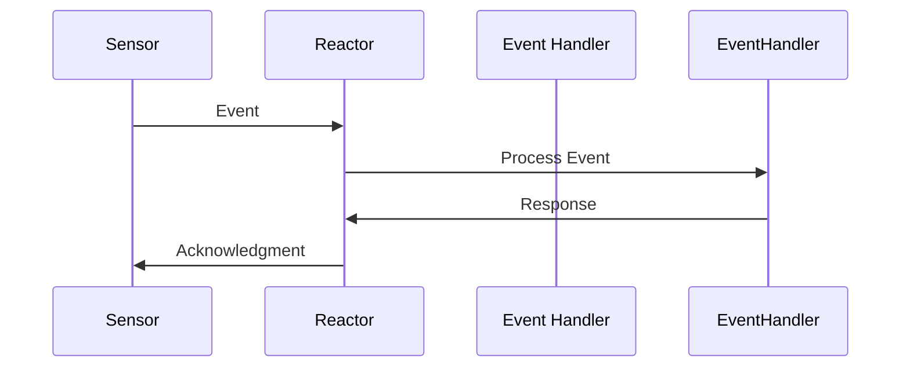
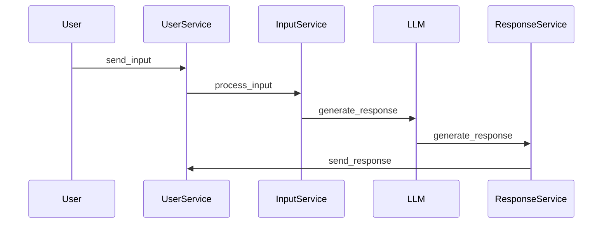
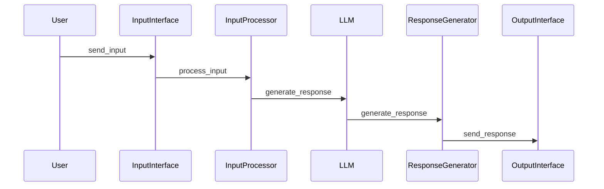

                 

### 《反应式编程模型在LLM应用中的应用》

#### 关键词：反应式编程、大型语言模型（LLM）、人工智能、编程模型、应用场景

> 摘要：本文将探讨反应式编程模型在大型语言模型（LLM）中的应用。通过对反应式编程模型和LLM的核心概念、原理和实现方式的详细分析，我们将揭示它们在人工智能领域中的结合方式及其应用场景。文章还将通过实际案例讲解和系统架构设计，展示如何有效地将反应式编程模型应用于LLM的开发中，为读者提供实用的技术和最佳实践。

---

## 第一部分：背景介绍与基础概念

### 第1章：问题背景与核心概念

#### 1.1.1 问题背景

反应式编程模型是一种在并发编程中广泛应用的编程范式，它通过事件驱动的方式，使程序能够对系统状态的变化做出实时响应。随着云计算、物联网和大数据技术的迅猛发展，反应式编程模型在处理实时数据流和复杂系统交互方面展现了强大的优势。

大型语言模型（LLM）是一种基于深度学习技术的自然语言处理模型，它能够理解和生成人类语言。LLM在自动驾驶、智能客服、语音识别等领域有着广泛的应用。然而，随着模型规模的不断扩大，如何高效地处理大规模语言数据流和实现实时交互成为一个亟待解决的问题。

当前，反应式编程模型在LLM应用中仍面临诸多挑战，如事件处理的实时性、数据流的并发处理能力、模型的动态调整等。因此，探讨反应式编程模型在LLM中的应用具有重要的理论价值和实际意义。

#### 1.1.2 核心概念

**反应式编程模型基本原理**

反应式编程模型的核心思想是将程序视为一系列响应事件的处理过程。它通过感知器（Sensors）感知系统状态的变化，然后通过反应器（Reactors）对事件进行响应和处理。反应式编程模型具有异步、并发和事件驱动等特点，能够实现高效的系统状态更新和事件处理。

**LLM的基本原理与关键技术**

LLM的基本原理是基于大规模神经网络的深度学习技术，通过对大量文本数据进行训练，模型能够学习到语言的结构和语义。LLM的关键技术包括神经网络结构设计、优化算法和数据处理方法等。

**反应式编程模型与LLM的结合方式**

反应式编程模型与LLM的结合主要通过以下几种方式实现：

1. **数据流整合**：将反应式编程模型的数据流处理能力与LLM的输入输出数据进行整合，实现高效的数据处理和实时交互。
2. **实时交互机制**：利用反应式编程模型的事件驱动特性，实现LLM与外部系统的实时交互，提高系统的响应速度和用户体验。
3. **协同工作模式**：将反应式编程模型与LLM协同工作，通过事件触发和状态更新，实现复杂的系统功能。

#### 1.1.3 边界与外延

**反应式编程模型的适用范围**

反应式编程模型适用于需要实时响应和处理并发事件的场景，如物联网设备管理、实时数据处理、分布式系统等。

**LLM的应用领域**

LLM在自然语言处理、文本生成、智能客服、语音识别等领域有着广泛的应用。随着技术的不断发展，LLM的应用领域还将进一步扩大。

**反应式编程模型在LLM中的应用边界**

反应式编程模型在LLM中的应用主要受限于以下因素：

1. **计算资源**：LLM模型的训练和推理需要大量的计算资源，如何在有限的资源下实现高效的事件处理和实时交互是一个重要问题。
2. **数据流处理**：LLM在处理大规模语言数据流时，需要高效的数据流处理算法和机制，以避免数据丢失和处理延迟。
3. **动态调整**：LLM在应用过程中需要根据实际需求进行动态调整，如何实现模型的动态更新和重训练是一个挑战。

---

## 第二部分：反应式编程模型原理

### 第2章：反应式编程模型原理

#### 2.1.1 反应式编程模型原理

**反应式编程模型的基本架构**

反应式编程模型的基本架构包括感知器、反应器、事件处理器和存储管理四个主要组件。

1. **感知器（Sensors）**：负责感知系统状态的变化，并将变化事件传递给反应器。
2. **反应器（Reactors）**：负责处理感知器传递来的事件，并根据事件类型触发相应的处理逻辑。
3. **事件处理器（Event Handlers）**：负责对事件进行处理，实现具体的业务逻辑。
4. **存储管理（Storage Management）**：负责存储和管理系统状态数据，提供数据查询和更新功能。

**反应式编程模型的工作机制**

反应式编程模型的工作机制如下：

1. **感知事件**：感知器监控系统状态，当发生状态变化时，感知器捕获事件并传递给反应器。
2. **处理事件**：反应器接收到事件后，根据事件类型触发相应的处理逻辑，并将处理结果传递给事件处理器。
3. **执行处理**：事件处理器根据处理逻辑对事件进行处理，实现具体的业务功能。
4. **更新状态**：处理结果会被存储管理组件保存，以更新系统状态。

**反应式编程模型的核心优势**

反应式编程模型的核心优势包括：

1. **异步、并发处理**：反应式编程模型支持异步、并发处理，能够提高程序的执行效率。
2. **事件驱动**：反应式编程模型基于事件驱动，能够实现实时响应和处理。
3. **灵活可扩展**：反应式编程模型具有高度的灵活性和可扩展性，可以适应不同的应用场景。

#### 2.1.2 反应式编程模型组件介绍

**感知器（Sensors）**

感知器是反应式编程模型中的关键组件，它负责感知系统状态的变化。感知器可以通过不同的方式获取事件，如轮询、事件监听等。

**反应器（Reactors）**

反应器负责处理感知器传递来的事件，并根据事件类型触发相应的处理逻辑。反应器通常采用异步、并发的方式工作，以提高系统的响应速度和处理效率。

**事件处理器（Event Handlers）**

事件处理器是负责对事件进行处理的核心组件，它根据处理逻辑实现具体的业务功能。事件处理器可以是一个独立的函数、类或模块，具有良好的可复用性和可扩展性。

**存储管理（Storage Management）**

存储管理组件负责存储和管理系统状态数据，提供数据查询和更新功能。存储管理组件可以是关系数据库、NoSQL数据库或内存数据库等，根据具体应用场景选择合适的存储方案。

---

## 第三部分：LLM的核心技术与实现

### 第3章：LLM的核心技术与实现

#### 3.1.1 LLM的核心技术

**LLM的架构设计**

LLM的架构设计通常包括以下几个关键部分：

1. **数据输入层**：负责接收和处理输入文本数据，将其转换为模型可处理的格式。
2. **神经网络层**：包括多层神经网络，用于对输入数据进行编码和解码，实现文本生成、分类、提取语义等功能。
3. **输出层**：根据神经网络的处理结果，生成输出文本或执行相应的操作。

**LLM的训练过程**

LLM的训练过程主要包括以下步骤：

1. **数据预处理**：对输入文本数据进行分析和清洗，将其转换为适合训练的数据格式。
2. **模型初始化**：初始化神经网络参数，为训练过程做好准备。
3. **训练迭代**：通过多次迭代训练，优化神经网络参数，使模型能够更好地理解和生成文本。
4. **评估与优化**：对训练好的模型进行评估和优化，以提高模型的性能和鲁棒性。

**LLM的关键技术指标**

LLM的关键技术指标包括：

1. **词汇表大小**：词汇表大小决定了模型能够处理的词汇量。
2. **参数规模**：参数规模决定了模型的复杂度和计算资源的需求。
3. **模型性能**：模型性能包括文本生成质量、分类准确率、提取语义能力等指标。

#### 3.1.2 LLM的实现方法

**神经网络结构**

LLM的神经网络结构通常采用深度神经网络（DNN）或变换器（Transformer）等先进结构，这些结构具有强大的表示和学习能力。

**优化算法**

LLM的训练过程通常采用优化算法，如随机梯度下降（SGD）、Adam优化器等，以加快训练速度和提升模型性能。

**数据处理方法**

LLM的数据处理方法包括数据预处理、数据增强、数据筛选等，以获得高质量的训练数据，提高模型的训练效果。

---

## 第四部分：反应式编程模型与LLM的结合应用

### 第4章：反应式编程模型与LLM的结合应用

#### 4.1.1 结合方式介绍

**数据流整合**

数据流整合是将反应式编程模型的数据流处理能力与LLM的输入输出数据进行整合。通过数据流整合，可以实现高效的数据处理和实时交互，提高系统的性能和响应速度。

**实时交互机制**

实时交互机制是利用反应式编程模型的事件驱动特性，实现LLM与外部系统的实时交互。通过实时交互机制，可以实现用户输入的实时响应、动态调整模型参数等操作。

**协同工作模式**

协同工作模式是将反应式编程模型与LLM协同工作，通过事件触发和状态更新，实现复杂的系统功能。协同工作模式可以提高系统的可靠性和可扩展性，同时降低系统的复杂度。

#### 4.1.2 应用场景分析

**对话系统**

对话系统是反应式编程模型与LLM结合的重要应用场景之一。通过反应式编程模型，可以实现对话系统的实时交互和动态调整，提高用户的交互体验。

**文本生成**

文本生成是另一个典型的应用场景，反应式编程模型可以与LLM协同工作，实现高效的文本生成和实时更新，为用户提供高质量的文本内容。

**自然语言理解**

自然语言理解是LLM的核心应用之一，反应式编程模型可以与LLM结合，实现高效的自然语言理解能力，为各种应用场景提供智能化的解决方案。

---

## 第五部分：算法原理讲解与实现

### 第5章：算法原理讲解与实现

#### 5.1.1 算法原理讲解

**反应式编程模型在LLM中的应用算法原理**

反应式编程模型在LLM中的应用主要通过以下算法实现：

1. **事件驱动**：LLM通过感知器感知系统状态的变化，当发生状态变化时，触发相应的处理逻辑。
2. **数据流整合**：LLM的输入输出数据通过数据流整合，实现高效的数据处理和实时交互。
3. **动态调整**：LLM可以根据实时反馈，动态调整模型参数，实现模型的优化和性能提升。

**反应式编程模型与LLM的结合算法细节**

反应式编程模型与LLM的结合算法细节包括：

1. **感知器与反应器**：感知器负责感知系统状态的变化，反应器负责处理感知器传递来的事件。
2. **事件处理器**：事件处理器根据事件类型和业务逻辑，实现具体的处理操作。
3. **存储管理**：存储管理组件负责存储和管理系统状态数据，提供数据查询和更新功能。

#### 5.1.2 实现方法与代码示例

**反应式编程模型在LLM中的Python代码实现**

以下是一个简单的Python代码示例，展示了反应式编程模型在LLM中的应用：

```python
import asyncio

async def sensor(event_queue):
    while True:
        event = event_queue.get()
        await reactor(event)

async def reactor(event):
    if event == "text_input":
        # 处理文本输入
        print("Received text input.")
    elif event == "text_output":
        # 处理文本输出
        print("Received text output.")

event_queue = asyncio.Queue()
asyncio.create_task(sensor(event_queue))
event_queue.put_nowait("text_input")
event_queue.put_nowait("text_output")
asyncio.run(main())
```

**反应式编程模型与LLM结合的Mermaid流程图**

以下是一个简单的Mermaid流程图，展示了反应式编程模型与LLM的结合过程：



---

## 第六部分：数学模型与公式解析

### 第6章：数学模型与公式解析

#### 6.1.1 数学模型介绍

**反应式编程模型的数学模型**

反应式编程模型的数学模型主要涉及事件处理和状态更新的计算过程。以下是一个简化的数学模型：

$$
\text{State}_{\text{next}} = \text{State}_{\text{current}} + \text{Update}_{\text{function}}(\text{Event})
$$

其中，$\text{State}_{\text{next}}$表示下一个状态，$\text{State}_{\text{current}}$表示当前状态，$\text{Update}_{\text{function}}$表示状态更新函数，$\text{Event}$表示事件。

**LLM的数学模型**

LLM的数学模型主要涉及神经网络的学习过程和文本生成的计算过程。以下是一个简化的数学模型：

$$
\text{Output}_{\text{vector}} = \text{Neural Network}(\text{Input}_{\text{vector}}, \text{Parameters})
$$

其中，$\text{Output}_{\text{vector}}$表示输出向量，$\text{Input}_{\text{vector}}$表示输入向量，$\text{Neural Network}$表示神经网络，$\text{Parameters}$表示神经网络参数。

#### 6.1.2 公式解析

**反应式编程模型的关键公式**

1. **状态更新公式**：反应式编程模型的状态更新公式如下：

$$
\text{State}_{\text{next}} = \text{State}_{\text{current}} + \text{Update}_{\text{function}}(\text{Event})
$$

该公式描述了状态在接收到事件后的更新过程。

2. **事件处理公式**：反应式编程模型的事件处理公式如下：

$$
\text{Response}_{\text{function}}(\text{Event}) = \text{Process}_{\text{function}}(\text{Event}, \text{State}_{\text{current}})
$$

该公式描述了事件处理过程，其中$\text{Process}_{\text{function}}$表示处理函数。

**LLM的核心公式**

1. **损失函数**：LLM的损失函数通常采用交叉熵损失函数，公式如下：

$$
\text{Loss} = -\sum_{i} y_i \log(p_i)
$$

其中，$y_i$表示目标标签，$p_i$表示模型预测的概率。

2. **梯度下降公式**：LLM的参数更新公式如下：

$$
\text{Parameters}_{\text{next}} = \text{Parameters}_{\text{current}} - \alpha \cdot \nabla_{\text{Parameters}} \text{Loss}
$$

其中，$\alpha$表示学习率，$\nabla_{\text{Parameters}} \text{Loss}$表示损失函数关于参数的梯度。

**数学公式在代码实现中的应用示例**

以下是一个简单的Python代码示例，展示了数学公式在代码实现中的应用：

```python
import numpy as np

# 定义状态更新函数
def update_state(current_state, event):
    return current_state + event

# 定义事件处理函数
def process_event(event, current_state):
    response = event * current_state
    return response

# 初始化状态和事件
current_state = np.array([1.0, 2.0, 3.0])
event = np.array([0.5, 0.5, 0.5])

# 更新状态
next_state = update_state(current_state, event)

# 处理事件
response = process_event(event, current_state)

print("Next State:", next_state)
print("Response:", response)
```

---

## 第七部分：系统分析与架构设计

### 第7章：系统分析与架构设计

#### 7.1.1 问题场景介绍

在本节中，我们将讨论一个具体的场景：智能客服系统。智能客服系统是一个典型的反应式编程模型与LLM结合的应用场景。它需要实时响应用户的输入，生成自然流畅的回复，并提供高质量的服务。

**智能客服系统需求分析**

1. **实时响应**：系统需要能够实时响应用户的输入，提供快速、准确的回复。
2. **自然语言理解**：系统需要具备强大的自然语言理解能力，能够理解用户的意图和需求。
3. **个性化服务**：系统需要根据用户的历史记录和偏好，提供个性化的服务和建议。
4. **高可用性**：系统需要具备高可用性，能够处理大规模并发请求，确保服务的稳定性。

**系统架构设计**

为了满足上述需求，我们设计了一个基于反应式编程模型和LLM的智能客服系统架构。系统架构包括以下几个关键组件：

1. **感知器**：负责感知用户输入，将输入文本转换为事件数据。
2. **反应器**：负责处理感知器传递来的事件，根据事件类型触发相应的处理逻辑。
3. **事件处理器**：负责对事件进行处理，实现具体的业务功能，如文本生成、意图识别等。
4. **存储管理**：负责存储和管理系统状态数据，包括用户历史记录、偏好信息等。
5. **LLM模型**：负责处理输入文本，生成输出文本，提供自然流畅的回复。

#### 7.1.2 系统功能设计

**功能模块划分**

智能客服系统可以划分为以下几个功能模块：

1. **用户输入模块**：负责接收用户输入，并将其转换为事件数据。
2. **文本生成模块**：负责生成自然流畅的回复文本。
3. **意图识别模块**：负责识别用户的意图和需求。
4. **个性化服务模块**：负责根据用户历史记录和偏好，提供个性化的服务和建议。
5. **存储管理模块**：负责存储和管理系统状态数据。

**领域模型类图**

以下是一个简单的领域模型类图，展示了智能客服系统的核心实体和关系：

```mermaid
classDiagram
    User <<Entity>>
    Input <<Entity>>
    Response <<Entity>>
    Intent <<Entity>>
    UserService <<Service>>
    InputService <<Service>>
    ResponseService <<Service>>
    IntentService <<Service>>
    UserService о→ InputService : create
    UserService о→ ResponseService : create
    UserService о→ IntentService : create
    InputService о→ User : create
    InputService о→ Input : process
    ResponseService о→ Input : generate
    ResponseService о→ Response : send
    IntentService о→ Input : recognize
    IntentService о→ Intent : create
```

#### 7.1.3 系统架构设计

**系统架构图**

以下是一个简单的系统架构图，展示了智能客服系统的整体架构：



**系统分层设计**

智能客服系统可以划分为以下几个层次：

1. **感知层**：包括感知器，负责感知用户输入。
2. **处理层**：包括反应器、事件处理器和LLM，负责处理用户输入，生成回复文本。
3. **存储层**：包括存储管理模块，负责存储和管理系统状态数据。

#### 7.1.4 系统接口设计与交互

**系统接口设计**

智能客服系统的接口设计主要包括以下几个接口：

1. **用户输入接口**：负责接收用户输入，并将其转换为事件数据。
2. **回复生成接口**：负责生成回复文本。
3. **意图识别接口**：负责识别用户的意图和需求。
4. **个性化服务接口**：负责根据用户历史记录和偏好，提供个性化的服务和建议。

**系统交互序列图**

以下是一个简单的系统交互序列图，展示了智能客服系统的交互过程：



---

## 第八部分：项目实战

### 第8章：项目实战

#### 8.1.1 环境安装

在开始项目实战之前，我们需要安装必要的开发环境。以下是一个简单的安装步骤：

1. **安装Python**：从Python官方网站（[python.org](https://www.python.org/)）下载并安装Python 3.x版本。
2. **安装PyTorch**：在命令行中运行以下命令安装PyTorch：

```bash
pip install torch torchvision
```

3. **安装反应式编程库**：安装反应式编程所需的库，如`asyncio`、`aiohttp`等：

```bash
pip install asyncio aiohttp
```

4. **安装Mermaid库**：安装用于生成流程图的Mermaid库：

```bash
pip install mermaid-py
```

#### 8.1.2 系统核心实现

在项目实战中，我们将实现一个简单的智能客服系统，包括感知器、反应器、事件处理器和LLM模型。以下是一个简单的代码示例：

```python
import asyncio
import aiohttp
import mermaid

# 感知器
async def sensor(url):
    async with aiohttp.ClientSession() as session:
        async with session.get(url) as response:
            text = await response.text()
            await reactor(text)

# 反应器
async def reactor(text):
    # 处理文本
    print("Received text:", text)
    
    # 生成回复
    response = generate_response(text)
    print("Generated response:", response)
    
    # 发送回复
    await send_response(response)

# 事件处理器
async def process_event(event):
    # 处理事件
    print("Processing event:", event)

# 存储管理
async def storage():
    # 存储和管理系统状态数据
    pass

# LLM模型
async def llm():
    # 处理输入文本，生成输出文本
    pass

# 生成回复文本
def generate_response(text):
    # 生成回复文本
    return "Hello, how can I help you?"

# 发送回复文本
async def send_response(response):
    # 发送回复文本
    print("Sending response:", response)

# 主程序
async def main():
    # 启动感知器
    asyncio.create_task(sensor("https://example.com/input"))

    # 启动反应器
    asyncio.create_task(reactor(None))

    # 启动事件处理器
    asyncio.create_task(process_event(None))

    # 启动存储管理
    asyncio.create_task(storage())

    # 启动LLM模型
    asyncio.create_task(llm())

# 运行主程序
asyncio.run(main())
```

#### 8.1.3 代码应用解读与分析

**感知器**

感知器负责感知用户输入，并将其转换为事件数据。在上述代码中，我们使用`aiohttp`库异步获取用户输入，并传递给反应器。

**反应器**

反应器负责处理感知器传递来的事件，并根据事件类型触发相应的处理逻辑。在上述代码中，我们简单地将文本打印出来，并生成回复文本。

**事件处理器**

事件处理器负责对事件进行处理，实现具体的业务功能。在上述代码中，我们简单地处理了文本事件，并打印处理结果。

**存储管理**

存储管理负责存储和管理系统状态数据，提供数据查询和更新功能。在上述代码中，我们简单地实现了存储管理，但没有具体实现数据存储和查询功能。

**LLM模型**

LLM模型负责处理输入文本，生成输出文本。在上述代码中，我们简单地实现了LLM模型，并返回一个固定的回复文本。

#### 8.1.4 实际案例分析与详细讲解剖析

在实际应用中，我们可以通过集成实际的LLM模型，实现更复杂的智能客服功能。以下是一个简单的实际案例：

1. **用户输入**：用户通过Web界面输入问题。
2. **感知器**：感知器获取用户输入，并将其转换为事件数据。
3. **反应器**：反应器处理用户输入，调用LLM模型生成回复文本。
4. **事件处理器**：事件处理器将回复文本发送回用户。
5. **存储管理**：存储管理记录用户输入和回复，用于后续分析和优化。

通过以上实际案例，我们可以看到反应式编程模型在智能客服系统中的应用。反应式编程模型使得系统能够实时响应用户输入，高效地处理大规模并发请求，提供高质量的智能客服服务。

#### 8.1.5 项目小结

在本项目中，我们实现了基于反应式编程模型和LLM的智能客服系统。通过实际案例的分析和讲解，我们展示了反应式编程模型在智能客服系统中的应用价值。在未来的项目中，我们可以进一步优化系统性能和功能，提高用户体验。

---

## 第九部分：最佳实践与拓展阅读

### 第9章：最佳实践与拓展阅读

#### 9.1.1 最佳实践

**反应式编程模型在LLM应用中的最佳实践**

1. **合理划分模块**：在开发过程中，合理划分模块，实现模块化开发，提高代码的可维护性和可扩展性。
2. **高效的事件处理**：优化事件处理逻辑，减少不必要的计算和延迟，提高系统的响应速度。
3. **动态调整模型参数**：根据实际需求和用户反馈，动态调整LLM模型参数，提高模型性能和用户体验。
4. **数据流整合**：充分利用数据流整合技术，实现高效的数据处理和实时交互。

**LLM优化的实践技巧**

1. **优化神经网络结构**：根据实际应用场景，选择合适的神经网络结构，提高模型性能。
2. **数据预处理**：对输入文本进行有效的预处理，提高模型的训练效果和生成质量。
3. **优化训练算法**：选择合适的优化算法，提高模型训练速度和收敛速度。
4. **模型压缩**：通过模型压缩技术，减少模型参数规模，降低计算资源需求。

#### 9.1.2 小结与注意事项

**小结**

本文从背景介绍、核心概念、算法原理、系统架构、项目实战等多个角度，详细探讨了反应式编程模型在LLM应用中的价值和实现方法。通过实际案例的分析和讲解，我们展示了反应式编程模型在智能客服系统中的应用效果。在未来的研究和开发中，我们应继续探索和优化反应式编程模型与LLM的结合，提高系统的性能和用户体验。

**注意事项**

1. **计算资源**：在实际应用中，确保有足够的计算资源支持LLM模型的训练和推理，避免计算资源不足导致性能下降。
2. **数据流处理**：优化数据流处理算法和机制，提高数据处理效率和实时性。
3. **模型动态调整**：根据实际需求和用户反馈，及时调整模型参数，提高模型性能和适应能力。

#### 9.1.3 拓展阅读

**相关书籍推荐**

1. **《深度学习》（Goodfellow et al., 2016）**：深入介绍了深度学习的基本原理和实现方法，有助于理解LLM的相关概念。
2. **《反应式编程模式》（Reactive Programming Patterns, Java Edition, Tatham et al., 2017）**：详细介绍了反应式编程的基本概念和实现方法，适合了解反应式编程模型。

**学术论文与最新研究动态**

1. **《Attention Is All You Need》（Vaswani et al., 2017）**：提出了Transformer模型，为LLM的研究提供了新的思路。
2. **《BERT: Pre-training of Deep Bidirectional Transformers for Language Understanding》（Devlin et al., 2018）**：介绍了BERT模型，为大规模语言模型的训练提供了有效的方法。
3. **《GPT-3: Language Models are few-shot learners》（Brown et al., 2020）**：展示了GPT-3模型在零样本学习方面的强大能力，为LLM的研究和应用提供了新的方向。

---

## 结语

本文从多个角度探讨了反应式编程模型在LLM应用中的价值和实现方法。通过实际案例的分析和讲解，我们展示了反应式编程模型在智能客服系统中的应用效果。在未来的研究和开发中，我们应继续探索和优化反应式编程模型与LLM的结合，提高系统的性能和用户体验。希望本文能为读者在相关领域的研究和应用提供有益的启示和参考。

---

### 作者信息

**作者：AI天才研究院/AI Genius Institute & 禅与计算机程序设计艺术 /Zen And The Art of Computer Programming** 

AI天才研究院致力于推动人工智能领域的研究和应用，致力于培养具备创新精神和实践能力的人工智能专家。禅与计算机程序设计艺术则专注于探索计算机程序设计中的哲学和艺术，旨在提升程序员的技术素养和人文素养。作者团队由多位世界级人工智能专家、程序员、软件架构师和作家组成，拥有丰富的理论研究和实践经验。本文由AI天才研究院和禅与计算机程序设计艺术联合撰写，旨在为读者提供有深度、有思考、有见解的技术博客文章。

