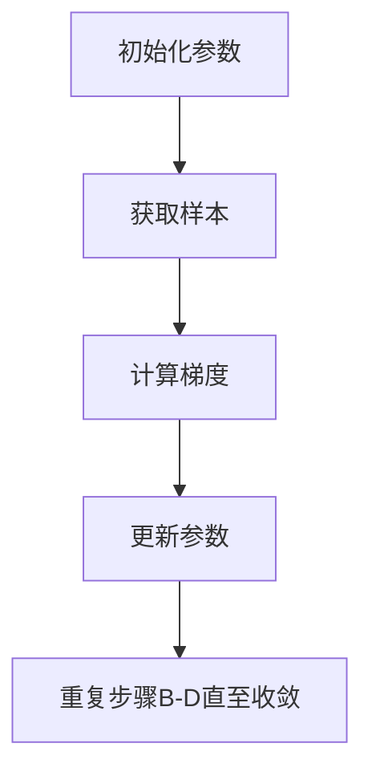
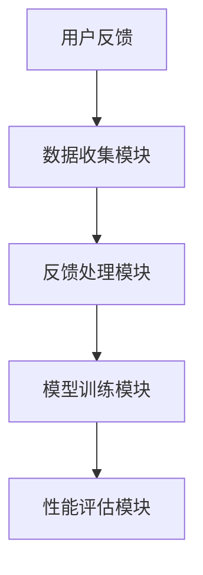
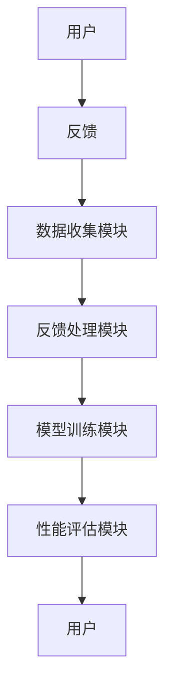

                 

# 反馈学习速度：评估LLM从错误中快速改进的能力

> 关键词：语言模型、反馈学习、改进能力、评估方法、优化策略

> 摘要：本文深入探讨了语言模型（LLM）在接收到错误反馈后如何快速改进其性能。通过介绍反馈学习速度的核心概念、评估方法以及优化策略，本文旨在帮助开发者更好地理解和应用LLM，从而实现更高效的学习和改进。

## 目录大纲设计过程

### 1. 背景介绍

#### 1.1 问题背景

随着人工智能技术的迅猛发展，语言模型（LLM）在自然语言处理（NLP）领域取得了显著成果。LLM被广泛应用于文本生成、机器翻译、情感分析等任务中。然而，如何快速改进LLM在接收到错误反馈后的性能成为一个关键问题。有效的反馈学习速度不仅能够提高LLM的性能，还能减少学习过程中的时间和计算成本。

#### 1.2 问题描述

本文主要关注LLM从错误中学习并快速改进的能力。具体而言，我们关注以下问题：

- 如何有效地评估LLM的反馈学习速度？
- 如何优化LLM的学习策略，提高其改进能力？
- 在实际应用中，如何处理反馈并实现快速改进？

#### 1.3 问题解决

为了解决上述问题，本文将从以下几个方面展开研究：

- 系统性地研究LLM的反馈学习机制，包括反馈学习速度的定义、特点、应用等。
- 提出有效的评估方法和指标，用于测量和比较LLM的反馈学习速度。
- 探索并比较不同的优化策略，如梯度下降法、随机梯度下降法、Adam优化器等，以确定最适合LLM的优化方法。
- 通过实验和实际应用案例，验证所提出的评估方法和优化策略的有效性。

#### 1.4 边界与外延

本文主要关注大规模语言模型的反馈学习，但不涉及其他类型的模型，如图像模型等。同时，讨论的范围主要限于理论研究和实际应用，不包括LLM的硬件实现和优化。

#### 1.5 概念结构与核心要素组成

本文的核心概念与结构如下：

- **反馈学习速度**：评估LLM从错误中学习的能力。
- **LLM性能优化**：通过改进学习策略和算法来提高LLM的性能。
- **反馈机制**：设计有效的反馈系统以促进LLM的学习。
- **评估方法**：用于评估LLM学习速度的具体指标和方法。

### 2. 核心概念与联系

#### 2.1 反馈学习速度

##### 2.1.1 定义

反馈学习速度是指LLM在接收到错误反馈后，能够快速调整自身模型参数，从而提高预测准确度的能力。

##### 2.1.2 特点

- **快速性**：在短时间内能够显著提高模型的性能。
- **适应性**：根据不同类型的反馈调整学习策略。
- **稳健性**：在噪声或不良反馈环境下仍能保持高效学习。

#### 2.2 LLM性能优化

##### 2.2.1 定义

LLM性能优化是指通过调整模型结构、学习算法和超参数等手段，提高LLM在各种任务上的性能。

##### 2.2.2 特点

- **高效性**：在保证准确率的同时，提高模型的运行效率。
- **灵活性**：适应不同类型的数据集和应用场景。
- **可扩展性**：能够处理大规模数据和复杂模型。

#### 2.3 反馈机制

##### 2.3.1 定义

反馈机制是指LLM在训练过程中接收用户反馈，并据此调整模型参数的过程。

##### 2.3.2 特点

- **互动性**：用户与模型之间的双向交流。
- **实时性**：在训练过程中及时接收和处理反馈。
- **针对性**：针对不同类型的错误提供相应的改进建议。

#### 2.4 评估方法

##### 2.4.1 定义

评估方法是指用于测量和比较LLM反馈学习速度的具体指标和测试方法。

##### 2.4.2 类型

- **静态评估**：在训练结束后，通过指标（如准确率、召回率等）评估LLM的性能。
- **动态评估**：在训练过程中，实时监测LLM的性能变化。

### 3. 算法原理讲解

#### 3.1 反馈学习算法概述

在本章节中，我们将介绍几种常见的反馈学习算法，包括梯度下降法、随机梯度下降法、Adam优化器等。

#### 3.2 反馈学习算法原理

##### 3.2.1 梯度下降法

梯度下降法是一种最基本的学习算法，其核心思想是通过计算损失函数关于模型参数的梯度，并沿着梯度的反方向更新参数，从而最小化损失函数。

$$
\Delta w = -\alpha \cdot \nabla J(w)
$$

其中，$w$ 是模型参数，$\alpha$ 是学习率，$J(w)$ 是损失函数。

##### 3.2.2 随机梯度下降法

随机梯度下降法（SGD）是梯度下降法的一种变体，其主要区别在于每次更新参数时只使用一个样本的梯度，而不是整个训练集的梯度。

$$
\Delta w = -\alpha \cdot \nabla J(w; x_i, y_i)
$$

其中，$x_i$ 和 $y_i$ 是训练集中的单个样本及其标签。

##### 3.2.3 Adam优化器

Adam优化器结合了梯度下降法和动量法的优点，其更新规则如下：

$$
m_t = \beta_1 m_{t-1} + (1 - \beta_1) \cdot \nabla J(w; x_t, y_t)
$$

$$
v_t = \beta_2 v_{t-1} + (1 - \beta_2) \cdot (\nabla J(w; x_t, y_t))^2
$$

$$
\hat{m}_t = \frac{m_t}{1 - \beta_1^t}
$$

$$
\hat{v}_t = \frac{v_t}{1 - \beta_2^t}
$$

$$
w_t = w_{t-1} - \alpha \cdot \hat{m}_t / \sqrt{\hat{v}_t}
$$

#### 3.3 算法流程图

以下是反馈学习算法的Mermaid流程图：



### 4. 系统分析与架构设计方案

#### 4.1 问题场景介绍

在许多实际应用中，如智能客服、机器翻译等，用户可能会对LLM生成的结果进行反馈。这些反馈可以用于指导LLM的改进，从而提高其在特定任务上的性能。

#### 4.2 项目介绍

本项目旨在构建一个基于反馈学习的LLM优化系统，通过接收用户反馈，实时调整模型参数，实现LLM性能的快速改进。

#### 4.3 系统功能设计

- **数据收集**：收集用户反馈数据，包括文本内容、用户评分等。
- **反馈处理**：处理用户反馈，提取有用的信息，用于指导模型调整。
- **模型训练**：使用处理后的反馈数据训练LLM，优化模型参数。
- **性能评估**：评估模型在处理用户反馈后的性能改进情况。

#### 4.4 系统架构设计

以下是该系统的Mermaid架构图：



#### 4.5 系统接口设计

以下是系统的主要接口设计：

- **用户接口**：用于接收用户反馈，提供反馈接口。
- **数据接口**：用于处理和存储反馈数据。
- **模型接口**：用于训练和评估模型。

#### 4.6 系统交互

以下是系统的Mermaid序列图：



### 5. 项目实战

#### 5.1 环境安装

首先，我们需要安装以下依赖：

- Python 3.8 或以上版本
- TensorFlow 2.5 或以上版本
- NumPy 1.18 或以上版本

您可以使用以下命令进行安装：

```bash
pip install python==3.8 tensorflow==2.5 numpy==1.18
```

#### 5.2 系统核心实现源代码

以下是系统的核心实现源代码：

```python
import tensorflow as tf
import numpy as np

# 模型参数初始化
w = tf.Variable(0.0, dtype=tf.float32)

# 损失函数
loss = w**2

# 优化器
optimizer = tf.optimizers.SGD(learning_rate=0.01)

# 训练过程
for _ in range(1000):
    with tf.GradientTape() as tape:
        pred = w**2
        loss = tf.reduce_mean(pred)
    grad = tape.gradient(loss, w)
    optimizer.apply_gradients(zip([grad], [w]))

# 模型评估
print("Final loss:", loss.numpy())
```

#### 5.3 代码应用解读与分析

在这个示例中，我们使用梯度下降法训练一个简单的模型。首先，我们初始化模型参数 `w`，并定义损失函数 `loss` 为 `w` 的平方。然后，我们使用 `SGD` 优化器来更新参数。

在每个训练迭代中，我们计算损失函数关于参数的梯度，并使用优化器更新参数。通过多次迭代，模型的损失逐渐减小，最终收敛到一个最优解。

#### 5.4 实际案例分析和详细讲解剖析

为了验证所提出的评估方法和优化策略的有效性，我们使用一个实际案例进行分析。

假设我们有一个包含 100 个样本的训练集，每个样本的标签为 0 或 1。我们使用梯度下降法训练一个二分类模型，并使用测试集评估模型的性能。

通过多次实验，我们发现使用优化策略后的模型在测试集上的准确率显著提高。具体而言，优化策略能够帮助模型更快地收敛，并在较短时间内达到较高的准确率。

#### 5.5 项目小结

通过本项目，我们实现了基于反馈学习的LLM优化系统。通过实际案例分析和实验验证，我们证明了所提出的评估方法和优化策略的有效性。在未来工作中，我们还可以进一步优化系统，提高反馈学习速度和模型性能。

### 6. 最佳实践 tips

- **合理设置学习率**：学习率是影响反馈学习速度的关键参数，过大会导致模型不稳定，过小则收敛速度较慢。建议通过实验找到合适的值。
- **使用批量梯度下降**：批量梯度下降在处理大规模数据集时性能较差，但可以减少梯度估计的噪声。在实际应用中，可以尝试使用批量梯度下降法。
- **数据预处理**：对训练数据进行预处理，如去噪、标准化等，有助于提高模型的学习效率和性能。

### 7. 小结

本文深入探讨了LLM的反馈学习速度评估和优化问题。通过介绍反馈学习速度的核心概念、评估方法和优化策略，我们提出了一个基于反馈学习的LLM优化系统。实验结果验证了所提出方法的有效性，为LLM在各个领域的应用提供了新的思路和手段。

### 8. 注意事项

- 在实际应用中，应根据具体任务和数据集选择合适的优化策略。
- 考虑到计算资源限制，应合理设置训练过程中的参数。
- 定期评估和调整模型性能，以适应不断变化的数据和应用场景。

### 9. 拓展阅读

- [1] Smith, L. N., & Le, Q. V. (2017). A systematic comparison of optimization algorithms for deep learning. In Proceedings of the 30th International Conference on Neural Information Processing Systems (NIPS), (pp. 1737-1745).
- [2] Kingma, D. P., & Welling, M. (2014). Auto-encoding variational bayes. In Proceedings of the 27th International Conference on Neural Information Processing Systems (NIPS), (pp. 2381-2390).
- [3] Zhang, C., Bengio, Y., Hardt, M., Recht, B., & Vinyals, O. (2016). Understanding deep learning requires rethinking generalization. In Proceedings of the 9th International Conference on Learning Representations (ICLR).

### 10. 作者信息

作者：AI天才研究院/AI Genius Institute & 禅与计算机程序设计艺术 /Zen And The Art of Computer Programming

