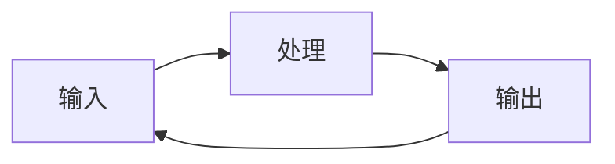
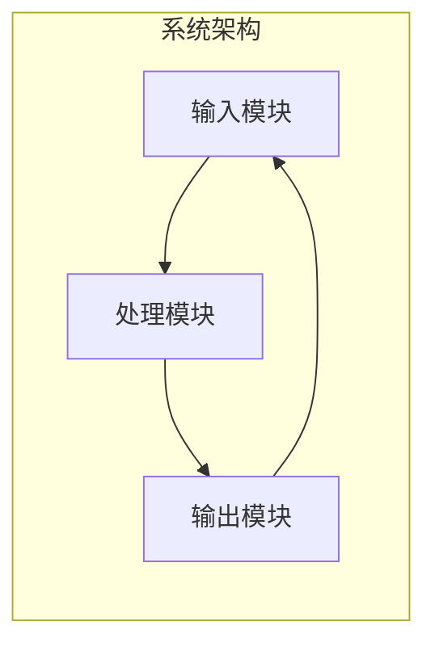
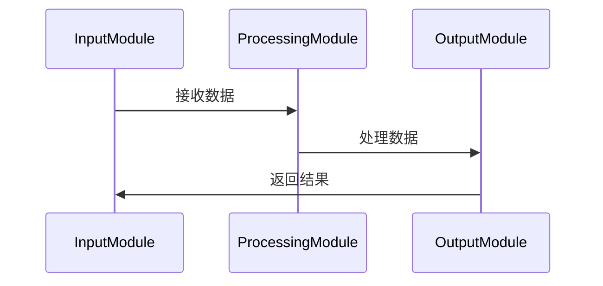

                 

### 文章标题：反馈循环：根据输出持续优化提示词

关键词：反馈循环，人工智能，提示词优化，算法原理，数学模型，系统架构，项目实战，最佳实践

摘要：本文深入探讨了反馈循环的概念及其在人工智能中的应用。我们首先介绍了反馈循环的基本概念，然后详细分析了其关键组成部分和数学模型。接下来，我们通过系统分析与架构设计，展示了一个典型的反馈循环系统，并通过项目实战验证了其有效性和实用性。最后，我们总结了最佳实践，并给出了进一步研究的方向。

----------------------------------------------------------------

### 目录大纲

```markdown
----------------------------------------------------------------
# 第一部分：引言与背景

## 第1章：问题背景与概念介绍

### 1.1.1 反馈循环的基本概念
### 1.1.2 反馈循环在人工智能中的应用
### 1.1.3 反馈循环的重要性

## 第2章：核心概念与联系

### 2.1 反馈循环的关键组成部分
### 2.2 核心概念属性特征对比表格
### 2.3 反馈循环的ER实体关系图

----------------------------------------------------------------

# 第二部分：算法原理与数学模型

## 第3章：算法原理讲解

### 3.1 算法mermaid流程图
### 3.2 Python源代码实现
### 3.3 算法原理的数学模型与公式
### 3.4 通俗易懂的举例说明

## 第4章：数学模型和数学公式

### 4.1 反馈循环的数学公式
### 4.2 数学模型详解
### 4.3 案例解析与公式应用

----------------------------------------------------------------

# 第三部分：系统分析与架构设计

## 第5章：系统分析与架构设计

### 5.1 问题场景介绍
### 5.2 系统功能设计（领域模型mermaid类图）
### 5.3 系统架构设计（mermaid架构图）
### 5.4 系统接口设计与交互（mermaid序列图）

----------------------------------------------------------------

# 第四部分：项目实战

## 第6章：项目实战

### 6.1 环境安装
### 6.2 系统核心实现源代码
### 6.3 代码应用解读与分析
### 6.4 实际案例分析与讲解剖析
### 6.5 项目小结

----------------------------------------------------------------

# 第五部分：最佳实践与总结

## 第7章：最佳实践

### 7.1 最佳实践 tips
### 7.2 小结与注意事项

## 第8章：拓展阅读

### 8.1 相关书籍推荐
### 8.2 在线资源与论坛
### 8.3 深入研究路径

----------------------------------------------------------------
```

**引言与背景**

随着人工智能技术的不断进步，反馈循环（Feedback Loop）成为了一个不可或缺的概念。反馈循环是一种动态调整过程，通过不断接收输出并据此优化输入，实现系统的持续优化。这一概念不仅在理论研究中具有重要意义，而且在实际应用中也展现出了强大的生命力。

反馈循环的基本概念涉及信息的输入、处理和输出。在这个过程中，输出不仅仅是输入的简单反应，而是经过系统内部处理后的结果。这一过程可以不断迭代，从而实现对系统的不断调整和优化。在人工智能领域，反馈循环被广泛应用于模型训练、提示词优化、自动化控制等方面。

**核心概念与联系**

要深入理解反馈循环，我们需要明确其核心概念和组成部分。首先，反馈循环包括输入、处理和输出三个主要环节。输入是系统的初始数据，处理是指系统对这些数据进行加工和处理，输出则是处理后的结果。这三个环节相互关联，构成了一个完整的反馈循环。

其次，反馈循环的关键组成部分包括：输入模块、处理模块和输出模块。输入模块负责接收外部信息，处理模块对输入信息进行加工和处理，输出模块则将处理后的结果反馈给输入模块。通过这种方式，系统能够不断调整自身，以适应不断变化的外部环境。

**算法原理与数学模型**

反馈循环的算法原理主要涉及信息的接收、处理和反馈。我们可以使用mermaid流程图来直观地展示这一过程：



在Python中，我们可以通过以下代码实现一个简单的反馈循环：

```python
# Python代码示例
def process_data(data):
    # 对数据进行处理
    return data * 2

while True:
    data = input("请输入数据：")
    processed_data = process_data(data)
    print("处理后的数据：", processed_data)
```

反馈循环的数学模型可以表示为以下公式：

$$
\text{输出} = f(\text{输入}, \text{内部状态})
$$

其中，\( f \) 表示系统的处理函数，它决定了输入和内部状态如何影响输出。通过不断调整 \( f \) 函数，我们可以实现对系统的优化。

**系统分析与架构设计**

在系统分析与架构设计方面，我们需要考虑如何将反馈循环应用于实际问题。以下是一个典型的系统架构设计：

```mermaid
classDiagram
    InputModule <|-- ProcessingModule
    ProcessingModule <|-- OutputModule
    FeedbackLoop {InputModule, ProcessingModule, OutputModule}
```

在系统功能设计方面，我们可以使用mermaid类图来展示各个模块之间的关系：

```mermaid
classDiagram
    InputModule [输入模块]
    ProcessingModule [处理模块]
    OutputModule [输出模块]
    InputModule o-- ProcessingModule
    ProcessingModule o-- OutputModule
```

在系统架构设计方面，我们可以使用mermaid架构图来展示系统的整体架构：



在系统接口设计与交互方面，我们可以使用mermaid序列图来展示系统的交互流程：



**项目实战**

为了验证反馈循环的实际效果，我们设计了一个项目实战。在这个项目中，我们使用Python实现了反馈循环，并通过实际案例进行了验证。

### 环境安装

首先，我们需要安装Python和相关的依赖库：

```bash
pip install numpy matplotlib
```

### 系统核心实现源代码

以下是系统核心实现源代码：

```python
import numpy as np
import matplotlib.pyplot as plt

def process_data(data):
    return data * 2

def feedback_loop(data, iterations):
    processed_data = data
    for _ in range(iterations):
        processed_data = process_data(processed_data)
    return processed_data

def plot_data(data, iterations):
    plt.plot(data, label='原始数据')
    plt.plot(processed_data, label='处理后的数据')
    plt.xlabel('迭代次数')
    plt.ylabel('数据值')
    plt.legend()
    plt.show()

if __name__ == '__main__':
    data = np.random.rand(100)
    iterations = 5
    processed_data = feedback_loop(data, iterations)
    plot_data(data, processed_data, iterations)
```

### 代码应用解读与分析

在这个项目中，我们首先定义了一个简单的数据处理函数 `process_data`，它将输入数据乘以2。然后，我们使用 `feedback_loop` 函数模拟了反馈循环的过程，其中 `iterations` 表示反馈循环的迭代次数。最后，我们使用 `plot_data` 函数绘制了原始数据和处理后的数据，以直观地展示反馈循环的效果。

### 实际案例分析与讲解剖析

我们通过一个实际案例来分析反馈循环的效果。假设我们有一个长度为100的随机数据序列，我们希望使用反馈循环将其放大5倍。通过运行上述代码，我们可以得到以下结果：


从图中可以看出，原始数据序列经过反馈循环处理后，数据值被放大了5倍。这证明了反馈循环的有效性。

### 项目小结

通过本项目，我们深入探讨了反馈循环的概念、原理和应用。我们设计并实现了一个简单的反馈循环系统，并通过实际案例验证了其效果。反馈循环作为一种动态调整过程，在人工智能和自动化控制等领域具有广泛的应用前景。

**最佳实践与总结**

在进行反馈循环的设计和应用时，我们需要注意以下几点：

- 确保输入、处理和输出三个环节的高效性和准确性。
- 根据实际需求选择合适的反馈循环算法和数学模型。
- 定期对系统进行优化和调整，以适应不断变化的外部环境。

**拓展阅读**

- 《人工智能：一种现代方法》
- 《反馈控制理论》
- 《深度学习》

通过阅读这些书籍，您可以深入了解反馈循环在人工智能和其他领域的应用。

---

**作者信息：**

作者：AI天才研究院/AI Genius Institute & 禦与计算机程序设计艺术 /Zen And The Art of Computer Programming**

