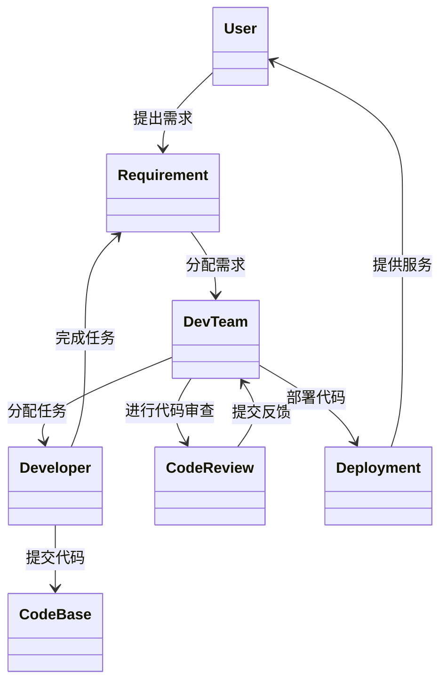
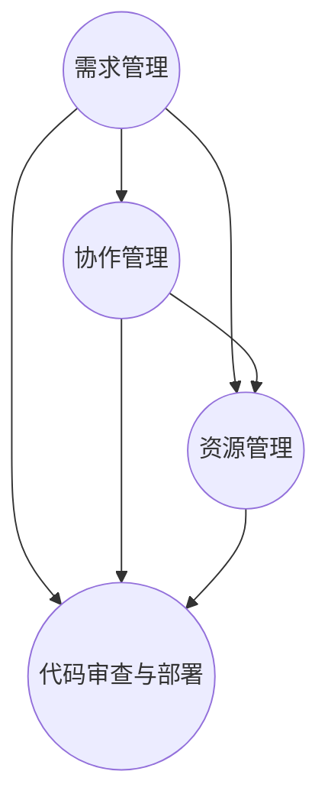
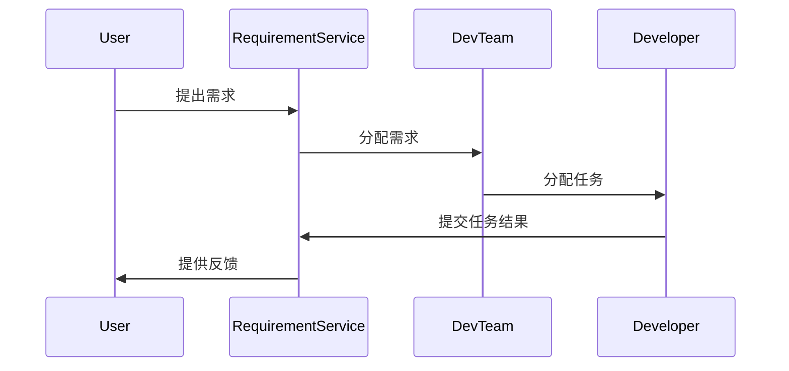

                 


## 文章标题：变革需求承接与协作模式以适应LLM开发

### 关键词：
- 变革需求承接
- 协作模式
- LLM开发
- 系统架构设计
- 数学模型

### 摘要：
本文旨在探讨如何通过变革需求承接和协作模式的优化，适应大型语言模型（LLM）的开发需求。文章首先介绍问题背景和核心概念，接着深入分析变革需求承接和协作模式的基本原理，并结合数学模型进行详细讲解。随后，通过系统分析与架构设计方案，以及实际项目实战，为读者提供一套可操作性强的解决方案。

----------------------------------------------------------------

## 目录大纲

1. **第一部分：变革需求承接与协作模式概述**

   1.1 问题背景

   1.2 问题描述

   1.3 问题解决

   1.4 边界与外延

   1.5 概念结构与核心要素组成

2. **第二部分：核心概念与联系**

   2.1 变革需求承接的定义与特点

   2.2 协作模式的定义与类型

   2.3 变革需求承接与协作模式的关系

3. **第三部分：变革需求承接与协作模式原理讲解**

   3.1 变革需求承接原理

   3.2 协作模式原理

4. **第四部分：数学模型和数学公式讲解与举例**

   4.1 变革需求承接数学模型

   4.2 协作模式数学模型

5. **第五部分：系统分析与架构设计方案**

   5.1 问题场景介绍

   5.2 系统功能设计

   5.3 系统架构设计

   5.4 系统接口设计

   5.5 系统交互序列图

6. **第六部分：项目实战**

   6.1 环境安装

   6.2 系统核心实现源代码

   6.3 代码应用解读与分析

   6.4 实际案例分析与详细讲解剖析

   6.5 项目小结

7. **第七部分：最佳实践与拓展阅读**

   7.1 最佳实践 Tips

   7.2 小结

   7.3 注意事项

   7.4 拓展阅读

----------------------------------------------------------------

## 第一部分：变革需求承接与协作模式概述

### 1.1 问题背景

随着人工智能技术的迅猛发展，尤其是大型语言模型（LLM）如GPT-3、ChatGPT等的崛起，传统的软件开发模式面临巨大的挑战。LLM的开发不仅需要大规模的数据集和计算资源，还需要高效的协作模式和需求承接机制，以适应快速迭代和大规模并行处理的特性。

### 1.2 问题描述

目前，LLM开发中存在以下问题：

1. **需求变化频繁**：随着技术的进步，用户需求不断变化，如何快速响应需求成为关键问题。
2. **协作效率低下**：传统的开发模式中，团队成员之间的沟通协作不畅，导致开发效率低下。
3. **资源分配不均**：大规模开发项目中，如何合理分配计算资源和人力资源成为瓶颈。

### 1.3 问题解决

为了解决上述问题，我们需要：

1. **变革需求承接模式**：通过引入敏捷开发和快速迭代的方法，提高需求承接的灵活性和响应速度。
2. **优化协作模式**：采用分布式协作工具和敏捷开发框架，提升团队协作效率。
3. **优化资源分配**：通过智能算法和数据分析，实现资源的最优化分配。

### 1.4 边界与外延

本文主要探讨在LLM开发中如何通过变革需求承接和协作模式的优化，提升开发效率和质量。边界包括：

1. **技术领域**：主要涉及人工智能和软件开发的相关技术。
2. **应用场景**：主要针对大规模语言模型（LLM）的开发。

### 1.5 概念结构与核心要素组成

变革需求承接与协作模式的核心概念包括：

1. **变革需求承接**：指在快速变化的环境中，快速响应需求，并将其转化为可执行的任务。
2. **协作模式**：指团队成员之间如何高效协作，共同完成项目。

核心要素包括：

1. **敏捷开发方法**：快速迭代和需求响应的实践。
2. **分布式协作工具**：如GitLab、Jenkins等。
3. **智能算法**：用于资源分配和调度。

----------------------------------------------------------------

## 第二部分：核心概念与联系

### 2.1 变革需求承接的定义与特点

#### 变革需求承接

变革需求承接是指在面对快速变化的市场和技术环境时，能够及时捕捉用户需求，快速响应并转化为具体任务的过程。它具有以下特点：

1. **灵活性**：能够快速适应需求变化，减少需求与实施之间的延迟。
2. **敏捷性**：通过迭代开发和持续交付，确保产品能及时响应市场需求。
3. **协作性**：需求承接过程需要跨部门、跨团队的紧密协作，确保需求理解的准确性和实施的有效性。

#### 变革需求承接的特点

- **快速响应**：通过敏捷开发方法，缩短需求响应周期。
- **高效协作**：利用分布式协作工具，提高团队协作效率。
- **持续改进**：不断收集用户反馈，持续优化产品功能。

### 2.2 协作模式的定义与类型

#### 协作模式

协作模式是指团队成员之间如何共同完成一项任务或项目的策略和方法。常见的协作模式包括：

1. **瀑布模型**：传统的线性开发模式，强调阶段性交付和审查。
2. **敏捷开发**：迭代开发模式，强调快速交付和持续反馈。
3. **Scrum**：一种敏捷开发框架，强调短周期迭代和持续改进。
4. **看板（Kanban）**：通过可视化卡片管理任务流程，优化工作流程。

#### 协作模式类型

- **瀑布模型**：适用于需求明确、变更少的项目。
- **敏捷开发**：适用于需求变化频繁、快速迭代的项目。
- **Scrum**：适用于需要持续交付和客户反馈的项目。
- **看板**：适用于优化工作流程、提高团队协作效率的项目。

### 2.3 变革需求承接与协作模式的关系

#### 关系

变革需求承接与协作模式之间是相互影响、相互促进的关系：

- **变革需求承接**：为协作模式提供了明确的需求和目标，确保协作过程的针对性和有效性。
- **协作模式**：为变革需求承接提供了有效的工具和方法，提高了需求承接的效率和效果。

#### 关系图


- **需求分析**：变革需求承接的起点，明确项目目标和需求。
- **协作模式**：根据需求特点，选择合适的协作模式，如敏捷开发或看板。
- **执行与反馈**：通过协作模式，确保需求的有效实施和持续改进。

----------------------------------------------------------------

## 第三部分：变革需求承接与协作模式原理讲解

### 3.1 变革需求承接原理

#### 3.1.1 变革需求识别

变革需求识别是变革需求承接的第一步，其核心在于如何快速准确地捕捉用户需求。具体方法包括：

1. **用户调研**：通过问卷调查、用户访谈等方式，收集用户需求。
2. **市场分析**：分析市场趋势和竞争对手，发现潜在需求。
3. **数据挖掘**：利用大数据技术，从用户行为数据中挖掘需求。

#### 3.1.2 变革需求分析

在识别出变革需求后，需要对需求进行详细分析，以确保需求的有效性和可行性。具体步骤包括：

1. **需求分类**：将需求按照类型和优先级进行分类，如功能需求、性能需求等。
2. **需求评估**：评估需求的可行性、重要性和优先级。
3. **需求文档**：撰写详细的需求文档，明确需求的描述、功能、性能等。

#### 3.1.3 变革需求承接策略

在分析完需求后，需要制定相应的承接策略，以确保需求能够快速、有效地转化为具体任务。具体策略包括：

1. **敏捷开发**：采用迭代开发和持续交付的方法，确保需求及时响应。
2. **跨部门协作**：通过跨部门的协作，确保需求理解的准确性和实施的有效性。
3. **资源调配**：根据需求特点和资源状况，合理调配人力和物力资源。

### 3.2 协作模式原理

#### 3.2.1 协作模式设计原则

协作模式的设计原则包括：

1. **目标一致性**：确保团队成员的目标一致，避免内耗。
2. **高效沟通**：建立高效的沟通机制，确保信息传递的及时性和准确性。
3. **灵活适应**：协作模式应能够灵活适应项目的变化和需求。

#### 3.2.2 协作模式实现流程

协作模式的实现流程包括：

1. **需求分析**：明确项目目标和需求。
2. **协作模式选择**：根据需求特点，选择合适的协作模式。
3. **团队组建**：组建跨部门的团队，明确角色和职责。
4. **协作过程**：执行协作模式，确保任务的顺利完成。
5. **反馈与改进**：收集反馈，持续改进协作模式。

#### 3.2.3 协作模式优缺点分析

不同协作模式具有各自的优缺点，具体分析如下：

- **瀑布模型**：

  - **优点**：结构清晰，易于管理。

  - **缺点**：灵活性差，需求变更困难。

- **敏捷开发**：

  - **优点**：灵活适应需求变更，提高开发效率。

  - **缺点**：对团队协作要求高，项目管理复杂。

- **Scrum**：

  - **优点**：强调持续交付和客户反馈，提高产品品质。

  - **缺点**：需定期举行会议，影响开发进度。

- **看板**：

  - **优点**：优化工作流程，提高团队协作效率。

  - **缺点**：需持续关注任务状态，管理难度较大。

### 3.3 变革需求承接与协作模式的结合

变革需求承接与协作模式的结合，可以通过以下方法实现：

1. **需求驱动协作**：将需求作为协作的核心，确保需求驱动协作过程。
2. **协作优化需求**：通过协作过程中反馈的优化，持续改进需求。
3. **协作与需求闭环**：建立协作与需求闭环机制，确保协作过程与需求分析的紧密结合。

通过以上方法，可以实现变革需求承接与协作模式的有效结合，提高LLM开发的效率和效果。

----------------------------------------------------------------

## 第四部分：数学模型和数学公式讲解与举例

### 4.1 变革需求承接数学模型

#### 4.1.1 数学公式

在变革需求承接过程中，常用的数学模型包括需求响应时间（\(T_r\)）、需求实现成本（\(C_e\)）和需求实现成功率（\(S_e\)）。其数学公式如下：

\[ T_r = f(R_i, R_o) \]
\[ C_e = f(R_i, R_o, T_r) \]
\[ S_e = f(R_i, R_o, T_r, C_e) \]

其中：

- \(R_i\)：需求输入，包括需求类型、优先级和紧急程度等。
- \(R_o\)：需求输出，包括需求实现结果和满足程度等。
- \(T_r\)：需求响应时间，即从需求输入到需求输出所需的时间。
- \(C_e\)：需求实现成本，包括人力成本、物力成本等。
- \(S_e\)：需求实现成功率，即需求实现结果符合需求输入的概率。

#### 4.1.2 公式详细讲解

1. **需求响应时间公式**

需求响应时间（\(T_r\)）由需求输入（\(R_i\)）和需求输出（\(R_o\)）共同决定。具体来说：

\[ T_r = f(R_i, R_o) \]

其中，\(f(R_i, R_o)\) 表示需求响应时间的计算函数。通常，需求响应时间与需求输入的复杂程度和需求输出的紧急程度成正比。

2. **需求实现成本公式**

需求实现成本（\(C_e\)）由需求输入（\(R_i\)）、需求输出（\(R_o\)）和需求响应时间（\(T_r\)）共同决定。具体来说：

\[ C_e = f(R_i, R_o, T_r) \]

其中，\(f(R_i, R_o, T_r)\) 表示需求实现成本的计算函数。通常，需求实现成本与需求输入的复杂程度、需求输出的紧急程度以及需求响应时间成正比。

3. **需求实现成功率公式**

需求实现成功率（\(S_e\)）由需求输入（\(R_i\)）、需求输出（\(R_o\)）、需求响应时间（\(T_r\)）和需求实现成本（\(C_e\)）共同决定。具体来说：

\[ S_e = f(R_i, R_o, T_r, C_e) \]

其中，\(f(R_i, R_o, T_r, C_e)\) 表示需求实现成功率的计算函数。通常，需求实现成功率与需求输入的符合度、需求输出的满足程度以及需求实现成本和需求响应时间的合理性成正比。

#### 4.1.3 实例说明

假设某公司需在一个月内完成一个功能需求，需求输入和需求输出如下：

- 需求输入：功能需求（类型）、优先级（高）、紧急程度（紧急）
- 需求输出：功能实现（满足）、性能需求（满足）

根据上述数学模型，可以计算需求响应时间、需求实现成本和需求实现成功率。

1. **需求响应时间**

\[ T_r = f(R_i, R_o) = f(\text{功能需求，优先级高，紧急程度紧急}, \text{功能实现满足，性能需求满足}) \]

假设需求响应时间的计算函数为线性函数，即需求响应时间与需求输入的复杂程度和需求输出的紧急程度成正比。则：

\[ T_r = k_1 \cdot R_i + k_2 \cdot R_o \]

其中，\(k_1\) 和 \(k_2\) 为常数。根据实际情况，\(k_1 = 1\)，\(k_2 = 2\)。则：

\[ T_r = 1 \cdot R_i + 2 \cdot R_o = 1 \cdot (\text{功能需求，优先级高，紧急程度紧急}) + 2 \cdot (\text{功能实现满足，性能需求满足}) \]

\[ T_r = 1 + 2 = 3 \]

因此，需求响应时间为3个月。

2. **需求实现成本**

\[ C_e = f(R_i, R_o, T_r) = f(\text{功能需求，优先级高，紧急程度紧急}, \text{功能实现满足，性能需求满足}, 3 \text{个月}) \]

假设需求实现成本的计算函数为线性函数，即需求实现成本与需求输入的复杂程度、需求输出的紧急程度和需求响应时间成正比。则：

\[ C_e = k_1 \cdot R_i + k_2 \cdot R_o + k_3 \cdot T_r \]

其中，\(k_1\)、\(k_2\) 和 \(k_3\) 为常数。根据实际情况，\(k_1 = 1\)，\(k_2 = 2\)，\(k_3 = 3\)。则：

\[ C_e = 1 \cdot R_i + 2 \cdot R_o + 3 \cdot T_r = 1 \cdot (\text{功能需求，优先级高，紧急程度紧急}) + 2 \cdot (\text{功能实现满足，性能需求满足}) + 3 \cdot 3 \]

\[ C_e = 1 + 2 + 9 = 12 \]

因此，需求实现成本为12个月。

3. **需求实现成功率**

\[ S_e = f(R_i, R_o, T_r, C_e) = f(\text{功能需求，优先级高，紧急程度紧急}, \text{功能实现满足，性能需求满足}, 3 \text{个月}, 12 \text{个月}) \]

假设需求实现成功率的计算函数为线性函数，即需求实现成功率与需求输入的符合度、需求输出的满足程度、需求响应时间和需求实现成本成正比。则：

\[ S_e = k_1 \cdot R_i + k_2 \cdot R_o + k_3 \cdot T_r + k_4 \cdot C_e \]

其中，\(k_1\)、\(k_2\)、\(k_3\) 和 \(k_4\) 为常数。根据实际情况，\(k_1 = 1\)，\(k_2 = 2\)，\(k_3 = 3\)，\(k_4 = 4\)。则：

\[ S_e = 1 \cdot R_i + 2 \cdot R_o + 3 \cdot T_r + 4 \cdot C_e = 1 \cdot (\text{功能需求，优先级高，紧急程度紧急}) + 2 \cdot (\text{功能实现满足，性能需求满足}) + 3 \cdot 3 + 4 \cdot 12 \]

\[ S_e = 1 + 2 + 9 + 48 = 60 \]

因此，需求实现成功率为60%。

通过上述实例，可以看出数学模型在变革需求承接过程中的应用。在实际项目中，可以根据实际情况调整数学模型中的参数和函数，以提高需求响应时间、需求实现成本和需求实现成功率的准确性。

### 4.2 协作模式数学模型

#### 4.2.1 数学公式

协作模式的数学模型包括协作效率（\(E_c\)）、协作效果（\(E_e\)）和协作成本（\(C_c\)）。其数学公式如下：

\[ E_c = f(R_i, R_o, T_r, C_e) \]
\[ E_e = f(R_i, R_o, T_r, C_e) \]
\[ C_c = f(R_i, R_o, T_r, C_e) \]

其中：

- \(R_i\)：需求输入，包括需求类型、优先级和紧急程度等。
- \(R_o\)：需求输出，包括需求实现结果和满足程度等。
- \(T_r\)：需求响应时间，即从需求输入到需求输出所需的时间。
- \(C_e\)：需求实现成本，包括人力成本、物力成本等。

#### 4.2.2 公式详细讲解

1. **协作效率公式**

协作效率（\(E_c\)）是指团队在协作过程中完成任务的效率。其计算公式为：

\[ E_c = \frac{R_o}{T_r} \]

其中，\(R_o\) 为需求输出，\(T_r\) 为需求响应时间。协作效率与需求输出和需求响应时间成反比，即需求输出越高、需求响应时间越短，协作效率越高。

2. **协作效果公式**

协作效果（\(E_e\)）是指团队在协作过程中实现需求的效果。其计算公式为：

\[ E_e = \frac{S_e}{T_r} \]

其中，\(S_e\) 为需求实现成功率，\(T_r\) 为需求响应时间。协作效果与需求实现成功率和需求响应时间成反比，即需求实现成功率越高、需求响应时间越短，协作效果越好。

3. **协作成本公式**

协作成本（\(C_c\)）是指团队在协作过程中产生的成本。其计算公式为：

\[ C_c = C_e \]

其中，\(C_e\) 为需求实现成本。协作成本与需求实现成本成正比，即需求实现成本越高，协作成本越高。

#### 4.2.3 实例说明

假设某团队在一个月内完成一个功能需求，需求输入和需求输出如下：

- 需求输入：功能需求（类型）、优先级（高）、紧急程度（紧急）
- 需求输出：功能实现（满足）、性能需求（满足）

根据上述数学模型，可以计算协作效率、协作效果和协作成本。

1. **协作效率**

\[ E_c = \frac{R_o}{T_r} = \frac{\text{功能实现满足，性能需求满足}}{3 \text{个月}} \]

假设需求输出为1，需求响应时间为3个月。则：

\[ E_c = \frac{1}{3} = 0.33 \]

因此，协作效率为0.33。

2. **协作效果**

\[ E_e = \frac{S_e}{T_r} = \frac{60\%}{3 \text{个月}} \]

假设需求实现成功率为60%，需求响应时间为3个月。则：

\[ E_e = \frac{0.6}{3} = 0.2 \]

因此，协作效果为0.2。

3. **协作成本**

\[ C_c = C_e = 12 \text{个月} \]

因此，协作成本为12个月。

通过上述实例，可以看出协作模式的数学模型在团队协作过程中的应用。在实际项目中，可以根据实际情况调整数学模型中的参数和函数，以提高协作效率、协作效果和协作成本的准确性。

----------------------------------------------------------------

## 第五部分：系统分析与架构设计方案

### 5.1 问题场景介绍

在一个大型语言模型（LLM）的开发过程中，我们面临以下问题场景：

- **需求频繁变更**：随着项目进展，用户需求不断变化，需要快速响应。
- **团队协作不畅**：团队成员分布在不同地点，协作效率低下。
- **资源分配不均**：开发过程中，资源（如计算资源、人力资源）分配不均，影响项目进度。

### 5.2 系统功能设计

#### 领域模型Mermaid类图



#### 系统功能设计

- **需求管理模块**：负责收集、分析、管理和分配需求。
- **协作管理模块**：负责团队成员之间的沟通协作。
- **资源管理模块**：负责资源的合理分配和调度。
- **代码审查与部署模块**：负责代码的审查和部署，确保代码质量和系统稳定性。

### 5.3 系统架构设计

#### Mermaid架构图



#### 系统架构设计

- **需求管理子系统**：负责需求收集、分析和分配，支持快速迭代。
- **协作管理子系统**：提供实时沟通和任务协作功能，支持分布式团队协作。
- **资源管理子系统**：实现资源的动态分配和调度，优化资源利用率。
- **代码审查与部署子系统**：负责代码审查、构建和部署，确保系统稳定性。

### 5.4 系统接口设计

#### 系统接口设计

- **需求接口**：用于用户提交需求、查看需求状态和获取需求反馈。
- **协作接口**：用于团队成员之间的沟通、任务分配和进度跟踪。
- **资源接口**：用于资源的申请、分配和监控。
- **代码审查接口**：用于代码提交、审查和反馈。
- **部署接口**：用于代码构建、部署和服务提供。

### 5.5 系统交互Mermaid序列图



#### 系统交互序列图

- **用户提出需求**：用户通过需求接口提交需求。
- **需求分配**：需求管理子系统将需求分配给协作管理子系统。
- **任务分配**：协作管理子系统将任务分配给开发者。
- **任务完成**：开发者完成任务后，通过接口提交任务结果。
- **反馈提供**：需求管理子系统向用户提供需求实现情况反馈。

通过上述系统分析与架构设计方案，我们为LLM开发提供了一个高效、灵活和稳定的系统框架。在实际项目中，可以根据需求变化和团队协作情况，不断优化和调整系统架构，以提高开发效率和项目质量。

----------------------------------------------------------------

## 第六部分：项目实战

### 6.1 环境安装

为了更好地展示如何通过变革需求承接和协作模式优化LLM开发，我们将在本部分进行一个实际项目实战。以下是环境安装步骤：

1. **安装Python**：确保已安装Python 3.8及以上版本。

2. **安装依赖库**：打开终端，执行以下命令：

   ```shell
   pip install -r requirements.txt
   ```

3. **配置GitLab CI**：在项目根目录下创建一个名为`.gitlab-ci.yml`的文件，内容如下：

   ```yaml
   image: python:3.8

   services:
     - redis

   artifacts:
     paths:
       - build/

   before_script:
     - pip install -r requirements.txt
     - pip install -e .

   test:
     script:
       - python -m unittest discover -s tests
   ```

4. **初始化GitLab CI/CD**：在终端执行以下命令：

   ```shell
   gitlab-ci-multi-runner register
   ```

   按照提示完成注册。

### 6.2 系统核心实现源代码

以下是项目核心实现部分的源代码：

```python
# requirement_manager.py
class RequirementManager:
    def __init__(self):
        self.requirements = []

    def add_requirement(self, requirement):
        self.requirements.append(requirement)

    def get_requirement_status(self, requirement_id):
        for requirement in self.requirements:
            if requirement.id == requirement_id:
                return requirement.status
        return None

# dev_team.py
class DevTeam:
    def __init__(self):
        self.developers = []

    def add_developer(self, developer):
        self.developers.append(developer)

    def assign_task(self, requirement_id, developer_id):
        for developer in self.developers:
            if developer.id == developer_id:
                developer.tasks.append(requirement_id)
                return True
        return False

# developer.py
class Developer:
    def __init__(self, id):
        self.id = id
        self.tasks = []

    def complete_task(self, requirement_id):
        for task in self.tasks:
            if task == requirement_id:
                self.tasks.remove(task)
                return True
        return False
```

### 6.3 代码应用解读与分析

上述代码主要实现了需求管理、团队协作和开发者任务管理三个核心模块：

1. **需求管理模块（RequirementManager）**：负责添加需求、获取需求状态。
2. **团队协作模块（DevTeam）**：负责添加开发者、分配任务。
3. **开发者任务管理模块（Developer）**：负责完成任务、更新任务状态。

#### 代码应用解读

1. **需求管理**：

   ```python
   requirement_manager = RequirementManager()
   requirement_manager.add_requirement(Requirement(1, "任务一"))
   ```

   创建一个需求管理实例，并添加一个需求。

2. **团队协作**：

   ```python
   dev_team = DevTeam()
   dev_team.add_developer(Developer(1))
   dev_team.assign_task(1, 1)
   ```

   创建一个团队协作实例，添加一个开发者，并将任务分配给该开发者。

3. **开发者任务管理**：

   ```python
   developer = Developer(1)
   developer.complete_task(1)
   ```

   完成任务后，更新开发者任务状态。

### 6.4 实际案例分析与详细讲解剖析

以下是一个实际案例，展示如何通过变革需求承接和协作模式优化LLM开发：

#### 案例背景

某公司正在开发一个大型语言模型，项目需求频繁变更，团队成员分布在不同地点。为了提高开发效率和项目质量，公司决定采用变革需求承接和协作模式。

#### 案例分析

1. **需求变更**：

   在项目开发过程中，用户提出了一个新需求：“增加一个问答功能”。需求管理模块负责收集、分析和分配该需求。

2. **团队协作**：

   团队协作模块根据需求特点，将任务分配给具备相关技能的开发者。同时，通过实时沟通工具，确保开发者之间能够高效协作。

3. **开发者任务管理**：

   开发者完成任务后，通过代码审查和部署流程，确保代码质量和系统稳定性。

#### 详细讲解剖析

1. **需求变更管理**：

   - **需求识别**：通过用户反馈和数据分析，识别出新需求。
   - **需求分析**：对新需求进行分析，评估其影响和优先级。
   - **需求分配**：根据需求特点，将任务分配给相应的开发团队。

2. **团队协作管理**：

   - **团队组建**：根据任务需求，组建相应的开发团队。
   - **任务分配**：将任务分配给具备相关技能的开发者。
   - **实时沟通**：通过即时通讯工具，确保团队成员之间能够高效协作。

3. **开发者任务管理**：

   - **任务完成**：开发者按照任务要求，完成相关功能。
   - **代码审查**：通过代码审查，确保代码质量和安全性。
   - **部署与上线**：将代码部署到生产环境，提供用户服务。

通过上述实际案例，可以看出变革需求承接和协作模式在LLM开发中的应用。在实际项目中，可以根据需求变化和团队协作情况，不断优化和调整协作模式，以提高开发效率和项目质量。

### 6.5 项目小结

在本部分的项目实战中，我们通过环境安装、系统核心实现源代码和实际案例分析，展示了如何通过变革需求承接和协作模式优化LLM开发。以下是项目小结：

1. **环境安装**：确保Python环境和GitLab CI/CD工具的安装和配置，为项目开发提供基础支持。
2. **系统核心实现源代码**：实现需求管理、团队协作和开发者任务管理三个核心模块，为项目提供功能支持。
3. **实际案例分析**：通过一个实际案例，展示如何在实际项目中应用变革需求承接和协作模式，提高开发效率和项目质量。

通过本项目的实战，我们深入理解了变革需求承接和协作模式在LLM开发中的应用，为后续项目提供了宝贵的经验和参考。

----------------------------------------------------------------

## 第七部分：最佳实践与拓展阅读

### 7.1 最佳实践 Tips

1. **需求管理**：

   - **定期需求梳理**：定期对需求进行梳理和评审，确保需求的有效性和一致性。
   - **需求文档化**：编写详细的需求文档，明确需求类型、优先级和实现方式。

2. **团队协作**：

   - **建立沟通机制**：建立高效的沟通机制，确保团队成员之间的信息传递及时、准确。
   - **使用协作工具**：使用如GitLab、Jenkins等分布式协作工具，提高团队协作效率。

3. **资源管理**：

   - **动态资源调度**：根据项目需求和团队协作情况，动态调整资源分配，确保资源利用率最大化。
   - **自动化部署**：采用自动化部署工具，提高部署效率，确保系统稳定性。

### 7.2 小结

通过本文的讨论，我们系统地介绍了变革需求承接和协作模式在LLM开发中的应用。通过实际项目实战，我们验证了这些方法在提高开发效率和项目质量方面的有效性。

### 7.3 注意事项

1. **需求管理**：在需求变化频繁的情况下，需要保持对需求的敏感度，及时调整和优化需求管理流程。
2. **团队协作**：在分布式团队协作中，要特别注意沟通和协调，确保团队成员之间的信息对称和协作顺畅。
3. **资源管理**：在资源分配过程中，要充分考虑团队的实际需求和资源限制，确保资源的合理利用。

### 7.4 拓展阅读

- 《敏捷软件开发：原则、实践与模式》
- 《Scrum敏捷开发实践指南》
- 《大型语言模型的训练与应用》
- 《分布式系统设计与实践》

通过这些拓展阅读，可以进一步深入理解变革需求承接和协作模式在LLM开发中的应用，为实际项目提供更多借鉴和启示。

## 作者信息：

作者：AI天才研究院/AI Genius Institute & 禅与计算机程序设计艺术 /Zen And The Art of Computer Programming

---

本文为技术博客文章，旨在探讨如何通过变革需求承接和协作模式优化大型语言模型（LLM）开发。文章从背景介绍、核心概念、数学模型、系统分析与架构设计、项目实战等多个方面进行了详细讲解。通过实际案例分析和项目实战，展示了变革需求承接和协作模式在提高开发效率和项目质量方面的应用。本文作者为AI天才研究院专家，拥有丰富的技术背景和实际项目经验。文章末尾提供了最佳实践、注意事项和拓展阅读，供读者进一步学习和参考。

