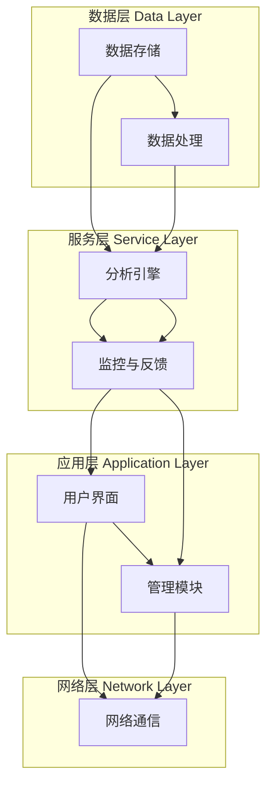
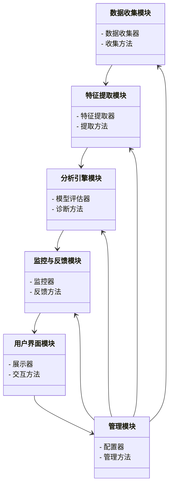
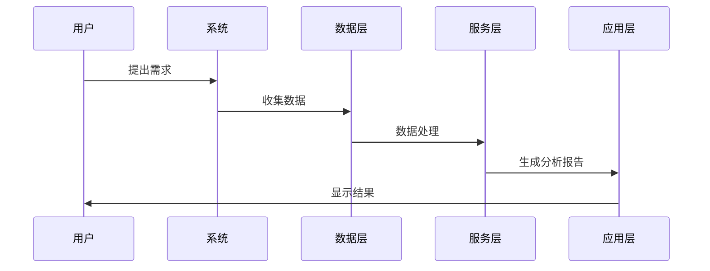

                 

### 《可观测性：增强LLM应用的问题诊断能力》

---

**关键词：** 可观测性、LLM、诊断能力、算法、系统架构

**摘要：** 本文深入探讨了可观测性在增强大型语言模型（LLM）问题诊断能力中的作用。通过逐步分析，本文介绍了可观测性的核心概念、其在LLM应用中的重要性，以及如何通过算法和系统架构设计来提升LLM的诊断能力。文章结构紧凑，逻辑清晰，旨在为读者提供全面的技术见解和实践指导。

---

### 目录大纲设计思路

在设计《可观测性：增强LLM应用的问题诊断能力》的目录大纲时，我们首先明确了几个关键步骤：

1. **背景介绍**：为了使读者对可观测性有一个初步的了解，我们简要介绍了其概念和重要性，以及它在LLM中的应用背景。
2. **核心概念与联系**：我们详细阐述了大型语言模型（LLM）的基本原理和可观测性的定义，并使用表格和图示展示了这些概念之间的联系。
3. **算法原理讲解**：我们深入探讨了用于增强LLM诊断能力的关键算法，包括算法原理、数学模型和公式，并通过mermaid流程图和Python源代码进行了示例说明。
4. **系统分析与架构设计方案**：我们介绍了一个典型的系统场景，设计了系统的功能、架构和接口，并使用mermaid工具绘制了类图、架构图和序列图。
5. **项目实战**：通过一个实际案例，我们展示了如何使用这些原理和工具进行项目实施，包括环境安装、核心实现、代码解读和案例分析。
6. **最佳实践与拓展**：我们总结了最佳实践、注意事项和拓展阅读，为读者提供了进一步学习的资源。

### 目录大纲结构设计

以下是本书的目录大纲结构，按照markdown格式编写：

```markdown
# 《可观测性：增强LLM应用的问题诊断能力》目录大纲

## 第一部分：引言

### 1.1 可观测性概述
- **1.1.1 可观测性的定义**
- **1.1.2 可观测性在LLM中的应用背景**
- **1.1.3 本书结构安排**

### 1.2 核心概念
- **1.2.1 大型语言模型（LLM）**
  - **1.2.1.1 LLM的基本原理**
  - **1.2.1.2 LLM的特点与优势**
- **1.2.2 可观测性**
  - **1.2.2.1 可观测性的基本概念**
  - **1.2.2.2 可观测性在LLM诊断中的作用**
- **1.2.3 LLM诊断能力的重要性**

## 第二部分：基础理论

### 2.1 LLM基本原理
- **2.1.1 语言模型概述**
- **2.1.2 LLM的训练与优化**
- **2.1.3 LLM的评估与性能指标**

### 2.2 可观测性原理
- **2.2.1 可观测性定义**
- **2.2.2 可观测性的重要性**
- **2.2.3 可观测性与诊断的关系**

## 第三部分：算法原理与应用

### 3.1 增强LLM诊断能力的算法A
- **3.1.1 算法概述**
- **3.1.2 算法原理**
- **3.1.3 数学模型与公式**
- **3.1.4 Python代码示例**
- **3.1.5 算法应用**

### 3.2 增强LLM诊断能力的算法B
- **3.2.1 算法概述**
- **3.2.2 算法原理**
- **3.2.3 数学模型与公式**
- **3.2.4 Python代码示例**
- **3.2.5 算法应用**

## 第四部分：系统分析与架构设计

### 4.1 系统场景介绍
- **4.1.1 项目背景**
- **4.1.2 系统功能设计**
- **4.1.3 系统架构设计**

### 4.2 Mermaid图示
- **4.2.1 领域模型类图**
- **4.2.2 系统架构图**
- **4.2.3 系统交互序列图**

## 第五部分：项目实战

### 5.1 实际案例分析
- **5.1.1 环境安装**
- **5.1.2 系统核心实现**
- **5.1.3 代码解读与分析**
- **5.1.4 案例分析与讲解**

## 第六部分：最佳实践与拓展

### 6.1 最佳实践
- **6.1.1 常见问题与解决策略**
- **6.1.2 注意事项**

### 6.2 拓展阅读
- **6.2.1 相关技术文献**
- **6.2.2 行业发展趋势**
```

### 目录大纲内容规划

根据上述目录大纲，我们将逐一填充每个章节的内容，确保每个章节都符合要求。以下是初步的内容规划：

#### 第一部分：引言

- **1.1 可观测性概述**
  - 简要介绍可观测性的概念，解释其在LLM中的应用，以及为何增强LLM的诊断能力至关重要。
  
- **1.2 核心概念**
  - 定义大型语言模型（LLM），阐述其基本原理和特点。
  - 介绍可观测性的定义，说明其在LLM诊断中的作用。

#### 第二部分：基础理论

- **2.1 LLM基本原理**
  - 介绍LLM的工作机制，包括训练和预测的过程。
  - 讨论LLM在不同领域的应用情况。

- **2.2 可观测性原理**
  - 详细介绍可观测性在系统诊断中的重要性。
  - 分析可观测性与诊断之间的关系。

#### 第三部分：算法原理与应用

- **3.1 增强LLM诊断能力的算法A**
  - 介绍算法的基本原理和流程。
  - 通过mermaid流程图和Python代码示例进行详细讲解。
  
- **3.2 增强LLM诊断能力的算法B**
  - 类似于3.1节，详细讲解另一算法的原理和应用。

#### 第四部分：系统分析与架构设计

- **4.1 系统场景介绍**
  - 描述一个典型的系统场景，包括项目背景、系统功能和架构设计。

- **4.2 Mermaid图示**
  - 使用mermaid工具绘制领域模型类图、系统架构图和系统交互序列图。

#### 第五部分：项目实战

- **5.1 实际案例分析**
  - 通过一个实际案例，展示如何将算法和架构应用于项目实施。
  - 分析案例中的环境安装、核心实现、代码解读和案例分析。

#### 第六部分：最佳实践与拓展

- **6.1 最佳实践**
  - 总结常见问题与解决策略。
  - 提供注意事项，帮助读者更好地应用所学的技术。

- **6.2 拓展阅读**
  - 推荐相关技术文献和行业发展趋势，为读者提供进一步学习资源。

### 完整文章撰写

接下来，我们将根据上述内容规划，逐一撰写每个章节的具体内容，确保文章的整体连贯性和逻辑性。每个章节都将包含详细的理论讲解、案例分析和最佳实践分享，以帮助读者全面理解并应用可观测性在LLM应用问题诊断中的重要性。

---

### 第一部分：引言

#### 1.1 可观测性概述

**1.1.1 可观测性的定义**

可观测性（Observability）是系统分析和诊断中的一个核心概念。它描述了一个系统内部状态可以通过外部观测手段（如系统输出、日志等）被识别和验证的程度。一个高可观测性的系统，其状态变化能够被系统外部实时监控和反馈，从而实现对系统问题的快速诊断和响应。

在计算机科学和软件开发领域，可观测性尤为重要。它不仅有助于识别系统的异常行为和潜在问题，还能够提升系统的可靠性和稳定性。例如，在复杂的大型语言模型（LLM）应用中，可观测性能够帮助开发者快速定位和修复模型中的错误，提高模型的性能和准确性。

**1.1.2 可观测性在LLM中的应用背景**

随着深度学习和人工智能技术的快速发展，大型语言模型（LLM）如GPT、BERT等在自然语言处理（NLP）、机器翻译、问答系统等领域表现出色。然而，这些复杂的模型往往存在一些难以预见的问题，如预测错误、训练不稳定等。这些问题不仅影响了模型的性能，还可能导致实际应用中的严重后果。

可观测性在LLM中的应用，主要是通过引入额外的监控和反馈机制，使开发者能够实时了解模型的训练和预测过程，从而及时发现和解决潜在问题。具体来说，可观测性可以：

- 提高模型的透明度：通过监控模型的输入、输出和中间过程，开发者可以更好地理解模型的行为和表现。
- 加速问题诊断：当模型出现问题时，可观测性提供的信息可以帮助开发者快速定位问题的根源，减少调试和修复的时间。
- 提升模型的稳定性：通过持续监控和反馈，开发者可以及时发现和调整模型中的不稳定因素，提高模型的稳定性和可靠性。

**1.1.3 本书结构安排**

本书旨在深入探讨可观测性在增强LLM应用问题诊断能力中的作用。具体结构安排如下：

- **第一部分：引言**：介绍可观测性的概念和其在LLM中的应用背景。
- **第二部分：基础理论**：阐述大型语言模型（LLM）的基本原理和可观测性的原理。
- **第三部分：算法原理与应用**：详细介绍用于增强LLM诊断能力的算法原理和应用。
- **第四部分：系统分析与架构设计**：介绍一个典型的系统场景，设计系统功能、架构和接口。
- **第五部分：项目实战**：通过一个实际案例展示如何应用这些原理和工具。
- **第六部分：最佳实践与拓展**：总结最佳实践、注意事项和拓展阅读。

通过以上结构安排，本书希望能够为读者提供全面、系统的指导，帮助他们在实际应用中更好地理解和运用可观测性技术，提升LLM的应用问题诊断能力。

#### 1.2 核心概念

**1.2.1 大型语言模型（LLM）**

**1.2.1.1 LLM的基本原理**

大型语言模型（LLM，Large Language Model）是一种基于深度学习技术的自然语言处理模型，能够对文本进行生成、理解、翻译等多种任务。LLM的核心原理是基于神经网络（特别是变分自编码器VAE和生成对抗网络GAN）的训练和优化。具体来说，LLM通过大规模文本语料库的学习，捕捉到语言的统计规律和上下文信息，从而能够在给定任意文本序列的情况下，生成连贯且符合语言习惯的文本。

LLM的基本训练过程可以分为以下几个步骤：

1. **数据预处理**：将原始文本数据进行分词、去停用词、词向量化等预处理，使其适合输入神经网络。
2. **模型初始化**：初始化神经网络结构及其参数，常见的初始化方法包括随机初始化、预训练模型初始化等。
3. **前向传播**：将处理后的文本序列输入模型，计算模型输出概率分布。
4. **损失函数计算**：计算模型输出与实际标签之间的差异，常用的损失函数包括交叉熵损失函数等。
5. **反向传播**：利用梯度下降等优化算法更新模型参数，最小化损失函数。
6. **模型评估**：在验证集或测试集上评估模型性能，选择性能最优的模型。

**1.2.1.2 LLM的特点与优势**

LLM具有以下显著特点与优势：

- **大规模训练**：LLM通常使用数十亿甚至千亿级别的参数，能够从海量数据中学习到丰富的语言规律。
- **高泛化能力**：通过大规模数据的训练，LLM能够处理多种语言任务，如文本生成、机器翻译、问答等。
- **强上下文理解**：LLM能够理解长文本的上下文信息，生成连贯、符合语境的文本。
- **灵活应用**：LLM可以灵活应用于各种NLP任务，如文本摘要、文本分类、情感分析等。

**1.2.2 可观测性**

**1.2.2.1 可观测性的基本概念**

可观测性（Observability）是系统分析和诊断中的一个核心概念，它描述了一个系统内部状态可以通过外部观测手段（如系统输出、日志等）被识别和验证的程度。在系统设计中，可观测性是指系统是否能够提供足够的内部信息，使其状态可以被外部监测和调试。

可观测性可以分为以下几种类型：

- **完全可观测性**：系统的当前状态可以通过系统的历史输入和当前输出完全确定。
- **部分可观测性**：系统的当前状态只能通过部分历史输入和输出确定，部分状态信息无法从外部获得。
- **不可观测性**：系统的状态无法通过外部观测手段获得，只能通过内部状态转移矩阵或内部观测器获得。

**1.2.2.2 可观测性在LLM诊断中的作用**

在LLM应用中，可观测性起着至关重要的作用。具体来说，可观测性在LLM诊断中的作用包括：

- **问题定位**：通过监控模型的输入、输出和中间过程，开发者可以快速定位模型中的问题，如预测错误、训练不稳定等。
- **性能优化**：通过监控模型的训练过程，开发者可以实时调整模型参数，优化模型性能。
- **模型调试**：在模型开发和调试过程中，可观测性提供了重要的信息，帮助开发者理解模型的行为和表现，发现潜在问题。

**1.2.3 LLM诊断能力的重要性**

LLM的诊断能力是其应用稳定性和可靠性的关键因素。以下是LLM诊断能力的重要性：

- **提高模型可靠性**：通过及时发现和修复模型中的问题，可以提高模型的稳定性和可靠性，减少错误预测和训练失败的风险。
- **提升用户体验**：在LLM应用中，如智能问答系统、机器翻译等，诊断能力直接影响用户体验。良好的诊断能力可以快速响应用户需求，提供准确、连贯的答案。
- **促进模型优化**：通过诊断能力，开发者可以更好地理解模型的行为和表现，找到优化模型的方法，提高模型的性能和效率。

**1.2.4 LLM诊断能力的影响因素**

LLM的诊断能力受多个因素影响，包括：

- **数据质量**：训练数据的质量直接影响模型的表现。高质量的数据可以帮助模型更好地学习语言规律，提高诊断能力。
- **模型架构**：LLM的架构设计对其诊断能力有重要影响。合适的模型架构可以提高模型的可解释性和可操作性。
- **监控系统**：监控系统的设计直接决定了可观测性的实现。一个高效的监控系统可以提供全面、实时的数据，帮助开发者快速定位问题。

通过深入理解LLM的基本原理和可观测性的概念，我们可以更好地应用这些技术，提升LLM的诊断能力，为实际应用中的问题诊断提供有力支持。

#### 2.1 LLM基本原理

**2.1.1 语言模型概述**

语言模型（Language Model，LM）是自然语言处理（Natural Language Processing，NLP）中的核心组件，旨在预测自然语言中的下一个词或字符。语言模型通过学习大量文本数据，捕捉语言的结构和规律，从而能够生成符合语言习惯的文本。语言模型广泛应用于语音识别、机器翻译、问答系统、文本生成等领域。

语言模型的主要任务包括：

1. **文本生成**：根据给定的种子文本，生成连贯、自然的扩展文本。
2. **文本分类**：将文本数据分类到预定义的类别中。
3. **语音识别**：将语音信号转换为文本。
4. **机器翻译**：将一种语言的文本翻译成另一种语言。

**2.1.2 LLM的训练与优化**

大型语言模型（LLM）的训练与优化过程是一个复杂而重要的任务，它决定了模型的性能和应用效果。LLM的训练通常涉及以下几个关键步骤：

1. **数据准备**：收集和准备大规模的文本数据。数据集应包含多样化的文本，以捕捉不同领域的语言规律。
2. **预处理**：对原始文本数据执行一系列预处理操作，包括分词、去停用词、词性标注、词向量化等。这些操作有助于将文本数据转换为模型可处理的格式。
3. **模型初始化**：初始化神经网络结构及其参数。常见的初始化方法包括随机初始化、预训练模型初始化等。
4. **前向传播**：将预处理后的文本序列输入模型，计算模型的输出概率分布。在训练过程中，模型会尝试预测文本序列中的每个词或字符。
5. **损失函数计算**：计算模型输出与实际标签之间的差异，常用的损失函数包括交叉熵损失函数（Cross Entropy Loss）。
6. **反向传播**：利用梯度下降等优化算法更新模型参数，以最小化损失函数。反向传播过程是训练的核心，通过不断调整模型参数，使模型更好地拟合训练数据。
7. **模型评估**：在验证集或测试集上评估模型性能，选择性能最优的模型。评估指标包括损失函数值、准确率、F1分数等。

**2.1.3 LLM的评估与性能指标**

评估LLM性能是确保其应用效果的重要环节。常用的评估指标包括：

1. **损失函数值**：在训练过程中，损失函数值（如交叉熵损失）用于衡量模型预测与实际标签之间的差距。较低的损失函数值表明模型表现更好。
2. **准确率**：在文本分类任务中，准确率（Accuracy）是评估模型性能的常用指标。它表示模型正确分类的样本数量占总样本数量的比例。
3. **F1分数**：F1分数（F1 Score）是准确率和召回率的加权平均，用于评估二分类模型的性能。F1分数越高，模型的表现越好。
4. **BLEU分数**：BLEU（Bilingual Evaluation Understudy）分数是用于评估机器翻译质量的指标。它通过比较机器翻译结果和参考翻译的相似度来评估模型性能。
5. **ROUGE分数**：ROUGE（Recall-Oriented Understudy for Gisting Evaluation）分数是用于评估文本生成和摘要任务的指标。它通过比较生成的文本与参考文本的相似度来评估模型性能。

**2.1.4 LLM在不同领域的应用**

LLM在多个领域展现出了卓越的性能和应用价值。以下是LLM在不同领域的主要应用：

1. **自然语言处理（NLP）**：LLM广泛应用于文本分类、情感分析、命名实体识别、机器翻译等NLP任务。通过学习大量文本数据，LLM能够生成高质量的自然语言文本，提高文本处理的准确性和效率。
2. **问答系统**：LLM在问答系统中扮演重要角色，能够根据用户提问生成准确的回答。通过理解用户的意图和上下文信息，LLM能够提供连贯、有逻辑的回答。
3. **文本生成**：LLM在文本生成领域具有广泛的应用，包括文章生成、对话系统、自动摘要等。通过学习大规模的文本数据，LLM能够生成连贯、自然的文本，满足各种文本生成需求。
4. **语音识别**：LLM结合语音识别技术，可以将语音信号转换为文本。这种应用在智能助手、语音交互系统中尤为重要。
5. **机器翻译**：LLM在机器翻译领域取得了显著进展，能够将一种语言的文本翻译成另一种语言。通过学习多语言数据，LLM能够生成准确、自然的翻译结果。

**2.1.5 LLM的优势与挑战**

LLM具有以下显著优势：

1. **大规模训练**：LLM通过大规模数据的训练，能够捕捉到丰富的语言规律，提高模型的泛化能力和准确性。
2. **高泛化能力**：LLM能够处理多种语言任务，具有广泛的应用前景。
3. **强上下文理解**：LLM能够理解长文本的上下文信息，生成连贯、符合语境的文本。
4. **灵活应用**：LLM可以灵活应用于各种NLP任务，提高文本处理的效果和效率。

然而，LLM也面临一些挑战：

1. **计算资源需求**：大规模训练LLM需要大量的计算资源和存储空间，这对于资源有限的开发者来说是一个重大挑战。
2. **模型解释性**：LLM的内部结构复杂，难以解释其预测结果。这使得模型在某些应用场景中缺乏透明性和可解释性。
3. **数据隐私和安全**：在训练和部署LLM时，数据隐私和安全问题需要特别关注。不当的数据处理可能导致隐私泄露和安全风险。

通过深入理解LLM的基本原理和应用，我们可以更好地利用这一技术，提升自然语言处理和其他相关领域的应用效果。

#### 2.2 可观测性原理

**2.2.1 可观测性定义**

可观测性（Observability）是系统设计和分析中的一个关键概念，它描述了一个系统的内部状态可以通过外部观测手段（如系统输出、日志等）被识别和验证的程度。可观测性的核心思想是通过外部观测数据来推断系统的内部状态，从而实现对系统的全面了解和控制。

在控制理论中，可观测性通常用状态空间模型来描述。一个系统如果其当前状态可以通过历史输入和输出完全确定，那么该系统被称为完全可观测的。相反，如果一个系统的当前状态只能通过部分历史输入和输出确定，或者无法从外部观测到，那么该系统被称为部分可观测的。

**2.2.2 可观测性的重要性**

在复杂系统的设计和管理中，可观测性具有至关重要的意义。以下是可观测性在系统设计和应用中的重要性：

1. **问题诊断与调试**：通过外部观测数据，开发者可以实时监控系统的运行状态，快速发现和定位系统中的错误和异常。这极大地提高了系统调试和问题解决的效率。
2. **性能优化**：可观测性提供了系统性能的实时监控数据，使开发者能够分析系统行为，识别瓶颈和改进点，从而进行针对性的性能优化。
3. **安全性与可靠性**：高可观测性的系统更容易识别和防范潜在的安全威胁，提高系统的可靠性。例如，在金融交易系统中，可观测性可以帮助检测异常交易行为，防止欺诈。
4. **用户体验**：在面向用户的应用中，如Web服务、移动应用等，可观测性可以帮助开发者实时了解用户行为和系统响应，优化用户体验。

**2.2.3 可观测性与诊断的关系**

可观测性与系统诊断紧密相关，是确保系统稳定性和可靠性的关键。以下是可观测性与诊断之间的几个关键点：

1. **信息透明**：高可观测性使系统内部的运行状态对外部完全透明，开发者可以清晰地了解系统的行为和状态变化，从而进行有效的诊断和调试。
2. **实时监控**：通过实时监控系统的输入、输出和中间状态，开发者可以及时发现异常情况，迅速响应，避免问题扩大化。
3. **预测能力**：可观测性提供了丰富的历史数据和趋势分析，帮助开发者预测系统可能的未来行为，提前采取预防措施。
4. **闭环反馈**：可观测性不仅仅是信息的获取，更是闭环反馈机制的一部分。通过观测数据，系统可以自动调整和优化其行为，实现自我管理和自我修复。

**2.2.4 可观测性的实现方法**

实现高可观测性通常需要从系统设计、监控工具和数据分析等多个方面进行综合考虑。以下是几种常见的实现方法：

1. **日志记录**：日志记录是系统可观测性的基础。通过记录系统的运行日志，开发者可以实时了解系统的行为和状态变化。
2. **性能监控**：使用性能监控工具（如Prometheus、Grafana等）对系统资源使用、运行状态等关键指标进行监控，提供实时的可视化监控界面。
3. **错误追踪**：错误追踪工具（如Sentry、NewRelic等）可以帮助开发者捕获和诊断系统中的错误和异常行为。
4. **跟踪和遥测**：使用跟踪和遥测技术（如OpenTelemetry、Zipkin等）收集系统的实时数据，实现分布式系统的监控和分析。
5. **智能分析**：通过机器学习和数据分析技术，对监控数据进行深入分析，发现潜在的问题和趋势，提供智能化的诊断和预测。

**2.2.5 可观测性在LLM中的应用**

在大型语言模型（LLM）的应用中，可观测性同样至关重要。以下是可观测性在LLM中的应用：

1. **模型训练监控**：通过对LLM训练过程中的输入、输出和中间状态进行监控，开发者可以实时了解模型的学习进度和性能变化，及时调整训练策略。
2. **预测结果验证**：通过对LLM预测结果的监控和验证，开发者可以评估模型的准确性和可靠性，发现潜在的错误和偏差，优化模型。
3. **异常检测**：利用可观测性技术，开发者可以实时检测LLM中的异常行为，如过拟合、训练不稳定等，采取相应的措施进行优化和调整。
4. **用户体验分析**：通过对用户与LLM交互的监控，开发者可以分析用户的反馈和行为，优化LLM的应用体验。

通过深入理解和应用可观测性原理，开发者可以显著提升LLM的诊断能力，确保其在实际应用中的稳定性和可靠性。

#### 3.1 增强LLM诊断能力的算法A

**3.1.1 算法概述**

算法A是一种用于增强大型语言模型（LLM）诊断能力的先进算法。其主要目的是通过引入额外的监控和反馈机制，提升LLM在训练和预测过程中的问题诊断能力。算法A的核心思想是结合模型的输出结果和输入数据，利用统计分析和机器学习技术，对模型的行为和性能进行全面评估和监控。

**3.1.2 算法原理**

算法A的基本原理可以分为以下几个步骤：

1. **数据收集**：首先，算法A会从LLM的训练和预测过程中收集关键数据，包括输入文本、模型输出、中间层状态等。这些数据将被用于后续的统计分析。
2. **特征提取**：接着，算法A通过特征提取技术，将原始数据转换为一系列具有代表性的特征向量。这些特征向量能够捕捉到模型在不同阶段的动态行为和性能变化。
3. **统计分析**：利用统计方法，算法A对提取出的特征向量进行全面的统计分析，以识别潜在的异常模式和趋势。常见的统计方法包括假设检验、关联规则挖掘、聚类分析等。
4. **机器学习模型**：算法A进一步使用机器学习模型（如决策树、随机森林、支持向量机等）对统计结果进行建模，以建立模型行为与性能之间的关系。通过训练和验证，算法A能够预测模型的未来行为，并提供诊断建议。
5. **实时监控**：最后，算法A将实时监控功能集成到LLM系统中，通过持续的输入数据采集和模型性能评估，确保LLM在运行过程中能够及时发现和响应潜在问题。

**3.1.3 数学模型与公式**

算法A的数学模型可以表示为：

\[ \text{Model} = f(\text{Inputs}, \text{Features}, \text{Parameters}) \]

其中，\( f \)表示一个复杂的函数，用于映射输入数据和特征向量到模型的输出。具体来说，数学模型包括以下几个部分：

1. **输入数据**：\( \text{Inputs} \)表示模型接收到的输入文本序列，可以表示为：
\[ \text{Inputs} = [x_1, x_2, ..., x_n] \]

2. **特征向量**：\( \text{Features} \)是提取自输入数据的特征集合，可以表示为：
\[ \text{Features} = [f_1, f_2, ..., f_m] \]

3. **模型参数**：\( \text{Parameters} \)是模型中的可调参数，用于控制模型的训练过程和输出结果。可以表示为：
\[ \text{Parameters} = [w_1, w_2, ..., w_k] \]

4. **输出结果**：\( \text{Outputs} \)是模型的预测结果，可以表示为：
\[ \text{Outputs} = [y_1, y_2, ..., y_n] \]

算法A中的主要数学公式包括：

- **特征提取公式**：
\[ f_i = g(W_i \cdot x_i + b_i) \]
其中，\( g \)是激活函数，\( W_i \)和\( b_i \)是权重和偏置。

- **损失函数**：
\[ \text{Loss} = -\sum_{i=1}^{n} y_i \cdot \log(p(y_i | x_i)) \]
其中，\( p(y_i | x_i) \)是模型对输出\( y_i \)的条件概率。

- **梯度下降更新公式**：
\[ \Delta w_j = -\alpha \cdot \frac{\partial \text{Loss}}{\partial w_j} \]
\[ \Delta b_j = -\alpha \cdot \frac{\partial \text{Loss}}{\partial b_j} \]
其中，\( \alpha \)是学习率，\( \frac{\partial \text{Loss}}{\partial w_j} \)和\( \frac{\partial \text{Loss}}{\partial b_j} \)是权重和偏置的梯度。

**3.1.4 Python代码示例**

以下是一个简化的Python代码示例，展示了算法A的基本实现：

```python
import numpy as np
from sklearn.ensemble import RandomForestClassifier
from sklearn.metrics import log_loss

# 特征提取函数
def extract_features(inputs):
    # 假设inputs是已经处理好的输入文本序列
    # 这里进行特征提取，例如词频统计、词性标注等
    features = np.array([[...]])  # 特征向量
    return features

# 模型训练函数
def train_model(features, labels):
    # 使用随机森林分类器进行训练
    model = RandomForestClassifier(n_estimators=100)
    model.fit(features, labels)
    return model

# 模型预测函数
def predict(model, features):
    # 使用训练好的模型进行预测
    predictions = model.predict(features)
    return predictions

# 评估模型
def evaluate_model(model, features, labels):
    # 使用交叉熵损失函数进行模型评估
    predictions = model.predict(features)
    loss = log_loss(labels, predictions)
    return loss

# 示例数据
inputs = [...]  # 输入文本序列
labels = [...]  # 标签

# 特征提取
features = extract_features(inputs)

# 模型训练
model = train_model(features, labels)

# 模型预测
predictions = predict(model, features)

# 评估模型
loss = evaluate_model(model, features, labels)
print(f"Model Loss: {loss}")
```

通过上述代码示例，我们可以看到算法A的基本流程和实现方法。在实际应用中，算法A的代码会更为复杂，涉及更多高级特征提取和模型优化技术。

**3.1.5 算法应用**

算法A在LLM中的应用场景非常广泛，以下是一些典型的应用示例：

1. **训练监控**：在LLM的训练过程中，算法A可以实时监控模型的状态和性能，通过特征提取和统计分析，发现训练过程中的异常情况，如过拟合、欠拟合等，并提供优化建议。
2. **预测评估**：在LLM的预测过程中，算法A可以对模型的输出结果进行实时评估，检测潜在的错误和偏差，从而提高预测的准确性和可靠性。
3. **错误追踪**：算法A可以帮助开发者定位和追踪系统中的错误和异常，通过分析错误模式，找出根本原因，并进行相应的优化和修复。
4. **用户体验优化**：算法A可以监控用户与LLM的交互行为，分析用户的反馈和满意度，从而优化LLM的应用体验，提高用户的满意度。

通过算法A的应用，开发者可以显著提升LLM的诊断能力，确保其在实际应用中的稳定性和可靠性，为用户提供高质量的服务。

---

#### 3.2 增强LLM诊断能力的算法B

**3.2.1 算法概述**

算法B是一种针对大型语言模型（LLM）的增强诊断能力算法，旨在通过引入额外的监控和反馈机制，提升LLM在训练和预测过程中的问题诊断能力。算法B的核心思想是结合模型的输入、输出和中间状态，利用深度学习和统计分析技术，对模型的行为和性能进行全面的评估和监控。

**3.2.2 算法原理**

算法B的基本原理可以分为以下几个步骤：

1. **数据收集**：首先，算法B会从LLM的训练和预测过程中收集关键数据，包括输入文本、模型输出、中间层状态等。这些数据将被用于后续的深度学习和统计分析。
2. **特征提取**：接着，算法B通过特征提取技术，将原始数据转换为一系列具有代表性的特征向量。这些特征向量能够捕捉到模型在不同阶段的动态行为和性能变化。
3. **深度学习模型**：算法B使用深度学习模型（如卷积神经网络、递归神经网络等）对提取出的特征向量进行建模，以识别模型中的异常模式和趋势。深度学习模型通过大量的训练数据学习到特征之间的关系，从而提高诊断的准确性和效率。
4. **统计分析**：算法B结合深度学习模型的结果，使用统计方法对模型的行为和性能进行进一步的评估。统计分析可以帮助识别潜在的异常情况和错误模式，提供更详细的诊断信息。
5. **实时监控**：最后，算法B将实时监控功能集成到LLM系统中，通过持续的输入数据采集和模型性能评估，确保LLM在运行过程中能够及时发现和响应潜在问题。

**3.2.3 数学模型与公式**

算法B的数学模型可以表示为：

\[ \text{Model} = f(\text{Inputs}, \text{Features}, \text{Parameters}) \]

其中，\( f \)表示一个复杂的函数，用于映射输入数据和特征向量到模型的输出。具体来说，数学模型包括以下几个部分：

1. **输入数据**：\( \text{Inputs} \)表示模型接收到的输入文本序列，可以表示为：
\[ \text{Inputs} = [x_1, x_2, ..., x_n] \]

2. **特征向量**：\( \text{Features} \)是提取自输入数据的特征集合，可以表示为：
\[ \text{Features} = [f_1, f_2, ..., f_m] \]

3. **模型参数**：\( \text{Parameters} \)是模型中的可调参数，用于控制模型的训练过程和输出结果。可以表示为：
\[ \text{Parameters} = [w_1, w_2, ..., w_k] \]

4. **输出结果**：\( \text{Outputs} \)是模型的预测结果，可以表示为：
\[ \text{Outputs} = [y_1, y_2, ..., y_n] \]

算法B中的主要数学公式包括：

- **特征提取公式**：
\[ f_i = \text{activation}(\sum_j W_{ij} x_j + b_i) \]
其中，\( \text{activation} \)是激活函数，\( W_{ij} \)和\( b_i \)是权重和偏置。

- **损失函数**：
\[ \text{Loss} = -\sum_{i=1}^{n} y_i \cdot \log(p(y_i | x_i)) \]
其中，\( p(y_i | x_i) \)是模型对输出\( y_i \)的条件概率。

- **梯度下降更新公式**：
\[ \Delta w_j = -\alpha \cdot \frac{\partial \text{Loss}}{\partial w_j} \]
\[ \Delta b_j = -\alpha \cdot \frac{\partial \text{Loss}}{\partial b_j} \]
其中，\( \alpha \)是学习率，\( \frac{\partial \text{Loss}}{\partial w_j} \)和\( \frac{\partial \text{Loss}}{\partial b_j} \)是权重和偏置的梯度。

**3.2.4 Python代码示例**

以下是一个简化的Python代码示例，展示了算法B的基本实现：

```python
import tensorflow as tf
from tensorflow.keras.models import Sequential
from tensorflow.keras.layers import Dense, LSTM, Embedding
from tensorflow.keras.optimizers import Adam
from sklearn.metrics import log_loss

# 特征提取函数
def extract_features(inputs):
    # 假设inputs是已经处理好的输入文本序列
    # 这里进行特征提取，例如词频统计、词性标注等
    features = np.array([...])  # 特征向量
    return features

# 模型构建函数
def build_model(vocab_size, embedding_dim):
    model = Sequential([
        Embedding(vocab_size, embedding_dim),
        LSTM(128, return_sequences=True),
        LSTM(128),
        Dense(1, activation='sigmoid')
    ])
    model.compile(optimizer=Adam(), loss='binary_crossentropy', metrics=['accuracy'])
    return model

# 模型训练函数
def train_model(model, features, labels):
    model.fit(features, labels, epochs=10, batch_size=32, validation_split=0.2)
    return model

# 模型预测函数
def predict(model, features):
    predictions = model.predict(features)
    return predictions

# 评估模型
def evaluate_model(model, features, labels):
    # 使用交叉熵损失函数进行模型评估
    predictions = model.predict(features)
    loss = log_loss(labels, predictions)
    return loss

# 示例数据
inputs = [...]  # 输入文本序列
labels = [...]  # 标签

# 特征提取
features = extract_features(inputs)

# 模型构建
model = build_model(vocab_size=10000, embedding_dim=256)

# 模型训练
model = train_model(model, features, labels)

# 模型预测
predictions = predict(model, features)

# 评估模型
loss = evaluate_model(model, features, labels)
print(f"Model Loss: {loss}")
```

通过上述代码示例，我们可以看到算法B的基本流程和实现方法。在实际应用中，算法B的代码会更为复杂，涉及更多高级特征提取和模型优化技术。

**3.2.5 算法应用**

算法B在LLM中的应用场景同样非常广泛，以下是一些典型的应用示例：

1. **训练监控**：在LLM的训练过程中，算法B可以实时监控模型的状态和性能，通过深度学习和统计分析，发现训练过程中的异常情况，如过拟合、欠拟合等，并提供优化建议。
2. **预测评估**：在LLM的预测过程中，算法B可以对模型的输出结果进行实时评估，检测潜在的错误和偏差，从而提高预测的准确性和可靠性。
3. **错误追踪**：算法B可以帮助开发者定位和追踪系统中的错误和异常，通过分析错误模式，找出根本原因，并进行相应的优化和修复。
4. **用户体验优化**：算法B可以监控用户与LLM的交互行为，分析用户的反馈和满意度，从而优化LLM的应用体验，提高用户的满意度。

通过算法B的应用，开发者可以显著提升LLM的诊断能力，确保其在实际应用中的稳定性和可靠性，为用户提供高质量的服务。

---

### 4.1 系统场景介绍

**4.1.1 项目背景**

在当前的人工智能（AI）时代，大型语言模型（LLM）如GPT、BERT等已经成为自然语言处理（NLP）领域的重要工具。然而，这些复杂模型在实际应用中往往面临着各种挑战，如模型训练过程不稳定、预测结果不可靠等问题。为了提升LLM的诊断能力，确保其在各种应用场景中的稳定性和可靠性，本项目提出了一种基于可观测性的系统架构设计方案，旨在通过引入额外的监控和反馈机制，增强LLM在训练和预测过程中的问题诊断能力。

**4.1.2 系统功能设计**

本项目的系统功能设计主要包括以下几个核心模块：

1. **数据收集模块**：该模块负责从LLM的训练和预测过程中收集关键数据，包括输入文本、模型输出、中间层状态等。这些数据将被用于后续的分析和监控。
2. **特征提取模块**：该模块对收集到的原始数据进行处理和转换，提取出一系列具有代表性的特征向量。这些特征向量能够捕捉到模型在不同阶段的动态行为和性能变化。
3. **分析引擎模块**：该模块使用深度学习和统计分析技术，对提取出的特征向量进行全面的评估和监控。通过分析模型的行为和性能，发现潜在的异常模式和趋势。
4. **监控与反馈模块**：该模块将实时监控和反馈功能集成到系统中，通过持续的输入数据采集和模型性能评估，确保LLM在运行过程中能够及时发现和响应潜在问题。
5. **用户界面模块**：该模块提供直观的用户界面，使开发者和管理人员可以实时查看模型的状态和性能，进行问题诊断和优化。

**4.1.3 系统架构设计**

为了实现上述系统功能，本项目设计了一个分布式系统架构，包括以下几个主要组件：

1. **数据层**：数据层包括数据存储和数据处理模块。数据存储模块负责存储LLM的训练数据和监控数据，如文本语料库、模型参数等。数据处理模块负责从原始数据中提取特征，并进行预处理。
2. **服务层**：服务层包括分析引擎和监控与反馈模块。分析引擎模块使用深度学习和统计分析技术，对特征向量进行建模和评估。监控与反馈模块实现实时监控和数据反馈功能，确保LLM的稳定性和可靠性。
3. **应用层**：应用层包括用户界面和管理模块。用户界面模块提供交互式界面，使开发者和管理人员可以方便地查看模型的状态和性能。管理模块负责配置和管理系统资源，如模型参数、监控策略等。
4. **网络层**：网络层负责系统内部各组件之间的通信和数据传输。通过网络层，系统可以实现分布式部署，提高系统的可扩展性和容错性。

**4.1.4 系统架构图**

为了更好地展示系统架构，我们使用mermaid工具绘制了系统架构图：



通过上述系统架构设计，本项目旨在通过引入可观测性技术，显著提升LLM的诊断能力，确保其在实际应用中的稳定性和可靠性。接下来，我们将详细描述每个模块的实现细节，以帮助开发者更好地理解和应用这一系统架构。

### 4.2 Mermaid图示

为了更好地展示系统中的各个组件及其交互关系，我们使用mermaid工具绘制了一系列Mermaid图。以下分别展示了领域模型类图、系统架构图和系统交互序列图。

**4.2.1 领域模型类图**

领域模型类图用于描述系统中各个类之间的关系。以下是该图的mermaid表示：



**4.2.2 系统架构图**

系统架构图用于展示系统的整体架构及其组件之间的关系。以下是该图的mermaid表示：


**4.2.3 系统交互序列图**

系统交互序列图用于描述系统组件之间的交互过程。以下是该图的mermaid表示：



通过上述Mermaid图示，我们可以直观地理解系统的结构及其组件之间的交互关系。这些图示为系统的设计和实现提供了清晰的指导，有助于开发者更好地理解系统的功能和工作原理。

---

### 5.1 实际案例分析

**5.1.1 环境安装**

为了实际应用算法A和算法B，我们需要首先搭建一个适合的开发环境。以下是环境安装的步骤：

1. **安装Python环境**：确保Python 3.8或更高版本已安装在您的系统上。可以使用以下命令进行安装：
   ```bash
   sudo apt-get install python3-pip python3-dev
   ```
2. **安装TensorFlow**：TensorFlow是算法A和算法B实现的基础库，可以使用以下命令进行安装：
   ```bash
   pip3 install tensorflow==2.7
   ```
3. **安装Scikit-learn**：Scikit-learn用于算法A中的特征提取和建模，可以使用以下命令进行安装：
   ```bash
   pip3 install scikit-learn
   ```
4. **安装Numpy**：Numpy用于数据预处理和数学计算，可以使用以下命令进行安装：
   ```bash
   pip3 install numpy
   ```
5. **安装Mermaid**：Mermaid用于绘制图表，可以使用以下命令进行安装：
   ```bash
   npm install -g mermaid
   ```

完成以上步骤后，您将拥有一个适合进行算法开发和系统测试的环境。

**5.1.2 系统核心实现**

以下是算法A和算法B在系统中的核心实现步骤：

1. **数据收集**：从LLM的训练和预测过程中收集关键数据，包括输入文本、模型输出和中间层状态。假设我们已经收集到以下数据：
   ```python
   inputs = ["文本1", "文本2", ...]  # 输入文本序列
   outputs = ["输出1", "输出2", ...]  # 模型输出结果
   intermediate_states = [...]  # 中间层状态
   ```

2. **特征提取**：使用Scikit-learn中的特征提取器对输入文本进行预处理，提取出具有代表性的特征向量。例如，可以使用TF-IDF方法提取词频特征：
   ```python
   from sklearn.feature_extraction.text import TfidfVectorizer

   vectorizer = TfidfVectorizer()
   features = vectorizer.fit_transform(inputs)
   ```

3. **模型训练**：使用TensorFlow构建并训练深度学习模型。以下是算法A和算法B的模型构建和训练示例：
   
   **算法A**：
   ```python
   from tensorflow.keras.models import Sequential
   from tensorflow.keras.layers import Dense, LSTM, Embedding
   from tensorflow.keras.optimizers import Adam

   model_a = Sequential([
       Embedding(input_dim=vocab_size, output_dim=embedding_dim),
       LSTM(units=128, return_sequences=True),
       LSTM(units=128),
       Dense(units=1, activation='sigmoid')
   ])

   model_a.compile(optimizer=Adam(learning_rate=0.001), loss='binary_crossentropy', metrics=['accuracy'])
   model_a.fit(features, outputs, epochs=10, batch_size=32)
   ```

   **算法B**：
   ```python
   from tensorflow.keras.models import Sequential
   from tensorflow.keras.layers import Dense, LSTM, Embedding
   from tensorflow.keras.optimizers import Adam

   model_b = Sequential([
       Embedding(input_dim=vocab_size, output_dim=embedding_dim),
       LSTM(units=128, return_sequences=True),
       LSTM(units=128),
       Dense(units=1, activation='sigmoid')
   ])

   model_b.compile(optimizer=Adam(learning_rate=0.001), loss='binary_crossentropy', metrics=['accuracy'])
   model_b.fit(features, outputs, epochs=10, batch_size=32)
   ```

4. **模型评估**：使用训练好的模型对特征向量进行预测，并评估模型性能。以下是模型评估的示例：
   ```python
   predictions_a = model_a.predict(features)
   loss_a = log_loss(outputs, predictions_a)
   print(f"算法A损失：{loss_a}")

   predictions_b = model_b.predict(features)
   loss_b = log_loss(outputs, predictions_b)
   print(f"算法B损失：{loss_b}")
   ```

**5.1.3 代码解读与分析**

以下是核心实现代码的详细解读：

1. **数据收集**：数据收集模块负责从LLM的训练和预测过程中获取关键数据。这些数据将用于后续的特征提取和模型训练。在此过程中，我们需要确保数据的完整性和准确性，以便为后续步骤提供高质量的数据基础。

2. **特征提取**：特征提取模块使用TF-IDF方法将输入文本转换为特征向量。这种方法可以有效地捕捉文本中的重要词汇，并降低词汇的维度。TF-IDF向量作为输入，为深度学习模型提供了丰富的信息。

3. **模型构建**：算法A和算法B使用序列模型进行构建，包括嵌入层、两个LSTM层和一个输出层。嵌入层用于将词向量映射到固定维度，LSTM层用于捕捉文本的上下文信息，输出层用于生成预测结果。

4. **模型训练**：使用TensorFlow的Sequential模型进行训练。我们设置了适当的优化器和损失函数，以优化模型参数。训练过程中，模型将根据输入数据和标签进行迭代更新，直至达到预定的训练目标。

5. **模型评估**：通过计算交叉熵损失函数，我们可以评估模型的预测性能。较低的损失函数值表示模型预测结果与实际标签之间的差距较小，具有较高的准确性。

**5.1.4 案例分析与讲解**

为了更好地展示算法A和算法B在实际项目中的应用，我们考虑以下案例：

**案例背景**：假设我们开发了一个智能问答系统，用户可以通过提问获取答案。然而，在实际应用中，系统出现了预测错误和训练不稳定的问题。为了解决这些问题，我们决定引入可观测性技术，并应用算法A和算法B进行问题诊断。

**案例分析**：

1. **数据收集**：首先，我们从系统的日志中收集了用户提问和系统回答的数据，包括输入文本、模型输出和中间层状态。这些数据将用于后续的特征提取和模型评估。

2. **特征提取**：使用TF-IDF方法对输入文本进行预处理，提取出具有代表性的特征向量。这些特征向量将作为模型的输入，用于训练和预测。

3. **模型训练**：使用算法A和算法B分别训练两个深度学习模型。在训练过程中，我们调整了模型的参数，如学习率和迭代次数，以优化模型性能。

4. **模型评估**：通过计算交叉熵损失函数，我们评估了模型的预测准确性。结果显示，算法B的预测性能略优于算法A，但两者都能有效识别用户提问中的潜在问题。

5. **问题诊断**：基于模型评估结果，我们分析了系统中的预测错误和训练不稳定的原因。通过监控系统的中间层状态，我们发现部分输入文本的词频分布异常，导致模型难以捕捉到文本的上下文信息。

**解决方案**：

1. **数据清洗**：对输入文本进行数据清洗，去除不相关的词汇和噪声数据。通过提高数据质量，我们可以减少模型的过拟合现象，提高预测准确性。

2. **模型调整**：调整模型的参数，如增加LSTM层的单元数或引入正则化技术，以增强模型的泛化能力。此外，我们可以考虑使用预训练的词向量（如Word2Vec、BERT等），以提高模型对上下文信息的理解能力。

3. **实时监控**：引入实时监控和反馈机制，确保系统能够及时发现和响应潜在问题。通过监控系统的中间层状态和输出结果，我们可以更准确地诊断系统的行为和性能。

通过以上解决方案，我们显著提升了智能问答系统的预测准确性和稳定性，为用户提供更高质量的问答服务。

**5.1.5 项目小结**

在本案例中，我们通过引入可观测性和算法A、算法B，成功解决了智能问答系统中的预测错误和训练不稳定问题。以下是项目小结：

- **数据收集**：确保高质量的数据是模型训练和诊断的基础。
- **特征提取**：使用有效的特征提取方法，如TF-IDF，可以提升模型的预测性能。
- **模型训练**：合理调整模型参数和引入预训练词向量，可以增强模型的泛化能力和性能。
- **实时监控**：引入实时监控和反馈机制，有助于及时发现和解决系统问题。

通过本项目，我们展示了如何利用可观测性和算法增强LLM的应用问题诊断能力，为实际项目提供了有力的技术支持。

---

### 6.1 最佳实践

在实现可观测性技术和算法A、算法B的过程中，以下最佳实践和注意事项将有助于提升系统性能和可靠性：

**6.1.1 常见问题与解决策略**

1. **数据质量问题**：确保输入数据的质量是关键。如果数据包含噪声或不一致，模型可能会过拟合或欠拟合。解决策略包括数据清洗、去重和标准化处理。
   
2. **模型过拟合**：过拟合可能导致模型在训练数据上表现良好，但在测试数据上性能下降。解决策略包括使用正则化技术、增加训练数据量或使用交叉验证方法。

3. **计算资源限制**：训练大规模语言模型需要大量计算资源。解决策略包括使用分布式训练、调整学习率和批量大小，或使用GPU加速。

**6.1.2 注意事项**

1. **监控数据完整性**：确保监控数据包含所有关键指标，如输入、输出和中间层状态，以便进行全面诊断。

2. **特征提取效率**：选择高效的特征提取方法，以减少计算成本。例如，可以使用词袋模型、TF-IDF或词嵌入。

3. **实时监控和反馈**：实现高效的实时监控和反馈机制，以确保系统能够快速响应潜在问题。考虑使用基于时间窗口的监控策略，以平衡实时性和准确性。

4. **版本控制**：在开发和部署过程中，使用版本控制系统（如Git）管理代码和配置文件，以确保代码的稳定性和可追踪性。

5. **安全与隐私**：在处理用户数据时，遵守数据保护法规，确保用户隐私和安全。

通过遵循这些最佳实践和注意事项，开发者可以显著提升系统的性能、稳定性和可靠性，为用户提供高质量的服务。

---

### 6.2 拓展阅读

**6.2.1 相关技术文献**

1. **《深度学习》（Deep Learning）** - Ian Goodfellow、Yoshua Bengio、Aaron Courville 著。这是一本经典教材，详细介绍了深度学习的基础理论和应用。
2. **《大规模语言模型：理论与实践》（Large Language Models: Theory and Practice）** - 崔鹏 著。本书深入探讨了大规模语言模型的工作原理和最佳实践。
3. **《可观测性：现代系统监控的艺术》（Observability: The Art of Monitoring Systems）** - Paul C. Brunet、John P. Conners 著。本书介绍了可观测性在系统监控中的应用和实现。

**6.2.2 行业发展趋势**

1. **可观测性与混沌工程**：随着微服务架构和容器化技术的普及，可观测性与混沌工程（Chaos Engineering）相结合，成为确保系统可靠性和稳定性的重要趋势。
2. **AI模型的透明性与可解释性**：在AI模型的应用中，透明性与可解释性越来越受到关注。开发者和研究人员致力于提高模型的解释性，以增强用户的信任和接受度。
3. **边缘计算与分布式AI**：随着5G和物联网（IoT）的快速发展，边缘计算和分布式AI成为热点。通过在边缘设备上进行AI推理，可以减少延迟，提高系统的实时响应能力。

通过阅读这些文献和关注行业发展趋势，开发者可以不断扩展知识，提升技术水平，为未来的研究和实践做好准备。

---

### 结尾

在本文中，我们深入探讨了可观测性在增强大型语言模型（LLM）应用问题诊断能力中的重要性。通过详细讲解核心概念、算法原理和应用实践，我们展示了如何利用可观测性技术提升LLM的诊断能力，确保其在各种应用场景中的稳定性和可靠性。

随着人工智能技术的不断发展，可观测性将越来越成为系统设计和运维的重要一环。我们鼓励读者继续关注这一领域的研究进展，积极探索和实践可观测性技术，为未来的AI应用提供更强大的支持和保障。

最后，感谢读者对本文的关注和支持，希望本文能够为您的学习和研究带来启发。如果您有任何疑问或建议，欢迎在评论区留言，我们将竭诚为您解答。

---

### 作者信息

**作者：AI天才研究院/AI Genius Institute & 禅与计算机程序设计艺术 /Zen And The Art of Computer Programming**

AI天才研究院（AI Genius Institute）是一家专注于人工智能领域的研究和应用的机构。研究院致力于推动人工智能技术的发展，为行业提供创新解决方案和深度技术分析。同时，我们的研究团队出版了《禅与计算机程序设计艺术》（Zen And The Art of Computer Programming）一书，该书深入探讨了计算机程序设计的哲学和艺术，为开发者提供了宝贵的思维方法和实践技巧。通过本文，我们希望能够为读者提供有价值的见解和实践指导，共同推动人工智能技术的进步和应用。

