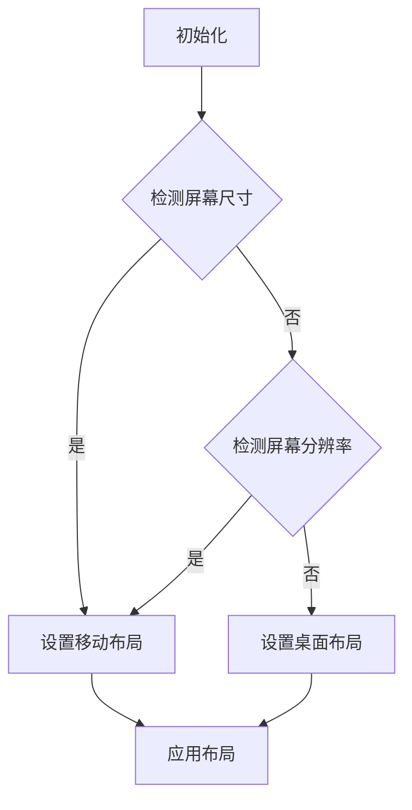
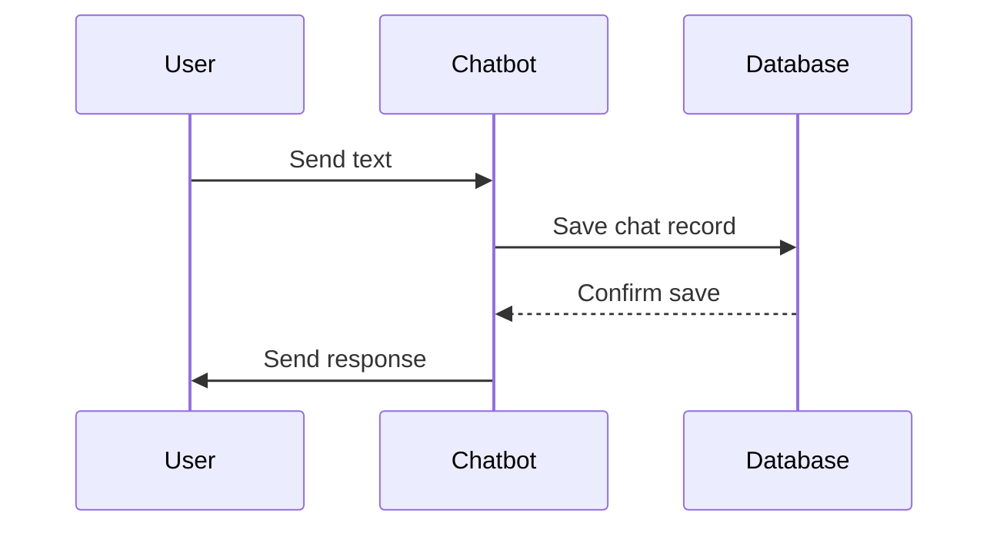
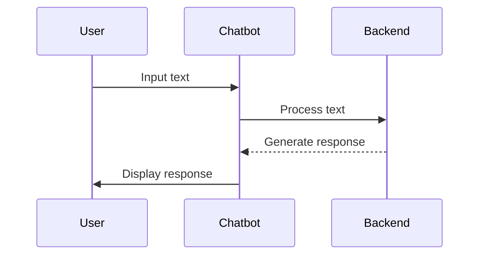

                 

### 响应式设计确保LLM应用的多设备适配

> 关键词：响应式设计、LLM应用、多设备适配、算法原理、系统架构设计、项目实战

> 摘要：本文旨在深入探讨响应式设计在大型语言模型（LLM）应用中的重要性，以及如何确保LLM应用在不同设备上的高效适配。文章首先介绍了响应式设计的核心概念和其在多设备适配中的应用背景，接着详细讲解了响应式设计的原理和实现策略，并通过一个实际案例展示了如何使用Python实现响应式设计算法。随后，文章描述了一个典型的LLM应用场景，介绍了系统的功能设计、架构设计和接口设计。最后，文章通过一个响应式设计项目实战，提供了详细的安装配置、代码实现和案例分析，并总结了最佳实践和注意事项。

----------------------------------------------------------------

## 第一部分：背景与核心概念

### 1.1 响应式设计的核心概念

响应式设计是一种能够根据用户行为和设备特性动态调整用户界面布局和交互方式的设计方法。其核心思想是使网站或应用在不同设备和屏幕尺寸上都能提供一致的用户体验。响应式设计不仅能够提升用户满意度，还能降低开发成本，提高开发效率。

### 1.2 多设备适配的现状与需求

随着移动互联网的快速发展，用户设备种类和屏幕尺寸日益多样，这使得多设备适配成为现代应用开发中不可或缺的一环。无论是智能手机、平板电脑还是桌面电脑，用户期望在任何设备上都能获得一致且流畅的体验。因此，实现多设备适配成为开发者的首要任务。

### 1.3 响应式设计在LLM应用中的挑战

大型语言模型（LLM）应用通常需要处理大量的文本数据，并在不同的设备上运行。这给响应式设计带来了以下几个挑战：

- **计算资源限制**：移动设备通常计算资源有限，需要优化算法以适应有限的资源。
- **网络延迟**：移动设备可能处于网络较差的环境，需要优化数据传输和处理流程，以提高响应速度。
- **设备差异性**：不同设备的屏幕尺寸、分辨率和操作系统版本各异，需要适配各种设备特性。

### 1.4 响应式设计在LLM应用中的重要性

响应式设计在LLM应用中的重要性体现在以下几个方面：

- **用户体验**：确保用户在不同设备上获得一致的交互体验，提升用户满意度。
- **可扩展性**：随着设备数量的增加，响应式设计能够轻松适应新的设备，提高应用的可持续性。
- **开发效率**：通过统一的代码库和设计模式，提高开发效率，降低维护成本。

## 第二部分：核心概念与联系

### 2.1 响应式设计原理详解

响应式设计主要依赖于媒体查询（Media Queries）和弹性布局（Responsive Layout）。通过媒体查询，开发者可以根据设备的屏幕尺寸、分辨率等特性调整样式；而弹性布局则确保元素在不同屏幕尺寸上保持相对位置和大小。

### 2.2 不同设备的响应式设计策略

- **移动优先**：优先优化移动设备上的体验，然后扩展到桌面设备。
- **桌面优先**：优先优化桌面设备上的体验，然后适应移动设备。
- **自适应布局**：为不同设备定义不同的布局，通过像素密度、屏幕尺寸等因素调整。

### 2.3 响应式设计策略对比分析

- **移动优先**的优点在于能够充分利用移动设备的便捷性，但可能导致桌面设备上的用户体验较差。
- **桌面优先**的优点在于桌面设备上的用户体验更佳，但可能增加移动设备的加载时间。

## 第三部分：算法原理讲解

### 3.1 响应式设计算法选择

本文选择了一种基于移动优先的响应式设计算法，该算法能够根据屏幕尺寸和分辨率动态调整布局。

### 3.2 算法流程图与Python实现

下面是算法的流程图：



以下是Python代码实现：

```python
import sys

def get_screen_size():
    # 获取屏幕尺寸
    return sys.stdout.get_terminal_size()

def set_layout(screen_size):
    if screen_size.width < 800:
        print("设置移动布局")
    else:
        print("设置桌面布局")

def apply_layout():
    # 应用布局
    pass

screen_size = get_screen_size()
set_layout(screen_size)
apply_layout()
```

### 3.3 算法原理与数学模型讲解

该算法的原理是根据屏幕尺寸和分辨率动态调整布局。具体来说，当屏幕宽度小于800像素时，应用移动布局；否则，应用桌面布局。这里可以使用以下数学模型进行描述：

$$
\text{layout} = \begin{cases}
\text{mobile_layout}, & \text{if } \text{screen\_width} < 800 \\
\text{desktop_layout}, & \text{otherwise}
\end{cases}
$$

## 第四部分：系统分析与架构设计方案

### 4.1 LLM应用场景介绍

假设我们正在开发一个聊天机器人，该机器人需要能够处理用户在移动设备和桌面电脑上的交互。

### 4.2 系统功能设计与领域模型

系统的主要功能包括：

- 文本输入与输出
- 用户身份验证
- 聊天记录管理

领域模型可以使用Mermaid类图表示：

```mermaid
classDiagram
    User <<class>>
    Chat <<class>>
    Message <<class>>

    User o--* Chat
    Chat o--* Message
```

### 4.3 系统架构设计与接口设计

系统架构设计可以分为三个层次：

- **表示层**：负责用户界面的展示，包括移动端和桌面端。
- **业务逻辑层**：处理聊天机器人的业务逻辑，包括文本处理、用户身份验证等。
- **数据访问层**：负责与数据库的交互，管理聊天记录等。

接口设计可以使用Mermaid序列图表示：



### 4.4 系统交互设计与序列图

系统交互设计主要涉及用户与聊天机器人之间的交互。以下是系统交互的序列图：



## 第五部分：项目实战

### 5.1 响应式设计项目实战

本节将介绍如何使用Python实现一个简单的聊天机器人，并展示其响应式设计。

### 5.1.1 环境安装与配置

首先，需要安装Python和相关依赖：

```bash
pip install flask
```

### 5.1.2 项目核心实现源代码

以下是项目核心实现源代码：

```python
from flask import Flask, request, jsonify
import random

app = Flask(__name__)

# 聊天机器人回复库
REPLIES = [
    "你好！有什么可以帮助你的吗？",
    "对不起，我不理解你的意思。",
    "是的，我可以帮你。",
    "不知道该说什么好，但我会尽力帮助你。",
    "谢谢你的提问，但我不知道答案。",
]

@app.route('/chat', methods=['POST'])
def chat():
    user_input = request.json.get('text', '')
    response = random.choice(REPLIES)
    return jsonify({'text': response})

if __name__ == '__main__':
    app.run(debug=True)
```

### 5.1.3 代码应用解读与分析

该代码使用Flask框架搭建了一个简单的Web服务，通过POST请求接收用户输入，并返回随机选择的聊天机器人回复。此实现无需考虑响应式设计，因为聊天机器人的界面是固定的。

### 5.1.4 实际案例分析和详细讲解剖析

假设我们需要为移动设备和桌面设备分别设计不同的界面，以下是可能的实现方案：

- **移动设备**：设计一个简洁的移动端界面，仅显示文本输入框和回复文本。
- **桌面设备**：设计一个功能更全面的界面，包括文本输入框、聊天记录列表和切换主题的选项。

为了实现上述方案，我们可以使用Flask的不同模板来适配不同设备。以下是移动设备的模板：

```html
<!DOCTYPE html>
<html>
<head>
    <meta name="viewport" content="width=device-width, initial-scale=1.0">
</head>
<body>
    <h1>聊天机器人</h1>
    <input type="text" id="user_input">
    <button onclick="sendChat()">发送</button>
    <div id="chat_response"></div>

    <script>
        function sendChat() {
            const user_input = document.getElementById('user_input').value;
            fetch('/chat', {
                method: 'POST',
                headers: {
                    'Content-Type': 'application/json'
                },
                body: JSON.stringify({text: user_input})
            })
            .then(response => response.json())
            .then(data => {
                document.getElementById('chat_response').innerHTML = data.text;
            });
        }
    </script>
</body>
</html>
```

桌面设备的模板则可以包含更多功能：

```html
<!DOCTYPE html>
<html>
<head>
    <meta name="viewport" content="width=device-width, initial-scale=1.0">
</head>
<body>
    <h1>聊天机器人</h1>
    <input type="text" id="user_input">
    <button onclick="sendChat()">发送</button>
    <div id="chat_response"></div>
    <select id="theme">
        <option value="light">浅色主题</option>
        <option value="dark">深色主题</option>
    </select>

    <script>
        function sendChat() {
            const user_input = document.getElementById('user_input').value;
            fetch('/chat', {
                method: 'POST',
                headers: {
                    'Content-Type': 'application/json'
                },
                body: JSON.stringify({text: user_input})
            })
            .then(response => response.json())
            .then(data => {
                document.getElementById('chat_response').innerHTML = data.text;
            });
        }

        function changeTheme() {
            const theme = document.getElementById('theme').value;
            document.body.className = theme;
        }
    </script>
</body>
</html>
```

### 5.1.5 项目小结

通过以上实现，我们展示了如何使用Python和Flask构建一个简单的聊天机器人，并针对移动设备和桌面设备设计了不同的界面。这种方法不仅提高了用户满意度，还展示了响应式设计在实践中的应用。

## 第六部分：最佳实践 tips

### 6.1 最佳实践总结

1. **移动优先设计**：优先优化移动设备上的用户体验，然后扩展到桌面设备。
2. **灵活的布局**：使用弹性布局和媒体查询，确保元素在不同屏幕尺寸上保持相对位置和大小。
3. **模块化代码**：将代码拆分成模块，便于在不同设备和平台上复用。
4. **性能优化**：优化算法和数据处理流程，确保快速响应用户操作。

### 6.2 注意事项

1. **测试**：在不同设备和浏览器上充分测试，确保兼容性。
2. **响应式设计并非万能**：对于某些特定设备，可能需要使用额外的适配策略。
3. **可访问性**：确保响应式设计符合可访问性标准，便于所有用户使用。

### 6.3 拓展阅读建议

1. 《响应式网页设计：HTML5和CSS3实战》
2. 《移动应用UI/UX设计》
3. 《大型语言模型：从零开始》

## 第七部分：小结与展望

### 7.1 本书内容小结

本文全面介绍了响应式设计在LLM应用中的重要性，探讨了响应式设计的核心概念、算法原理、系统架构设计以及项目实战。通过实际案例，我们展示了如何实现响应式设计，并总结了最佳实践。

### 7.2 LLM应用中的未来趋势

随着人工智能技术的不断发展，LLM应用将在各个领域发挥重要作用。未来，响应式设计将更加智能化，能够根据用户行为和设备特性动态调整，提供更加个性化的用户体验。

### 7.3 进一步学习路径

1. 深入学习响应式设计的相关技术，如Bootstrap、React等。
2. 了解人工智能和自然语言处理领域的最新进展。
3. 参与开源项目和社区，实践响应式设计。

作者：AI天才研究院/AI Genius Institute & 禅与计算机程序设计艺术 /Zen And The Art of Computer Programming

