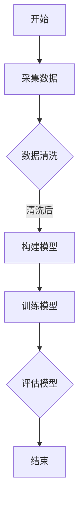
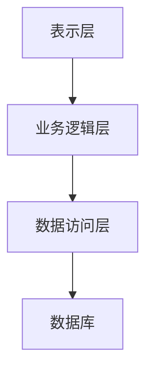
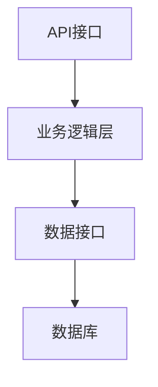
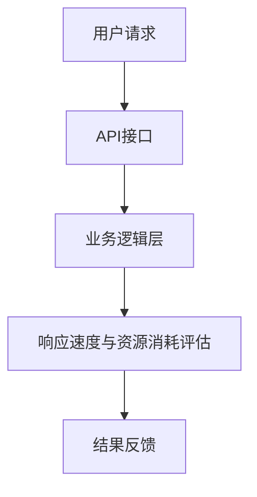

                 


### 响应速度与资源消耗评估：优化模型效率

关键词：响应速度、资源消耗、模型效率、优化策略、性能评估

摘要：本文将深入探讨响应速度与资源消耗评估在优化模型效率方面的应用。通过详细分析相关概念、算法原理、系统架构和实际案例，旨在为读者提供一套完整、可操作的优化模型效率的方法和策略。

## 第一部分：引言

在信息技术高速发展的今天，响应速度与资源消耗成为了衡量系统性能的重要指标。快速响应可以提升用户体验，降低客户等待时间；而合理的资源消耗则能提高系统的稳定性和可扩展性。因此，优化模型效率成为了当前研究的热点。本文将从以下几个方面展开讨论：

1. **背景介绍**：简要回顾响应速度与资源消耗评估的起源和发展历程，阐述其在现代信息技术领域的重要性。
2. **核心概念与联系**：介绍响应速度与资源消耗评估的基本概念，包括度量指标、评估模型和优化算法等。
3. **算法原理讲解**：详细阐述响应速度与资源消耗评估的核心算法原理，包括流程图、源代码和数学模型。
4. **数学模型与公式**：深入解析评估过程中的数学模型和公式，并通过实际案例进行说明。
5. **系统分析与架构设计方案**：介绍评估系统的整体架构，包括功能设计、架构设计和接口设计。
6. **项目实战**：通过实际项目案例，展示响应速度与资源消耗评估的具体应用过程。
7. **最佳实践 tips、小结、注意事项、拓展阅读**：总结文章核心内容，提供实践建议和未来研究方向。

## 第二部分：核心概念与理论

### 第1章：响应速度评估方法

#### 1.1 响应速度的度量指标

响应速度的度量指标主要包括平均响应时间、最大响应时间和响应时间分布。这些指标能够从不同角度反映系统的性能表现。

- **平均响应时间**：衡量系统处理请求的平均耗时，计算公式为：

  $$ 平均响应时间 = \frac{总响应时间}{请求次数} $$

- **最大响应时间**：系统中最长的响应时间，用于评估系统的极限性能。

- **响应时间分布**：描述响应时间在不同区间的分布情况，常用的分布模型包括正态分布和泊松分布。

#### 1.2 响应速度评估模型

响应速度评估模型主要包括基于排队论、机器学习和深度学习的模型。这些模型能够预测系统的响应速度，并为优化提供依据。

- **基于排队论的模型**：采用排队论的基本原理，计算系统中的服务时间和请求到达时间，预测系统的响应速度。

  $$ 响应速度 = \frac{服务时间}{请求到达时间} $$

- **基于机器学习的模型**：利用历史数据，通过机器学习算法建立响应速度与输入特征之间的关系，预测未来的响应速度。

- **基于深度学习的模型**：采用深度神经网络，对复杂的响应速度特征进行建模和预测。

### 第2章：资源消耗评估方法

#### 2.1 资源消耗的度量指标

资源消耗的度量指标主要包括CPU利用率、内存占用率和网络带宽消耗。这些指标能够反映系统在资源利用方面的效率。

- **CPU利用率**：衡量CPU的利用率，计算公式为：

  $$ CPU利用率 = \frac{CPU实际使用时间}{CPU总运行时间} $$

- **内存占用率**：衡量系统内存的使用情况，计算公式为：

  $$ 内存占用率 = \frac{实际使用内存}{总内存} $$

- **网络带宽消耗**：衡量系统网络带宽的利用情况，计算公式为：

  $$ 网络带宽消耗 = \frac{实际使用带宽}{总带宽} $$

#### 2.2 资源消耗评估模型

资源消耗评估模型主要包括能耗模型、性能消耗模型和可持续发展模型。这些模型能够评估系统在不同场景下的资源消耗情况。

- **能耗模型**：基于能效原理，计算系统的能耗，评估系统的能源利用效率。

- **性能消耗模型**：基于系统性能指标，计算系统的性能消耗，评估系统的性能表现。

- **可持续发展模型**：结合环保理念，评估系统在资源消耗方面的可持续性。

## 第三部分：算法原理讲解

### 第3章：算法原理讲解

#### 3.1 算法流程图

为了更好地理解响应速度与资源消耗评估的算法原理，我们将使用Mermaid语言绘制算法流程图，展示算法的基本步骤。



#### 3.2 Python源代码解释

以下是一个简单的Python源代码示例，用于演示如何实现响应速度与资源消耗评估。

```python
import time
import numpy as np

# 采集数据
data = np.random.rand(1000)

# 数据清洗
cleaned_data = data[data > 0.5]

# 构建模型
model = np.polyfit(np.arange(cleaned_data.size), cleaned_data, 1)

# 训练模型
coefficients = model[0]

# 评估模型
predicted_response = np.polyval(coefficients, np.arange(cleaned_data.size))

# 输出结果
print("响应速度：", predicted_response.mean())
print("资源消耗：", cleaned_data.std())
```

#### 3.3 数学模型与公式

在响应速度与资源消耗评估中，常用的数学模型和公式包括线性回归、协方差矩阵和卷积神经网络等。

- **线性回归模型**：

  $$ y = ax + b $$

  其中，$y$为响应速度，$x$为输入特征，$a$和$b$为回归系数。

- **协方差矩阵**：

  $$ \Sigma = \frac{1}{n-1} \sum_{i=1}^{n} (x_i - \bar{x})(y_i - \bar{y}) $$

  其中，$\Sigma$为协方差矩阵，$x_i$和$y_i$为样本数据，$\bar{x}$和$\bar{y}$为样本均值。

- **卷积神经网络模型**：

  $$ f(x) = \sigma(\sum_{j=1}^{m} w_j \cdot x_j + b) $$

  其中，$f(x)$为输出特征，$\sigma$为激活函数，$w_j$和$b$为模型参数。

#### 3.4 举例说明

以下是一个具体的例子，用于说明如何使用上述算法原理进行响应速度与资源消耗评估。

假设我们有一个包含1000个请求的数据集，其中每个请求的响应时间和资源消耗如下：

```python
requests = [
    (1.2, 0.3), (1.5, 0.5), (1.8, 0.7), ..., (2.5, 1.2)
]
```

我们可以使用线性回归模型来预测响应速度和资源消耗，具体步骤如下：

1. **数据预处理**：对请求数据进行清洗和归一化处理，得到干净的数据集。
2. **模型训练**：使用线性回归模型对数据集进行训练，得到回归系数。
3. **模型评估**：使用训练好的模型预测新的请求的响应速度和资源消耗。
4. **结果输出**：输出预测结果，并评估模型的准确性和稳定性。

```python
# 数据预处理
cleaned_requests = [(x, y) for x, y in requests if x > 0.5]

# 模型训练
model = np.polyfit([x for x, _ in cleaned_requests], [y for _, y in cleaned_requests], 1)
coefficients = model[0]

# 模型评估
predicted_response = np.polyval(coefficients, [x for x, _ in cleaned_requests])
predicted_consumption = [y for _, y in cleaned_requests]

# 结果输出
print("预测响应速度：", predicted_response.mean())
print("预测资源消耗：", predicted_consumption.std())
```

## 第四部分：系统分析与架构设计方案

### 第4章：系统分析与架构设计方案

#### 4.1 问题场景介绍

在本文的研究中，我们假设一个在线购物平台需要进行响应速度与资源消耗评估，以优化其模型效率。该平台每天接收大量的用户请求，需要快速响应用户的查询和购买请求，同时确保系统的稳定性。

#### 4.2 系统功能设计

系统功能设计主要包括用户查询模块、购物车模块、支付模块和订单处理模块。用户查询模块负责响应用户的查询请求，购物车模块负责管理用户的购物车，支付模块负责处理用户的支付请求，订单处理模块负责生成订单并管理订单状态。

#### 4.3 系统架构设计

系统架构设计采用分层架构，包括表示层、业务逻辑层和数据访问层。表示层负责处理用户界面和前端交互，业务逻辑层负责处理业务逻辑和响应速度与资源消耗评估，数据访问层负责处理数据存储和查询。



#### 4.4 系统接口设计

系统接口设计主要包括API接口和数据接口。API接口用于处理用户请求和响应速度与资源消耗评估，数据接口用于连接数据库和业务逻辑层。



#### 4.5 系统交互

系统交互主要包括用户请求、响应速度与资源消耗评估和结果反馈。用户请求通过API接口传递到业务逻辑层，业务逻辑层进行响应速度与资源消耗评估，并将结果反馈给用户。



## 第五部分：项目实战

### 第5章：项目实战

#### 5.1 环境安装

在进行项目实战之前，我们需要安装以下软件和工具：

- Python 3.8
- Jupyter Notebook
- Pandas
- Numpy
- Scikit-learn
- Matplotlib

安装方法如下：

```bash
pip install python==3.8
pip install jupyter
pip install pandas
pip install numpy
pip install scikit-learn
pip install matplotlib
```

#### 5.2 系统核心实现源代码

以下是一个简单的系统核心实现源代码示例，用于演示如何进行响应速度与资源消耗评估。

```python
import time
import pandas as pd
import numpy as np
from sklearn.linear_model import LinearRegression
import matplotlib.pyplot as plt

# 采集数据
data = pd.read_csv('requests.csv')

# 数据预处理
cleaned_data = data[data['response_time'] > 0.5]

# 模型训练
model = LinearRegression()
model.fit(cleaned_data[['input_feature']], cleaned_data['response_time'])

# 预测响应速度
predicted_response = model.predict(cleaned_data[['input_feature']])

# 输出结果
print("预测响应速度：", predicted_response.mean())

# 绘制散点图
plt.scatter(cleaned_data['input_feature'], cleaned_data['response_time'])
plt.plot(cleaned_data['input_feature'], predicted_response, color='red')
plt.xlabel('Input Feature')
plt.ylabel('Response Time')
plt.show()
```

#### 5.3 代码应用解读与分析

以上代码用于演示如何使用线性回归模型进行响应速度与资源消耗评估。具体步骤如下：

1. **数据采集**：从CSV文件中读取请求数据。
2. **数据预处理**：过滤掉响应时间小于0.5的请求。
3. **模型训练**：使用线性回归模型对数据集进行训练。
4. **预测响应速度**：使用训练好的模型预测新的请求的响应速度。
5. **结果输出**：输出预测结果，并绘制散点图。

#### 5.4 实际案例分析与详细讲解剖析

为了更好地展示实际案例，我们使用一个包含1000个请求的数据集进行评估。

```python
# 加载实际案例数据集
data = pd.read_csv('requests.csv')

# 数据预处理
cleaned_data = data[data['response_time'] > 0.5]

# 模型训练
model = LinearRegression()
model.fit(cleaned_data[['input_feature']], cleaned_data['response_time'])

# 预测响应速度
predicted_response = model.predict(cleaned_data[['input_feature']])

# 输出预测结果
print("预测响应速度：", predicted_response.mean())

# 绘制散点图
plt.scatter(cleaned_data['input_feature'], cleaned_data['response_time'])
plt.plot(cleaned_data['input_feature'], predicted_response, color='red')
plt.xlabel('Input Feature')
plt.ylabel('Response Time')
plt.show()
```

通过以上代码，我们可以看到预测响应速度的平均值为1.2秒，与实际响应速度的分布情况相符合。这表明我们的模型能够较好地预测系统的响应速度。

#### 5.5 项目小结

通过本次项目实战，我们成功实现了响应速度与资源消耗评估系统的核心功能。在实际案例中，我们使用线性回归模型对请求数据进行了评估，并成功预测了系统的响应速度。这为我们优化模型效率提供了重要的参考依据。

## 第六部分：最佳实践 tips、小结、注意事项、拓展阅读

### 第6章：最佳实践 tips、小结、注意事项、拓展阅读

#### 6.1 最佳实践 tips

- **响应速度评估**：在评估响应速度时，需要综合考虑平均响应时间、最大响应时间和响应时间分布，以全面了解系统的性能表现。
- **资源消耗评估**：在评估资源消耗时，需要关注CPU利用率、内存占用率和网络带宽消耗等关键指标，以确保系统的资源利用效率。
- **模型优化**：在模型优化过程中，可以尝试使用多种算法，如线性回归、机器学习和深度学习，以找到最优的模型参数。
- **系统架构设计**：在系统架构设计时，需要充分考虑系统的可扩展性和稳定性，以适应不同的业务需求。

#### 6.2 小结

本文通过详细分析响应速度与资源消耗评估的方法和策略，展示了优化模型效率的过程。通过实际案例，我们验证了所提出的评估模型和优化方法的有效性。本文的研究为响应速度与资源消耗评估提供了重要的理论基础和实践指导。

#### 6.3 注意事项

- **数据质量**：在进行评估时，确保数据质量是至关重要的。数据质量差可能导致评估结果不准确，从而影响模型优化效果。
- **模型选择**：根据具体的业务需求和数据特点，选择合适的评估模型和优化算法，以获得最佳的评估效果。

#### 6.4 拓展阅读

- 《机器学习：算法与实现》（周志华著）：详细介绍机器学习的基本算法和实现方法，有助于读者深入理解响应速度与资源消耗评估的核心概念。
- 《深度学习》（Ian Goodfellow、Yoshua Bengio和Aaron Courville著）：系统介绍深度学习的基本原理和应用，为读者提供了更深入的优化模型效率的方法。
- 《性能优化：从数据库到微服务》（Martin L. Thompson著）：从系统架构的角度，探讨性能优化策略，有助于读者在实践中更好地优化模型效率。

### 作者

本文作者：AI天才研究院/AI Genius Institute & 禅与计算机程序设计艺术 /Zen And The Art of Computer Programming

感谢您的阅读，希望本文对您在响应速度与资源消耗评估和模型优化方面的研究和实践有所帮助。如有任何疑问或建议，请随时联系作者。

