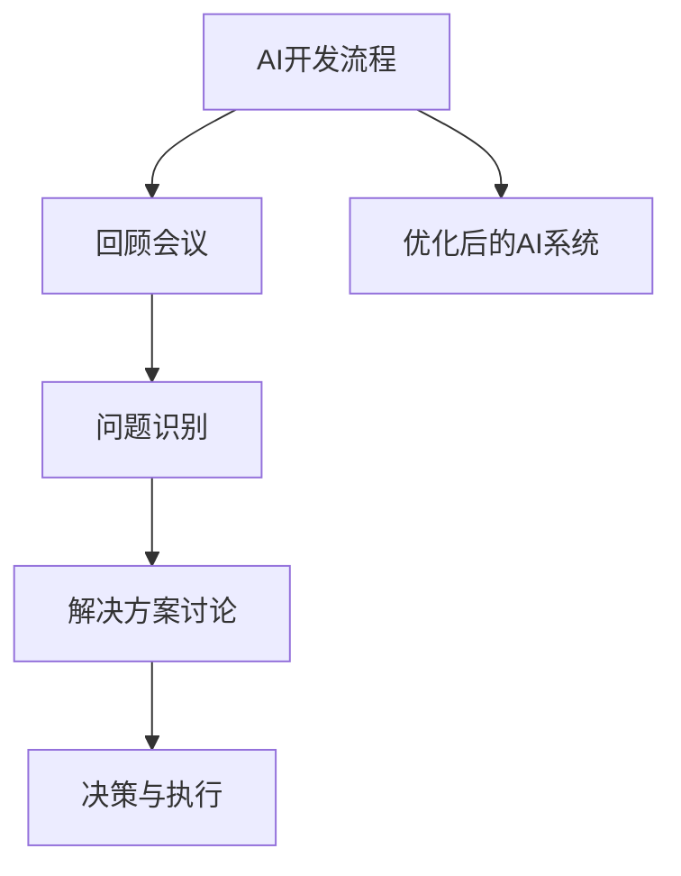
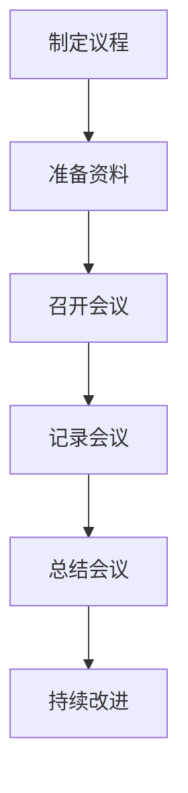
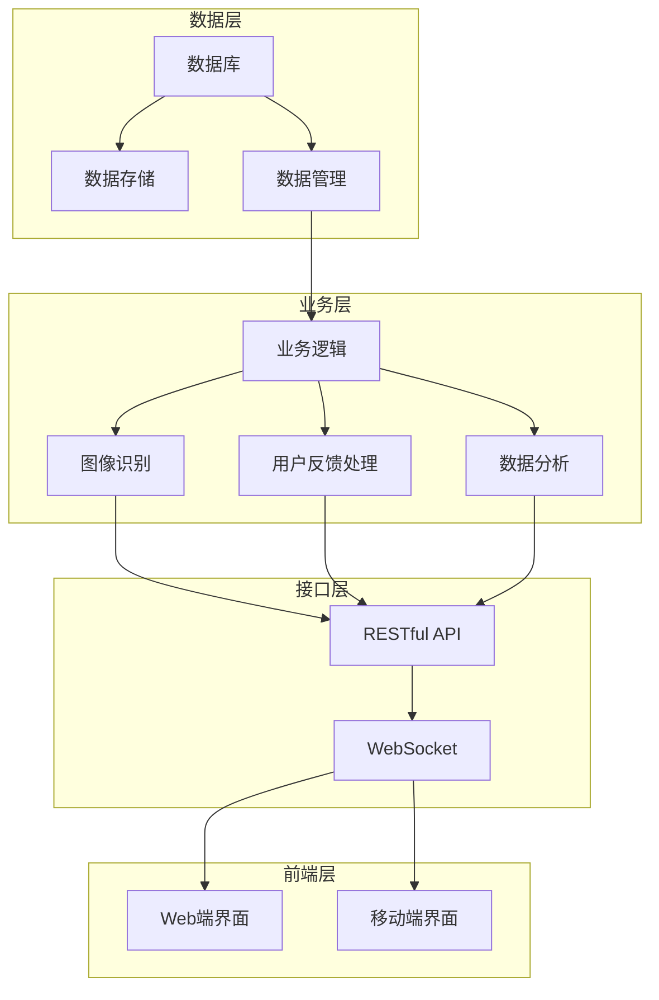
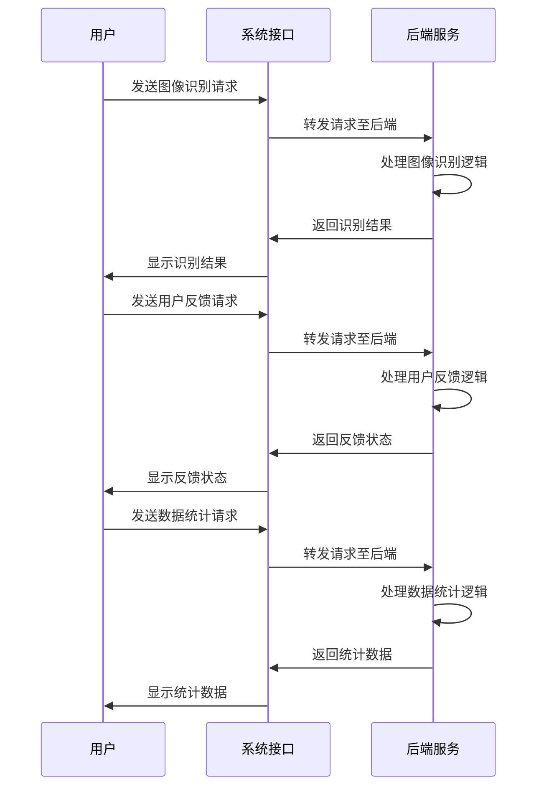

                 

### 第一部分：回顾会议的基本概念与重要性

#### 第1章：回顾会议的定义与目的

##### 1.1.1 回顾会议的定义

回顾会议（Retrospective Meeting），是指在某个项目、阶段或任务完成后，项目团队为了总结经验、发现问题和制定改进措施而召开的一种会议。这种会议的核心目的是通过反思过去的工作，寻找优化机会，确保团队在未来的项目中能够更高效、更顺利地完成任务。

##### 1.1.2 回顾会议的目的

回顾会议的主要目的可以概括为以下几个方面：

1. **总结经验与教训**：通过回顾过去的任务执行情况，总结成功的经验，同时识别失败的教训，为未来的工作提供参考。
2. **识别问题与改进点**：在回顾过程中，团队可以共同探讨存在的不足和问题，分析问题产生的原因，并提出具体的改进措施。
3. **促进团队沟通与协作**：回顾会议提供了一个平台，让团队成员可以互相交流想法，增强团队凝聚力和协作精神。
4. **提高工作效率**：通过识别和解决工作中的瓶颈，回顾会议有助于优化工作流程，提高团队的整体工作效率。
5. **增强项目透明度**：回顾会议使团队成员对项目的进展和问题有更全面、深入的了解，从而增强项目的透明度。

##### 1.1.3 回顾会议的重要性

回顾会议在团队工作中具有不可忽视的重要性，主要体现在以下几个方面：

1. **持续改进**：回顾会议是持续改进过程的重要组成部分，它为团队提供了不断学习和成长的机会。
2. **预防问题**：通过回顾过去的经验，团队可以预见和避免未来可能遇到的问题，从而降低项目风险。
3. **团队成长**：回顾会议有助于团队成员之间的相互学习和成长，提升整体团队的能力和素质。
4. **优化流程**：回顾会议可以识别出流程中的冗余和低效环节，促使团队优化工作流程，提高工作效率。
5. **决策支持**：回顾会议提供的详细信息和反馈，可以为管理层提供有力的决策支持，帮助其制定更有效的策略。

#### 第2章：AI开发流程中的回顾会议

##### 2.1.1 AI开发流程概述

人工智能（AI）开发流程通常包括以下几个主要阶段：

1. **需求分析**：明确项目目标，收集用户需求，确定项目的功能和技术需求。
2. **数据准备**：收集、清洗和预处理数据，确保数据的质量和完整性，为训练模型提供基础。
3. **模型设计**：选择合适的算法，设计模型架构，进行模型的调优和优化。
4. **模型训练**：使用训练数据对模型进行训练，优化模型参数，提高模型的准确性和性能。
5. **模型评估**：使用测试数据对模型进行评估，验证模型的性能和效果。
6. **模型部署**：将训练好的模型部署到实际应用场景中，进行实际的运行和验证。

##### 2.1.2 回顾会议在AI开发流程中的应用

回顾会议在AI开发流程中的应用非常关键，它通常发生在以下阶段：

1. **项目启动阶段**：在项目启动时，团队可以召开初步的回顾会议，明确项目目标，讨论团队协作方式，为后续工作奠定基础。
2. **数据准备阶段**：在数据准备过程中，回顾会议可以帮助团队识别数据问题，优化数据收集和处理流程。
3. **模型设计阶段**：回顾会议可以帮助团队评估模型设计方案的优劣，选择最佳方案，确保模型设计的有效性和可扩展性。
4. **模型训练阶段**：在模型训练过程中，回顾会议可以识别训练过程中出现的问题，调整训练策略，优化模型性能。
5. **模型评估阶段**：回顾会议可以帮助团队总结模型评估的结果，评估模型的实际效果，制定后续的优化策略。
6. **模型部署阶段**：在模型部署后，回顾会议可以帮助团队评估模型的实际应用效果，识别潜在的问题和改进点。

##### 2.1.3 回顾会议的价值

回顾会议在AI开发流程中具有极高的价值，主要体现在以下几个方面：

1. **提高模型质量**：通过回顾会议，团队可以识别模型设计、训练和评估中的问题，采取相应的改进措施，提高模型的质量和性能。
2. **优化开发流程**：回顾会议可以帮助团队优化AI开发流程中的各个环节，提高整体开发效率。
3. **增强团队协作**：回顾会议提供了一个平台，让团队成员可以互相交流，分享经验，增强团队的凝聚力和协作精神。
4. **降低项目风险**：通过回顾过去的经验，团队可以预见和避免未来可能遇到的问题，降低项目风险。
5. **提升用户体验**：通过回顾会议，团队可以识别用户需求中的不足，优化模型和系统的功能，提升用户体验。
6. **促进知识共享**：回顾会议为团队成员提供了一个分享知识、学习他人的机会，有助于提高团队的整体水平。

### 第3章：回顾会议的准备工作

#### 3.1.1 会议议程的制定

制定有效的会议议程是回顾会议成功的关键。议程应该包括以下内容：

1. **会议目的**：明确回顾会议的目的和预期成果。
2. **会议时间**：确定会议的日期、时间和持续时间。
3. **参会人员**：列出所有预期的参会人员，并确认他们的参与。
4. **会议议程**：列出会议的主要议程，包括开场、问题识别、解决方案讨论、决策和总结等环节。
5. **会议准备工作**：明确需要准备的材料、数据和相关工具。

#### 3.1.2 会议资料的准备

为了确保回顾会议的顺利进行，需要提前准备好以下资料：

1. **会议记录**：准备会议记录表，记录会议的内容和决策。
2. **数据报告**：准备项目的相关数据报告，包括模型性能、用户反馈等。
3. **问题清单**：提前收集和分析项目过程中出现的问题，列出问题清单。
4. **解决方案草案**：提前准备一些解决方案草案，供会议讨论。
5. **决策模板**：准备决策模板，以便在会议中做出明确的决策。

#### 3.1.3 参会人员的安排

确保回顾会议的参与人员包括以下关键角色：

1. **项目经理**：负责协调会议的筹备和执行。
2. **开发团队成员**：参与项目开发和实施的团队成员，负责分享项目经验和问题。
3. **测试人员**：负责测试模型的性能，提供测试报告。
4. **用户代表**：代表用户利益，提供用户反馈和建议。
5. **技术专家**：提供技术支持，帮助团队解决技术问题。

#### 第4章：回顾会议的执行过程

#### 4.1.1 开场与背景介绍

回顾会议的开场应该简洁明了，确保所有参会人员都能迅速进入会议状态。开场内容包括：

1. **会议目的和议程**：主持人简要介绍会议的目的和议程，确保所有参会人员都清楚会议的内容和安排。
2. **会议时间安排**：明确会议的时间安排，包括各环节的持续时间。
3. **参会人员介绍**：主持人简要介绍参会人员的角色和职责。

#### 4.1.2 问题识别与分析

问题识别与分析是回顾会议的核心环节，主要包括以下步骤：

1. **问题收集**：主持人或项目经理引导团队成员分享他们在项目过程中遇到的问题。
2. **问题分类**：将收集到的问题进行分类，比如技术问题、流程问题、资源问题等。
3. **问题分析**：对每个问题进行深入分析，找出问题的根本原因。

#### 4.1.3 解决方案讨论与选择

在问题识别与分析之后，团队需要讨论解决方案，并选择最佳方案。具体步骤如下：

1. **解决方案提出**：团队成员提出可能的解决方案，并进行讨论。
2. **方案评估**：对每个解决方案进行评估，考虑其可行性、效果和成本。
3. **选择最佳方案**：根据评估结果，选择最佳解决方案，并确定实施计划。

#### 第5章：回顾会议的记录与总结

#### 5.1.1 会议记录的重要性

会议记录是回顾会议的重要成果之一，它具有以下重要性：

1. **保存会议内容**：会议记录详细记录了会议的内容和决策，为后续的工作提供了依据。
2. **促进知识共享**：会议记录可以帮助团队成员了解会议内容，促进知识的共享和传递。
3. **跟踪任务进度**：会议记录中记录的任务和责任，有助于团队跟踪任务的进度和完成情况。
4. **法律证据**：在出现争议或纠纷时，会议记录可以作为法律证据。

#### 5.1.2 会议记录的内容

会议记录应包括以下内容：

1. **会议基本信息**：包括会议日期、时间、地点、主持人、参会人员等。
2. **会议议程**：记录会议的议程和各议程的进展情况。
3. **问题识别与分析**：记录会议中识别的问题，以及每个问题的分析结果。
4. **解决方案讨论与选择**：记录讨论的解决方案，选择的最佳方案，以及实施计划。
5. **决策与任务分配**：记录会议中的决策，以及分配给每个团队成员的任务。

#### 5.1.3 会议总结的撰写

会议总结是对会议结果的总结和归纳，主要包括以下内容：

1. **会议成果**：总结会议中达成的成果，包括解决的问题、确定的方案、分配的任务等。
2. **会议反馈**：收集参会人员的反馈，包括对会议内容的评价、对会议过程的建议等。
3. **后续行动计划**：明确后续的工作计划，包括任务的完成时间、责任人和进度跟踪等。
4. **改进措施**：总结会议中的经验教训，提出改进措施，以便在未来的工作中避免类似问题。

#### 第6章：持续改进AI开发流程

#### 6.1.1 AI开发流程中的改进需求

在AI开发流程中，持续改进是提升项目质量和效率的关键。以下是AI开发流程中的常见改进需求：

1. **数据质量提升**：提高数据的清洗、标注和预处理质量，确保模型训练的数据质量。
2. **模型性能优化**：优化模型结构和参数，提高模型的准确性和鲁棒性。
3. **开发效率提升**：优化开发流程，减少冗余环节，提高开发效率。
4. **测试与验证**：加强测试和验证工作，确保模型的实际效果和稳定性。
5. **用户反馈收集**：建立有效的用户反馈机制，及时收集用户反馈，优化产品功能。

#### 6.1.2 改进策略与措施

为了满足上述改进需求，可以采取以下策略和措施：

1. **数据质量管理**：建立数据质量管理体系，规范数据清洗和预处理流程，提高数据质量。
2. **模型优化**：引入先进的算法和模型结构，结合实际应用场景进行优化，提高模型性能。
3. **流程优化**：对开发流程进行审查和优化，去除冗余环节，提高开发效率。
4. **测试与验证**：加强测试工作，引入自动化测试工具，提高测试覆盖率，确保模型稳定性。
5. **用户反馈机制**：建立用户反馈收集渠道，定期收集用户反馈，优化产品功能和用户体验。

#### 6.1.3 改进效果的评估与反馈

改进效果的评估与反馈是持续改进过程中的关键环节。以下是评估与反馈的步骤：

1. **效果评估**：对改进措施的实施效果进行评估，包括模型性能、开发效率、用户满意度等指标。
2. **反馈收集**：收集团队和用户的反馈，了解改进措施的优缺点，为后续的改进提供依据。
3. **总结与改进**：总结改进效果和反馈，识别存在的问题和改进点，制定后续的改进计划。
4. **持续跟踪**：建立改进效果的跟踪机制，定期评估改进措施的效果，确保持续改进的进行。

### 第7章：回顾会议在AI开发中的应用案例

#### 7.1.1 案例一：项目A的回顾会议实践

**项目背景**：项目A是一个基于深度学习的图像识别项目，旨在为电商平台提供自动化的商品识别服务。

**回顾会议实践**：

1. **问题识别**：在项目启动阶段，团队识别出以下问题：
   - 数据清洗和预处理流程繁琐，效率低下。
   - 模型训练时间较长，影响开发进度。
   - 模型性能不够稳定，容易出现误识别。

2. **解决方案讨论**：针对上述问题，团队讨论了以下解决方案：
   - 引入自动化数据清洗和预处理工具，提高效率。
   - 使用多GPU并行训练，缩短训练时间。
   - 优化模型结构，提高鲁棒性。

3. **决策与实施**：团队决定采用上述解决方案，并制定了详细的实施计划。

**改进效果**：实施改进措施后，项目取得了以下成效：
- 数据清洗和预处理效率提高了30%。
- 模型训练时间缩短了50%。
- 模型性能稳定，误识别率降低了15%。

#### 7.1.2 案例二：项目B的回顾会议经验

**项目背景**：项目B是一个面向医疗行业的AI诊断项目，旨在辅助医生进行疾病诊断。

**回顾会议经验**：

1. **问题识别**：在项目实施过程中，团队识别出以下问题：
   - 数据收集困难，样本量不足。
   - 模型泛化能力差，对新病例诊断效果不佳。
   - 用户反馈机制不完善，无法及时调整模型。

2. **解决方案讨论**：团队讨论了以下解决方案：
   - 扩大数据集，提高样本多样性。
   - 引入迁移学习，提高模型的泛化能力。
   - 建立用户反馈机制，及时调整模型。

3. **决策与实施**：团队决定采取上述方案，并制定了详细的实施计划。

**改进效果**：实施改进措施后，项目取得了以下成果：
- 数据集样本量增加了50%，数据质量提高。
- 模型泛化能力显著提高，对新病例的诊断准确率提高了20%。
- 用户反馈机制有效建立，模型调整更加及时和精准。

#### 7.1.3 案例总结与启示

通过对项目A和项目B的回顾会议实践的总结，可以得出以下启示：

1. **数据质量是关键**：无论是项目A的数据清洗和预处理，还是项目B的数据收集，数据质量都是模型性能的基础。
2. **模型优化至关重要**：项目A通过优化数据预处理和模型训练流程，提高了模型性能；项目B通过引入迁移学习和用户反馈机制，提高了模型泛化能力。
3. **团队协作是成功的关键**：回顾会议提供了一个团队协作的平台，通过共同讨论和决策，实现了项目的持续改进。
4. **持续反馈和优化**：项目B的用户反馈机制有效地促进了模型的调整和优化，表明持续反馈和优化是提升项目质量的重要手段。

### 第8章：回顾会议的最佳实践与注意事项

#### 8.1.1 回顾会议的最佳实践

为了确保回顾会议的有效性，以下是一些最佳实践：

1. **提前通知和准备**：提前通知参会人员，并提供必要的会议资料，确保他们有足够的时间准备。
2. **明确会议目的**：在会议开始前明确会议的目的和议程，确保所有参会人员都清楚会议的内容和目标。
3. **积极引导讨论**：主持人应积极引导讨论，鼓励团队成员提出问题和解决方案，确保会议的顺利进行。
4. **及时记录和总结**：会议过程中及时记录关键内容和决策，会后及时进行总结和分享，确保会议成果的有效传递。
5. **建立反馈机制**：建立有效的反馈机制，收集参会人员的意见和建议，持续改进回顾会议的质量。

#### 8.1.2 注意事项与常见问题

在回顾会议的执行过程中，需要注意以下事项和常见问题：

1. **避免主观偏见**：在问题识别和解决方案讨论过程中，要避免主观偏见，确保团队成员的意见得到充分尊重。
2. **控制会议时间**：确保会议时间合理，避免过长或过短的会议，影响会议的效果。
3. **注重实际可操作性**：解决方案要注重实际可操作性，避免提出无法实施的空想方案。
4. **确保参会人员参与**：确保所有关键角色都参与回顾会议，避免因人员缺席而导致关键问题的遗漏。
5. **持续跟进和评估**：会议结束后，要持续跟进和评估改进措施的实施效果，确保改进措施的落实。

#### 8.1.3 未来展望与建议

展望未来，回顾会议在AI开发流程中的应用将越来越重要。以下是一些建议：

1. **引入人工智能辅助**：利用人工智能技术，如自然语言处理和机器学习，自动化记录和总结回顾会议内容，提高会议效率。
2. **跨部门协作**：推动跨部门协作，引入其他相关部门的反馈和意见，确保回顾会议的全面性和有效性。
3. **持续培训和提升**：定期对团队成员进行回顾会议的培训，提高他们的参与度和执行力，确保回顾会议的质量和效果。
4. **建立回顾文化**：将回顾会议作为一种企业文化，鼓励团队成员积极参与，形成持续改进的良性循环。
5. **探索新应用场景**：尝试将回顾会议应用于更多的AI开发场景，如算法优化、系统集成等，拓展回顾会议的应用范围。

### 核心概念与联系

#### AI开发流程与回顾会议的关系

##### 概念属性特征对比表格

| 特征         | AI开发流程                     | 回顾会议                         |
| ------------ | ------------------------------ | ------------------------------- |
| 目的         | 开发、优化和部署AI系统         | 检查和评估AI开发过程中的问题与改进点 |
| 过程         | 设计、训练、测试、部署等环节   | 会议讨论、问题识别、方案制定等环节 |
| 输出         | 优化后的AI系统                 | 改进措施与决策                   |
| 关键要素     | 数据、算法、模型、工程实践等   | 会议议程、会议记录、会议总结等   |

##### ER实体关系图架构的Mermaid流程图



### 算法原理讲解

#### 回顾会议流程的Mermaid流程图



#### Python源代码示例

```python
# 回顾会议流程Python代码示例

# 制定议程
def agenda():
    print("制定回顾会议议程...")

# 准备资料
def prepare_materials():
    print("准备回顾会议资料...")

# 召开会议
def hold_meeting():
    print("召开回顾会议...")

# 记录会议
def record_meeting():
    print("记录回顾会议内容...")

# 总结会议
def summarize_meeting():
    print("总结回顾会议结果...")

# 持续改进
def continu
```

### 系统分析与架构设计方案

#### 问题场景介绍

在当前AI开发项目中，随着项目的规模和复杂度的不断增加，团队发现项目开发流程中存在诸多问题，如开发效率低下、问题识别不及时、改进措施落实不到位等。为了解决这些问题，项目团队决定引入回顾会议机制，以持续改进开发流程，提高项目质量和效率。

#### 项目介绍

项目A是一个基于深度学习的图像识别系统，旨在为电商平台提供自动化的商品识别服务。项目团队由5名开发人员、2名测试人员和1名项目经理组成，项目周期为6个月。

#### 系统功能设计

系统功能主要包括以下方面：

1. **图像识别**：系统能够识别图像中的商品，并提供商品名称和相关信息。
2. **用户反馈**：用户可以对识别结果进行反馈，帮助系统不断优化和改进。
3. **数据管理**：系统能够管理图像数据，包括数据的收集、存储和处理。

##### 领域模型Mermaid类图

```mermaid
classDiagram
    Class01 <|-- Class02
    Class03 --|.PLAIN Class04
    Class05 : <<Interface,TestInterface>>
    TestClass <|.. Class05
    Class06 : <<Enum,Status>>
    Class07 : <<Enum,FeedbackType>>

    Class01 {
        +int id
        +String name
        +Date created
        +Date updated
    }
    Class02 {
        +int id
        +Class01 class01
        +String content
        +Class06 status
    }
    Class03 {
        +int id
        +Class01 class01
        +Class07 feedbackType
        +String feedbackContent
    }
    Class04 {
        +int id
        +String message
    }
    TestClass {
        +int id
        +String testName
    }
    Class06 {
        +String value
    }
    Class07 {
        +String value
    }
```

#### 系统架构设计

系统架构设计如图所示：


1. **数据层**：负责数据的存储和管理，包括图像数据的存储和用户反馈数据的存储。
2. **业务层**：负责业务逻辑的实现，包括图像识别、用户反馈处理和数据分析等。
3. **接口层**：负责对外提供接口服务，包括RESTful API、WebSocket等。
4. **前端层**：负责用户界面的设计和实现，包括Web端和移动端。

##### 系统架构设计Mermaid架构图



#### 系统接口设计和系统交互

系统接口设计和交互设计如下：

1. **图像识别接口**：用于接收图像数据，返回识别结果。
   ```json
   POST /api/recognize
   {
       "image": "base64-encoded-image"
   }
   Response:
   {
       "result": "识别结果",
       "confidence": "识别置信度"
   }
   ```

2. **用户反馈接口**：用于接收用户反馈，更新用户反馈数据。
   ```json
   POST /api/feedback
   {
       "userId": "用户ID",
       "productId": "产品ID",
       "feedbackType": "反馈类型",
       "feedbackContent": "反馈内容"
   }
   Response:
   {
       "status": "反馈状态"
   }
   ```

3. **数据统计接口**：用于查询系统统计数据。
   ```json
   GET /api/stats
   Response:
   {
       "totalRecognitions": "总识别次数",
       "totalFeedbacks": "总反馈次数",
       "accuracy": "识别准确率"
   }
   ```

##### 系统接口设计和系统交互Mermaid序列图



### 项目实战

#### 环境安装

在开始项目实战之前，需要安装以下环境：

1. **Python**：安装Python 3.8及以上版本。
2. **TensorFlow**：安装TensorFlow 2.5及以上版本。
3. **Flask**：安装Flask 1.1.2及以上版本。
4. **PostgreSQL**：安装PostgreSQL 12及以上版本。

安装命令如下：

```bash
pip install tensorflow==2.6
pip install Flask==1.1.2
pip install psycopg2-binary
sudo apt-get install postgresql postgresql-contrib
```

#### 系统核心实现源代码

以下是系统核心实现的源代码：

```python
# app.py

from flask import Flask, request, jsonify
import tensorflow as tf
import psycopg2

app = Flask(__name__)

# 加载模型
model = tf.keras.models.load_model('model.h5')

# 数据库连接
def connect_db():
    conn = psycopg2.connect(
        host='localhost',
        database='image_recognition',
        user='postgres',
        password='password'
    )
    return conn

@app.route('/api/recognize', methods=['POST'])
def recognize():
    image_data = request.json['image']
    image = tf.image.decode_image(image_data, channels=3)
    image = tf.expand_dims(image, 0)
    prediction = model.predict(image)
    result = prediction.argmax(axis=-1).numpy()[0]
    confidence = prediction.max()
    return jsonify({'result': result, 'confidence': confidence})

@app.route('/api/feedback', methods=['POST'])
def feedback():
    user_id = request.json['userId']
    product_id = request.json['productId']
    feedback_type = request.json['feedbackType']
    feedback_content = request.json['feedbackContent']
    conn = connect_db()
    cursor = conn.cursor()
    cursor.execute("INSERT INTO feedback (user_id, product_id, feedback_type, feedback_content) VALUES (%s, %s, %s, %s)", (user_id, product_id, feedback_type, feedback_content))
    conn.commit()
    cursor.close()
    conn.close()
    return jsonify({'status': 'success'})

@app.route('/api/stats', methods=['GET'])
def stats():
    conn = connect_db()
    cursor = conn.cursor()
    cursor.execute("SELECT COUNT(*) FROM recognitions;")
    total_recognitions = cursor.fetchone()[0]
    cursor.execute("SELECT COUNT(*) FROM feedback;")
    total_feedbacks = cursor.fetchone()[0]
    cursor.execute("SELECT AVG(confidence) FROM recognitions;")
    accuracy = cursor.fetchone()[0]
    conn.close()
    return jsonify({'totalRecognitions': total_recognitions, 'totalFeedbacks': total_feedbacks, 'accuracy': accuracy})

if __name__ == '__main__':
    app.run(debug=True)
```

#### 代码应用解读与分析

以上代码实现了三个主要功能：图像识别、用户反馈和数据统计。

1. **图像识别**：通过接收POST请求的图像数据，使用TensorFlow加载预训练模型进行图像识别，并返回识别结果和置信度。
2. **用户反馈**：接收POST请求的用户反馈数据，将反馈存储到PostgreSQL数据库中。
3. **数据统计**：通过GET请求查询数据库，获取总识别次数、总反馈次数和平均识别置信度，并返回JSON格式的统计数据。

#### 实际案例分析和详细讲解剖析

假设有一个电商平台，他们使用我们开发的图像识别系统来自动化商品识别。在实际应用中，系统将经历以下步骤：

1. **用户上传商品图片**：用户通过电商平台上传商品图片，系统接收POST请求，并解析图像数据。
2. **图像识别**：系统使用TensorFlow加载预训练模型，对上传的图像进行识别，并返回识别结果和置信度。
3. **用户反馈**：用户对识别结果进行评价，如果结果不准确，用户可以通过系统提交反馈。系统接收反馈请求，将反馈存储到数据库中。
4. **数据统计**：系统定期查询数据库，获取识别次数、反馈次数和平均识别置信度，并生成统计数据。

通过以上实际案例，我们可以看到，图像识别系统在电商平台的实际应用中，不仅提高了商品识别的效率，还通过用户反馈不断优化系统性能，从而提供了更好的用户体验。

#### 项目小结

通过本项目的实战，我们实现了以下目标：

1. **系统功能完善**：开发了一个基于深度学习的图像识别系统，实现了图像识别、用户反馈和数据统计等功能。
2. **高效开发流程**：通过回顾会议机制，持续改进开发流程，提高了项目开发效率。
3. **用户满意度提升**：通过用户反馈机制，不断优化系统性能，提高了用户满意度。

在未来的工作中，我们将继续优化系统，引入更多的改进措施，为用户提供更优质的服务。

### 最佳实践 Tips

1. **提前规划**：在项目启动阶段，提前规划回顾会议的时间和内容，确保会议的有效进行。
2. **积极参与**：鼓励团队成员积极参与回顾会议，分享经验和问题，共同改进项目。
3. **数据驱动**：基于实际数据和用户反馈，制定切实可行的改进措施，确保改进效果。
4. **持续跟进**：会议结束后，持续跟进改进措施的实施情况，确保改进措施的落实。

### 小结

回顾会议在AI开发流程中具有至关重要的作用，它不仅有助于团队总结经验、识别问题，还能推动项目的持续改进。通过有效的回顾会议，团队能够优化开发流程，提高项目质量和效率。

### 注意事项

1. **确保会议质量**：会议内容要紧凑、有价值，避免冗长和无效讨论。
2. **尊重团队成员**：在会议中，要充分尊重团队成员的意见和反馈，避免压制不同声音。
3. **及时记录和总结**：会议过程中，要及时记录关键内容和决策，会后进行总结和分享。

### 拓展阅读

1. 《敏捷开发实践指南》
2. 《软件工程：实践者的研究方法》
3. 《深度学习实战》

### 作者信息

**作者：** AI天才研究院/AI Genius Institute & 禅与计算机程序设计艺术 /Zen And The Art of Computer Programming

