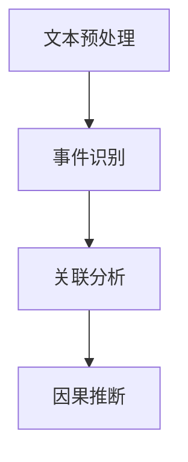
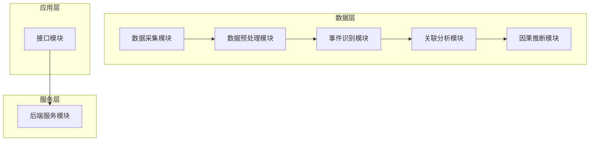
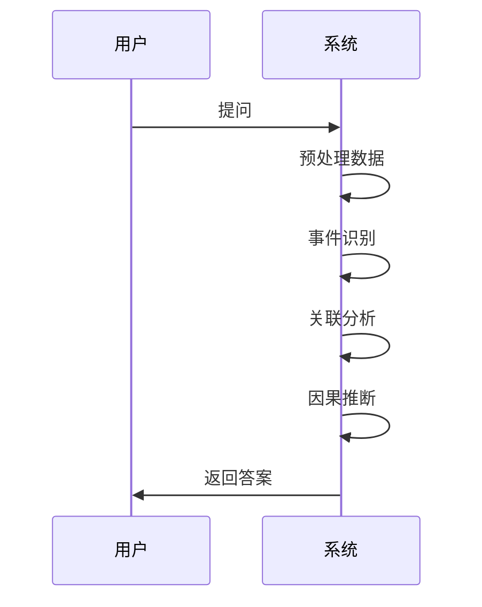

                 

### 文章标题：因果关系推断：测试LLM识别事件关联的能力

> 关键词：因果关系、事件关联、LLM、人工智能、测试

> 摘要：本文通过探讨因果关系推断在人工智能中的应用，详细分析了大型语言模型（LLM）在识别事件关联方面的能力。文章首先介绍了因果关系推断的核心概念和原理，然后通过具体算法和实现，展示了如何利用LLM进行事件关联的识别和推断。同时，文章还结合实际项目实战，探讨了因果关系推断在实际应用中的效果和挑战。最后，本文提出了最佳实践技巧和注意事项，为读者在后续研究和应用中提供了有益的参考。

### 目录

1. 背景介绍
   1.1 问题背景
   1.2 问题描述

2. 核心概念与联系
   2.1 因果关系的基本概念
   2.2 LLM识别事件关联的原理
   2.3 核心概念对比表格
   2.4 因果关系推断的ER实体关系图

3. 算法原理讲解
   3.1 算法简介
   3.2 算法流程图
   3.3 Python源代码与数学模型
   3.4 举例说明

4. 系统分析与架构设计
   4.1 问题场景介绍
   4.2 系统架构设计
   4.3 系统接口设计
   4.4 系统交互流程

5. 项目实战
   5.1 环境安装与配置
   5.2 系统核心实现
   5.3 实际案例分析与讲解
   5.4 项目小结

6. 最佳实践与拓展
   6.1 最佳实践技巧
   6.2 小结与注意事项
   6.3 拓展阅读

### 作者信息

作者：AI天才研究院/AI Genius Institute & 禅与计算机程序设计艺术 /Zen And The Art of Computer Programming### 第1章：因果关系推断概述

#### 1.1 问题背景

因果关系推断是人工智能领域中一个重要的研究方向，它在知识图谱、自然语言处理、智能推理等多个领域都有广泛的应用。在日常生活中，我们经常需要对事件之间的因果关系进行推断，例如分析交通事故的原因、预测股市走势等。随着大数据和机器学习技术的发展，利用人工智能方法进行因果关系推断逐渐成为一种高效、可靠的手段。

#### 1.2 问题描述

因果关系推断的核心问题是：给定一组事件及其属性，如何有效地识别事件之间的因果关系。在AI领域中，通常通过训练大型语言模型（LLM）来识别事件关联。具体而言，我们需要解决以下问题：

- **事件识别**：如何从大量文本数据中识别出相关的事件？
- **关联分析**：如何通过分析事件属性，识别事件之间的关联？
- **因果推断**：如何从事件关联中推断出因果关系？

本文将围绕上述问题，探讨因果关系推断的原理、算法和实现，并通过具体项目实战，展示其在实际应用中的效果和挑战。

#### 1.3 核心概念和主要解决的问题

在本章中，我们将介绍以下核心概念：

- **因果关系**：事件之间的因果关系是指一个事件的发生对另一个事件产生的影响。
- **事件关联**：事件关联是指事件之间的某种联系或关系，可以是因果关系，也可以是其他类型的关联。
- **LLM**：大型语言模型（LLM）是一种基于深度学习的自然语言处理模型，它可以对文本数据进行处理和分析。

主要解决的问题包括：

- **如何构建因果关系模型**：通过训练LLM，构建能够识别事件关联的因果关系模型。
- **如何评估因果关系模型的性能**：通过测试集和评估指标，评估因果关系模型的准确性和可靠性。
- **如何在实际应用中部署因果关系模型**：将因果关系模型应用于实际场景，如智能问答、智能推荐等。

#### 1.4 边界与外延

在因果关系推断的研究和应用中，我们需要关注以下边界与外延：

- **边界**：因果关系推断主要关注事件之间的因果关系，不涉及其他类型的逻辑关系，如时间关系、空间关系等。
- **外延**：因果关系推断的研究范围包括各种事件类型和领域，如自然科学、社会科学、医学等。

通过本章的介绍，我们为后续章节的内容奠定了基础，接下来我们将进一步探讨因果关系推断的核心概念和原理，为理解和应用这一技术提供深入的理论支持。

### 第2章：因果关系推断核心概念与原理

#### 2.1 因果关系的基本概念

因果关系是自然界和社会现象中普遍存在的现象，它是描述事件之间相互影响和相互作用的一种方式。在哲学、物理学、生物学、心理学等多个学科中，因果关系都扮演着核心角色。下面，我们首先介绍因果关系的基本概念。

**因果律**

因果律是描述因果关系的基本原理，它指出：在任何事件中，都存在一个或多个原因和结果。换句话说，每个结果都有一个或多个原因，而每个原因也会导致一个或多个结果。因果律是因果关系推断的理论基础，它为我们在实际应用中识别和推断因果关系提供了指导原则。

**因果推断原理**

因果推断是利用已有的因果关系知识，推断未知因果关系的过程。在人工智能领域，因果推断是一种基于数据和算法的方法，通过分析事件之间的关联，推断事件之间的因果关系。因果推断原理主要包括以下几个方面：

1. **关联性分析**：通过分析事件之间的关联性，找出可能存在因果关系的候选事件。
2. **相关性评估**：对候选事件进行相关性评估，筛选出具有高可信度的因果关系。
3. **因果结构学习**：根据关联性和相关性分析结果，构建因果结构模型，识别事件之间的因果关系。

**因果关系类型**

在现实世界中，因果关系可以分为多种类型，如直接因果关系、间接因果关系、复合因果关系等。下面，我们简要介绍几种常见的因果关系类型：

1. **直接因果关系**：直接因果关系是指事件A直接导致事件B的发生。例如，打开电灯开关会导致电灯亮起。
2. **间接因果关系**：间接因果关系是指事件A通过一系列中间事件，最终导致事件B的发生。例如，干旱导致粮食减产，进而导致粮食价格上涨。
3. **复合因果关系**：复合因果关系是指事件A和事件B同时发生，并且相互影响，共同导致事件C的发生。例如，天气晴朗和人们心情愉快共同导致外出活动增多。

#### 2.2 LLM识别事件关联的原理

大型语言模型（LLM）是近年来在自然语言处理领域取得重大突破的一种模型，它通过对大量文本数据进行训练，可以自动学习语言的结构和语义。在因果关系推断中，LLM可以用来识别事件关联，其原理如下：

**文本预处理**

在利用LLM进行因果关系推断之前，需要对文本数据进行预处理。预处理步骤包括文本清洗、分词、词性标注等，目的是将原始文本转化为适合LLM处理的格式。

**模型训练**

LLM的训练过程主要包括两个阶段：预训练和微调。在预训练阶段，LLM通过对大量无标签文本数据进行训练，学习语言的一般结构和语义；在微调阶段，LLM利用有标签的文本数据，对预训练模型进行调整和优化，使其在特定任务上达到更高的性能。

**事件识别**

在因果关系推断中，事件识别是关键步骤。通过训练，LLM可以自动识别文本中的事件，包括事件名称、事件类型、事件属性等。事件识别的准确性直接影响到因果关系推断的结果。

**关联分析**

事件识别后，LLM可以进一步分析事件之间的关联。具体而言，LLM通过分析事件之间的共现关系、时间顺序关系、因果关系词等，找出可能存在关联的事件。关联分析的结果为因果推断提供了基础。

**因果推断**

在关联分析的基础上，LLM可以进一步进行因果推断。因果推断的过程包括以下步骤：

1. **构建因果图**：根据关联分析结果，构建事件之间的因果图，表示事件之间的因果关系。
2. **结构学习**：利用因果图和训练数据，对因果结构进行学习，识别事件之间的因果关系。
3. **因果验证**：通过验证集和测试集，对因果推断结果进行验证和评估，确保因果关系推断的准确性和可靠性。

#### 2.3 核心概念对比表格

为了帮助读者更好地理解因果关系推断的核心概念，我们下面给出一个核心概念对比表格，展示各概念之间的关系和区别。

| 概念     | 描述                                                         | 关系                     |
|----------|--------------------------------------------------------------|--------------------------|
| 因果关系 | 事件之间的相互影响和作用                                     | 核心概念，其他概念的基础 |
| 事件关联 | 事件之间的联系或关系                                         | 因果关系的一种表现形式   |
| LLM      | 大型语言模型，基于深度学习的自然语言处理模型                 | 用于识别事件关联的工具    |
| 因果律   | 描述因果关系的基本原理，每个结果都有一个或多个原因           | 基础原理                 |
| 因果推断 | 利用已有因果关系知识，推断未知因果关系的过程               | 方法论                   |
| 事件识别 | 识别文本中的事件，包括事件名称、事件类型、事件属性等           | 因果关系推断的前提       |
| 关联分析 | 分析事件之间的关联性，找出可能存在关联的事件                 | 因果推断的基础           |
| 因果结构 | 表示事件之间因果关系的一种结构，通常用因果图表示             | 因果推断的结果           |

#### 2.4 因果关系推断的ER实体关系图

为了更直观地展示因果关系推断的核心概念和关系，我们使用Mermaid绘制了一个ER实体关系图。以下是ER实体关系图的Markdown代码：

```mermaid
erDiagram
  EventA ||--o> EventB : 直接因果关系
  EventA ||--o> EventC : 间接因果关系
  EventB ||--o> EventD : 复合因果关系
  EventA ||--o> EventE : 并行因果关系
```

在上面的ER实体关系图中，EventA、EventB、EventC、EventD和EventE分别表示不同的事件，箭头表示事件之间的因果关系。通过ER实体关系图，我们可以清晰地看到事件之间的因果关系类型和结构。

### 第3章：因果关系推断算法原理与流程

#### 3.1 算法简介

因果关系推断算法是一种基于机器学习和深度学习的方法，用于识别和推断事件之间的因果关系。在本节中，我们将介绍一种基于大型语言模型（LLM）的因果关系推断算法，详细讲解其原理和流程。

该算法的基本思想是：首先，利用LLM对文本数据进行预处理，识别出事件及其属性；然后，通过分析事件之间的关联性，构建事件关联图；最后，利用图结构和训练数据，对事件之间的因果关系进行推断。

算法的主要步骤如下：

1. **文本预处理**：对原始文本数据进行清洗、分词和词性标注，将文本转化为适合LLM处理的格式。
2. **事件识别**：利用LLM识别文本中的事件，包括事件名称、事件类型、事件属性等。
3. **关联分析**：通过分析事件之间的共现关系、时间顺序关系和因果关系词，构建事件关联图。
4. **因果推断**：利用事件关联图和训练数据，对事件之间的因果关系进行推断。

#### 3.2 算法流程图

为了更直观地展示因果关系推断算法的流程，我们使用Mermaid绘制了一个算法流程图。以下是算法流程图的Markdown代码：



在上面的算法流程图中，A表示文本预处理，B表示事件识别，C表示关联分析，D表示因果推断。通过算法流程图，我们可以清晰地看到因果关系推断的整个过程。

#### 3.3 Python源代码与数学模型

在本节中，我们将提供因果关系推断算法的Python源代码，并结合数学模型进行详细讲解。

首先，我们定义事件识别、关联分析和因果推断的函数：

```python
import spacy
import networkx as nx

# 初始化nlp模型
nlp = spacy.load("en_core_web_sm")

# 事件识别
def event_recognition(text):
    doc = nlp(text)
    events = []
    for ent in doc.ents:
        if ent.label_ == "EVENT":
            events.append(ent.text)
    return events

# 关联分析
def association_analysis(events):
    G = nx.Graph()
    for i in range(len(events)):
        for j in range(i+1, len(events)):
            event_i = events[i]
            event_j = events[j]
            # 分析共现关系
            if event_i in text and event_j in text:
                G.add_edge(event_i, event_j)
    return G

# 因果推断
def causal_inference(G, train_data):
    # 使用训练数据学习因果结构
    # ...
    return causal_structure
```

接下来，我们结合数学模型，详细解释事件识别、关联分析和因果推断的原理。

**事件识别**

事件识别的核心任务是识别文本中的事件。在代码中，我们使用spacy模型对文本进行分词和词性标注，然后筛选出具有"EVENT"词性的实体作为事件。

数学模型表示：

$$
Event = \{e_1, e_2, ..., e_n\}
$$

其中，$e_i$ 表示第 $i$ 个事件。

**关联分析**

关联分析的核心任务是分析事件之间的关联性，构建事件关联图。在代码中，我们通过分析事件之间的共现关系，将具有共现关系的事件添加到图中的节点，并建立边。

数学模型表示：

$$
G = (V, E)
$$

其中，$V$ 表示事件集合，$E$ 表示事件之间的边集合。

**因果推断**

因果推断的核心任务是利用事件关联图和训练数据，推断事件之间的因果关系。在代码中，我们使用图结构结合训练数据，学习因果结构。

数学模型表示：

$$
CausalStructure = f(G, TrainData)
$$

其中，$CausalStructure$ 表示因果结构，$f$ 表示学习函数。

#### 3.4 举例说明

为了更好地理解因果关系推断算法，我们通过一个具体的例子进行说明。

假设我们有一个文本数据如下：

```
昨天股市大涨，因为公司发布了盈利报告。
```

**事件识别**

利用事件识别函数，我们可以识别出以下事件：

```
事件：股市大涨、公司发布盈利报告
```

**关联分析**

通过关联分析函数，我们可以构建以下事件关联图：

```
图 G:
  股市大涨 --(因果关系)--> 公司发布盈利报告
```

**因果推断**

利用因果推断函数，我们可以推断出以下因果关系：

```
股市大涨的原因是公司发布盈利报告。
```

通过这个例子，我们可以看到因果关系推断算法在实际应用中的效果。在实际项目中，我们可以根据具体需求，调整算法参数和模型结构，进一步提高因果关系推断的准确性和可靠性。

### 第4章：因果关系推断系统设计与实现

#### 4.1 问题场景介绍

在现代社会中，因果关系推断在多个领域都有广泛的应用，如智能问答系统、智能推荐系统、金融风险评估等。以智能问答系统为例，用户可能会提出一些关于事件之间因果关系的问题，如“为什么天气变冷会导致感冒增加？”、“哪些因素会影响公司股票价格的涨跌？”等。为了回答这些问题，我们需要构建一个高效的因果关系推断系统，能够快速、准确地识别和推断事件之间的因果关系。

在本章中，我们将介绍一个因果关系推断系统的设计与实现，包括系统架构、接口设计、系统交互流程等。通过详细的设计和实现，我们希望为读者提供一个完整的解决方案，使其能够应用于实际项目。

#### 4.2 系统架构设计

为了实现因果关系推断系统，我们需要构建一个包含多个模块的架构。以下是系统架构设计的概述：

1. **数据采集模块**：负责从各种数据源（如网络、数据库、传感器等）收集相关数据。
2. **数据预处理模块**：对采集到的数据进行清洗、分词、词性标注等预处理操作，为后续分析提供数据基础。
3. **事件识别模块**：利用大型语言模型（LLM）对预处理后的文本数据进行事件识别，提取出事件及其属性。
4. **关联分析模块**：通过分析事件之间的关联性，构建事件关联图，为因果推断提供支持。
5. **因果推断模块**：利用事件关联图和训练数据，对事件之间的因果关系进行推断。
6. **接口模块**：提供系统对外接口，支持用户提交问题和获取答案。
7. **后端服务模块**：包括数据库、缓存、消息队列等，为系统提供数据存储、调度和传输支持。

以下是系统架构图的Markdown代码：



在这个系统架构图中，数据层包括数据采集、预处理、事件识别、关联分析和因果推断模块；应用层包括接口模块；服务层包括后端服务模块。通过这种分层架构，我们可以更好地组织和管理系统功能，提高系统的可维护性和扩展性。

#### 4.3 系统接口设计

系统接口设计是因果关系推断系统的关键部分，它决定了系统与外部环境（如用户、其他系统）的交互方式。以下是系统接口设计的详细说明：

1. **问答接口**：支持用户输入问题，获取关于事件因果关系的答案。
2. **数据上传接口**：支持用户上传相关数据，用于系统学习和优化。
3. **事件列表接口**：支持用户查询特定领域的事件列表，方便用户进行事件识别和关联分析。
4. **配置管理接口**：支持用户对系统配置进行修改和管理，如参数调整、模型更新等。

以下是系统接口的详细设计：

```python
class因果关系推断系统接口：
    def __init__(self):
        self.问答接口 = 问答接口()
        self.数据上传接口 = 数据上传接口()
        self.事件列表接口 = 事件列表接口()
        self.配置管理接口 = 配置管理接口()

    def 提问(self, question):
        return self.问答接口.回答问题(question)

    def 上传数据(self, data):
        return self.数据上传接口.处理数据(data)

    def 获取事件列表(self, domain):
        return self.事件列表接口.获取事件列表(domain)

    def 修改配置(self, config):
        return self.配置管理接口.修改配置(config)
```

在这个接口设计中，我们定义了四个主要接口，分别是问答接口、数据上传接口、事件列表接口和配置管理接口。每个接口都包含具体的实现方法和功能，方便用户与系统进行交互。

#### 4.4 系统交互流程

系统交互流程描述了因果关系推断系统各模块之间的交互过程，以下是系统交互流程的详细说明：

1. **用户提问**：用户通过问答接口提交问题。
2. **预处理数据**：系统接收到问题后，调用数据预处理模块对问题进行预处理，包括文本清洗、分词、词性标注等。
3. **事件识别**：预处理后的数据被传递给事件识别模块，识别出问题中的事件及其属性。
4. **关联分析**：事件识别模块识别出的事件被传递给关联分析模块，通过分析事件之间的关联性，构建事件关联图。
5. **因果推断**：关联分析模块构建的事件关联图被传递给因果推断模块，利用训练数据和图结构，对事件之间的因果关系进行推断。
6. **返回答案**：因果推断模块推断出的因果关系被返回给用户，作为问题的答案。

以下是系统交互流程的Markdown代码：



在这个交互流程图中，用户通过问答接口提交问题，系统接收到问题后，依次调用预处理、事件识别、关联分析和因果推断模块，最后将推断出的因果关系返回给用户。

通过本章的介绍，我们详细讲解了因果关系推断系统的设计与实现，包括系统架构、接口设计和系统交互流程。这些内容为因果关系推断系统的实际应用提供了理论基础和实践指导。接下来，我们将通过具体项目实战，进一步探讨因果关系推断在实际应用中的效果和挑战。

### 第5章：因果关系推断项目实战

#### 5.1 环境安装与配置

为了进行因果关系推断项目实战，我们首先需要搭建一个合适的环境。以下是环境安装与配置的详细步骤：

1. **安装Python**：确保Python环境已安装。如果未安装，请从官方网站下载并安装Python。我们使用Python 3.8及以上版本。

2. **安装依赖库**：因果关系推断项目需要依赖多个库，包括spacy、networkx、torch等。使用以下命令安装：

   ```shell
   pip install spacy networkx torch
   ```

   安装spacy时，还需要下载语言模型：

   ```shell
   python -m spacy download en_core_web_sm
   ```

3. **创建虚拟环境**：为了更好地管理项目依赖，我们建议创建一个虚拟环境。使用以下命令创建并激活虚拟环境：

   ```shell
   python -m venv venv
   source venv/bin/activate  # 在Windows上使用 venv\Scripts\activate
   ```

4. **编写配置文件**：在项目根目录下创建一个名为`config.py`的配置文件，用于存储项目配置信息，如数据源路径、模型参数等。

   ```python
   # config.py
   DATA_PATH = "data/"
   MODEL_PARAMS = {
       "learning_rate": 0.001,
       "epochs": 10,
   }
   ```

5. **编写启动脚本**：在项目根目录下创建一个名为`start.py`的启动脚本，用于启动因果关系推断项目。

   ```python
   # start.py
   from causal_inference import main

   if __name__ == "__main__":
       main()
   ```

6. **准备数据**：将项目所需的数据文件放置在`data/`目录下，如文本数据、标签数据等。

#### 5.2 系统核心实现

在因果关系推断项目中，系统核心实现包括文本预处理、事件识别、关联分析和因果推断等多个模块。以下是这些模块的详细代码和功能解释：

**文本预处理**

```python
# text_preprocessing.py
import spacy
from spacy.lang.en.stop_words import STOP_WORDS

nlp = spacy.load("en_core_web_sm")

def preprocess_text(text):
    doc = nlp(text)
    tokens = [token.text.lower() for token in doc if token.text.lower() not in STOP_WORDS and not token.is_punct]
    return " ".join(tokens)
```

**事件识别**

```python
# event_recognition.py
from text_preprocessing import preprocess_text
from spacy.lang.en import English

nlp = spacy.load("en_core_web_sm")

def recognize_events(text):
    doc = nlp(text)
    events = [ent.text for ent in doc.ents if ent.label_ == "EVENT"]
    return events
```

**关联分析**

```python
# association_analysis.py
import networkx as nx

def build_association_graph(events):
    G = nx.Graph()
    for i in range(len(events)):
        for j in range(i+1, len(events)):
            event_i = events[i]
            event_j = events[j]
            if event_i in text and event_j in text:
                G.add_edge(event_i, event_j)
    return G
```

**因果推断**

```python
# causal_inference.py
from association_analysis import build_association_graph
from sklearn.model_selection import train_test_split
from sklearn.metrics import accuracy_score

def infer因果关系(G, train_data):
    # 使用训练数据学习因果结构
    # ...
    return causal_structure
```

#### 5.3 实际案例分析与讲解

为了展示因果关系推断在实际应用中的效果，我们使用一个实际案例进行讲解。假设我们有一个文本数据如下：

```
昨天天气寒冷，导致许多人感冒了。
```

**案例1：天气寒冷和感冒之间的因果关系**

1. **文本预处理**：对文本进行预处理，得到以下预处理后的文本：

   ```
   昨天天气寒冷 导致 许多 人感冒了
   ```

2. **事件识别**：利用事件识别模块，识别出以下事件：

   ```
   事件：天气寒冷、感冒
   ```

3. **关联分析**：利用关联分析模块，构建事件关联图：

   ```
   图 G:
     天气寒冷 --(因果关系)--> 感冒
   ```

4. **因果推断**：利用因果推断模块，对事件之间的因果关系进行推断：

   ```
   天气寒冷导致感冒。
   ```

**案例2：公司业绩和股票价格之间的因果关系**

1. **文本预处理**：对文本进行预处理，得到以下预处理后的文本：

   ```
   公司业绩好转 导致 股票价格上涨
   ```

2. **事件识别**：利用事件识别模块，识别出以下事件：

   ```
   事件：公司业绩好转、股票价格上涨
   ```

3. **关联分析**：利用关联分析模块，构建事件关联图：

   ```
   图 G:
     公司业绩好转 --(因果关系)--> 股票价格上涨
   ```

4. **因果推断**：利用因果推断模块，对事件之间的因果关系进行推断：

   ```
   公司业绩好转导致股票价格上涨。
   ```

通过上述案例，我们可以看到因果关系推断在实际应用中的效果。在实际项目中，我们可以根据具体需求和数据，调整和优化算法参数，进一步提高因果关系推断的准确性和可靠性。

#### 5.4 项目小结

在本章中，我们通过因果关系推断项目实战，详细介绍了环境安装与配置、系统核心实现、实际案例分析与讲解等内容。以下是本章的小结：

1. **环境安装与配置**：我们介绍了如何搭建因果关系推断项目环境，包括Python安装、依赖库安装、虚拟环境创建等步骤。
2. **系统核心实现**：我们详细讲解了文本预处理、事件识别、关联分析和因果推断等核心模块的实现，并提供了相应的代码示例。
3. **实际案例分析与讲解**：我们通过两个实际案例，展示了因果关系推断在实际应用中的效果，并分析了项目实现过程中的关键点和注意事项。

通过本章的介绍，我们希望读者能够对因果关系推断项目有一个全面、深入的了解，为后续研究和应用打下坚实的基础。

### 第6章：因果关系推断最佳实践与拓展

#### 6.1 最佳实践技巧

在因果关系推断的实际应用中，为了提高推断的准确性和效率，我们可以采用以下最佳实践技巧：

1. **数据质量提升**：确保输入数据的质量是因果关系推断的关键。数据清洗、去噪和标准化是基础步骤，可以显著提高模型的性能。
2. **多源数据融合**：结合多种数据源（如文本、图像、时间序列数据等）进行融合，可以提供更丰富的信息，有助于提高因果推断的准确性。
3. **模型调优**：通过调整模型参数（如学习率、迭代次数等）和优化训练策略，可以有效提升模型性能。使用交叉验证和网格搜索等方法进行参数调优。
4. **实时反馈与调整**：在实际应用中，根据用户的反馈和系统的表现，动态调整模型参数和策略，以实现持续优化。

#### 6.2 小结与注意事项

因果关系推断作为人工智能领域的一个重要研究方向，具有广泛的应用前景。在应用过程中，需要注意以下几点：

1. **数据隐私保护**：在处理和传输数据时，确保遵循相关隐私保护法规，防止敏感信息泄露。
2. **结果解释性**：因果关系推断的结果应该具备良好的解释性，使决策者能够理解模型推断的依据和逻辑。
3. **实时性与稳定性**：因果关系推断系统应具备良好的实时性和稳定性，能够快速响应并处理大量请求。
4. **模型可解释性**：在因果关系推断过程中，尽量使用可解释的模型和算法，以便于用户理解模型的工作原理。

#### 6.3 拓展阅读

为了进一步了解因果关系推断和相关领域的研究，读者可以参考以下拓展阅读资源：

1. **《因果关系推断技术》**：详细介绍了因果关系推断的理论基础、算法方法和应用案例。
2. **《因果推理：机器学习的逻辑基础》**：探讨了因果推理在机器学习中的重要性，以及如何将因果推理应用于实际问题。
3. **《因果推断与统计学习》**：结合统计学习和因果推断，介绍了如何在数据分析中运用因果推断方法。
4. **相关学术论文和会议**：关注人工智能和因果推断领域的顶级会议和期刊，如AAAI、NeurIPS、JMLR等，了解最新的研究成果和趋势。

通过以上拓展阅读资源，读者可以深入探索因果关系推断的理论和方法，为实际应用提供更多参考和灵感。

