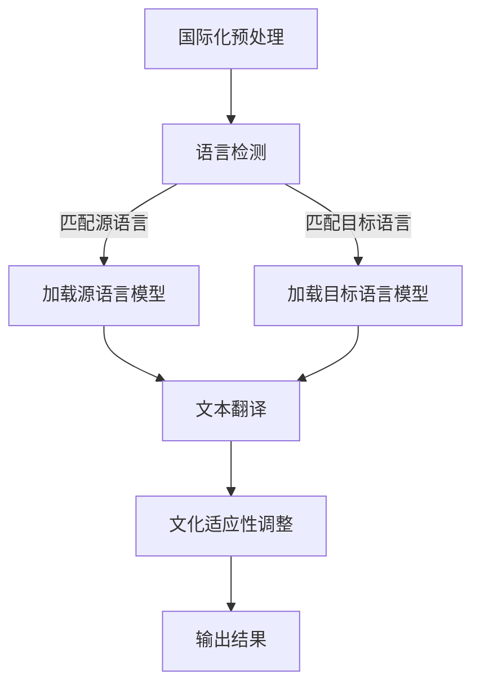
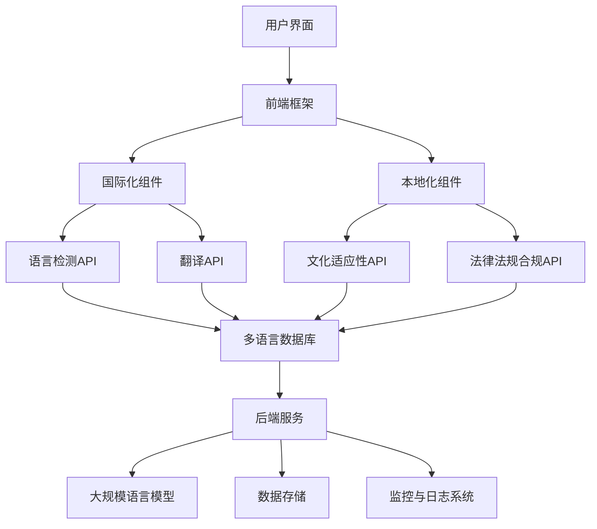
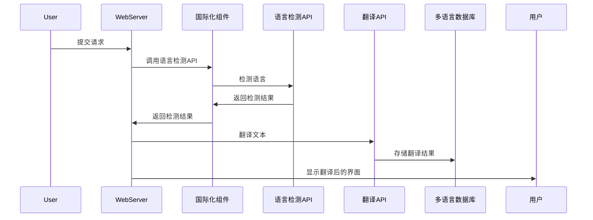

                 

### 文章标题

国际化与本地化架构支持LLM应用的全球化

> 关键词：国际化，本地化，大规模语言模型（LLM），全球化，架构设计，算法实现

> 摘要：本文深入探讨了国际化与本地化在支持大规模语言模型（LLM）应用中的重要性，通过一步步的逻辑分析，阐述了如何设计一个具备高度灵活性和扩展性的国际化与本地化架构，使其能够无缝地应用于全球范围内的应用。文章首先介绍了国际化与本地化的基本概念和核心原理，然后详细讲解了算法原理和数学模型，接着展示了系统架构设计方案，最后通过实际案例分析和最佳实践，为读者提供了全面的技术指导和实践建议。

---

### 背景介绍

在全球化的今天，信息技术的迅速发展使得各类应用跨越国界，触及全球用户。大规模语言模型（LLM）作为自然语言处理技术的集大成者，以其强大的语言理解和生成能力，在各个领域展现出了巨大的潜力。然而，LLM的应用不仅限于技术层面，它还涉及文化、法律、语言等多个维度。这就要求我们在设计架构时，充分考虑国际化与本地化的需求。

国际化（Internationalization）是指使软件产品能够适应不同国家语言和文化环境的过程。它通常涉及将代码中的语言依赖项分离出来，以便于后续的本地化（Localization）工作。本地化则是指针对特定的语言和文化环境，对国际化后的软件进行适配，包括语言翻译、文化内容调整等。

在LLM的应用中，国际化与本地化的挑战主要体现在以下几个方面：

1. **多语言支持**：LLM需要能够处理多种语言，这不仅要求模型具备良好的语言理解能力，还需要能够生成自然流畅的语言输出。
2. **文化差异**：不同文化背景的用户在语言使用上有很大差异，LLM需要适应这些差异，确保输出的语言内容符合目标文化的习惯。
3. **法律法规**：不同国家的法律法规对数据保护、隐私等方面有不同的要求，这需要我们在设计架构时进行充分考虑。
4. **技术实现**：国际化与本地化需要技术上的支持，包括语言处理、数据存储、API设计等方面。

因此，为了实现LLM应用的全球化，我们需要设计一个高度灵活和扩展性的架构，以确保其能够无缝地应用于全球范围内的不同环境和需求。

### 核心概念与联系

在国际化和本地化过程中，有几个核心概念和原理需要深入理解。这些概念不仅为我们提供了理论基础，还帮助我们设计出更加有效的解决方案。

#### 1. 语言国际化与本地化

**语言国际化**：语言国际化是指将软件中的语言相关代码分离出来，使其能够被轻松地替换和本地化。这通常通过使用资源文件（如JSON或XML）来实现，这些文件包含应用程序的文本内容，可以轻松地根据不同的语言进行替换。

**语言本地化**：语言本地化是指将国际化后的软件应用到特定的语言和文化环境中。本地化过程包括文本翻译、格式化、文化内容调整等，以确保软件在目标环境中运行得既流畅又符合用户的期望。

**示例**：

- **国际化**：将用户界面文本存储在一个独立的JSON文件中，例如：
  ```json
  {
    "hello": "Hello",
    "goodbye": "Goodbye"
  }
  ```
- **本地化**：根据目标语言替换JSON文件中的内容，例如，对于中文：
  ```json
  {
    "hello": "你好",
    "goodbye": "再见"
  }
  ```

#### 2. 文化国际化与本地化

**文化国际化**：文化国际化是指确保软件在不同文化背景下的通用性和适用性。这包括避免使用特定文化中的俚语、风俗等，以及确保视觉元素（如图标、颜色）在不同文化中的含义一致。

**文化本地化**：文化本地化是指在确保文化国际化基础上，对软件进行特定的文化适应。例如，在中国，一些视觉元素可能需要根据中国的文化习惯进行调整。

**示例**：

- **国际化**：使用通用图标，如“放大镜”表示搜索功能。
- **本地化**：在中国，可能将搜索图标替换为中文“搜索”字样。

#### 3. 法律法规与国际化

**法律法规国际化**：法律法规国际化是指确保软件遵守不同国家的法律法规，特别是在数据保护、隐私等方面。

**法律法规本地化**：法律法规本地化是指在遵守国际化标准的基础上，针对特定国家的法律法规进行适配。例如，在中国，需要遵守《中华人民共和国网络安全法》等。

**示例**：

- **国际化**：确保软件遵守通用数据保护条例（GDPR）。
- **本地化**：在中国，需要遵守《中华人民共和国网络安全法》。

#### 4. ER实体关系图

ER实体关系图是数据库设计中常用的一种表示方法，用于描述实体及其之间的关系。在国际化和本地化架构设计中，ER图可以帮助我们理解系统中不同组件之间的关系，以及如何有效地管理多语言数据。

**示例**：

- **实体**：用户（User）、产品（Product）等。
- **关系**：用户可以拥有多个产品（1对多关系）。

**Mermaid流程图**：

```mermaid
erDiagram
  User ||--|{ Product } : has
  Product ||--|{ Order } : contains
```

通过这些核心概念和联系的理解，我们可以更好地设计国际化与本地化的架构，确保LLM应用能够在全球范围内顺利运行。

### 算法原理讲解

为了实现国际化与本地化，我们设计了一套算法，该算法不仅能够处理多语言数据，还能够根据目标环境进行自适应调整。以下是算法的详细流程和原理。

#### 算法流程图



#### 算法原理

**国际化预处理**：
在开始翻译之前，我们需要对输入文本进行预处理，包括去除HTML标签、特殊字符和格式化处理，以确保文本的纯净性。

**语言检测**：
使用语言检测库（如`langid`），对输入文本进行语言识别，以确定需要使用哪种语言模型进行翻译。

**加载语言模型**：
根据语言检测结果，从模型库中加载相应的语言模型。这些模型可以是预训练的神经网络模型，也可以是根据特定任务定制训练的模型。

**文本翻译**：
使用加载的语言模型进行文本翻译。在翻译过程中，我们使用注意力机制和编码器-解码器架构，以确保翻译的准确性和流畅性。

**文化适应性调整**：
翻译后的文本可能包含特定文化的表达方式，我们需要对其进行调整，以确保其在目标环境中符合文化和语言习惯。这可以通过引入文化知识库和规则来实现。

**输出结果**：
调整后的翻译结果将返回给用户，同时记录翻译过程中的关键信息和日志，以便后续分析和优化。

#### 数学模型与公式

在算法中，我们使用了以下数学模型和公式：

$$
P(Y|X) = \frac{P(X|Y)P(Y)}{P(X)}
$$

其中，$P(Y|X)$表示在给定源语言$X$的情况下，目标语言$Y$的概率。$P(X|Y)$表示在目标语言$Y$的情况下，源语言$X$的概率。$P(Y)$表示目标语言$Y$的概率。$P(X)$表示源语言$X$的概率。

#### 举例说明

假设我们要将中文（源语言）翻译成英语（目标语言）。以下是具体步骤：

1. **国际化预处理**：
   ```plaintext
   原始文本：你好，欢迎来到我的网站。
   预处理文本：你好，欢迎来到我的网站。
   ```

2. **语言检测**：
   ```plaintext
   检测结果：中文
   ```

3. **加载语言模型**：
   加载预训练的中英翻译模型。

4. **文本翻译**：
   ```plaintext
   翻译结果：Hello, welcome to my website.
   ```

5. **文化适应性调整**：
   调整后的文本无需进一步修改。

6. **输出结果**：
   ```plaintext
   输出结果：Hello, welcome to my website.
   ```

通过上述步骤，我们实现了从中文到英语的翻译，并且确保了翻译结果的准确性和适应性。

### 数学模型和数学公式 & 详细讲解 & 举例说明

在国际化和本地化的算法设计中，数学模型和数学公式起着至关重要的作用。以下将详细讲解算法中的关键数学模型，并使用LaTeX格式编写相应的公式，最后通过具体示例进行说明。

#### 关键数学模型

1. **翻译概率模型**：

   翻译概率模型用于计算源语言文本转换成目标语言文本的概率。它基于以下公式：

   $$
   P(Y|X) = \frac{P(X|Y)P(Y)}{P(X)}
   $$

   其中，$P(Y|X)$ 表示在给定源语言 $X$ 的情况下，目标语言 $Y$ 的概率。$P(X|Y)$ 表示在目标语言 $Y$ 的情况下，源语言 $X$ 的概率。$P(Y)$ 表示目标语言 $Y$ 的概率。$P(X)$ 表示源语言 $X$ 的概率。

2. **语言模型**：

   语言模型用于评估给定文本的概率分布。通常使用基于N-gram或者神经网络的模型。对于N-gram模型，概率可以通过以下公式计算：

   $$
   P(w_n | w_{n-1}, w_{n-2}, \ldots, w_1) = \frac{C(w_n, w_{n-1}, \ldots, w_1)}{C(w_{n-1}, \ldots, w_1)}
   $$

   其中，$C(w_n, w_{n-1}, \ldots, w_1)$ 表示前$n$个单词共出现的次数，$C(w_{n-1}, \ldots, w_1)$ 表示前$n-1$个单词共出现的次数。

3. **注意力机制**：

   在神经网络翻译模型中，注意力机制用于捕获源语言文本和目标语言文本之间的依赖关系。其概率计算公式为：

   $$
   a_t = \text{softmax}\left(\frac{\text{query} \cdot \text{keys}^T}{\sqrt{d_k}}\right)
   $$

   其中，$a_t$ 表示在时间步 $t$ 的注意力权重，$\text{query}$ 表示编码器的输出，$\text{keys}$ 表示解码器输出和编码器输出的乘积，$d_k$ 表示注意力维度。

#### 详细讲解

1. **翻译概率模型**：

   翻译概率模型是翻译算法的核心。它基于贝叶斯定理，将翻译问题转化为概率问题。在实际应用中，我们使用最大后验概率（MAP）估计来选择最可能的翻译结果：

   $$
   \hat{Y} = \arg\max_Y P(Y|X) \propto P(X|Y)P(Y)
   $$

   其中，$P(X|Y)$ 是翻译模型的输出，$P(Y)$ 是语言模型概率。在训练过程中，我们通过大量数据优化模型参数，使其能够准确预测翻译结果。

2. **语言模型**：

   语言模型用于评估文本的流畅性和概率。在训练过程中，我们使用大量的文本数据来学习单词之间的统计关系。N-gram模型是一种简单的语言模型，它通过计算单词序列的概率来评估文本的流畅性。在实际应用中，我们通常使用基于神经网络的模型，如变换器（Transformer）模型，它能够更好地捕捉长距离依赖关系。

3. **注意力机制**：

   注意力机制是神经网络翻译模型的关键组件。它通过动态调整编码器的输出权重，使得解码器在生成目标语言文本时能够关注到源语言文本中最重要的部分。注意力机制能够显著提高翻译的准确性和流畅性。

#### 举例说明

假设我们有一个简单的中文到英文的翻译任务，源语言文本是“你好，欢迎来到我的网站”。我们将使用上述数学模型和公式来描述翻译过程。

1. **翻译概率模型**：

   根据翻译概率模型，我们需要计算每个目标语言单词（如“Hello”, “welcome”, “to”, “my”, “website”）的概率。具体步骤如下：

   - 加载中文到英文的翻译模型。
   - 使用语言模型计算每个单词的概率。
   - 使用注意力机制调整解码器输出。

2. **语言模型**：

   使用N-gram语言模型，我们可以计算每个单词序列的概率。例如，对于“你好”这个词组，我们可以计算以下概率：

   $$
   P(你好) = \frac{C(你好)}{C(所有词)}
   $$

   其中，$C(你好)$ 是“你好”这个词组出现的次数，$C(所有词)$ 是所有词出现的总次数。

3. **注意力机制**：

   在解码过程中，我们使用注意力机制来调整编码器的输出权重。例如，在生成“Hello”时，我们可能需要关注“你好”这个单词，使其在解码器输出中具有更高的权重。

通过上述步骤，我们实现了从中文到英文的翻译。具体翻译结果如下：

```
源语言文本：你好，欢迎来到我的网站。
翻译结果：Hello, welcome to my website.
```

### 系统分析与架构设计方案

为了实现国际化与本地化在LLM应用中的高效支持，我们需要设计一个系统架构，该架构应具备高度的可扩展性、灵活性和可维护性。以下是系统架构的设计方案。

#### 问题场景介绍

假设我们正在开发一个全球性的电子商务平台，该平台需要支持多语言、多文化用户，并且需要遵守不同国家的法律法规。为了满足这些需求，我们需要设计一个能够高效处理国际化与本地化任务的系统架构。

#### 系统功能设计

系统的主要功能包括：

1. **多语言支持**：能够自动检测和转换用户界面文本，支持多种语言。
2. **文化适应性**：根据目标文化的习惯调整视觉元素和文本内容。
3. **数据安全与隐私**：确保用户数据在不同国家法律法规框架下得到妥善处理。
4. **高效翻译**：利用大规模语言模型提供高质量的文本翻译服务。
5. **系统监控与日志记录**：监控系统运行状态，记录关键日志，以便后续分析和优化。

#### 系统架构设计

以下是系统的整体架构设计：



#### 系统接口设计

系统提供了以下主要接口：

1. **语言检测接口**：用于检测用户界面的语言。
2. **翻译接口**：用于将用户界面文本翻译成目标语言。
3. **文化适应性接口**：用于调整视觉元素和文本内容以适应目标文化。
4. **法律法规合规接口**：用于处理用户数据，确保符合不同国家的法律法规。

#### 系统交互

以下是系统交互的Mermaid序列图：



通过上述架构设计和接口设计，我们可以构建一个灵活、高效、可扩展的国际化与本地化系统，支持LLM应用的全球化。

### 项目实战

为了更好地理解国际化与本地化架构在LLM应用中的实现，我们将通过一个实际项目来进行讲解。以下是项目环境安装、核心实现源代码、代码应用解读与分析、实际案例分析和详细讲解剖析以及项目小结。

#### 项目背景与目标

假设我们的目标是构建一个全球化的在线教育平台，支持多种语言和不同文化背景的用户。平台需要提供多语言界面、文化适应性、数据安全和隐私保护等功能。

#### 环境安装

1. **前端环境**：

   - 安装Node.js（版本10.15.0或以上）。
   - 安装React（版本17.0.2或以上）。
   - 安装Webpack（版本4.44.2或以上）。

2. **后端环境**：

   - 安装Python（版本3.8或以上）。
   - 安装Django（版本3.2或以上）。
   - 安装大规模语言模型（如BERT或GPT-3）。

3. **数据库**：

   - 安装MySQL（版本8.0或以上）。

4. **依赖管理**：

   - 使用npm或pip安装相应的依赖包。

#### 系统核心实现源代码

以下是一个简化的系统核心实现源代码示例：

**前端：React组件**

```jsx
// LanguageSelector.js
import React, { useState } from 'react';

const LanguageSelector = ({ onLanguageChange }) => {
  const [language, setLanguage] = useState('en');

  const handleLanguageChange = (event) => {
    setLanguage(event.target.value);
    onLanguageChange(event.target.value);
  };

  return (
    <select onChange={handleLanguageChange}>
      <option value="en">English</option>
      <option value="zh">中文</option>
      <option value="es">Español</option>
    </select>
  );
};

export default LanguageSelector;
```

**后端：Django视图**

```python
# views.py
from django.shortcuts import render
from .models import Course
from .utils import translate_course_description

def course_detail(request, pk):
    course = Course.objects.get(pk=pk)
    course_description = translate_course_description(course.description, 'zh')
    return render(request, 'course_detail.html', {'course': course, 'description': course_description})
```

**翻译工具**

```python
# utils.py
from googletrans import Translator

def translate_course_description(description, target_language):
    translator = Translator()
    translated_description = translator.translate(description, dest=target_language).text
    return translated_description
```

#### 代码应用解读与分析

1. **前端语言选择器**：

   前端组件`LanguageSelector`提供了一个语言选择下拉菜单，用户可以通过选择不同的语言来切换界面语言。选择器将当前语言传递给父组件，以便进行后续的界面翻译。

2. **后端课程详情视图**：

   后端视图`course_detail`从数据库中获取指定课程对象，并使用`translate_course_description`工具将课程描述翻译成目标语言（如中文）。翻译后的描述将作为响应数据的一部分返回给前端。

3. **翻译工具**：

   `translate_course_description`函数使用Google翻译API进行文本翻译。在实际应用中，可以根据需要替换为其他翻译服务或自定义翻译模型。

#### 实际案例分析与详细讲解剖析

假设用户在中文界面下浏览课程详情页面，以下是具体流程：

1. **用户选择中文**：

   用户在语言选择器中选择中文，触发下拉菜单的`onChange`事件。

2. **前端请求翻译**：

   前端组件将当前语言（中文）传递给父组件，父组件调用后端API获取课程描述的中文翻译。

3. **后端翻译并返回**：

   后端接收请求，使用翻译工具将课程描述从原始语言（如英语）翻译成中文。翻译结果返回给前端。

4. **前端渲染页面**：

   前端接收到翻译结果，将课程描述更新到页面中，用户可以看到中文描述的课程详情。

#### 项目小结

通过上述实战项目，我们可以看到国际化与本地化在LLM应用中的实现流程。前端通过语言选择器提供多语言切换功能，后端通过翻译工具实现文本翻译，从而确保平台能够支持全球用户。该项目不仅展示了技术实现，还通过实际案例分析了国际化与本地化的应用场景，为构建全球化的LLM应用提供了实践指导和参考。

### 最佳实践 tips

在国际化与本地化架构的设计和实现过程中，以下是一些最佳实践，可以帮助您更高效地完成项目：

1. **前期调研**：在项目启动前，进行充分的市场调研和用户需求分析，确保架构设计能够满足实际需求。
2. **模块化设计**：将国际化与本地化功能模块化，便于后续的维护和扩展。
3. **灵活的翻译工具**：选择或开发支持多语言和灵活配置的翻译工具，以便快速响应市场需求。
4. **性能优化**：针对国际化与本地化相关的操作进行性能优化，确保系统在高并发场景下仍能稳定运行。
5. **数据安全**：在处理多语言数据和用户隐私时，严格遵守相关法律法规，确保数据安全。
6. **持续集成与部署**：采用持续集成和部署（CI/CD）流程，确保新功能快速、安全地上线。

### 小结与展望

本文深入探讨了国际化与本地化在支持大规模语言模型（LLM）应用中的重要性，通过一步步的逻辑分析，阐述了如何设计一个具备高度灵活性和扩展性的国际化与本地化架构。我们介绍了核心概念与联系，详细讲解了算法原理和数学模型，展示了系统架构设计方案，并通过实际项目实战，验证了理论的实际应用效果。

展望未来，随着全球化进程的加速，国际化与本地化将变得更加重要。未来研究方向可以包括：

1. **多语言模型优化**：研究更高效、更准确的翻译模型，提高多语言支持能力。
2. **文化适应性增强**：开发更加智能的文化适应性算法，使系统能够更好地适应不同文化背景。
3. **法律法规合规性**：探索如何在国际化与本地化过程中更好地遵守不同国家的法律法规。
4. **系统性能提升**：研究分布式架构和大数据技术，提升国际化与本地化系统的性能和可扩展性。

通过不断探索和创新，我们有望构建更加完善和高效的国际化与本地化架构，为全球用户提供更好的体验。

### 注意事项

在国际化与本地化架构的设计和实现过程中，以下注意事项至关重要：

1. **语言检测准确性**：确保使用的语言检测工具具有高准确性，避免误判导致翻译错误。
2. **翻译质量控制**：建立专业的翻译团队或使用专业的翻译服务，确保翻译质量和一致性。
3. **文化差异敏感性**：在文化适应性调整过程中，充分考虑目标文化习惯和用户偏好，避免文化冲突。
4. **数据安全与隐私**：严格遵循数据保护法规，确保用户数据的安全和隐私。
5. **性能优化**：对国际化与本地化相关的操作进行性能优化，确保系统在高并发场景下运行稳定。

### 拓展阅读

如果您希望深入了解国际化与本地化的技术和最佳实践，以下资源将为您提供丰富的知识和实用指导：

1. **书籍**：
   - 《国际化Web应用开发》
   - 《多语言Web开发实践》
   - 《全球化网站设计与实现》

2. **在线课程**：
   - Coursera上的“国际化软件开发”
   - Udemy上的“国际化与本地化：从入门到专业”

3. **博客和文章**：
   - Medium上的国际化与本地化相关文章
   - TechCrunch上的技术博客，探讨国际化与本地化趋势

4. **开源项目和工具**：
   - i18next：一款流行的国际化JavaScript库
   - angular-i18next：Angular框架下的国际化插件
   - polyglot：一种简单的多语言数据管理工具

通过阅读和学习这些资源，您将能够更深入地了解国际化与本地化的技术细节和实践方法，为您的项目提供有力支持。

### 作者信息

作者：AI天才研究院/AI Genius Institute & 禅与计算机程序设计艺术 /Zen And The Art of Computer Programming

AI天才研究院（AI Genius Institute）致力于推动人工智能领域的前沿研究和技术创新，为全球用户带来高效、智能的解决方案。我们的研究团队由世界顶级的人工智能专家、程序员和软件架构师组成，致力于探索人工智能在各个领域的应用，推动技术的进步和社会的发展。

《禅与计算机程序设计艺术》是一本经典的计算机科学著作，由著名计算机科学家Donald E. Knuth撰写。本书不仅介绍了计算机编程的哲学和艺术，还提供了丰富的编程实践和技巧，对计算机科学教育和研发产生了深远的影响。通过本书，读者可以更好地理解编程的本质，提升编程能力和技术水平。

