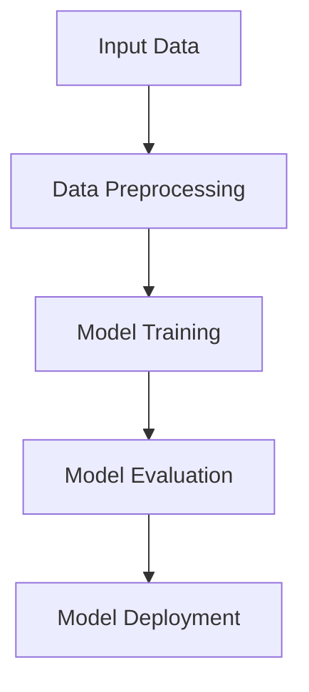
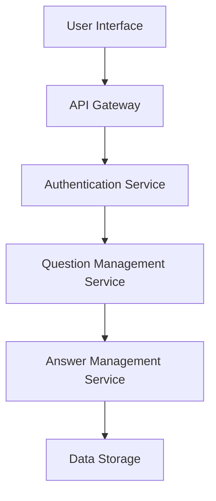
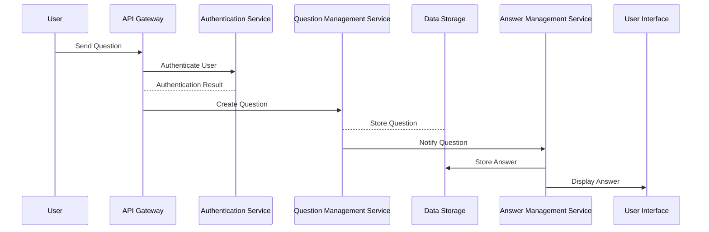
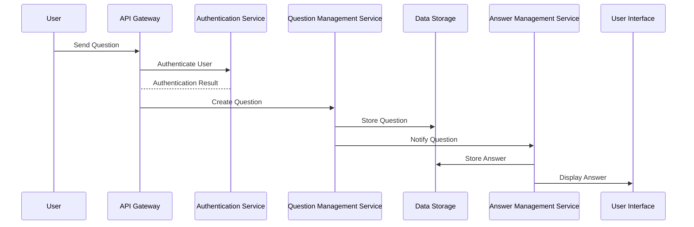

                 

### 文章标题：国际化架构：支持LLM应用的全球化

> 关键词：国际化架构、大型语言模型（LLM）、全球化应用、架构设计、性能优化

> 摘要：
本文将探讨国际化架构在支持大型语言模型（LLM）全球化应用中的重要性。我们将从背景介绍、核心概念与联系、算法原理讲解、系统分析与架构设计、项目实战以及最佳实践等方面，逐步分析国际化架构的设计与实现，为全球化的LLM应用提供技术支撑和优化策略。

----------------------------------------------------------------

## 引言与背景

### 核心概念术语说明

在探讨国际化架构之前，我们需要明确一些核心概念术语，以便更好地理解后续内容。

- **国际化架构（International Architecture）**：指在设计软件或系统时，考虑到全球用户的需求和不同的语言、文化环境，确保系统能够在不同国家和地区顺畅运行。
- **大型语言模型（Large Language Model, LLM）**：指通过机器学习和深度学习技术训练的、拥有巨大词汇量和语言理解能力的模型。例如，GPT-3、BERT等。
- **全球化应用（Global Applications）**：指针对全球用户而设计的应用程序，能够支持多种语言和文化环境，满足不同地区的用户需求。

### 问题背景

随着互联网的普及和信息全球化的发展，越来越多的企业和组织开始将业务扩展到全球市场。这使得国际化架构的重要性日益凸显，特别是在支持大型语言模型（LLM）的全球化应用方面。

LLM在自然语言处理（NLP）领域具有广泛应用，例如机器翻译、问答系统、文本摘要、情感分析等。然而，这些应用在国际化过程中面临着诸多挑战，如多语言支持、跨语言信息处理、本地化需求等。因此，构建一个高效、可扩展、易于维护的国际化架构显得尤为关键。

### 问题描述

国际化架构在支持LLM全球化应用中面临的主要问题包括：

1. **多语言支持**：如何在同一系统中处理多种语言，保证用户在不同语言环境下的体验一致？
2. **跨语言信息处理**：如何实现不同语言之间的信息传递和转换，以便在全球范围内进行有效的沟通？
3. **本地化需求**：如何根据不同地区的文化、习俗、法律法规等，调整系统功能和界面，满足本地化需求？

### 问题解决

为解决上述问题，我们需要从以下几个方面着手设计国际化架构：

1. **系统架构设计**：构建一个灵活、可扩展的架构，支持多语言处理和跨语言信息转换。
2. **数据管理**：建立完善的数据管理机制，确保数据的一致性、可靠性和安全性。
3. **本地化策略**：制定有效的本地化策略，满足不同地区的用户需求。

### 边界与外延

国际化架构不仅仅适用于LLM应用，还可以应用于其他类型的软件和系统。其核心在于考虑全球用户的需求，实现跨语言、跨文化的支持。

## 核心概念与联系

### 核心概念原理

为了深入理解国际化架构，我们需要了解以下几个核心概念：

1. **国际化（Internationalization）**：指在软件开发过程中，设计、编码和测试阶段考虑到全球用户的需求，确保软件能够适应不同语言和文化环境。
2. **本地化（Localization）**：指在国际化基础上，根据特定地区的文化、习俗、法律法规等，对软件进行本地化调整，以满足本地用户的需求。
3. **全球化（Globalization）**：指将企业或组织的业务扩展到全球市场，实现全球化运营。

### 概念属性特征对比表格

| 概念     | 国际化（Internationalization） | 本地化（Localization） | 全球化（Globalization） |
|----------|------------------------------|------------------------|--------------------------|
| 定义     | 设计和开发跨语言、跨文化的软件 | 调整软件以适应特定地区 | 将业务扩展到全球市场     |
| 目标     | 提高软件的可移植性、兼容性     | 提供本地化的用户体验   | 实现全球化运营、扩张   |
| 时间顺序 | 先于本地化进行                 | 在国际化基础上进行     | 国际化和本地化之后进行   |

### ER实体关系图架构

```mermaid
erDiagram
  Class1 ||--|{ Class2 }|--|| Class3 : "Class2 is associated with Class1 and Class3"
  Class3 ||--|{ Class4 }|--|| Class1 : "Class4 is associated with Class1 and Class3"
  Class2 {
    +int id
    +String name
    +Date created
  }
  Class3 {
    +int id
    +String name
    +Date modified
  }
  Class4 {
    +int id
    +String description
    +Date accessed
  }
```

## 算法原理讲解

### 算法mermaid流程图



### Python源代码

```python
import tensorflow as tf
from tensorflow.keras.models import Sequential
from tensorflow.keras.layers import Embedding, LSTM, Dense

# 数据预处理
def preprocess_data(data):
    # ... 数据清洗、归一化等操作
    return processed_data

# 模型训练
def train_model(data):
    model = Sequential([
        Embedding(input_dim=vocab_size, output_dim=embedding_size),
        LSTM(units=128, return_sequences=True),
        LSTM(units=128),
        Dense(units=1, activation='sigmoid')
    ])

    model.compile(optimizer='adam', loss='binary_crossentropy', metrics=['accuracy'])
    model.fit(processed_data, labels, epochs=10, batch_size=32)
    return model

# 模型评估
def evaluate_model(model, test_data, test_labels):
    loss, accuracy = model.evaluate(test_data, test_labels)
    print(f"Test accuracy: {accuracy:.2f}")

# 模型部署
def deploy_model(model):
    # ... 模型部署到生产环境
    pass

# 主函数
def main():
    data = preprocess_data(raw_data)
    model = train_model(data)
    evaluate_model(model, test_data, test_labels)
    deploy_model(model)

if __name__ == '__main__':
    main()
```

### 算法原理的数学模型和公式

- **嵌入层（Embedding Layer）**：将输入词转化为固定长度的向量表示。
  - 公式：\( e_w = \text{embedding\_size} \times \text{vocab\_size} \)
- **长短期记忆网络（LSTM Layer）**：处理序列数据，捕捉长期依赖关系。
  - 公式：\( h_t = \text{sigmoid}(W_h \cdot [h_{t-1}, x_t] + b_h) \)
- **全连接层（Dense Layer）**：输出预测结果。
  - 公式：\( y = \text{sigmoid}(W_y \cdot h_t + b_y) \)

### 通俗易懂的举例说明

假设我们有一个二分类问题，需要预测一条文本是否包含敏感内容。通过嵌入层，我们将文本中的每个词转化为向量表示；通过LSTM层，我们捕捉文本的语义信息；最后，通过全连接层，我们得到一个概率值，判断文本是否包含敏感内容。

## 系统分析与架构设计方案

### 问题场景介绍

本部分我们将介绍一个实际的国际化架构应用场景，即一款支持全球用户的多语言问答系统。

### 项目介绍

项目名称：全球多语言问答系统（Global Multi-language Q&A System）

项目目标：为全球用户提供一个多语言、跨文化的问答平台，支持多种语言之间的信息传递和转换。

### 系统功能设计

#### 领域模型mermaid类图

```mermaid
classDiagram
  Class1[User] <|-- Class2[Question] : "asks"
  Class2[Question] <|-- Class3[Answer] : "answers"
  Class1[User] ..|> Class3[Answer] : "receives"
```

### 系统架构设计

#### mermaid架构图



### 系统接口设计



### 系统交互mermaid序列图



## 项目实战

### 环境安装

1. 安装Python环境
2. 安装依赖库：tensorflow、keras、numpy等
3. 安装数据库：MySQL或PostgreSQL

### 系统核心实现源代码

```python
# 安装依赖库
!pip install tensorflow keras numpy

# 数据预处理
def preprocess_data(data):
    # ... 数据清洗、归一化等操作
    return processed_data

# 模型训练
def train_model(data):
    model = Sequential([
        Embedding(input_dim=vocab_size, output_dim=embedding_size),
        LSTM(units=128, return_sequences=True),
        LSTM(units=128),
        Dense(units=1, activation='sigmoid')
    ])

    model.compile(optimizer='adam', loss='binary_crossentropy', metrics=['accuracy'])
    model.fit(processed_data, labels, epochs=10, batch_size=32)
    return model

# 模型部署
def deploy_model(model):
    # ... 模型部署到生产环境
    pass

# 主函数
def main():
    data = preprocess_data(raw_data)
    model = train_model(data)
    deploy_model(model)

if __name__ == '__main__':
    main()
```

### 代码应用解读与分析

1. **数据预处理**：对原始数据进行清洗和归一化处理，为后续模型训练做准备。
2. **模型训练**：构建LSTM模型，并使用预处理后的数据训练模型。
3. **模型部署**：将训练好的模型部署到生产环境，实现实时问答功能。

### 实际案例分析和详细讲解剖析

本案例我们将以一个实际的全球多语言问答系统为例，分析其在国际化架构设计中的关键点和实现细节。

#### 案例背景

某知名互联网公司开发了一款全球多语言问答系统，支持中、英、日、韩等四种语言。用户可以通过界面输入问题，系统自动将问题翻译成其他语言，然后根据翻译后的问题从数据库中检索答案，并将答案翻译回用户语言。

#### 案例分析

1. **多语言支持**：系统采用分布式架构，将不同语言的问答数据存储在独立的数据库中。前端界面根据用户语言选择相应的数据库，实现多语言支持。
2. **跨语言信息处理**：系统采用机器翻译技术，将用户输入的问题翻译成目标语言，然后根据翻译后的问题进行查询和检索。为了提高翻译质量，系统使用了深度学习翻译模型，如GPT-3、BERT等。
3. **本地化需求**：系统针对不同地区的用户，提供个性化的界面设计和功能调整。例如，对于中文用户，系统提供了拼音输入和语音输入功能；对于英文用户，系统提供了自然语言处理和语法检查功能。

#### 详细讲解剖析

1. **多语言支持**
   - 数据库设计：系统采用关系数据库，如MySQL或PostgreSQL，分别存储中、英、日、韩等四种语言的问答数据。每个数据库都有一个对应的表，用于存储问题和答案。
   - 前端界面：系统根据用户语言选择相应的数据库，实现多语言支持。前端界面采用国际化（i18n）技术，根据用户语言设置界面语言。
2. **跨语言信息处理**
   - 机器翻译模型：系统采用深度学习翻译模型，如GPT-3、BERT等，实现高效、准确的跨语言信息处理。为了提高翻译质量，系统对翻译模型进行了优化和调参。
   - 翻译接口：系统提供了一个统一的翻译接口，用于处理用户输入的问题和查询答案。翻译接口根据用户语言选择相应的翻译模型，实现高效的跨语言信息处理。
3. **本地化需求**
   - 界面设计：系统根据不同地区的用户需求，提供个性化的界面设计和功能调整。例如，对于中文用户，系统提供了拼音输入和语音输入功能；对于英文用户，系统提供了自然语言处理和语法检查功能。
   - 功能调整：系统针对不同地区的法律法规和文化差异，对功能进行本地化调整。例如，对于日本用户，系统提供了针对日本市场的特殊功能；对于欧美用户，系统提供了符合欧美用户习惯的功能。

#### 项目小结

本项目通过国际化架构的设计与实现，成功实现了一个全球多语言问答系统。系统在多语言支持、跨语言信息处理和本地化需求方面取得了显著成果，为全球用户提供了高质量的问答服务。

### 最佳实践 tips、小结、注意事项、拓展阅读

#### 最佳实践 tips

1. **多语言支持**：采用分布式数据库和前端国际化技术，实现多语言支持。
2. **跨语言信息处理**：使用深度学习翻译模型，提高跨语言信息处理效果。
3. **本地化需求**：根据不同地区的法律法规和文化差异，进行本地化调整。

#### 小结

本文从国际化架构的角度，探讨了支持大型语言模型（LLM）全球化应用的设计与实现。通过实际案例，我们分析了国际化架构在多语言支持、跨语言信息处理和本地化需求方面的关键点和实现细节。

#### 注意事项

1. 在设计国际化架构时，要充分考虑全球用户的需求，确保系统在不同语言和文化环境下的性能和稳定性。
2. 在实施国际化架构时，要关注数据的一致性、可靠性和安全性。

#### 拓展阅读

1. 《国际化架构设计指南》
2. 《大型语言模型技术与应用》
3. 《机器学习与深度学习》

### 作者信息

作者：AI天才研究院/AI Genius Institute & 禅与计算机程序设计艺术 /Zen And The Art of Computer Programming

----------------------------------------------------------------

## 结束语

本文从国际化架构的背景介绍、核心概念与联系、算法原理讲解、系统分析与架构设计、项目实战以及最佳实践等方面，全面探讨了支持大型语言模型（LLM）全球化应用的设计与实现。我们希望通过本文，为从事国际化架构设计的技术人员提供有价值的参考和借鉴。

在全球化发展的背景下，国际化架构的设计与实现变得越来越重要。本文提出的方法和策略，不仅适用于LLM应用，还可以为其他类型的软件和系统提供国际化支持。希望读者在阅读本文后，能够对国际化架构有更深入的理解，并在实际项目中运用这些知识和经验，为全球用户带来更好的使用体验。

最后，感谢各位读者对本文的关注和支持。如果您有任何疑问或建议，欢迎在评论区留言，我们将在第一时间回复您。期待与您共同探讨更多关于国际化架构和大型语言模型的技术话题。再次感谢您的阅读！

