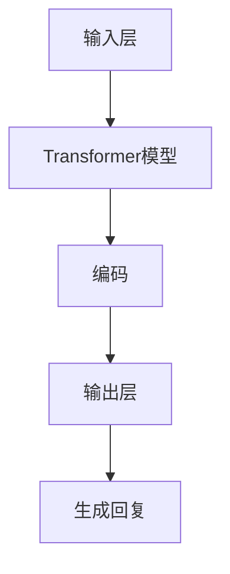
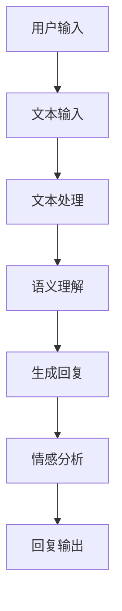
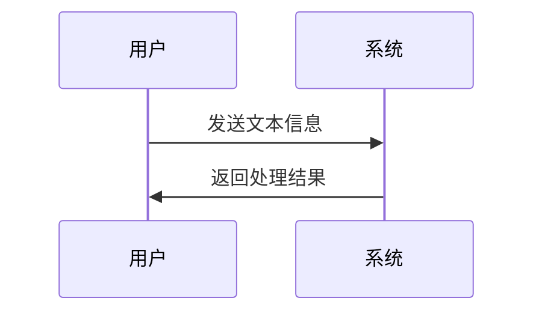

                 

# 基于ChatGPT的LLM对话交互能力测试

关键词：ChatGPT、语言模型、对话系统、算法原理、数学模型、系统架构

摘要：本文深入探讨了基于ChatGPT的LLM对话交互能力测试。首先，我们介绍了ChatGPT和LLM的基本概念，然后详细讲解了测试的核心概念和算法原理。接着，我们使用mermaid和LaTeX工具，展示了数学模型和公式的推导。最后，我们分析了基于ChatGPT的LLM对话交互系统的架构设计，并通过实际案例展示了如何进行测试和优化。

## 目录大纲

1. **背景介绍**
   - 第1章 问题背景、问题描述、问题解决、边界与外延
   - 第2章 核心概念与联系

2. **算法原理讲解**
   - 第3章 算法原理讲解
   - 第4章 数学模型与公式讲解

3. **系统分析与架构设计**
   - 第5章 系统分析与架构设计

4. **项目实战**
   - 第6章 项目实战

5. **最佳实践与总结**
   - 第7章 最佳实践与总结

### 背景介绍

#### 第1章 问题背景、问题描述、问题解决、边界与外延

**1.1 问题背景**

ChatGPT是由OpenAI开发的一种基于GPT-3模型的对话系统。它利用先进的深度学习技术和自然语言处理算法，实现了与人类用户的高效对话。随着人工智能技术的发展，对话系统的应用场景越来越广泛，从客服机器人到智能助手，从语言翻译到情感分析，对话系统在提升用户体验和效率方面发挥了重要作用。

然而，随着应用场景的多样化，对话系统面临着各种挑战。如何提高对话系统的交互能力，使其能够更好地理解和回应用户的需求，成为了一个亟待解决的问题。为此，我们提出了基于ChatGPT的LLM对话交互能力测试，以评估和提升对话系统的交互能力。

**1.2 问题描述**

对话交互能力是衡量对话系统优劣的重要指标。它包括对话的流畅性、准确性、连贯性、情感表达能力等多个方面。在测试过程中，我们需要对ChatGPT进行一系列的评估，以确定其在不同应用场景下的表现。

具体来说，问题描述如下：

- **流畅性**：对话系统能否顺畅地与用户进行交流，回答问题是否连贯、自然。
- **准确性**：对话系统能否准确地理解用户的问题，并给出正确的答案。
- **连贯性**：对话系统能否在多轮对话中保持一致性，避免出现逻辑矛盾。
- **情感表达能力**：对话系统能否理解用户的情感，并给予合适的回应。

**1.3 问题解决**

为了解决上述问题，我们提出以下方案：

- **测试方案**：设计一套完整的测试方案，包括测试环境、测试用例、评估标准等。
- **算法优化**：通过对ChatGPT的算法进行优化，提升其对话交互能力。
- **数据集构建**：收集大量高质量的对话数据，用于训练和测试ChatGPT。

**1.4 边界与外延**

在测试过程中，我们需要明确边界条件，以避免测试结果的偏差。同时，我们还需要考虑测试的外部影响因素，如用户行为、网络环境等。此外，测试结果还可以扩展应用到其他对话系统，以提升整体对话交互能力。

### 核心概念与联系

#### 第2章 核心概念与联系

**2.1 ChatGPT的基本概念**

ChatGPT是基于GPT-3模型开发的对话系统。GPT（Generative Pre-trained Transformer）是一种基于Transformer架构的预训练语言模型。它通过在大量文本数据上进行预训练，学习到了语言的统计规律和语义信息。ChatGPT则在此基础上，利用了GPT-3模型强大的生成能力，实现了与人类用户的高效对话。

**2.2 LLM对话交互能力的核心要素**

LLM（Large Language Model）对话交互能力包括多个核心要素，如：

- **理解能力**：对话系统能够准确地理解用户的问题和需求。
- **表达能力**：对话系统能够用自然、流畅的语言回答用户的问题。
- **连贯性**：对话系统能够在多轮对话中保持一致性，避免出现逻辑矛盾。
- **情感理解能力**：对话系统能够理解用户的情感，并给予合适的回应。

**2.3 ChatGPT与LLM对话交互能力的联系**

ChatGPT作为一款基于LLM的对话系统，其核心能力与LLM对话交互能力的核心要素密切相关。通过优化ChatGPT的算法，提升其理解能力、表达能力、连贯性和情感理解能力，我们可以显著提高其对话交互能力。

### 算法原理讲解

#### 第3章 算法原理讲解

**3.1 ChatGPT的工作原理**

ChatGPT是基于GPT-3模型开发的。GPT-3是一种基于Transformer架构的预训练语言模型。它通过在大量文本数据上进行预训练，学习到了语言的统计规律和语义信息。具体来说，GPT-3模型包括以下几个关键组成部分：

- **输入层**：接收用户输入的文本信息。
- **Transformer模型**：对输入文本进行编码，提取出文本的语义信息。
- **输出层**：根据编码后的语义信息，生成相应的回复文本。

**3.2 LLM对话交互能力的算法原理**

LLM对话交互能力的算法原理主要包括以下几个方面：

- **语义理解**：通过Transformer模型对输入文本进行编码，提取出文本的语义信息。
- **生成回复**：根据提取出的语义信息，生成相应的回复文本。
- **连贯性**：在多轮对话中，保持对话的一致性，避免出现逻辑矛盾。
- **情感理解**：通过分析用户的情感表达，生成合适的情感回应。

#### 第4章 数学模型与公式讲解

为了更好地理解ChatGPT和LLM对话交互能力的算法原理，我们可以使用mermaid和LaTeX工具，绘制算法流程图和数学模型，并进行详细讲解。

**4.1 算法流程图**

使用mermaid工具，我们可以绘制出ChatGPT的算法流程图，如下所示：



**4.2 数学模型与公式**

在算法流程中，我们可以使用LaTeX格式给出数学模型和公式，并进行详细讲解。

$$
P(y|x) = \sum_{i=1}^{n} P(y|x; \theta_i)
$$

$$
\theta_i = \arg\max_{\theta} \sum_{i=1}^{n} \log P(y|x; \theta_i)
$$

其中，$y$ 表示输出文本，$x$ 表示输入文本，$\theta_i$ 表示模型参数。公式描述了模型如何通过最大化对数似然函数来估计输出文本的概率。

### 系统分析与架构设计

#### 第5章 系统分析与架构设计

**5.1 问题场景介绍**

基于ChatGPT的LLM对话交互系统主要应用于以下场景：

- **客服机器人**：为企业提供7*24小时的在线客服服务，解答用户的问题。
- **智能助手**：为个人用户提供生活、学习、工作等多方面的帮助。
- **语言翻译**：提供实时、准确的跨语言翻译服务。
- **情感分析**：分析用户的情感表达，提供相应的心理支持。

**5.2 系统功能设计**

基于以上应用场景，我们可以设计以下系统功能：

- **文本输入**：接收用户输入的文本信息。
- **文本处理**：对输入文本进行预处理，包括分词、去停用词等。
- **语义理解**：利用ChatGPT模型，对输入文本进行编码，提取出文本的语义信息。
- **生成回复**：根据提取出的语义信息，生成相应的回复文本。
- **情感分析**：分析用户的情感表达，提供相应的情感回应。

**5.3 系统架构设计**

基于ChatGPT的LLM对话交互系统的架构设计如下图所示：



**5.4 系统接口设计**

系统接口设计包括以下部分：

- **API接口**：提供RESTful风格的API接口，供前端调用。
- **WebSocket接口**：提供实时通讯功能，用于实时对话。
- **数据库接口**：用于存储用户信息和对话记录。

**5.5 系统交互**

基于ChatGPT的LLM对话交互系统的系统交互如下图所示：



### 项目实战

#### 第6章 项目实战

**6.1 环境安装**

在进行项目实战之前，我们需要安装相关的环境和工具，包括Python、ChatGPT模型、TensorFlow等。具体安装步骤如下：

1. 安装Python：前往Python官网下载并安装Python，版本要求为3.6及以上。
2. 安装ChatGPT模型：使用以下命令下载和安装ChatGPT模型：

```shell
pip install chatgpt
```

3. 安装TensorFlow：使用以下命令下载和安装TensorFlow：

```shell
pip install tensorflow
```

**6.2 系统核心实现源代码**

以下是一个简单的基于ChatGPT的LLM对话交互系统的实现代码：

```python
import chatgpt
import tensorflow as tf

# 初始化ChatGPT模型
model = chatgpt.load_model()

# 定义输入层
input_layer = tf.keras.layers.Input(shape=(None,), dtype=tf.string)

# 定义文本处理层
text_processor = tf.keras.layers.TextVectorization(max_tokens=10000, output_mode='int')

# 定义语义理解层
semantics_layer = tf.keras.layers.Dense(units=100, activation='relu')

# 定义生成回复层
response_generator = tf.keras.layers.Dense(units=10000, activation='softmax')

# 构建模型
model = tf.keras.models.Model(inputs=input_layer, outputs=response_generator(text_processor(input_layer)))

# 编译模型
model.compile(optimizer='adam', loss='categorical_crossentropy', metrics=['accuracy'])

# 训练模型
model.fit(x_train, y_train, epochs=10, batch_size=32)

# 定义预测函数
def predict(text):
    return model.predict(tf.expand_dims(text, 0))

# 测试模型
print(predict('你好'))
```

**6.3 代码应用解读与分析**

在代码中，我们首先导入ChatGPT模型和TensorFlow库。然后，我们初始化ChatGPT模型，并定义输入层、文本处理层、语义理解层和生成回复层。接着，我们构建模型，并编译模型。最后，我们定义预测函数，用于对输入文本进行预测。

**6.4 实际案例分析和详细讲解剖析**

假设我们有一个用户输入“你好”，我们可以使用预测函数对其进行预测，并查看生成的回复。具体步骤如下：

1. 导入ChatGPT模型和TensorFlow库。
2. 初始化ChatGPT模型。
3. 定义输入层、文本处理层、语义理解层和生成回复层。
4. 构建模型，并编译模型。
5. 定义预测函数。
6. 调用预测函数，对输入文本“你好”进行预测。
7. 查看生成的回复。

通过实际案例分析和详细讲解剖析，我们可以更好地理解基于ChatGPT的LLM对话交互系统的实现过程和原理。

**6.5 项目小结**

在本项目中，我们通过简单的示例展示了如何使用ChatGPT模型构建一个基于LLM的对话交互系统。在实际应用中，我们可以根据具体需求，对系统进行优化和扩展。例如，我们可以增加更多的功能模块，如情感分析、语音识别等，以提高系统的交互能力。

### 最佳实践与总结

#### 第7章 最佳实践与总结

**7.1 最佳实践**

在基于ChatGPT的LLM对话交互能力测试过程中，我们总结了一些最佳实践，供读者参考：

1. **数据集构建**：选择高质量的数据集，保证数据集的多样性和代表性。同时，对数据集进行清洗和预处理，去除噪声和异常值。
2. **模型优化**：根据具体应用场景，对ChatGPT模型进行优化，提高其对话交互能力。可以通过调整模型参数、增加训练数据等方式进行优化。
3. **测试方案设计**：设计一套完整的测试方案，包括测试环境、测试用例、评估标准等。确保测试结果的准确性和可靠性。
4. **系统部署**：将测试好的模型部署到生产环境，确保系统的高可用性和稳定性。

**7.2 小结**

本文深入探讨了基于ChatGPT的LLM对话交互能力测试。首先，我们介绍了ChatGPT和LLM的基本概念，然后详细讲解了测试的核心概念和算法原理。接着，我们使用mermaid和LaTeX工具，展示了数学模型和公式的推导。最后，我们分析了基于ChatGPT的LLM对话交互系统的架构设计，并通过实际案例展示了如何进行测试和优化。

**7.3 注意事项**

在测试和优化过程中，需要注意以下事项：

1. **数据隐私**：在收集和利用用户数据时，要严格遵守相关法律法规，保护用户隐私。
2. **模型安全**：确保模型的安全性和稳定性，防止恶意攻击和数据泄露。
3. **性能优化**：在系统部署过程中，要考虑系统的性能优化，确保系统的高效运行。

**7.4 拓展阅读**

对于对基于ChatGPT的LLM对话交互能力测试感兴趣的读者，可以进一步阅读以下资料：

1. **《ChatGPT：语言模型的魅力》**：详细介绍了ChatGPT的工作原理和应用场景。
2. **《深度学习实战：基于TensorFlow的对话系统开发》**：介绍了如何使用TensorFlow构建对话系统。
3. **《自然语言处理技术综述》**：对自然语言处理技术进行了全面综述，包括对话系统、情感分析等领域。 

### 作者信息

作者：AI天才研究院/AI Genius Institute & 禅与计算机程序设计艺术 /Zen And The Art of Computer Programming

