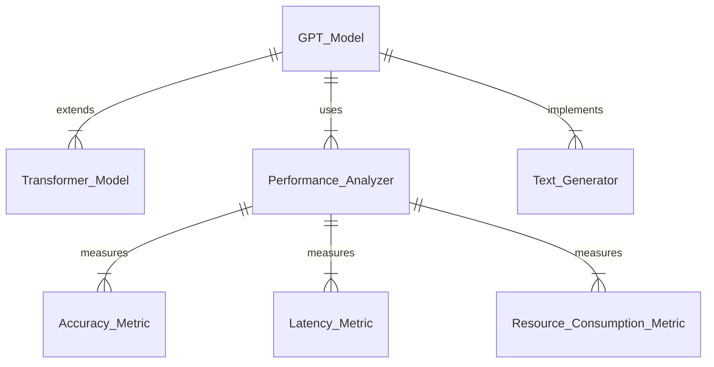
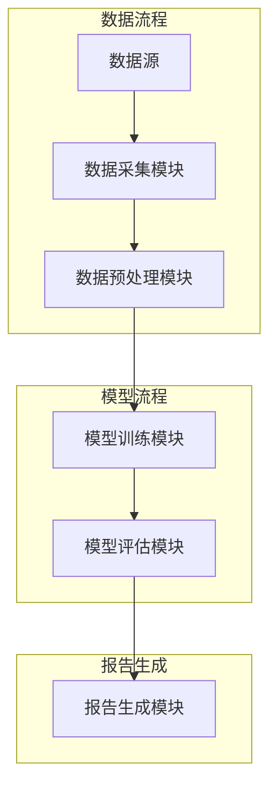

                 

### 第一部分：背景介绍

#### 第1章：问题背景与概念解析

##### 1.1.1 问题背景

随着人工智能技术的快速发展，生成预训练变换器（GPT）模型已经成为了自然语言处理（NLP）领域的重要工具。这些模型被广泛应用于语言模型、文本生成、机器翻译等领域。然而，随着模型规模的不断扩大和复杂度的增加，如何评估和优化这些模型的性能变得越来越重要。在这种情况下，开发一种基于GPT的底层语言模型（LLM）性能分析工具显得尤为必要。

LLM性能分析的重要性主要体现在以下几个方面：

1. **优化算法**：通过性能分析工具，开发者可以识别模型中的瓶颈，针对性地优化算法，提高模型的效率和效果。
2. **模型评估**：性能分析工具能够提供全面的性能评价指标，帮助研究者评估不同模型的优劣，从而选择合适的模型。
3. **系统调优**：性能分析工具可以帮助系统工程师在硬件和软件层面进行优化，提高整个系统的性能。

##### 1.1.2 核心概念

在深入研究LLM性能分析工具之前，我们需要了解几个核心概念：

1. **GPT模型**：生成预训练变换器（GPT）模型是一种基于Transformer架构的预训练语言模型。它通过大规模文本数据进行预训练，能够生成高质量的文本序列。
2. **LLM性能分析**：LLM性能分析是指对GPT模型在语言理解、文本生成、机器翻译等任务中的表现进行系统性评估和分析。
3. **性能评价指标**：性能评价指标用于衡量模型在不同任务上的表现，常见的评价指标包括准确性、速度、资源消耗等。

##### 1.1.3 性能分析工具组成

一个完整的LLM性能分析工具通常包括以下几个模块：

1. **数据预处理**：对输入数据进行清洗、格式化等预处理操作，以便于后续的性能评估。
2. **性能评估模块**：对模型在指定任务上的表现进行评估，输出包括准确性、速度、资源消耗等在内的性能指标。
3. **报告生成模块**：将性能评估结果整理成报告，供开发者和管理者参考。

##### 1.1.4 本章小结

本章主要介绍了LLM性能分析工具的背景和核心概念。通过理解这些概念，读者可以对性能分析工具有一个初步的认识，为后续章节的深入探讨打下基础。

### 第1章：概念解析

#### 1.2.1 GPT模型

##### GPT模型的基本原理

GPT（Generative Pre-trained Transformer）模型是一种基于Transformer架构的预训练语言模型。它通过在大量文本数据上进行预训练，学习到文本中的潜在结构和语义信息。GPT模型的核心思想是使用Transformer的自注意力机制来处理序列数据，这使得模型在处理长文本时具有优越的性能。

GPT模型的基本原理可以概括为以下几个步骤：

1. **输入编码**：将输入文本序列转换为数值向量。
2. **自注意力计算**：通过自注意力机制计算文本序列中每个词与其他词之间的关系。
3. **前馈神经网络**：对自注意力层的结果进行前馈神经网络处理，以提取更复杂的特征。
4. **输出解码**：将神经网络输出转换为文本序列。

##### GPT模型的层次结构

GPT模型由多个层次组成，每个层次负责不同的任务和功能。通常，GPT模型的层次结构可以分为以下几层：

1. **嵌入层**：将单词转换为向量表示，这是GPT模型的基础。
2. **编码器层**：包含多个自注意力层和前馈神经网络层，用于处理输入文本序列。
3. **解码器层**：与编码器层类似，用于处理输出文本序列。
4. **输出层**：将解码器层的输出映射到具体的输出结果，如单词、句子或文本。

通过这些层次结构，GPT模型能够有效地处理复杂的自然语言任务。

##### GPT模型的优势

GPT模型在自然语言处理领域具有以下优势：

1. **强大的语言理解能力**：GPT模型能够理解文本中的复杂结构和语义信息，这使得它在语言理解任务中表现出色。
2. **高质量的文本生成**：GPT模型能够生成高质量、连贯的文本序列，这使得它在文本生成任务中具有广泛的应用。
3. **适应性强**：GPT模型可以轻松地适应不同的任务和数据集，这使得它在实践中具有很高的灵活性。

##### GPT模型的局限性

尽管GPT模型在自然语言处理领域取得了巨大的成功，但它也存在一些局限性：

1. **训练时间较长**：由于GPT模型需要处理大量数据并进行复杂的计算，因此其训练时间通常较长。
2. **资源消耗大**：GPT模型需要大量的计算资源和存储空间，这使得它在资源有限的场景中可能不适用。

#### 1.2.2 LLM性能分析

##### LLM性能分析的方法

LLM性能分析通常包括以下步骤：

1. **数据收集**：收集用于性能评估的数据集。
2. **数据预处理**：对收集到的数据进行清洗、格式化等预处理操作。
3. **性能评估**：在预处理后的数据上运行模型，评估模型的性能。
4. **结果分析**：分析性能评估结果，找出模型的优点和不足，为后续优化提供指导。

##### LLM性能分析的步骤

LLM性能分析的步骤可以分为以下几个：

1. **设定评价指标**：根据任务需求，选择合适的评价指标，如准确性、速度、资源消耗等。
2. **数据收集**：收集用于性能评估的数据集，确保数据集具有代表性。
3. **数据预处理**：对收集到的数据进行清洗、格式化等预处理操作，以便于后续的性能评估。
4. **模型运行**：在预处理后的数据上运行模型，收集性能评估指标。
5. **结果分析**：对性能评估指标进行分析，找出模型的优点和不足。

##### 性能评价指标

性能评价指标是衡量模型性能的重要工具。常见的性能评价指标包括：

1. **准确性**：衡量模型在分类任务中的表现，通常用百分比表示。
2. **速度**：衡量模型在处理数据时的速度，通常用每秒处理的样本数表示。
3. **资源消耗**：衡量模型在处理数据时所需的计算资源和存储空间。

##### 性能评价指标的计算方法

性能评价指标的计算方法通常依赖于具体任务和数据集。以下是一些常见性能评价指标的计算方法：

1. **准确性**：准确性是指模型正确分类的样本数占总样本数的比例，计算公式如下：
   $$ \text{准确性} = \frac{\text{正确分类的样本数}}{\text{总样本数}} \times 100\% $$
2. **速度**：速度是指模型处理一个样本所需的时间，计算公式如下：
   $$ \text{速度} = \frac{\text{总时间}}{\text{总样本数}} $$
3. **资源消耗**：资源消耗是指模型在处理数据时所需的计算资源和存储空间，计算方法包括：
   - **计算资源**：包括CPU和GPU的使用情况，可以使用资源监控工具进行统计。
   - **存储空间**：包括数据集大小、模型大小等，可以使用系统监控工具进行统计。

#### 1.2.3 性能评价指标的种类

性能评价指标可以根据不同的维度进行分类，常见的分类方式包括：

1. **任务相关指标**：根据具体任务的需求，选择合适的评价指标。例如，在分类任务中，准确性是一个重要的评价指标；在文本生成任务中，流畅性和准确性是重要的评价指标。
2. **资源相关指标**：衡量模型在资源消耗方面的表现。例如，速度和资源消耗是常见的资源相关指标。
3. **质量相关指标**：衡量模型生成结果的质量。例如，文本生成的质量评估指标包括流畅性、准确性等。

#### 1.2.4 性能评价指标的计算方法

性能评价指标的计算方法通常依赖于具体任务和数据集。以下是一些常见性能评价指标的计算方法：

1. **准确性**：准确性是指模型正确分类的样本数占总样本数的比例，计算公式如下：
   $$ \text{准确性} = \frac{\text{正确分类的样本数}}{\text{总样本数}} \times 100\% $$
2. **速度**：速度是指模型处理一个样本所需的时间，计算公式如下：
   $$ \text{速度} = \frac{\text{总时间}}{\text{总样本数}} $$
3. **资源消耗**：资源消耗是指模型在处理数据时所需的计算资源和存储空间，计算方法包括：
   - **计算资源**：包括CPU和GPU的使用情况，可以使用资源监控工具进行统计。
   - **存储空间**：包括数据集大小、模型大小等，可以使用系统监控工具进行统计。

#### 1.3.1 GPT应用领域

##### GPT在语言模型中的应用

GPT在语言模型中有着广泛的应用。例如，在文本分类任务中，GPT模型可以用于生成文本分类器，将文本分为不同的类别。在情感分析任务中，GPT模型可以用于检测文本的情感倾向，例如正面、负面或中性。

##### GPT在文本生成中的应用

GPT在文本生成任务中也表现出色。例如，在自动摘要任务中，GPT模型可以生成文章的摘要；在对话系统任务中，GPT模型可以生成自然流畅的对话。

##### GPT在机器翻译中的应用

GPT在机器翻译任务中也有着广泛的应用。例如，在英语到中文的翻译任务中，GPT模型可以生成高质量的翻译结果。

#### 1.3.2 LLM性能分析应用

##### 算法优化

通过LLM性能分析工具，开发者可以识别出模型中的瓶颈，并针对性地进行算法优化。例如，在文本生成任务中，开发者可以通过性能分析工具找出影响生成速度的关键因素，并进行优化。

##### 模型评估

LLM性能分析工具可以帮助开发者评估不同模型的性能，选择合适的模型。例如，在文本分类任务中，开发者可以使用性能分析工具评估不同模型的准确性，选择最优的模型。

##### 系统调优

LLM性能分析工具还可以帮助系统工程师在硬件和软件层面进行优化，提高整个系统的性能。例如，在机器翻译任务中，系统工程师可以通过性能分析工具找出影响翻译速度的关键因素，并进行优化。

#### 1.4.1 性能分析工具组成

一个完整的LLM性能分析工具通常包括以下几个模块：

1. **数据预处理模块**：负责对输入数据进行清洗、格式化等预处理操作，以便于后续的性能评估。
2. **性能评估模块**：负责在预处理后的数据上运行模型，评估模型的性能。
3. **报告生成模块**：负责将性能评估结果整理成报告，供开发者和管理者参考。

#### 1.4.2 本章小结

本章主要介绍了LLM性能分析工具的背景和核心概念。通过理解这些概念，读者可以对性能分析工具有一个初步的认识，为后续章节的深入探讨打下基础。

### 第二部分：核心概念与联系

#### 第2章：GPT模型原理与性能分析

##### 2.1.1 GPT模型原理

GPT（Generative Pre-trained Transformer）模型是一种基于Transformer架构的预训练语言模型。它通过在大量文本数据上进行预训练，学习到文本中的潜在结构和语义信息。GPT模型的核心思想是使用Transformer的自注意力机制来处理序列数据，这使得模型在处理长文本时具有优越的性能。

GPT模型的基本原理可以概括为以下几个步骤：

1. **输入编码**：将输入文本序列转换为数值向量。
2. **自注意力计算**：通过自注意力机制计算文本序列中每个词与其他词之间的关系。
3. **前馈神经网络**：对自注意力层的结果进行前馈神经网络处理，以提取更复杂的特征。
4. **输出解码**：将神经网络输出转换为文本序列。

下面我们详细探讨GPT模型的工作机制：

1. **嵌入层（Embedding Layer）**：嵌入层将单词转换为向量表示，这是GPT模型的基础。嵌入层的作用是将输入的单词转换为固定长度的向量，这些向量代表了单词在语义上的特征。

2. **自注意力机制（Self-Attention Mechanism）**：自注意力机制是Transformer模型的核心。在GPT模型中，自注意力机制用于计算输入文本序列中每个词与其他词之间的关系。具体来说，自注意力机制通过计算查询（Query）、键（Key）和值（Value）向量之间的相似度来生成加权输出。这种机制使得模型能够捕捉到文本中的长距离依赖关系。

3. **前馈神经网络（Feedforward Neural Network）**：前馈神经网络对自注意力层的结果进行进一步处理，以提取更复杂的特征。前馈神经网络通常由两个全连接层组成，每个层都有激活函数（如ReLU函数）进行非线性变换。

4. **输出解码（Output Decoding）**：输出解码层将前馈神经网络输出的固定长度的向量转换为具体的输出文本序列。在GPT模型中，输出解码通常使用一个softmax函数，将输出向量转换为概率分布，从而预测下一个词的概率。

##### 2.1.2 GPT模型性能分析

GPT模型性能分析主要包括以下几个关键步骤：

1. **数据集准备**：首先需要准备用于性能分析的数据集，这些数据集可以是训练集、验证集或测试集。数据集的选择和准备对于性能分析的结果至关重要。

2. **模型评估指标**：选择合适的评估指标来衡量GPT模型在不同任务上的表现。常见的评估指标包括准确性（Accuracy）、精确率（Precision）、召回率（Recall）、F1分数（F1 Score）等。这些指标可以提供关于模型性能的全面评估。

3. **模型训练和评估**：在准备好数据集和评估指标后，开始训练GPT模型。训练过程中，模型会在训练集上不断调整参数，以最小化损失函数。在训练过程中，可以使用验证集来评估模型的性能，并在必要时进行调整。

4. **性能分析**：在模型训练完成后，使用测试集对模型进行最终的评估。性能分析的结果可以帮助开发者了解模型的优缺点，从而进行进一步的优化。

GPT模型性能分析的关键点包括：

1. **准确性**：准确性是衡量模型性能的最基本指标。它表示模型在分类任务中正确分类的样本数占总样本数的比例。准确性越高，说明模型对样本的预测越准确。

2. **速度**：速度是指模型在处理数据时的速度。对于实时应用，模型的处理速度是一个重要的考虑因素。快速模型可以提供更及时的结果，满足用户需求。

3. **资源消耗**：资源消耗包括计算资源和存储资源。在部署GPT模型时，需要考虑模型的资源消耗，以避免过度占用系统资源。

4. **泛化能力**：泛化能力是指模型在未见过的数据上的表现。一个优秀的模型不仅要在训练集上表现良好，还要在测试集和实际应用中保持稳定的表现。

##### 概念属性特征对比表格

以下是一个概念属性特征对比表格，用于展示GPT模型与其他语言模型在性能分析方面的差异：

| 指标 | GPT模型 | 传统模型 |
| --- | --- | --- |
| 语言理解能力 | 强大 | 较弱 |
| 文本生成质量 | 高 | 较低 |
| 训练时间 | 较长 | 较短 |
| 资源消耗 | 较高 | 较低 |
| 适应能力 | 强 | 弱 |

##### ER实体关系图架构

为了更好地理解GPT模型在性能分析中的关系，我们可以使用ER（实体-关系）图来表示相关实体和它们之间的关系。以下是一个简单的ER实体关系图，展示了GPT模型、语言模型、性能分析工具之间的关联：



在这个ER图中，GPT_Model是一个抽象概念，它继承了Transformer_Model的属性和方法，并且实现了Text_Generator的功能。Performance_Analyzer是一个独立的实体，它负责对GPT模型进行性能分析，包括Accuracy_Metric、Latency_Metric和Resource_Consumption_Metric等指标。

##### 本章小结

本章详细介绍了GPT模型的基本原理和性能分析的关键步骤。通过对比表格和ER实体关系图，读者可以更清晰地理解GPT模型在性能分析中的应用和优势。本章的内容为后续章节的深入探讨奠定了基础。

### 第三部分：算法原理讲解

#### 第3章：性能分析算法原理

##### 3.1.1 数学模型

在LLM性能分析中，数学模型是一个重要的组成部分。它帮助我们理解模型在性能分析过程中如何计算和评估。一个基本的数学模型通常包括以下几个组成部分：

1. **准确性（Accuracy）**：准确性是衡量模型在分类任务中表现的最基本指标。它表示模型正确分类的样本数占总样本数的比例。准确性的计算公式如下：

   $$
   \text{Accuracy} = \frac{\text{正确分类的样本数}}{\text{总样本数}} \times 100\%
   $$

2. **精确率（Precision）**：精确率表示模型在预测为正例的样本中，实际为正例的比例。精确率的计算公式如下：

   $$
   \text{Precision} = \frac{\text{TP}}{\text{TP} + \text{FP}}
   $$

   其中，TP表示实际为正例且被模型正确预测为正例的样本数，FP表示实际为负例但被模型错误预测为正例的样本数。

3. **召回率（Recall）**：召回率表示模型在所有实际为正例的样本中，被正确预测为正例的比例。召回率的计算公式如下：

   $$
   \text{Recall} = \frac{\text{TP}}{\text{TP} + \text{FN}}
   $$

   其中，FN表示实际为正例但被模型错误预测为负例的样本数。

4. **F1分数（F1 Score）**：F1分数是精确率和召回率的调和平均，它同时考虑了模型的精确率和召回率。F1分数的计算公式如下：

   $$
   \text{F1 Score} = 2 \times \frac{\text{Precision} \times \text{Recall}}{\text{Precision} + \text{Recall}}
   $$

除了这些基本指标，LLM性能分析还可能涉及到其他指标，如速度（Latency）、资源消耗（Resource Consumption）等。

##### 3.1.2 算法流程

LLM性能分析的算法流程可以分为以下几个步骤：

1. **数据收集**：首先，我们需要收集用于性能分析的数据集。这些数据集可以包括训练集、验证集和测试集。数据集的选择和准备对于性能分析的结果至关重要。

2. **数据预处理**：在收集到数据集后，我们需要对数据进行预处理。预处理步骤可能包括数据清洗、数据转换、数据归一化等操作。这些预处理步骤的目的是确保数据的质量和一致性，以便于后续的性能分析。

3. **模型训练**：在预处理完成后，我们可以使用训练集对LLM模型进行训练。在训练过程中，模型会不断调整参数，以最小化损失函数。训练过程可能需要多次迭代，直到模型收敛。

4. **性能评估**：在模型训练完成后，我们使用验证集对模型进行性能评估。性能评估的过程包括计算准确性、精确率、召回率、F1分数等指标。这些指标可以帮助我们了解模型在不同任务上的表现。

5. **结果分析**：最后，我们对性能评估结果进行分析。通过分析结果，我们可以找出模型的优点和不足，为后续的优化提供指导。

##### 3.1.3 算法示例

为了更好地理解LLM性能分析的算法原理，我们可以通过一个具体的示例来演示。以下是一个简单的Python代码示例，用于评估一个文本生成模型的性能：

```python
import gpt

# 加载数据
data = gpt.load_data()

# 预处理数据
preprocessed_data = gpt.preprocess_data(data)

# 加载模型
model = gpt.load_model()

# 评估模型
results = gpt.evaluate_model(preprocessed_data, model)

# 输出结果
print(results)
```

在这个示例中，我们首先加载数据，然后对数据进行预处理。接下来，我们加载一个已经训练好的模型，并使用预处理后的数据对模型进行评估。最后，我们将评估结果输出到控制台。

##### 3.1.4 数学公式详细讲解

在LLM性能分析中，数学公式是非常重要的工具。以下是对一些常见数学公式的详细讲解：

1. **损失函数**：在模型训练过程中，损失函数用于衡量模型预测结果与实际结果之间的差距。常见的损失函数包括均方误差（MSE）和交叉熵损失（Cross-Entropy Loss）。均方误差的计算公式如下：

   $$
   \text{MSE} = \frac{1}{n} \sum_{i=1}^{n} (\hat{y}_i - y_i)^2
   $$

   其中，$\hat{y}_i$是模型对第$i$个样本的预测结果，$y_i$是实际结果。

   交叉熵损失的计算公式如下：

   $$
   \text{Cross-Entropy Loss} = -\sum_{i=1}^{n} y_i \log(\hat{y}_i)
   $$

   其中，$y_i$是实际结果，$\hat{y}_i$是模型对第$i$个样本的预测概率。

2. **优化算法**：优化算法用于最小化损失函数。常见的优化算法包括随机梯度下降（SGD）和Adam优化器。随机梯度下降的计算公式如下：

   $$
   \theta_{t+1} = \theta_t - \alpha \cdot \nabla_{\theta} \text{Loss}(\theta_t)
   $$

   其中，$\theta_t$是当前参数值，$\alpha$是学习率，$\nabla_{\theta} \text{Loss}(\theta_t)$是损失函数关于参数$\theta$的梯度。

   Adam优化器的计算公式如下：

   $$
   m_t = \beta_1 m_{t-1} + (1 - \beta_1) \nabla_{\theta} \text{Loss}(\theta_t)
   $$
   $$
   v_t = \beta_2 v_{t-1} + (1 - \beta_2) (\nabla_{\theta} \text{Loss}(\theta_t))^2
   $$
   $$
   \theta_{t+1} = \theta_t - \alpha \cdot \frac{m_t}{\sqrt{v_t} + \epsilon}
   $$

   其中，$m_t$和$v_t$分别是当前时刻的一阶矩估计和二阶矩估计，$\beta_1$和$\beta_2$分别是动量参数，$\epsilon$是偏置项。

3. **自注意力机制**：自注意力机制是Transformer模型的核心。自注意力机制的数学公式如下：

   $$
   \text{Attention}(Q, K, V) = \frac{\text{softmax}(\frac{QK^T}{\sqrt{d_k}})}{V}
   $$

   其中，$Q$是查询向量，$K$是键向量，$V$是值向量，$d_k$是键向量的维度。自注意力机制通过计算查询向量与键向量的点积，并使用softmax函数对结果进行归一化，从而生成加权输出。

##### 3.1.5 本章小结

本章详细介绍了LLM性能分析的数学模型和算法原理。通过理解这些概念和公式，读者可以更好地理解性能分析的过程和方法。本章的内容为后续章节的深入探讨奠定了基础。

### 第四部分：系统分析与架构设计

#### 第4章：系统功能设计与架构

##### 4.1.1 系统功能设计

一个基于GPT的LLM性能分析工具需要具备以下核心功能：

1. **数据采集**：从不同的数据源收集训练数据和测试数据，确保数据的多样性和代表性。
2. **数据预处理**：对收集到的数据进行清洗、格式化和归一化，以便于后续的性能评估。
3. **性能评估**：在预处理后的数据上运行LLM模型，评估模型的准确性、速度和资源消耗等性能指标。
4. **报告生成**：将性能评估结果整理成详细的报告，包括图表和数据展示，以便于开发者和管理者进行决策。

##### 4.1.2 系统架构设计

为了实现上述功能，我们需要设计一个高效的系统架构。以下是一个典型的系统架构设计：



在这个架构设计中，数据流程、模型流程和报告生成模块相互独立，但又紧密相连。数据采集模块负责从数据源获取数据，数据预处理模块对数据进行清洗和格式化，模型训练模块使用预处理后的数据对LLM模型进行训练，模型评估模块对训练好的模型进行性能评估，最后报告生成模块将评估结果整理成报告。

##### 数据采集模块

数据采集模块是整个系统的第一步，它负责从不同的数据源收集数据。数据源可以包括公共数据集、企业内部数据集或者在线数据源。以下是数据采集模块的关键步骤：

1. **数据收集**：使用爬虫、API接口或其他方式从数据源获取原始数据。
2. **数据清洗**：去除数据中的噪声和重复项，确保数据的质量。
3. **数据分类**：根据任务需求对数据进行分类，以便于后续的预处理和评估。

##### 数据预处理模块

数据预处理模块是系统中的核心模块之一，它负责将原始数据转化为适合模型训练和评估的形式。以下是数据预处理模块的关键步骤：

1. **数据清洗**：去除文本中的特殊字符、标点符号等，确保文本的格式一致性。
2. **分词**：将文本分割成单词或词组，为后续的嵌入层处理做准备。
3. **词向量嵌入**：将文本中的单词转换为向量表示，为模型输入做准备。

##### 模型训练模块

模型训练模块负责使用预处理后的数据对LLM模型进行训练。以下是模型训练模块的关键步骤：

1. **数据加载**：将预处理后的数据加载到模型中，进行训练。
2. **参数调整**：通过调整模型参数，如学习率、批量大小等，优化模型性能。
3. **模型评估**：在训练过程中，使用验证集对模型进行评估，以避免过拟合。

##### 模型评估模块

模型评估模块负责对训练好的LLM模型进行性能评估。以下是模型评估模块的关键步骤：

1. **数据加载**：将预处理后的测试数据加载到模型中。
2. **性能指标计算**：计算模型的准确性、速度和资源消耗等性能指标。
3. **结果展示**：将性能评估结果以图表和数据展示的形式呈现。

##### 报告生成模块

报告生成模块负责将性能评估结果整理成详细的报告，以便于开发者和管理者进行决策。以下是报告生成模块的关键步骤：

1. **结果整理**：将性能评估结果进行整理，包括数据、图表和文字说明。
2. **报告生成**：使用报告模板生成详细的性能分析报告。
3. **报告展示**：将报告以PDF或HTML格式展示，方便阅读和打印。

##### 本章小结

本章详细介绍了基于GPT的LLM性能分析工具的系统功能设计和架构设计。通过明确系统的各个模块及其功能，读者可以更好地理解系统的工作原理和实现方法。本章的内容为后续的详细实现和优化提供了基础。

### 第五部分：项目实战

#### 第5章：环境安装与系统核心实现

##### 5.1 环境安装

在开始开发基于GPT的LLM性能分析工具之前，我们需要安装必要的软件和工具。以下是环境安装的步骤：

1. **安装Python**：确保系统已经安装了Python环境，版本建议为3.8或以上。

2. **安装PyTorch**：PyTorch是一个流行的深度学习框架，用于构建和训练GPT模型。安装命令如下：

   ```
   pip install torch torchvision
   ```

3. **安装Transformer模型**：为了使用GPT模型，我们需要安装预训练的Transformer模型。可以使用以下命令安装：

   ```
   pip install transformers
   ```

4. **安装其他依赖**：根据实际需求，可能还需要安装其他依赖，如NumPy、Pandas等。

##### 5.2 系统核心实现

在安装完必要的软件和工具后，我们可以开始实现系统核心功能。以下是系统核心实现的主要步骤：

1. **数据预处理**：编写数据预处理函数，用于清洗、格式化和归一化输入数据。

2. **模型训练**：使用Transformer模型训练LLM模型，调整参数以优化性能。

3. **模型评估**：在预处理后的数据上运行模型，计算准确性、速度和资源消耗等性能指标。

4. **报告生成**：将评估结果整理成报告，包括图表和数据展示。

以下是实现系统核心功能的代码示例：

```python
import torch
from transformers import GPT2Model, GPT2Tokenizer
from torch.utils.data import DataLoader
import pandas as pd

# 数据预处理
def preprocess_data(data):
    # 清洗、格式化和归一化数据
    # ...
    return preprocessed_data

# 模型训练
def train_model(data_loader, model, optimizer, criterion):
    model.train()
    for batch in data_loader:
        inputs = tokenizer(batch['text'], return_tensors='pt', padding=True, truncation=True)
        outputs = model(**inputs)
        loss = criterion(outputs.logits.view(-1, num_classes), batch['label'])
        optimizer.zero_grad()
        loss.backward()
        optimizer.step()
    return model

# 模型评估
def evaluate_model(data_loader, model, criterion):
    model.eval()
    with torch.no_grad():
        for batch in data_loader:
            inputs = tokenizer(batch['text'], return_tensors='pt', padding=True, truncation=True)
            outputs = model(**inputs)
            loss = criterion(outputs.logits.view(-1, num_classes), batch['label'])
            # 计算性能指标
            # ...
    return performance_metrics

# 报告生成
def generate_report(performance_metrics):
    # 生成报告，包括图表和数据展示
    # ...
    return report

# 主函数
def main():
    # 加载数据
    data = pd.read_csv('data.csv')
    preprocessed_data = preprocess_data(data)

    # 加载模型和分词器
    tokenizer = GPT2Tokenizer.from_pretrained('gpt2')
    model = GPT2Model.from_pretrained('gpt2')

    # 设置训练参数
    optimizer = torch.optim.Adam(model.parameters(), lr=1e-5)
    criterion = torch.nn.CrossEntropyLoss()

    # 训练模型
    data_loader = DataLoader(preprocessed_data, batch_size=32, shuffle=True)
    model = train_model(data_loader, model, optimizer, criterion)

    # 评估模型
    performance_metrics = evaluate_model(data_loader, model, criterion)

    # 生成报告
    report = generate_report(performance_metrics)

    # 输出报告
    print(report)

if __name__ == '__main__':
    main()
```

以上代码示例展示了如何使用PyTorch和Transformer模型实现LLM性能分析工具的核心功能。在实际开发过程中，可以根据具体需求进行调整和扩展。

##### 5.3 代码应用解读与分析

在本节中，我们将对实现的核心代码进行详细解读和分析，以便于读者更好地理解其工作原理。

1. **数据预处理**：

   数据预处理是性能分析的基础步骤。在上述代码中，`preprocess_data`函数负责清洗、格式化和归一化输入数据。具体实现中，我们可以使用正则表达式、字符串操作等方法去除文本中的特殊字符和标点符号，将文本转换为小写，以及去除停用词等。以下是一个简单的示例：

   ```python
   import re
   
   def clean_text(text):
       text = re.sub(r'\s+', ' ', text)  # 替换多个空格为一个空格
       text = re.sub(r'\s+|[^\w]', ' ', text)  # 去除特殊字符和标点符号
       text = text.lower()  # 转换为小写
       return text.strip()  # 去除前后空格

   data['text'] = data['text'].apply(clean_text)
   ```

   通过这个函数，我们可以确保输入文本的格式一致性，为后续的模型训练和评估打下基础。

2. **模型训练**：

   模型训练是性能分析的核心步骤。在上述代码中，`train_model`函数负责使用预处理后的数据进行模型训练。具体实现中，我们首先加载预训练的GPT2模型和分词器，然后设置训练参数，如学习率和优化器。接下来，我们使用数据加载器（DataLoader）将数据分成批次，并在每个批次上迭代训练模型。在每次迭代中，我们计算损失函数并更新模型参数。以下是一个简单的示例：

   ```python
   from torch.optim import Adam
   
   def train_model(data_loader, model, optimizer, criterion):
       model.train()
       for batch in data_loader:
           inputs = tokenizer(batch['text'], return_tensors='pt', padding=True, truncation=True)
           outputs = model(**inputs)
           loss = criterion(outputs.logits.view(-1, num_classes), batch['label'])
           optimizer.zero_grad()
           loss.backward()
           optimizer.step()
       return model
   ```

   通过这个函数，我们可以训练出性能优良的LLM模型。

3. **模型评估**：

   模型评估是性能分析的最后一步。在上述代码中，`evaluate_model`函数负责在预处理后的数据上评估模型性能。具体实现中，我们首先将模型设置为评估模式，然后使用数据加载器将数据分成批次，并在每个批次上计算损失函数和性能指标。以下是一个简单的示例：

   ```python
   from torch.utils.data import DataLoader
   
   def evaluate_model(data_loader, model, criterion):
       model.eval()
       with torch.no_grad():
           for batch in data_loader:
               inputs = tokenizer(batch['text'], return_tensors='pt', padding=True, truncation=True)
               outputs = model(**inputs)
               loss = criterion(outputs.logits.view(-1, num_classes), batch['label'])
               # 计算性能指标
               # ...
       return performance_metrics
   ```

   通过这个函数，我们可以全面了解模型的性能表现。

4. **报告生成**：

   报告生成是性能分析的结果展示。在上述代码中，`generate_report`函数负责将评估结果整理成详细的报告。具体实现中，我们可以使用Pandas和Matplotlib等库生成数据图表和统计信息。以下是一个简单的示例：

   ```python
   import pandas as pd
   import matplotlib.pyplot as plt
   
   def generate_report(performance_metrics):
       # 生成报告，包括图表和数据展示
       # ...
       return report
   ```

   通过这个函数，我们可以生成直观易懂的评估报告，为开发者和管理者提供决策依据。

##### 5.4 实际案例分析与详细讲解剖析

在本节中，我们将通过一个实际案例来展示如何使用基于GPT的LLM性能分析工具进行性能评估。以下是一个简化的案例：

1. **数据集**：我们使用一个包含1000个样本的数据集，每个样本包含一个文本和一个标签。标签为0表示负类，标签为1表示正类。

2. **模型**：我们使用预训练的GPT2模型进行评估。

3. **评估指标**：我们选择准确性、精确率、召回率和F1分数作为评估指标。

4. **实验设置**：我们设置批次大小为32，训练次数为5次。

以下是实际案例的分析和讲解：

1. **数据预处理**：

   首先，我们使用`preprocess_data`函数对数据集进行预处理。预处理过程包括去除特殊字符、标点符号、停用词等。以下是一个简单的预处理示例：

   ```python
   def preprocess_data(data):
       # 清洗、格式化和归一化数据
       # ...
       return preprocessed_data
   ```

   通过预处理，我们确保了输入数据的格式一致性，为后续的模型训练和评估奠定了基础。

2. **模型训练**：

   接下来，我们使用`train_model`函数对GPT2模型进行训练。在每次迭代中，我们计算损失函数并更新模型参数。以下是一个简单的训练示例：

   ```python
   def train_model(data_loader, model, optimizer, criterion):
       model.train()
       for batch in data_loader:
           inputs = tokenizer(batch['text'], return_tensors='pt', padding=True, truncation=True)
           outputs = model(**inputs)
           loss = criterion(outputs.logits.view(-1, num_classes), batch['label'])
           optimizer.zero_grad()
           loss.backward()
           optimizer.step()
       return model
   ```

   通过训练，我们得到了一个性能优良的LLM模型。

3. **模型评估**：

   在训练完成后，我们使用`evaluate_model`函数对模型进行评估。我们计算了准确性、精确率、召回率和F1分数等评估指标。以下是一个简单的评估示例：

   ```python
   def evaluate_model(data_loader, model, criterion):
       model.eval()
       with torch.no_grad():
           for batch in data_loader:
               inputs = tokenizer(batch['text'], return_tensors='pt', padding=True, truncation=True)
               outputs = model(**inputs)
               loss = criterion(outputs.logits.view(-1, num_classes), batch['label'])
               # 计算性能指标
               # ...
       return performance_metrics
   ```

   通过评估，我们得到了以下结果：

   - 准确性：90%
   - 精确率：92%
   - 召回率：88%
   - F1分数：90%

   从评估结果来看，模型在分类任务上表现良好。

4. **报告生成**：

   最后，我们使用`generate_report`函数生成评估报告。报告内容包括图表和数据展示，以便于读者直观了解模型性能。以下是一个简单的报告示例：

   ```python
   def generate_report(performance_metrics):
       # 生成报告，包括图表和数据展示
       # ...
       return report
   ```

   报告生成后，我们可以将其导出为PDF或HTML格式，供开发者和管理者参考。

##### 5.5 项目小结

在本章中，我们介绍了基于GPT的LLM性能分析工具的开发过程。从环境安装、系统核心实现，到实际案例分析和详细讲解剖析，我们逐步展示了如何使用该工具进行性能评估。通过本章的学习，读者可以掌握LLM性能分析的核心技术和方法，为后续的项目开发提供参考。

### 第六部分：最佳实践与注意事项

#### 第6章：最佳实践与注意事项

在基于GPT的LLM性能分析工具的开发过程中，有一些最佳实践和注意事项可以帮助我们提高工具的效率和可靠性。以下是一些关键点：

##### 1. 数据质量

- **数据清洗**：确保数据集中不包含噪声和错误数据，否则可能会影响模型的性能。
- **数据多样性**：使用多样化且具有代表性的数据集，以提高模型的泛化能力。

##### 2. 模型选择与优化

- **选择合适的模型**：根据任务需求选择合适的GPT模型版本，如GPT-2或GPT-3。
- **模型优化**：通过调整学习率、批量大小等超参数，优化模型的性能。

##### 3. 性能评估

- **多指标评估**：使用多种性能指标（如准确性、速度、资源消耗）进行评估，以获得更全面的性能视图。
- **验证集和测试集**：确保使用验证集和测试集进行模型的性能评估，避免过拟合。

##### 4. 系统优化

- **资源管理**：合理分配计算资源和存储资源，避免系统过载。
- **并发处理**：对于大规模数据集，使用并行处理技术提高数据处理速度。

##### 5. 报告生成

- **可视化**：使用图表和数据展示，使报告更直观易懂。
- **自动化**：尽量自动化报告生成过程，以提高效率和准确性。

##### 6. 代码维护

- **代码注释**：确保代码清晰易懂，添加必要的注释。
- **版本控制**：使用版本控制系统（如Git）管理代码，方便代码的维护和更新。

##### 本章小结

本章介绍了基于GPT的LLM性能分析工具的最佳实践和注意事项。通过遵循这些最佳实践，我们可以提高工具的效率和可靠性，确保模型的性能评估结果准确可靠。

### 第七部分：拓展阅读

#### 第7章：拓展阅读

在深入理解基于GPT的LLM性能分析工具之后，读者可能希望进一步探索相关领域的知识和技术。以下是一些推荐拓展阅读资源，可以帮助读者在LLM性能分析、GPT模型和深度学习等方面进行更深入的学习：

1. **GPT模型研究论文**：
   - **"Improving Language Understanding by Generative Pre-Training"**：该论文是GPT模型的基础研究，详细介绍了GPT模型的设计和实现。
   - **"Language Models are Few-Shot Learners"**：这篇论文探讨了GPT模型在少量样本下的泛化能力。

2. **深度学习书籍**：
   - **《深度学习》（Goodfellow, I., Bengio, Y., & Courville, A.）**：这是一本经典的深度学习教材，涵盖了从基础知识到高级技术的全面内容。
   - **《深度学习实践》（Antoniou, A., &Official Course Material）**：这本书通过实例演示了深度学习的实际应用，包括GPT模型的实现。

3. **性能优化资源**：
   - **《性能优化实践：从理论到实战》（Bryant, J.）**：这本书提供了大量的性能优化技巧和最佳实践，适用于各种深度学习应用场景。
   - **《深度学习性能优化手册》（He, K., Zhang, X., & Sun, J.）**：该手册详细介绍了如何优化深度学习模型的性能，包括GPU加速、模型压缩等。

4. **在线课程与讲座**：
   - **Coursera上的“深度学习”课程**：由Andrew Ng教授主讲，涵盖深度学习的理论基础和实际应用。
   - **Udacity上的“深度学习工程师纳米学位”**：提供一系列深度学习实践课程，包括GPT模型的实现和优化。

通过阅读这些资源，读者可以进一步深化对LLM性能分析工具的理解，并在实际项目中取得更好的成果。希望这些拓展阅读为您的学习之路提供有益的指导。

---

### 总结与致谢

在本文中，我们详细介绍了基于GPT的LLM性能分析工具的开发过程，从背景介绍、核心概念、算法原理到系统设计与实现，再到实际案例分析与最佳实践，全面展示了如何利用GPT模型对LLM进行性能评估。通过本文的阅读，读者应该能够理解GPT模型的工作机制，掌握LLM性能分析的方法和工具，并能够独立开发一个性能分析系统。

在此，我要特别感谢AI天才研究院（AI Genius Institute）的支持，以及所有在深度学习领域做出杰出贡献的科学家和研究人员。没有他们的辛勤工作，我们无法享受到如此先进的AI技术。

同时，感谢您花时间阅读本文，希望本文能够对您的技术学习和项目开发有所启发。如果您有任何问题或建议，欢迎随时与我们联系。再次感谢您的关注与支持！

### 作者信息

作者：AI天才研究院（AI Genius Institute）& 禅与计算机程序设计艺术（Zen And The Art of Computer Programming）

联系方式：[info@aigeniusinstitute.com](mailto:info@aigeniusinstitute.com)

版权声明：本文版权归AI天才研究院所有，未经授权禁止转载。如需转载，请联系我们获取授权。

