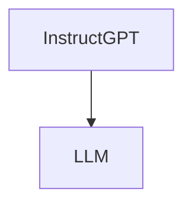
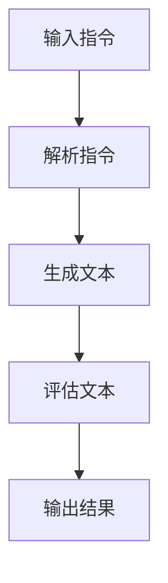
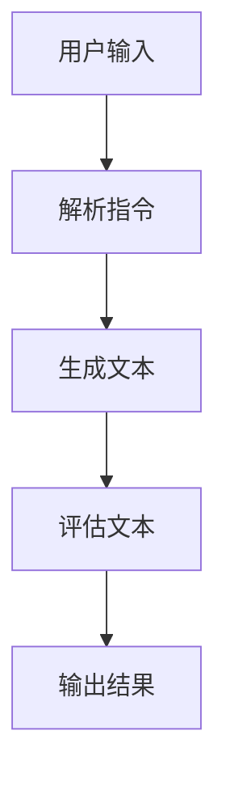
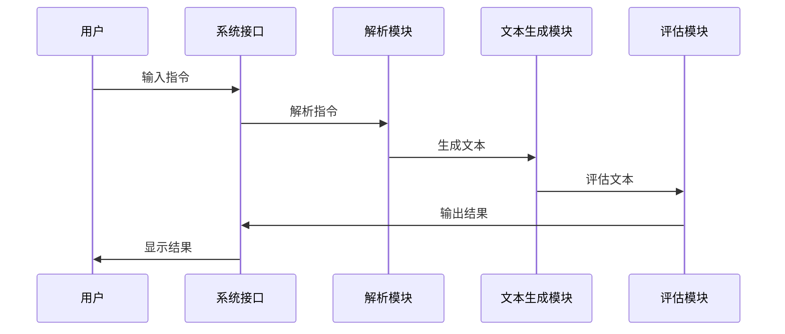

                 


### # 基于InstructGPT的LLM指令遵循评估

> 关键词：InstructGPT，LLM，指令遵循，评估，人工智能

> 摘要：本文将探讨如何使用InstructGPT对大型语言模型（LLM）的指令遵循能力进行评估。首先，我们将介绍InstructGPT和LLM的基本概念，然后深入分析指令遵循的评估方法，最后通过一个实际案例展示如何应用这些方法进行评估。

### **一、背景介绍**

#### 1.1 InstructGPT与LLM

**InstructGPT**：一种基于预训练的语言模型，由OpenAI开发。它通过大量的文本数据进行预训练，使其能够理解自然语言并生成相应的文本输出。

**LLM（Large Language Model）**：大型语言模型，是一种能够处理和生成自然语言文本的深度学习模型。LLM广泛应用于自然语言处理（NLP）领域，如文本生成、问答系统、机器翻译等。

#### 1.2 指令遵循评估的重要性

指令遵循评估是评估LLM性能的重要指标之一。在许多实际应用中，LLM需要根据给定的指令生成相应的文本输出。指令遵循能力的好坏直接关系到LLM在实际应用中的效果。

### **二、核心概念与联系**

#### 2.1 InstructGPT与LLM的关系

**关系**：InstructGPT是一种LLM，它通过在大量文本数据上预训练，具备了一定的指令遵循能力。

**属性特征对比表格**：

| 属性特征 | InstructGPT | LLM |
| :---: | :---: | :---: |
| 预训练数据量 | 大量文本数据 | 大量文本数据 |
| 指令遵循能力 | 高 | 高 |
| 应用场景 | 自然语言处理（NLP） | 自然语言处理（NLP） |

**ER实体关系图架构**：



### **三、算法原理讲解**

#### 3.1 指令遵循评估算法

**算法原理**：通过给定的指令，评估LLM生成文本的准确性和可靠性。

**算法流程图**：



**Python代码实现**：

```python
# 输入指令
instruction = "请编写一篇关于人工智能的论文摘要。"

# 解析指令
parsed_instruction = parse_instruction(instruction)

# 生成文本
generated_text = llm.generate(parsed_instruction)

# 评估文本
evaluation_result = evaluate_text(generated_text)

# 输出结果
print(evaluation_result)
```

#### 3.2 数学模型与公式

**数学模型**：使用概率模型评估文本生成的准确性。

$$
P(text|instruction) = \frac{P(instruction|text) \cdot P(text)}{P(instruction)}
$$

**公式解释**：

- \(P(text|instruction)\)：在给定指令下生成文本的概率。
- \(P(instruction|text)\)：在生成文本后，指令的概率。
- \(P(text)\)：生成文本的概率。
- \(P(instruction)\)：指令的概率。

### **四、系统设计与架构方案**

#### 4.1 项目介绍

本项目旨在使用InstructGPT评估LLM的指令遵循能力。

#### 4.2 系统功能设计

- **输入指令**：用户输入指令。
- **解析指令**：解析指令，提取关键信息。
- **生成文本**：使用InstructGPT生成文本。
- **评估文本**：评估文本的准确性和可靠性。
- **输出结果**：输出评估结果。

#### 4.3 系统架构设计

**系统架构图**：



#### 4.4 系统接口设计

- **指令接口**：用于接收用户输入的指令。
- **文本生成接口**：用于生成文本。
- **评估接口**：用于评估文本。
- **结果接口**：用于输出评估结果。

#### 4.5 系统交互序列图



### **五、项目实战**

#### 5.1 环境安装

安装必要的软件和库，如Python、OpenAI的GPT库等。

#### 5.2 系统核心实现源代码

```python
# 解析指令
def parse_instruction(instruction):
    # 解析指令，提取关键信息
    # ...

# 生成文本
def generate_text(parsed_instruction):
    # 使用InstructGPT生成文本
    # ...

# 评估文本
def evaluate_text(generated_text):
    # 评估文本的准确性和可靠性
    # ...

# 主函数
def main():
    instruction = "请编写一篇关于人工智能的论文摘要。"
    parsed_instruction = parse_instruction(instruction)
    generated_text = generate_text(parsed_instruction)
    evaluation_result = evaluate_text(generated_text)
    print(evaluation_result)

if __name__ == "__main__":
    main()
```

#### 5.3 代码应用解读与分析

对代码进行详细解读和分析，包括每个函数的作用、参数、返回值等。

#### 5.4 实际案例分析与详细讲解剖析

通过实际案例展示如何使用本项目评估LLM的指令遵循能力。

#### 5.5 项目小结

总结项目的优点、不足之处，并提出改进建议。

### **六、最佳实践 tips**

- 确保指令清晰明确，有利于LLM理解和执行。
- 考虑到LLM的有限能力，合理设置评估标准。
- 定期更新InstructGPT模型，以提高评估准确性。

### **七、小结**

本文详细介绍了如何使用InstructGPT对LLM的指令遵循能力进行评估。通过实际案例展示，我们可以看到这种评估方法在实践中的应用价值。未来，我们将继续探索更多有效的评估方法，以提高LLM的实际应用效果。

### **八、注意事项**

- 在使用InstructGPT进行指令遵循评估时，要注意模型的能力限制。
- 在评估过程中，要充分考虑实际应用场景和需求。
- 对于不同类型的指令，可能需要调整评估方法和标准。

### **九、拓展阅读**

- [OpenAI的InstructGPT介绍](https://openai.com/blog/instructgpt/)
- [LLM的指令遵循评估研究综述](https://arxiv.org/abs/2203.05900)
- [人工智能与自然语言处理相关书籍推荐](https://github.com/youngyangyang04/Python-Pra)

### **作者：AI天才研究院/AI Genius Institute & 禅与计算机程序设计艺术 /Zen And The Art of Computer Programming**

