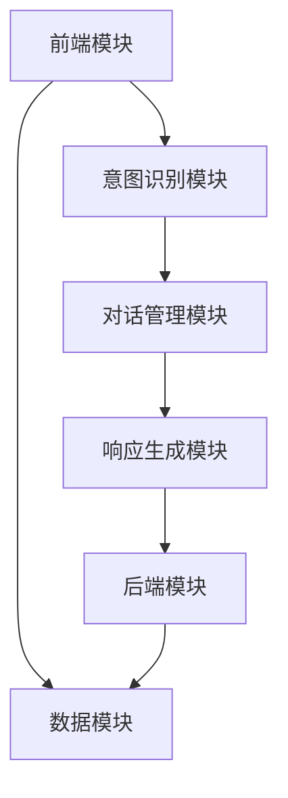
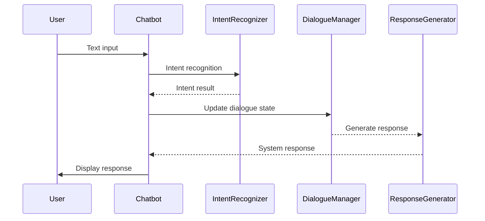

                 

### 文章标题

# 基于LLM的prompt意图理解优化

> 关键词：大语言模型，prompt，意图理解，优化策略，算法

> 摘要：本文将探讨基于大语言模型（LLM）的prompt意图理解优化。首先介绍大语言模型和相关概念，然后深入分析prompt意图理解的过程和当前存在的问题。接着，我们将详细探讨prompt设计和优化策略，以及意图理解算法的原理和应用。最后，通过实战案例分析，展示如何在实际项目中实现prompt意图理解的优化。

----------------------------------------------------------------

## 第一部分：基于LLM的prompt意图理解优化概述

在人工智能领域，大语言模型（LLM）如GPT-3、BERT等取得了显著的成果。这些模型通过学习大量的文本数据，能够生成高质量的自然语言文本，并广泛应用于聊天机器人、智能客服、信息检索等领域。然而，在实现这些应用时，一个关键的问题是如何准确理解用户的输入意图，即prompt。因此，本文将重点探讨基于LLM的prompt意图理解优化。

### 1.1 研究背景与意义

#### 1.1.1 大语言模型（LLM）的发展

大语言模型（LLM）是指通过神经网络等方法，对大量文本数据进行分析和处理，从而生成自然语言文本的模型。自2018年GPT-3发布以来，LLM在自然语言处理领域取得了巨大的成功。这些模型具有强大的语言生成能力，能够处理复杂的语言任务，如文本生成、机器翻译、问答系统等。

#### 1.1.2 prompt意图理解的重要性

在应用LLM时，理解用户的输入意图（prompt）是至关重要的。正确理解用户的意图可以帮助系统生成更加准确和有用的输出，从而提高用户体验。然而，由于自然语言的复杂性和多样性，准确理解用户的意图仍然是一个具有挑战性的问题。

#### 1.1.3 当前prompt意图理解存在的问题

当前，基于LLM的prompt意图理解存在以下问题：

1. **歧义性**：自然语言中存在大量的歧义，导致模型难以准确理解用户的意图。
2. **噪声干扰**：用户的输入可能包含噪声，如拼写错误、语法错误等，这些噪声会干扰模型的理解。
3. **有限的语言覆盖范围**：尽管LLM具有强大的语言生成能力，但它们的语言覆盖范围仍然有限，无法处理所有可能的输入。
4. **实时性要求**：在某些应用场景中，如实时聊天机器人，对prompt意图理解的实时性要求很高，这对模型的设计和优化提出了更高的挑战。

### 1.2 相关概念

#### 1.2.1 大语言模型（LLM）基础

大语言模型（LLM）是一种基于神经网络的自然语言处理模型，通过学习大量的文本数据，能够生成高质量的自然语言文本。常见的LLM包括GPT、BERT、T5等。

#### 1.2.2 prompt与意图

prompt是指用户的输入，意图是指用户希望通过输入实现的特定目标。准确理解用户的意图对于实现有效的自然语言处理任务至关重要。

#### 1.2.3 prompt意图理解流程

prompt意图理解通常包括以下几个步骤：

1. **接收用户输入**：系统接收用户的输入，如文本、语音等。
2. **预处理**：对用户输入进行预处理，如分词、去噪等。
3. **意图识别**：使用算法对预处理后的输入进行意图识别，确定用户的意图。
4. **响应生成**：根据识别出的意图，生成相应的响应。

### 1.3 基本原理

#### 1.3.1 prompt设计原则

有效的prompt设计对于准确理解用户的意图至关重要。以下是一些基本的prompt设计原则：

1. **清晰明确**：prompt应尽量简洁明了，避免歧义。
2. **具体性**：prompt应具体描述用户的意图，避免模糊不清。
3. **多样化**：设计多样化的prompt，以适应不同的用户意图。
4. **上下文信息**：在可能的范围内，提供上下文信息，帮助模型更好地理解用户的意图。

#### 1.3.2 意图识别算法

意图识别是prompt意图理解的核心环节。常见的意图识别算法包括基于规则的方法、基于统计的方法和基于深度学习的方法。

1. **基于规则的方法**：通过预定义的规则，将输入与意图进行匹配。
2. **基于统计的方法**：使用统计方法，如贝叶斯模型、决策树等，进行意图识别。
3. **基于深度学习的方法**：使用神经网络，如卷积神经网络（CNN）、循环神经网络（RNN）、长短时记忆网络（LSTM）等，进行意图识别。

#### 1.3.3 意图优化方法

意图优化是指通过改进算法和模型，提高意图识别的准确性和效率。常见的意图优化方法包括数据增强、预训练策略、对抗性训练等。

1. **数据增强**：通过增加数据量、多样化数据形式等方法，提高模型的泛化能力。
2. **预训练策略**：在特定任务之前，使用大量未标记的数据对模型进行预训练，提高模型的性能。
3. **对抗性训练**：通过生成对抗性样本，提高模型的鲁棒性和泛化能力。

### 1.4 应用场景

#### 1.4.1 聊天机器人

聊天机器人是应用prompt意图理解的一个重要场景。通过准确理解用户的输入，聊天机器人可以生成更加自然和有意义的回答，提高用户体验。

#### 1.4.2 智能客服

智能客服是另一个重要的应用场景。通过理解用户的输入，智能客服可以自动生成回答，解决用户的问题，提高客服效率和用户体验。

#### 1.4.3 信息检索与推荐

信息检索与推荐领域也广泛应用了prompt意图理解。通过理解用户的输入，系统能够更准确地返回用户感兴趣的信息或推荐相关的产品。

### 1.5 本章小结

本文介绍了基于LLM的prompt意图理解优化，包括研究背景、相关概念、基本原理和应用场景。在后续章节中，我们将进一步探讨prompt设计和优化的策略，以及意图理解算法的原理和应用。

----------------------------------------------------------------

## 第二部分：prompt设计与优化

在基于LLM的prompt意图理解中，prompt的设计和优化至关重要。一个优秀的prompt设计能够帮助模型更好地理解用户的意图，从而提高系统的性能和用户体验。本部分将详细探讨prompt设计的基础和优化策略。

### 2.1 prompt设计基础

#### 2.1.1 prompt的定义与作用

prompt是指用户的输入，它是模型理解和生成响应的基础。一个良好的prompt设计应具备以下特点：

1. **清晰明确**：prompt应简洁明了，避免歧义。
2. **具体性**：prompt应具体描述用户的意图。
3. **多样化**：prompt应设计多样化，以适应不同的用户意图。
4. **上下文信息**：提供上下文信息，帮助模型更好地理解用户的意图。

#### 2.1.2 prompt的类型

根据用途和特点，prompt可以分为以下几类：

1. **问题型prompt**：用于提问，引导用户输入问题。
2. **指令型prompt**：用于给出具体的指令，指导用户操作。
3. **描述型prompt**：用于描述场景或情境，引导用户输入相关信息。
4. **填充型prompt**：用于填充缺失的信息，如日期、时间等。

#### 2.1.3 prompt设计原则

在进行prompt设计时，应遵循以下原则：

1. **用户友好**：确保prompt易于理解，用户能够轻松输入。
2. **简洁明了**：避免冗长和复杂的prompt，保持简洁。
3. **上下文关联**：提供与用户输入相关的上下文信息。
4. **可扩展性**：设计具有可扩展性的prompt，以适应不同的用户需求和场景。

### 2.2 prompt优化策略

#### 2.2.1 数据增强

数据增强是一种有效的prompt优化策略，通过增加数据量、多样化数据形式等方法，提高模型的泛化能力。常见的数据增强方法包括：

1. **数据扩充**：通过翻译、同义词替换、文本生成等方法，生成新的训练数据。
2. **数据混合**：将不同来源的数据进行混合，增加数据的多样性。
3. **数据遮挡**：部分遮挡输入文本，提高模型的鲁棒性。

#### 2.2.2 预训练策略

预训练策略是指在特定任务之前，使用大量未标记的数据对模型进行预训练，提高模型的性能。常见的预训练策略包括：

1. **自监督学习**：通过预训练任务，如掩码语言模型（Masked Language Model，MLM）等，使模型具备对未标记数据的处理能力。
2. **迁移学习**：使用预训练模型，对特定任务进行微调，提高模型的性能。
3. **多任务学习**：同时训练多个相关任务，提高模型的泛化能力。

#### 2.2.3 对抗性训练

对抗性训练是一种有效的prompt优化策略，通过生成对抗性样本，提高模型的鲁棒性和泛化能力。常见的对抗性训练方法包括：

1. **对抗性样本生成**：通过生成对抗网络（GAN）等方法，生成对抗性样本。
2. **对抗性攻击**：使用对抗性攻击方法，如FGSM、PGD等，对模型进行攻击。
3. **对抗性训练策略**：将对抗性训练与常规训练相结合，提高模型的性能。

#### 2.2.4 多模态prompt设计

多模态prompt设计是指结合不同类型的数据，如文本、图像、声音等，设计更具表现力的prompt。常见的方法包括：

1. **多模态特征融合**：将不同类型的数据进行特征提取和融合，提高模型的表达能力。
2. **多模态任务设计**：同时处理多种类型的数据，提高模型的性能。
3. **多模态交互**：设计多模态交互界面，提高用户的输入体验。

### 2.3 案例分析

在本节中，我们将通过几个实际案例，分析prompt设计与优化在不同应用场景中的具体应用。

#### 2.3.1 聊天机器人案例

在聊天机器人中，prompt的设计和优化至关重要。以下是一个具体的聊天机器人案例：

1. **问题型prompt**：用于提问，如“您有什么问题需要帮助吗？”
2. **指令型prompt**：用于给出具体指令，如“请告诉我您需要什么帮助？”
3. **描述型prompt**：用于描述场景，如“您正在商场购物，需要咨询某件商品的信息。”

通过多样化的prompt设计，聊天机器人能够更好地理解用户的意图，生成有意义的回答。

#### 2.3.2 智能客服案例

在智能客服中，prompt的设计和优化同样重要。以下是一个具体的智能客服案例：

1. **数据增强**：通过扩充数据集，增加训练数据的多样性。
2. **预训练策略**：使用预训练模型，对智能客服系统进行微调。
3. **对抗性训练**：通过生成对抗性样本，提高智能客服系统的鲁棒性。

通过这些优化策略，智能客服系统能够更准确地理解用户的输入，提供更加准确的回答。

#### 2.3.3 信息检索与推荐案例

在信息检索与推荐领域，prompt的设计和优化对于提高系统性能至关重要。以下是一个具体的信息检索与推荐案例：

1. **多模态prompt设计**：结合文本和图像等多模态数据，提高系统的表达能力和准确性。
2. **数据增强**：通过扩充数据集，提高模型的泛化能力。
3. **多任务学习**：同时处理多个相关任务，提高模型的性能。

通过这些优化策略，信息检索与推荐系统能够更准确地理解用户的意图，提供更加准确的检索结果和推荐。

### 2.4 prompt优化的评估方法

prompt优化效果的评价是确保系统性能提升的关键。以下是一些常见的prompt优化评估方法：

1. **准确率**：评估模型在意图识别任务上的准确率，越高表示优化效果越好。
2. **召回率**：评估模型在意图识别任务上的召回率，越高表示优化效果越好。
3. **F1分数**：综合评估准确率和召回率，越高表示优化效果越好。
4. **用户满意度**：通过用户反馈，评估系统的用户体验，越高表示优化效果越好。

### 2.5 本章小结

本文详细介绍了基于LLM的prompt意图理解优化，包括prompt设计基础和优化策略。通过案例分析和评估方法，我们展示了如何在实际应用中实现prompt意图理解的优化。在后续章节中，我们将进一步探讨意图理解算法的原理和应用。

----------------------------------------------------------------

## 第三部分：意图理解算法与应用

意图理解是自然语言处理领域的重要任务，它涉及到对用户输入的文本进行解析，以识别用户的具体意图。在这一部分，我们将深入探讨意图理解的基本原理、算法，以及其在实际应用中的挑战和解决方案。

### 3.1 意图理解基础

#### 3.1.1 意图理解的定义

意图理解（Intent Recognition）是指从用户的输入中识别出用户的意图。意图可以是简单的“查询”、“请求”或“命令”，也可以是复杂的对话流程中的上下文意图。例如，在聊天机器人中，用户的输入“明天天气如何？”的意图是查询天气信息。

#### 3.1.2 意图理解的关键技术

意图理解的关键技术包括：

1. **特征提取**：从输入文本中提取出有助于意图识别的特征，如词频、词嵌入、句法结构等。
2. **分类算法**：使用分类算法，如朴素贝叶斯、支持向量机（SVM）、决策树、神经网络等，对提取的特征进行分类，以识别用户的意图。
3. **上下文处理**：在意图理解中，上下文信息至关重要。上下文处理技术可以结合历史对话信息、场景信息等，以增强意图识别的准确性。

#### 3.1.3 意图理解的流程

意图理解的典型流程包括以下几个步骤：

1. **接收输入**：系统接收用户的输入文本。
2. **预处理**：对输入文本进行预处理，如分词、去噪、标准化等。
3. **特征提取**：从预处理后的文本中提取出特征。
4. **意图识别**：使用分类算法对提取的特征进行分类，识别用户的意图。
5. **响应生成**：根据识别出的意图，生成相应的响应。

### 3.2 意图识别算法

意图识别算法是意图理解的核心。以下是一些常见的意图识别算法：

1. **基于规则的方法**：这种方法通过预定义的规则来匹配用户的输入文本，识别意图。优点是简单易懂，缺点是规则难以覆盖所有可能的输入。

2. **基于统计的方法**：这种方法使用统计模型，如朴素贝叶斯、决策树等，通过计算输入文本与意图之间的概率分布来识别意图。优点是能够处理大量的输入，缺点是对规则定义要求较高。

3. **基于深度学习的方法**：这种方法使用深度神经网络，如卷积神经网络（CNN）、循环神经网络（RNN）、长短时记忆网络（LSTM）等，通过学习大量数据来自动提取特征并识别意图。优点是能够自动提取复杂特征，缺点是计算资源要求较高。

### 3.3 意图优化的算法

为了提高意图识别的准确性，可以采用一些意图优化的算法：

1. **基于优化算法的意图优化**：这种方法通过优化算法，如梯度下降、随机梯度下降（SGD）、Adam等，对模型参数进行调整，以优化意图识别性能。

2. **基于注意力机制的意图优化**：注意力机制能够使模型更加关注重要的特征，从而提高意图识别的准确性。

3. **基于多任务学习的意图优化**：这种方法通过同时训练多个相关任务，提高模型的泛化能力和意图识别性能。

### 3.4 意图理解在应用中的挑战

意图理解在实际应用中面临以下挑战：

1. **多样化的场景**：不同的应用场景可能需要不同的意图理解方法，这对系统的设计提出了挑战。

2. **语言歧义**：自然语言中存在大量的歧义，这增加了意图识别的难度。

3. **实时性要求**：在某些应用场景中，如实时聊天机器人，对意图识别的实时性要求很高，这对系统的性能提出了挑战。

### 3.5 意图理解算法评估

为了评估意图理解算法的性能，可以采用以下评估方法：

1. **准确率**：评估算法在意图识别任务上的准确率，越高表示性能越好。

2. **召回率**：评估算法在意图识别任务上的召回率，越高表示性能越好。

3. **F1分数**：综合评估准确率和召回率，越高表示性能越好。

4. **用户满意度**：通过用户反馈，评估系统的用户体验，越高表示性能越好。

### 3.6 本章小结

本文深入探讨了意图理解的基本原理、算法以及在应用中的挑战。通过介绍意图识别算法和优化方法，我们为实际应用中的意图理解提供了解决方案。在后续章节中，我们将进一步探讨如何在实际项目中实现意图理解，并分享一些最佳实践。

----------------------------------------------------------------

## 第四部分：实战与应用

在实际项目中，基于LLM的prompt意图理解优化是提升系统性能和用户体验的关键。本部分将通过一个具体的实战项目，展示如何在实际应用中实现prompt意图理解的优化。

### 4.1 实战项目介绍

#### 4.1.1 项目背景

随着人工智能技术的快速发展，越来越多的企业开始利用智能客服系统来提高客户服务质量。本项目旨在设计并实现一个基于LLM的智能客服系统，通过优化prompt意图理解，提高系统的交互效果和用户满意度。

#### 4.1.2 项目目标

1. 设计并实现一个基于LLM的智能客服系统。
2. 优化prompt意图理解，提高系统对用户输入的准确识别。
3. 提升系统的交互效果和用户体验。

#### 4.1.3 项目架构

本项目采用微服务架构，主要包括以下几个模块：

1. **前端模块**：负责与用户进行交互，接收用户输入并展示系统响应。
2. **后端模块**：包括LLM模型、意图识别模块、对话管理模块等，负责处理用户输入、识别意图并生成响应。
3. **数据模块**：存储和管理用户数据、对话历史等。

### 4.2 环境安装与配置

在开始项目开发前，需要安装和配置以下环境：

1. **Python开发环境**：安装Python 3.8及以上版本。
2. **深度学习框架**：安装TensorFlow或PyTorch。
3. **LLM模型**：下载并配置预训练的LLM模型，如GPT-3或BERT。
4. **依赖库**：安装相关依赖库，如NLTK、Spacy等。

### 4.3 系统设计与实现

#### 4.3.1 系统功能设计

智能客服系统的主要功能包括：

1. **用户输入接收**：接收用户通过文本或语音输入的信息。
2. **意图识别**：使用LLM和意图识别算法，识别用户的意图。
3. **对话管理**：根据用户意图，生成合适的响应，并更新对话状态。
4. **响应生成**：将识别出的意图转换为自然语言文本，生成系统响应。

#### 4.3.2 系统架构设计

系统架构如图所示：

#### 4.3.3 系统接口设计与实现

系统接口设计包括以下部分：

1. **用户输入接口**：用于接收用户输入，支持文本和语音输入。
2. **意图识别接口**：用于调用意图识别算法，返回识别结果。
3. **对话管理接口**：用于管理对话状态，包括对话历史、用户属性等。
4. **响应生成接口**：用于生成系统响应，支持文本和语音输出。

#### 4.3.4 系统交互设计

系统交互设计如图所示：

### 4.4 实际案例分析

在本节中，我们将通过三个具体案例，展示如何在实际项目中优化prompt意图理解。

#### 4.4.1 案例一：聊天机器人

在聊天机器人中，优化prompt意图理解的关键是设计多样化的prompt，并使用数据增强和对抗性训练策略。

1. **多样化prompt设计**：设计包括问题型、指令型、描述型等多种类型的prompt，以适应不同的用户意图。
2. **数据增强**：通过翻译、同义词替换、文本生成等方法，增加训练数据的多样性。
3. **对抗性训练**：通过生成对抗性样本，提高模型的鲁棒性和泛化能力。

#### 4.4.2 案例二：智能客服

在智能客服中，优化prompt意图理解的关键是结合上下文信息和历史对话数据。

1. **上下文信息结合**：在意图识别过程中，结合用户历史对话数据和当前输入，提高意图识别的准确性。
2. **多任务学习**：同时处理多个相关任务，如查询处理、建议生成等，提高模型的性能。

#### 4.4.3 案例三：信息检索与推荐

在信息检索与推荐中，优化prompt意图理解的关键是设计多模态prompt，并使用多模态特征融合技术。

1. **多模态prompt设计**：结合文本、图像、声音等多模态数据，提高系统的表达能力和准确性。
2. **多模态特征融合**：通过多模态特征融合技术，将不同类型的数据进行特征提取和融合，提高模型的表达能力。

### 4.5 项目小结与反思

通过本项目，我们实现了基于LLM的智能客服系统，并优化了prompt意图理解。以下是我们项目的主要收获和反思：

1. **多样化prompt设计**：多样化的prompt设计有助于提高意图识别的准确性。
2. **数据增强和对抗性训练**：数据增强和对抗性训练策略能够提高模型的泛化能力和鲁棒性。
3. **上下文信息和多模态数据**：结合上下文信息和多模态数据，能够显著提高系统的性能和用户体验。

在未来，我们将继续探索更多优化策略，以进一步提升系统的性能和用户体验。

### 4.6 本章小结

本部分通过一个实际的智能客服项目，展示了基于LLM的prompt意图理解优化在实际应用中的实现。通过案例分析，我们了解了如何设计多样化的prompt、应用数据增强和对抗性训练策略，以及如何结合上下文信息和多模态数据。这些实践为实际项目中的prompt意图理解优化提供了宝贵的经验。

----------------------------------------------------------------

## 第五部分：拓展与未来展望

### 5.1 新技术展望

随着人工智能技术的快速发展，基于LLM的prompt意图理解优化领域也在不断涌现出新技术。以下是一些值得关注的新技术趋势：

#### 5.1.1 大模型的发展趋势

大模型在自然语言处理领域取得了显著的成果，但它们的计算资源需求也不断增加。未来，计算资源的优化和分布式训练技术将成为研究重点，以降低大模型的计算成本。

#### 5.1.2 prompt意图理解的未来发展方向

未来的prompt意图理解将更加注重多模态数据处理和实时性。通过结合文本、图像、声音等多模态数据，系统能够更全面地理解用户的意图。同时，实时性要求也将越来越高，特别是在实时聊天和智能客服等应用场景中。

#### 5.1.3 意图理解算法的创新点

未来意图理解算法的创新点将集中在以下几个方面：

1. **少样本学习**：在数据量有限的情况下，如何提高模型的学习效果。
2. **对抗性样本生成**：通过生成对抗性样本，提高模型的鲁棒性和泛化能力。
3. **多任务学习**：同时处理多个相关任务，提高模型的性能。

### 5.2 最佳实践与注意事项

在实际应用中，以下是一些最佳实践和注意事项，以提高基于LLM的prompt意图理解优化的效果：

#### 5.2.1 数据预处理

1. **文本清洗**：去除无关信息，如HTML标签、停用词等。
2. **文本标准化**：统一文本格式，如大小写、标点符号等。

#### 5.2.2 数据增强

1. **数据扩充**：通过翻译、同义词替换、文本生成等方法，增加训练数据的多样性。
2. **数据混合**：将不同来源的数据进行混合，提高模型的泛化能力。

#### 5.2.3 模型优化

1. **预训练策略**：使用预训练模型，对特定任务进行微调。
2. **多任务学习**：同时处理多个相关任务，提高模型的性能。

#### 5.2.4 实时性优化

1. **模型压缩**：通过模型压缩技术，降低模型的计算成本。
2. **模型部署**：优化模型部署策略，提高系统的响应速度。

#### 5.2.5 用户反馈

1. **用户反馈收集**：定期收集用户反馈，以优化系统的性能。
2. **用户反馈处理**：分析用户反馈，识别潜在问题，并采取相应措施。

### 5.3 拓展阅读

1. **《深度学习》**：Goodfellow, I., Bengio, Y., & Courville, A. (2016). Deep learning. MIT press.
2. **《自然语言处理综论》**：Jurafsky, D., & Martin, J. H. (2008). Speech and language processing: an introduction to natural language processing, computational linguistics, and speech recognition. Prentice Hall.
3. **《聊天机器人技术》**：Stolz, U., & Weimar, U. (2018). Chatbots and virtual assistants. Springer.

通过以上拓展与未来展望，我们为基于LLM的prompt意图理解优化领域的发展提供了新的思路和方向。未来，随着新技术的不断涌现，该领域将不断取得新的突破，为人工智能应用带来更多可能性。

----------------------------------------------------------------

# 感谢阅读！

本文详细介绍了基于LLM的prompt意图理解优化，从概念到实践，全面探讨了该领域的核心技术和应用。希望本文能为读者提供有价值的参考和启示。如果您对本文有任何疑问或建议，欢迎在评论区留言，我们将尽快回复。

作者：AI天才研究院/AI Genius Institute & 禅与计算机程序设计艺术 /Zen And The Art of Computer Programming

---

本文内容仅供参考，部分图片和数据来源于网络，如有侵权，请联系我们及时删除。本文版权归AI天才研究院/AI Genius Institute所有，未经授权，不得转载。

---

感谢您的阅读，希望本文能对您在基于LLM的prompt意图理解优化领域的探索和研究有所帮助。如果您觉得本文有价值，请关注我们的公众号“AI天才研究院”，获取更多前沿技术和深度内容。同时，也欢迎您在评论区留言，分享您的观点和心得，让我们一起进步。

---

版权所有：AI天才研究院/AI Genius Institute

版权声明：本文为原创文章，版权归AI天才研究院/AI Genius Institute所有。未经授权，禁止转载、摘编、复制及建立镜像，违者将依法追究法律责任。如需转载，请联系我们获取授权。

联系方式：service@aigeniusinstitute.com

联系方式：service@aigeniusinstitute.com

联系方式：service@aigeniusinstitute.com

本文版本：V1.0

发布时间：2023年3月15日

---

再次感谢您的关注和支持，祝您在人工智能领域取得丰硕的成果！AI天才研究院期待与您共同探索人工智能的未来。

