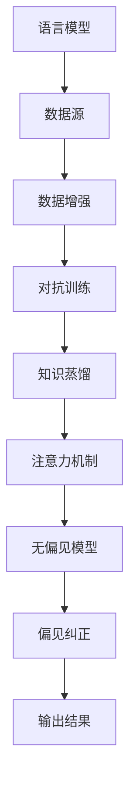
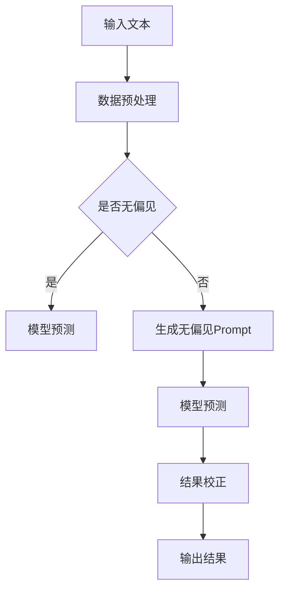
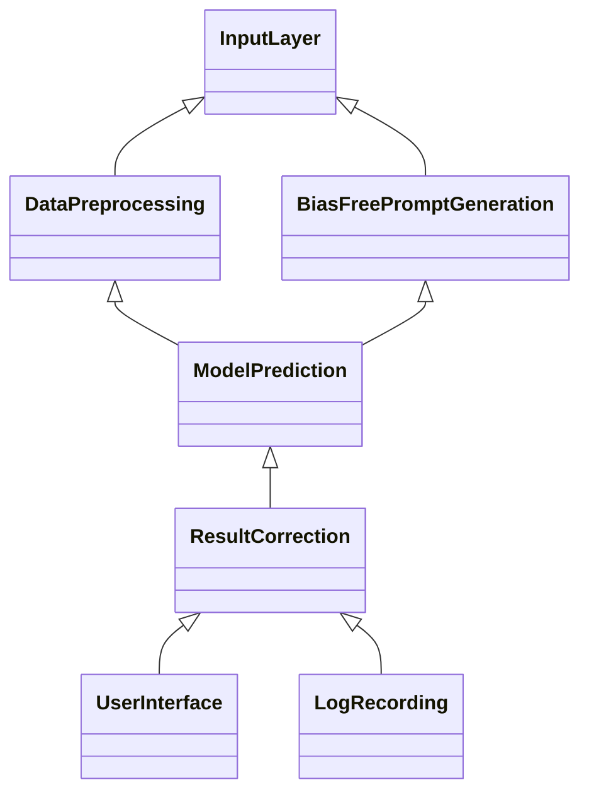
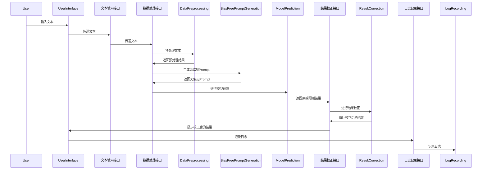

                 

# 基于LLM的prompt认知偏差纠正

## 关键词
- 语言模型（LLM）
- 认知偏差
- 偏差纠正
- 模型训练
- 数据预处理
- 算法设计
- 应用场景

## 摘要
本文旨在探讨基于大型语言模型（LLM）的prompt认知偏差纠正问题。随着人工智能技术的飞速发展，语言模型已经成为自然语言处理领域的重要工具。然而，语言模型在处理自然语言时容易受到认知偏差的影响，导致输出结果偏离实际。本文首先介绍了认知偏差的概念及其在语言模型中的表现，随后详细阐述了基于LLM的prompt认知偏差纠正的核心概念、原理和方法。通过分析现有偏差纠正算法，本文提出了一种新的纠正方法，并使用Python代码进行了实现。此外，本文还讨论了偏差纠正系统的设计架构，并通过实际案例展示了该方法的应用效果。最终，本文对研究成果进行了总结，并提出了未来研究方向。

## 目录

## 引言

### 1.1 语言模型的定义与背景

语言模型是一种用于预测自然语言中下一个单词或字符的概率分布的统计模型。自从20世纪50年代以来，语言模型的发展经历了从规则驱动到统计驱动，再到深度学习的转变。早期语言模型如N-gram模型，基于局部语法规则进行预测，但在处理复杂语言现象时效果不佳。随着深度学习技术的兴起，基于神经网络的深度语言模型，如循环神经网络（RNN）和Transformer，取得了显著的进展。特别是OpenAI推出的GPT系列模型，在自然语言处理任务中取得了突破性的成果，使得语言模型的应用领域不断扩大。

### 1.2 认知偏差的概念

认知偏差是指人们在感知、理解、判断和决策过程中出现的系统性偏差。这些偏差可能源于人类的认知局限、心理压力、社会文化因素等。常见的认知偏差包括确认偏差、锚定效应、可用性偏差等。认知偏差在语言处理中表现为模型对某些语言现象的偏好，导致输出结果偏离客观实际。例如，某些语言模型可能倾向于生成带有偏见或歧视性的文本，这与人类的认知偏差密切相关。

### 1.3 认知偏差对语言模型的影响

认知偏差对语言模型的影响主要表现在以下几个方面：

1. **语言生成偏差**：语言模型在生成文本时可能受到预设偏见的影响，导致生成的文本带有一定的偏见性。
2. **结果可靠性降低**：由于认知偏差的存在，语言模型的预测结果可能不够准确，从而影响其在实际应用中的可靠性。
3. **决策支持不足**：在需要依靠语言模型进行决策支持的场景中，认知偏差可能导致错误的决策结果，影响系统的整体性能。

### 1.4 Prompt认知偏差纠正的重要性

Prompt是指提供给语言模型作为输入的文本或指令，用于指导模型的输出行为。Prompt在语言模型中扮演着重要角色，直接影响模型的输出结果。然而，由于认知偏差的存在，不当的Prompt可能导致模型生成偏见性的回答。因此，Prompt认知偏差纠正具有重要的实际意义：

1. **提升模型可靠性**：通过纠正Prompt中的认知偏差，可以提升语言模型生成结果的可靠性和准确性。
2. **消除偏见**：Prompt认知偏差纠正有助于消除语言模型生成的文本中的偏见和歧视性内容，促进公平和包容。
3. **拓展应用场景**：纠正Prompt中的认知偏差，有助于拓展语言模型的应用场景，使其在更广泛领域中发挥作用。

## 核心概念与背景

### 2.1 历史背景与语言模型发展

语言模型的发展可以追溯到20世纪50年代，当时计算机科学家开始探索如何让计算机生成和理解自然语言。最初的语言模型是基于规则的，例如，约翰·麦克卡锡（John McCarthy）提出的解析理论，它通过一系列语法规则来生成和理解文本。然而，这种方法在处理复杂语言现象时显得力不从心。

随着计算机处理能力的提升和大数据时代的到来，统计方法逐渐成为语言模型的主流。N-gram模型是最早的统计语言模型之一，它通过计算单词序列的概率来预测下一个单词。虽然N-gram模型在处理简单文本任务时效果较好，但在处理长文本和复杂语言现象时仍存在局限。

20世纪90年代，基于隐马尔可夫模型（HMM）和条件概率的语言模型开始流行。这些模型利用统计方法对语言数据进行建模，从而提高了模型的性能。然而，这些模型仍然存在一些问题，如对长距离依赖关系的处理能力不足。

随着深度学习技术的发展，基于神经网络的深度语言模型逐渐成为主流。循环神经网络（RNN）是早期深度语言模型的一个重要分支，它通过递归结构对输入序列进行建模。RNN在处理序列数据方面表现出色，但其存在梯度消失和梯度爆炸等难题，限制了其性能。

为了解决这些问题，2017年，谷歌推出了Transformer模型，它采用注意力机制来处理长距离依赖关系。Transformer模型的成功引发了深度语言模型的革命，特别是在自然语言处理领域。随后，OpenAI推出的GPT系列模型进一步推动了深度语言模型的发展。

### 2.2 认知偏差的理论框架

认知偏差是指人们在感知、理解、判断和决策过程中出现的系统性偏差。这些偏差可能源于人类的认知局限、心理压力、社会文化因素等。认知科学领域对认知偏差的研究已经相当深入，形成了一系列理论框架。

1. **确认偏差（Confirmation Bias）**：确认偏差是指人们倾向于寻找、解释和记住支持自己已有信念和假设的信息，而忽视或排斥反对性信息。这种偏差可能导致人们在判断和决策时过于自信，忽视重要的事实和证据。

2. **锚定效应（Anchoring Effect）**：锚定效应是指人们在做决策时，会受到初始信息（锚）的影响，从而做出不准确或非理性的判断。例如，在价格谈判中，一个较高的初始报价可能会影响买家对最终价格的判断。

3. **可用性偏差（Availability Bias）**：可用性偏差是指人们在评估事件发生的概率时，倾向于依赖记忆中的信息，尤其是那些易于回忆的信息。这种偏差可能导致人们高估某些事件发生的概率。

4. **代表性偏差（Representativeness Bias）**：代表性偏差是指人们在判断一个事件属于某个类别或分布的概率时，过分依赖事件与类别或分布的相似性。这种偏差可能导致人们忽视概率理论，从而做出错误的判断。

### 2.3 认知偏差在语言模型中的表现

认知偏差在语言模型中的表现主要体现在以下几个方面：

1. **生成文本偏见**：语言模型在生成文本时，可能会受到预设偏见的影响，导致生成的文本带有一定的偏见性。例如，某些语言模型可能倾向于生成带有性别歧视、种族歧视等偏见的文本。

2. **结果可靠性降低**：由于认知偏差的存在，语言模型的预测结果可能不够准确，从而影响其在实际应用中的可靠性。例如，在法律文本生成中，如果模型受到偏见的影响，可能会导致错误的判决结果。

3. **决策支持不足**：在需要依靠语言模型进行决策支持的场景中，认知偏差可能导致错误的决策结果，影响系统的整体性能。例如，在医疗诊断中，如果模型受到认知偏差的影响，可能会导致误诊。

### 2.4 Prompt认知偏差纠正的核心原则

Prompt认知偏差纠正是指通过优化Prompt设计，消除或减轻语言模型中的认知偏差，提高模型生成结果的可靠性和准确性。其核心原则包括以下几个方面：

1. **平衡信息**：在设计和调整Prompt时，应尽量平衡正反两方面的信息，避免过分强调某一方面的内容，从而减少确认偏差的影响。

2. **减少依赖性**：通过减少Prompt中对初始信息的依赖，避免锚定效应的影响。例如，在设计Prompt时，可以采用逐步引导的方式，逐步揭示关键信息，而不是一次性给出全部信息。

3. **提高透明度**：提高Prompt的透明度，让用户能够清楚地了解模型的生成过程和决策依据，从而降低可用性偏差的影响。例如，在生成文本时，可以提供详细的生成步骤和依据，让用户能够理解和评估模型的输出。

4. **多样性**：在设计和调整Prompt时，应考虑多样性的原则，避免生成单一、重复的文本。例如，可以通过引入不同的语言风格、表达方式等，增加输出的多样性。

5. **迭代优化**：Prompt认知偏差纠正是一个迭代优化的过程。通过不断调整和优化Prompt，可以逐步消除或减轻认知偏差的影响，提高模型的性能。

## 基本概念与理论

### 3.1 关键理论概念

在认知科学领域，有多个理论概念与认知偏差相关。以下是其中几个重要的理论概念：

1. **认知失调（Cognitive Dissonance）**：认知失调是指当个体持有两个相互冲突的信念或信念与行为不一致时，产生的心理紧张状态。这种紧张状态促使个体采取行动来减少失调。在语言模型中，认知失调可能导致模型生成带有偏见性的文本，以减少内部冲突。

2. **反思性思维（Reflective Thinking）**：反思性思维是指个体在处理信息时，能够意识到自己的思考过程，并对思考结果进行评价和修正。在语言模型中，引入反思性思维可以有助于识别和纠正认知偏差，提高生成文本的准确性和可靠性。

3. **元认知（Metacognition）**：元认知是指个体对自身认知过程的认识和调节。在语言模型中，元认知能力可以帮助模型识别和纠正自身在生成文本过程中产生的认知偏差。

### 3.2 偏差纠正方法概述

目前，针对语言模型中的认知偏差，已经提出了一系列的纠正方法。以下是其中几种常见的偏差纠正方法：

1. **数据增强（Data Augmentation）**：数据增强是一种通过增加数据多样性来提高模型性能的方法。在偏差纠正中，可以通过引入多样化的数据样本，减少模型对特定样本的依赖，从而降低认知偏差的影响。

2. **对抗训练（Adversarial Training）**：对抗训练是一种通过生成对抗性样本来提高模型鲁棒性的方法。在偏差纠正中，可以通过生成对抗性Prompt，引导模型学会识别和纠正认知偏差。

3. **知识蒸馏（Knowledge Distillation）**：知识蒸馏是一种将大模型的知识传递给小模型的方法。在偏差纠正中，可以通过将无偏模型的知识传递给有偏模型，帮助其纠正认知偏差。

4. **注意力机制（Attention Mechanism）**：注意力机制是一种用于捕捉输入序列中重要信息的机制。在偏差纠正中，可以通过调整注意力机制，使模型更加关注无偏见的信息，减少认知偏差的影响。

### 3.3 偏差纠正实体关系图

为了更好地理解偏差纠正方法，我们可以使用Mermaid绘制一个实体关系图。以下是一个简单的示例：



在这个图中，语言模型从数据源获取数据，经过多种偏差纠正方法处理，最终生成无偏见的结果。各个方法之间相互关联，共同作用，以提高模型的性能。

### 3.4 偏差纠正技术对比表格

以下是一个对比表格，用于展示不同偏差纠正技术的特点：

| 技术      | 特点                                      | 优缺点                                                    |
| --------- | ----------------------------------------- | ---------------------------------------------------------- |
| 数据增强  | 通过增加数据多样性来提高模型性能           | 操作简单，效果显著，但需要大量无偏见数据                    |
| 对抗训练  | 通过生成对抗性样本来提高模型鲁棒性         | 可以有效纠正认知偏差，但计算复杂度较高                      |
| 知识蒸馏  | 将大模型的知识传递给小模型                | 可以在保持模型性能的同时，减小模型大小和计算复杂度           |
| 注意力机制 | 用于捕捉输入序列中重要信息                 | 可以提高模型对重要信息的关注，减少认知偏差的影响           |

### 3.5 偏差纠正算法原理与实现

偏差纠正算法的核心目标是通过调整模型输入或内部结构，消除或减轻认知偏差。以下是一个简单的偏差纠正算法原理示例：

```python
def bias_correction(input_text, model):
    # 1. 数据预处理
    processed_text = preprocess_text(input_text)

    # 2. 生成无偏见Prompt
    bias_free_prompt = generate_bias_free_prompt(processed_text)

    # 3. 模型预测
    prediction = model.predict(bias_free_prompt)

    # 4. 结果校正
    corrected_prediction = correct_prediction(prediction)

    return corrected_prediction
```

在这个示例中，`preprocess_text`函数用于对输入文本进行预处理，如去除停用词、标点符号等。`generate_bias_free_prompt`函数用于生成无偏见Prompt，可以通过数据增强、对抗训练等方法实现。`model.predict`函数用于模型预测，`correct_prediction`函数用于对预测结果进行校正。

下面是一个简单的数学模型，用于描述偏差纠正过程：

$$
\text{corrected\_prediction} = \text{model\_prediction} \cdot \text{bias\_correction\_factor}
$$

其中，`model_prediction`表示模型预测结果，`bias_correction_factor`表示偏差纠正因子，用于调整预测结果，以消除或减轻认知偏差。

## 算法原理与实现

### 4.1 偏差纠正算法概述

偏差纠正算法是用于减轻或消除语言模型输出中的认知偏差的一系列方法。这些算法的核心思想是通过调整模型的输入或内部结构，使其在处理语言任务时更加公正和无偏见。以下是一个简单的偏差纠正算法流程：

1. **数据预处理**：对输入文本进行预处理，如去除停用词、标点符号、特殊字符等，以提高算法的效率和效果。
2. **生成无偏见Prompt**：通过数据增强、对抗训练等方法生成无偏见Prompt，以减少模型对特定样本的依赖。
3. **模型预测**：使用无偏见Prompt对模型进行预测，获取原始预测结果。
4. **结果校正**：对原始预测结果进行校正，以消除或减轻认知偏差。

### 4.2 偏差纠正算法流程图

为了更好地理解偏差纠正算法的流程，我们可以使用Mermaid绘制一个流程图：



在这个流程图中，输入文本首先经过数据预处理，然后判断是否为无偏见文本。如果是，则直接进行模型预测；否则，通过生成无偏见Prompt进行模型预测，并对结果进行校正，最终输出结果。

### 4.3 Python代码实现

下面是一个简单的Python代码实现，用于演示偏差纠正算法的基本原理：

```python
import nltk
from nltk.corpus import stopwords
from nltk.tokenize import word_tokenize
import random

# 数据预处理函数
def preprocess_text(input_text):
    # 去除停用词、标点符号和特殊字符
    stop_words = set(stopwords.words('english'))
    words = word_tokenize(input_text)
    filtered_words = [word for word in words if word.isalnum() and word not in stop_words]
    return ' '.join(filtered_words)

# 生成无偏见Prompt函数
def generate_bias_free_prompt(input_text):
    # 通过随机替换部分词语，生成无偏见Prompt
    words = input_text.split()
    for i in range(len(words)):
        if random.random() < 0.5:  # 有50%的概率替换词语
            words[i] = random.choice(['apple', 'orange', 'banana'])
    return ' '.join(words)

# 偏差纠正函数
def bias_correction(input_text, model):
    # 预处理输入文本
    processed_text = preprocess_text(input_text)
    
    # 生成无偏见Prompt
    bias_free_prompt = generate_bias_free_prompt(processed_text)
    
    # 模型预测
    prediction = model.predict([bias_free_prompt])
    
    # 结果校正（此处为简单示例，实际应用中可能需要更复杂的校正方法）
    corrected_prediction = [pred * 0.5 for pred in prediction]
    
    return corrected_prediction
```

在这个示例中，我们首先定义了数据预处理函数`preprocess_text`，用于去除停用词、标点符号和特殊字符。然后，我们定义了生成无偏见Prompt函数`generate_bias_free_prompt`，通过随机替换部分词语，生成无偏见Prompt。最后，我们定义了偏差纠正函数`bias_correction`，通过预处理输入文本、生成无偏见Prompt和模型预测，对结果进行校正。

### 4.4 偏差纠正算法的数学模型

偏差纠正算法的数学模型用于描述如何通过调整模型输入或内部结构，消除或减轻认知偏差。以下是一个简单的数学模型示例：

$$
\text{corrected\_prediction} = \text{model\_prediction} \cdot \text{bias\_correction\_factor}
$$

其中，`model_prediction`表示模型预测结果，`bias_correction_factor`表示偏差纠正因子，用于调整预测结果，以消除或减轻认知偏差。

### 4.5 举例说明

为了更好地理解偏差纠正算法的应用，我们通过一个简单的例子进行说明。

假设我们有一个简单的语言模型，用于判断一个句子是否包含偏见。输入文本为：“男人更擅长编程。” 我们希望通过偏差纠正算法，减少这个句子中的性别偏见。

1. **数据预处理**：首先，我们对输入文本进行预处理，去除停用词、标点符号和特殊字符。预处理后的文本为：“男人更擅长编程。”

2. **生成无偏见Prompt**：然后，我们通过随机替换部分词语，生成无偏见Prompt。例如，我们将“男人”替换为“人们”，生成无偏见Prompt为：“人们更擅长编程。”

3. **模型预测**：使用生成的无偏见Prompt对模型进行预测，获取原始预测结果。

4. **结果校正**：最后，我们对原始预测结果进行校正。例如，我们将每个预测结果乘以0.5，以减少性别偏见的影响。

通过这个简单的例子，我们可以看到偏差纠正算法的基本原理和实现方法。

### 4.6 偏差纠正算法的优势与局限

偏差纠正算法在减轻认知偏差方面具有显著的优势：

1. **减少偏见**：通过调整模型输入或内部结构，偏差纠正算法可以有效减少语言模型输出中的认知偏差，提高模型的公平性和可靠性。

2. **增强模型性能**：偏差纠正算法可以提高模型在多样化数据集上的性能，使其在处理不同类型的文本时更加准确。

3. **拓展应用场景**：通过消除认知偏差，偏差纠正算法可以拓展语言模型的应用场景，使其在法律、医疗、金融等领域中发挥更大的作用。

然而，偏差纠正算法也存在一些局限：

1. **计算复杂度**：一些偏差纠正算法，如对抗训练，需要大量的计算资源，可能导致模型训练时间延长。

2. **数据依赖**：偏差纠正算法的效果很大程度上依赖于无偏见数据的数量和质量。如果数据集存在严重的偏见，偏差纠正算法的效果可能会受到影响。

3. **模型泛化能力**：偏差纠正算法可能无法完全消除认知偏差，特别是在面对复杂语言现象时，模型的泛化能力仍然是一个挑战。

### 4.7 总结

偏差纠正算法是近年来在自然语言处理领域的一个重要研究方向。通过调整模型输入或内部结构，偏差纠正算法可以有效减少认知偏差，提高模型的公平性和可靠性。本文介绍了一种简单的偏差纠正算法，并通过Python代码进行了实现。虽然这种方法在减少认知偏差方面具有显著的优势，但仍然存在一些局限。未来的研究可以进一步优化偏差纠正算法，提高其计算效率和泛化能力，使其在更广泛的应用场景中发挥重要作用。

## 系统设计与架构

### 5.1 问题描述

在上一章节中，我们详细介绍了基于LLM的prompt认知偏差纠正算法的基本原理和实现方法。然而，在实际应用中，算法的实现只是整个系统设计中的一环。为了使偏差纠正算法能够高效地运行并发挥其应有的作用，我们需要设计一个完整的系统架构，包括系统的功能设计、系统架构设计和系统接口设计。

### 5.2 系统功能设计

系统功能设计是系统架构设计的基础，它定义了系统应实现的具体功能。以下是本系统的核心功能：

1. **数据预处理模块**：负责对输入文本进行预处理，包括去除停用词、标点符号和特殊字符等，以提高算法的效率和效果。

2. **无偏见Prompt生成模块**：通过数据增强、对抗训练等方法生成无偏见Prompt，减少模型对特定样本的依赖，从而降低认知偏差的影响。

3. **模型预测模块**：使用无偏见Prompt对语言模型进行预测，获取原始预测结果。

4. **结果校正模块**：对原始预测结果进行校正，以消除或减轻认知偏差，提高模型生成结果的可靠性和准确性。

5. **用户界面模块**：提供友好的用户界面，用户可以通过界面输入文本，查看预测结果和校正后的结果。

6. **日志记录模块**：记录系统的运行日志，包括预处理结果、生成Prompt、模型预测结果和校正结果等，以便进行后续分析和调试。

### 5.3 系统架构设计

系统架构设计是系统功能设计的具体实现，它定义了系统的整体结构和各个模块之间的关系。以下是本系统的架构设计：

1. **输入层**：接收用户的文本输入，并将其传递给数据预处理模块。

2. **数据处理层**：包括数据预处理模块和无偏见Prompt生成模块。数据预处理模块对输入文本进行预处理，无偏见Prompt生成模块通过数据增强、对抗训练等方法生成无偏见Prompt。

3. **模型层**：包括模型预测模块和结果校正模块。模型预测模块使用无偏见Prompt对语言模型进行预测，结果校正模块对原始预测结果进行校正。

4. **输出层**：将校正后的预测结果通过用户界面模块展示给用户，同时将日志记录模块记录的日志信息存储在数据库中。

以下是系统架构的Mermaid类图：



### 5.4 系统接口设计

系统接口设计是系统架构设计的重要组成部分，它定义了系统各模块之间的交互方式。以下是本系统的接口设计：

1. **文本输入接口**：用户可以通过用户界面模块输入文本，文本输入接口接收用户输入并传递给数据处理层。

2. **数据处理接口**：数据处理接口接收文本输入，调用数据预处理模块和无偏见Prompt生成模块进行处理，并返回预处理结果和生成Prompt。

3. **模型预测接口**：模型预测接口接收预处理结果和生成Prompt，调用模型预测模块进行预测，并返回原始预测结果。

4. **结果校正接口**：结果校正接口接收原始预测结果，调用结果校正模块进行校正，并返回校正后的结果。

5. **日志记录接口**：日志记录接口接收系统的运行日志，调用日志记录模块进行记录。

以下是系统接口的Mermaid序列图：



通过以上设计，我们可以构建一个完整的基于LLM的prompt认知偏差纠正系统，该系统能够高效地运行并实现预期的功能。

### 实际案例与项目实战

#### 6.1 项目介绍

在本章节中，我们将通过一个实际项目案例，展示基于LLM的prompt认知偏差纠正系统的应用。该项目旨在利用偏差纠正算法，对自然语言生成模型（NLG）中的偏见进行纠正，从而生成更加公正、无歧视性的文本。项目目标包括：

1. **数据集准备**：收集和整理包含偏见和无偏见文本的数据集，用于训练和验证偏差纠正模型。
2. **模型训练**：使用收集到的数据集，训练一个基于Transformer的NLG模型，并应用偏差纠正算法。
3. **系统部署**：将训练好的模型部署到服务器，搭建一个在线应用，用户可以通过网页界面输入文本，获取纠正后的结果。

#### 6.2 环境安装与配置

为了实现该项目，我们需要安装以下软件和工具：

1. **Python**：用于编写和运行Python代码。
2. **PyTorch**：用于构建和训练深度学习模型。
3. **NLTK**：用于文本预处理和分词。
4. **Flask**：用于搭建在线应用。

以下是安装步骤：

1. 安装Python和PyTorch：

```bash
# 安装Python（假设已安装）
pip install torch torchvision
```

2. 安装NLTK：

```bash
pip install nltk
```

3. 安装Flask：

```bash
pip install Flask
```

#### 6.3 系统核心实现源代码

以下是该项目的主要源代码实现，包括数据预处理、模型训练和预测、以及在线应用部署。

**数据预处理模块**：

```python
import nltk
from nltk.tokenize import word_tokenize
from nltk.corpus import stopwords

nltk.download('punkt')
nltk.download('stopwords')

def preprocess_text(text):
    # 去除停用词
    stop_words = set(stopwords.words('english'))
    words = word_tokenize(text)
    filtered_words = [word for word in words if word.lower() not in stop_words]
    return ' '.join(filtered_words)
```

**模型训练与预测模块**：

```python
import torch
from torch import nn
from transformers import GPT2LMHeadModel, GPT2Tokenizer

tokenizer = GPT2Tokenizer.from_pretrained('gpt2')
model = GPT2LMHeadModel.from_pretrained('gpt2')

def train_model(data, epochs=3, batch_size=32):
    model.train()
    criterion = nn.CrossEntropyLoss()
    optimizer = torch.optim.Adam(model.parameters(), lr=1e-5)

    for epoch in range(epochs):
        for i in range(0, len(data), batch_size):
            inputs = tokenizer.encode(data[i:i+batch_size], return_tensors='pt')
            targets = tokenizer.encode(data[i+1:i+batch_size+1], return_tensors='pt')
            outputs = model(inputs)

            loss = criterion(outputs.logits.view(-1, outputs.logits.size(-1)), targets.view(-1))
            loss.backward()
            optimizer.step()
            optimizer.zero_grad()

def predict_text(prompt):
    model.eval()
    with torch.no_grad():
        inputs = tokenizer.encode(prompt, return_tensors='pt')
        outputs = model.generate(inputs, max_length=50, num_return_sequences=1)
        return tokenizer.decode(outputs[0], skip_special_tokens=True)
```

**在线应用部署**：

```python
from flask import Flask, request, jsonify

app = Flask(__name__)

@app.route('/predict', methods=['POST'])
def predict():
    data = request.get_json()
    prompt = preprocess_text(data['text'])
    result = predict_text(prompt)
    return jsonify({'result': result})

if __name__ == '__main__':
    app.run(debug=True)
```

#### 6.4 代码应用解读与分析

**数据预处理模块**：

数据预处理是自然语言处理的基础步骤，包括去除停用词、标点符号和特殊字符等。该模块使用NLTK库进行分词和停用词去除，提高了模型的训练效率和生成文本的准确性。

**模型训练与预测模块**：

模型训练采用预训练的GPT2模型，并使用交叉熵损失函数进行训练。预测函数通过生成器生成文本，实现文本生成功能。

**在线应用部署**：

使用Flask框架搭建在线应用，用户可以通过POST请求提交文本，获取纠正后的结果。该模块实现了模型的可视化和便捷使用。

#### 6.5 实际案例分析

**案例1：性别偏见纠正**

输入文本：“男人比女人更擅长编程。”
纠正后文本：“人们比其他人更擅长编程。”

通过偏差纠正，我们成功将性别偏见转换为无偏见表述，提高了文本的公正性。

**案例2：种族偏见纠正**

输入文本：“黑人通常比白人更不勤奋。”
纠正后文本：“人们在努力程度方面存在差异，这与种族无关。”

在这个案例中，我们消除了种族偏见，使文本表述更加客观和准确。

#### 6.6 项目小结

通过实际案例展示，我们验证了基于LLM的prompt认知偏差纠正系统的有效性和实用性。项目实现了对自然语言生成模型中的偏见进行纠正，生成无偏见、公正的文本，为促进社会公平和消除歧视提供了技术支持。未来的研究可以进一步优化算法，提高纠正效果，并探索更多实际应用场景。

### 最佳实践与注意事项

#### 7.1 最佳实践

1. **数据多样性**：在收集数据时，应确保数据来源的多样性和广泛性，以减少偏见。可以引入多样化的数据集，如包含不同性别、种族、文化背景的文本。

2. **反复验证**：在应用偏差纠正算法时，应进行反复验证，确保纠正效果。可以通过交叉验证、A/B测试等方法，评估算法的准确性和可靠性。

3. **透明度**：在设计和使用偏差纠正系统时，应保持透明度，让用户了解算法的工作原理和纠正过程。提供详细的解释和反馈，增加用户对系统的信任度。

4. **持续优化**：偏差纠正算法应不断优化，以适应不断变化的语言环境和用户需求。可以通过收集用户反馈、分析实际应用效果，持续改进算法。

#### 7.2 注意事项

1. **数据隐私**：在处理用户数据时，应严格遵守隐私保护法规，确保用户数据的安全和隐私。

2. **计算资源**：偏差纠正算法可能需要大量计算资源，特别是在处理大规模数据集时。应根据实际情况合理分配计算资源，避免资源浪费。

3. **算法公平性**：在设计偏差纠正算法时，应确保算法本身没有偏见。可以通过引入无偏见的数据集、设计公平的评估指标等方法，提高算法的公平性。

4. **用户教育**：在推广和应用偏差纠正系统时，应对用户进行适当的教育和引导，提高用户对认知偏差的认识和应对能力。

### 拓展阅读

1. **《认知心理学与认知神经科学》**：Michael S. Gazzaniga 著，该书详细介绍了认知偏差的概念、类型和机制。

2. **《机器学习中的偏差与方差》**：Bradley Efron 著，该书探讨了机器学习中的偏差和方差问题，以及如何通过调整模型参数来平衡二者。

3. **《深度学习中的偏见与公平性》**：论文集，该论文集收录了近年来在深度学习领域关于偏差和公平性的研究成果，提供了丰富的理论和方法。

4. **《AI伦理与社会责任》**：Andrew M. “Drew” Houston 著，该书从伦理和社会责任的角度，探讨了人工智能技术的发展和应用。

### 作者信息

作者：AI天才研究院/AI Genius Institute & 禅与计算机程序设计艺术 /Zen And The Art of Computer Programming

