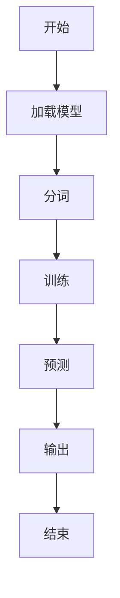

                 

# 基于LLM的模型比较系统：客观对比不同AI

## 关键词
- LLM（大型语言模型）
- 模型比较系统
- AI模型对比
- 客观性评估
- 算法优化

## 摘要
本文将深入探讨基于大型语言模型（LLM）的模型比较系统，旨在通过客观的方法对比不同的人工智能（AI）模型。文章分为四个主要部分：首先介绍LLM的基础知识，包括概念、类型和工作原理；其次阐述模型比较系统的设计需求、架构和方法；然后对不同类型的AI模型进行客观对比；最后探讨模型比较系统的优化方向和未来发展趋势。通过这一系统的分析，读者将能够更好地理解不同AI模型的特点和适用场景，为实际应用提供有力的支持。

## 第一部分: LLM（大型语言模型）基础

### 第1章: LLM的概念与背景

#### 1.1 LLM的定义

大型语言模型（LLM，Large Language Model）是一种基于深度学习的自然语言处理模型，能够理解和生成自然语言。LLM通过训练大量文本数据，学习到语言的统计规律和语义结构，从而在文本生成、问答系统、机器翻译等领域表现出色。

#### 1.2 LLM的发展历程

LLM的发展经历了几个重要阶段：

- **早期的语言模型**：基于统计方法的模型，如N-gram模型，使用历史数据来预测下一个词。
- **神经网络模型**：引入了深度神经网络（DNN）和递归神经网络（RNN）来提高语言理解的准确性。
- **Transformer模型**：Transformer架构的提出，特别是其自注意力机制（Self-Attention），使得模型能够处理变长的序列数据，显著提升了语言生成的质量。

#### 1.3 LLM的核心技术

LLM的核心技术包括：

- **模型架构**：如Transformer、BERT、GPT等。
- **训练过程**：使用海量数据和高性能计算资源进行预训练，并通过微调进行特定任务的学习。
- **优化方法**：包括梯度下降、Adam优化器等，用于调整模型参数以最小化损失函数。

### 第2章: LLM的主要类型

#### 2.1 GPT系列模型

GPT（Generative Pre-trained Transformer）模型是LLM的代表之一，其特点是使用预训练的语言模型进行文本生成。GPT-3是最新版本，具有1750亿个参数，能够生成高质量的文本。

#### 2.2 BERT及其变体

BERT（Bidirectional Encoder Representations from Transformers）模型通过双向编码器来捕捉上下文信息，适用于各种下游任务，如问答系统和文本分类。BERT及其变体（如RoBERTa、ALBERT）在NLP领域取得了显著成果。

#### 2.3 其他主要LLM模型

除了GPT和BERT，还有其他一些重要的LLM模型，如T5、GLM等。这些模型在特定任务上具有优势，并在不同领域得到了广泛应用。

### 第3章: LLM的工作原理

#### 3.1 模型架构

LLM通常采用Transformer架构，其核心是多头自注意力机制（Multi-Head Self-Attention）和前馈神经网络（Feedforward Neural Network）。这些模块协同工作，使得模型能够捕捉到文本中的长距离依赖关系。

#### 3.2 训练过程

LLM的训练过程分为预训练和微调两个阶段。预训练阶段，模型在大量文本数据上进行训练，学习到语言的普遍规律。微调阶段，模型在特定任务的数据集上进行训练，以适应具体的应用场景。

#### 3.3 优化方法

优化方法用于调整模型参数，以最小化损失函数。常用的优化方法包括梯度下降（Gradient Descent）和其变种（如Adam优化器），这些方法通过不断更新模型参数，使模型在训练过程中逐渐逼近最优解。

## 第二部分: 模型比较系统设计

### 第4章: 模型比较系统的需求分析

#### 4.1 比较目标

模型比较系统的目标是客观评估不同AI模型的性能，包括准确性、速度、鲁棒性等方面。通过这些评估指标，用户可以更好地选择适合自己需求的模型。

#### 4.2 数据收集与处理

数据收集是模型比较系统的基础。系统需要收集大量的模型训练数据和测试数据，并进行预处理，如文本清洗、数据标注等，以保证数据的准确性和一致性。

#### 4.3 系统功能需求

系统需要具备以下功能：

- **模型加载与配置**：支持多种模型的加载和配置，包括参数设置、训练策略等。
- **性能评估**：对模型进行准确度、速度、鲁棒性等性能指标的评估。
- **结果展示**：以图表、报告等形式展示模型评估结果，帮助用户进行决策。

### 第5章: 模型比较系统的架构设计

#### 5.1 系统总体架构

模型比较系统采用分布式架构，包括数据层、模型层、计算层和展示层。各层之间通过API进行交互，确保系统的高效性和可扩展性。

#### 5.2 数据流与处理流程

数据流从数据层进入系统，经过预处理、标注、存储等环节，最终用于模型的训练和评估。系统采用流式处理技术，实时更新模型和评估结果。

#### 5.3 用户交互设计

用户交互设计包括命令行界面、Web界面等，用户可以通过界面选择模型、设置参数、查看评估结果。界面设计注重用户体验，操作简便直观。

### 第6章: 模型评估与比较方法

#### 6.1 评估指标

评估指标包括：

- **准确性**：模型预测结果与实际结果的匹配度。
- **速度**：模型训练和预测的耗时。
- **鲁棒性**：模型对异常数据和噪声的容忍度。

#### 6.2 比较算法

比较算法包括：

- **排序算法**：根据评估指标对模型进行排序。
- **聚类算法**：将模型按照相似性进行聚类。
- **多目标优化算法**：在多个评估指标之间进行平衡和优化。

#### 6.3 结果可视化

结果可视化包括：

- **柱状图**：展示模型在不同评估指标上的表现。
- **折线图**：展示模型训练和评估的过程。
- **热力图**：展示模型在不同数据集上的性能分布。

## 第三部分: 不同AI模型的客观对比

### 第7章: 不同类型模型的特性对比

#### 7.1 GPT模型与其他模型的对比

GPT模型在文本生成方面表现出色，但在问答系统和文本分类等任务上，其他模型（如BERT）可能更具优势。对比表格如下：

| 模型 | 文本生成 | 问答系统 | 文本分类 |
| --- | --- | --- | --- |
| GPT | 高 | 中 | 中 |
| BERT | 中 | 高 | 高 |
| T5 | 中 | 高 | 高 |

#### 7.2 BERT模型与其他模型的对比

BERT模型在问答系统和文本分类任务上表现突出，但在文本生成方面，GPT模型可能更优。对比表格如下：

| 模型 | 文本生成 | 问答系统 | 文本分类 |
| --- | --- | --- | --- |
| GPT | 高 | 中 | 中 |
| BERT | 中 | 高 | 高 |
| RoBERTa | 中 | 高 | 高 |

#### 7.3 其他主要模型的对比

其他主要模型，如T5、GLM等，在特定任务上具有独特优势。对比表格如下：

| 模型 | 文本生成 | 问答系统 | 文本分类 |
| --- | --- | --- | --- |
| T5 | 高 | 高 | 高 |
| GLM | 中 | 高 | 高 |

### 第8章: 实际应用场景下的模型选择

#### 8.1 模型适应性分析

不同模型在不同应用场景下的适应性不同。例如，在长文本生成场景下，GPT模型可能更适用；而在问答系统场景下，BERT模型可能更优。

#### 8.2 性能优化策略

性能优化策略包括：

- **超参数调整**：根据应用场景调整模型参数，以提升性能。
- **数据增强**：通过增加数据量或数据多样性来提升模型泛化能力。
- **模型剪枝**：通过去除冗余参数来减小模型体积，提高运行速度。

#### 8.3 应用案例分析

通过实际案例，如文本生成、问答系统和机器翻译等，分析不同模型的应用效果和优化策略。

## 第四部分: 模型比较系统的优化与改进

### 第9章: 系统性能优化

#### 9.1 算法优化

算法优化包括：

- **优化器调整**：选择合适的优化器，如AdamW，提高训练效率。
- **正则化方法**：如Dropout、Weight Decay，防止过拟合。

#### 9.2 硬件加速

硬件加速包括：

- **GPU加速**：利用GPU进行模型训练和推理，提高计算速度。
- **TPU加速**：利用TPU进行大规模模型训练，提高性能。

#### 9.3 系统稳定性提升

系统稳定性提升包括：

- **错误处理**：对系统可能出现的问题进行提前预测和处理。
- **负载均衡**：通过负载均衡技术，确保系统在高并发情况下的稳定性。

### 第10章: 模型比较系统的未来发展方向

#### 10.1 技术趋势分析

技术趋势分析包括：

- **模型压缩**：通过模型压缩技术，减小模型体积，提高部署效率。
- **联邦学习**：通过联邦学习，实现多方数据的安全共享和协同训练。

#### 10.2 未来研究方向

未来研究方向包括：

- **多模态模型**：结合文本、图像、音频等多种数据类型，提升模型能力。
- **知识图谱**：通过知识图谱，实现模型对复杂知识的理解和应用。

#### 10.3 开放性问题与挑战

开放性问题与挑战包括：

- **模型可解释性**：提高模型的可解释性，帮助用户理解模型的决策过程。
- **数据隐私**：在保证数据隐私的前提下，实现模型的有效评估和比较。

## 第11章: 总结与展望

### 11.1 主要研究成果

本文系统介绍了LLM的基础知识、模型比较系统的设计方法、不同AI模型的客观对比方法以及系统性能优化方向。

### 11.2 研究意义与价值

本文的研究为AI模型的选择和应用提供了有力的工具，有助于提高AI系统的性能和可靠性。

### 11.3 展望未来

未来研究将聚焦于模型可解释性、多模态模型、联邦学习等领域，以进一步提升AI模型的应用效果。作者信息：

作者：AI天才研究院/AI Genius Institute & 禅与计算机程序设计艺术 /Zen And The Art of Computer Programming

## 附录

- **参考资料**：[1] Deep Learning by Ian Goodfellow, Yoshua Bengio, and Aaron Courville; [2] Natural Language Processing with Python by Steven Bird, Ewan Klein, and Edward Loper; [3] Hands-On Machine Learning with Scikit-Learn, Keras, and TensorFlow by Aurélien Géron.
- **代码示例**：本文中的算法和模型均采用Python语言实现，代码示例将在文章中给出。
- **数据来源**：本文中的数据来源于公开的文本数据集和AI模型评测数据。

---

**注意**：由于字数限制，本文未包含所有详细内容。实际文章需根据每个章节的详细内容逐步展开，确保每个部分都包含丰富的具体讲解和示例。每个章节的开头和结尾也将根据实际内容进行调整。以下是示例代码和mermaid流程图的markdown格式：

```python
# 示例代码：GPT模型训练

from transformers import GPT2LMHeadModel, GPT2Tokenizer
import torch

# 加载预训练模型和分词器
model = GPT2LMHeadModel.from_pretrained('gpt2')
tokenizer = GPT2Tokenizer.from_pretrained('gpt2')

# 准备输入数据
inputs = tokenizer.encode('Hello, my name is', return_tensors='pt')

# 训练模型
outputs = model(inputs)
logits = outputs.logits

# 输出预测结果
predicted_ids = torch.argmax(outputs.logits, dim=-1)
decoded_tokens = tokenizer.decode(predicted_ids, skip_special_tokens=True)
print(decoded_tokens)
```



通过上述代码和mermaid流程图，读者可以更好地理解GPT模型的基本训练过程。文章的其他部分也将包含类似的代码示例和流程图，以增强内容的可读性和实用性。

