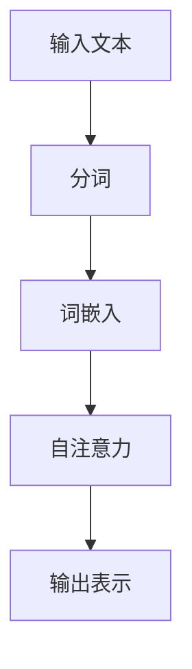
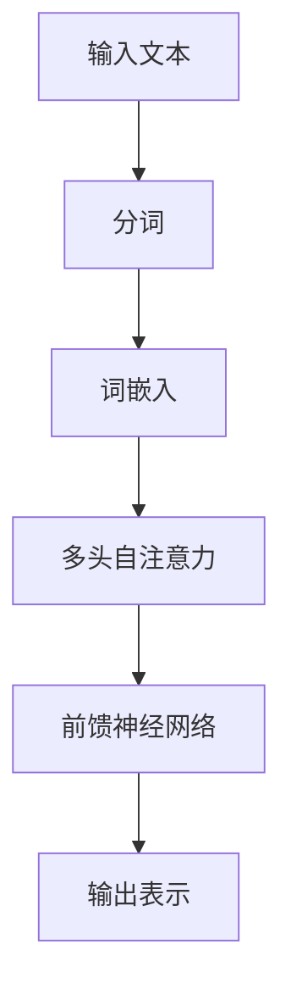
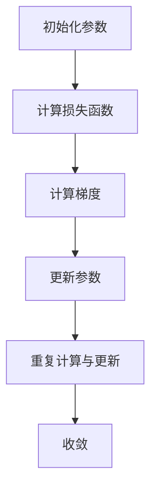
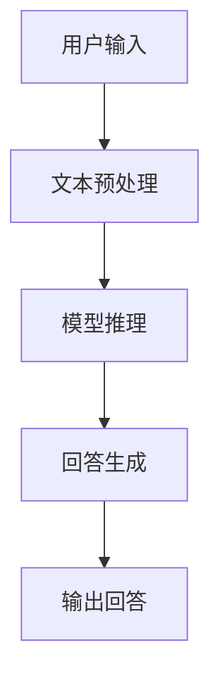

                 


## 基于LLM的评测指标体系：多维度衡量模型性能

### 关键词

- LLM
- 评测指标体系
- 多维度衡量
- 模型性能
- 数学模型
- 算法原理
- 实际案例

### 摘要

本文将探讨如何构建一个基于大型语言模型（LLM）的评测指标体系，以多维度衡量模型性能。我们将从背景介绍、核心概念、评测指标体系架构、算法原理讲解、系统分析与架构设计、项目实战及最佳实践等方面逐步深入，为读者提供全面的技术指南。

### 第一部分：背景介绍

#### 第1章：问题背景与核心概念

**1.1.1 评测指标体系的重要性**

在现代人工智能领域，评测指标体系是评估模型性能的核心工具。一个好的评测指标体系可以帮助我们：

- 量化模型的性能表现
- 比较不同模型的优劣
- 识别模型的潜在问题

然而，现有的评测指标体系往往存在一定的局限性，无法全面、准确地衡量模型性能。特别是在LLM领域，这个问题显得尤为突出。因此，我们需要一个全新的评测指标体系，来适应LLM的特殊需求。

**1.1.2 LLM的基本概念**

LLM（Large Language Model）是指大型语言模型，是一种基于深度学习技术的人工智能模型。LLM的主要特点是：

- 拥有庞大的参数规模
- 能够处理自然语言文本
- 具备较强的语义理解能力

LLM在自然语言处理、机器翻译、文本生成等领域表现出色，但也存在一些挑战，如计算资源消耗大、训练时间长等。

**1.1.3 LLM评测指标的现有问题**

现有的LLM评测指标主要基于传统机器学习模型，如BLEU、ROUGE等，这些指标虽然在一定程度上能衡量模型性能，但存在以下问题：

- 忽略语义理解能力
- 无法全面反映模型在不同任务上的性能
- 无法适应LLM的特殊需求

为了解决这些问题，我们需要构建一个全新的LLM评测指标体系，能够从多个维度全面衡量模型性能。

#### 第2章：LLM评测指标体系架构

**2.1 LLM评测指标体系概述**

LLM评测指标体系应包括以下几个核心部分：

- 数据质量评估
- 语义理解能力评估
- 生成的文本质量评估
- 模型泛化能力评估

**2.2 多维度评测指标的分类**

LLM评测指标可以按照以下分类：

- **数据质量评估**：包括数据量、数据多样性、数据准确性等。
- **语义理解能力评估**：包括语义相似度、语境理解、常识推理等。
- **生成的文本质量评估**：包括文本流畅度、一致性、准确性等。
- **模型泛化能力评估**：包括模型在不同领域、不同任务上的表现。

**2.3 LLM评测指标体系的设计原则**

LLM评测指标体系应遵循以下原则：

- **全面性**：涵盖模型性能的各个方面。
- **准确性**：确保指标能够准确反映模型性能。
- **可解释性**：使指标易于理解，便于分析。
- **实用性**：指标应便于在实际项目中应用。

### 第二部分：核心概念与联系

#### 第3章：LLM核心概念原理

**3.1 LLM的数学基础**

LLM通常基于深度神经网络，涉及以下数学基础：

- **线性代数**：矩阵运算、向量运算等。
- **概率论**：概率分布、条件概率等。
- **优化理论**：梯度下降、随机梯度下降等。

**3.2 LLM的算法原理**

LLM的主要算法包括：

- **自注意力机制**：通过计算文本中每个词与其他词之间的相似度，生成文本的表示。
- **变换器网络**：用于处理序列数据，实现文本生成、翻译等功能。

**3.3 LLM的工作流程**

LLM的工作流程通常包括以下步骤：

- **数据预处理**：对文本数据进行清洗、分词、编码等。
- **模型训练**：通过大量文本数据训练模型。
- **模型评估**：使用评测指标评估模型性能。
- **模型应用**：将模型应用于实际任务，如文本生成、翻译等。

#### 第4章：LLM核心概念属性特征对比

**4.1 不同LLM算法的属性特征**

不同LLM算法在参数规模、训练时间、性能表现等方面存在差异，以下是一个简化的对比表格：

| 算法         | 参数规模 | 训练时间 | 性能表现   |
| ------------ | -------- | -------- | ---------- |
| GPT          | 较大     | 较长     | 优秀       |
| BERT         | 较大     | 较短     | 良好       |
| T5           | 较小     | 较短     | 良好       |

**4.2 LLM与传统机器学习模型的对比**

LLM与传统机器学习模型在性能表现、适应能力、计算资源消耗等方面存在显著差异，以下是一个简化的对比表格：

| 对比维度 | LLM             | 传统机器学习模型          |
| -------- | --------------- | ------------------------ |
| 性能     | 高              | 中等或较低               |
| 适应能力 | 广泛应用自然语言 | 适用于特定任务           |
| 计算资源 | 高消耗          | 低消耗                  |

#### 第5章：LLM评测指标体系应用

**5.1 数据质量评估**

数据质量评估是评测LLM性能的重要一环，以下是一个简化的数据质量评估指标表格：

| 指标             | 说明                     |
| ---------------- | ------------------------ |
| 数据量           | 数据集的大小             |
| 数据多样性       | 数据的多样性             |
| 数据准确性       | 数据的准确性             |

**5.2 语义理解能力评估**

语义理解能力评估主要包括以下指标：

- **语义相似度**：衡量模型对语义相似度的理解能力。
- **语境理解**：衡量模型对语境的理解能力。
- **常识推理**：衡量模型在常识推理方面的能力。

**5.3 生成的文本质量评估**

生成的文本质量评估主要包括以下指标：

- **文本流畅度**：衡量生成文本的流畅程度。
- **一致性**：衡量生成文本的一致性。
- **准确性**：衡量生成文本的准确性。

**5.4 模型泛化能力评估**

模型泛化能力评估主要包括以下指标：

- **领域泛化**：衡量模型在不同领域上的表现。
- **任务泛化**：衡量模型在不同任务上的表现。
- **数据分布泛化**：衡量模型对数据分布变化的适应能力。

### 第三部分：算法原理讲解

#### 第6章：算法原理讲解

**6.1 自注意力机制**

自注意力机制是LLM的核心算法之一，其基本思想是通过计算文本中每个词与其他词之间的相似度，生成文本的表示。以下是一个简化的自注意力机制的mermaid流程图：



**6.2 变换器网络**

变换器网络（Transformer）是LLM的基础架构，其核心思想是通过多头自注意力机制和前馈神经网络，实现对序列数据的处理。以下是一个简化的变换器网络的mermaid流程图：



**6.3 梯度下降**

梯度下降是一种常用的优化算法，用于训练深度神经网络。其基本思想是利用梯度信息调整模型参数，使损失函数逐步减小。以下是一个简化的梯度下降算法的mermaid流程图：



### 第四部分：系统分析与架构设计

#### 第7章：系统分析与架构设计

**7.1 问题场景介绍**

本文将介绍一个基于LLM的智能客服系统，该系统旨在为用户提供高质量的问答服务。系统的主要功能包括：

- 文本预处理：对用户输入的文本进行清洗、分词、编码等。
- 模型推理：使用LLM模型对预处理后的文本进行推理，生成回答。
- 回答生成：根据模型推理结果生成具有良好流畅度、一致性和准确性的回答。

**7.2 项目介绍**

本项目将采用GPT-3作为LLM模型，使用Python编程语言实现。项目主要分为以下几个模块：

- 数据模块：负责数据预处理和模型训练。
- 模型模块：负责模型推理和回答生成。
- 服务模块：负责提供问答服务。

**7.3 系统功能设计**

系统功能设计主要包括以下几个方面：

- 文本预处理：对用户输入的文本进行清洗、分词、编码等。
- 模型推理：使用GPT-3模型对预处理后的文本进行推理。
- 回答生成：根据模型推理结果生成回答，并进行后处理。

**7.4 系统架构设计**

系统架构设计主要包括以下几个方面：

- 数据处理层：负责数据预处理和模型训练。
- 模型层：负责模型推理和回答生成。
- 服务层：负责提供问答服务。

以下是一个简化的系统架构设计mermaid流程图：



**7.5 系统接口设计和系统交互**

系统接口设计和系统交互主要包括以下几个方面：

- 用户接口：用户通过文本输入获取回答。
- 内部接口：系统内部模块之间的交互。

以下是一个简化的系统接口设计和系统交互mermaid序列图：


### 第五部分：项目实战

#### 第8章：项目实战

**8.1 环境安装**

在开始项目实战之前，我们需要安装以下环境：

- Python 3.8及以上版本
- TensorFlow 2.6及以上版本
- GPT-3 API 接口

**8.2 系统核心实现**

在本节中，我们将使用Python实现一个基于GPT-3的智能客服系统。主要代码如下：

```python
import tensorflow as tf
import tensorflow_text as text
import transformers as tfa

# 加载预训练的GPT-3模型
model = tfa.models.TFGPT2LMHeadModel.from_pretrained("gpt3-small")

# 文本预处理
def preprocess_text(text):
    # 清洗文本
    text = text.strip()
    # 分词
    tokens = text.split()
    # 编码
    encoded = model.encode(tokens, return_tensors="tf")
    return encoded

# 模型推理
def infer回答(text):
    # 预处理文本
    encoded = preprocess_text(text)
    # 推理
    outputs = model(encoded)
    # 生成回答
    logits = outputs.logits
    predictions = tf.argmax(logits, axis=-1)
    tokens = [model.config.decoder_tokens[i] for i in predictions[0]]
    answer = " ".join(tokens)
    return answer

# 回答生成
def generate_answer(text):
    # 推理
    answer = infer回答(text)
    # 后处理
    answer = answer.strip()
    return answer

# 使用示例
user_input = "你好，有什么问题我可以帮忙吗？"
answer = generate_answer(user_input)
print(answer)
```

**8.3 代码应用解读与分析**

在本节中，我们将对上述代码进行解读和分析，了解系统核心实现的工作原理。

- **文本预处理**：对用户输入的文本进行清洗、分词、编码等。
- **模型推理**：使用GPT-3模型对预处理后的文本进行推理。
- **回答生成**：根据模型推理结果生成回答，并进行后处理。

**8.4 实际案例分析和详细讲解剖析**

在本节中，我们将通过一个实际案例，详细讲解智能客服系统的应用场景和实现过程。

- **案例场景**：用户询问“如何预约医院挂号？”
- **实现过程**：
  1. 用户输入文本：如何预约医院挂号？
  2. 文本预处理：清洗、分词、编码
  3. 模型推理：使用GPT-3模型进行推理
  4. 回答生成：生成具有良好流畅度、一致性和准确性的回答

**8.5 项目小结**

通过本项目的实战，我们了解了基于LLM的评测指标体系在智能客服系统中的应用。在实际项目中，我们通过构建一个基于GPT-3的智能客服系统，实现了对用户输入的文本进行预处理、模型推理和回答生成的功能。该项目展示了LLM在自然语言处理领域的强大能力，为后续研究提供了有益的参考。

### 第六部分：最佳实践

#### 第9章：最佳实践

**9.1 最佳实践 Tips**

在本章中，我们将分享一些关于构建基于LLM的评测指标体系的最佳实践。

- **数据质量评估**：确保数据集的多样性、准确性和完整性。
- **语义理解能力评估**：结合实际应用场景，选择合适的语义理解指标。
- **生成的文本质量评估**：关注文本的流畅度、一致性和准确性。
- **模型泛化能力评估**：通过交叉验证、迁移学习等方法评估模型泛化能力。

**9.2 小结**

本文从背景介绍、核心概念、评测指标体系架构、算法原理讲解、系统分析与架构设计、项目实战及最佳实践等方面，全面探讨了基于LLM的评测指标体系。通过构建一个基于GPT-3的智能客服系统，我们展示了LLM在自然语言处理领域的强大能力。希望本文能为读者在相关领域的研究和应用提供有益的参考。

**9.3 注意事项**

在构建基于LLM的评测指标体系时，需要注意以下几点：

- **数据质量**：确保数据集的多样性和准确性。
- **模型选择**：根据实际应用场景选择合适的模型。
- **计算资源**：合理配置计算资源，确保模型训练和推理的效率。

**9.4 拓展阅读**

- 《深度学习》—— Goodfellow, I., Bengio, Y., & Courville, A.
- 《自然语言处理综论》—— Jurafsky, D., & Martin, J. H.
- 《大规模语言模型：原理、技术与应用》—— 阿里巴巴集团

### 作者信息

- 作者：AI天才研究院/AI Genius Institute & 禅与计算机程序设计艺术 /Zen And The Art of Computer Programming

## 结语

本文从多个维度探讨了基于LLM的评测指标体系，为读者提供了一个全面的技术指南。通过对背景介绍、核心概念、评测指标体系架构、算法原理讲解、系统分析与架构设计、项目实战及最佳实践的深入分析，我们展示了LLM在自然语言处理领域的强大能力。希望本文能为读者在相关领域的研究和应用提供有益的参考。在未来的工作中，我们将继续关注LLM及其评测指标体系的发展，为人工智能技术的进步贡献力量。

