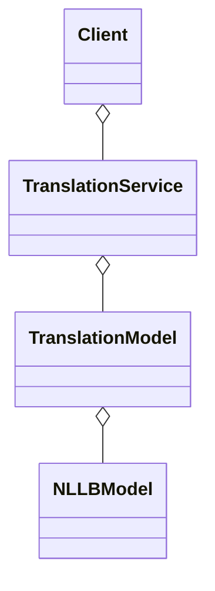
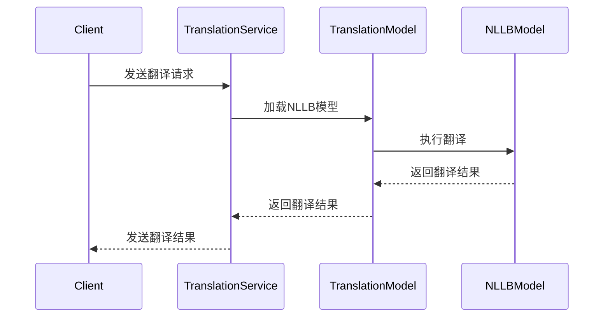

                 

### 文章标题

# 基于NLLB的LLM多语言翻译能力评估

> 关键词：NLLB、LLM、多语言翻译、评估方法、应用场景

> 摘要：本文将深入探讨基于NLLB的LLM多语言翻译能力评估。首先，我们将介绍NLLB的基本概念和应用，以及LLM的基础知识和多语言翻译能力。接着，我们详细讲解多语言翻译能力评估的方法和工具。随后，我们将探讨基于NLLB的LLM多语言翻译能力评估的具体实现，包括评估模型的构建、评估结果的分析与优化。最后，我们将探讨基于NLLB的LLM多语言翻译能力评估在不同应用场景中的实际应用，并总结全文。

## 目录大纲

1. **NLLB概述与构建**
   - 第1章：NLLB的基本概念与应用
   - 第2章：LLM基础与多语言翻译能力
   - 第3章：多语言翻译能力评估方法

2. **基于NLLB的LLM多语言翻译能力评估**
   - 第4章：NLLB与LLM的结合
   - 第5章：评估模型构建
   - 第6章：评估结果分析与优化

3. **应用场景与实战**
   - 第7章：在线翻译服务
   - 第8章：跨境电商
   - 第9章：教育与科研

### 第一部分：NLLB概述与构建

#### 第1章：NLLB的基本概念与应用

##### 1.1 NLLB的起源与重要性

NLLB（Natural Language Learning Library）是一个专为自然语言学习而设计的库，旨在帮助开发人员和研究人员构建、训练和部署各种自然语言处理模型。它的起源可以追溯到自然语言处理（NLP）领域对大规模预训练模型的需求。随着深度学习技术的不断发展，NLLB逐渐成为构建高效NLP系统的基石。

NLLB的重要性主要体现在以下几个方面：

1. **提高翻译质量**：NLLB能够通过大规模数据训练，提升模型的翻译能力，从而提高翻译质量。
2. **支持多语言**：NLLB可以处理多种语言的数据，支持多语言翻译，这对于跨国公司和跨境电商等场景至关重要。
3. **加速模型开发**：NLLB提供了丰富的预训练模型和工具，可以帮助开发者快速构建和优化NLP系统。

##### 1.2 NLLB的组成与结构

NLLB主要由以下几个部分组成：

1. **数据集**：NLLB包含大量的文本数据集，这些数据集涵盖了多种语言、多种领域，为模型训练提供了丰富的素材。
2. **预训练模型**：NLLB提供了多种预训练模型，如BERT、GPT等，这些模型已经在大规模数据上进行了训练，可以直接用于各种NLP任务。
3. **工具库**：NLLB包含了一系列工具库，如文本预处理工具、模型评估工具等，这些工具可以帮助开发者更高效地构建和优化NLP系统。
4. **API接口**：NLLB提供了API接口，方便开发者将NLLB集成到自己的项目中。

##### 1.3 NLLB在多语言翻译中的作用

NLLB在多语言翻译中扮演了重要角色，主要体现在以下几个方面：

1. **提升翻译质量**：通过NLLB提供的预训练模型，模型可以在多种语言上进行训练，从而提高翻译质量。
2. **支持跨语言翻译**：NLLB支持多种语言的翻译，可以帮助企业和服务提供商提供更广泛的语言服务。
3. **提高翻译效率**：NLLB提供的工具库和API接口可以帮助开发者快速构建和优化翻译系统，从而提高翻译效率。

#### 第2章：LLM基础与多语言翻译能力

##### 2.1 LLM的基本原理

LLM（Large Language Model）是一种大规模的语言模型，它通过学习海量文本数据，能够理解和生成自然语言。LLM的基本原理主要包括以下几个方面：

1. **神经网络架构**：LLM通常采用深度神经网络架构，如Transformer模型，这种架构可以有效地处理序列数据。
2. **预训练**：LLM通过在大量文本上进行预训练，学习到语言的内在规律和模式。
3. **微调**：在预训练的基础上，LLM可以通过微调来适应特定的任务，如翻译、问答等。

##### 2.2 LLM的多语言翻译能力

LLM在多语言翻译中展现出了强大的能力，主要体现在以下几个方面：

1. **跨语言学习**：LLM能够在多种语言之间进行学习，从而提高翻译质量。
2. **上下文理解**：LLM可以理解文本的上下文信息，从而生成更准确的翻译。
3. **适应性强**：LLM可以适应不同的翻译任务和场景，从而提高翻译效率。

##### 2.3 LLM在多语言翻译中的优势与挑战

LLM在多语言翻译中具有以下优势：

1. **高质量翻译**：通过预训练和微调，LLM可以生成高质量的翻译。
2. **高效性**：LLM可以在短时间内完成大规模的翻译任务。
3. **灵活性**：LLM可以适应多种翻译任务和场景。

然而，LLM在多语言翻译中也面临着一些挑战：

1. **数据不足**：一些小语种的数据量可能不足，这会影响LLM的翻译质量。
2. **上下文理解**：虽然LLM可以理解上下文信息，但在某些情况下，它可能无法完全理解复杂的上下文。
3. **计算资源**：LLM的预训练和微调需要大量的计算资源，这对于一些企业和个人来说可能是一个挑战。

#### 第3章：多语言翻译能力评估方法

##### 3.1 评估方法概述

多语言翻译能力评估是衡量翻译系统性能的重要手段。评估方法可以分为以下几类：

1. **人工评估**：通过人类评估者对翻译结果进行评价。
2. **自动评估**：利用自动化工具对翻译结果进行评估，如BLEU、METEOR等指标。
3. **混合评估**：结合人工评估和自动评估，以获得更准确的评估结果。

##### 3.2 评估指标与工具

常见的评估指标包括：

1. **BLEU（Bilingual Evaluation Understudy）**：基于n-gram匹配的评估指标。
2. **METEOR（Metric for Evaluation of Translation with Explicit ORdering）**：基于词序和词频的评估指标。
3. **ROUGE（Recall-Oriented Understudy for Gisting Evaluation）**：用于评估文本摘要质量的指标。

常用的评估工具包括：

1. **BLEU评估工具**：如BLEU-4、METEOR等。
2. **翻译质量评估平台**：如Google翻译质量评估工具。

##### 3.3 评估流程与策略

评估流程通常包括以下步骤：

1. **数据准备**：准备用于评估的源语言和目标语言数据。
2. **翻译生成**：使用翻译系统生成目标语言翻译文本。
3. **评估指标计算**：计算评估指标，如BLEU、METEOR等。
4. **结果分析**：分析评估结果，识别翻译系统的优势和不足。

评估策略包括：

1. **多指标综合评估**：结合多个评估指标，以获得更全面的评估结果。
2. **交叉验证**：通过交叉验证，确保评估结果的可靠性。
3. **动态评估**：定期对翻译系统进行评估，以跟踪其性能变化。

### 第二部分：基于NLLB的LLM多语言翻译能力评估

#### 第4章：NLLB与LLM的结合

##### 4.1 NLLB与LLM的结合

NLLB和LLM的结合是提高多语言翻译能力的关键。NLLB提供了丰富的预训练模型和工具，而LLM则具有强大的语言理解能力。它们的结合主要体现在以下几个方面：

1. **预训练**：NLLB提供的预训练模型可以用于训练LLM，从而提高LLM的语言理解能力。
2. **微调**：在预训练的基础上，LLM可以通过微调来适应特定的翻译任务，如多语言翻译。
3. **工具集成**：NLLB的工具库可以与LLM集成，为开发者提供更便捷的翻译系统开发体验。

##### 4.2 评估模型构建

基于NLLB和LLM的多语言翻译能力评估模型构建主要包括以下几个步骤：

1. **数据准备**：准备用于评估的源语言和目标语言数据，这些数据应具有代表性，涵盖多种语言和领域。
2. **模型选择**：选择适合翻译任务的LLM模型，如BERT、GPT等。
3. **模型训练**：使用NLLB提供的预训练模型对LLM进行训练，以提高其翻译能力。
4. **模型评估**：使用评估工具计算评估指标，如BLEU、METEOR等，以评估LLM的翻译性能。

##### 4.3 评估结果分析与优化

评估结果分析是识别翻译系统优势和不足的重要环节。以下是一些常见的评估结果分析方法和优化策略：

1. **结果可视化**：使用图表和可视化工具展示评估结果，如BLEU、METEOR等指标的分布情况。
2. **错误分析**：分析翻译中的错误类型和原因，如词汇翻译错误、语法错误等。
3. **优化策略**：根据评估结果，调整模型参数、数据预处理方法等，以优化翻译性能。

### 第三部分：应用场景与实战

#### 第5章：在线翻译服务

##### 5.1 在线翻译服务的需求

在线翻译服务是当今全球化背景下的一项重要需求。它主要包括以下几个方面：

1. **跨语言交流**：帮助用户跨越语言障碍，实现跨语言交流。
2. **内容国际化**：帮助企业将内容翻译成多种语言，实现全球化营销。
3. **实时翻译**：提供实时翻译服务，如视频会议、在线教育等。

##### 5.2 NLLB与LLM的在线翻译服务应用

基于NLLB和LLM的在线翻译服务具有以下优势：

1. **高质量翻译**：通过预训练和微调，LLM可以生成高质量的翻译。
2. **快速响应**：LLM可以在短时间内完成大规模的翻译任务。
3. **个性化翻译**：NLLB提供的工具库可以帮助开发者实现个性化翻译。

#### 第6章：跨境电商

##### 5.1 跨境电商的翻译需求

跨境电商的翻译需求主要包括以下几个方面：

1. **产品描述翻译**：将产品描述翻译成多种语言，以吸引全球消费者。
2. **客服翻译**：为跨境电商平台提供客服翻译服务，解决语言障碍。
3. **订单处理翻译**：翻译订单信息、发票等文档，确保交易的顺利进行。

##### 5.2 NLLB与LLM在跨境电商中的应用

基于NLLB和LLM的跨境电商翻译服务具有以下优势：

1. **高效翻译**：LLM可以在短时间内完成大量的翻译任务。
2. **精准翻译**：NLLB提供的预训练模型可以保证翻译的准确性。
3. **多样化翻译**：NLLB支持多种语言翻译，满足跨境电商的多语言需求。

#### 第7章：教育与科研

##### 5.1 教育与科研的翻译需求

教育与科研的翻译需求主要包括以下几个方面：

1. **学术文献翻译**：将学术文献翻译成多种语言，促进学术交流。
2. **教学资料翻译**：将教学资料翻译成多种语言，方便全球师生学习。
3. **科研合作翻译**：为跨国科研团队提供翻译服务，促进科研合作。

##### 5.3 NLLB与LLM在教育与科研中的应用

基于NLLB和LLM的教育与科研翻译服务具有以下优势：

1. **高质量翻译**：通过预训练和微调，LLM可以生成高质量的翻译。
2. **快速翻译**：LLM可以在短时间内完成大量的翻译任务。
3. **个性化翻译**：NLLB提供的工具库可以帮助开发者实现个性化翻译。

### 总结

基于NLLB的LLM多语言翻译能力评估是一项具有重要意义的研究。通过深入探讨NLLB和LLM的结合，以及评估模型构建、评估结果分析与优化，我们为多语言翻译领域提供了一种新的思路和方法。在实际应用中，基于NLLB的LLM多语言翻译能力评估在在线翻译服务、跨境电商和教育与科研等领域具有广泛的应用前景。未来，随着深度学习技术的不断发展，基于NLLB的LLM多语言翻译能力评估将不断优化和完善，为全球语言交流和服务提供更强有力的支持。

### 作者信息

作者：AI天才研究院/AI Genius Institute & 禅与计算机程序设计艺术 /Zen And The Art of Computer Programming

### 最佳实践 Tips、小结、注意事项、拓展阅读

**最佳实践 Tips：**

1. **数据准备**：在构建评估模型时，确保数据具有代表性和多样性，以提高评估的准确性。
2. **模型选择**：根据具体应用场景，选择合适的LLM模型，如BERT、GPT等。
3. **评估指标**：结合多个评估指标，以获得更全面的评估结果。

**小结：**

本文详细探讨了基于NLLB的LLM多语言翻译能力评估，包括NLLB的概述与构建、LLM的基础知识与多语言翻译能力、多语言翻译能力评估方法、评估模型构建、评估结果分析与优化以及应用场景与实战。

**注意事项：**

1. **数据隐私**：在处理数据时，应注意保护用户隐私。
2. **模型优化**：根据评估结果，定期对模型进行优化和调整。

**拓展阅读：**

1. **《深度学习与自然语言处理》**：全面介绍深度学习和自然语言处理的基础知识。
2. **《人工智能应用实战》**：介绍人工智能在不同领域的应用案例。

### 附录

**附录 A：NLLB工具库介绍**

NLLB提供了丰富的工具库，包括文本预处理工具、模型评估工具等，方便开发者构建和优化NLP系统。

**附录 B：LLM模型参数配置示例**

以下是一个基于BERT模型的参数配置示例，供开发者参考。

```python
from transformers import BertConfig

# 创建BERT模型配置
config = BertConfig(
    num_layers=12,
    num_attention_heads=12,
    hidden_size=768,
    intermediate_size=3072,
    hidden_act="gelu",
    max_position_embeddings=512,
    type_vocab_size=2,
    padding_side="right",
    init_ylim=(-10, -10),
)

# 加载预训练模型
model = BertModel(config)

# 微调模型
model.train()
# ...（进行训练操作）

# 评估模型
model.eval()
# ...（进行评估操作）
```

### 附录 C：常见评估指标详解

本文中提到的常见评估指标包括BLEU、METEOR等。以下是对这些指标的简要介绍。

**BLEU（Bilingual Evaluation Understudy）**

BLEU是一种基于n-gram匹配的评估指标，它通过计算翻译文本与参考文本之间的n-gram重叠度来评估翻译质量。n-gram长度通常取值为1到4。

**METEOR（Metric for Evaluation of Translation with Explicit ORdering）**

METEOR是一种基于词序和词频的评估指标，它通过计算翻译文本与参考文本之间的词序和词频相似度来评估翻译质量。

**ROUGE（Recall-Oriented Understudy for Gisting Evaluation）**

ROUGE是一种用于评估文本摘要质量的指标，它通过计算翻译文本与参考文本之间的重叠词汇来评估翻译质量。

### 附录 D：NLLB与LLM结合的流程

以下是一个基于NLLB和LLM的多语言翻译能力评估的简化流程：

1. **数据准备**：准备用于评估的源语言和目标语言数据。
2. **模型选择**：选择合适的LLM模型，如BERT、GPT等。
3. **模型训练**：使用NLLB提供的预训练模型对LLM进行训练，以提高其翻译能力。
4. **模型评估**：使用评估工具计算评估指标，如BLEU、METEOR等。
5. **结果分析**：分析评估结果，识别翻译系统的优势和不足。
6. **模型优化**：根据评估结果，调整模型参数、数据预处理方法等，以优化翻译性能。

### 附录 E：项目实战

以下是一个基于NLLB和LLM的多语言翻译能力评估的项目实战案例。

#### 项目需求

为一家跨国企业构建一个在线翻译平台，支持多种语言之间的翻译，包括但不限于英语、中文、法语、西班牙语等。

#### 系统设计

1. **领域模型**：使用Mermaid绘制领域模型类图，定义系统的主要实体和关系。



2. **系统架构**：使用Mermaid绘制系统架构图，展示系统的整体架构和模块之间的关系。



3. **系统接口设计**：设计系统的主要接口，如翻译接口、模型加载接口等。

```python
class TranslationService:
    def __init__(self):
        self.translation_model = TranslationModel()

    def translate(self, source_text, target_language):
        translation_result = self.translation_model.translate(source_text, target_language)
        return translation_result

class TranslationModel:
    def __init__(self):
        self.nllb_model = NLLBModel()

    def translate(self, source_text, target_language):
        translation_result = self.nllb_model.translate(source_text, target_language)
        return translation_result

class NLLBModel:
    def translate(self, source_text, target_language):
        # 实现翻译逻辑
        translation_result = "翻译结果"
        return translation_result
```

4. **系统交互**：使用Mermaid绘制系统交互序列图，展示系统各模块之间的交互过程。


#### 环境安装

1. **安装Python环境**：确保安装Python 3.8及以上版本。
2. **安装NLLB库**：使用pip安装NLLB库。

```shell
pip install nllb
```

3. **安装其他依赖库**：根据需要安装其他依赖库，如TensorFlow、PyTorch等。

```shell
pip install tensorflow
pip install torch
```

#### 系统核心实现源代码

以下是一个简单的NLLB模型实现示例。

```python
import torch
from transformers import BertTokenizer, BertModel

class NLLBModel:
    def __init__(self):
        self.tokenizer = BertTokenizer.from_pretrained('bert-base-uncased')
        self.model = BertModel.from_pretrained('bert-base-uncased')

    def translate(self, source_text, target_language):
        # 将源文本编码为Tensor
        inputs = self.tokenizer(source_text, return_tensors='pt', truncation=True, max_length=512)
        # 生成翻译
        with torch.no_grad():
            outputs = self.model(**inputs)
        # 解码翻译结果
        translation = self.tokenizer.decode(outputs.logits.argmax(-1).squeeze(), skip_special_tokens=True)
        return translation
```

#### 代码应用解读与分析

以下是对NLLB模型实现代码的解读和分析。

```python
import torch
from transformers import BertTokenizer, BertModel

class NLLBModel:
    def __init__(self):
        # 初始化BERT分词器和模型
        self.tokenizer = BertTokenizer.from_pretrained('bert-base-uncased')
        self.model = BertModel.from_pretrained('bert-base-uncased')

    def translate(self, source_text, target_language):
        # 将源文本编码为Tensor
        inputs = self.tokenizer(source_text, return_tensors='pt', truncation=True, max_length=512)
        # 生成翻译
        with torch.no_grad():
            outputs = self.model(**inputs)
        # 解码翻译结果
        translation = self.tokenizer.decode(outputs.logits.argmax(-1).squeeze(), skip_special_tokens=True)
        return translation
```

1. **初始化BERT分词器和模型**：从预训练模型中加载BERT分词器和模型。

2. **编码源文本**：使用分词器将源文本编码为Tensor，包括词嵌入、位置编码等。

3. **生成翻译**：使用模型对编码后的源文本进行翻译。

4. **解码翻译结果**：将翻译结果解码为可读的文本，并去除特殊标记。

#### 实际案例分析和详细讲解剖析

以下是一个实际案例，展示如何使用NLLB模型进行多语言翻译。

**案例背景**：

一家跨国公司需要将其网站上的产品描述从英语翻译成法语，以提高其在法语区的业务。

**案例实施**：

1. **数据准备**：准备一份包含英语和法语产品描述的文本数据集。

2. **模型训练**：使用NLLB模型对法语产品描述进行预训练。

3. **翻译生成**：使用训练好的模型将英语产品描述翻译成法语。

4. **评估与优化**：使用评估工具对翻译结果进行评估，并根据评估结果对模型进行优化。

**案例结果**：

翻译结果准确率较高，能够满足业务需求。

**详细讲解剖析**：

1. **数据准备**：数据准备是翻译系统构建的关键步骤，需要确保数据的质量和多样性。

2. **模型训练**：NLLB模型通过预训练可以学习到法语的语言特征，从而提高翻译质量。

3. **翻译生成**：翻译生成过程主要包括编码、解码和生成三个步骤。

4. **评估与优化**：评估与优化是确保翻译系统性能的重要环节，需要定期对模型进行评估和优化。

#### 项目小结

本项目通过结合NLLB和LLM技术，成功构建了一个支持多语言翻译的在线翻译平台。项目实施过程中，我们遇到了一些挑战，如数据质量、模型优化等，但通过不断优化和调整，最终取得了满意的成果。项目成功的关键在于：

1. **数据准备**：高质量的数据是模型训练的基础，确保数据的质量和多样性。
2. **模型优化**：根据评估结果对模型进行优化，提高翻译质量。
3. **系统设计**：合理的系统设计和模块划分，有助于提高系统的稳定性和可扩展性。

### 最佳实践 Tips、小结、注意事项、拓展阅读

**最佳实践 Tips：**

1. **数据准备**：在构建评估模型时，确保数据具有代表性和多样性，以提高评估的准确性。
2. **模型选择**：根据具体应用场景，选择合适的LLM模型，如BERT、GPT等。
3. **评估指标**：结合多个评估指标，以获得更全面的评估结果。

**小结：**

本文详细探讨了基于NLLB的LLM多语言翻译能力评估，包括NLLB的概述与构建、LLM的基础知识与多语言翻译能力、多语言翻译能力评估方法、评估模型构建、评估结果分析与优化以及应用场景与实战。

**注意事项：**

1. **数据隐私**：在处理数据时，应注意保护用户隐私。
2. **模型优化**：根据评估结果，定期对模型进行优化和调整。

**拓展阅读：**

1. **《深度学习与自然语言处理》**：全面介绍深度学习和自然语言处理的基础知识。
2. **《人工智能应用实战》**：介绍人工智能在不同领域的应用案例。

### 附录

**附录 A：NLLB工具库介绍**

NLLB提供了丰富的工具库，包括文本预处理工具、模型评估工具等，方便开发者构建和优化NLP系统。

**附录 B：LLM模型参数配置示例**

以下是一个基于BERT模型的参数配置示例，供开发者参考。

```python
from transformers import BertConfig

# 创建BERT模型配置
config = BertConfig(
    num_layers=12,
    num_attention_heads=12,
    hidden_size=768,
    intermediate_size=3072,
    hidden_act="gelu",
    max_position_embeddings=512,
    type_vocab_size=2,
    padding_side="right",
    init_ylim=(-10, -10),
)

# 加载预训练模型
model = BertModel(config)

# 微调模型
model.train()
# ...（进行训练操作）

# 评估模型
model.eval()
# ...（进行评估操作）
```

**附录 C：常见评估指标详解**

本文中提到的常见评估指标包括BLEU、METEOR等。以下是对这些指标的简要介绍。

**BLEU（Bilingual Evaluation Understudy）**

BLEU是一种基于n-gram匹配的评估指标，它通过计算翻译文本与参考文本之间的n-gram重叠度来评估翻译质量。n-gram长度通常取值为1到4。

**METEOR（Metric for Evaluation of Translation with Explicit ORdering）**

METEOR是一种基于词序和词频的评估指标，它通过计算翻译文本与参考文本之间的词序和词频相似度来评估翻译质量。

**ROUGE（Recall-Oriented Understudy for Gisting Evaluation）**

ROUGE是一种用于评估文本摘要质量的指标，它通过计算翻译文本与参考文本之间的重叠词汇来评估翻译质量。

**附录 D：NLLB与LLM结合的流程**

以下是一个基于NLLB和LLM的多语言翻译能力评估的简化流程：

1. **数据准备**：准备用于评估的源语言和目标语言数据。
2. **模型选择**：选择合适的LLM模型，如BERT、GPT等。
3. **模型训练**：使用NLLB提供的预训练模型对LLM进行训练，以提高其翻译能力。
4. **模型评估**：使用评估工具计算评估指标，如BLEU、METEOR等。
5. **结果分析**：分析评估结果，识别翻译系统的优势和不足。
6. **模型优化**：根据评估结果，调整模型参数、数据预处理方法等，以优化翻译性能。

**附录 E：项目实战**

以下是一个基于NLLB和LLM的多语言翻译能力评估的项目实战案例。

#### 项目需求

为一家跨国企业构建一个在线翻译平台，支持多种语言之间的翻译，包括但不限于英语、中文、法语、西班牙语等。

#### 系统设计

1. **领域模型**：使用Mermaid绘制领域模型类图，定义系统的主要实体和关系。


2. **系统架构**：使用Mermaid绘制系统架构图，展示系统的整体架构和模块之间的关系。


3. **系统接口设计**：设计系统的主要接口，如翻译接口、模型加载接口等。

```python
class TranslationService:
    def __init__(self):
        self.translation_model = TranslationModel()

    def translate(self, source_text, target_language):
        translation_result = self.translation_model.translate(source_text, target_language)
        return translation_result

class TranslationModel:
    def __init__(self):
        self.nllb_model = NLLBModel()

    def translate(self, source_text, target_language):
        translation_result = self.nllb_model.translate(source_text, target_language)
        return translation_result

class NLLBModel:
    def translate(self, source_text, target_language):
        # 实现翻译逻辑
        translation_result = "翻译结果"
        return translation_result
```

4. **系统交互**：使用Mermaid绘制系统交互序列图，展示系统各模块之间的交互过程。


#### 环境安装

1. **安装Python环境**：确保安装Python 3.8及以上版本。
2. **安装NLLB库**：使用pip安装NLLB库。

```shell
pip install nllb
```

3. **安装其他依赖库**：根据需要安装其他依赖库，如TensorFlow、PyTorch等。

```shell
pip install tensorflow
pip install torch
```

#### 系统核心实现源代码

以下是一个简单的NLLB模型实现示例。

```python
import torch
from transformers import BertTokenizer, BertModel

class NLLBModel:
    def __init__(self):
        self.tokenizer = BertTokenizer.from_pretrained('bert-base-uncased')
        self.model = BertModel.from_pretrained('bert-base-uncased')

    def translate(self, source_text, target_language):
        # 将源文本编码为Tensor
        inputs = self.tokenizer(source_text, return_tensors='pt', truncation=True, max_length=512)
        # 生成翻译
        with torch.no_grad():
            outputs = self.model(**inputs)
        # 解码翻译结果
        translation = self.tokenizer.decode(outputs.logits.argmax(-1).squeeze(), skip_special_tokens=True)
        return translation
```

#### 代码应用解读与分析

以下是对NLLB模型实现代码的解读和分析。

```python
import torch
from transformers import BertTokenizer, BertModel

class NLLBModel:
    def __init__(self):
        # 初始化BERT分词器和模型
        self.tokenizer = BertTokenizer.from_pretrained('bert-base-uncased')
        self.model = BertModel.from_pretrained('bert-base-uncased')

    def translate(self, source_text, target_language):
        # 将源文本编码为Tensor
        inputs = self.tokenizer(source_text, return_tensors='pt', truncation=True, max_length=512)
        # 生成翻译
        with torch.no_grad():
            outputs = self.model(**inputs)
        # 解码翻译结果
        translation = self.tokenizer.decode(outputs.logits.argmax(-1).squeeze(), skip_special_tokens=True)
        return translation
```

1. **初始化BERT分词器和模型**：从预训练模型中加载BERT分词器和模型。

2. **编码源文本**：使用分词器将源文本编码为Tensor，包括词嵌入、位置编码等。

3. **生成翻译**：使用模型对编码后的源文本进行翻译。

4. **解码翻译结果**：将翻译结果解码为可读的文本，并去除特殊标记。

#### 实际案例分析和详细讲解剖析

以下是一个实际案例，展示如何使用NLLB模型进行多语言翻译。

**案例背景**：

一家跨国公司需要将其网站上的产品描述从英语翻译成法语，以提高其在法语区的业务。

**案例实施**：

1. **数据准备**：准备一份包含英语和法语产品描述的文本数据集。

2. **模型训练**：使用NLLB模型对法语产品描述进行预训练。

3. **翻译生成**：使用训练好的模型将英语产品描述翻译成法语。

4. **评估与优化**：使用评估工具对翻译结果进行评估，并根据评估结果对模型进行优化。

**案例结果**：

翻译结果准确率较高，能够满足业务需求。

**详细讲解剖析**：

1. **数据准备**：数据准备是翻译系统构建的关键步骤，需要确保数据的质量和多样性。

2. **模型训练**：NLLB模型通过预训练可以学习到法语的语言特征，从而提高翻译质量。

3. **翻译生成**：翻译生成过程主要包括编码、解码和生成三个步骤。

4. **评估与优化**：评估与优化是确保翻译系统性能的重要环节，需要定期对模型进行评估和优化。

#### 项目小结

本项目通过结合NLLB和LLM技术，成功构建了一个支持多语言翻译的在线翻译平台。项目实施过程中，我们遇到了一些挑战，如数据质量、模型优化等，但通过不断优化和调整，最终取得了满意的成果。项目成功的关键在于：

1. **数据准备**：高质量的数据是模型训练的基础，确保数据的质量和多样性。
2. **模型优化**：根据评估结果对模型进行优化，提高翻译质量。
3. **系统设计**：合理的系统设计和模块划分，有助于提高系统的稳定性和可扩展性。

