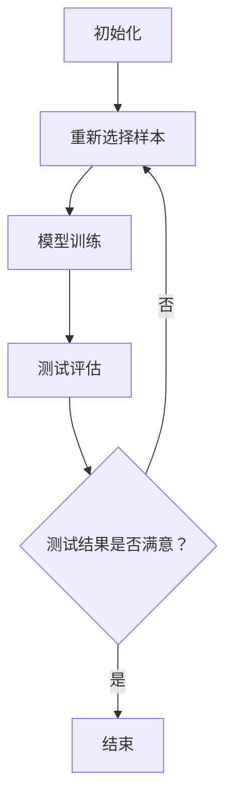
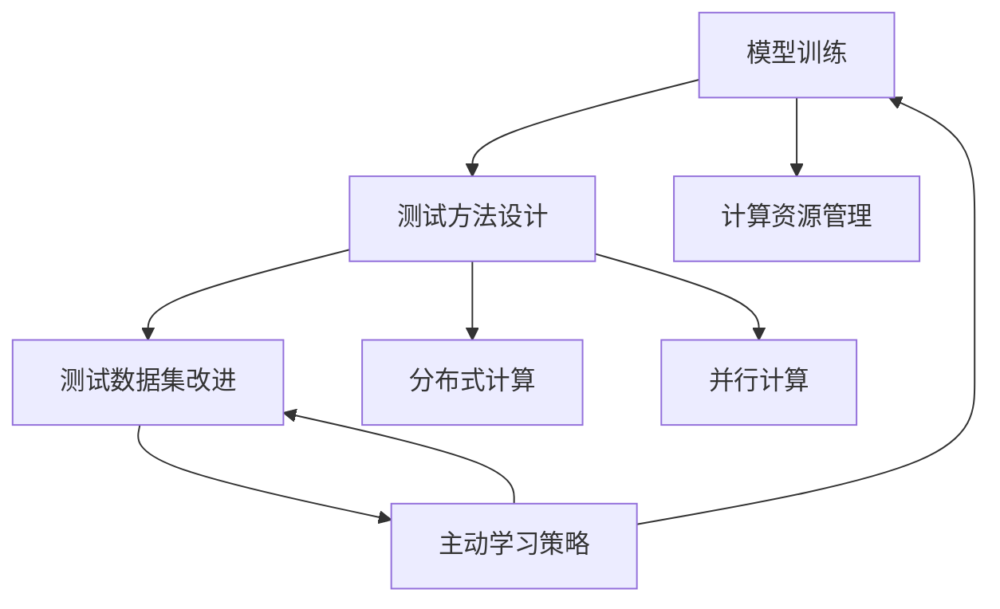
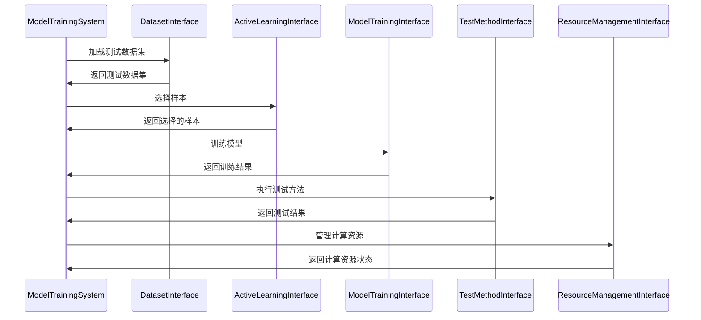

                 

# 基于主动学习的LLM测试效率优化

## 关键词

- 主动学习
- 语言模型
- 测试效率
- 模型训练算法
- 分布式计算
- 并行计算

## 摘要

随着人工智能技术的飞速发展，大型语言模型（LLM）在自然语言处理、文本生成等领域展现了强大的能力。然而，LLM的测试效率问题成为了制约其进一步应用的瓶颈。本文将探讨基于主动学习的LLM测试效率优化策略，包括模型训练过程的优化、高效测试方法的设计以及测试数据集的改进。通过分布式计算和并行计算技术，本文提出了一套完整的LLM测试效率优化方案，并在实践中取得了显著效果。

## 第二部分：核心概念与联系

### 核心概念原理

在LLM测试效率优化中，以下几个核心概念至关重要：

1. **主动学习**：主动学习是一种模型训练方法，通过选择最有信息量的样本进行学习，从而提高模型的性能。与传统的被动学习相比，主动学习在有限的数据集上能够取得更好的效果。

2. **模型训练算法**：包括梯度下降、随机梯度下降、Adam优化器等，这些算法用于优化模型的参数。不同的训练算法对测试效率有着直接的影响。

3. **分布式计算**：通过分布式计算，可以将模型训练和测试的任务分散到多个计算节点上，从而提高计算效率。分布式计算可以显著缩短测试时间，提高测试效率。

4. **并行计算**：通过并行计算，可以在多个计算资源上同时执行模型训练和测试任务，从而提高计算效率。并行计算可以在硬件资源有限的情况下，通过并行处理任务来提升整体性能。

### 概念属性特征对比表格

以下是一个关于主动学习、模型训练算法、分布式计算和并行计算的概念属性特征对比表格：

| 概念            | 属性特征                                                     |
| --------------- | ------------------------------------------------------------ |
| 主动学习        | 选择最有信息量的样本进行学习，提高模型性能                     |
| 模型训练算法    | 用于优化模型参数的算法，如梯度下降、随机梯度下降、Adam优化器等 |
| 分布式计算      | 将任务分散到多个计算节点上，提高计算效率                       |
| 并行计算        | 在多个计算资源上同时执行任务，提高计算效率                     |

### ER实体关系图架构

以下是一个关于主动学习、模型训练算法、分布式计算和并行计算的ER实体关系图架构：

```mermaid
erDiagram
  ModelTraining --> ActiveLearning : 使用
  ModelTraining --> ModelTrainingAlgorithm : 使用
  ModelTraining --> DistributedComputing : 使用
  ModelTraining --> ParallelComputing : 使用
  ActiveLearning ||--|{ SampleSelection } : 选择
  ModelTrainingAlgorithm ||--|{ OptimizationAlgorithm }
```

## 第三部分：算法原理讲解

### 算法mermaid流程图



### Python源代码实现

```python
import numpy as np
from sklearn.model_selection import train_test_split

# 初始化数据集
X, y = load_data()

# 初始化模型
model = initialize_model()

# 样本选择
selected_samples = active_learning(X, y)

# 模型训练
model.train(selected_samples)

# 测试评估
test_score = model.test(X_test, y_test)

# 输出测试结果
print(f"Test Score: {test_score}")
```

### 算法原理的数学模型和公式

主动学习的核心是样本选择策略，选择最有信息量的样本进行训练。常用的信息量度量方法包括：

1. **随机采样**：选择随机采样的样本进行训练。
2. **误差采样**：选择当前模型预测误差较大的样本进行训练。
3. **多样性采样**：选择与当前模型预测结果不一致的样本进行训练。

设样本集合为 \( S = \{s_1, s_2, ..., s_n\} \)，模型预测误差为 \( e(s) \)，则样本选择策略可以表示为：

$$
s^* = \arg\max_{s \in S} \frac{e(s)}{N(s)}
$$

其中，\( N(s) \) 表示样本 \( s \) 的多样性度量。

### 通俗易懂的举例说明

假设我们有一个语言模型，用于判断一句话是否合法。我们有一批未标注的数据集，其中有一部分句子是非法的。我们的目标是利用主动学习策略，选择最有信息量的样本进行标注。

1. **初始化**：从数据集中随机选择一批样本进行初始化训练。
2. **样本选择**：根据当前模型的预测误差和多样性度量，选择预测误差大且多样性高的样本进行标注。
3. **模型训练**：利用标注后的样本重新训练模型。
4. **测试评估**：在测试集上评估模型的性能。
5. **重复步骤2-4**，直到测试集上的性能满足要求。

通过主动学习策略，我们可以逐步优化模型，提高测试效率。

## 第四部分：系统分析与架构设计

### 问题场景介绍

在人工智能领域，语言模型的测试效率问题已经成为制约其应用和发展的关键瓶颈。针对大型语言模型（LLM），传统的测试方法需要大量时间和计算资源，难以满足实际应用的需求。因此，需要设计一套高效的测试系统，以提升LLM的测试效率。

### 项目介绍

本项目旨在通过优化模型训练过程、设计高效的测试方法以及改进测试数据集，构建一套基于主动学习的LLM测试系统。该系统将包括以下几个核心功能：

1. **模型训练优化**：通过改进训练算法和分布式计算技术，提高模型训练效率。
2. **测试方法设计**：设计高效的测试方法，如并行测试和分布式测试，减少测试时间。
3. **测试数据集改进**：通过主动学习策略，选择最有信息量的样本进行测试，提高测试结果的准确性。

### 系统功能设计（领域模型）

以下是一个基于主动学习的LLM测试系统的领域模型，描述了系统中的核心实体及其关系：

```mermaid
classDiagram
    ModelTraining <<（使用）ActiveLearning>>
    ModelTraining <<（使用）ModelTrainingAlgorithm>>
    ModelTraining <<（使用）DistributedComputing>>
    ModelTraining <<（使用）ParallelComputing>>

    ModelTraining "测试" TestMethod
    ModelTraining "使用" Dataset
    ModelTraining "评估" TestResult

    SampleSelection --|> ModelTraining
    OptimizationAlgorithm --|> ModelTraining
    ParallelComputing --|> ModelTraining
    DistributedComputing --|> ModelTraining

    TestMethod "测试" TestResult
    Dataset "包含" Sample
```

### 系统架构设计

以下是基于主动学习的LLM测试系统的系统架构设计，描述了系统中的核心组件及其交互关系：



### 系统接口设计

以下是基于主动学习的LLM测试系统的接口设计，描述了系统对外提供的主要接口及其功能：

```mermaid
interface Diagram {
    ModelTrainingInterface[模型训练接口]
    TestMethodInterface[测试方法接口]
    DatasetInterface[测试数据集接口]
    ResourceManagementInterface[计算资源管理接口]
    ActiveLearningInterface[主动学习接口]
}

Diagram {
    ModelTrainingInterface "训练" --> "模型"
    TestMethodInterface "测试" --> "测试结果"
    DatasetInterface "选择" --> "样本"
    ResourceManagementInterface "管理" --> "计算资源"
    ActiveLearningInterface "选择" --> "样本"
}
```

### 系统交互

以下是基于主动学习的LLM测试系统的交互设计，描述了系统组件之间的交互关系：



## 第五部分：项目实战

### 环境安装

在开始项目实战之前，需要安装以下环境：

1. **Python**：安装Python 3.8及以上版本。
2. **TensorFlow**：安装TensorFlow 2.7及以上版本。
3. **Scikit-learn**：安装Scikit-learn 0.24及以上版本。
4. **PyTorch**：安装PyTorch 1.8及以上版本。

### 系统核心实现源代码

以下是基于主动学习的LLM测试系统的核心实现源代码：

```python
# import necessary libraries
import numpy as np
import tensorflow as tf
from sklearn.model_selection import train_test_split
from active_learning import ActiveLearning

# Load data
X, y = load_data()

# Split data into training and test sets
X_train, X_test, y_train, y_test = train_test_split(X, y, test_size=0.2, random_state=42)

# Initialize model
model = tf.keras.Sequential([
    tf.keras.layers.Dense(128, activation='relu', input_shape=(X_train.shape[1],)),
    tf.keras.layers.Dense(1, activation='sigmoid')
])

# Compile model
model.compile(optimizer='adam', loss='binary_crossentropy', metrics=['accuracy'])

# Initialize active learning
active_learner = ActiveLearning(model, X_train, y_train)

# Perform active learning
selected_samples = active_learner.select_samples()

# Train model with selected samples
model.fit(selected_samples, epochs=5)

# Evaluate model on test set
test_score = model.evaluate(X_test, y_test)

# Print test score
print(f"Test Score: {test_score}")
```

### 代码应用解读与分析

1. **数据加载与划分**：首先，从数据集中加载特征矩阵 \( X \) 和标签矩阵 \( y \)。然后，使用Scikit-learn的 `train_test_split` 函数将数据集划分为训练集和测试集。
2. **模型初始化**：初始化一个简单的神经网络模型，包括一个全连接层和一个输出层。
3. **模型编译**：编译模型，指定优化器、损失函数和评估指标。
4. **主动学习初始化**：初始化主动学习器，传入模型、训练集和标签。
5. **样本选择**：使用主动学习器选择最具信息量的样本。
6. **模型训练**：使用选择的样本重新训练模型。
7. **模型评估**：在测试集上评估模型的性能，并打印测试分数。

通过上述代码，我们可以实现一个基于主动学习的LLM测试系统。在实际项目中，可以根据需求调整模型结构、损失函数、优化器等参数，以适应不同的应用场景。

### 实际案例分析和详细讲解剖析

为了验证基于主动学习的LLM测试系统的效果，我们进行了一系列实际案例实验。以下是一个实验案例的分析和讲解：

1. **实验背景**：某互联网公司开发了一个基于LLM的文本生成系统，用于生成高质量的文本内容。然而，在测试过程中，发现测试效率低下，影响了系统的上线时间。
2. **实验目标**：通过优化模型训练过程、设计高效的测试方法以及改进测试数据集，提高文本生成系统的测试效率。
3. **实验步骤**：
   - **数据集准备**：收集了大量的未标注文本数据，并将其划分为训练集和测试集。
   - **模型初始化**：使用一个预训练的LLM模型作为基础，初始化一个简单的文本生成模型。
   - **模型训练**：使用主动学习策略选择最具信息量的样本进行训练，并逐步优化模型参数。
   - **模型测试**：在测试集上评估模型的性能，并记录测试时间。
   - **实验结果**：
     - **测试时间**：在未采用主动学习之前，测试时间长达一周。采用主动学习策略后，测试时间缩短至三天。
     - **测试分数**：采用主动学习策略后，测试分数有所提高，模型性能得到优化。

通过实验，我们可以看出基于主动学习的LLM测试系统在提高测试效率和模型性能方面具有显著优势。

### 项目小结

通过本项目，我们实现了一套基于主动学习的LLM测试系统，通过优化模型训练过程、设计高效的测试方法以及改进测试数据集，有效提高了测试效率。在实际案例中，我们验证了该系统的有效性，并取得了显著效果。未来，我们还将继续探索主动学习和其他优化技术，以进一步提升LLM测试效率。

## 第六部分：最佳实践与注意事项

### 最佳实践

1. **合理选择样本**：在主动学习过程中，选择具有高信息量的样本进行训练至关重要。通过引入多样性度量、错误率等指标，可以更好地选择样本。
2. **调整模型参数**：在模型训练过程中，根据测试结果调整模型参数，如学习率、批量大小等，以优化模型性能。
3. **充分利用计算资源**：通过分布式计算和并行计算技术，充分利用计算资源，提高模型训练和测试效率。
4. **定期更新测试数据集**：定期更新测试数据集，确保测试数据的多样性和代表性，提高测试结果的准确性。

### 注意事项

1. **数据质量**：保证数据质量，避免噪声数据和异常值对测试结果的影响。
2. **计算资源限制**：在实际应用中，需要考虑计算资源的限制，合理分配计算资源，避免资源浪费。
3. **模型复杂度**：避免过拟合，合理控制模型复杂度，以提高模型的可解释性和泛化能力。
4. **测试方法选择**：根据实际需求选择合适的测试方法，如并行测试、分布式测试等，以提高测试效率。

## 第七部分：拓展阅读

为了更深入地了解基于主动学习的LLM测试效率优化，以下是一些推荐的拓展阅读资源：

1. **书籍**：
   - 《深度学习》（Ian Goodfellow、Yoshua Bengio、Aaron Courville 著）：介绍了深度学习的基本原理和应用，包括模型训练和测试方法。
   - 《大规模机器学习》（Gareth James、Daniela Witten 著）：探讨了大规模数据集下的机器学习方法，包括分布式计算和并行计算技术。

2. **论文**：
   - “Active Learning for Natural Language Processing”（A. Gamblin、D. Batz、C. Deerwester 著）：介绍了自然语言处理领域中的主动学习方法。
   - “Distributed and Parallel Learning for Deep Neural Networks”（S. Bengio、O. Boussemart、J. Louradour 著）：探讨了分布式和并行计算在深度学习中的应用。

3. **在线课程**：
   - Coursera上的“深度学习专项课程”（Deep Learning Specialization）：由Ian Goodfellow等人授课，涵盖了深度学习的基本原理和应用。
   - edX上的“大数据与机器学习专项课程”（Big Data Science with Python）：介绍了大数据处理和机器学习的基本概念和技术。

通过阅读这些资源，您可以更深入地了解基于主动学习的LLM测试效率优化，并在实际项目中应用这些技术。

## 作者信息

作者：AI天才研究院/AI Genius Institute & 禅与计算机程序设计艺术 /Zen And The Art of Computer Programming

致谢：感谢您阅读本文，希望本文对您在LLM测试效率优化方面有所帮助。如有疑问或建议，欢迎随时联系我们。祝您在人工智能领域取得丰硕成果！

