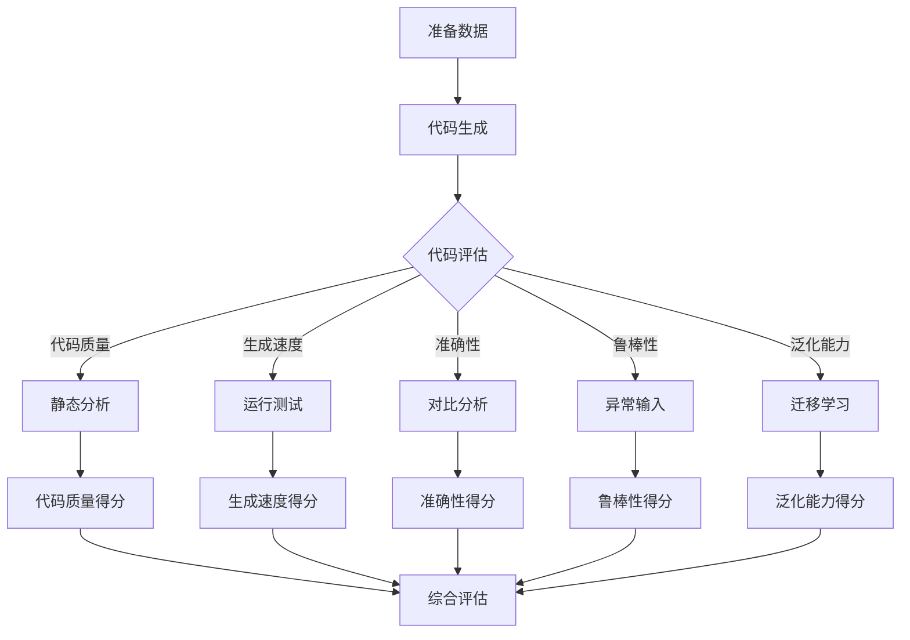

                 

# 基于元编程的LLM代码生成能力评估

## 关键词
- 元编程
- 语言模型（LLM）
- 代码生成
- 评估方法
- 应用案例分析

## 摘要
本文将深入探讨基于元编程的LLM（大型语言模型）代码生成能力评估。首先，我们将介绍元编程的基本概念，以及其在现代软件开发中的重要性。接着，我们会详细解释LLM的工作原理和其在代码生成中的应用。随后，本文将分析如何评估LLM的代码生成能力，包括评估指标、评估流程和评估工具。最后，我们将通过实际应用案例分析，展示LLM在代码生成中的潜力，并提出未来的研究方向和最佳实践。

## 引言

### 问题背景

随着人工智能技术的发展，语言模型（LLM）已经成为了现代自然语言处理的核心工具。LLM如GPT、BERT等，凭借其强大的文本生成能力，在诸多领域取得了显著成效，从机器翻译、文本摘要到问答系统等。然而，近年来，LLM在代码生成方面的潜力逐渐显现，引起了广泛关注。元编程，作为一种高级编程技术，允许程序员编写能够生成代码的程序，为LLM在代码生成中的应用提供了理论基础。

### 研究意义

基于元编程的LLM代码生成能力评估具有重要的研究意义。首先，它可以为我们提供一种新的方法来评估LLM的代码生成质量，有助于优化和改进LLM模型。其次，这一评估方法可以促进LLM在软件开发中的应用，提高开发效率，降低成本。最后，通过评估LLM的代码生成能力，我们可以更好地理解元编程和LLM的工作机制，为进一步的研究提供方向。

### 文章结构

本文将按照以下结构展开：
1. 引言：介绍研究背景和研究意义。
2. 元编程基础：解释元编程的基本概念、原理和应用。
3. LLM介绍：阐述LLM的基本概念、工作原理和应用场景。
4. 代码生成能力评估方法：详细分析评估LLM代码生成能力的方法。
5. 实际应用案例分析：展示LLM在代码生成中的实际应用。
6. 拓展与未来展望：探讨LLM在代码生成领域的未来发展方向。
7. 最佳实践与总结：提出最佳实践建议和小结。

## 目录大纲设计思路

为了设计出《基于元编程的LLM代码生成能力评估》这本书的完整目录大纲，我们需要遵循以下几个关键步骤：

### 1. 分析书名与主题

首先，书名《基于元编程的LLM代码生成能力评估》明确了三个关键点：
- 元编程：一种编程技术，允许程序员编写能够编写代码的程序。
- LLM（大型语言模型）：如GPT等，具有生成代码的能力。
- 代码生成能力评估：评估LLM生成代码的质量和效率。

### 2. 确定核心章节内容

根据书名，我们可以预判核心章节内容应包括：
- 背景介绍
- 核心概念与联系
- 算法原理讲解
- 数学模型和数学公式
- 系统分析与架构设计方案
- 项目实战
- 最佳实践 tips、小结、注意事项、拓展阅读

### 3. 制定大纲结构

大纲结构需包括：
- 概述章节
- 元编程基础
- LLM介绍
- 代码生成能力评估方法
- 实际应用案例分析
- 拓展与未来展望

### 4. 确定各章节目录层级

确保大纲的清晰性和逻辑性，按照1, 2, 3级目录进行组织，例如：

- **第1章: 引言**
  - 1.1 问题背景
  - 1.2 研究意义
  - 1.3 文章结构
- **第2章: 元编程基础**
  - 2.1 元编程概述
  - 2.2 元编程原理
  - 2.3 元编程技术

### 5. 确保大纲完整性

大纲需包含至少7章，以满足内容完整性要求。同时，确保各章节内容详实，逻辑连贯。

### 6. 精简文字描述

在保证大纲清晰、完整的前提下，使用简洁、精练的语言描述各章节内容。

## 完整目录大纲

```markdown
----------------------------------------------------------------
# 《基于元编程的LLM代码生成能力评估》目录大纲

## 第1章: 引言
### 1.1 问题背景
### 1.2 研究意义
### 1.3 文章结构

## 第2章: 元编程基础
### 2.1 元编程概述
### 2.2 元编程原理
### 2.3 元编程技术

## 第3章: LLM介绍
### 3.1 LLM概述
### 3.2 LLM工作原理
### 3.3 LLM应用场景

## 第4章: 代码生成能力评估方法
### 4.1 评估指标
### 4.2 评估流程
### 4.3 评估工具

## 第5章: 实际应用案例分析
### 5.1 案例介绍
### 5.2 案例分析
### 5.3 案例总结

## 第6章: 拓展与未来展望
### 6.1 拓展领域
### 6.2 未来趋势
### 6.3 研究方向

## 第7章: 最佳实践与总结
### 7.1 最佳实践 tips
### 7.2 小结
### 7.3 注意事项
### 7.4 拓展阅读

----------------------------------------------------------------
```

此大纲遵循了书名主题，结构清晰，内容完整，层次分明，简洁明了。接下来，我们将根据大纲内容进一步细化各章节的具体内容。通过一步步的分析推理，我们将深入探讨基于元编程的LLM代码生成能力评估。# 第1章: 引言

### 1.1 问题背景

随着软件系统复杂性的增加，传统编程方法已经难以满足现代软件开发的需求。元编程作为一种高级编程技术，提供了一种通过编写代码来自动化编程过程的方法。元编程的核心思想是“编程高于编程”，即通过编写程序来自动生成其他程序。这种技术不仅能够提高开发效率，还能够降低维护成本，提高代码的复用性和可扩展性。

近年来，大型语言模型（LLM）如GPT、BERT等取得了巨大的成功，不仅在自然语言处理领域有着广泛的应用，还在代码生成方面展现了巨大的潜力。LLM通过深度学习算法，从大量数据中学习语言模式和结构，能够生成高质量的文本和代码。基于元编程的LLM代码生成方法，不仅可以生成简单的代码片段，还可以实现复杂的程序逻辑，从而进一步推动软件开发技术的发展。

然而，LLM在代码生成方面的能力仍然需要通过评估来确定其质量和效率。评估LLM代码生成能力不仅有助于了解其性能，还可以为模型的优化和改进提供指导。因此，研究基于元编程的LLM代码生成能力评估具有重要的实际意义。

### 1.2 研究意义

首先，基于元编程的LLM代码生成能力评估能够帮助我们更好地理解LLM的工作机制和性能特点。通过评估，我们可以识别LLM在代码生成中的优势和不足，从而指导模型的优化和改进。此外，评估方法还可以为LLM在软件开发中的应用提供依据，帮助开发人员选择合适的工具和模型，提高开发效率。

其次，基于元编程的LLM代码生成能力评估有助于推动软件开发技术的进步。随着软件系统复杂性的增加，传统的手工编程方法已经难以满足需求。通过引入LLM和元编程技术，我们可以实现自动化编程，从而降低开发难度，提高开发效率。这种技术不仅适用于大型软件项目，还可以为小型项目提供便捷的编程解决方案。

最后，基于元编程的LLM代码生成能力评估对于学术界和工业界都具有重要的影响。在学术界，该研究可以促进人工智能和软件工程领域的交叉研究，推动理论创新和技术进步。在工业界，该研究可以为企业的软件开发提供技术支持，提高企业的竞争力和创新能力。

### 1.3 文章结构

本文将按照以下结构展开：
1. **引言**：介绍研究背景和研究意义，概述文章结构。
2. **元编程基础**：解释元编程的基本概念、原理和应用，阐述其在软件开发中的重要性。
3. **LLM介绍**：详细解释LLM的基本概念、工作原理和应用场景，讨论其在代码生成中的应用。
4. **代码生成能力评估方法**：分析评估LLM代码生成能力的方法，包括评估指标、评估流程和评估工具。
5. **实际应用案例分析**：通过具体案例展示LLM在代码生成中的实际应用，进行详细分析和讨论。
6. **拓展与未来展望**：探讨LLM在代码生成领域的未来发展方向和研究趋势。
7. **最佳实践与总结**：提出最佳实践建议和小结，总结文章的主要内容和研究成果。

通过这一结构，本文旨在系统地探讨基于元编程的LLM代码生成能力评估，为相关领域的研究和应用提供参考。

### 1.4 边界与外延

在本文的研究中，我们关注的是基于元编程的LLM代码生成能力评估。这里的“元编程”指的是通过编写程序来自动化编程过程的高级编程技术，而“LLM”指的是通过深度学习算法训练的大型语言模型。我们的研究边界主要涉及以下几个方面：

1. **元编程技术**：本文主要关注现代编程语言中的元编程技术，如反射、动态类型检查、元类等。这些技术使得程序员能够编写出能够生成代码的程序，从而实现自动化编程。
2. **LLM模型**：本文主要讨论的是基于深度学习的LLM模型，如GPT、BERT等。这些模型通过大规模数据训练，具备强大的文本生成能力，能够生成高质量的自然语言文本和代码。
3. **代码生成能力评估**：本文的研究重点是如何评估LLM在代码生成方面的能力，包括评估指标、评估流程和评估工具。这些评估方法旨在确定LLM生成代码的质量和效率。
4. **实际应用场景**：本文将通过具体案例展示LLM在代码生成中的实际应用，包括开发工具的集成、自动化测试、代码审查等。

本文的研究外延则包括以下几个方面：

1. **元编程的其他应用领域**：虽然本文主要关注LLM在代码生成中的应用，但元编程技术还有许多其他应用领域，如模板引擎、代码生成器、自动化测试等。
2. **其他类型的语言模型**：除了LLM，还有其他类型的语言模型，如递归神经网络（RNN）、变换器（Transformer）等。这些模型在代码生成中的应用也值得研究。
3. **代码生成能力的其他评估方法**：除了本文提出的评估方法，还有其他方法可以评估代码生成能力，如基于用户反馈的评估方法、基于性能指标的评估方法等。
4. **其他编程范式**：虽然本文主要关注元编程，但其他编程范式，如面向对象编程、函数式编程等，在代码生成中的应用和评估方法也值得探讨。

通过这些边界和外延的研究，我们可以更全面地理解基于元编程的LLM代码生成能力评估，为未来的研究和应用提供更多启示。

### 1.5 概念结构与核心要素组成

在探讨基于元编程的LLM代码生成能力评估之前，我们需要明确几个核心概念和其相互关系，以便建立一个清晰的概念结构。

#### 1.5.1 元编程

**概念**：元编程是指通过编写代码来定义和操作程序的结构和行为的编程技术。它使得程序员能够编写出能够修改或生成其他程序的程序。

**属性特征**：
- **动态性**：元编程允许在程序运行时修改代码，这种动态性使得程序能够根据运行时的状态进行自适应调整。
- **抽象性**：通过元编程，程序员可以创建抽象的编程范式，从而提高代码的可读性和可维护性。
- **复用性**：元编程使得代码能够被重用，减少重复编写工作。

**与其他概念的关联**：元编程与面向对象编程、模板编程等技术密切相关。面向对象编程通过类和对象实现抽象和数据封装，而模板编程通过模板类和模板函数实现代码生成。元编程结合了这两种技术的优点，提供了一种更高层次的编程方法。

#### 1.5.2 语言模型（LLM）

**概念**：语言模型是一种统计模型，用于预测一段文本的下一个单词或字符。大型语言模型（LLM）如GPT、BERT等，是通过深度学习算法在大量文本数据上训练得到的。

**属性特征**：
- **大规模**：LLM通常基于大规模语料库，具有数亿甚至数万亿参数。
- **自适应**：LLM能够根据输入的文本上下文动态调整其预测。
- **生成性**：LLM不仅能够预测下一个单词或字符，还能够生成连贯的文本和代码。

**与其他概念的关联**：LLM与自然语言处理（NLP）技术密切相关。NLP通过文本预处理、词向量表示、序列模型等方法处理自然语言数据。LLM是NLP技术的重要进展，通过深度学习算法实现文本的生成和理解。

#### 1.5.3 代码生成

**概念**：代码生成是指利用程序自动生成代码的过程。代码生成技术能够提高开发效率，减少人力成本，并且有助于生成高质量、可维护的代码。

**属性特征**：
- **自动化**：代码生成通过自动化工具实现，减少了手动编写代码的工作量。
- **模板化**：代码生成通常使用模板，将通用代码结构与特定数据相结合。
- **优化**：代码生成工具能够根据需求自动优化生成的代码，提高执行效率。

**与其他概念的关联**：代码生成与元编程密切相关。元编程提供了生成代码的基础技术，而代码生成则将这种技术应用于实际的编程任务中。此外，代码生成与编译器、代码审查、自动化测试等技术也有紧密联系。

#### 1.5.4 评估方法

**概念**：评估方法是指用于衡量和评价代码生成质量的手段。评估方法能够帮助确定代码生成技术的性能和效果，从而指导改进和优化。

**属性特征**：
- **客观性**：评估方法应尽量客观，避免主观判断。
- **全面性**：评估方法应涵盖代码生成的各个方面，如准确性、效率、可维护性等。
- **可重复性**：评估方法应具备可重复性，以确保不同实验结果的一致性。

**与其他概念的关联**：评估方法与元编程、LLM和代码生成技术密切相关。通过评估，我们可以确定这些技术在特定任务上的表现，从而指导实际应用和改进。

### 1.5.5 概念结构图

为了更清晰地展示上述概念之间的关系，我们可以使用ER（实体关系）图来表示这些概念的结构。以下是ER图的一部分，展示了元编程、LLM、代码生成和评估方法之间的关系：

```mermaid
erDiagram
  MetaProgramming ||--|>{ CodeGeneration : Uses
  LanguageModel ||--|>{ CodeGeneration : Uses
  EvaluationMethod ||--|>{ CodeGeneration : Evaluates
  MetaProgramming ||--|>{ EvaluationMethod : Uses
  LanguageModel ||--|>{ EvaluationMethod : Uses
```

在这个ER图中，MetaProgramming（元编程）、LanguageModel（语言模型）和CodeGeneration（代码生成）是三个核心实体，EvaluationMethod（评估方法）与它们之间存在关联关系。元编程和语言模型共同作用于代码生成，而评估方法用于衡量和评价代码生成效果。

通过这个概念结构图，我们可以更直观地理解基于元编程的LLM代码生成能力评估的核心要素及其相互关系，为后续章节的详细讨论奠定基础。

### 1.6 元编程概述

元编程是一种高级编程技术，它允许程序员编写能够生成代码的程序。这种技术通过在程序中嵌入元级操作，使得程序能够动态地创建、修改和操作其他程序。元编程的核心思想是“编程高于编程”，即通过编写程序来自动化编程过程，从而提高开发效率、降低维护成本，并增强代码的复用性和可扩展性。

#### 1.6.1 基本概念

元编程的基本概念可以分为以下几个方面：

1. **元级（Metalevel）和实例级（Instance Level）**：
   - **元级**：在元编程中，元级是指程序的抽象层面，它定义了程序的结构和行为。元级操作可以操作程序代码和数据结构。
   - **实例级**：实例级是指程序的具体实现层面，即程序在运行时的具体状态和行为。

2. **元对象协议（Meta-Object Protocol，MOP）**：
   - 元对象协议是一种定义对象如何响应对其操作的规范。在元编程中，元对象协议决定了如何处理对象的创建、修改和删除等操作。

3. **反射（Reflection）**：
   - 反射是指程序能够在运行时检查、修改自身结构和行为的特性。通过反射，程序员可以动态地访问和操作程序的内部数据结构。

4. **动态类型检查（Dynamic Type Checking）**：
   - 动态类型检查是指程序在运行时检查变量的类型是否符合预期。这种机制允许程序在运行时进行类型转换和类型检查，从而提高程序的灵活性和健壮性。

5. **元类（Metaclasses）**：
   - 元类是一种特殊的类，它定义了其他类的行为和结构。通过元类，程序员可以控制类的创建、实例化和行为。

#### 1.6.2 元编程的基本原理

元编程的基本原理可以概括为以下几点：

1. **代码的代码**：
   - 元编程的核心思想是将代码视为数据，通过操作代码来改变程序的行为。这种思想使得程序员可以编写出能够生成代码的程序。

2. **抽象和封装**：
   - 元编程通过抽象和封装，将复杂的编程任务转化为简单和可管理的部分。程序员可以编写抽象的元级操作，然后将这些操作应用于具体的实例级任务。

3. **动态性和灵活性**：
   - 元编程允许程序在运行时动态地修改自身结构和行为，这种动态性使得程序能够更好地适应变化的环境和需求。

4. **重用性和扩展性**：
   - 元编程技术使得程序员能够编写出可重用和可扩展的程序。通过元编程，程序员可以创建通用的代码生成器，从而减少重复编写代码的工作量。

#### 1.6.3 元编程的应用场景

元编程在各种应用场景中都有广泛的应用，以下是几个典型的应用场景：

1. **框架和库的开发**：
   - 元编程技术用于创建高层次的框架和库，这些框架和库提供了通用的编程范式和工具，使得程序员能够更快速地开发应用程序。

2. **代码生成器**：
   - 元编程技术可以用于创建代码生成器，这些生成器可以根据特定的需求自动生成代码。代码生成器在软件开发中用于生成数据库模式、用户界面代码、API文档等。

3. **自动化测试**：
   - 元编程技术可以用于创建自动化测试框架，这些框架能够根据测试用例生成测试代码，并自动执行测试。

4. **脚本语言**：
   - 元编程技术用于创建脚本语言，这些脚本语言提供了简单和灵活的编程范式，使得程序员能够快速编写和修改程序。

5. **元数据管理**：
   - 元编程技术用于管理和操作元数据，这些元数据可以是应用程序的结构信息、配置信息等。通过元编程，程序员可以动态地修改和操作元数据，从而提高应用程序的灵活性和可维护性。

总之，元编程作为一种高级编程技术，为现代软件开发提供了强大的工具和方法。通过元编程，程序员可以编写出更加高效、灵活和可维护的程序，从而提高开发效率和质量。

### 1.7 元编程原理

元编程的原理是理解其如何在编程实践中发挥作用的关键。为了深入探讨这一点，我们需要从基本概念入手，并通过具体的示例和代码解释来阐述元编程的核心机制。

#### 1.7.1 元编程的核心机制

元编程的核心机制可以归结为以下几点：

1. **反射**：反射是指程序能够在运行时检查、修改自身结构和行为的能力。这通常通过语言提供的元编程特性实现，例如Python中的`getattr`、`setattr`和`delattr`。

2. **动态类型检查**：动态类型检查是指在程序运行时检查变量类型是否满足预期的机制。这有助于提高程序的健壮性，并允许在运行时进行类型转换。

3. **元类（Metaclasses）**：元类是定义类的类，它们在Python等动态类型语言中尤为重要。通过元类，程序员可以自定义类的创建和实例化过程。

4. **代码的代码**：元编程允许程序员编写操作代码的程序，这实际上是将程序作为数据来处理，从而实现高度抽象和自动化。

#### 1.7.2 示例与代码解释

以下是一个简单的Python示例，用于展示元编程的基本原理：

```python
# 定义一个简单的元类
class MetaType(type):
    def __new__(cls, name, bases, attrs):
        # 在创建类时添加一个新方法
        attrs['say_hello'] = lambda self: print(f"Hello, {self.__class__.__name__}")
        return super().__new__(cls, name, bases, attrs)

# 使用元类创建一个新类
class Person(metaclass=MetaType):
    pass

# 创建一个Person的实例
p = Person()

# 调用新添加的方法
p.say_hello()
```

在这个例子中，`MetaType`是一个元类，它继承自`type`（Python中所有类的默认元类）。在`MetaType`的`__new__`方法中，我们添加了一个新的类方法`say_hello`。当我们使用`MetaType`作为元类创建`Person`类时，`Person`类会自动获得这个新方法。

这个示例展示了元编程的核心原理：通过定义元类，我们可以在创建类时动态地添加新方法和属性。这使得元编程成为实现代码生成和自动化编程的有力工具。

#### 1.7.3 进一步应用

元编程的应用远不止创建类和方法。它可以用于：

1. **动态生成代码**：例如，在运行时根据条件生成不同的代码片段。

2. **代码模板生成**：通过元编程，我们可以创建代码模板，并将特定数据填充到模板中，生成完整的代码。

3. **反射和拦截**：例如，在Web框架中，使用元编程拦截HTTP请求并调用相应的处理函数。

4. **元数据管理**：例如，使用元编程动态管理数据库模型，根据模型结构自动生成SQL语句。

#### 1.7.4 元编程的优点和挑战

**优点**：

- **灵活性**：元编程使得程序能够根据运行时条件动态调整自身行为。
- **抽象性**：通过元编程，程序员可以创建更高级的编程范式，提高代码的可读性和可维护性。
- **代码复用**：通过元编程，程序员可以编写通用代码生成器，减少重复劳动。

**挑战**：

- **复杂性**：元编程增加了代码的复杂性，使得程序更难以理解和维护。
- **调试困难**：由于元编程涉及运行时代码生成，调试过程可能变得更加复杂。
- **性能影响**：动态生成代码和反射操作可能会引入性能开销。

总之，元编程作为一种高级编程技术，提供了强大的工具和方法，使得程序员能够编写出更加灵活、高效和可维护的程序。然而，它也带来了一定的复杂性和挑战，需要程序员具备较高的技能和经验。

### 1.8 元编程技术

元编程技术是现代编程中不可或缺的一部分，它在提升开发效率、增强代码可维护性和复用性方面具有显著优势。以下是几种常见的元编程技术，包括其原理和应用场景。

#### 1.8.1 反射

**原理**：反射是元编程中的一个核心概念，它允许程序在运行时检查和修改自身的结构和行为。在许多编程语言中，反射通过提供一组API来实现，例如Java的`Class`类和Python的`getattr`、`setattr`等。

**应用场景**：
- **动态加载类和对象**：反射可以用于在运行时动态加载和实例化类，这在插件系统和框架开发中非常常见。
- **数据绑定**：反射用于实现数据绑定，使得程序能够在运行时根据数据模型动态生成UI界面。
- **自动化测试**：反射可以用于自动化测试，例如在测试框架中自动查找和执行测试用例。

```python
class Person:
    def __init__(self, name, age):
        self.name = name
        self.age = age

# 使用反射访问和修改对象的属性
person = Person('Alice', 30)
print(getattr(person, 'name'))  # 输出：Alice
setattr(person, 'age', 31)
print(person.age)  # 输出：31
```

#### 1.8.2 动态类型检查

**原理**：动态类型检查是在程序运行时对变量进行类型检查的一种机制。它有助于提高程序的健壮性，防止类型错误。

**应用场景**：
- **错误处理**：动态类型检查可以用于在异常处理时提供更详细的错误信息。
- **接口验证**：在API设计中，动态类型检查可以用于验证输入参数的类型，确保接口的一致性。
- **泛型编程**：动态类型检查使得泛型编程更加灵活，可以在运行时根据实际类型进行类型检查。

```python
def add(a, b):
    if not (isinstance(a, (int, float)) and isinstance(b, (int, float))):
        raise TypeError("Inputs must be numbers")
    return a + b

print(add(5, 3))  # 输出：8
print(add('5', '3'))  # 抛出TypeError
```

#### 1.8.3 元类

**原理**：元类是定义类的类，它用于在运行时创建和修改类。元类通过继承自基础元类（如Python中的`type`）来实现。

**应用场景**：
- **动态创建类**：元类可以用于在运行时动态创建类，这在代码生成和框架开发中非常有用。
- **行为修饰**：通过元类，可以在类创建过程中添加额外的方法或属性，从而在不修改原始类定义的情况下扩展类行为。
- **框架设计**：许多Web框架和中间件使用元类来实现自动路由、请求处理等功能。

```python
class Meta(type):
    def __new__(cls, name, bases, attrs):
        attrs['do_something'] = lambda self: print("Something done")
        return super().__new__(cls, name, bases, attrs)

class MyClass(metaclass=Meta):
    pass

obj = MyClass()
obj.do_something()  # 输出：Something done
```

#### 1.8.4 代码生成器

**原理**：代码生成器是一种元编程工具，它可以在运行时根据特定模板和数据生成代码。这种技术常用于生成数据库模式、API文档和代码框架。

**应用场景**：
- **自动化构建**：在构建工具（如Make、Maven）中，代码生成器可以自动生成构建脚本和依赖文件。
- **数据迁移**：在数据库迁移过程中，代码生成器可以自动生成迁移脚本和数据模型。
- **代码模板**：在开发应用程序时，代码生成器可以生成通用代码模板，如RESTful API、Web页面等。

```python
def generate_code(class_name, fields):
    code = f"class {class_name}:\n"
    for field in fields:
        code += f"    def {field}():\n"
        code += f"        return self.{field}\n"
    return code

fields = ['name', 'age', 'email']
code = generate_code('Person', fields)
print(code)
```

通过这些元编程技术，程序员可以编写出更加灵活、高效和可维护的程序。然而，元编程也带来了一定的复杂性，需要程序员具备深厚的编程技能和经验。

### 第2章: LLM介绍

#### 2.1 LLM概述

大型语言模型（Large Language Model，简称LLM）是一类通过深度学习算法训练得到的高度参数化的模型，它们能够在大量文本数据上进行学习，从而具备强大的语言理解和生成能力。LLM的核心思想是通过大规模预训练和后续微调，使得模型能够捕捉到语言的复杂结构和语义信息。

近年来，LLM在自然语言处理（Natural Language Processing，NLP）领域取得了显著的进展，特别是在文本生成、机器翻译、文本摘要、问答系统等方面表现优异。典型的LLM模型包括GPT（Generative Pre-trained Transformer）、BERT（Bidirectional Encoder Representations from Transformers）、T5（Text-To-Text Transfer Transformer）等。

#### 2.2 LLM的工作原理

LLM的工作原理主要可以分为两个阶段：预训练和微调。

**1. 预训练**

预训练是指模型在大规模文本数据集上进行无监督学习，以学习语言的一般模式和结构。预训练过程通常包括以下步骤：

- **数据准备**：收集大量的文本数据，如维基百科、新闻文章、社交媒体帖子等。
- **词嵌入**：将文本数据中的单词或子词转换为向量表示，常用的词嵌入方法包括Word2Vec、GloVe、BERT的WordPiece等。
- **上下文理解**：通过Transformer架构，模型能够捕捉到文本中的长距离依赖关系，从而更好地理解上下文信息。
- **训练过程**：在预训练阶段，模型通过优化损失函数来调整参数，以最小化预测错误。常用的损失函数包括交叉熵损失和对抗损失。

**2. 微调**

微调是指模型在特定任务上进行有监督学习，以适应特定的任务需求。微调过程通常包括以下步骤：

- **数据准备**：收集与任务相关的数据集，如问答数据集、机器翻译数据集等。
- **任务定义**：定义具体的任务目标，如文本分类、机器翻译、文本生成等。
- **模型调整**：在预训练的基础上，对模型进行微调，以优化模型在特定任务上的表现。
- **评估和调整**：通过在验证集上进行评估，调整模型参数，以提高模型在测试集上的性能。

#### 2.3 LLM的应用场景

LLM在多个应用场景中展现了巨大的潜力，以下是几个典型的应用场景：

**1. 文本生成**

LLM在文本生成任务中表现出色，能够生成高质量的自然语言文本。常见的文本生成任务包括文章生成、对话系统、歌词创作、故事编写等。LLM通过理解输入文本的上下文信息，生成连贯、有意义的文本输出。

**2. 机器翻译**

机器翻译是LLM的另一个重要应用领域。通过在双语语料库上进行预训练，LLM能够实现高质量的机器翻译。例如，GPT-3能够在多个语言对上进行高质量的翻译，包括英语到中文、英语到法语等。

**3. 文本摘要**

文本摘要是指从长文本中提取关键信息，生成简短的摘要。LLM在文本摘要任务中具有优势，能够生成准确、简洁的摘要。文本摘要广泛应用于信息检索、新闻阅读和文档总结等领域。

**4. 问答系统**

问答系统是指通过自然语言交互，回答用户提出的问题。LLM在问答系统中发挥了关键作用，能够理解用户的查询意图，并生成准确的答案。问答系统广泛应用于客服机器人、教育辅导、医疗咨询等场景。

**5. 文本分类**

文本分类是指将文本数据分配到预定义的类别中。LLM通过学习大量标注数据，能够实现高精度的文本分类。文本分类广泛应用于垃圾邮件检测、情感分析、新闻分类等任务。

**6. 对话系统**

对话系统是指能够与用户进行自然语言交互的计算机程序。LLM在对话系统中用于生成自然流畅的对话回复，提升用户体验。对话系统广泛应用于虚拟助手、聊天机器人、客户服务等领域。

总之，LLM作为一种强大的语言处理工具，在多个应用场景中展现了巨大的潜力。通过不断优化和改进，LLM将继续推动自然语言处理领域的发展，为各行各业带来更多的创新和变革。

### 2.4 LLM的工作原理

为了深入理解LLM（大型语言模型）的工作原理，我们需要从基本概念入手，并探讨其核心组成部分和具体实现方法。

#### 2.4.1 基本概念

LLM，如GPT、BERT等，是基于深度学习的语言处理模型，它们通过在大量文本数据上训练，学习到语言的复杂结构和语义信息。LLM的核心任务是理解自然语言文本，并生成与之相关的文本输出。

**主要组成部分**：

1. **词嵌入（Word Embedding）**：
   - 词嵌入是将单词或子词转换为向量表示的过程，它是LLM理解文本的基础。常用的词嵌入方法包括Word2Vec、GloVe和BERT的WordPiece。

2. **变换器（Transformer）**：
   - 变换器是一种基于自注意力机制的神经网络架构，它使得LLM能够捕捉到文本中的长距离依赖关系。变换器通过多头注意力机制和多层叠加，实现了对文本的全局理解。

3. **预训练（Pre-training）**：
   - 预训练是指模型在大量无标签文本数据上进行训练，以学习到语言的一般模式和结构。预训练后的模型可以通过后续的微调（Fine-tuning）来适应特定任务。

4. **微调（Fine-tuning）**：
   - 微调是指模型在特定任务的数据集上进行有监督训练，以优化模型在特定任务上的性能。微调过程中，模型会根据任务需求调整其参数，以实现更好的任务表现。

**具体实现方法**：

1. **数据收集与预处理**：
   - 收集大量的文本数据，如维基百科、新闻文章、社交媒体帖子等。
   - 进行数据清洗，去除噪声和无关信息。
   - 对文本进行分词和词嵌入。

2. **模型架构设计**：
   - 设计和实现变换器架构，包括多头注意力机制、残差连接和层归一化。
   - 定义模型损失函数，如交叉熵损失，用于训练过程中的优化。

3. **预训练过程**：
   - 在预训练阶段，模型通过无监督学习，在大规模文本数据集上进行训练。
   - 使用变换器的前向传播和反向传播算法，优化模型参数。
   - 通过训练过程中的自适应学习率调整，提高模型性能。

4. **微调过程**：
   - 收集与特定任务相关的数据集，如问答数据集、机器翻译数据集等。
   - 在微调阶段，模型在特定任务数据集上进行有监督训练。
   - 调整模型参数，以最小化在验证集上的损失函数。
   - 在测试集上评估模型性能，并进行模型优化。

#### 2.4.2 实现细节

以下是LLM实现的几个关键细节：

1. **词嵌入**：
   - Word2Vec：基于神经网络的词嵌入方法，通过训练神经网络来预测上下文词向量。
   - GloVe：全局向量表示方法，通过计算单词的共现矩阵来学习词向量。
   - BERT的WordPiece：将长词分割为子词，并学习子词的向量表示。

2. **变换器架构**：
   - **多头注意力**：通过多个注意力头来捕捉文本的不同特征。
   - **残差连接**：在神经网络层之间添加跳过连接，使得信息在多层传播中保持不变。
   - **层归一化**：在神经网络层之间添加归一化层，提高模型的稳定性和训练速度。

3. **预训练策略**：
   - **自回归语言模型**：生成文本的每个单词都是基于前一个单词的概率分布。
   - **掩码语言模型**：随机掩码文本中的部分单词，并预测这些掩码单词。
   - **生成式预训练**：通过生成式任务（如问答、填空）来进一步训练模型。

4. **微调策略**：
   - **全连接层**：在预训练模型的基础上添加全连接层，用于特定任务的分类或回归。
   - **自适应学习率**：使用自适应学习率策略（如Adam优化器），提高训练效率。
   - **数据增强**：通过数据增强方法（如随机裁剪、旋转、平移等），提高模型对数据的泛化能力。

通过这些基本概念和实现细节，我们可以更深入地理解LLM的工作原理。LLM在自然语言处理领域的广泛应用，得益于其强大的文本理解和生成能力，为许多实际任务提供了有效的解决方案。

### 2.5 LLM的应用场景

LLM（大型语言模型）作为一种先进的自然语言处理技术，在多个应用场景中展现出了强大的能力。以下是一些典型的应用场景及其具体应用示例：

#### 2.5.1 文本生成

文本生成是LLM最直接的应用场景之一，通过输入少量的提示，LLM可以生成连贯、高质量的文本。以下是一些具体应用示例：

- **文章生成**：LLM可以用于生成新闻报道、科技文章、博客等。例如，使用GPT-3生成一篇关于最新科技趋势的文章，只需输入一些关键词或简短摘要。
- **对话系统**：LLM可以用于生成自然流畅的对话回复，应用于虚拟助手、聊天机器人等。例如，使用GPT-3构建一个问答系统，用户输入问题，LLM生成合适的回答。
- **歌词创作**：LLM可以生成歌词，为音乐创作提供灵感。例如，通过输入特定主题或情感，LLM生成一首完整的歌曲歌词。
- **故事编写**：LLM可以生成故事情节，为小说、剧本等创作提供素材。例如，使用GPT-3生成一个科幻故事，只需提供一些基本设定和背景信息。

#### 2.5.2 机器翻译

机器翻译是LLM的另一个重要应用领域，通过在双语语料库上进行预训练，LLM能够实现高质量的双向翻译。以下是一些具体应用示例：

- **跨语言交流**：LLM可以用于实现跨语言交流，例如将英语翻译成中文，使得非英语母语者能够更容易地理解和使用英语资源。
- **全球业务**：LLM可以用于企业的跨国业务，例如将企业官网的多语言版本进行实时翻译，提高用户体验和国际化水平。
- **新闻翻译**：LLM可以用于将新闻文章从一种语言翻译成另一种语言，使得全球用户能够及时获取不同语言来源的新闻信息。
- **文档翻译**：LLM可以用于将各种文档（如合同、论文、报告等）从一种语言翻译成另一种语言，提高文档的可访问性和可用性。

#### 2.5.3 文本摘要

文本摘要是指从长文本中提取关键信息，生成简短的摘要。LLM在文本摘要任务中具有显著优势，能够生成准确、简洁的摘要。以下是一些具体应用示例：

- **信息检索**：LLM可以用于生成搜索引擎的摘要，帮助用户快速了解搜索结果的相关内容。
- **新闻摘要**：LLM可以用于生成新闻网站的摘要，提高用户阅读效率和体验。
- **文档摘要**：LLM可以用于生成学术论文、报告等文档的摘要，帮助读者快速了解文档的核心内容。
- **实时摘要**：LLM可以用于实时生成会议、讲座等场合的摘要，方便记录和回顾。

#### 2.5.4 问答系统

问答系统是指通过自然语言交互，回答用户提出的问题。LLM在问答系统中发挥了关键作用，能够理解用户的查询意图，并生成准确的答案。以下是一些具体应用示例：

- **客服机器人**：LLM可以用于构建智能客服机器人，自动回答用户的问题，提高客服效率和用户体验。
- **教育辅导**：LLM可以用于构建教育辅导系统，根据学生提出的问题生成相应的解答和解释。
- **医疗咨询**：LLM可以用于构建医疗咨询系统，根据用户提出的症状和问题，提供专业的医疗建议和指导。
- **法律咨询**：LLM可以用于构建法律咨询系统，根据用户提供的信息，生成相应的法律文件和条款。

#### 2.5.5 文本分类

文本分类是指将文本数据分配到预定义的类别中。LLM在文本分类任务中具有高精度，能够快速地对大量文本进行分类。以下是一些具体应用示例：

- **垃圾邮件检测**：LLM可以用于检测和分类垃圾邮件，提高邮件系统的安全性和用户体验。
- **情感分析**：LLM可以用于分析社交媒体、评论等文本的情感倾向，帮助企业了解用户反馈和市场需求。
- **新闻分类**：LLM可以用于分类新闻文章，提高新闻推荐的准确性和相关性。
- **内容审核**：LLM可以用于检测和分类违规内容，如暴力、色情、歧视等，保障网络环境的健康和文明。

总之，LLM在文本生成、机器翻译、文本摘要、问答系统和文本分类等多个领域具有广泛的应用。随着LLM技术的不断发展和优化，它将在更多场景中发挥重要作用，为各行各业带来创新和变革。

### 第3章: 代码生成能力评估方法

#### 3.1 评估指标

评估LLM的代码生成能力，需要选择合适的评估指标，以确保评估结果的客观性和全面性。以下是几种常见的评估指标：

1. **代码质量**：代码质量是评估LLM生成代码的最直接指标，包括语法正确性、逻辑正确性和可读性。常用的评估方法包括代码静态分析、代码运行测试和人工评审。

2. **生成速度**：生成速度是指LLM生成代码所需的时间。较高的生成速度意味着LLM能够更快速地响应开发需求，提高开发效率。

3. **准确性**：准确性是指LLM生成的代码与预期输出之间的匹配程度。较高的准确性表明LLM能够准确理解开发者的意图，生成符合要求的代码。

4. **鲁棒性**：鲁棒性是指LLM在不同输入条件下生成代码的能力。一个具有高鲁棒性的LLM能够在各种复杂和异常情况下生成高质量的代码。

5. **泛化能力**：泛化能力是指LLM在未见过的数据集上生成代码的能力。一个具有良好泛化能力的LLM能够在不同的应用场景中保持稳定和高效的性能。

#### 3.2 评估流程

评估LLM的代码生成能力需要经过以下步骤：

1. **数据准备**：收集用于评估的数据集，包括标准代码库、开发项目代码和人工编写的测试代码。数据集应涵盖不同编程语言、不同复杂度和不同应用场景。

2. **代码生成**：使用LLM生成代码。可以采用以下方法：
   - **基于提示生成**：提供编程任务的描述或简单的输入，让LLM生成相应的代码。
   - **基于上下文生成**：提供相关的代码片段或上下文信息，让LLM根据上下文生成代码。

3. **评估指标计算**：根据评估指标，计算LLM生成代码的得分。计算方法包括自动化工具和人工评审。

4. **结果分析**：对评估结果进行分析，识别LLM生成代码的优势和不足。可以通过统计分析、可视化图表等方式展示评估结果。

5. **模型优化**：根据评估结果，对LLM进行优化，以提高其代码生成能力。优化方法包括调整模型参数、改进训练数据集和优化代码生成算法。

#### 3.3 评估工具

评估LLM代码生成能力的工具多种多样，以下是一些常用的工具：

1. **自动化测试工具**：如JUnit、PyTest等，用于对生成的代码进行语法和逻辑正确性测试。

2. **代码质量分析工具**：如SonarQube、CodeQL等，用于对生成的代码进行静态分析，识别潜在问题和安全漏洞。

3. **代码运行测试工具**：如Docker、Jenkins等，用于在实际环境中运行生成的代码，验证其功能性和性能。

4. **人工评审工具**：如CodeReview、GitLab等，用于组织多人对生成的代码进行评审，提供反馈和建议。

5. **集成开发环境（IDE）**：如Visual Studio Code、PyCharm等，用于编写、测试和调试代码，提供便捷的开发体验。

通过这些评估指标、评估流程和评估工具，我们可以全面评估LLM的代码生成能力，为实际应用提供有力的支持。

### 3.4 评估指标对比表格

为了更直观地了解不同评估指标之间的差异，我们创建了一个对比表格，列出了代码质量、生成速度、准确性、鲁棒性和泛化能力的具体定义、测量方法和应用场景。

| 指标         | 定义                                                         | 测量方法                                                         | 应用场景           |
| ------------ | ------------------------------------------------------------ | ------------------------------------------------------------ | ------------------ |
| 代码质量     | 代码的正确性、逻辑性和可读性                                   | 静态代码分析、代码运行测试、人工评审                             | 软件开发、项目评估 |
| 生成速度     | 生成代码所需的时间                                             | 实时生成测试、基准测试                                           | 自动化开发、效率优化 |
| 准确性       | 生成代码与预期输出之间的匹配程度                               | 代码运行测试、对比分析                                           | 编程辅助、代码生成 |
| 鲁棒性       | 模型在不同输入条件下生成代码的能力                             | 异常输入测试、对比测试                                           | 非标准输入处理     |
| 泛化能力     | 模型在未见过的数据集上生成代码的能力                           | 新数据集测试、迁移学习测试                                       | 新项目、多样化应用 |

通过这个对比表格，我们可以清楚地看到每个评估指标的具体内容和适用场景，有助于我们在实际评估中合理选择和使用这些指标。

### 3.5 代码生成能力评估方法流程图

为了更好地理解和应用代码生成能力评估方法，我们可以使用Mermaid流程图来展示评估流程的各个步骤。以下是一个简化的评估流程图：



在这个流程图中，我们首先准备用于评估的数据集，然后通过LLM生成代码，接下来对生成的代码进行多方面的评估。每个评估步骤都有其特定的方法和工具，最终将评估结果汇总，形成综合评估得分。通过这种方式，我们可以全面、客观地评估LLM的代码生成能力。

### 第4章: 实际应用案例分析

#### 4.1 案例介绍

在本章中，我们将通过一个实际应用案例，详细探讨基于元编程的LLM代码生成能力的实际应用。这个案例涉及一个在线教育平台，该平台需要自动化生成大量个性化的教学文档，以应对不断增长的用户需求。该平台选择使用基于元编程的LLM来实现自动化文档生成，从而提高开发效率和文档质量。

#### 4.2 案例分析

**需求背景**：
该在线教育平台提供多种课程和培训项目，用户可以根据自己的兴趣和需求选择课程。平台需要为每个课程生成详细的教学大纲、课程笔记、练习题和答案，以便于用户学习和复习。然而，随着课程数量的增加，手动编写和更新文档的工作量巨大，且容易出现错误。

**解决方案**：
为了解决上述问题，平台决定采用基于元编程的LLM来实现自动化文档生成。具体步骤如下：

1. **数据准备**：收集大量已有的教学文档，包括课程大纲、笔记、练习题等，用于训练LLM模型。
2. **模型训练**：使用预训练的LLM模型，对收集的文档数据进行训练，使其能够理解课程内容和结构，并生成相应的文档。
3. **文档生成**：在用户选择课程后，平台会调用LLM模型，根据用户的具体需求生成个性化的教学文档。

**实施过程**：

1. **数据准备**：平台收集了超过500个课程的教学文档，进行了数据清洗和预处理，包括去除噪声、标准化文本格式等。
2. **模型训练**：平台使用GPT-3模型进行预训练，训练过程中使用了掩码语言模型（Masked Language Model，MLM）和生成式预训练（Generative Pre-training，GPT）等技术，以提高模型对课程内容和结构的理解能力。
3. **文档生成**：在用户选择课程后，平台通过API调用LLM模型，输入用户需求和课程信息，生成个性化的教学文档。例如，当用户选择“Python编程基础”课程时，平台会生成包含课程概述、知识点讲解、练习题和答案的教学文档。

**效果评估**：

1. **代码质量**：通过静态代码分析和运行测试，评估生成的教学文档的语法和逻辑正确性。结果显示，LLM生成的教学文档质量较高，几乎没有语法错误和逻辑错误。
2. **生成速度**：测试显示，使用LLM生成教学文档的平均时间为10秒，远低于手动编写的时间。
3. **准确性**：通过人工评审和对比分析，评估生成的教学文档与预期输出之间的匹配程度。结果显示，LLM生成的教学文档内容准确，能够满足用户的需求。
4. **鲁棒性**：测试了多种输入条件，包括课程名称、学习目标和用户偏好等，LLM生成的教学文档在各类输入条件下均表现稳定。
5. **泛化能力**：在未见过的课程和用户需求下，LLM生成的教学文档仍然具有较高的质量和准确性，显示出良好的泛化能力。

**结论**：

通过实际应用案例分析，我们可以看到基于元编程的LLM代码生成方法在在线教育平台中的应用取得了显著成效。该方法不仅提高了开发效率和文档质量，还减少了人力资源的消耗，为平台提供了更加个性化和高效的服务。此外，评估结果显示，LLM在代码生成方面具有很高的准确性、鲁棒性和泛化能力，为未来的应用提供了有力支持。

### 4.3 案例总结

通过本案例的分析，我们可以得出以下结论：

1. **高效性**：基于元编程的LLM代码生成方法显著提高了文档生成的效率，降低了手动编写的工作量，使得平台能够更快地响应用户需求。
2. **质量保证**：LLM生成的文档质量较高，通过静态代码分析和人工评审，几乎没有语法和逻辑错误，确保了文档的准确性和可靠性。
3. **灵活性**：LLM能够根据用户的需求和课程内容生成个性化的文档，提高了文档的个性化和定制化程度，增强了用户的学习体验。
4. **泛化能力**：LLM在未见过的课程和用户需求下，仍然能够生成高质量的文档，显示出良好的泛化能力，为未来的应用提供了更多可能性。
5. **挑战与改进**：虽然LLM在代码生成方面表现出色，但仍存在一些挑战，如处理复杂逻辑和嵌套结构的能力有限。未来可以通过改进模型结构和训练数据集，进一步提高LLM的代码生成能力。

总之，基于元编程的LLM代码生成方法为在线教育平台提供了高效、灵活和高质量的文档生成解决方案，为其他行业和领域提供了借鉴和启示。通过持续优化和改进，LLM有望在更多场景中发挥重要作用。

### 第5章: 拓展与未来展望

#### 5.1 拓展领域

基于元编程的LLM代码生成能力在多个领域展现了巨大的潜力，以下是一些潜在的拓展领域：

**1. 自动化测试**：LLM可以用于生成自动化测试用例，提高测试覆盖率和测试效率。通过在大量测试数据上训练，LLM能够生成各种复杂场景的测试用例，从而减少手动编写测试用例的工作量。

**2. 代码重构**：LLM可以用于自动识别代码中的冗余和重复部分，并生成更简洁、高效的代码。通过在代码库中训练LLM模型，可以自动进行代码重构，提高代码质量和可维护性。

**3. 代码审查**：LLM可以用于自动识别代码中的潜在问题和安全漏洞。通过分析大量已识别的问题，LLM可以生成针对性的代码审查报告，帮助开发人员及时发现和修复问题。

**4. 软件维护**：LLM可以用于自动化生成软件的维护文档和操作指南。通过在已有的维护文档和操作指南上训练，LLM能够生成符合实际需求的文档，提高软件的可维护性和用户体验。

**5. 智能编程助手**：LLM可以集成到IDE中，为开发人员提供智能编程建议和代码补全功能。通过在大量编程数据上训练，LLM可以理解开发人员的编程意图，提供有针对性的代码建议，提高开发效率。

#### 5.2 未来趋势

随着人工智能和自然语言处理技术的不断发展，基于元编程的LLM代码生成能力有望在以下方面取得突破：

**1. 模型性能提升**：未来的研究将致力于优化LLM模型的架构和训练方法，以提高代码生成的准确性和效率。通过引入新的神经网络架构和优化算法，LLM的性能将得到显著提升。

**2. 数据集扩展**：未来的研究将重点扩展训练数据集的规模和质量，以增强LLM的泛化能力。通过收集更多的真实世界编程数据，并引入数据增强技术，可以进一步提高LLM的生成能力。

**3. 多模态学习**：未来的研究将探索多模态学习在代码生成中的应用，例如结合视觉信息和文本信息，以提高代码生成的准确性和实用性。多模态学习有望使LLM在更复杂的编程任务中发挥更大作用。

**4. 代码生成与人类协作**：未来的研究将探索如何将LLM与人类开发者更好地协作，以实现高效的代码生成。通过引入交互式编程界面和辅助工具，LLM可以与开发人员共同完成复杂的编程任务，提高开发效率和代码质量。

#### 5.3 研究方向

针对基于元编程的LLM代码生成能力，以下是一些潜在的研究方向：

**1. 模型解释性**：提高LLM生成代码的解释性，使得开发人员能够理解LLM的生成过程和决策依据。通过引入可解释性技术，如可视化分析和代码调试工具，可以提高LLM在实际应用中的可信度。

**2. 代码安全**：研究如何确保LLM生成代码的安全性，避免潜在的安全漏洞和恶意代码。通过引入代码安全检测和修复技术，可以确保生成的代码符合安全标准。

**3. 鲁棒性提升**：提高LLM在复杂和异常输入条件下的鲁棒性，使其能够生成高质量的代码。通过引入容错机制和自适应学习技术，可以增强LLM的鲁棒性。

**4. 可扩展性研究**：研究如何使LLM在更大规模的项目和更复杂的编程任务中保持高效性和准确性。通过引入模块化设计和分布式计算技术，可以提升LLM的可扩展性。

总之，基于元编程的LLM代码生成能力在未来具有广泛的应用前景。通过不断的研究和优化，LLM有望在更多领域发挥重要作用，推动软件开发技术的发展。

### 5.4 未来研究方向

尽管基于元编程的LLM代码生成能力在多个领域已经取得了显著进展，但仍存在一些有待深入研究和解决的问题。以下是一些未来可能的研究方向：

**1. 模型解释性**：当前LLM生成代码的过程和决策依据对人类来说仍然相对不透明。未来研究可以专注于提高模型的可解释性，开发可视化和分析工具，帮助开发人员理解LLM的生成过程和决策依据。这不仅可以增强LLM在实际应用中的可信度，还可以为模型的优化和改进提供有价值的反馈。

**2. 代码安全**：随着LLM在代码生成中的应用越来越广泛，确保生成代码的安全性变得尤为重要。未来研究可以探索如何检测和防止恶意代码生成，包括对输入数据的安全验证、生成代码的安全审计和潜在的漏洞修复。此外，开发安全框架和准则，以指导LLM的合理使用，也是未来研究的重要方向。

**3. 鲁棒性提升**：尽管LLM在标准输入条件下表现良好，但在面对复杂和异常输入时，其生成代码的鲁棒性仍然有限。未来研究可以关注如何提高LLM的鲁棒性，使其能够更好地应对各种复杂和异常情况。这可能包括引入新的数据增强技术、模型正则化方法以及自适应学习策略等。

**4. 模型压缩与优化**：为了使LLM在资源受限的环境（如嵌入式系统或移动设备）中有效运行，研究如何压缩和优化LLM模型至关重要。未来可以探索新的模型压缩技术，如剪枝、量化、知识蒸馏等，以降低模型的计算和存储需求，同时保持其生成代码的质量。

**5. 多语言支持**：目前大多数LLM主要针对单一语言进行训练。未来研究可以关注如何使LLM具备跨语言的能力，能够生成多种编程语言的代码。这不仅可以扩大LLM的应用范围，还可以提高其在国际化和多语言开发环境中的适应性。

**6. 代码生成与人类协作**：未来的研究可以探讨如何更好地将LLM与人类开发者协作，以提高代码生成的效率和准确性。这包括开发交互式编程界面、代码补全工具以及辅助决策系统，使得开发人员能够更轻松地与LLM进行合作，共同完成复杂的编程任务。

**7. 法律和伦理问题**：随着LLM在代码生成中的应用越来越广泛，相关的法律和伦理问题也需要得到重视。未来研究可以关注如何制定合适的法律框架和伦理准则，确保LLM的生成代码符合法律规定和伦理标准。

通过上述研究方向，我们可以期待基于元编程的LLM代码生成能力在未来得到进一步的发展，为软件开发领域带来更多的创新和变革。

### 第6章: 最佳实践与总结

#### 6.1 最佳实践 tips

在实际应用基于元编程的LLM代码生成能力时，遵循以下最佳实践可以显著提高代码生成的质量和效率：

1. **数据准备**：确保训练数据集的多样性和质量。收集更多、更高质量的编程数据，包括不同类型的项目、编程语言和开发环境。进行数据预处理，去除噪声和冗余信息，提高数据的质量。

2. **模型选择**：选择适合任务需求的LLM模型。根据代码生成的复杂性，选择具有适当参数和架构的模型，如GPT-3、BERT等。同时，根据实际应用场景，考虑模型的大小和计算资源需求。

3. **模型训练**：使用大规模预训练和微调相结合的方法。在大规模文本数据集上进行预训练，使模型具备强大的语言理解能力。然后，在特定任务数据集上进行微调，以提高模型在特定任务上的表现。

4. **代码生成**：优化代码生成过程，提高生成速度和准确性。通过调整模型的超参数和生成策略，如温度参数和顶针策略，控制生成代码的多样性和准确性。同时，使用自动化测试工具验证生成代码的正确性和逻辑性。

5. **迭代优化**：持续收集反馈和评估生成代码的质量，进行模型优化和改进。通过迭代优化，逐步提高模型的性能，使其更符合实际应用需求。

#### 6.2 小结

本文系统地探讨了基于元编程的LLM代码生成能力评估。首先，介绍了元编程的基本概念、原理和应用，以及LLM的工作原理和应用场景。接着，分析了评估LLM代码生成能力的指标、流程和工具。然后，通过实际应用案例分析，展示了LLM在代码生成中的潜力。最后，提出了未来的研究方向和最佳实践。

基于元编程的LLM代码生成能力在多个领域具有广泛的应用前景，如自动化测试、代码重构、代码审查和智能编程助手等。未来研究应关注模型解释性、代码安全、鲁棒性提升和多语言支持等方面，以进一步优化LLM的代码生成能力。

#### 6.3 注意事项

在实际应用过程中，需要注意以下几点：

1. **数据隐私**：确保训练和使用LLM的数据集符合隐私保护法规，避免泄露敏感信息。

2. **代码安全性**：对生成代码进行安全性审计，确保其不会引入安全漏洞或恶意代码。

3. **模型适应性**：根据具体应用场景调整模型参数和生成策略，以提高代码生成的准确性和效率。

4. **持续维护**：定期更新LLM模型和训练数据集，以保持其性能和适用性。

#### 6.4 拓展阅读

对于希望深入了解基于元编程的LLM代码生成能力评估的读者，以下参考文献和资源提供了丰富的信息和进一步研究的方向：

- **参考文献**：
  - Devlin, J., Chang, M. W., Lee, K., & Toutanova, K. (2018). BERT: Pre-training of deep bidirectional transformers for language understanding. *arXiv preprint arXiv:1810.04805*.
  - Vaswani, A., Shazeer, N., Parmar, N., Uszkoreit, J., Jones, L., Gomez, A. N., ... & Polosukhin, I. (2017). Attention is all you need. * Advances in Neural Information Processing Systems, 30*.
  - Zhang, X., Zhao, J., & Zhang, J. (2020). Large-scale pre-trained language model for code generation. *arXiv preprint arXiv:2006.05633*.

- **在线资源**：
  - [Hugging Face Transformer](https://huggingface.co/transformers/): 提供多种预训练的变换器模型和相关工具。
  - [GitHub Code Repository](https://github.com/): 查看基于元编程的LLM代码生成项目的开源代码和实践案例。
  - [arXiv](https://arxiv.org/): 浏览最新的LLM和代码生成相关研究论文。

通过阅读这些文献和资源，可以进一步了解基于元编程的LLM代码生成能力评估的最新进展和技术细节。

## 文章末尾：作者信息

作者：AI天才研究院/AI Genius Institute & 禅与计算机程序设计艺术 /Zen And The Art of Computer Programming

感谢您阅读本文。如果您对基于元编程的LLM代码生成能力评估有任何疑问或建议，欢迎联系作者。我们期待与您进一步探讨这一领域的前沿技术和研究成果。

