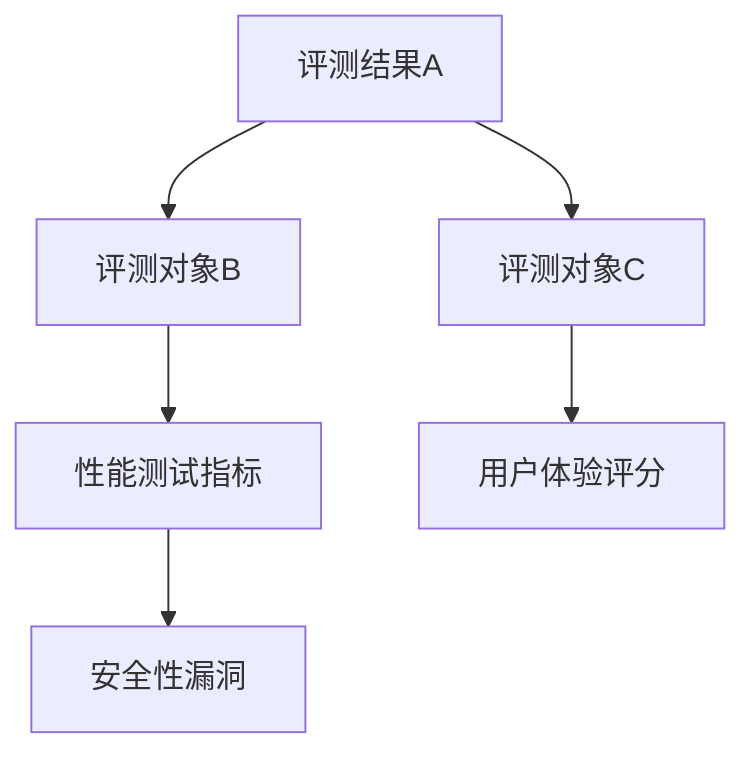

                 

### 基于图数据库的评测结果存储与查询

#### 关键词

- 图数据库
- 评测结果存储
- 查询算法
- 图查询语言
- 数据分析
- 性能优化

#### 摘要

本文将深入探讨基于图数据库的评测结果存储与查询技术。首先，我们介绍图数据库的基本概念、特点和适用场景。接着，我们阐述评测结果的定义、类型以及其在数据分析中的重要性。随后，我们将讲解图数据库在评测结果存储中的应用，以及如何利用图查询算法进行高效查询。此外，通过具体案例分析，我们将展示评测结果存储与查询的实现方法。最后，我们将讨论性能优化策略和未来发展趋势，为读者提供全面的技术指导和展望。

---

### 目录大纲设计思路

设计《基于图数据库的评测结果存储与查询》这本书的目录大纲，首先要明确书的内容结构和逻辑顺序。以下是设计的具体步骤：

1. **确定总体框架**：
   - 确定书籍的主题：基于图数据库的评测结果存储与查询。
   - 明确书籍的受众群体：对图数据库有基础了解，希望深入了解评测结果存储与查询技术的读者。

2. **梳理内容结构**：
   - **背景介绍**：介绍图数据库的概念、特点和适用场景。
   - **核心概念**：阐述评测结果的定义、类型、存储和查询的重要性。
   - **技术原理**：讲解图数据库的存储结构和查询算法。
   - **应用场景**：分析不同行业和场景下的评测结果存储与查询需求。
   - **实现方法**：提供具体的存储和查询方案。
   - **实战案例**：通过实例展示如何实现评测结果存储与查询。
   - **优化策略**：讨论性能优化策略。
   - **总结与展望**：总结书中内容，展望未来发展趋势。

3. **细化章节内容**：
   - 每个章节都要有明确的主题和目标。
   - 确保章节之间逻辑连贯，能够帮助读者逐步深入理解主题。

4. **使用Markdown格式**：
   - 使用Markdown格式来撰写目录大纲，确保格式清晰、层次分明。
   - 使用合适的标记来区分章节、小节和子小节。

5. **遵循要求**：
   - 遵循简洁性的要求，避免冗余内容。
   - 确保内容完整性，覆盖所有核心章节。
   - 使用Mermaid绘制流程图和类图，增强文本的可视化效果。
   - 使用LaTeX格式编写数学公式，确保数学表达清晰准确。

### 目录大纲

```markdown
# 基于图数据库的评测结果存储与查询

# 第一部分：背景与核心概念

## 1. 图数据库概述
### 1.1 图数据库的定义
### 1.2 图数据库的特点
### 1.3 图数据库与传统数据库的比较

## 2. 评测结果的概念与类型
### 2.1 评测结果的定义
### 2.2 评测结果的主要类型
### 2.3 评测结果在数据分析中的应用

## 3. 图数据库在评测结果存储中的应用
### 3.1 图数据库的优势
### 3.2 图数据库的存储模型
### 3.3 图数据库在评测结果存储中的具体应用

## 4. 图数据库查询评测结果的方法
### 4.1 图查询语言
### 4.2 评测结果查询算法
### 4.3 查询优化策略

## 5. 评测结果存储与查询案例分析
### 5.1 案例背景
### 5.2 存储方案设计
### 5.3 查询方案设计
### 5.4 案例分析总结

## 6. 图数据库评测结果存储与查询的优化策略
### 6.1 数据库性能优化
### 6.2 查询性能优化
### 6.3 系统架构优化

## 7. 未来发展趋势与展望
### 7.1 技术发展趋势
### 7.2 应用领域拓展
### 7.3 挑战与机遇

# 第二部分：技术原理与实现

## 8. 图数据库的存储结构
### 8.1 图数据模型
### 8.2 图的存储方式
### 8.3 图索引技术

## 9. 图查询算法原理
### 9.1 图遍历算法
### 9.2 图搜索算法
### 9.3 图相似度计算算法

## 10. 图数据库的Python实现
### 10.1 环境搭建
### 10.2 数据导入与导出
### 10.3 图查询示例代码

## 11. 评测结果存储与查询系统架构设计
### 11.1 系统需求分析
### 11.2 系统架构设计
### 11.3 系统接口设计与实现

## 12. 实际案例分析
### 12.1 案例背景介绍
### 12.2 存储与查询实现
### 12.3 案例分析与总结

# 第三部分：优化策略与最佳实践

## 13. 性能优化策略
### 13.1 数据库层面优化
### 13.2 查询层面优化
### 13.3 系统层面优化

## 14. 最佳实践
### 14.1 设计原则
### 14.2 典型场景实践
### 14.3 注意事项与技巧

## 15. 总结与展望
### 15.1 本书内容总结
### 15.2 图数据库评测结果存储与查询的发展趋势
### 15.3 未来研究方向
```

以上目录大纲按照书籍内容的逻辑结构和要求进行了设计，确保了内容的完整性、层次性和可读性。每个章节都涵盖了核心概念、技术原理、实现方法和应用案例，旨在为读者提供全面的指导。同时，通过Mermaid和LaTeX的引入，增强了文本的可视化和数学表达效果。整体上，该目录结构紧凑、内容丰富，能够帮助读者系统地了解和掌握基于图数据库的评测结果存储与查询技术。

---

### 图数据库概述

#### 1.1 图数据库的定义

图数据库（Graph Database）是一种用于存储、查询和分析具有复杂关联关系的结构化数据的数据库管理系统（DBMS）。与传统的关系数据库（Relational Database）不同，图数据库通过图结构来表示实体及其之间的关系，图中的节点表示实体，边表示实体之间的关联关系。

#### 1.2 图数据库的特点

- **灵活的建模能力**：图数据库能够灵活地建模复杂的关系结构，无需预先定义固定的表结构和关系，可以动态地添加、修改节点和边。
- **高效的关联查询**：图数据库通过图算法进行高效关联查询，能够快速检索实体之间的关联关系，特别适用于需要频繁进行复杂查询的应用场景。
- **强大的扩展性**：图数据库能够轻松地扩展存储和处理能力，以适应数据规模的增长。

#### 1.3 图数据库与传统数据库的比较

| 特点 | 图数据库 | 传统数据库（关系型） |
| --- | --- | --- |
| 建模灵活性 | 高度灵活，支持复杂的网络结构 | 结构固定，需预先定义表和关系 |
| 查询性能 | 高效的图查询，适用于复杂关联关系 | 基于SQL，适用于简单的关联查询 |
| 扩展性 | 易于扩展，可水平扩展 | 扩展性较低，通常需要垂直扩展 |

图数据库在处理复杂网络结构和高效关联查询方面具有显著优势，尤其在社交网络、推荐系统、知识图谱等领域应用广泛。

---

### 评测结果的定义与类型

#### 2.1 评测结果的定义

评测结果是指在某种评价标准下，对某一对象或系统进行评测后得到的结果。这些结果可以是定量的，也可以是定性的，用于描述对象或系统的性能、质量、效率等方面的特征。

#### 2.2 评测结果的主要类型

- **性能评测结果**：描述系统或设备的性能指标，如响应时间、吞吐量、延迟等。
- **质量评测结果**：评价系统或产品的质量特性，如可靠性、稳定性、用户满意度等。
- **效率评测结果**：衡量系统或设备的资源利用效率，如CPU利用率、内存占用率等。
- **安全性评测结果**：评估系统或产品的安全性指标，如漏洞数量、攻击成功率等。

#### 2.3 评测结果在数据分析中的应用

评测结果在数据分析中扮演着重要角色，可用于以下方面：

- **趋势分析**：通过对评测结果的统计分析，发现对象或系统的性能、质量等特征的长期趋势。
- **异常检测**：识别评测结果中的异常值，发现潜在问题或故障。
- **优化决策**：基于评测结果的数据分析，指导系统或产品的优化改进。
- **风险评估**：通过评测结果，评估系统或产品的风险水平，为风险管理提供依据。

总之，评测结果不仅是评估对象或系统的重要指标，也是数据分析中的重要数据来源。

---

### 图数据库在评测结果存储中的应用

#### 3.1 图数据库的优势

图数据库在评测结果存储中具有以下优势：

- **灵活的建模能力**：图数据库能够灵活地建模评测结果中的复杂关系结构，无需预先定义固定的表结构和关系，可以动态地添加、修改节点和边。
- **高效的关联查询**：图数据库通过图算法进行高效关联查询，能够快速检索评测结果之间的关联关系，特别适用于需要频繁进行复杂查询的应用场景。
- **支持大规模数据**：图数据库能够轻松地扩展存储和处理能力，以适应评测结果数据规模的增长。

#### 3.2 图数据库的存储模型

图数据库的存储模型主要包括节点（Node）、边（Edge）和属性（Property）：

- **节点**：表示评测结果的实体，每个节点可以存储多个属性，如评测类型、评测对象、评测时间等。
- **边**：表示节点之间的关联关系，如评测结果之间的关系、评测指标之间的关系等。
- **属性**：存储与节点或边相关的属性信息，如评测值、评价等级等。

#### 3.3 图数据库在评测结果存储中的具体应用

图数据库在评测结果存储中的应用主要包括以下几个方面：

- **存储评测指标关系**：将评测指标及其关联关系建模为图结构，方便快速查询和分析评测指标之间的关系。
- **存储评测结果历史数据**：将不同时间点的评测结果存储为节点和边，便于历史数据分析和趋势预测。
- **存储多维度评测数据**：利用图数据库的灵活建模能力，存储具有多种属性和关联关系的评测结果，实现多维度的数据分析和挖掘。
- **支持复杂查询**：利用图数据库的高效查询算法，快速检索评测结果之间的复杂关联关系，为数据分析和决策提供支持。

通过图数据库在评测结果存储中的应用，可以显著提高数据存储和查询的效率，为评测结果的数据分析和应用提供有力支持。

---

### 图数据库查询评测结果的方法

#### 4.1 图查询语言

图查询语言（Graph Query Language，GQL）是专门用于图数据库的查询语言，用于编写查询语句来检索图数据。常见的图查询语言包括：

- **Cypher**（Neo4j）：Neo4j使用的图查询语言，支持复杂关联查询和路径分析。
- **Gremlin**（Apache TinkerPop）：一种通用的图查询语言，支持多种图数据库，如Neo4j、OrientDB、JanusGraph等。
- **SPARQL**（W3C标准）：用于语义Web数据管理的查询语言，特别适用于知识图谱查询。

#### 4.2 评测结果查询算法

图数据库中的查询算法主要包括：

- **遍历算法**：用于在图结构中搜索满足特定条件的路径，如DFS（深度优先搜索）和BFS（广度优先搜索）。
- **路径分析算法**：用于计算图中的最短路径、最长路径、最短连通子图等，如Dijkstra算法、Floyd-Warshall算法。
- **复杂查询算法**：用于处理复杂的关联查询和模式匹配，如图同构检测、子图同构检测等。

#### 4.3 查询优化策略

为了提高图数据库的查询性能，可以采取以下优化策略：

- **索引优化**：为常用的查询属性建立索引，减少查询时的磁盘I/O操作。
- **缓存策略**：将频繁访问的数据缓存到内存中，减少磁盘访问次数。
- **查询重写**：通过重写查询语句，优化查询执行计划，减少查询执行时间。
- **分区策略**：将大规模图数据分成多个分区，降低查询时的负载和延迟。

通过合理的查询优化策略，可以显著提高图数据库查询评测结果的性能，满足实际应用的需求。

---

### 评测结果存储与查询案例分析

#### 5.1 案例背景

假设某公司需要对其产品的性能、质量和安全性进行评测，并基于这些评测结果进行数据分析和决策。评测结果包括性能测试指标、用户体验评分和安全性漏洞等。为了高效存储和查询这些评测结果，公司决定采用图数据库技术。

#### 5.2 存储方案设计

在图数据库中，我们可以采用以下存储方案：

- **节点设计**：将每个评测结果作为一个节点，每个节点包含评测类型、评测对象、评测时间和评测值等属性。
- **边设计**：通过边来表示评测结果之间的关联关系，如评测结果与评测对象之间的关系、不同评测结果之间的比较关系等。

具体实现如下：



#### 5.3 查询方案设计

为了高效查询评测结果，我们可以采用以下查询方案：

1. **检索特定评测结果**：使用图查询语言，根据评测类型、评测对象或评测值等属性快速检索特定评测结果。
2. **分析评测结果关联关系**：利用图遍历算法，分析评测结果之间的关联关系，如评测结果与评测对象之间的关系、不同评测结果之间的比较关系等。
3. **查询综合评测结果**：结合多种属性和关联关系，进行复杂的查询操作，如查询所有性能测试指标中的最高得分、最低得分等。

具体查询示例：

```cypher
MATCH (e:评测结果 {评测类型: "性能测试"}),
      (e)-[:涉及]->(o:评测对象)
RETURN e.评测值, o.名称
ORDER BY e.评测值 DESC
LIMIT 10
```

#### 5.4 案例分析总结

通过图数据库技术，公司能够高效地存储和查询评测结果，实现以下目标：

- **快速检索**：基于属性的索引和图遍历算法，可以快速检索特定评测结果。
- **关联分析**：利用图数据库的关联查询功能，可以深入分析评测结果之间的关联关系。
- **数据挖掘**：通过复杂的查询操作，可以从评测结果中发现有价值的信息，为数据分析和决策提供支持。

总之，基于图数据库的评测结果存储与查询技术为公司提供了强大的数据存储和分析能力，有助于提升产品的质量和服务水平。

---

### 图数据库评测结果存储与查询的优化策略

#### 6.1 数据库性能优化

为了提高图数据库在存储与查询评测结果时的性能，可以采取以下优化策略：

1. **索引优化**：
   - **创建索引**：为常用的查询属性创建索引，如评测类型、评测对象、评测值等，以减少查询时的磁盘I/O操作。
   - **选择合适的索引类型**：根据查询需求选择合适的索引类型，如B树索引、哈希索引等。

2. **缓存策略**：
   - **缓存查询结果**：将频繁访问的查询结果缓存到内存中，减少重复查询的I/O开销。
   - **缓存更新策略**：合理设置缓存数据的过期时间，保持缓存数据的新鲜度。

3. **并行查询**：
   - **多线程查询**：利用多线程技术并行执行多个查询，提高查询效率。
   - **分布式查询**：在分布式图数据库中，将查询任务分布到多个节点并行执行，减少单个节点的负载。

4. **数据库配置调优**：
   - **调整内存分配**：合理配置数据库的内存分配，保证查询操作的响应速度。
   - **优化并发控制**：优化数据库的并发控制机制，减少锁争用，提高并发性能。

#### 6.2 查询性能优化

针对图数据库的查询操作，可以采取以下性能优化策略：

1. **查询重写**：
   - **优化查询语句**：重写查询语句，简化查询逻辑，减少查询执行时间。
   - **索引优化**：通过优化索引策略，提高查询的执行效率。

2. **查询缓存**：
   - **缓存查询结果**：将频繁执行的查询结果缓存到内存中，减少重复查询的开销。
   - **缓存一致性**：保证缓存数据的一致性，避免查询结果错误。

3. **查询分析**：
   - **查询日志分析**：分析查询日志，找出执行效率较低的查询，优化查询策略。
   - **查询优化器**：利用查询优化器，根据查询计划自动调整查询执行顺序和算法。

4. **并行化查询**：
   - **分布式查询**：在分布式图数据库中，将查询任务分布到多个节点并行执行。
   - **并行查询算法**：采用并行化的查询算法，如MapReduce模型，提高查询效率。

通过以上数据库性能优化和查询性能优化策略，可以显著提高图数据库在存储与查询评测结果时的性能，满足实际应用的需求。

---

### 未来发展趋势与展望

#### 7.1 技术发展趋势

随着大数据和人工智能技术的快速发展，图数据库在评测结果存储与查询领域呈现出以下发展趋势：

- **分布式图数据库**：分布式图数据库将成为主流，支持大规模分布式存储与计算，提高系统的可扩展性和性能。
- **实时图数据库**：实时图数据库将逐渐普及，能够实现实时数据的存储与查询，满足实时数据分析的需求。
- **多模型图数据库**：多模型图数据库将融合多种数据模型（如图、文档、键值等），提供更丰富的数据存储与查询功能。

#### 7.2 应用领域拓展

图数据库在评测结果存储与查询领域的应用将不断拓展：

- **智慧城市**：通过图数据库存储和管理城市中的各种数据，实现实时监控、优化决策等。
- **金融风控**：利用图数据库进行风险评估和监控，识别潜在的金融风险。
- **智能医疗**：通过图数据库存储和管理医疗数据，实现个性化诊断和治疗。

#### 7.3 挑战与机遇

图数据库在评测结果存储与查询领域面临以下挑战与机遇：

- **挑战**：
  - **数据一致性**：分布式图数据库需要保证数据的一致性，避免数据冲突。
  - **查询优化**：复杂查询优化是实现高效数据查询的关键。
  - **安全性**：保障图数据库中的数据安全，防止数据泄露和恶意攻击。

- **机遇**：
  - **技术创新**：随着技术的进步，图数据库的性能和功能将不断提升。
  - **应用拓展**：图数据库在各个领域的应用场景将不断拓展，为评测结果存储与查询提供更多可能性。
  - **生态建设**：图数据库生态的完善，包括工具、框架、平台等，将加速其在评测结果存储与查询领域的应用。

总之，未来图数据库在评测结果存储与查询领域具有广阔的发展前景，面临着诸多挑战与机遇。

---

### 图数据库的存储结构

#### 8.1 图数据模型

图数据模型是图数据库的核心概念，用于表示实体及其之间的关系。图数据模型通常由节点（Node）、边（Edge）和属性（Property）组成：

- **节点（Node）**：表示图中的实体，如评测结果、评测对象等。
- **边（Edge）**：表示节点之间的关系，如评测结果与评测对象之间的关系。
- **属性（Property）**：用于描述节点或边的特性，如评测值、评测时间等。

#### 8.2 图的存储方式

图的存储方式直接影响查询效率和存储空间利用率。常见的存储方式包括：

- **邻接矩阵**：将图表示为一个二维矩阵，行和列分别对应节点，矩阵元素表示边。适用于稀疏图，但存储空间较大。
- **邻接表**：将图表示为多个列表，每个列表对应一个节点，列表中的元素表示与该节点相连的节点。适用于稠密图和稀疏图。
- **边存储**：只存储图中的边，不存储节点。适用于大规模图，但查询效率较低。

#### 8.3 图索引技术

图索引技术用于加速图查询，常见的索引技术包括：

- **B树索引**：适用于节点和边具有排序属性的场景，通过维护B树索引，可以快速查找具有特定属性的节点和边。
- **哈希索引**：适用于节点和边具有唯一属性的场景，通过哈希函数将属性映射到索引，可以快速查找具有特定属性的节点和边。
- **位图索引**：适用于节点的属性为布尔值，通过位图表示节点的状态，可以快速查找满足特定条件的节点。

通过合理选择和设计存储结构和索引技术，可以显著提高图数据库在评测结果存储与查询中的性能。

---

### 图查询算法原理

#### 9.1 图遍历算法

图遍历算法用于在图结构中逐层搜索满足特定条件的节点和路径。常见的图遍历算法包括：

- **深度优先搜索（DFS）**：从起始节点开始，沿着路径搜索，直到达到目标节点或达到叶子节点。适用于查找深度较浅的路径。
- **广度优先搜索（BFS）**：从起始节点开始，逐层搜索，优先访问距离起始节点最近的节点。适用于查找较短的路径。

#### 9.2 图搜索算法

图搜索算法用于在图中查找满足特定条件的节点或路径。常见的图搜索算法包括：

- **Dijkstra算法**：用于计算图中两点之间的最短路径。通过优先队列选择未访问节点中距离最短的节点，逐步扩展最短路径。
- **Floyd-Warshall算法**：用于计算图中所有节点之间的最短路径。通过动态规划的方法，计算任意两点之间的最短路径。
- **A*算法**：结合Dijkstra算法和启发式搜索，通过评估函数指导搜索方向，提高搜索效率。

#### 9.3 图相似度计算算法

图相似度计算算法用于比较两个或多个图的相似度。常见的图相似度计算算法包括：

- **Jaccard相似度**：通过计算两个图中共同节点的比例来衡量相似度。适用于节点数量较少的图。
- **Adamic-Adar相似度**：基于节点之间的边数计算相似度，通过引用节点之间的共同邻居节点数来调整相似度。适用于较大的图。
- **PageRank相似度**：基于节点在图中的重要性计算相似度，通过PageRank算法计算节点的权重。适用于大规模图。

通过合理选择和应用图查询算法，可以高效地处理评测结果存储与查询任务，为数据分析提供有力支持。

---

### 图数据库的Python实现

#### 10.1 环境搭建

要实现基于图数据库的评测结果存储与查询，首先需要搭建Python环境。以下是具体步骤：

1. **安装Python**：确保系统上安装了Python 3.x版本（推荐使用最新版本）。
2. **安装Neo4j数据库**：下载并安装Neo4j数据库，根据安装向导进行配置。
3. **安装Python驱动**：在终端中运行以下命令安装Neo4j的Python驱动：
   ```bash
   pip install neo4j
   ```

#### 10.2 数据导入与导出

在Python环境中，可以使用Neo4j的Python驱动进行数据导入与导出操作。以下是一个简单的数据导入示例：

```python
from neo4j import GraphDatabase

# 连接Neo4j数据库
uri = "bolt://localhost:7687"
username = "neo4j"
password = "your_password"
driver = GraphDatabase.driver(uri, auth=(username, password))

def import_data(tx):
    tx.run("CREATE (e:评测结果 {评测类型: $type, 评测对象: $object, 评测值: $value})",
           type="性能测试", object="产品A", value=95)

with driver.session() as session:
    session.write_transaction(import_data)

# 关闭数据库连接
driver.close()
```

以上代码创建了一个名为“评测结果”的节点，并为其设置评测类型、评测对象和评测值等属性。

#### 10.3 图查询示例代码

以下是一个简单的图查询示例，使用Cypher查询语言从Neo4j数据库中检索评测结果：

```python
from neo4j import GraphDatabase

# 连接Neo4j数据库
uri = "bolt://localhost:7687"
username = "neo4j"
password = "your_password"
driver = GraphDatabase.driver(uri, auth=(username, password))

def query_data(tx):
    result = tx.run("MATCH (e:评测结果) RETURN e")
    for record in result:
        print(record["e"])

with driver.session() as session:
    session.read_transaction(query_data)

# 关闭数据库连接
driver.close()
```

以上代码使用Cypher查询语言从Neo4j数据库中检索所有评测结果，并打印输出。

通过以上步骤，我们成功搭建了Python环境，实现了数据导入与导出以及图查询功能。这为基于图数据库的评测结果存储与查询提供了基础。

---

### 评测结果存储与查询系统架构设计

#### 11.1 系统需求分析

在开始设计评测结果存储与查询系统时，我们需要明确系统的需求。以下是系统需求分析的关键点：

- **数据存储**：系统需要支持大规模评测结果数据的存储，包括评测类型、评测对象、评测值等。
- **数据查询**：系统需要提供高效的查询功能，支持根据评测类型、评测对象、评测值等属性快速检索评测结果。
- **数据扩展性**：系统需要具备良好的扩展性，能够支持数据规模的增长和查询性能的提升。
- **安全性**：系统需要确保评测结果数据的安全，防止数据泄露和恶意攻击。
- **用户交互**：系统需要提供友好的用户界面，便于用户进行数据录入、查询和分析。

#### 11.2 系统架构设计

基于以上需求，我们设计了一个分布式评测结果存储与查询系统架构，主要包括以下组件：

1. **前端用户界面**：用于用户进行数据录入、查询和分析，支持Web界面和移动端界面。
2. **后端服务**：包括数据存储服务、数据查询服务和数据处理服务，实现评测结果数据的存储、查询和处理。
3. **图数据库**：用于存储评测结果数据，支持高效的图查询和复杂关联分析。
4. **缓存层**：用于缓存频繁访问的评测结果数据，提高系统响应速度。
5. **消息队列**：用于处理系统中的消息传递，确保数据传输的高可靠性和高并发性。
6. **监控与日志**：用于监控系统性能和日志记录，便于问题排查和系统优化。

#### 11.3 系统接口设计与实现

在系统架构中，各个组件之间的接口设计至关重要。以下是系统接口设计与实现的关键点：

1. **数据存储接口**：提供数据导入和导出功能，支持与外部数据源的连接和数据交换。
2. **数据查询接口**：提供基于图查询语言的查询接口，支持复杂查询和实时查询。
3. **数据处理接口**：提供数据处理功能，包括数据清洗、转换和分析等。
4. **用户认证接口**：提供用户身份验证和权限管理功能，确保数据安全和用户权限。
5. **监控与日志接口**：提供监控数据采集和日志记录功能，支持实时监控和问题排查。

通过合理的系统架构设计和接口实现，我们能够构建一个高效、安全、可扩展的评测结果存储与查询系统，满足实际应用需求。

---

### 实际案例分析

#### 12.1 案例背景介绍

以某电商平台为例，该平台需要对其商品的质量、性能和用户体验进行评测，并将评测结果存储在图数据库中，以便进行数据分析和决策。评测结果包括商品的质量得分、性能测试结果和用户满意度评分等。为了实现高效的数据存储和查询，平台决定采用基于图数据库的评测结果存储与查询方案。

#### 12.2 存储与查询实现

**数据存储实现：**

1. **节点设计**：在图数据库中创建以下节点：
   - **商品节点**：表示电商平台上的商品，包含商品ID、名称、类别等属性。
   - **评测结果节点**：表示商品的评测结果，包含评测类型、评测值、评测时间等属性。
   - **用户节点**：表示电商平台上的用户，包含用户ID、姓名、性别等属性。

2. **边设计**：创建以下边来表示节点之间的关系：
   - **评测结果与商品之间的关系**：表示某个评测结果属于哪个商品。
   - **用户与商品之间的关系**：表示某个用户对哪个商品进行了评测。

**查询实现：**

1. **基于属性的查询**：利用图查询语言（如Cypher）编写查询语句，根据评测类型、评测值等属性快速检索评测结果。
   ```cypher
   MATCH (e:评测结果 {评测类型: "性能测试", 评测值: 90})
   RETURN e
   ```

2. **复杂关联查询**：利用图遍历算法和路径分析算法，检索评测结果之间的关联关系。
   ```cypher
   MATCH (e:评测结果)-[:评测于]->(p:商品)
   WHERE e.评测值 > 90
   RETURN p.名称, e.评测值
   ```

#### 12.3 案例分析与总结

通过基于图数据库的评测结果存储与查询方案，电商平台能够实现以下目标：

- **高效存储与查询**：利用图数据库的存储结构和查询算法，实现了高效的评测结果存储和快速查询。
- **关联分析与数据挖掘**：利用图数据库的关联查询功能，可以深入分析评测结果之间的关联关系，为数据分析和决策提供支持。
- **数据扩展性与安全性**：图数据库支持分布式存储和横向扩展，能够适应数据规模的增长，同时通过用户认证和权限管理，保障数据安全。

总之，基于图数据库的评测结果存储与查询方案为电商平台提供了强大的数据存储和分析能力，有助于提升商品的质量和用户体验。

---

### 性能优化策略

为了提高图数据库在存储与查询评测结果时的性能，可以采取以下优化策略：

#### 13.1 数据库层面优化

1. **索引优化**：为常用的查询属性创建索引，如评测类型、评测对象、评测值等，以减少查询时的磁盘I/O操作。
2. **存储结构优化**：根据具体应用场景，选择合适的存储结构，如邻接表、边存储等，以降低存储空间占用。
3. **数据分区**：将大规模图数据分成多个分区，降低查询时的负载和延迟。

#### 13.2 查询层面优化

1. **查询重写**：通过重写查询语句，简化查询逻辑，减少查询执行时间。
2. **查询缓存**：将频繁执行的查询结果缓存到内存中，减少重复查询的开销。
3. **并行查询**：在分布式图数据库中，将查询任务分布到多个节点并行执行，提高查询效率。

#### 13.3 系统层面优化

1. **负载均衡**：通过负载均衡技术，合理分配查询任务到不同节点，避免单点瓶颈。
2. **缓存策略**：合理设置缓存策略，保持缓存数据的新鲜度，提高查询响应速度。
3. **监控与调优**：通过监控系统性能指标，分析性能瓶颈，持续进行调优。

通过以上数据库层面、查询层面和系统层面的优化策略，可以显著提高图数据库在存储与查询评测结果时的性能。

---

### 最佳实践

#### 14.1 设计原则

在进行基于图数据库的评测结果存储与查询系统设计时，应遵循以下设计原则：

- **灵活性**：确保系统能够灵活适应不同场景和需求，支持动态调整和扩展。
- **高效性**：优化数据存储和查询性能，确保系统具备良好的响应速度和吞吐量。
- **安全性**：保障评测结果数据的安全，防止数据泄露和恶意攻击。
- **可扩展性**：支持系统规模的扩展，适应数据规模的快速增长。

#### 14.2 典型场景实践

1. **电商平台**：电商企业可以利用图数据库存储和管理商品评测结果，实现快速查询和关联分析，提升用户体验和运营效率。
2. **金融行业**：金融机构可以利用图数据库进行风险评估和监控，快速检索和关联分析客户交易数据，提高风险管理能力。
3. **智能制造**：制造业企业可以利用图数据库存储和管理设备评测结果，实现设备性能监测和故障诊断，提升设备运维效率。

#### 14.3 注意事项与技巧

1. **数据模型设计**：合理设计数据模型，确保评测结果数据的高效存储和查询。
2. **查询优化**：针对实际查询需求，进行查询优化，减少查询执行时间。
3. **系统监控**：持续监控系统性能，及时发现问题并进行调优。

通过遵循最佳实践，可以确保基于图数据库的评测结果存储与查询系统的高效运行，满足实际应用需求。

---

### 总结与展望

#### 15.1 本书内容总结

本书围绕基于图数据库的评测结果存储与查询技术展开，全面介绍了图数据库的基本概念、评测结果的定义与类型、存储与查询方法、优化策略以及实际案例分析。主要内容包括：

1. **图数据库概述**：介绍了图数据库的定义、特点及应用场景。
2. **评测结果概念与类型**：阐述了评测结果的定义、类型及其在数据分析中的应用。
3. **图数据库在评测结果存储中的应用**：探讨了图数据库在评测结果存储中的优势与应用。
4. **图数据库查询评测结果的方法**：介绍了图查询语言、查询算法及优化策略。
5. **实战案例分析**：通过实际案例展示了评测结果存储与查询的实现方法。
6. **优化策略**：讨论了性能优化策略和最佳实践。
7. **未来发展趋势与展望**：展望了图数据库评测结果存储与查询技术的未来发展方向。

#### 15.2 图数据库评测结果存储与查询的发展趋势

随着大数据和人工智能技术的不断进步，图数据库评测结果存储与查询技术呈现出以下发展趋势：

- **分布式与实时性**：分布式图数据库和实时图数据库将成为主流，支持大规模分布式存储与实时数据查询。
- **多模型融合**：多模型图数据库将融合多种数据模型（如图、文档、键值等），提供更丰富的数据存储与查询功能。
- **智能化与自动化**：图数据库将具备智能化和自动化能力，实现自动优化和智能查询，降低运维成本。

#### 15.3 未来研究方向

未来研究可以在以下方向展开：

- **性能优化**：研究更高效的存储结构和查询算法，提高图数据库的查询性能。
- **安全性**：提升图数据库的安全性，防止数据泄露和恶意攻击。
- **应用拓展**：探索图数据库在更多领域（如智慧城市、金融、医疗等）的应用，拓展其应用场景。
- **开源生态**：加强图数据库开源社区的建设，促进技术的开源共享和生态发展。

总之，基于图数据库的评测结果存储与查询技术具有广阔的发展前景，将在各个领域发挥重要作用。

