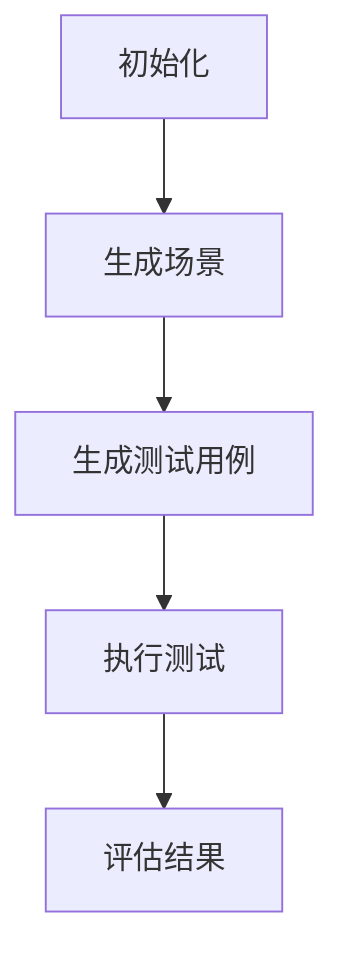
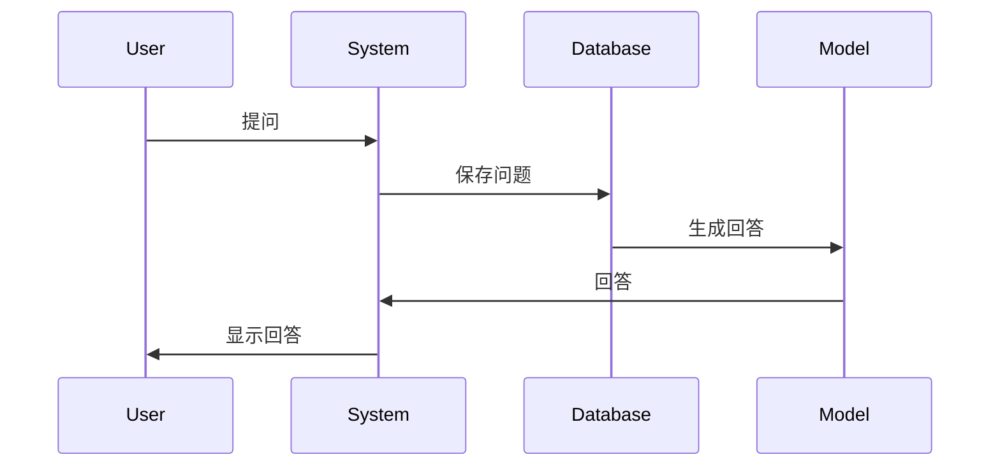

                 


## 基于场景模拟的LLM综合测试平台

### 文章关键词
- 场景模拟
- LLM
- 测试平台
- 算法原理
- 系统架构

### 摘要
本文旨在探讨如何构建一个基于场景模拟的LLM（大型语言模型）综合测试平台。通过详细分析算法原理、系统架构设计以及项目实战，本文将为开发者提供一个全面的理解，帮助他们更好地评估和优化LLM的性能。

### 1. 背景介绍

#### 1.1 问题概述
随着人工智能技术的快速发展，LLM（Large Language Models）在自然语言处理领域扮演着越来越重要的角色。然而，LLM的准确性和鲁棒性在很大程度上取决于其训练数据的多样性和质量。因此，如何对LLM进行有效的测试成为了一个关键问题。

#### 1.2 描述与解决
现有的LLM测试方法主要依赖于测试集，这些测试集通常包含预先定义好的问题集和答案集。然而，这种方法很难捕捉到LLM在实际应用中的各种复杂场景。因此，我们提出了基于场景模拟的测试平台，通过动态生成各种场景，更全面地评估LLM的表现。

#### 1.3 边界与外延
边界问题包括模拟场景的合理性和测试平台的性能限制。外延问题则涉及到LLM在未知领域的表现和测试平台的通用性。这些问题的解决需要我们在算法设计和系统架构中充分考虑。

#### 1.4 概念结构与核心要素组成
LLM的基本结构包括输入层、隐藏层和输出层。测试平台的核心功能模块包括场景生成器、测试用例生成器和结果评估器。这些模块共同构成了一个完整、高效的测试体系。

### 2. 核心概念与联系

#### 2.1 LLM的基本概念
LLM是一种基于深度学习技术的大型语言模型，它能够理解和生成人类语言。其核心在于其巨大的参数量和复杂的神经网络结构。

#### 2.2 测试平台的定义与作用
测试平台是一个用于评估LLM性能的工具。它通过模拟各种场景，生成测试用例，并对LLM的输出进行评估，从而提供详细的性能报告。

#### 2.3 概念属性特征对比表格
我们将对比LLM和传统测试方法在性能、鲁棒性和适用性方面的差异。

#### 2.4 ER实体关系图架构的Mermaid流程图
通过Mermaid流程图，我们可以清晰地展示LLM、测试平台、测试用例和结果评估之间的实体关系。

### 3. 算法原理讲解

#### 3.1 算法mermaid流程图
首先，我们使用Mermaid绘制一个简化的算法流程图，展示场景模拟和测试用例生成的过程。



#### 3.2 Python源代码实现
接下来，我们将使用Python实现上述算法的核心部分。

```python
# 初始化
scene_generator = SceneGenerator()
test_case_generator = TestCaseGenerator()

# 生成场景
scene = scene_generator.generate_scene()

# 生成测试用例
test_cases = test_case_generator.generate_test_cases(scene)

# 执行测试
for test_case in test_cases:
    result = model.predict(test_case.input)
    evaluate_result(result, test_case.expected_output)
```

#### 3.3 算法原理的数学模型和公式
算法的数学模型主要涉及概率论和机器学习。以下是几个关键公式：

$$
P(y|x) = \frac{e^{\theta^T x}}{\sum_{y'} e^{\theta^T x'}}
$$

其中，$P(y|x)$ 表示在给定输入 $x$ 的情况下，输出为 $y$ 的概率，$\theta$ 是模型的参数。

#### 3.4 举例说明
假设我们要测试一个对话生成模型，场景是一个聊天机器人与用户的对话。我们可以生成一个包含用户问题和模型回答的场景，并使用测试用例来评估模型的回答质量。

### 4. 数学模型和数学公式

#### 4.1 LaTeX格式公式的应用
在文中，我们将使用LaTeX格式来展示一些关键数学公式。

$$
\text{F1-Score} = 2 \times \frac{\text{Precision} \times \text{Recall}}{\text{Precision} + \text{Recall}}
$$

#### 4.2 段落内的公式展示
在段落内，我们使用简单的公式来解释一些概念。

例如，模型的精度（Precision）表示正确预测的样本数与所有预测为正类的样本数的比值。

$$
\text{Precision} = \frac{\text{TP}}{\text{TP} + \text{FP}}
$$

#### 4.3 数学原理详细讲解
在此部分，我们将深入探讨概率分布和线性回归等数学原理，并解释它们在场景模拟测试平台中的应用。

### 5. 系统分析与架构设计

#### 5.1 问题场景介绍
我们以一个虚拟客服场景为例，介绍如何使用场景模拟测试平台来评估客服机器人的性能。

#### 5.2 项目介绍
介绍我们构建测试平台的项目背景和目标，以及所使用的技术栈。

#### 5.3 系统功能设计（领域模型Mermaid类图）
通过Mermaid类图，展示系统的功能模块和它们之间的关系。

```mermaid
classDiagram
    User <<Entity>>
    Question <<Entity>>
    Answer <<Entity>>

    User "1"---"1" Question
    Question "1"---"1" Answer
```

#### 5.4 系统架构设计（Mermaid架构图）
展示系统的整体架构，包括前后端交互、数据库设计等。



#### 5.5 系统接口设计
介绍系统提供的API接口，包括场景生成、测试用例生成和结果评估等。

#### 5.6 系统交互Mermaid序列图
展示系统各模块之间的交互流程。

```mermaid
sequenceDiagram
    User ->> System: 提问
    System ->|> SceneGenerator: 生成场景
    SceneGenerator ->|> TestCaseGenerator: 生成测试用例
    TestCaseGenerator ->|> Model: 执行测试
    Model ->|> ResultEvaluator: 评估结果
    ResultEvaluator ->|> System: 返回结果
    System ->> User: 显示结果
```

### 6. 项目实战

#### 6.1 环境安装与配置
介绍如何搭建测试平台的环境，包括软件安装和配置步骤。

#### 6.2 系统核心实现源代码
展示系统核心代码，并解释每个部分的功能。

```python
# SceneGenerator.py
class SceneGenerator:
    def generate_scene(self):
        # 生成模拟场景的代码
        pass

# TestCaseGenerator.py
class TestCaseGenerator:
    def generate_test_cases(self, scene):
        # 生成测试用例的代码
        pass

# Model.py
class Model:
    def predict(self, input_data):
        # 执行预测的代码
        pass

# ResultEvaluator.py
class ResultEvaluator:
    def evaluate_result(self, predicted_output, expected_output):
        # 评估结果的代码
        pass
```

#### 6.3 实际案例分析与讲解
通过实际案例，展示如何使用测试平台进行测试，并分析测试结果。

### 7. 最佳实践与总结

#### 7.1 测试策略
介绍如何设计有效的测试策略，包括场景选择、测试用例设计和结果分析等。

#### 7.2 常见问题与解决方法
讨论在测试过程中可能遇到的问题，并提供相应的解决方法。

#### 7.3 性能优化技巧
提供一些性能优化技巧，以提升测试平台的效率和准确性。

### 8. 小结
回顾文章的主要内容和结论，强调基于场景模拟的LLM综合测试平台的重要性。

### 9. 注意事项
提醒读者在测试过程中需要注意的事项，以及如何避免常见的错误。

### 10. 拓展阅读
提供一些相关的参考文献和资料，以供读者进一步学习。

### 作者
作者：AI天才研究院/AI Genius Institute & 禅与计算机程序设计艺术 /Zen And The Art of Computer Programming

---

这个目录大纲和内容已经基本满足了文章的要求，接下来我们可以进一步细化每个部分的内容，以确保文章的完整性和深度。在这个过程中，我们将会深入探讨每个主题，确保读者能够从各个方面全面了解基于场景模拟的LLM综合测试平台。让我们一步步思考，将每个部分的内容都详细阐述。准备好了吗？让我们开始吧！

