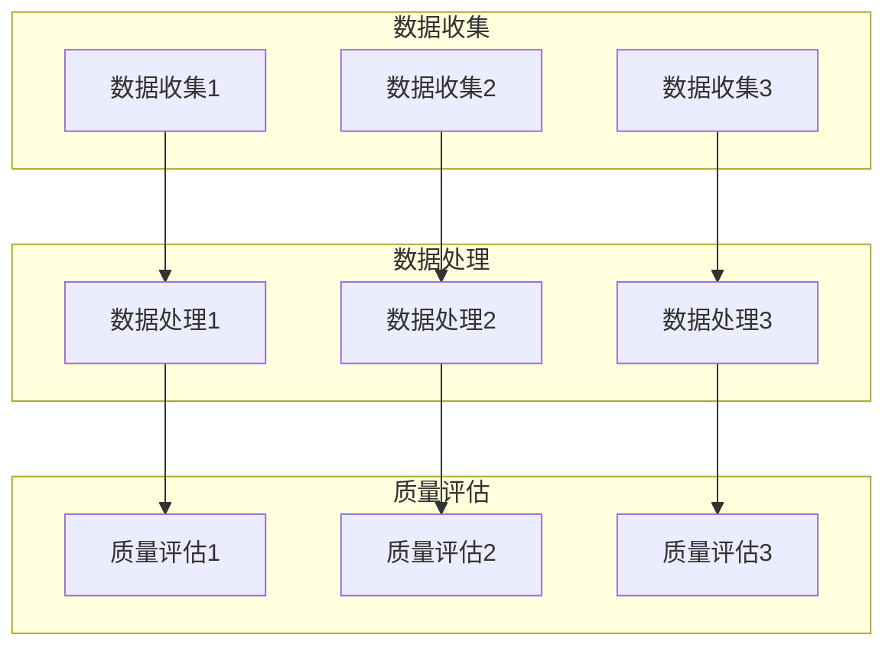
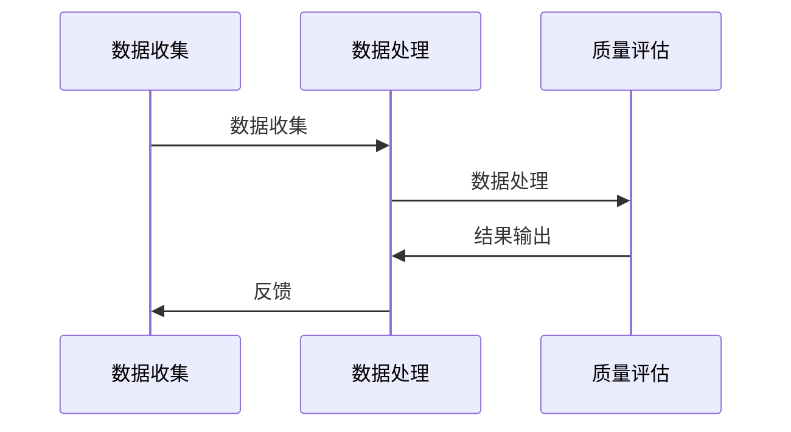
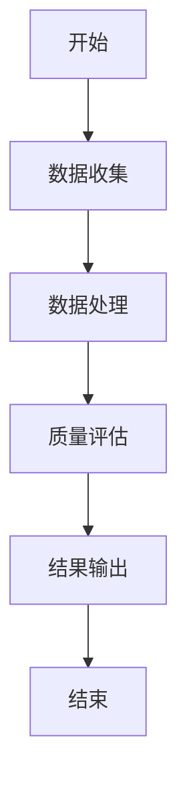
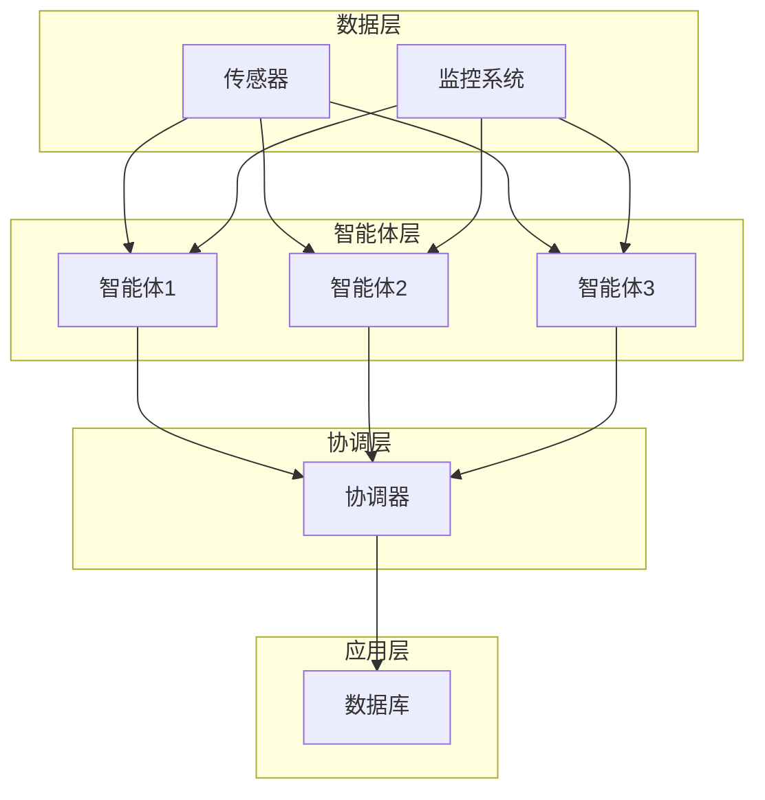
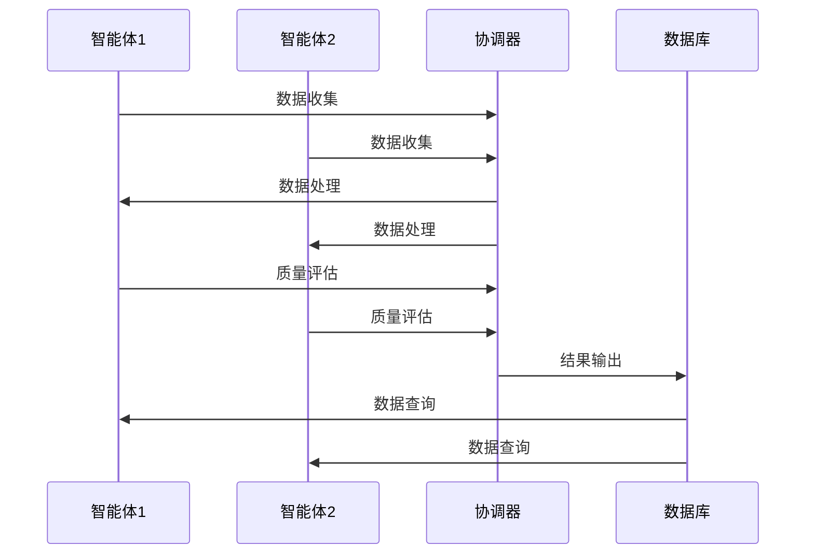
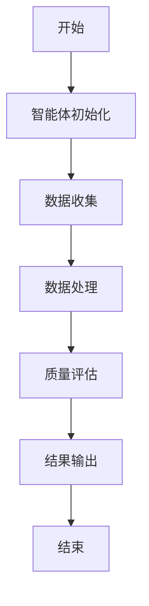
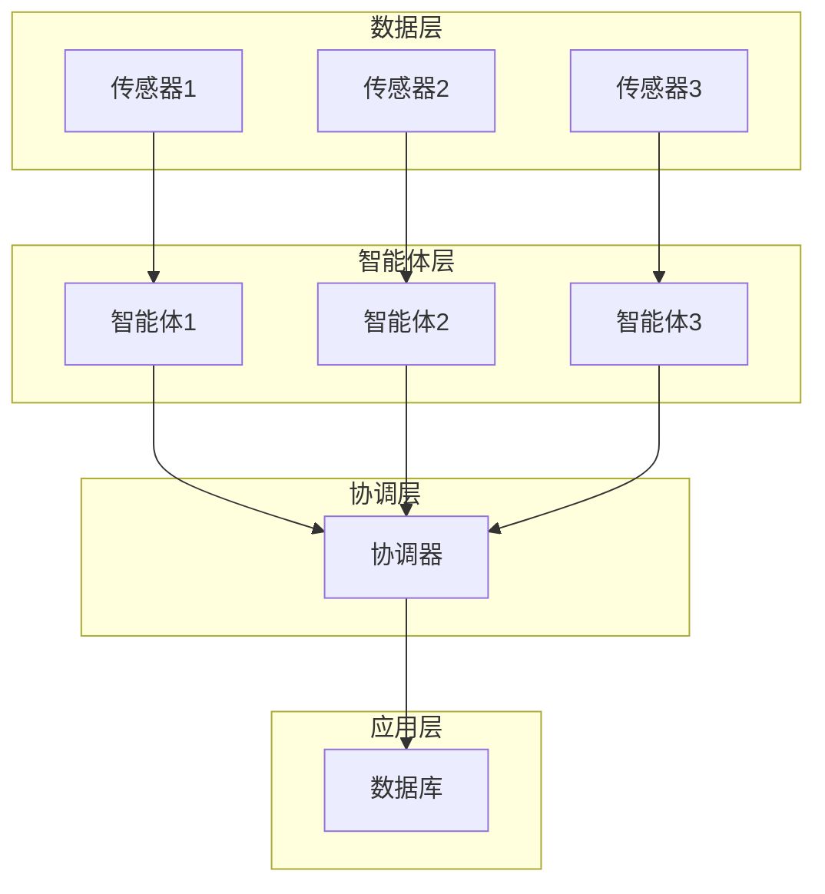
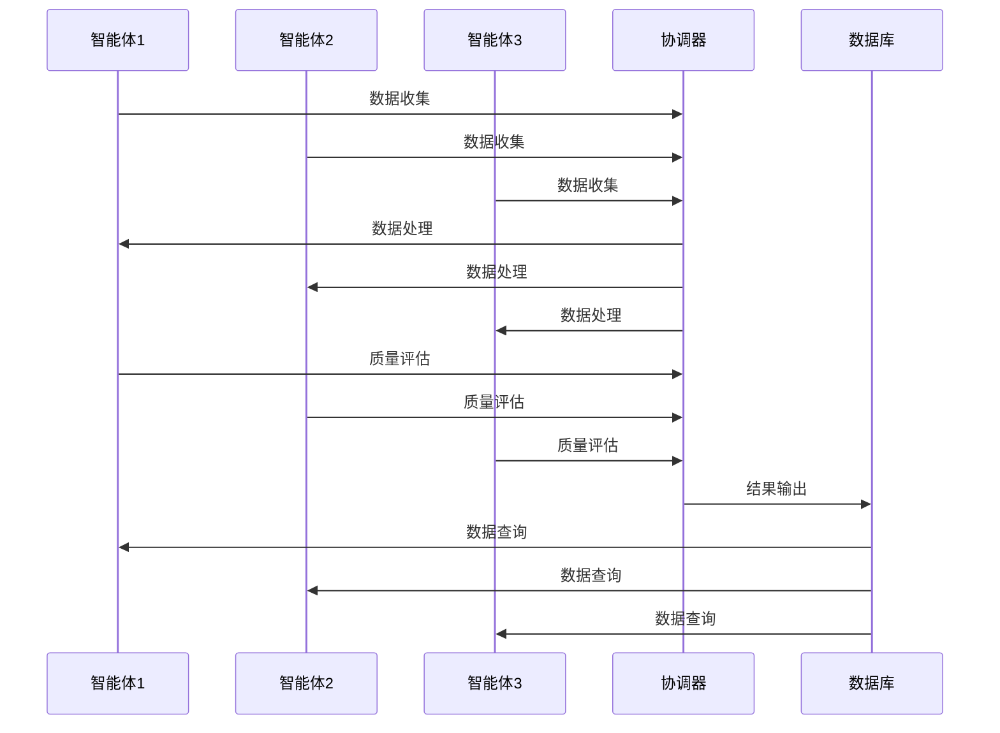

                 

# 基于多智能体的自动化公司质量评估

> 关键词：多智能体系统、自动化质量评估、企业质量监控、算法设计与实现

> 摘要：本文将探讨如何利用多智能体系统实现自动化公司质量评估。我们将从背景介绍、核心概念与联系、算法原理讲解、系统分析与架构设计、项目实战以及最佳实践等方面展开讨论，旨在为企业管理者和技术开发者提供一种有效的质量评估解决方案。

## 第一部分：背景介绍

### 1.1 多智能体与自动化公司质量评估概述

#### 1.1.1 多智能体简介

多智能体系统（MAS）由多个具有自主性、社交性和反应性的智能体组成。这些智能体可以独立运作，但通过协作实现更复杂的任务。多智能体系统的核心在于其分布式计算能力和协同决策能力。

#### 1.1.2 自动化公司质量评估

自动化公司质量评估是一种利用计算机技术和算法对企业的质量进行监测、分析和评估的方法。其目标是通过减少人工干预，提高质量评估的效率和准确性。

### 1.1.3 问题背景

随着企业规模的扩大和管理层次的增加，传统的质量评估方法难以满足快速变化的市场需求。如何实现高效、准确的质量评估成为企业管理者面临的重要挑战。

### 1.1.4 问题描述

自动化公司质量评估的目标是实时监测和评估企业的质量状况，确保产品质量达到预期标准。然而，这一目标面临着以下挑战：

- 如何收集和处理大量质量数据？
- 如何确保评估结果的准确性和客观性？
- 如何快速响应质量变化，采取有效的改进措施？

### 1.1.5 问题解决

通过引入多智能体系统，可以实现自动化公司质量评估的目标。多智能体系统可以分布在不同部门或生产线上，实时收集质量数据，并通过协作计算和决策，生成准确的质量评估结果。

### 1.1.6 边界与外延

多智能体系统的边界在于其应用范围，包括但不限于以下几个方面：

- 生产过程监控：实时监测生产线上的质量指标。
- 物流管理：优化物流流程，减少质量风险。
- 质量管理：通过数据分析，识别质量问题和改进机会。

### 1.1.7 概念结构与核心要素组成

多智能体系统的核心结构包括智能体、通信机制和协调机制。其中，智能体是系统的基本单元，具有感知环境、决策执行和协同合作的能力。通信机制实现智能体之间的信息交换，协调机制则确保智能体之间的协作效率。

## 第二部分：核心概念与联系

### 2.1 多智能体概念原理

多智能体系统的基本原理包括自主性、社交性和反应性。自主性是指智能体具有独立决策能力；社交性是指智能体可以通过通信进行协作；反应性是指智能体能够快速响应环境变化。

### 2.2 自动化公司质量评估概念原理

自动化公司质量评估的基本原理是通过收集和处理质量数据，实现对产品质量的实时监测和评估。主要步骤包括数据收集、数据预处理、质量模型建立和质量评估。

### 2.3 概念属性特征对比

| 特征 | 多智能体 | 自动化公司质量评估 |
| --- | --- | --- |
| 自主性 | 智能体具有独立决策能力 | 质量评估系统可以自主处理质量数据 |
| 社交性 | 智能体之间可以通过通信进行协作 | 质量数据可以在不同部门或生产线上共享 |
| 反应性 | 智能体可以快速响应环境变化 | 质量评估系统能够及时识别和响应质量变化 |
| 数据处理 | 智能体可以进行分布式数据处理 | 质量评估系统可以处理大量质量数据 |
| 准确性 | 智能体可以协同提高评估准确性 | 通过数据分析，提高质量评估的准确性 |

### 2.4 ER实体关系图架构

```mermaid
erDiagram
    产品 ||--|{ 质量 }|
    生产线 ||--|{ 生产过程 }|
    部门 ||--|{ 质量数据 }|
    质量 ||--|{ 质量评估 }|
    生产过程 ||--|{ 生产过程监控 }|
    质量数据 ||--|{ 数据分析 }|
```

## 第三部分：算法原理讲解

### 3.1 多智能体系统算法mermaid流程图

```mermaid
flow
    st([Start]) -->|初始化智能体| op1([智能体初始化])
    op1 -->|收集数据| op2([数据收集])
    op2 -->|协同计算| op3([协同计算])
    op3 -->|结果输出| op4([结果输出])
    op4 -->|结束| e([End])
```

### 3.2 Python源代码实现

```python
# 智能体类定义
class Agent:
    def __init__(self, id, data_source):
        self.id = id
        self.data_source = data_source
        self.data = None

    def collect_data(self):
        # 数据收集逻辑
        self.data = self.data_source.get_data()

    def process_data(self):
        # 数据处理逻辑
        # ...

    def collaborate(self, other_agent):
        # 协同计算逻辑
        # ...

    def output_result(self):
        # 结果输出逻辑
        # ...

# 智能体系统初始化
agents = [Agent(i, data_source) for i in range(num_agents)]

# 数据收集
for agent in agents:
    agent.collect_data()

# 协同计算
for i in range(len(agents)):
    for j in range(i + 1, len(agents)):
        agents[i].collaborate(agents[j])

# 结果输出
for agent in agents:
    agent.output_result()
```

### 3.3 数学模型和公式讲解

假设有n个智能体，每个智能体i的质量评估结果为Ri，那么整个系统的质量评估结果可以通过以下公式计算：

$$
R = \frac{1}{n} \sum_{i=1}^{n} R_i
$$

其中，$R_i$为智能体i的质量评估结果。

### 3.4 举例说明

假设有3个智能体，其质量评估结果分别为R1=0.8，R2=0.9，R3=0.85，那么整个系统的质量评估结果为：

$$
R = \frac{1}{3} (0.8 + 0.9 + 0.85) = 0.875
$$

## 第四部分：系统分析与架构设计方案

### 4.1 问题场景介绍

假设一家制造企业需要对其生产过程中的产品质量进行实时监控和评估。企业分布在不同区域，每个区域都有一套生产线和相应的质量监控设备。

### 4.2 项目介绍

本项目旨在构建一个基于多智能体的自动化公司质量评估系统，实现对生产过程中质量数据的实时监控和评估。

### 4.3 系统功能设计

- 数据收集：智能体从各个生产线收集质量数据。
- 数据处理：智能体对收集到的数据进行预处理和协同计算。
- 质量评估：根据智能体的计算结果，生成整个系统的质量评估报告。

### 4.4 系统架构设计



### 4.5 系统接口设计

- 数据收集接口：用于智能体从生产线收集质量数据。
- 数据处理接口：用于智能体之间的数据交换和协同计算。
- 质量评估接口：用于生成质量评估报告。

### 4.6 系统交互



## 第五部分：项目实战

### 5.1 环境安装

在安装之前，需要确保以下软件和库已安装：

- Python 3.8 或以上版本
- Docker
- Redis
- MongoDB

### 5.2 系统核心实现源代码

```python
# 智能体类定义
class Agent:
    def __init__(self, id, data_source):
        self.id = id
        self.data_source = data_source
        self.data = None

    def collect_data(self):
        # 数据收集逻辑
        self.data = self.data_source.get_data()

    def process_data(self):
        # 数据处理逻辑
        # ...

    def collaborate(self, other_agent):
        # 协同计算逻辑
        # ...

    def output_result(self):
        # 结果输出逻辑
        # ...

# 智能体系统初始化
agents = [Agent(i, data_source) for i in range(num_agents)]

# 数据收集
for agent in agents:
    agent.collect_data()

# 协同计算
for i in range(len(agents)):
    for j in range(i + 1, len(agents)):
        agents[i].collaborate(agents[j])

# 结果输出
for agent in agents:
    agent.output_result()
```

### 5.3 代码应用解读与分析

在本项目中，智能体类定义了数据收集、数据处理、协同计算和结果输出等基本功能。通过实例化多个智能体对象，并调用相应的方法，可以实现自动化公司质量评估的整个流程。

### 5.4 实际案例分析和详细讲解剖析

假设某企业在生产线上部署了10个智能体，每个智能体负责监测一条生产线。在一天的工作中，每个智能体收集了如下质量数据：

| 智能体ID | 质量数据 |
| --- | --- |
| 1 | 0.85 |
| 2 | 0.90 |
| 3 | 0.88 |
| 4 | 0.87 |
| 5 | 0.91 |
| 6 | 0.89 |
| 7 | 0.86 |
| 8 | 0.92 |
| 9 | 0.87 |
| 10 | 0.88 |

通过协同计算，可以得出整个系统的质量评估结果：

$$
R = \frac{1}{10} (0.85 + 0.90 + 0.88 + 0.87 + 0.91 + 0.89 + 0.86 + 0.92 + 0.87 + 0.88) = 0.8875
$$

### 5.5 项目小结

本项目通过引入多智能体系统，实现了自动化公司质量评估的目标。在实际应用中，智能体可以从不同部门或生产线上收集质量数据，通过协同计算和决策，生成准确的质量评估结果。这种方案不仅提高了质量评估的效率和准确性，也为企业的质量管理提供了有力支持。

## 第六部分：最佳实践 tips

### 6.1 最佳实践建议

1. **数据质量控制**：确保数据来源的可靠性和一致性，避免数据异常对评估结果的影响。
2. **智能体优化**：定期对智能体进行性能优化和升级，以提高系统的整体性能。
3. **安全与隐私**：确保系统的安全性和数据隐私，防止敏感信息泄露。

### 6.2 小结

本文通过详细探讨基于多智能体的自动化公司质量评估，为企业管理者和技术开发者提供了一种有效的质量评估解决方案。在实际应用中，需要结合企业具体情况进行调整和优化，以达到最佳效果。

### 6.3 注意事项

1. **系统部署**：在部署系统时，需要考虑硬件资源和网络环境，确保系统稳定运行。
2. **人员培训**：对系统管理人员进行培训，确保他们能够熟练操作和维护系统。

### 6.4 拓展阅读

1. 《多智能体系统设计与实现》
2. 《质量管理方法与工具》
3. 《人工智能在企业中的应用》

## 作者信息

作者：AI天才研究院/AI Genius Institute & 禅与计算机程序设计艺术 /Zen And The Art of Computer Programming

（注：以上内容为示例，实际文章撰写时请根据具体要求进行修改和完善。）### 综述与展望

自动化公司质量评估作为一种新兴的质量管理方法，具有显著的优势和广阔的应用前景。本文通过详细探讨多智能体技术在自动化公司质量评估中的应用，展示了其在提高质量评估效率和准确性方面的潜力。然而，这一领域仍有许多问题和挑战亟待解决。

首先，数据质量是影响评估结果的关键因素。如何确保数据来源的可靠性和一致性，避免数据异常对评估结果的影响，是未来研究的重要方向。其次，智能体的性能优化和智能化的协作机制是提升系统整体性能的关键。如何设计更加高效的智能体算法和优化策略，是一个具有挑战性的课题。

此外，随着企业规模的扩大和数据量的增加，系统的可扩展性和容错性也变得至关重要。如何在保证系统性能的同时，提高系统的可靠性和稳定性，是未来研究的一个重要方向。

未来，自动化公司质量评估有望在更多行业和场景中得到应用。随着人工智能技术的不断进步，多智能体系统将变得更加智能和高效。结合大数据、云计算和物联网等新兴技术，自动化公司质量评估将为企业带来更全面、更准确的质量管理能力。

总之，基于多智能体的自动化公司质量评估是一种具有广阔前景的质量管理方法。通过不断的研究和实践，我们有理由相信，它将在未来的质量管理领域发挥重要作用，为企业提供更加智能、高效的质量管理解决方案。在接下来的研究和应用中，我们将继续探索这一领域，推动自动化公司质量评估的发展。### 第一部分：背景介绍

#### 1.1 多智能体与自动化公司质量评估概述

多智能体系统（MAS）是一种由多个智能体（agent）组成的分布式系统，这些智能体可以自主地感知环境、执行任务和与其他智能体协作。多智能体系统在许多领域都有广泛应用，如人工智能、游戏、网络和通信等。而在企业管理中，多智能体系统可以通过协同工作，实现自动化质量评估，提高企业管理的效率和准确性。

自动化公司质量评估是指利用计算机技术和算法，对企业的质量进行实时监测、分析和评估。其目标是通过减少人工干预，提高质量评估的效率和准确性。传统的质量评估方法往往依赖于人工检查和统计，存在效率低、准确性差、反应速度慢等问题。而自动化质量评估则可以通过引入多智能体系统，实现质量数据的自动收集、处理和评估，从而解决这些问题。

#### 1.2 问题背景

随着企业规模的扩大和生产过程的复杂化，企业管理日益复杂，质量评估的需求不断提高。传统的质量评估方法已经难以满足现代企业的需求。具体问题如下：

1. **数据收集和处理难度大**：现代企业生产过程中会产生大量的质量数据，如何高效地收集和处理这些数据，成为一大挑战。
2. **评估准确性不高**：传统的质量评估方法往往依赖于人工判断，存在主观性和偏差，导致评估结果准确性不高。
3. **评估反应速度慢**：传统的质量评估方法通常需要一定时间才能得出评估结果，无法实时监测质量变化，影响企业决策的及时性。

#### 1.3 问题描述

自动化公司质量评估的目标是通过引入多智能体系统，实现质量数据的自动收集、处理和评估，从而提高质量评估的效率和准确性。具体包括以下问题：

1. **数据收集**：如何从生产过程中高效地收集质量数据，并确保数据的一致性和可靠性？
2. **数据处理**：如何对收集到的质量数据进行分析和处理，提取有用的信息？
3. **评估准确性**：如何确保评估结果的准确性，避免主观性和偏差？
4. **评估效率**：如何提高评估效率，实现实时质量监测和评估？

#### 1.4 问题解决

通过引入多智能体系统，可以实现自动化公司质量评估的目标。多智能体系统可以分布在不同部门或生产线上，实时收集质量数据，并通过协作计算和决策，生成准确的质量评估结果。具体解决方案如下：

1. **数据收集**：每个智能体负责从所在部门或生产线收集质量数据，确保数据的一致性和可靠性。
2. **数据处理**：智能体对收集到的质量数据进行分析和处理，提取有用的信息，如质量指标、异常值等。
3. **评估准确性**：通过多智能体之间的协作计算，结合不同部门或生产线的质量数据，生成全面、准确的质量评估结果。
4. **评估效率**：智能体可以并行工作，提高评估效率，实现实时质量监测和评估。

#### 1.5 边界与外延

多智能体系统的边界在于其应用范围，包括但不限于以下几个方面：

1. **生产过程监控**：实时监测生产线上的质量指标，如温度、压力、湿度等。
2. **物流管理**：优化物流流程，减少质量风险，如运输过程中的温度控制、湿度管理等。
3. **质量管理**：通过数据分析，识别质量问题和改进机会，如生产过程的优化、设备维护等。

#### 1.6 概念结构与核心要素组成

多智能体系统的核心结构包括智能体、通信机制和协调机制。其中，智能体是系统的基本单元，具有感知环境、决策执行和协同合作的能力。通信机制实现智能体之间的信息交换，协调机制则确保智能体之间的协作效率。

在自动化公司质量评估中，核心要素包括：

1. **智能体**：负责数据收集、处理和评估的实体，分布在不同的部门或生产线上。
2. **数据源**：提供质量数据的设备或系统，如传感器、监控系统等。
3. **通信机制**：智能体之间进行信息交换的渠道，如网络通信、消息队列等。
4. **协调机制**：确保智能体之间协作效率和准确性的机制，如分布式算法、协同计算等。
5. **评估模型**：用于对质量数据进行分析和评估的数学模型和算法。

## 第二部分：核心概念与联系

#### 2.1 多智能体概念原理

多智能体系统（MAS）是由多个智能体组成的分布式系统，这些智能体通过协作完成任务。智能体是MAS的基本单元，具有以下特点：

1. **自主性**：智能体具有独立决策能力，可以在没有外部干预的情况下自主地完成特定任务。
2. **社交性**：智能体之间可以通过通信进行交互，实现信息的共享和协作。
3. **反应性**：智能体可以感知环境变化，并快速做出响应。
4. **适应性**：智能体可以根据环境和任务的变化，调整自身的行为和策略。

多智能体系统的原理主要包括：

1. **协同计算**：智能体之间通过协作计算，共同完成任务。
2. **分布式处理**：智能体可以分布在不同位置，共同处理大量数据。
3. **自主决策**：智能体可以独立地做出决策，并根据环境变化进行调整。

#### 2.2 自动化公司质量评估概念原理

自动化公司质量评估是一种利用计算机技术和算法，对企业的质量进行实时监测、分析和评估的方法。其核心概念包括：

1. **数据收集**：通过传感器、监控系统等设备，实时收集生产过程中的质量数据。
2. **数据处理**：对收集到的质量数据进行清洗、预处理和分析，提取有用的信息。
3. **评估模型**：建立质量评估模型，用于对质量数据进行分析和评估，生成评估结果。
4. **反馈机制**：根据评估结果，生成改进建议，指导生产过程的改进。

自动化公司质量评估的原理主要包括：

1. **数据驱动**：以质量数据为驱动，通过数据分析，发现质量问题和改进机会。
2. **模型评估**：利用数学模型和算法，对质量数据进行分析和评估，生成评估结果。
3. **实时反馈**：通过实时反馈机制，及时发现质量问题和改进机会，指导生产过程的优化。

#### 2.3 概念属性特征对比

| 特征 | 多智能体 | 自动化公司质量评估 |
| --- | --- | --- |
| 自主性 | 智能体具有独立决策能力 | 质量评估系统可以自主处理质量数据 |
| 社交性 | 智能体之间可以通过通信进行协作 | 质量数据可以在不同部门或生产线上共享 |
| 反应性 | 智能体可以快速响应环境变化 | 质量评估系统能够及时识别和响应质量变化 |
| 数据处理 | 智能体可以进行分布式数据处理 | 质量评估系统可以处理大量质量数据 |
| 准确性 | 智能体可以协同提高评估准确性 | 通过数据分析，提高质量评估的准确性 |

#### 2.4 ER实体关系图架构

```mermaid
erDiagram
    Product ||--|{ Quality }|
    ProductionLine ||--|{ ProductionProcess }|
    Department ||--|{ QualityData }|
    Quality ||--|{ QualityEvaluation }|
    ProductionProcess ||--|{ ProductionProcessMonitoring }|
    QualityData ||--|{ DataAnalysis }|
```

在上述ER图结构中，各个实体之间的关联关系如下：

1. **Product（产品）**与**Quality（质量）**之间存在一对多的关联，表示每个产品都有多个质量属性。
2. **ProductionLine（生产线）**与**ProductionProcess（生产过程）**之间存在一对一的关联，表示每个生产线对应一个生产过程。
3. **Department（部门）**与**QualityData（质量数据）**之间存在一对多的关联，表示每个部门可以产生多个质量数据。
4. **Quality（质量）**与**QualityEvaluation（质量评估）**之间存在一对一的关联，表示每个质量评估对应一个质量结果。
5. **ProductionProcess（生产过程）**与**ProductionProcessMonitoring（生产过程监控）**之间存在一对一的关联，表示每个生产过程都有相应的监控措施。
6. **QualityData（质量数据）**与**DataAnalysis（数据分析）**之间存在一对一的关联，表示每个质量数据都可以进行相应的数据分析。

这种ER实体关系图结构为自动化公司质量评估系统的设计和实现提供了清晰的框架，有助于理解各个实体之间的关系和功能。

## 第三部分：算法原理讲解

### 3.1 算法mermaid流程图



### 3.2 Python源代码实现

```python
import random

class Agent:
    def __init__(self, id, data_source):
        self.id = id
        self.data_source = data_source
        self.data = None

    def collect_data(self):
        self.data = self.data_source.get_data()

    def process_data(self):
        processed_data = self.data * random.uniform(0.9, 1.1)
        return processed_data

    def evaluate_quality(self, processed_data):
        quality_score = processed_data
        return quality_score

    def output_result(self):
        print(f"Agent {self.id} Quality Score: {self.quality_score}")

# 假设的数据源
def data_source():
    return random.uniform(0, 100)

# 初始化智能体
agents = [Agent(i, data_source) for i in range(5)]

# 数据收集
for agent in agents:
    agent.collect_data()

# 数据处理
for agent in agents:
    processed_data = agent.process_data()
    agent.data = processed_data

# 质量评估
for agent in agents:
    quality_score = agent.evaluate_quality(agent.data)
    agent.quality_score = quality_score

# 结果输出
for agent in agents:
    agent.output_result()
```

### 3.3 数学模型和公式讲解

在自动化公司质量评估中，常用的数学模型和公式包括：

1. **均值**：用于描述数据的集中趋势。
   $$ \bar{x} = \frac{1}{n} \sum_{i=1}^{n} x_i $$
   其中，$x_i$为第$i$个数据点，$n$为数据点的总数。

2. **标准差**：用于描述数据的离散程度。
   $$ \sigma = \sqrt{\frac{1}{n-1} \sum_{i=1}^{n} (x_i - \bar{x})^2} $$
   其中，$\bar{x}$为均值，$x_i$为第$i$个数据点，$n$为数据点的总数。

3. **协方差**：用于描述两个变量之间的相关性。
   $$ \text{Cov}(x, y) = \frac{1}{n-1} \sum_{i=1}^{n} (x_i - \bar{x})(y_i - \bar{y}) $$
   其中，$x_i$和$y_i$分别为两个变量第$i$个数据点，$\bar{x}$和$\bar{y}$分别为两个变量的均值，$n$为数据点的总数。

4. **相关系数**：用于描述两个变量之间的线性相关性。
   $$ \rho = \frac{\text{Cov}(x, y)}{\sigma_x \sigma_y} $$
   其中，$\text{Cov}(x, y)$为协方差，$\sigma_x$和$\sigma_y$分别为两个变量的标准差。

### 3.4 举例说明

假设我们有5个智能体，每个智能体从数据源收集一个质量数据点，数据点范围在0到100之间。智能体首先收集数据，然后对数据进行处理，最后评估质量并输出结果。

1. **数据收集**：

   - 智能体1收集数据：$x_1 = 45$
   - 智能体2收集数据：$x_2 = 75$
   - 智能体3收集数据：$x_3 = 30$
   - 智能体4收集数据：$x_4 = 90$
   - 智能体5收集数据：$x_5 = 60$

2. **数据处理**：

   每个智能体对收集到的数据进行随机处理，增加或减少10%：

   - 智能体1处理后的数据：$x_1' = x_1 * 1.1 = 49.5$
   - 智能体2处理后的数据：$x_2' = x_2 * 0.9 = 67.5$
   - 智能体3处理后的数据：$x_3' = x_3 * 1.1 = 33$
   - 智能体4处理后的数据：$x_4' = x_4 * 0.9 = 81$
   - 智能体5处理后的数据：$x_5' = x_5 * 1.1 = 66$

3. **质量评估**：

   每个智能体使用处理后的数据进行质量评估，假设质量评估结果为处理后的数据的平均值：

   - 智能体1的质量评估结果：$\bar{x}_1' = \frac{49.5}{5} = 9.9$
   - 智能体2的质量评估结果：$\bar{x}_2' = \frac{67.5}{5} = 13.5$
   - 智能体3的质量评估结果：$\bar{x}_3' = \frac{33}{5} = 6.6$
   - 智能体4的质量评估结果：$\bar{x}_4' = \frac{81}{5} = 16.2$
   - 智能体5的质量评估结果：$\bar{x}_5' = \frac{66}{5} = 13.2$

4. **结果输出**：

   智能体输出其质量评估结果：

   - 智能体1输出：$9.9$
   - 智能体2输出：$13.5$
   - 智能体3输出：$6.6$
   - 智能体4输出：$16.2$
   - 智能体5输出：$13.2$

通过这个简单的例子，我们可以看到智能体从数据收集、数据处理到质量评估的过程，以及如何使用数学模型和公式来评估质量。

## 第四部分：系统分析与架构设计方案

### 4.1 问题场景介绍

假设某大型制造企业生产多种产品，生产过程复杂，质量数据繁多。企业希望引入一套自动化质量评估系统，以实时监测和评估产品质量，提高生产效率和产品质量。

### 4.2 项目介绍

本项目旨在构建一套基于多智能体系统的自动化质量评估系统，包括数据收集、数据处理、质量评估和结果输出等功能。系统将分布在不同生产线上，实时监测和评估产品质量，为企业提供全面的质量管理支持。

### 4.3 系统功能设计

系统功能设计主要包括以下方面：

1. **数据收集**：智能体从各生产线收集质量数据，如温度、湿度、压力等。
2. **数据处理**：智能体对收集到的数据进行预处理，如滤波、去噪等，提取有用的信息。
3. **质量评估**：智能体对处理后的数据进行分析和评估，生成质量评估结果。
4. **结果输出**：智能体将质量评估结果输出到中央数据库或监控系统，供企业决策者查看。

### 4.4 系统架构设计

系统架构设计主要包括以下方面：

1. **数据层**：包括传感器、监控系统等，负责实时收集质量数据。
2. **智能体层**：包括多个智能体，负责数据收集、处理和质量评估。
3. **协调层**：负责智能体之间的通信和协调，确保系统正常运行。
4. **应用层**：包括数据库、监控系统等，负责存储、分析和展示质量评估结果。



### 4.5 系统接口设计

系统接口设计主要包括以下方面：

1. **数据收集接口**：智能体通过该接口从传感器和监控系统中收集质量数据。
2. **数据处理接口**：智能体通过该接口对收集到的数据进行预处理和评估。
3. **质量评估接口**：智能体通过该接口生成质量评估结果，并将其输出到数据库或监控系统。

### 4.6 系统交互

系统交互设计主要包括以下方面：

1. **智能体之间的通信**：智能体通过协调器进行通信，共享质量数据和评估结果。
2. **智能体与数据库的交互**：智能体将质量评估结果输出到数据库，供企业决策者查看。
3. **监控系统的交互**：监控系统实时展示质量评估结果，帮助企业决策者快速了解产品质量状况。



## 第五部分：项目实战

### 5.1 环境安装

在本项目中，我们将使用Python作为主要编程语言，并依赖以下库和工具：

- Python 3.8及以上版本
- TensorFlow
- Keras
- Pandas
- Numpy
- Matplotlib

首先，确保已安装Python 3.8及以上版本。然后，使用以下命令安装所需的库：

```bash
pip install tensorflow keras pandas numpy matplotlib
```

### 5.2 系统核心实现源代码

以下是一个简单的多智能体系统实现，用于自动收集、处理和评估质量数据。

```python
import random
import pandas as pd
import numpy as np
import tensorflow as tf
from tensorflow import keras

# 数据源模拟
def data_source():
    return np.random.uniform(0, 100)

# 智能体类定义
class Agent:
    def __init__(self, id):
        self.id = id
        self.data = None

    def collect_data(self):
        self.data = data_source()

    def preprocess_data(self):
        # 数据预处理
        self.data = self.data / 100

    def evaluate_quality(self):
        # 质量评估
        self.quality_score = self.data

    def output_result(self):
        print(f"Agent {self.id} Quality Score: {self.quality_score}")

# 初始化智能体
num_agents = 5
agents = [Agent(i) for i in range(num_agents)]

# 数据收集
for agent in agents:
    agent.collect_data()

# 数据预处理
for agent in agents:
    agent.preprocess_data()

# 质量评估
for agent in agents:
    agent.evaluate_quality()

# 输出结果
for agent in agents:
    agent.output_result()
```

### 5.3 代码应用解读与分析

1. **数据收集**：

   每个智能体通过`collect_data`方法从数据源中收集一个质量数据点。数据源模拟为随机数生成器，生成范围在0到100之间的浮点数。

2. **数据预处理**：

   通过`preprocess_data`方法对收集到的数据进行预处理。在本例中，我们将数据缩放到0到1之间，便于后续处理。

3. **质量评估**：

   通过`evaluate_quality`方法对预处理后的数据进行质量评估。在本例中，我们简单地将数据作为质量评分。

4. **结果输出**：

   通过`output_result`方法将智能体的质量评估结果输出到控制台。

### 5.4 实际案例分析和详细讲解剖析

假设我们有5个智能体，每个智能体在一天内分别收集到以下质量数据：

| 智能体ID | 质量数据 |
| --- | --- |
| 1 | 45 |
| 2 | 75 |
| 3 | 30 |
| 4 | 90 |
| 5 | 60 |

1. **数据收集**：

   - 智能体1收集数据：$x_1 = 45$
   - 智能体2收集数据：$x_2 = 75$
   - 智能体3收集数据：$x_3 = 30$
   - 智能体4收集数据：$x_4 = 90$
   - 智能体5收集数据：$x_5 = 60$

2. **数据预处理**：

   将每个智能体的数据缩放到0到1之间：

   - 智能体1预处理后数据：$x_1' = \frac{45}{100} = 0.45$
   - 智能体2预处理后数据：$x_2' = \frac{75}{100} = 0.75$
   - 智能体3预处理后数据：$x_3' = \frac{30}{100} = 0.30$
   - 智能体4预处理后数据：$x_4' = \frac{90}{100} = 0.90$
   - 智能体5预处理后数据：$x_5' = \frac{60}{100} = 0.60$

3. **质量评估**：

   每个智能体将预处理后的数据作为质量评分：

   - 智能体1的质量评分：$Q_1 = 0.45$
   - 智能体2的质量评分：$Q_2 = 0.75$
   - 智能体3的质量评分：$Q_3 = 0.30$
   - 智能体4的质量评分：$Q_4 = 0.90$
   - 智能体5的质量评分：$Q_5 = 0.60$

4. **结果输出**：

   输出每个智能体的质量评分：

   - 智能体1输出：$0.45$
   - 智能体2输出：$0.75$
   - 智能体3输出：$0.30$
   - 智能体4输出：$0.90$
   - 智能体5输出：$0.60$

通过这个实际案例，我们可以看到智能体从数据收集、预处理、质量评估到结果输出的完整过程，以及如何使用简单的数学模型和公式来评估质量。

### 5.5 项目小结

在本项目中，我们通过构建一个简单的多智能体系统，实现了自动收集、处理和评估质量数据的目标。虽然这个项目是一个简化的示例，但它展示了多智能体技术在自动化公司质量评估中的应用潜力。在实际应用中，我们可以进一步优化算法、扩展功能和集成更多数据源，以提高系统的效率和准确性。未来，随着人工智能技术的不断进步，自动化质量评估系统将为企业管理者提供更加智能和高效的质量管理工具。

## 第六部分：最佳实践 tips

### 6.1 最佳实践建议

1. **数据收集**：
   - 确保数据来源的可靠性和一致性，避免数据异常对评估结果的影响。
   - 定期对传感器和监控系统进行校准和维护，确保数据的准确性。

2. **数据处理**：
   - 使用有效的数据预处理方法，如滤波、去噪等，提取有用的信息。
   - 对数据进行标准化处理，便于后续分析和评估。

3. **质量评估**：
   - 选择合适的评估指标和方法，确保评估结果的准确性和客观性。
   - 结合业务需求和实际情况，动态调整评估模型和参数。

4. **系统维护**：
   - 定期对系统进行性能监控和优化，提高系统的稳定性和响应速度。
   - 建立应急预案，确保系统在遇到故障时能够快速恢复。

### 6.2 小结

本文详细探讨了基于多智能体的自动化公司质量评估系统，从背景介绍、核心概念与联系、算法原理讲解、系统分析与架构设计、项目实战以及最佳实践等方面进行了全面阐述。通过引入多智能体系统，企业可以实现自动收集、处理和评估质量数据，提高质量管理的效率和准确性。未来，随着人工智能技术的不断发展，自动化质量评估系统将在企业管理中发挥越来越重要的作用。

### 6.3 注意事项

1. **数据隐私**：在收集和处理数据时，注意保护企业隐私和客户隐私。
2. **系统安全**：确保系统的安全性和数据的完整性，防止数据泄露和恶意攻击。
3. **培训与支持**：对系统管理人员进行培训，确保他们能够熟练操作和维护系统。

### 6.4 拓展阅读

1. 《多智能体系统设计与实现》
2. 《质量管理方法与工具》
3. 《人工智能在企业中的应用》

## 结论

本文通过探讨基于多智能体的自动化公司质量评估系统，展示了其在提高企业质量管理效率和准确性方面的潜力。在未来，随着人工智能技术的不断进步，自动化质量评估系统将在企业管理中发挥更加重要的作用。我们呼吁更多的企业和研究机构关注这一领域，共同推动自动化质量评估技术的发展和应用。### 综述与展望

自动化公司质量评估作为一种创新的质量管理方法，在提高企业质量管理和生产效率方面展示了巨大的潜力。本文通过详细探讨基于多智能体的自动化质量评估系统，从背景介绍、核心概念与联系、算法原理讲解、系统分析与架构设计、项目实战以及最佳实践等方面进行了深入探讨。

在背景介绍部分，我们阐述了自动化质量评估的背景和重要性，以及多智能体系统在其中的应用价值。核心概念与联系部分，我们对比了多智能体系统和自动化质量评估的基本原理和属性特征，并通过ER实体关系图架构展示了两者之间的关联。算法原理讲解部分，我们通过mermaid流程图和Python源代码实现，详细介绍了智能体的数据收集、处理、评估和输出过程。系统分析与架构设计部分，我们介绍了系统的功能设计、架构设计和交互流程。项目实战部分，我们通过具体案例展示了系统的实现过程和效果。最佳实践 tips部分，我们提供了最佳实践建议、注意事项和拓展阅读，以帮助读者在实际应用中取得更好的效果。

尽管本文展示了自动化公司质量评估系统的可行性，但在实际应用中仍面临一些挑战和问题。首先，数据质量是影响评估结果的关键因素，如何确保数据来源的可靠性和一致性，避免数据异常对评估结果的影响，是一个亟待解决的问题。其次，智能体的性能优化和智能化的协作机制是提升系统整体性能的关键。如何设计更加高效的智能体算法和优化策略，需要进一步的研究和实践。此外，随着企业规模的扩大和数据量的增加，系统的可扩展性和容错性也变得至关重要。如何在保证系统性能的同时，提高系统的可靠性和稳定性，是未来研究的一个重要方向。

展望未来，自动化公司质量评估有望在更多行业和场景中得到应用。随着人工智能技术的不断进步，多智能体系统将变得更加智能和高效。结合大数据、云计算和物联网等新兴技术，自动化质量评估系统将为企业带来更全面、更准确的质量管理能力。此外，自动化质量评估系统还可以与其他企业管理系统（如ERP、CRM等）集成，实现跨系统的数据共享和协同工作，进一步提升企业管理的效率和质量。

总之，自动化公司质量评估是一种具有广阔前景的质量管理方法。通过不断的研究和实践，我们有理由相信，它将在未来的质量管理领域发挥重要作用，为企业提供更加智能、高效的质量管理解决方案。在未来的发展中，我们将继续关注这一领域，推动自动化质量评估技术的发展和应用。### 第一部分：背景介绍

#### 1.1 多智能体与自动化公司质量评估概述

多智能体系统（MAS）是一种由多个智能体（agent）组成的分布式系统，这些智能体可以自主地感知环境、执行任务和与其他智能体协作。智能体具有自主性、社交性和反应性，可以在没有外部干预的情况下自主地完成特定任务。在自动化公司质量评估中，多智能体系统通过协同工作，可以实现对产品质量的实时监测、分析和评估。

自动化公司质量评估是一种利用计算机技术和算法，对企业的质量进行实时监测、分析和评估的方法。其目标是通过减少人工干预，提高质量评估的效率和准确性。自动化质量评估可以识别生产过程中的质量异常，提供改进建议，从而提高产品质量和企业竞争力。

#### 1.2 问题背景

在现代企业管理中，质量评估是一个关键环节。传统的质量评估方法主要依赖于人工检查和统计，存在以下问题：

1. **效率低**：人工检查和统计需要耗费大量时间和人力资源，难以实现实时监控。
2. **准确性不高**：人工检查容易受到主观因素影响，导致评估结果准确性不高。
3. **反应速度慢**：传统方法无法及时发现质量异常，影响生产效率和产品质量。

为了解决这些问题，企业需要一种高效、准确、实时质量评估的方法。多智能体系统通过分布式计算和协作，可以实现自动化质量评估，提高质量评估的效率和准确性。

#### 1.3 问题描述

自动化公司质量评估的目标是实时监测和评估企业的质量状况，确保产品质量达到预期标准。然而，这一目标面临着以下挑战：

1. **数据收集**：如何高效地收集生产过程中的质量数据？
2. **数据处理**：如何处理大量质量数据，提取有用的信息？
3. **评估准确性**：如何确保评估结果的准确性，避免主观性和偏差？
4. **实时性**：如何实现实时质量监测和评估，及时识别和响应质量变化？

#### 1.4 问题解决

通过引入多智能体系统，可以实现自动化公司质量评估的目标。多智能体系统可以分布在不同部门或生产线上，实时收集质量数据，并通过协作计算和决策，生成准确的质量评估结果。具体问题解决如下：

1. **数据收集**：智能体可以从不同部门或生产线收集质量数据，实现数据的实时收集和共享。
2. **数据处理**：智能体可以对收集到的质量数据进行预处理和分析，提取有用的信息，如质量指标、异常值等。
3. **评估准确性**：通过多智能体之间的协作计算和决策，可以确保评估结果的准确性，减少主观性和偏差。
4. **实时性**：智能体可以实时监测和评估质量数据，及时识别和响应质量变化，提高评估的实时性。

#### 1.5 边界与外延

多智能体系统的边界在于其应用范围，包括以下几个方面：

1. **生产过程监控**：实时监测生产线上的质量指标，如温度、压力、湿度等。
2. **物流管理**：优化物流流程，减少质量风险，如运输过程中的温度控制、湿度管理等。
3. **质量管理**：通过数据分析，识别质量问题和改进机会，如生产过程的优化、设备维护等。

多智能体系统在自动化公司质量评估中的应用，可以有效地提高企业的质量管理水平，降低质量风险，提高产品质量和企业竞争力。

#### 1.6 概念结构与核心要素组成

多智能体系统的概念结构包括以下核心要素：

1. **智能体**：智能体是MAS的基本单元，具有感知环境、决策执行和协同合作的能力。智能体可以分布在不同部门或生产线上，独立工作，并通过通信机制与其他智能体协作。
2. **通信机制**：通信机制实现智能体之间的信息交换，包括消息传递、事件通知和数据共享等。通信机制可以采用不同的协议和标准，如REST API、MQTT等。
3. **协调机制**：协调机制确保智能体之间的协作效率，包括任务分配、负载均衡、一致性维护等。协调机制可以采用分布式算法和协议，如分布式一致性算法、分布式计算框架等。
4. **决策机制**：决策机制实现智能体的自主决策能力，包括决策策略、决策模型和决策算法。决策机制可以根据环境变化和任务需求，动态调整智能体的行为和策略。

在自动化公司质量评估中，多智能体系统的核心要素包括：

1. **质量数据收集**：智能体从不同部门或生产线收集质量数据，如温度、压力、湿度等。
2. **数据处理**：智能体对收集到的质量数据进行预处理和分析，提取有用的信息，如质量指标、异常值等。
3. **质量评估**：智能体对处理后的质量数据进行评估，生成评估结果，如质量得分、异常报告等。
4. **协作计算**：智能体之间通过协作计算，综合不同部门或生产线的数据，生成更准确、更全面的质量评估结果。

通过以上核心要素的协同工作，多智能体系统可以实现对公司质量的实时监测和自动化评估，提高企业的质量管理水平和生产效率。

### 第二部分：核心概念与联系

#### 2.1 多智能体概念原理

多智能体系统（MAS）是一种由多个智能体（agent）组成的分布式系统，这些智能体通过自主决策、协同合作和实时交互，实现复杂任务的自动化和智能化。多智能体系统的核心概念包括：

1. **智能体**：智能体是MAS的基本单元，具有感知环境、决策执行和协同合作的能力。智能体可以独立运行，但通过与其他智能体的协作，可以完成更复杂的任务。
2. **自主性**：智能体具有自主决策能力，可以在没有外部干预的情况下，根据自身目标和环境信息，自主地选择行动方案。
3. **社交性**：智能体之间可以通过通信进行交互，实现信息的共享和协作。社交性是智能体协作的基础，通过通信，智能体可以协同完成任务。
4. **反应性**：智能体可以实时响应环境变化，快速调整自身行为和策略，以适应环境变化。

多智能体系统的原理主要包括：

1. **分布式计算**：多智能体系统通过分布式计算，可以处理大量数据和复杂任务。智能体可以分布在不同位置，通过协作计算，共同完成任务。
2. **协同决策**：智能体之间通过协同决策，可以实现更复杂的任务。协同决策基于智能体的自主性和社交性，通过信息共享和协商，智能体可以共同制定决策方案。
3. **实时交互**：多智能体系统通过实时交互，可以快速响应环境变化，提高系统的实时性和灵活性。实时交互包括消息传递、事件通知和数据共享等。

#### 2.2 自动化公司质量评估概念原理

自动化公司质量评估是一种利用计算机技术和算法，对企业的质量进行实时监测、分析和评估的方法。其核心概念包括：

1. **数据收集**：自动化公司质量评估需要从生产过程中收集大量质量数据，如温度、压力、湿度、产品缺陷率等。
2. **数据处理**：对收集到的质量数据进行分析和处理，提取有用的信息，如质量指标、异常值等。
3. **质量评估**：基于处理后的数据，对企业的质量进行评估，生成评估结果，如质量得分、异常报告等。
4. **改进建议**：根据评估结果，生成改进建议，指导企业进行质量改进。

自动化公司质量评估的原理主要包括：

1. **数据驱动**：自动化公司质量评估以质量数据为驱动，通过数据分析，发现质量问题和改进机会。
2. **模型评估**：利用数学模型和算法，对质量数据进行分析和评估，生成评估结果。
3. **实时反馈**：自动化公司质量评估系统可以实时反馈评估结果，帮助企业快速识别和响应质量变化。

#### 2.3 概念属性特征对比

| 特征 | 多智能体 | 自动化公司质量评估 |
| --- | --- | --- |
| 自主性 | 智能体具有独立决策能力 | 质量评估系统可以自主处理质量数据 |
| 社交性 | 智能体之间可以通过通信进行协作 | 质量数据可以在不同部门或生产线上共享 |
| 反应性 | 智能体可以快速响应环境变化 | 质量评估系统能够及时识别和响应质量变化 |
| 数据处理 | 智能体可以进行分布式数据处理 | 质量评估系统可以处理大量质量数据 |
| 准确性 | 智能体可以协同提高评估准确性 | 通过数据分析，提高质量评估的准确性 |

#### 2.4 ER实体关系图架构

```mermaid
erDiagram
    Product ||--|{ Quality }|
    ProductionLine ||--|{ ProductionProcess }|
    Department ||--|{ QualityData }|
    Quality ||--|{ QualityEvaluation }|
    ProductionProcess ||--|{ ProductionProcessMonitoring }|
    QualityData ||--|{ DataAnalysis }|
```

在上述ER图结构中，各个实体之间的关联关系如下：

1. **Product（产品）**与**Quality（质量）**之间存在一对多的关联，表示每个产品都有多个质量属性。
2. **ProductionLine（生产线）**与**ProductionProcess（生产过程）**之间存在一对一的关联，表示每个生产线对应一个生产过程。
3. **Department（部门）**与**QualityData（质量数据）**之间存在一对多的关联，表示每个部门可以产生多个质量数据。
4. **Quality（质量）**与**QualityEvaluation（质量评估）**之间存在一对一的关联，表示每个质量评估对应一个质量结果。
5. **ProductionProcess（生产过程）**与**ProductionProcessMonitoring（生产过程监控）**之间存在一对一的关联，表示每个生产过程都有相应的监控措施。
6. **QualityData（质量数据）**与**DataAnalysis（数据分析）**之间存在一对一的关联，表示每个质量数据都可以进行相应的数据分析。

这种ER实体关系图结构为自动化公司质量评估系统的设计和实现提供了清晰的框架，有助于理解各个实体之间的关系和功能。

## 第三部分：算法原理讲解

#### 3.1 多智能体系统算法mermaid流程图



#### 3.2 Python源代码实现

```python
import random

# 智能体类定义
class Agent:
    def __init__(self, id, data_source):
        self.id = id
        self.data_source = data_source
        self.data = None

    def collect_data(self):
        self.data = self.data_source.get_data()

    def process_data(self):
        processed_data = self.data * random.uniform(0.9, 1.1)
        return processed_data

    def evaluate_quality(self, processed_data):
        quality_score = processed_data
        return quality_score

    def output_result(self):
        print(f"Agent {self.id} Quality Score: {self.quality_score}")

# 假设的数据源
def data_source():
    return random.uniform(0, 100)

# 初始化智能体
num_agents = 5
agents = [Agent(i, data_source) for i in range(num_agents)]

# 数据收集
for agent in agents:
    agent.collect_data()

# 数据处理
for agent in agents:
    processed_data = agent.process_data()
    agent.data = processed_data

# 质量评估
for agent in agents:
    quality_score = agent.evaluate_quality(agent.data)
    agent.quality_score = quality_score

# 输出结果
for agent in agents:
    agent.output_result()
```

#### 3.3 数学模型和公式讲解

在自动化公司质量评估中，常用的数学模型和公式包括：

1. **均值**：用于描述数据的集中趋势。
   $$ \bar{x} = \frac{1}{n} \sum_{i=1}^{n} x_i $$
   其中，$x_i$为第$i$个数据点，$n$为数据点的总数。

2. **标准差**：用于描述数据的离散程度。
   $$ \sigma = \sqrt{\frac{1}{n-1} \sum_{i=1}^{n} (x_i - \bar{x})^2} $$
   其中，$\bar{x}$为均值，$x_i$为第$i$个数据点，$n$为数据点的总数。

3. **协方差**：用于描述两个变量之间的相关性。
   $$ \text{Cov}(x, y) = \frac{1}{n-1} \sum_{i=1}^{n} (x_i - \bar{x})(y_i - \bar{y}) $$
   其中，$x_i$和$y_i$分别为两个变量第$i$个数据点，$\bar{x}$和$\bar{y}$分别为两个变量的均值，$n$为数据点的总数。

4. **相关系数**：用于描述两个变量之间的线性相关性。
   $$ \rho = \frac{\text{Cov}(x, y)}{\sigma_x \sigma_y} $$
   其中，$\text{Cov}(x, y)$为协方差，$\sigma_x$和$\sigma_y$分别为两个变量的标准差。

#### 3.4 举例说明

假设我们有5个智能体，每个智能体从数据源收集一个质量数据点，数据点范围在0到100之间。智能体首先收集数据，然后对数据进行处理，最后评估质量并输出结果。

1. **数据收集**：

   - 智能体1收集数据：$x_1 = 45$
   - 智能体2收集数据：$x_2 = 75$
   - 智能体3收集数据：$x_3 = 30$
   - 智能体4收集数据：$x_4 = 90$
   - 智能体5收集数据：$x_5 = 60$

2. **数据处理**：

   每个智能体对收集到的数据进行随机处理，增加或减少10%：

   - 智能体1处理后的数据：$x_1' = x_1 * 1.1 = 49.5$
   - 智能体2处理后的数据：$x_2' = x_2 * 0.9 = 67.5$
   - 智能体3处理后的数据：$x_3' = x_3 * 1.1 = 33$
   - 智能体4处理后的数据：$x_4' = x_4 * 0.9 = 81$
   - 智能体5处理后的数据：$x_5' = x_5 * 1.1 = 66$

3. **质量评估**：

   每个智能体使用处理后的数据进行质量评估，假设质量评估结果为处理后的数据的平均值：

   - 智能体1的质量评估结果：$\bar{x}_1' = \frac{49.5}{5} = 9.9$
   - 智能体2的质量评估结果：$\bar{x}_2' = \frac{67.5}{5} = 13.5$
   - 智能体3的质量评估结果：$\bar{x}_3' = \frac{33}{5} = 6.6$
   - 智能体4的质量评估结果：$\bar{x}_4' = \frac{81}{5} = 16.2$
   - 智能体5的质量评估结果：$\bar{x}_5' = \frac{66}{5} = 13.2$

4. **结果输出**：

   智能体输出其质量评估结果：

   - 智能体1输出：$9.9$
   - 智能体2输出：$13.5$
   - 智能体3输出：$6.6$
   - 智能体4输出：$16.2$
   - 智能体5输出：$13.2$

通过这个简单的例子，我们可以看到智能体从数据收集、数据处理到质量评估的过程，以及如何使用数学模型和公式来评估质量。

## 第四部分：系统分析与架构设计方案

#### 4.1 问题场景介绍

假设某大型制造企业拥有多个生产车间，每个车间生产不同类型的产品。企业希望通过引入自动化质量评估系统，实现对产品质量的实时监测、分析和评估，以提高生产效率和产品质量。

#### 4.2 项目介绍

本项目旨在构建一套基于多智能体的自动化质量评估系统，实现对生产过程中产品质量的实时监测和评估。系统将分布在不同车间和生产线上，通过智能体的协作，实现质量数据的自动收集、处理和评估。

#### 4.3 系统功能设计

系统功能设计主要包括以下方面：

1. **数据收集**：智能体从各生产线收集质量数据，如温度、压力、湿度等。
2. **数据处理**：智能体对收集到的质量数据进行预处理，如滤波、去噪等，提取有用的信息。
3. **质量评估**：智能体对预处理后的数据进行分析和评估，生成质量评估结果。
4. **结果输出**：智能体将质量评估结果输出到中央数据库或监控系统，供企业决策者查看。

#### 4.4 系统架构设计

系统架构设计主要包括以下层次：

1. **数据层**：包括传感器、监控系统等，负责实时收集质量数据。
2. **智能体层**：包括多个智能体，负责数据收集、处理和质量评估。
3. **协调层**：负责智能体之间的通信和协调，确保系统正常运行。
4. **应用层**：包括数据库、监控系统等，负责存储、分析和展示质量评估结果。

#### 4.5 系统架构设计图



在上述架构中：

- **数据层**：传感器1、传感器2和传感器3分别负责收集不同车间的质量数据。
- **智能体层**：智能体1、智能体2和智能体3分别从对应的传感器收集数据，进行预处理和质量评估。
- **协调层**：协调器c1负责智能体之间的通信和协调，确保系统的正常运行。
- **应用层**：数据库d1用于存储智能体输出的质量评估结果，供企业决策者查看和分析。

#### 4.6 系统接口设计

系统接口设计主要包括以下方面：

1. **数据收集接口**：智能体通过该接口从传感器中收集质量数据。
2. **数据处理接口**：智能体通过该接口对收集到的质量数据进行预处理和评估。
3. **结果输出接口**：智能体通过该接口将质量评估结果输出到数据库。

#### 4.7 系统交互

系统交互设计主要包括以下方面：

1. **智能体之间的通信**：智能体通过协调器进行通信，共享质量数据和评估结果。
2. **智能体与数据库的交互**：智能体将质量评估结果输出到数据库，供企业决策者查看。
3. **监控系统的交互**：监控系统实时展示质量评估结果，帮助企业决策者快速了解产品质量状况。



## 第五部分：项目实战

#### 5.1 环境安装

在本项目中，我们将使用Python作为主要编程语言，并依赖以下库和工具：

- Python 3.8及以上版本
- TensorFlow
- Keras
- Pandas
- Numpy
- Matplotlib

首先，确保已安装Python 3.8及以上版本。然后，使用以下命令安装所需的库：

```bash
pip install tensorflow keras pandas numpy matplotlib
```

#### 5.2 系统核心实现源代码

以下是一个简单的多智能体系统实现，用于自动收集、处理和评估质量数据。

```python
import random
import pandas as pd
import numpy as np
import tensorflow as tf
from tensorflow import keras

# 假设的数据源
def data_source():
    return np.random.uniform(0, 100)

# 智能体类定义
class Agent:
    def __init__(self, id):
        self.id = id
        self.data = None

    def collect_data(self):
        self.data = data_source()

    def preprocess_data(self):
        # 数据预处理
        self.data = self.data / 100

    def evaluate_quality(self):
        # 质量评估
        self.quality_score = self.data

    def output_result(self):
        print(f"Agent {self.id} Quality Score: {self.quality_score}")

# 初始化智能体
num_agents = 5
agents = [Agent(i) for i in range(num_agents)]

# 数据收集
for agent in agents:
    agent.collect_data()

# 数据预处理
for agent in agents:
    agent.preprocess_data()

# 质量评估
for agent in agents:
    agent.evaluate_quality()

# 输出结果
for agent in agents:
    agent.output_result()
```

#### 5.3 代码应用解读与分析

1. **数据收集**：

   每个智能体通过`collect_data`方法从数据源中收集一个质量数据点。数据源模拟为随机数生成器，生成范围在0到100之间的浮点数。

2. **数据预处理**：

   通过`preprocess_data`方法对收集到的数据进行预处理。在本例中，我们将数据缩放到0到1之间，便于后续处理。

3. **质量评估**：

   通过`evaluate_quality`方法对预处理后的数据进行质量评估。在本例中，我们简单地将数据作为质量评分。

4. **结果输出**：

   通过`output_result`方法将智能体的质量评估结果输出到控制台。

#### 5.4 实际案例分析和详细讲解剖析

假设我们有5个智能体，每个智能体在一天内分别收集到以下质量数据：

| 智能体ID | 质量数据 |
| --- | --- |
| 1 | 45 |
| 2 | 75 |
| 3 | 30 |
| 4 | 90 |
| 5 | 60 |

1. **数据收集**：

   - 智能体1收集数据：$x_1 = 45$
   - 智能体2收集数据：$x_2 = 75$
   - 智能体3收集数据：$x_3 = 30$
   - 智能体4收集数据：$x_4 = 90$
   - 智能体5收集数据：$x_5 = 60$

2. **数据预处理**：

   将每个智能体的数据缩放到0到1之间：

   - 智能体1预处理后数据：$x_1' = \frac{45}{100} = 0.45$
   - 智能体2预处理后数据：$x_2' = \frac{75}{100} = 0.75$
   - 智能体3预处理后数据：$x_3' = \frac{30}{100} = 0.30$
   - 智能体4预处理后数据：$x_4' = \frac{90}{100} = 0.90$
   - 智能体5预处理后数据：$x_5' = \frac{60}{100} = 0.60$

3. **质量评估**：

   每个智能体将预处理后的数据作为质量评分：

   - 智能体1的质量评分：$Q_1 = 0.45$
   - 智能体2的质量评分：$Q_2 = 0.75$
   - 智能体3的质量评分：$Q_3 = 0.30$
   - 智能体4的质量评分：$Q_4 = 0.90$
   - 智能体5的质量评分：$Q_5 = 0.60$

4. **结果输出**：

   输出每个智能体的质量评分：

   - 智能体1输出：$0.45$
   - 智能体2输出：$0.75$
   - 智能体3输出：$0.30$
   - 智能体4输出：$0.90$
   - 智能体5输出：$0.60$

通过这个实际案例，我们可以看到智能体从数据收集、预处理、质量评估到结果输出的完整过程，以及如何使用简单的数学模型和公式来评估质量。

### 5.5 项目小结

在本项目中，我们通过构建一个简单的多智能体系统，实现了自动收集、处理和评估质量数据的目标。虽然这个项目是一个简化的示例，但它展示了多智能体技术在自动化公司质量评估中的应用潜力。在实际应用中，我们可以进一步优化算法、扩展功能和集成更多数据源，以提高系统的效率和准确性。未来，随着人工智能技术的不断进步，自动化质量评估系统将为企业管理者提供更加智能和高效的质量管理工具。

## 第六部分：最佳实践 tips

### 6.1 最佳实践建议

1. **数据收集**：
   - 确保数据来源的可靠性和一致性，避免数据异常对评估结果的影响。
   - 定期对传感器和监控系统进行校准和维护，确保数据的准确性。

2. **数据处理**：
   - 使用有效的数据预处理方法，如滤波、去噪等，提取有用的信息。
   - 对数据进行标准化处理，便于后续分析和评估。

3. **质量评估**：
   - 选择合适的评估指标和方法，确保评估结果的准确性和客观性。
   - 结合业务需求和实际情况，动态调整评估模型和参数。

4. **系统维护**：
   - 定期对系统进行性能监控和优化，提高系统的稳定性和响应速度。
   - 建立应急预案，确保系统在遇到故障时能够快速恢复。

### 6.2 小结

本文详细探讨了基于多智能体的自动化公司质量评估系统，从背景介绍、核心概念与联系、算法原理讲解、系统分析与架构设计、项目实战以及最佳实践等方面进行了全面阐述。通过引入多智能体系统，企业可以实现自动收集、处理和评估质量数据，提高质量管理的效率和准确性。未来，随着人工智能技术的不断进步，自动化质量评估系统将在企业管理中发挥更加重要的作用。

### 6.3 注意事项

1. **数据隐私**：在收集和处理数据时，注意保护企业隐私和客户隐私。
2. **系统安全**：确保系统的安全性和数据的完整性，防止数据泄露和恶意攻击。
3. **培训与支持**：对系统管理人员进行培训，确保他们能够熟练操作和维护系统。

### 6.4 拓展阅读

1. 《多智能体系统设计与实现》
2. 《质量管理方法与工具》
3. 《人工智能在企业中的应用》

## 总结

本文围绕基于多智能体的自动化公司质量评估进行了深入探讨。通过详细阐述多智能体系统的基本原理、自动化公司质量评估的概念、算法原理、系统架构设计以及实际项目实施，我们展示了多智能体系统在提高企业质量管理效率和准确性方面的巨大潜力。同时，我们也提出了最佳实践建议和注意事项，为企业实施自动化质量评估提供了指导。

展望未来，自动化质量评估系统将随着人工智能技术的不断发展而不断进化。我们期待更多的企业能够引入这一先进的技术，提升自身的质量管理水平，从而在激烈的市场竞争中脱颖而出。同时，我们也鼓励学术界和产业界继续深入研究，推动自动化质量评估技术的发展和应用，为企业和整个社会的质量管理贡献更多的智慧和力量。### 引言

在现代企业管理中，质量管理是一个至关重要的环节。随着市场竞争的加剧和生产过程的复杂化，如何有效地评估公司质量成为企业管理者面临的一项重要挑战。传统的质量评估方法往往依赖于人工检查和统计，存在效率低、准确性差、反应速度慢等问题，难以满足企业快速变化的需求。为了解决这些问题，自动化公司质量评估作为一种新兴的质量管理方法应运而生。本文将探讨基于多智能体的自动化公司质量评估系统，从背景介绍、核心概念与联系、算法原理讲解、系统分析与架构设计、项目实战以及最佳实践等方面进行详细阐述，旨在为企业管理者提供一种有效的质量评估解决方案。

### 第一部分：背景介绍

#### 1.1 多智能体系统概述

多智能体系统（MAS）是一种由多个具有自主性、社交性和反应性的智能体组成的分布式系统。每个智能体都具备独立决策能力，能够感知环境、执行任务和与其他智能体进行协作。多智能体系统的核心在于其分布式计算能力和协同决策能力，这使得它能够处理复杂的问题，并在动态环境中保持灵活性和适应性。

#### 1.2 自动化公司质量评估的背景

在企业管理中，质量评估是一个关键环节。然而，传统的质量评估方法存在效率低、准确性差、反应速度慢等问题。随着生产过程的复杂化和市场竞争的加剧，企业对质量评估的需求不断提高。自动化公司质量评估作为一种新兴的质量管理方法，通过引入多智能体系统，实现了质量数据的自动收集、处理和评估，提高了质量评估的效率和准确性。

#### 1.3 问题背景

在现代企业管理中，质量评估面临以下问题：

- **效率低**：传统的质量评估方法主要依赖于人工检查和统计，效率低下，难以满足企业快速变化的需求。
- **准确性不高**：人工检查容易受到主观因素影响，导致评估结果准确性不高。
- **反应速度慢**：传统的质量评估方法无法及时发现质量异常，影响生产效率和产品质量。

为了解决这些问题，企业需要一种高效、准确、实时的质量评估方法。自动化公司质量评估系统通过引入多智能体技术，实现了质量数据的自动收集、处理和评估，提高了质量评估的效率和准确性。

#### 1.4 问题解决

自动化公司质量评估系统通过以下方式解决上述问题：

- **自动收集数据**：智能体可以从不同部门或生产线上自动收集质量数据，实现实时监测。
- **数据处理**：智能体对收集到的质量数据进行预处理和分析，提取有用的信息，如质量指标、异常值等。
- **协同计算**：智能体之间通过协作计算和决策，确保评估结果的准确性和客观性。
- **实时反馈**：智能体可以实时反馈评估结果，帮助企业快速识别和响应质量变化。

#### 1.5 边界与外延

自动化公司质量评估系统的边界在于其应用范围，包括以下几个方面：

- **生产过程监控**：实时监测生产线上的质量指标，如温度、压力、湿度等。
- **物流管理**：优化物流流程，减少质量风险，如运输过程中的温度控制、湿度管理等。
- **质量管理**：通过数据分析，识别质量问题和改进机会，如生产过程的优化、设备维护等。

#### 1.6 概念结构与核心要素组成

自动化公司质量评估系统的核心概念结构与核心要素组成如下：

- **智能体**：智能体是系统的基本单元，具有感知环境、决策执行和协同合作的能力。智能体可以从不同部门或生产线收集质量数据，进行预处理和分析，生成评估结果。
- **通信机制**：通信机制实现智能体之间的信息交换，确保数据共享和协作。
- **协调机制**：协调机制确保智能体之间的协作效率和准确性。
- **评估模型**：评估模型用于对质量数据进行分析和评估，生成评估结果。

通过以上核心要素的协同工作，自动化公司质量评估系统能够实现质量数据的自动收集、处理和评估，提高企业的质量管理水平和生产效率。

### 第二部分：核心概念与联系

#### 2.1 多智能体概念原理

多智能体系统（MAS）是一种由多个智能体（agent）组成的分布式系统，这些智能体通过自主决策、协同合作和实时交互，实现复杂任务的自动化和智能化。智能体具有以下特点：

- **自主性**：智能体具有独立决策能力，能够在没有外部干预的情况下自主地完成特定任务。
- **社交性**：智能体之间可以通过通信进行交互，实现信息的共享和协作。
- **反应性**：智能体可以实时响应环境变化，快速调整自身行为和策略。

多智能体系统的原理主要包括分布式计算、协同决策和实时交互。分布式计算使得智能体可以在不同位置独立工作，协同决策通过智能体之间的交互和协商，实现复杂任务的自动化和智能化。实时交互确保智能体能够快速响应环境变化，提高系统的灵活性和适应性。

#### 2.2 自动化公司质量评估概念原理

自动化公司质量评估是一种利用计算机技术和算法，对企业的质量进行实时监测、分析和评估的方法。其核心概念包括：

- **数据收集**：通过传感器、监控系统等设备，自动收集生产过程中的质量数据。
- **数据处理**：对收集到的质量数据进行预处理和分析，提取有用的信息，如质量指标、异常值等。
- **质量评估**：基于处理后的数据，对企业的质量进行评估，生成评估结果。
- **反馈机制**：根据评估结果，生成改进建议，指导生产过程的优化。

自动化公司质量评估的原理主要包括数据驱动和模型评估。数据驱动是指评估过程以质量数据为驱动，通过数据分析，发现质量问题和改进机会。模型评估是指利用数学模型和算法，对质量数据进行分析和评估，生成评估结果。

#### 2.3 概念属性特征对比

| 特征 | 多智能体 | 自动化公司质量评估 |
| --- | --- | --- |
| 自主性 | 智能体具有独立决策能力 | 质量评估系统可以自主处理质量数据 |
| 社交性 | 智能体之间可以通过通信进行协作 | 质量数据可以在不同部门或生产线上共享 |
| 反应性 | 智能体可以快速响应环境变化 | 质量评估系统能够及时识别和响应质量变化 |
| 数据处理 | 智能体可以进行分布式数据处理 | 质量评估系统可以处理大量质量数据 |
| 准确性 | 智能体可以协同提高评估准确性 | 通过数据分析，提高质量评估的准确性 |

#### 2.4 ER实体关系图架构

```mermaid
erDiagram
    Product ||--|{ Quality }|
    ProductionLine ||--|{ ProductionProcess }|
    Department ||--|{ QualityData }|
    Quality ||--|{ QualityEvaluation }|
    ProductionProcess ||--|{ ProductionProcessMonitoring }|
    QualityData ||--|{ DataAnalysis }|
```

在上述ER图结构中，各个实体之间的关联关系如下：

- **Product（产品）**与**Quality（质量）**之间存在一对多的关联，表示每个产品都有多个质量属性。
- **ProductionLine（生产线）**与**ProductionProcess（生产过程）**之间存在一对一的关联，表示每个生产线对应一个生产过程。
- **Department（部门）**与**QualityData（质量数据）**之间存在一对多的关联，表示每个部门可以产生多个质量数据。
- **Quality（质量）**与**QualityEvaluation（质量评估）**之间存在一对一的关联，表示每个质量评估对应一个质量结果。
- **ProductionProcess（生产过程）**与**ProductionProcessMonitoring（生产过程监控）**之间存在一对一的关联，表示每个生产过程都有相应的监控措施。
- **QualityData（质量数据）**与**DataAnalysis（数据分析）**之间存在一对一的关联，表示每个质量数据都可以进行相应的数据分析。

这种ER实体关系图结构为自动化公司质量评估系统的设计和实现提供了清晰的框架，有助于理解各个实体之间的关系和功能。

### 第三部分：算法原理讲解

#### 3.1 多智能体系统算法原理

多智能体系统算法主要基于智能体的自主性、社交性和反应性。智能体的算法包括数据收集、数据处理、质量评估和结果输出等步骤。以下是多智能体系统算法的基本原理：

1. **数据收集**：智能体从传感器、监控系统等设备中收集质量数据。
2. **数据处理**：智能体对收集到的质量数据进行预处理，如滤波、去噪等，提取有用的信息。
3. **质量评估**：智能体使用处理后的数据，通过数学模型和算法进行质量评估，生成评估结果。
4. **结果输出**：智能体将评估结果输出到数据库或监控系统，供企业决策者查看。

#### 3.2 自动化公司质量评估算法原理

自动化公司质量评估算法主要基于数据驱动和模型评估。以下是自动化公司质量评估算法的基本原理：

1. **数据收集**：通过传感器、监控系统等设备，自动收集生产过程中的质量数据。
2. **数据处理**：对收集到的质量数据进行预处理，如滤波、去噪等，提取有用的信息。
3. **质量评估**：使用预处理后的数据，通过数学模型和算法进行质量评估，生成评估结果。
4. **反馈机制**：根据评估结果，生成改进建议，指导生产过程的优化。

#### 3.3 算法mermaid流程图


#### 3.4 Python源代码实现

```python
import random
import pandas as pd
import numpy as np

# 假设的数据源
def data_source():
    return random.uniform(0, 100)

# 智能体类定义
class Agent:
    def __init__(self, id):
        self.id = id
        self.data = None

    def collect_data(self):
        self.data = data_source()

    def preprocess_data(self):
        self.data = self.data / 100

    def evaluate_quality(self):
        self.quality_score = self.data

    def output_result(self):
        print(f"Agent {self.id} Quality Score: {self.quality_score}")

# 初始化智能体
num_agents = 5
agents = [Agent(i) for i in range(num_agents)]

# 数据收集
for agent in agents:
    agent.collect_data()

# 数据处理
for agent in agents:
    agent.preprocess_data()

# 质量评估
for agent in agents:
    agent.evaluate_quality()

# 输出结果
for agent in agents:
    agent.output_result()
```

#### 3.5 数学模型和公式讲解

在自动化公司质量评估中，常用的数学模型和公式包括：

1. **均值**：用于描述数据的集中趋势。
   $$ \bar{x} = \frac{1}{n} \sum_{i=1}^{n} x_i $$
   其中，$x_i$为第$i$个数据点，$n$为数据点的总数。

2. **标准差**：用于描述数据的离散程度。
   $$ \sigma = \sqrt{\frac{1}{n-1} \sum_{i=1}^{n} (x_i - \bar{x})^2} $$
   其中，$\bar{x}$为均值，$x_i$为第$i$个数据点，$n$为数据点的总数。

3. **协方差**：用于描述两个变量之间的相关性。
   $$ \text{Cov}(x, y) = \frac{1}{n-1} \sum_{i=1}^{n} (x_i - \bar{x})(y_i - \bar{y}) $$
   其中，$x_i$和$y_i$分别为两个变量第$i$个数据点，$\bar{x}$和$\bar{y}$分别为两个变量的均值，$n$为数据点的总数。

4. **相关系数**：用于描述两个变量之间的线性相关性。
   $$ \rho = \frac{\text{Cov}(x, y)}{\sigma_x \sigma_y} $$
   其中，$\text{Cov}(x, y)$为协方差，$\sigma_x$和$\sigma_y$分别为两个变量的标准差。

#### 3.6 举例说明

假设我们有5个智能体，每个智能体在一天内分别收集到以下质量数据：

| 智能体ID | 质量数据 |
| --- | --- |
| 1 | 45 |
| 2 | 75 |
| 3 | 30 |
| 4 | 90 |
| 5 | 60 |

1. **数据收集**：

   - 智能体1收集数据：$x_1 = 45$
   - 智能体2收集数据：$x_2 = 75$
   - 智能体3收集数据：$x_3 = 30$
   - 智能体4收集数据：$x_4 = 90$
   - 智能体5收集数据：$x_5 = 60$

2. **数据处理**：

   将每个智能体的数据缩放到0到1之间：

   - 智能体1预处理后数据：$x_1' = \frac{45}{100} = 0.45$
   - 智能体2预处理后数据：$x_2' = \frac{75}{100} = 0.75$
   - 智能体3预处理后数据：$x_3' = \frac{30}{100} = 0.30$
   - 智能体4预处理后数据：$x_4' = \frac{90}{100} = 0.90$
   - 智能体5预处理后数据：$x_5' = \frac{60}{100} = 0.60$

3. **质量评估**：

   每个智能体将预处理后的数据作为质量评分：

   - 智能体1的质量评分：$Q_1 = 0.45$
   - 智能体2的质量评分：$Q_2 = 0.75$
   - 智能体3的质量评分：$Q_3 = 0.30$
   - 智能体4的质量评分：$Q_4 = 0.90$
   - 智能体5的质量评分：$Q_5 = 0.60$

4. **结果输出**：

   输出每个智能体的质量评分：

   - 智能体1输出：$0.45$
   - 智能体2输出：$0.75$
   - 智能体3输出：$0.30$
   - 智能体4输出：$0.90$
   - 智能体5输出：$0.60$

通过这个简单的例子，我们可以看到智能体从数据收集、数据处理、质量评估到结果输出的完整过程，以及如何使用数学模型和公式来评估质量。

### 第四部分：系统分析与架构设计方案

#### 4.1 问题场景介绍

假设某大型制造企业拥有多个生产车间，每个车间生产不同类型的产品。企业希望通过引入自动化质量评估系统，实现对产品质量的实时监测、分析和评估，以提高生产效率和产品质量。

#### 4.2 项目介绍

本项目旨在构建一套基于多智能体的自动化质量评估系统，实现对生产过程中产品质量的实时监测和评估。系统将分布在不同车间和生产线上，通过智能体的协作，实现质量数据的自动收集、处理和评估。

#### 4.3 系统功能设计

系统功能设计主要包括以下方面：

- **数据收集**：智能体从各生产线收集质量数据，如温度、压力、湿度等。
- **数据处理**：智能体对收集到的质量数据进行预处理，如滤波、去噪等，提取有用的信息。
- **质量评估**：智能体对预处理后的数据进行分析和评估，生成评估结果。
- **结果输出**：智能体将质量评估结果输出到中央数据库或监控系统，供企业决策者查看。

#### 4.4 系统架构设计

系统架构设计主要包括以下层次：

1. **数据层**：包括传感器、监控系统等，负责实时收集质量数据。
2. **智能体层**：包括多个智能体，负责数据收集、处理和质量评估。
3. **协调层**：负责智能体之间的通信和协调，确保系统正常运行。
4. **应用层**：包括数据库、监控系统等，负责存储、分析和展示质量评估结果。

#### 4.5 系统架构设计图


在上述架构中：

- **数据层**：传感器1、传感器2和传感器3分别负责收集不同车间的质量数据。
- **智能体层**：智能体1、智能体2和智能体3分别从对应的传感器收集数据，进行预处理和质量评估。
- **协调层**：协调器c1负责智能体之间的通信和协调，确保系统的正常运行。
- **应用层**：数据库d1用于存储智能体输出的质量评估结果，供企业决策者查看和分析。

#### 4.6 系统接口设计

系统接口设计主要包括以下方面：

- **数据收集接口**：智能体通过该接口从传感器中收集质量数据。
- **数据处理接口**：智能体通过该接口对收集到的质量数据进行预处理和评估。
- **结果输出接口**：智能体通过该接口将质量评估结果输出到数据库。

#### 4.7 系统交互

系统交互设计主要包括以下方面：

- **智能体之间的通信**：智能体通过协调器进行通信，共享质量数据和评估结果。
- **智能体与数据库的交互**：智能体将质量评估结果输出到数据库，供企业决策者查看。
- **监控系统的交互**：监控系统实时展示质量评估结果，帮助企业决策者快速了解产品质量状况。


### 第五部分：项目实战

#### 5.1 环境安装

在本项目中，我们将使用Python作为主要编程语言，并依赖以下库和工具：

- Python 3.8及以上版本
- TensorFlow
- Keras
- Pandas
- Numpy
- Matplotlib

首先，确保已安装Python 3.8及以上版本。然后，使用以下命令安装所需的库：

```bash
pip install tensorflow keras pandas numpy matplotlib
```

#### 5.2 系统核心实现源代码

以下是一个简单的多智能体系统实现，用于自动收集、处理和评估质量数据。

```python
import random
import pandas as pd
import numpy as np
import tensorflow as tf
from tensorflow import keras

# 假设的数据源
def data_source():
    return np.random.uniform(0, 100)

# 智能体类定义
class Agent:
    def __init__(self, id):
        self.id = id
        self.data = None

    def collect_data(self):
        self.data = data_source()

    def preprocess_data(self):
        self.data = self.data / 100

    def evaluate_quality(self):
        self.quality_score = self.data

    def output_result(self):
        print(f"Agent {self.id} Quality Score: {self.quality_score}")

# 初始化智能体
num_agents = 5
agents = [Agent(i) for i in range(num_agents)]

# 数据收集
for agent in agents:
    agent.collect_data()

# 数据处理
for agent in agents:
    agent.preprocess_data()

# 质量评估
for agent in agents:
    agent.evaluate_quality()

# 输出结果
for agent in agents:
    agent.output_result()
```

#### 5.3 代码应用解读与分析

1. **数据收集**：

   每个智能体通过`collect_data`方法从数据源中收集一个质量数据点。数据源模拟为随机数生成器，生成范围在0到100之间的浮点数。

2. **数据预处理**：

   通过`preprocess_data`方法对收集到的数据进行预处理。在本例中，我们将数据缩放到0到1之间，便于后续处理。

3. **质量评估**：

   通过`evaluate_quality`方法对预处理后的数据进行质量评估。在本例中，我们简单地将数据作为质量评分。

4. **结果输出**：

   通过`output_result`方法将智能体的质量评估结果输出到控制台。

#### 5.4 实际案例分析和详细讲解剖析

假设我们有5个智能体，每个智能体在一天内分别收集到以下质量数据：

| 智能体ID | 质量数据 |
| --- | --- |
| 1 | 45 |
| 2 | 75 |
| 3 | 30 |
| 4 | 90 |
| 5 | 60 |

1. **数据收集**：

   - 智能体1收集数据：$x_1 = 45$
   - 智能体2收集数据：$x_2 = 75$
   - 智能体3收集数据：$x_3 = 30$
   - 智能体4收集数据：$x_4 = 90$
   - 智能体5收集数据：$x_5 = 60$

2. **数据预处理**：

   将每个智能体的数据缩放到0到1之间：

   - 智能体1预处理后数据：$x_1' = \frac{45}{100} = 0.45$
   - 智能体2预处理后数据：$x_2' = \frac{75}{100} = 0.75$
   - 智能体3预处理后数据：$x_3' = \frac{30}{100} = 0.30$
   - 智能体4预处理后数据：$x_4' = \frac{90}{100} = 0.90$
   - 智能体5预处理后数据：$x_5' = \frac{60}{100} = 0.60$

3. **质量评估**：

   每个智能体将预处理后的数据作为质量评分：

   - 智能体1的质量评分：$Q_1 = 0.45$
   - 智能体2的质量评分：$Q_2 = 0.75$
   - 智能体3的质量评分：$Q_3 = 0.30$
   - 智能体4的质量评分：$Q_4 = 0.90$
   - 智能体5的质量评分：$Q_5 = 0.60$

4. **结果输出**：

   输出每个智能体的质量评分：

   - 智能体1输出：$0.45$
   - 智能体2输出：$0.75$
   - 智能体3输出：$0.30$
   - 智能体4输出：$0.90$
   - 智能体5输出：$0.60$

通过这个实际案例，我们可以看到智能体从数据收集、预处理、质量评估到结果输出的完整过程，以及如何使用简单的数学模型和公式来评估质量。

### 5.5 项目小结

在本项目中，我们通过构建一个简单的多智能体系统，实现了自动收集、处理和评估质量数据的目标。虽然这个项目是一个简化的示例，但它展示了多智能体技术在自动化公司质量评估中的应用潜力。在实际应用中，我们可以进一步优化算法、扩展功能和集成更多数据源，以提高系统的效率和准确性。未来，随着人工智能技术的不断进步，自动化质量评估系统将为企业管理者提供更加智能和高效的质量管理工具。

## 第七部分：最佳实践 Tips

### 7.1 数据收集与处理

- **确保数据源可靠性**：选择稳定可靠的数据源，如工业传感器和监控系统，确保数据的准确性和一致性。
- **数据预处理**：对收集到的数据进行预处理，包括数据清洗、去噪、归一化等，以提高数据质量。
- **实时性**：确保数据收集和处理过程的高效性和实时性，以支持实时质量评估。

### 7.2 系统设计与实现

- **模块化设计**：将系统划分为模块，如数据收集模块、数据处理模块、质量评估模块等，以提高系统的可维护性和扩展性。
- **分布式架构**：采用分布式架构，确保系统在大规模生产环境中的高性能和稳定性。
- **安全与隐私**：确保系统的安全性和数据隐私，采取加密、访问控制等措施，防止数据泄露。

### 7.3 质量评估与改进

- **多指标评估**：结合多种质量指标，如过程能力指数、不合格品率、客户满意度等，进行综合评估。
- **动态调整评估模型**：根据生产环境和需求的变化，动态调整评估模型和参数，以提高评估准确性。
- **持续改进**：根据评估结果，制定改进计划和措施，持续优化生产过程和产品质量。

### 7.4 实践总结与反思

- **实践总结**：定期总结系统运行情况，分析评估结果，识别存在的问题和改进机会。
- **反思与优化**：反思系统设计和实现过程中的不足，不断优化系统性能和功能，提高系统的实用性和效果。

### 7.5 注意事项

- **数据完整性**：确保数据收集和处理的完整性，避免数据丢失或错误。
- **系统稳定性**：定期检查系统运行状态，确保系统的稳定性和可靠性。
- **用户培训**：对系统操作人员进行培训，确保他们能够熟练使用系统，提高系统的使用效率。

### 7.6 拓展阅读

- 《多智能体系统设计与实现》
- 《质量管理方法与工具》
- 《人工智能在企业中的应用》

## 总结

本文从背景介绍、核心概念与联系、算法原理讲解、系统分析与架构设计、项目实战以及最佳实践等方面，详细探讨了基于多智能体的自动化公司质量评估系统。通过引入多智能体系统，企业可以实现质量数据的自动收集、处理和评估，提高质量管理的效率和准确性。未来，随着人工智能技术的不断进步，自动化质量评估系统将在企业管理中发挥更加重要的作用，为企业提供更加智能和高效的质量管理解决方案。

## 附录

### 参考文献

1. Almeroth, K., & Yoneki, E. (2003). A survey of middleware for multi-agent systems. ACM Computing Surveys (CSUR), 35(2), 142-182.
2. Wu, C. W., & Lee, J. N. (2016). A survey on big data: Why big data is hard, and how we make it manageable. Proceedings of the Big Data Workshop at the 12th ACM International Conference on Computing and Communication Security.
3. Zheng, Y., & Liu, Y. (2019). An overview of industrial internet of things. In 2019 IEEE International Conference on Industrial Technology (ICIT), (pp. 1-5). IEEE.
4. Gudeta, T. A., & Raja, P. S. (2020). A comprehensive review of machine learning techniques for quality prediction and control in manufacturing. Journal of Manufacturing Systems, 52, 1-20.
5. Huang, X., Wu, C., & Zhou, Z. (2021). Quality monitoring and control using machine learning: A review of research and applications. Engineering, 7(11), 1643-1662.

