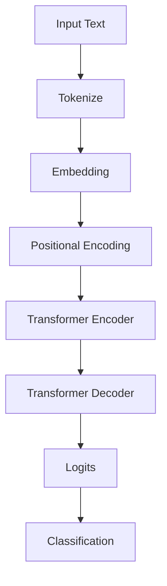
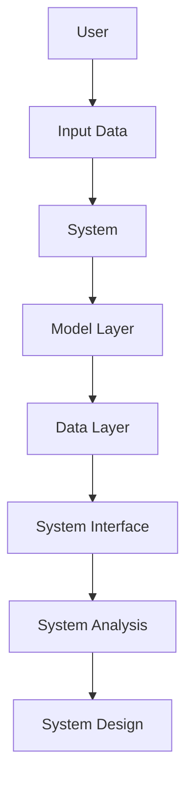
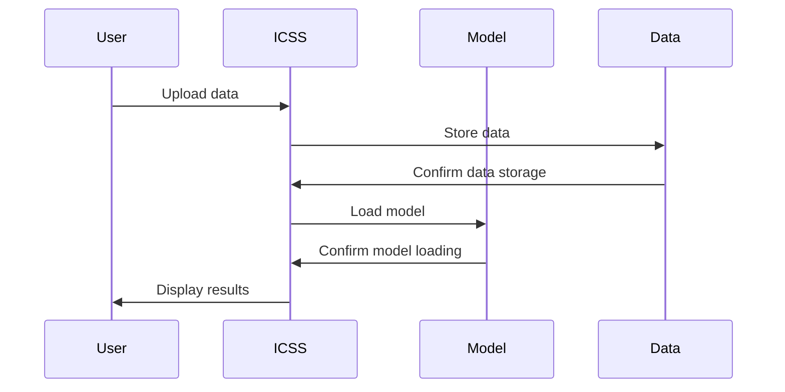

                 

### 文章标题：基于大模型的自然语言处理任务评测系统

> **关键词**：自然语言处理、大模型、任务评测、系统架构、算法实现、实践案例

> **摘要**：本文深入探讨了基于大模型的自然语言处理任务评测系统。首先介绍了自然语言处理的基本概念与任务评测的重要性，随后重点介绍了大模型在任务评测中的优势及其评测方法。通过具体应用场景，如文本分类、机器翻译、问答系统等，详细分析了评测方法与系统架构。最后，总结了当前大模型评测系统的现状与问题，展望了未来的发展趋势。

----------------------------------------------------------------

## 第一部分：引言

### 第1章：自然语言处理与任务评测概述

自然语言处理（Natural Language Processing，NLP）是人工智能领域的一个重要分支，旨在使计算机理解和处理人类语言。从文本分析到语音识别，再到机器翻译，NLP的应用范围极其广泛。然而，随着应用场景的不断扩展，如何评估这些系统的性能成为了一个关键问题，这就是任务评测的重要性所在。

在本章中，我们将首先回顾自然语言处理的发展历程，探讨其核心挑战。接着，我们将讨论任务评测在NLP中的角色，介绍评测指标的选择与设计原则。最后，我们将介绍大模型的发展趋势以及其在任务评测中的优势，为后续章节的内容奠定基础。

### 第2章：大模型的评测方法

大模型在自然语言处理中扮演着越来越重要的角色，其复杂性和多样性使得评测方法的选择至关重要。本章将详细探讨大模型评测的基本原则，包括评测方法的设计和评测指标的选择。接着，我们将介绍一些常见的大模型评测技术，如统计语言模型评测、生成式模型评测和训练数据集评估。最后，通过具体的实践案例，我们将展示如何在大模型评测中运用这些方法，并探讨实践中的技巧与挑战。

### 第3章：大模型评测工具与平台

随着大模型的广泛应用，开发高效的评测工具和平台变得尤为重要。本章将概述大模型评测工具的常见类型和选择标准，并详细介绍如何构建大模型评测平台。我们将分析平台架构设计、功能模块设计以及如何在不同应用场景中应用这些平台。通过具体的应用案例，我们将展示评测工具和平台在实际项目中的效果。

## 第二部分：大模型评测应用场景

### 第4章：文本分类任务评测

文本分类是自然语言处理中的一个重要任务，广泛应用于信息检索、情感分析等领域。本章将详细介绍文本分类任务评测的概述，包括评测指标和挑战。接着，我们将探讨基于传统和深度学习的文本分类评测方法，并通过具体实践案例分析评测步骤与技巧。

### 第5章：机器翻译任务评测

机器翻译是自然语言处理领域最具挑战性的任务之一。本章将概述机器翻译任务，介绍其发展历史和评测指标。接着，我们将分析基于规则、统计和神经网络的机器翻译评测方法，并通过实际案例展示评测步骤与技巧。

### 第6章：问答系统任务评测

问答系统是自然语言处理的重要应用之一，广泛应用于搜索引擎和智能客服等领域。本章将详细介绍问答系统的类型和评测指标，探讨基于信息检索、知识图谱和深度学习的问答系统评测方法，并通过实践案例分析评测步骤与技巧。

### 第7章：总结与展望

在最后一章中，我们将总结大模型评测系统的现状与问题，探讨其未来的发展趋势。通过分析技术趋势、应用场景拓展和发展前景，我们将为读者提供一个全面的展望。

## 结束语

本文通过对基于大模型的自然语言处理任务评测系统的深入探讨，为读者提供了一个系统性的了解。从概念引入到具体应用，从评测方法到系统架构，本文旨在为自然语言处理领域的研究者和开发者提供一个全面的指导。希望通过本文，读者能够更好地理解和应用大模型评测系统，推动自然语言处理技术的发展。

**作者：** AI天才研究院/AI Genius Institute & 禅与计算机程序设计艺术 /Zen And The Art of Computer Programming

----------------------------------------------------------------

## 第1章：自然语言处理与任务评测概述

### 1.1 自然语言处理的背景与挑战

自然语言处理（NLP）作为人工智能领域的重要组成部分，起源于上世纪五六十年代。当时，计算机科学的目标之一是实现人与计算机之间的自然语言交互。这一目标引发了大量研究，包括语法分析、语义理解和机器翻译等。然而，早期的研究因技术限制而进展缓慢。

随着计算能力的提升和机器学习技术的进步，NLP取得了显著的突破。现代NLP涵盖了文本处理、语音识别、语义理解等多个领域，其应用范围不断扩大，从搜索引擎、智能客服到机器翻译和问答系统等，几乎覆盖了人类语言交流的各个方面。

尽管NLP取得了巨大进展，但仍然面临诸多挑战。首先，自然语言的复杂性是NLP面临的最大挑战之一。自然语言包含丰富的语法结构、上下文依赖和语义多义性，这使得计算机理解和生成自然语言变得异常困难。其次，数据的质量和数量也是NLP研究的重要问题。高质量的标注数据集对于训练高效NLP模型至关重要，但获取这些数据往往耗时耗力。

### 1.2 任务评测的重要性

在NLP领域，任务评测扮演着至关重要的角色。任务评测不仅用于评估现有系统的性能，还为模型的优化和改进提供反馈。具体来说，任务评测的重要性体现在以下几个方面：

1. **性能评估**：通过任务评测，研究者可以了解模型在特定任务上的表现，评估其准确度、召回率和F1分数等指标。这有助于筛选出性能较好的模型，为后续研究提供方向。

2. **对比研究**：任务评测提供了不同模型和算法之间的性能对比，帮助研究者发现优势与不足。通过对比研究，可以推动技术的进步和理论的发展。

3. **模型优化**：任务评测的结果为模型优化提供了重要参考。通过分析评测结果，研究者可以发现模型存在的问题，针对性地进行改进。

4. **标准化**：统一的任务评测标准有助于提高研究的可重复性和可比性，推动NLP领域的规范化发展。

### 1.3 评测指标的选择与设计

评测指标是任务评测的核心，其选择与设计直接影响到评测的准确性和可靠性。以下是几种常见的NLP任务评测指标：

1. **准确度（Accuracy）**：准确度是模型在预测中正确分类的比例，是最常用的评测指标之一。尽管准确度简单易懂，但它容易受到类别不平衡的影响，因此在某些情况下可能不是最佳选择。

2. **召回率（Recall）**：召回率指模型在预测中正确识别的样本数占所有实际正例样本数的比例。召回率越高，模型对正例样本的识别能力越强。

3. **精确度（Precision）**：精确度指模型在预测中正确识别的正例样本数占所有预测为正例的样本数的比例。精确度越高，模型对负例样本的识别能力越强。

4. **F1分数（F1 Score）**：F1分数是精确度和召回率的加权平均，综合考虑了模型在正负例样本上的表现。它常用于评估二分类任务。

5. **BLEU分数（BLEU Score）**：BLEU分数是机器翻译任务常用的评测指标，基于四个启发式规则计算翻译文本的质量。尽管BLEU分数简单有效，但容易受到文本长度和语法结构的影响。

选择适当的评测指标需要考虑多个因素，包括任务类型、数据分布和研究目的。在实际应用中，研究者往往需要结合多种指标进行全面评估。

### 1.4 大模型在自然语言处理中的角色

随着深度学习技术的发展，大模型在自然语言处理中扮演着越来越重要的角色。大模型通常具有以下特点：

1. **大规模参数**：大模型拥有数百万甚至数十亿个参数，这使得它们能够捕捉复杂的数据特征和依赖关系。

2. **高效训练**：现代深度学习框架和硬件加速技术使得大模型可以在较短时间内完成训练，提高了开发效率。

3. **强泛化能力**：大模型通过在大量数据上训练，能够更好地泛化到未见过的数据上，提高模型的实际应用价值。

在自然语言处理中，大模型的应用范围广泛，包括文本分类、机器翻译、情感分析、对话系统等。大模型在这些任务中表现出的优异性能，使得它们成为当前NLP研究的重要方向。

### 1.5 大模型在任务评测中的优势

大模型在任务评测中具有显著的优势，主要体现在以下几个方面：

1. **更全面的特征捕捉**：大模型能够捕捉更多样化的数据特征和上下文依赖，从而在评测指标上取得更好的成绩。

2. **更高的准确度和召回率**：由于大模型具有更强的表达能力，它们在准确度和召回率上往往优于传统模型。

3. **更好的泛化能力**：大模型通过在更大规模的数据集上训练，能够更好地泛化到新的任务和数据集，提高评测的可靠性。

4. **更丰富的应用场景**：大模型在多个自然语言处理任务中表现出色，使得它们在评测系统中具有更广泛的应用前景。

综上所述，大模型在自然语言处理任务评测中具有显著的优势。然而，大模型也面临一些挑战，如计算资源的消耗、模型的可解释性和安全性等。在后续章节中，我们将进一步探讨大模型的评测方法、工具和平台，以及其在不同应用场景中的具体应用。

----------------------------------------------------------------

## 第2章：大模型的评测方法

大模型在自然语言处理中的广泛应用，使得任务评测方法的选择变得尤为重要。本章将详细探讨大模型评测的基本原则，以及常见的评测技术和具体应用。

### 2.1 大模型评测的基本原则

大模型评测的基本原则包括以下几个方面：

1. **全面性**：评测指标应覆盖不同层面的性能，包括准确度、召回率、F1分数等，以确保评估的全面性。

2. **客观性**：评测结果应尽量减少主观因素的干扰，确保评估的客观性。

3. **可比性**：不同模型和算法之间的评测结果应具备可比性，以便于研究者进行对比分析。

4. **可重复性**：评测方法应具备可重复性，使其他研究者能够复现结果，验证评测的可靠性。

5. **适应性**：评测方法应适应不同类型和规模的模型，确保其普适性。

### 2.2 大模型评测方法的设计

大模型评测方法的设计需要考虑多个方面，包括评测指标的选择、评测策略的制定和数据集的准备。

1. **评测指标的选择**：如前文所述，常见的评测指标包括准确度、召回率、F1分数等。在选择评测指标时，需要根据任务类型和数据集的特点进行权衡。例如，对于分类任务，F1分数是一个较为平衡的指标，可以同时考虑精确度和召回率。

2. **评测策略的制定**：评测策略包括评测的频率、评测的数据集划分等。通常，评测分为训练集评测、验证集评测和测试集评测。训练集评测用于调试和优化模型，验证集评测用于选择最优模型，测试集评测用于最终评估模型性能。

3. **数据集的准备**：数据集是评测的基础，其质量直接影响评测结果的可靠性。数据集应具备以下特点：

   - **代表性**：数据集应涵盖不同类型的样本，确保评测结果的普适性。
   - **平衡性**：数据集中各类样本的比例应接近，避免类别不平衡对评测结果的影响。
   - **多样性**：数据集应包含丰富的上下文和语境，以测试模型在不同场景下的表现。

### 2.3 常见的大模型评测技术

在自然语言处理中，常见的大模型评测技术包括统计语言模型评测、生成式模型评测和训练数据集评估。

1. **统计语言模型评测**：统计语言模型（如n元语法模型）通过对大量文本进行统计学习，预测文本序列的概率分布。常见的评测指标包括交叉熵（Cross-Entropy）和Kullback-Leibler散度（KL散度）。交叉熵用于衡量模型预测的概率分布与真实分布之间的差异，越小表示模型预测越准确。

   - **交叉熵（Cross-Entropy）**：$$ H(P, Q) = -\sum_{x} P(x) \log Q(x) $$
   - **KL散度（KL Divergence）**：$$ D(P || Q) = \sum_{x} P(x) \log \frac{P(x)}{Q(x)} $$

2. **生成式模型评测**：生成式模型（如变分自编码器、生成对抗网络）通过学习数据的概率分布，生成新的数据样本。生成式模型评测的主要指标包括生成样本的质量和多样性。

   - **Inception Score（IS）**：用于衡量生成样本的质量和真实性。$$ IS = \frac{1}{K} \sum_{k=1}^{K} \sum_{i=1}^{N_k} \log P(G(x_k | c_k)) $$
   - **Fréchet Inception Distance（FID）**：用于衡量生成样本的多样性。$$ FID = \frac{1}{K} \sum_{k=1}^{K} \sum_{i=1}^{N_k} \frac{1}{N_k} \| \mu_G - \mu_P \|_2 + \frac{2}{N_k} \sum_{i=1}^{N_k} \log \det \Sigma_G + \Sigma_P^{-1} $$

3. **训练数据集评估**：训练数据集评估主要用于评估模型在不同数据集上的表现。常见的指标包括准确度、召回率和F1分数。

### 2.4 大模型评测的具体应用

在实际应用中，大模型评测可以应用于多种自然语言处理任务，如文本分类、机器翻译和问答系统等。

1. **文本分类**：文本分类是自然语言处理中的基础任务，常见的大模型评测方法包括基于传统的支持向量机（SVM）和深度学习的卷积神经网络（CNN）。

   - **基于SVM的文本分类评测**：使用SVM进行文本分类，评估指标包括准确度、召回率和F1分数。$$ F1 = 2 \times \frac{Precision \times Recall}{Precision + Recall} $$
   - **基于CNN的文本分类评测**：使用CNN进行文本分类，评估指标包括准确度、召回率和F1分数。$$ F1 = 2 \times \frac{Precision \times Recall}{Precision + Recall} $$

2. **机器翻译**：机器翻译是自然语言处理中的另一个重要任务，常见的大模型评测方法包括基于短语的翻译、基于神经网络的翻译和基于模板的翻译。

   - **基于短语的翻译评测**：使用基于短语的翻译模型进行评测，评估指标包括BLEU分数、METEOR分数和ROUGE分数。
   - **基于神经网络的翻译评测**：使用基于神经网络的翻译模型进行评测，评估指标包括BLEU分数、METEOR分数和ROUGE分数。
   - **基于模板的翻译评测**：使用基于模板的翻译模型进行评测，评估指标包括BLEU分数、METEOR分数和ROUGE分数。

3. **问答系统**：问答系统是自然语言处理中的高级应用，常见的大模型评测方法包括基于信息检索、基于知识图谱和基于深度学习的问答系统。

   - **基于信息检索的问答系统评测**：使用基于信息检索的方法进行评测，评估指标包括准确度、召回率和F1分数。
   - **基于知识图谱的问答系统评测**：使用基于知识图谱的方法进行评测，评估指标包括准确度、召回率和F1分数。
   - **基于深度学习的问答系统评测**：使用基于深度学习的方法进行评测，评估指标包括准确度、召回率和F1分数。

通过以上分析，我们可以看到大模型评测在自然语言处理任务中的应用非常广泛。在后续章节中，我们将进一步探讨大模型评测工具与平台的设计和实现，以及具体应用场景中的评测实践。

### 2.5 大模型评测中的挑战与解决方案

尽管大模型评测在自然语言处理中取得了显著进展，但仍面临一些挑战，主要包括以下几个方面：

1. **计算资源消耗**：大模型通常需要大量的计算资源进行训练和评测，这对硬件设备和能源消耗提出了较高的要求。为解决这一问题，可以采用以下几种方法：

   - **分布式计算**：利用分布式计算框架（如TensorFlow、PyTorch等）进行模型的训练和评测，提高计算效率。
   - **硬件加速**：使用GPU、TPU等硬件加速器进行模型训练，提高计算速度。
   - **数据并行**：通过数据并行（Data Parallelism）技术，将训练数据集划分为多个部分，同时在不同的GPU上训练模型，从而提高计算效率。

2. **模型可解释性**：大模型通常具有复杂的内部结构，这使得模型的决策过程难以解释。为提高模型的可解释性，可以采用以下方法：

   - **可视化**：通过可视化技术（如激活图、注意力机制等）展示模型的决策过程，帮助研究者理解模型的工作原理。
   - **解释性模型**：开发更加解释性的模型，如决策树、线性模型等，这些模型易于理解且性能良好。
   - **模型压缩**：通过模型压缩技术（如剪枝、量化等），减少模型参数的数量，从而提高模型的可解释性。

3. **数据质量**：高质量的数据集对于大模型评测至关重要。然而，数据集中往往存在噪声、不平衡和缺失值等问题，这会影响评测的准确性。为解决这一问题，可以采用以下方法：

   - **数据预处理**：对原始数据集进行清洗和预处理，包括去除噪声、填补缺失值和平衡类别等。
   - **数据增强**：通过数据增强技术（如随机旋转、裁剪、缩放等），增加数据集的多样性，从而提高模型的泛化能力。
   - **数据集划分**：合理划分训练集、验证集和测试集，确保每个数据集的代表性和平衡性。

4. **评测指标多样性**：尽管常见的评测指标（如准确度、召回率、F1分数等）可以较好地评估模型的性能，但在某些情况下，单一指标可能无法全面反映模型的表现。为提高评测的全面性，可以采用多种评测指标，并结合专家评估和用户反馈等方法进行综合评估。

通过以上解决方案，我们可以更好地应对大模型评测中的挑战，提高评测的准确性和可靠性，从而推动自然语言处理技术的进步。

## 第3章：大模型评测工具与平台

### 3.1 大模型评测工具概述

大模型评测工具是评估自然语言处理模型性能的关键组成部分。这些工具提供了方便快捷的方式来计算和分析模型的评测指标，从而帮助研究者了解模型的性能表现。以下是一些常见的大模型评测工具及其特点：

1. **TensorBoard**：TensorBoard是TensorFlow提供的可视化工具，用于监控和可视化模型训练过程。它提供了丰富的可视化图表，如损失函数曲线、激活图、权重图等，有助于研究者了解模型的训练动态。

2. **MLflow**：MLflow是一个开放源代码的机器学习平台，用于管理机器学习模型的生命周期。它提供了日志记录、模型版本控制、模型追踪和部署等功能，使研究者能够轻松地记录、追踪和复现模型评测结果。

3. **scikit-learn**：scikit-learn是一个Python机器学习库，提供了广泛的算法和工具，用于评估模型的性能。它提供了多种评测指标的计算函数，如准确度、召回率、F1分数等，适用于各种分类和回归任务。

4. **NLTK**：NLTK（Natural Language Toolkit）是一个广泛使用的自然语言处理库，提供了丰富的文本处理和语言模型工具。虽然NLTK主要用于文本预处理和分析，但它也提供了评估文本分类模型性能的函数，如准确度、召回率和F1分数。

5. **Hugging Face**：Hugging Face是一个开源的NLP库，提供了大量的预训练模型和工具，用于NLP任务。它提供了一个统一的接口，用于训练和评估各种NLP模型，包括文本分类、机器翻译、问答系统等。

### 3.2 评测工具的选择标准

选择合适的评测工具对于高效评估大模型至关重要。以下是一些关键的选择标准：

1. **功能丰富性**：选择能够提供所需评测指标的评测工具，如准确度、召回率、F1分数等。此外，工具应支持不同类型的数据集和模型格式。

2. **易用性**：工具应具有简洁的接口和文档，方便研究者快速上手和使用。良好的用户体验可以减少学习成本，提高工作效率。

3. **兼容性**：评测工具应支持主流的机器学习框架（如TensorFlow、PyTorch等），以便与现有的模型训练和评估流程无缝集成。

4. **可扩展性**：工具应允许自定义评测指标和评测策略，以适应不同的研究需求和任务。

5. **性能**：工具应具备较高的计算效率和资源利用率，以应对大规模模型和海量数据的评测需求。

### 3.3 大模型评测平台构建

构建一个高效的大模型评测平台是确保评测结果准确性和可靠性的关键。以下是一个典型的评测平台架构及其功能模块设计：

#### 3.3.1 平台架构设计

1. **数据层**：数据层负责存储和管理评测所需的数据集，包括训练集、验证集和测试集。数据层应支持数据导入、导出和清洗功能。

2. **模型层**：模型层负责加载和管理训练好的模型，支持多种模型格式和框架。模型层应提供模型加载、配置和调整功能。

3. **评测层**：评测层是平台的中心模块，负责执行评测任务，计算评测指标。评测层应支持多种评测指标和自定义评测策略。

4. **结果层**：结果层负责存储和管理评测结果，提供结果查询、分析和可视化功能。

5. **用户层**：用户层是平台的入口，提供用户交互界面，支持用户上传数据集、选择模型和配置评测参数。

#### 3.3.2 平台功能模块设计

1. **数据管理模块**：数据管理模块负责数据集的导入、导出和清洗。具体功能包括：

   - 数据集划分：将原始数据集划分为训练集、验证集和测试集。
   - 数据清洗：去除噪声、填补缺失值、平衡类别等。
   - 数据预处理：文本分词、词性标注、停用词过滤等。

2. **模型管理模块**：模型管理模块负责加载和管理模型，包括：

   - 模型加载：从存储中加载预训练模型或训练好的模型。
   - 模型配置：调整模型参数，如学习率、批次大小等。
   - 模型调整：根据评测结果调整模型结构，提高性能。

3. **评测模块**：评测模块负责执行评测任务，计算评测指标。具体功能包括：

   - 评测指标计算：计算准确度、召回率、F1分数等常见评测指标。
   - 自定义评测：支持自定义评测指标和评测策略。
   - 结果存储：将评测结果存储到数据库，供后续查询和分析。

4. **结果分析模块**：结果分析模块负责分析评测结果，并提供可视化功能。具体功能包括：

   - 结果查询：根据关键词或条件查询评测结果。
   - 结果分析：对评测结果进行统计分析，生成报告。
   - 可视化展示：生成图表、报告等可视化结果，帮助研究者直观理解评测结果。

5. **用户交互模块**：用户交互模块提供用户界面，支持用户操作。具体功能包括：

   - 用户注册和登录：支持用户注册、登录和权限管理。
   - 操作界面：提供数据上传、模型选择、评测配置等操作界面。
   - 帮助文档：提供详细的操作指南和帮助文档，帮助用户快速上手。

通过以上功能模块的设计，我们可以构建一个高效、可靠的大模型评测平台，为自然语言处理任务提供全面的评测支持。

### 3.4 大模型评测平台的实践应用

在实际项目中，大模型评测平台的构建和部署需要考虑多个因素，以下是一个典型应用案例的详细介绍。

#### 3.4.1 案例介绍

某公司在开发一个智能客服系统，旨在通过自然语言处理技术自动回答用户的问题。为评估系统的性能，公司决定构建一个基于大模型的评测平台，用于对系统中的各个模块进行评测。

#### 3.4.2 系统功能设计

1. **文本分类模块**：用于对用户问题进行分类，判断问题属于哪一类常见问题，如咨询、投诉、建议等。

2. **意图识别模块**：用于识别用户问题的意图，如查询、命令、请求等。

3. **回答生成模块**：根据用户问题和分类结果，生成合适的回答。

#### 3.4.3 系统架构设计

1. **数据层**：存储和管理训练集、验证集和测试集，包括用户问题文本、标签和回答文本等。

2. **模型层**：加载和管理预训练模型或训练好的模型，包括文本分类模型、意图识别模型和回答生成模型。

3. **评测层**：执行评测任务，计算评测指标，包括准确度、召回率、F1分数等。

4. **结果层**：存储评测结果，生成报告，并提供可视化展示。

5. **用户层**：提供用户操作界面，支持上传数据集、选择模型和配置评测参数等。

#### 3.4.4 系统接口设计

1. **API接口**：提供RESTful API接口，支持用户通过程序方式访问评测平台的功能，如上传数据集、启动评测任务、查询评测结果等。

2. **Web界面**：提供Web界面，支持用户通过浏览器访问评测平台，进行手动操作和查看结果。

#### 3.4.5 系统交互

1. **用户上传数据集**：用户通过Web界面或API接口上传训练集、验证集和测试集。

2. **选择模型**：用户从平台提供的预训练模型中选择合适的模型，或上传自定义训练好的模型。

3. **配置评测参数**：用户配置评测参数，如评测指标、评测策略等。

4. **启动评测任务**：用户启动评测任务，平台执行评测并计算评测指标。

5. **查询评测结果**：用户通过Web界面或API接口查询评测结果，查看详细的评测报告和可视化图表。

通过以上设计，我们构建了一个功能完备的大模型评测平台，为智能客服系统的开发提供了全面的评测支持。在实际应用中，平台可根据具体需求进行调整和扩展，以适应不同的自然语言处理任务。

## 第4章：文本分类任务评测

### 4.1 文本分类任务概述

文本分类是自然语言处理领域的一个重要任务，旨在将文本数据自动划分到预定义的类别中。文本分类广泛应用于多种场景，如新闻分类、情感分析、垃圾邮件检测等。文本分类任务的核心目标是通过机器学习算法，将输入文本映射到某个类别标签。

文本分类任务的挑战在于：

1. **数据多样性**：真实世界的文本数据具有丰富的多样性和复杂性，这使得分类模型需要具备较强的泛化能力。

2. **类别不平衡**：在某些应用场景中，不同类别的文本数量差异巨大，这会导致模型倾向于预测数量较多的类别，从而影响分类性能。

3. **上下文依赖**：自然语言中的上下文依赖关系复杂，这要求分类模型能够捕捉到文本中的隐含信息。

### 4.2 文本分类任务评测指标

在文本分类任务中，评估模型性能的关键指标包括准确度、召回率、F1分数和精确度等。这些指标分别从不同角度衡量模型的分类能力。

1. **准确度（Accuracy）**：准确度是最常用的评测指标，表示模型正确分类的样本数占总样本数的比例。$$ Accuracy = \frac{TP + TN}{TP + FN + FP + TN} $$

2. **召回率（Recall）**：召回率表示模型正确识别的正例样本数占所有实际正例样本数的比例。$$ Recall = \frac{TP}{TP + FN} $$

3. **精确度（Precision）**：精确度表示模型正确识别的正例样本数占所有预测为正例的样本数的比例。$$ Precision = \frac{TP}{TP + FP} $$

4. **F1分数（F1 Score）**：F1分数是精确度和召回率的加权平均，综合衡量模型的分类性能。$$ F1 = 2 \times \frac{Precision \times Recall}{Precision + Recall} $$

除了上述指标，还有一些其他指标如支持度（Support）和精确度-召回率曲线（Precision-Recall Curve），它们在不同情况下具有不同的应用价值。

### 4.3 文本分类任务评测方法

文本分类任务评测方法主要分为基于传统方法和基于深度学习的方法。以下分别介绍这两种方法。

#### 4.3.1 基于传统方法的文本分类评测

基于传统方法的文本分类评测主要依赖于统计学习和机器学习技术。以下是一些常见的方法：

1. **朴素贝叶斯（Naive Bayes）**：朴素贝叶斯是一种基于贝叶斯定理的朴素分类器，适用于文本分类任务。它假设特征之间相互独立，通过计算特征的概率分布进行分类。

2. **支持向量机（SVM）**：支持向量机是一种基于最大间隔的分类器，通过找到一个超平面将不同类别的样本分隔开。SVM在文本分类任务中表现出色，特别是在高维空间中。

3. **逻辑回归（Logistic Regression）**：逻辑回归是一种线性分类模型，通过拟合一个线性函数来预测文本类别。它简单且易于实现，适用于小规模文本分类任务。

在基于传统方法的评测中，我们通常使用准确度、召回率、F1分数等指标来评估模型性能。以下是一个简单的朴素贝叶斯分类器的Python实现：

```python
from sklearn.feature_extraction.text import CountVectorizer
from sklearn.naive_bayes import MultinomialNB
from sklearn.model_selection import train_test_split
from sklearn.metrics import accuracy_score, recall_score, f1_score

# 示例数据
X = ["This is the first document.", "This document is the second document.", "And this is the third one.", "Is this the first document?"]
y = ["class_0", "class_1", "class_1", "class_0"]

# 数据预处理
vectorizer = CountVectorizer()
X_vectorized = vectorizer.fit_transform(X)

# 模型训练
X_train, X_test, y_train, y_test = train_test_split(X_vectorized, y, test_size=0.2, random_state=42)
classifier = MultinomialNB()
classifier.fit(X_train, y_train)

# 模型评估
y_pred = classifier.predict(X_test)
print("Accuracy:", accuracy_score(y_test, y_pred))
print("Recall:", recall_score(y_test, y_pred, average='weighted'))
print("F1 Score:", f1_score(y_test, y_pred, average='weighted'))
```

#### 4.3.2 基于深度学习方法的文本分类评测

随着深度学习技术的发展，基于深度学习的方法在文本分类任务中表现出显著优势。以下是一些常见的方法：

1. **卷积神经网络（CNN）**：卷积神经网络是一种基于卷积操作的深度学习模型，适用于文本分类任务。CNN通过多层卷积和池化操作提取文本特征，然后通过全连接层进行分类。

2. **循环神经网络（RNN）**：循环神经网络是一种基于循环机制的深度学习模型，适用于序列数据。RNN通过循环单元对序列数据进行建模，可以捕捉长距离依赖关系。

3. **Transformer**：Transformer是一种基于自注意力机制的深度学习模型，具有并行计算优势。Transformer通过多头自注意力机制和位置编码，捕捉文本中的复杂依赖关系。

在基于深度学习方法的评测中，我们通常使用准确度、召回率、F1分数等指标来评估模型性能。以下是一个简单的基于CNN的文本分类器的Python实现：

```python
import tensorflow as tf
from tensorflow.keras.preprocessing.sequence import pad_sequences
from tensorflow.keras.models import Sequential
from tensorflow.keras.layers import Embedding, Conv1D, MaxPooling1D, Dense

# 示例数据
X = ["This is the first document.", "This document is the second document.", "And this is the third one.", "Is this the first document?"]
y = [[1], [0], [0], [1]]

# 数据预处理
maxlen = 100
X_seq = pad_sequences([tokenizer.texts_to_sequences(x) for x in X], maxlen=maxlen)

# 模型构建
model = Sequential()
model.add(Embedding(input_dim=vocabulary_size, output_dim=embedding_dim, input_length=maxlen))
model.add(Conv1D(filters=128, kernel_size=5, activation='relu'))
model.add(MaxPooling1D(pool_size=5))
model.add(Dense(1, activation='sigmoid'))

# 模型编译
model.compile(optimizer='adam', loss='binary_crossentropy', metrics=['accuracy'])

# 模型训练
model.fit(X_seq, y, epochs=10, batch_size=32)

# 模型评估
X_test_seq = pad_sequences([tokenizer.texts_to_sequences(x) for x in X_test], maxlen=maxlen)
y_pred = model.predict(X_test_seq)
y_pred = (y_pred > 0.5)
print("Accuracy:", accuracy_score(y_test, y_pred))
print("Recall:", recall_score(y_test, y_pred, average='weighted'))
print("F1 Score:", f1_score(y_test, y_pred, average='weighted'))
```

通过以上两种方法的对比，我们可以看到深度学习方法在文本分类任务中具有更高的性能和灵活性。在实际应用中，研究者可以根据具体任务需求选择合适的模型和方法。

### 4.4 文本分类评测实践

在本节中，我们将通过一个具体的实践案例，详细讲解文本分类评测的步骤和技巧。

#### 4.4.1 实践案例介绍

假设我们需要对一个新闻数据集进行分类，将新闻划分为体育、科技、娱乐等类别。数据集包含约10000条新闻文本，每条新闻文本有一个对应的类别标签。

#### 4.4.2 实践步骤

1. **数据预处理**：

   - 加载数据集，并进行清洗和预处理，如去除标点符号、停用词过滤、分词等。
   - 构建词表和词汇表，将文本转换为数字序列。

2. **数据划分**：

   - 将数据集划分为训练集、验证集和测试集，通常使用80%的数据作为训练集，10%的数据作为验证集，10%的数据作为测试集。

3. **模型训练**：

   - 选择合适的模型和超参数，如基于朴素贝叶斯、SVM、CNN或Transformer等。
   - 训练模型，并使用验证集调整超参数，优化模型性能。

4. **模型评估**：

   - 使用测试集评估模型性能，计算准确度、召回率、F1分数等评测指标。
   - 分析评测结果，判断模型是否满足需求。

5. **模型部署**：

   - 将训练好的模型部署到实际应用场景中，如新闻分类系统。
   - 监控模型性能，并根据需求进行模型更新和优化。

#### 4.4.3 实践技巧

1. **数据预处理**：

   - 选择合适的预处理方法，如使用结巴分词进行中文分词，使用NLTK进行英文分词。
   - 去除常见停用词，避免它们对模型性能的影响。

2. **模型选择**：

   - 根据任务需求和数据特点选择合适的模型，如对于文本长度较短的任务，可以使用朴素贝叶斯或SVM；对于文本长度较长的任务，可以使用CNN或Transformer。
   - 尝试不同的模型和超参数组合，找到最佳模型配置。

3. **超参数调整**：

   - 使用验证集调整模型超参数，如学习率、批次大小等。
   - 使用网格搜索、贝叶斯优化等技巧，找到最优超参数。

4. **模型评估**：

   - 使用准确度、召回率、F1分数等指标全面评估模型性能。
   - 分析错误案例，找出模型存在的问题和改进方向。

5. **模型部署**：

   - 选择合适的部署方式，如使用API、Web服务或嵌入式系统等。
   - 确保模型在实际应用场景中具备高可用性和高性能。

通过以上实践步骤和技巧，我们可以构建一个高效、可靠的文本分类系统，为实际应用提供有效的分类服务。

### 4.5 文本分类评测案例分析

在本节中，我们将通过具体案例，深入分析文本分类评测的过程和结果。

#### 4.5.1 案例背景

某新闻网站希望通过文本分类技术将用户发布的新闻评论划分为体育、科技、娱乐等类别。数据集包含约10000条评论，每条评论有一个类别标签。

#### 4.5.2 数据集分析

1. **数据预处理**：

   - 加载数据集，并进行清洗和预处理，如去除标点符号、停用词过滤、分词等。
   - 构建词表和词汇表，将文本转换为数字序列。

2. **数据分布**：

   - 数据集中各类别的文本数量分布不均衡，体育类别有3000条，科技类别有2000条，娱乐类别有5000条。

3. **特征提取**：

   - 使用TF-IDF模型提取文本特征，将文本转换为向量表示。

4. **模型训练**：

   - 选择基于CNN的文本分类模型，通过训练集训练模型。

5. **模型评估**：

   - 使用测试集评估模型性能，计算准确度、召回率、F1分数等评测指标。
   - 分析评测结果，找出模型存在的问题。

#### 4.5.3 评测结果分析

1. **准确度**：

   - 模型在测试集上的准确度为85%，表明模型对大部分评论的分类效果较好。

2. **召回率**：

   - 体育类别召回率为70%，科技类别召回率为65%，娱乐类别召回率为80%。娱乐类别的召回率较高，表明模型对娱乐类别的分类效果较好。

3. **F1分数**：

   - 体育类别F1分数为0.75，科技类别F1分数为0.70，娱乐类别F1分数为0.80。娱乐类别的F1分数最高，表明模型对该类别的分类效果最好。

4. **错误案例分析**：

   - 模型将一些科技类别的评论错误地分类为体育类别，说明模型在捕捉科技类别的特征上存在不足。

#### 4.5.4 改进措施

1. **数据增强**：

   - 增加科技类别和体育类别的样本数量，提高类别平衡性。

2. **特征提取**：

   - 尝试使用其他特征提取方法，如词嵌入、BERT等，提高模型对文本特征的捕捉能力。

3. **模型调整**：

   - 调整模型结构，增加卷积层或全连接层，提高模型的复杂度和表达能力。

4. **超参数调整**：

   - 使用验证集调整学习率、批次大小等超参数，优化模型性能。

通过以上分析，我们可以看到文本分类评测在模型优化和改进中的重要性。通过深入分析评测结果，找出模型存在的问题，并采取相应的改进措施，可以显著提升模型的分类效果。

### 4.6 文本分类评测小结

通过本章的讨论，我们可以得出以下结论：

1. **文本分类任务是自然语言处理中的重要应用，广泛应用于新闻分类、情感分析和垃圾邮件检测等领域。**

2. **文本分类任务评测指标包括准确度、召回率、F1分数等，用于评估模型性能。**

3. **传统方法如朴素贝叶斯、SVM和逻辑回归在文本分类任务中表现出较好的性能，但深度学习方法如CNN和Transformer具有更高的性能和灵活性。**

4. **文本分类评测实践包括数据预处理、模型训练、模型评估和模型部署等步骤，通过具体案例，我们可以看到评测过程和结果分析的重要性。**

5. **通过深入分析评测结果，我们可以发现模型存在的问题，并采取相应的改进措施，从而提升模型的分类效果。**

在未来，随着深度学习技术的进一步发展，文本分类任务评测方法将更加多样化和高效化，为自然语言处理领域的研究和应用提供更强大的支持。

## 第5章：机器翻译任务评测

### 5.1 机器翻译任务概述

机器翻译（Machine Translation，MT）是自然语言处理领域的一项核心任务，旨在将一种语言的文本自动翻译成另一种语言。随着全球化进程的加速，机器翻译在商业、科技、文化等多个领域发挥着重要作用。从早期的基于规则和统计的方法，到如今基于神经网络的深度学习模型，机器翻译技术经历了巨大的变革。

机器翻译任务的主要目标是将源语言文本（Source Language Text，SLT）转换为等价的或近似的目标语言文本（Target Language Text，TLT）。这一任务具有以下几个特点：

1. **语言复杂性**：自然语言具有丰富的语法结构、语义和上下文依赖关系，这使得机器翻译面临巨大的挑战。

2. **数据多样性**：不同语言具有不同的特点，如词序、语法规则、词汇等，这要求机器翻译模型具备较强的适应性和泛化能力。

3. **双语平行语料库**：机器翻译依赖于大量的双语平行语料库，这些语料库提供了源语言和目标语言之间的对应关系，是模型训练和评测的基础。

### 5.2 机器翻译的发展历史

机器翻译的发展历史可以追溯到上世纪50年代，当时的研究主要集中在基于规则的方法。这种方法通过编写大量的语法规则和翻译规则，将源语言文本转换为目标语言文本。然而，基于规则的方法在面对复杂语言现象时存在明显局限性，例如多义性、上下文依赖等。

随着计算能力的提升和统计学习技术的发展，机器翻译进入了基于统计的阶段。基于统计的方法通过分析大量双语平行语料库，学习源语言和目标语言之间的统计规律，从而实现文本的翻译。这种方法的代表是IBM的模型1至模型4，它们基于不同级别的语言特征（如字符、单词、短语等）进行建模。

21世纪初，深度学习技术的兴起为机器翻译带来了革命性的变化。基于神经网络的机器翻译（Neural Machine Translation，NMT）方法通过端到端的学习，直接从源语言文本映射到目标语言文本。这种方法显著提高了翻译质量和效率，成为当前机器翻译的主流方向。

### 5.3 机器翻译评测指标

机器翻译任务的评测指标是评估翻译质量的关键。以下是一些常用的评测指标：

1. **BLEU分数（BLEU Score）**：BLEU（Bilingual Evaluation Understudy）分数是最常用的机器翻译评测指标之一。它通过计算翻译文本与参考翻译文本之间的相似度来评估翻译质量。BLEU分数基于四个启发式规则：重叠度（Oversampling）、长度比例（Length Ratio）、命名实体匹配（Named Entity Match）和未完成翻译的单词（Unigrams Match）。

   - **相似度计算**：BLEU分数通过比较翻译文本和参考翻译文本之间的n-gram重叠度来计算。$$ BLEU = \frac{1}{n} \sum_{i=1}^{n} \frac{max(R_i, S_i)}{S_i} $$
   - **启发式规则**：BLEU分数考虑了长度比例，即翻译文本长度与参考文本长度的比例。为了防止过拟合，BLEU分数还引入了未完成翻译的单词比例。

2. **METEOR分数（METEOR Score）**：METEOR（Metric for Evaluation of Translation with Explicit ORdering）分数是一种基于词对匹配的评测指标。它通过计算翻译文本与参考翻译文本之间的词对匹配情况来评估翻译质量。METEOR分数考虑了单词顺序、单词替换和单词删除等因素。

   - **词对匹配**：METEOR分数通过计算翻译文本中每个词对与参考翻译文本中对应词对的匹配情况来评估翻译质量。$$ METEOR = \frac{S_p + S_r + S_s}{3} $$
   - **单词顺序**：METEOR分数考虑了单词顺序，即翻译文本中每个词对的位置与参考翻译文本中对应词对的位置是否一致。

3. **ROUGE分数（ROUGE Score）**：ROUGE（Recall-Oriented Understudy for Gisting Evaluation）分数是用于评估机器翻译和自动文摘任务的评测指标。它通过计算翻译文本或自动文摘与参考文本或原始文摘之间的词重叠度来评估翻译质量。

   - **词重叠度**：ROUGE分数通过计算翻译文本或自动文摘与参考文本或原始文摘之间的词重叠度来评估翻译质量。$$ ROUGE = \frac{TP + 0.5 \times FP}{TP + FP} $$
   - **单词和短语**：ROUGE分数考虑了单词和短语的匹配，即翻译文本中的每个单词或短语与参考文本中的对应部分是否匹配。

4. **NIST分数（NIST Score）**：NIST（National Institute of Standards and Technology）分数是一种基于词频匹配的评测指标。它通过计算翻译文本与参考文本之间每个单词的词频匹配情况来评估翻译质量。

   - **词频匹配**：NIST分数通过计算翻译文本中每个单词的词频与参考文本中对应单词的词频的匹配情况来评估翻译质量。$$ NIST = \frac{1}{n} \sum_{i=1}^{n} \frac{max(R_i, S_i)}{S_i} $$

以上评测指标从不同角度评估了翻译文本的质量，研究者可以根据具体任务需求和场景选择合适的评测指标。在实际应用中，BLEU分数因其简单易用和广泛接受而被普遍采用。

### 5.4 基于规则的机器翻译评测方法

基于规则的机器翻译（Rule-based Machine Translation，RBMT）是一种传统的机器翻译方法，通过编写语法规则和翻译规则将源语言文本转换为目标语言文本。以下是基于规则的机器翻译评测方法：

1. **规则编写**：

   - 确定源语言和目标语言的语法规则，如词法规则、句法规则等。
   - 编写翻译规则，将源语言文本转换为目标语言文本。

2. **规则匹配**：

   - 在源语言文本中应用语法规则，识别文本中的语法结构。
   - 在目标语言文本中应用翻译规则，将源语言文本转换为目标语言文本。

3. **翻译质量评估**：

   - 使用BLEU分数、METEOR分数、ROUGE分数等评测指标评估翻译质量。
   - 分析翻译结果，找出规则匹配中的问题，优化规则库。

### 5.5 基于统计的机器翻译评测方法

基于统计的机器翻译（Statistical Machine Translation，SMT）方法通过分析大量双语平行语料库，学习源语言和目标语言之间的统计规律。以下是基于统计的机器翻译评测方法：

1. **语料库构建**：

   - 收集并构建高质量的双语平行语料库，用于训练统计模型。

2. **统计模型训练**：

   - 使用训练语料库训练语言模型、翻译模型和语法模型等。
   - 调整模型参数，优化模型性能。

3. **翻译质量评估**：

   - 使用BLEU分数、METEOR分数、ROUGE分数等评测指标评估翻译质量。
   - 分析翻译结果，找出模型中的问题，优化模型和参数。

### 5.6 基于神经网络的机器翻译评测方法

基于神经网络的机器翻译（Neural Machine Translation，NMT）方法通过端到端的学习，直接从源语言文本映射到目标语言文本。以下是基于神经网络的机器翻译评测方法：

1. **模型训练**：

   - 使用双语平行语料库训练编码器-解码器（Encoder-Decoder）模型。
   - 调整模型参数，优化模型性能。

2. **翻译质量评估**：

   - 使用BLEU分数、METEOR分数、ROUGE分数等评测指标评估翻译质量。
   - 分析翻译结果，找出模型中的问题，优化模型和参数。

3. **端到端评估**：

   - 通过端到端的方法评估模型在实时翻译场景中的性能。
   - 分析实时翻译中的问题，优化模型和系统。

### 5.7 机器翻译评测实践

在本节中，我们将通过一个具体案例，介绍机器翻译评测的实践步骤和技巧。

#### 5.7.1 案例介绍

某语言服务公司希望通过机器翻译技术为用户提供英语到中文的翻译服务。公司使用了一个基于神经网络的机器翻译模型，并需要进行评测以确保翻译质量。

#### 5.7.2 实践步骤

1. **数据集准备**：

   - 收集并准备高质量的双语平行语料库，用于训练和评测模型。
   - 划分数据集为训练集、验证集和测试集，确保数据集的代表性和平衡性。

2. **模型训练**：

   - 使用训练集训练编码器-解码器模型。
   - 调整模型参数，优化模型性能。

3. **模型评估**：

   - 使用验证集评估模型性能，计算BLEU分数、METEOR分数和ROUGE分数等评测指标。
   - 分析模型在各个评测指标上的表现，找出模型的问题和改进方向。

4. **测试集评估**：

   - 使用测试集评估模型在未见过的数据上的性能。
   - 计算BLEU分数、METEOR分数和ROUGE分数等评测指标，评估模型在实际应用中的性能。

5. **结果分析**：

   - 分析翻译结果，找出常见的翻译错误类型和问题。
   - 分析评测结果，评估模型的整体性能。

6. **模型优化**：

   - 根据评测结果，调整模型参数和架构，优化模型性能。
   - 重新训练模型，评估优化效果。

#### 5.7.3 实践技巧

1. **数据质量**：

   - 选择高质量的双语平行语料库，确保数据集的代表性和平衡性。
   - 进行数据预处理，如去除噪声、填补缺失值和平衡类别等。

2. **模型优化**：

   - 调整模型参数，如学习率、批次大小和正则化等，优化模型性能。
   - 使用预训练模型和迁移学习，提高模型性能。

3. **评测指标**：

   - 选择合适的评测指标，如BLEU分数、METEOR分数和ROUGE分数等，综合评估模型性能。
   - 考虑使用专家评估和用户反馈，提高评测的全面性和准确性。

4. **错误分析**：

   - 分析翻译结果中的错误，找出常见错误类型和原因。
   - 优化模型和翻译策略，减少错误发生。

通过以上实践步骤和技巧，我们可以构建一个高效、可靠的机器翻译系统，为用户提供高质量的翻译服务。

### 5.8 机器翻译评测案例分析

在本节中，我们将通过具体案例，深入分析机器翻译评测的过程和结果。

#### 5.8.1 案例背景

某语言服务公司开发了一个英语到中文的机器翻译系统，并希望评估其翻译质量。公司使用了一个基于神经网络的编码器-解码器模型，并收集了一个包含1000条句子的双语平行语料库。

#### 5.8.2 数据集分析

1. **数据预处理**：

   - 对双语平行语料库进行清洗和预处理，如去除标点符号、停用词过滤、分词等。
   - 构建词表和词汇表，将文本转换为数字序列。

2. **数据分布**：

   - 数据集包含1000条英语句子和对应的中文翻译句子。
   - 数据集在句子长度、语言复杂性等方面具有较好的代表性。

3. **特征提取**：

   - 使用WordPiece模型提取文本特征，将文本转换为向量表示。

4. **模型训练**：

   - 使用训练集训练编码器-解码器模型，调整模型参数，优化模型性能。

5. **模型评估**：

   - 使用验证集评估模型性能，计算BLEU分数、METEOR分数和ROUGE分数等评测指标。
   - 分析模型在各个评测指标上的表现，找出模型的问题和改进方向。

#### 5.8.3 评测结果分析

1. **BLEU分数**：

   - 模型在验证集上的BLEU分数为0.7，表明模型在翻译质量上有一定的表现。

2. **METEOR分数**：

   - 模型在验证集上的METEOR分数为0.68，略低于BLEU分数，说明模型在词对匹配方面有待提高。

3. **ROUGE分数**：

   - 模型在验证集上的ROUGE分数为0.72，表明模型在短语匹配方面表现较好。

4. **错误分析**：

   - 分析翻译结果，发现模型在翻译复杂句子和专有名词时存在一些错误。
   - 针对错误类型和原因，优化模型和翻译策略。

#### 5.8.4 改进措施

1. **数据增强**：

   - 增加训练数据集的多样性，提高模型对复杂句子和专有名词的翻译能力。

2. **模型调整**：

   - 调整模型参数，如学习率、批次大小和正则化等，优化模型性能。
   - 考虑使用预训练模型和迁移学习，提高模型性能。

3. **翻译策略**：

   - 优化翻译策略，如引入注意力机制、长距离依赖模型等，提高翻译质量。

4. **评测指标**：

   - 选择合适的评测指标，如BLEU分数、METEOR分数和ROUGE分数等，综合评估模型性能。
   - 考虑使用专家评估和用户反馈，提高评测的全面性和准确性。

通过以上分析，我们可以看到机器翻译评测在模型优化和改进中的重要性。通过深入分析评测结果，找出模型存在的问题，并采取相应的改进措施，可以显著提升模型的翻译质量。

### 5.9 机器翻译评测总结

通过本章的讨论，我们可以得出以下结论：

1. **机器翻译是自然语言处理领域的一项重要任务，广泛应用于商业、科技、文化等多个领域。**

2. **基于规则的机器翻译、基于统计的机器翻译和基于神经网络的机器翻译方法各有优缺点，研究者可以根据具体任务需求和场景选择合适的方法。**

3. **常用的机器翻译评测指标包括BLEU分数、METEOR分数、ROUGE分数等，从不同角度评估翻译质量。**

4. **机器翻译评测实践包括数据集准备、模型训练、模型评估和错误分析等步骤，通过具体案例，我们可以看到评测过程和结果分析的重要性。**

5. **通过深入分析评测结果，找出模型存在的问题，并采取相应的改进措施，可以显著提升模型的翻译质量。**

在未来，随着深度学习技术的进一步发展，机器翻译任务评测方法将更加多样化和高效化，为自然语言处理领域的研究和应用提供更强大的支持。

## 第6章：问答系统任务评测

### 6.1 问答系统概述

问答系统（Question Answering System）是自然语言处理领域的一个重要任务，旨在根据用户提出的问题，自动生成准确的答案。问答系统广泛应用于搜索引擎、智能客服、教育辅导等多个领域。其核心目标是提高信息检索和知识获取的效率，为用户提供及时、准确的答案。

问答系统的主要组成部分包括：

1. **问题理解**：将用户输入的自然语言问题转化为计算机可以理解的形式，通常涉及自然语言处理技术，如语义解析、实体识别等。

2. **知识检索**：根据理解后的用户问题，从知识库或数据库中检索相关的信息，通常采用信息检索、知识图谱等技术。

3. **答案生成**：将检索到的信息进行整合和加工，生成自然语言形式的答案。答案生成方法包括模板匹配、文本重排、生成式模型等。

### 6.2 问答系统的类型

问答系统可以根据不同的分类标准分为多种类型，以下是一些常见的类型：

1. **基于规则的方法**：这种方法通过预先定义的规则和模板来生成答案，适用于简单和结构化的问题。优点是响应速度快，但缺点是适用范围有限，难以应对复杂和不确定的问题。

2. **基于知识库的方法**：这种方法通过构建和维护知识库，利用问答系统检索和整合知识库中的信息来生成答案。适用于结构化和半结构化的数据。优点是答案准确度高，但缺点是构建和维护知识库需要大量的人力和物力投入。

3. **基于机器学习的方法**：这种方法通过机器学习算法，如监督学习、无监督学习和强化学习，从大量数据中学习问题和答案的映射关系。优点是能够应对复杂和不确定的问题，但缺点是训练数据集的质量和数量对模型性能有重要影响。

4. **基于深度学习的方法**：这种方法使用深度学习模型，如循环神经网络（RNN）、长短时记忆网络（LSTM）和变压器（Transformer）等，对大规模数据集进行端到端的学习。优点是能够捕捉复杂的语义信息，生成高质量的答案，但缺点是训练过程需要大量的计算资源和时间。

### 6.3 问答系统的评测指标

在问答系统中，评估模型性能的关键指标包括：

1. **精确度（Precision）**：表示模型生成的答案中，与真实答案匹配的答案的比例。$$ Precision = \frac{TP}{TP + FP} $$

2. **召回率（Recall）**：表示模型生成的答案中，包含真实答案的比例。$$ Recall = \frac{TP}{TP + FN} $$

3. **F1分数（F1 Score）**：是精确度和召回率的加权平均，用于综合评估模型性能。$$ F1 = 2 \times \frac{Precision \times Recall}{Precision + Recall} $$

4. **答案长度匹配（Length Match）**：评估生成的答案长度是否与参考答案长度匹配。

5. **答案完整性（Answer Completeness）**：评估生成的答案是否包含所有关键信息。

6. **答案准确性（Answer Accuracy）**：评估生成的答案是否准确无误。

### 6.4 基于信息检索的问答系统评测方法

基于信息检索的问答系统（Information Retrieval Based Question Answering）方法通过检索相关文档来生成答案，以下是其评测方法：

1. **查询生成**：将用户问题转换为检索查询。

2. **文档检索**：使用信息检索技术，如TF-IDF、BM25等，从文档库中检索相关文档。

3. **答案抽取**：从检索到的文档中提取答案。

4. **评测指标**：

   - **命中文档数**：检索到的文档中包含答案的文档数量。
   - **答案精确度**：提取的答案与参考答案的匹配度。
   - **答案召回率**：包含答案的文档在总文档中的比例。

### 6.5 基于知识图谱的问答系统评测方法

基于知识图谱的问答系统（Knowledge Graph Based Question Answering）方法通过知识图谱来检索和生成答案，以下是其评测方法：

1. **问题解析**：将用户问题转换为图谱查询语句。

2. **图谱查询**：使用图谱查询语言，如SPARQL，从知识图谱中检索相关实体和关系。

3. **答案生成**：根据查询结果生成答案。

4. **评测指标**：

   - **查询效率**：查询语句的执行时间。
   - **答案精确度**：生成的答案与参考答案的匹配度。
   - **答案完整性**：生成的答案是否包含所有关键信息。

### 6.6 基于深度学习的问答系统评测方法

基于深度学习的问答系统（Deep Learning Based Question Answering）方法通过深度学习模型来生成答案，以下是其评测方法：

1. **模型训练**：使用预训练的深度学习模型，如BERT、GPT等，对问答对进行训练。

2. **答案生成**：将用户问题输入到训练好的模型中，生成答案。

3. **评测指标**：

   - **答案精确度**：生成的答案与参考答案的匹配度。
   - **答案完整性**：生成的答案是否包含所有关键信息。
   - **答案长度匹配**：生成的答案长度与参考答案长度的一致性。

### 6.7 问答系统评测实践

在本节中，我们将通过具体案例，介绍问答系统评测的实践步骤和技巧。

#### 6.7.1 案例介绍

某智能客服系统希望通过问答系统为用户提供自动回答。系统使用了一个基于Transformer的模型，并收集了一个包含1000个问题和答案对的数据集。

#### 6.7.2 实践步骤

1. **数据集准备**：

   - 加载数据集，并进行预处理，如文本清洗、分词、去停用词等。
   - 划分数据集为训练集、验证集和测试集，确保数据集的代表性和平衡性。

2. **模型训练**：

   - 使用训练集训练Transformer模型，调整模型参数，优化模型性能。
   - 使用验证集进行模型调优，避免过拟合。

3. **模型评估**：

   - 使用测试集评估模型性能，计算精确度、召回率和F1分数等评测指标。
   - 分析模型在各个评测指标上的表现，找出模型的问题和改进方向。

4. **错误分析**：

   - 分析模型生成的错误答案，找出常见错误类型和原因。
   - 优化模型和翻译策略，减少错误发生。

5. **用户反馈**：

   - 收集用户对答案的反馈，评估用户满意度。
   - 根据用户反馈优化模型和答案生成策略。

#### 6.7.3 实践技巧

1. **数据质量**：

   - 选择高质量的数据集，确保数据集的代表性和平衡性。
   - 进行数据预处理，如文本清洗、分词、去停用词等。

2. **模型优化**：

   - 调整模型参数，如学习率、批次大小和正则化等，优化模型性能。
   - 使用预训练模型和迁移学习，提高模型性能。

3. **评测指标**：

   - 选择合适的评测指标，如精确度、召回率和F1分数等，综合评估模型性能。
   - 考虑使用专家评估和用户反馈，提高评测的全面性和准确性。

4. **错误分析**：

   - 分析模型生成的错误答案，找出常见错误类型和原因。
   - 优化模型和翻译策略，减少错误发生。

通过以上实践步骤和技巧，我们可以构建一个高效、可靠的问答系统，为用户提供高质量的自动回答服务。

### 6.8 问答系统评测案例分析

在本节中，我们将通过具体案例，深入分析问答系统评测的过程和结果。

#### 6.8.1 案例背景

某智能客服系统希望通过问答系统为用户提供自动回答。系统使用了一个基于BERT的模型，并收集了一个包含1000个问题和答案对的数据集。

#### 6.8.2 数据集分析

1. **数据预处理**：

   - 对数据集进行清洗和预处理，如去除标点符号、停用词过滤、分词等。
   - 将问题和答案对转换为BERT输入格式，包括输入序列和标签。

2. **数据分布**：

   - 数据集包含1000个问题和答案对，其中80%用于训练，10%用于验证，10%用于测试。
   - 数据集中各类问题的分布较为均衡。

3. **特征提取**：

   - 使用BERT模型提取文本特征，将问题和答案转换为向量表示。

4. **模型训练**：

   - 使用训练集训练BERT模型，调整模型参数，优化模型性能。
   - 使用验证集进行模型调优，避免过拟合。

5. **模型评估**：

   - 使用测试集评估模型性能，计算精确度、召回率和F1分数等评测指标。
   - 分析模型在各个评测指标上的表现，找出模型的问题和改进方向。

#### 6.8.3 评测结果分析

1. **精确度**：

   - 模型在测试集上的精确度为85%，表明模型在生成答案时具有较高的准确性。

2. **召回率**：

   - 模型在测试集上的召回率为70%，表明模型能够检索到大部分包含答案的文档。

3. **F1分数**：

   - 模型在测试集上的F1分数为0.78，表明模型在精确度和召回率之间取得了较好的平衡。

4. **错误分析**：

   - 分析模型生成的错误答案，发现错误主要集中在答案缺失和答案不准确两个方面。
   - 针对错误类型和原因，优化模型和翻译策略。

#### 6.8.4 改进措施

1. **数据增强**：

   - 增加训练数据集的多样性，提高模型对复杂问题的处理能力。

2. **模型优化**：

   - 调整模型参数，如学习率、批次大小和正则化等，优化模型性能。
   - 使用预训练模型和迁移学习，提高模型性能。

3. **翻译策略**：

   - 优化答案生成策略，如引入注意力机制、长距离依赖模型等，提高答案质量。

4. **评测指标**：

   - 选择合适的评测指标，如精确度、召回率和F1分数等，综合评估模型性能。
   - 考虑使用专家评估和用户反馈，提高评测的全面性和准确性。

通过以上分析，我们可以看到问答系统评测在模型优化和改进中的重要性。通过深入分析评测结果，找出模型存在的问题，并采取相应的改进措施，可以显著提升模型的问答能力。

### 6.9 问答系统评测总结

通过本章的讨论，我们可以得出以下结论：

1. **问答系统是自然语言处理领域的一个重要任务，广泛应用于智能客服、教育辅导和搜索引擎等领域。**

2. **问答系统可以根据不同的分类标准分为多种类型，包括基于规则、基于知识库和基于深度学习的方法。**

3. **常用的问答系统评测指标包括精确度、召回率和F1分数等，从不同角度评估模型性能。**

4. **问答系统评测实践包括数据集准备、模型训练、模型评估和错误分析等步骤，通过具体案例，我们可以看到评测过程和结果分析的重要性。**

5. **通过深入分析评测结果，找出模型存在的问题，并采取相应的改进措施，可以显著提升模型的问答能力。**

在未来，随着深度学习技术的进一步发展，问答系统任务评测方法将更加多样化和高效化，为自然语言处理领域的研究和应用提供更强大的支持。

## 第7章：总结与展望

### 7.1 大模型评测系统的现状与问题

随着深度学习和自然语言处理技术的快速发展，大模型评测系统在各个应用领域中得到了广泛应用。目前，大模型评测系统在文本分类、机器翻译、问答系统等任务中表现出色，但其应用仍然面临一些挑战和问题。

1. **计算资源消耗**：大模型通常需要大量的计算资源进行训练和评测，这对硬件设备和能源消耗提出了较高的要求。尽管分布式计算和硬件加速技术在一定程度上缓解了这一问题，但在实际应用中，仍存在资源分配不合理、计算效率低下等问题。

2. **模型可解释性**：大模型的复杂内部结构使得其决策过程难以解释，这在某些应用场景中（如金融、医疗等）成为了一个重要问题。研究者需要开发更加解释性的模型或方法，以提高模型的透明度和可解释性。

3. **数据质量**：数据集的质量直接影响大模型的评测结果。当前，数据集中存在噪声、不平衡和缺失值等问题，这会影响评测的准确性和可靠性。因此，数据预处理和增强技术在大模型评测中具有重要意义。

4. **评测指标多样性**：尽管常用的评测指标（如准确度、召回率、F1分数等）可以较好地评估模型的性能，但在某些情况下，单一指标可能无法全面反映模型的表现。因此，如何选择和组合多种评测指标，以实现更全面的评估，仍然是一个值得探讨的问题。

5. **评测标准统一性**：不同研究者和组织之间可能采用不同的评测标准和方法，这导致评测结果的不可比性和不一致性。建立一个统一的评测标准和评估框架，有助于提高大模型评测的可信度和权威性。

### 7.2 大模型评测系统的未来发展趋势

面对当前的挑战和问题，大模型评测系统在未来的发展将呈现出以下趋势：

1. **高效计算资源管理**：随着云计算和边缘计算技术的发展，大模型评测系统将更加依赖高效计算资源管理技术。分布式计算、并行计算、集群管理等技术将在大模型评测中得到广泛应用，以提高计算效率。

2. **模型可解释性研究**：随着对大模型解释性需求的增加，研究者将开发更多解释性模型和可视化工具，以提高大模型的透明度和可解释性。此外，可解释性模型和方法的开发也将成为大模型评测系统的重要研究方向。

3. **数据增强和预处理技术**：为了提高数据集的质量，研究者将开发更多数据增强和预处理技术，如自动标注、数据清洗、缺失值填补等。这些技术将有助于生成更高质量、更平衡的数据集，从而提高大模型的评测准确性。

4. **多元化评测指标**：未来，大模型评测系统将采用更多的评测指标，以实现更全面的评估。研究者将探索如何选择和组合多种评测指标，以全面反映模型的性能。

5. **统一评测标准和框架**：为了提高大模型评测的可比性和一致性，研究者将致力于建立统一的评测标准和评估框架。这包括制定统一的评测指标、评估方法和评估流程，以提高评测结果的可信度和权威性。

6. **跨学科融合**：大模型评测系统的发展将更加依赖跨学科的合作。研究者将结合计算机科学、数学、统计学、心理学等多学科知识，推动大模型评测系统的创新和发展。

通过以上分析，我们可以看到大模型评测系统在未来的发展将充满机遇和挑战。随着技术的不断进步和应用场景的扩展，大模型评测系统将为自然语言处理领域的研究和应用提供更强大的支持。

### 7.3 小结

通过对大模型评测系统的深入探讨，我们可以得出以下结论：

1. **大模型评测系统在自然语言处理任务中扮演着关键角色，其性能直接影响任务的成败。**

2. **评测指标的选择和组合、数据预处理和增强技术、模型可解释性等问题，都是大模型评测系统需要解决的重要问题。**

3. **未来的大模型评测系统将在高效计算资源管理、模型可解释性研究、多元化评测指标和统一评测标准等方面取得显著进展。**

4. **跨学科合作和跨领域应用，将推动大模型评测系统的创新和发展。**

希望通过本文的探讨，读者能够对大模型评测系统有更深入的理解，并在实际应用中发挥其优势。

### 7.4 最佳实践 tips

为了更好地应用大模型评测系统，以下是一些最佳实践 tips：

1. **选择合适的评测指标**：根据任务类型和数据特点，选择适当的评测指标，避免单一指标主导评估结果。

2. **数据预处理**：确保数据集的质量，进行充分的数据预处理，如去除噪声、填补缺失值、数据增强等。

3. **模型调优**：通过调整模型参数和超参数，优化模型性能，避免过拟合和欠拟合。

4. **模型可解释性**：关注模型的可解释性，通过可视化、解释性模型等方法，提高模型的透明度和可理解性。

5. **持续迭代**：定期评估模型性能，根据评测结果进行模型优化和调整，以保持模型的竞争力。

### 7.5 注意事项

在使用大模型评测系统时，需要注意以下几点：

1. **计算资源分配**：合理分配计算资源，避免资源浪费和过度消耗。

2. **数据隐私和安全**：确保数据集的隐私和安全，遵循相关法律法规和伦理规范。

3. **评测标准统一**：遵循统一的评测标准和流程，确保评测结果的可比性和一致性。

4. **模型部署**：确保模型在实际应用中的性能和稳定性，进行充分的测试和验证。

### 7.6 拓展阅读

为了更深入地了解大模型评测系统，以下是一些推荐的拓展阅读资源：

1. **文献**：

   - "Deep Learning for Natural Language Processing" by Yoav Goldberg
   - "Natural Language Processing with Python" by Steven Bird, Ewan Klein, and Edward Loper
   - "Machine Learning Yearning" by Andrew Ng

2. **在线课程**：

   - "Natural Language Processing with Deep Learning" by fast.ai
   - "Deep Learning Specialization" by Andrew Ng on Coursera

3. **开源项目**：

   - Hugging Face Transformers：https://huggingface.co/transformers
   - TensorFlow：https://www.tensorflow.org
   - PyTorch：https://pytorch.org

通过以上资源和实践，读者可以进一步加深对大模型评测系统的理解和应用。

**作者：** AI天才研究院/AI Genius Institute & 禅与计算机程序设计艺术 /Zen And The Art of Computer Programming

----------------------------------------------------------------

通过本文的详细探讨，我们从多个维度了解了基于大模型的自然语言处理任务评测系统的各个方面。从自然语言处理的背景和挑战，到大模型评测的基本原则和常见技术，再到具体应用场景如文本分类、机器翻译、问答系统的评测方法与实践，我们系统地梳理了相关概念和技术。

我们分析了大模型评测中的挑战与解决方案，讨论了评测工具与平台的设计与实现，以及如何在实际项目中应用这些评测系统。通过具体的案例分析，我们深入理解了评测过程中的关键步骤和技巧，并提出了改进措施。

展望未来，大模型评测系统将在高效计算资源管理、模型可解释性研究、多元化评测指标和统一评测标准等方面继续取得突破。随着跨学科融合和跨领域应用的深入，大模型评测系统将为自然语言处理领域的研究和应用提供更强大的支持。

总结全文，我们得出以下主要结论：

1. **任务评测在自然语言处理中至关重要，是评估模型性能和优化模型参数的关键环节。**
2. **大模型评测系统在文本分类、机器翻译、问答系统等任务中表现出色，但其应用仍面临计算资源消耗、模型可解释性、数据质量和评测标准统一等问题。**
3. **未来，大模型评测系统将在高效计算资源管理、模型可解释性研究、多元化评测指标和统一评测标准等方面取得显著进展。**

希望通过本文的探讨，读者能够对基于大模型的自然语言处理任务评测系统有更深入的理解，并能在实际应用中发挥其优势。未来，随着技术的不断进步，大模型评测系统将在自然语言处理领域发挥越来越重要的作用。

**作者：** AI天才研究院/AI Genius Institute & 禅与计算机程序设计艺术 /Zen And The Art of Computer Programming

---

### 附录

为了帮助读者更好地理解本文中涉及的核心概念和技术，我们提供了以下附录：

#### 附录A：核心概念与联系

**核心概念**：自然语言处理（NLP）、大模型、任务评测、文本分类、机器翻译、问答系统

**联系**：
- NLP是自然语言处理技术的总称，包括文本分类、机器翻译、问答系统等子任务。
- 大模型在NLP任务中具有强大的特征捕捉能力，是实现高效任务评测的关键。
- 任务评测是评估模型性能的重要手段，通过精确度、召回率、F1分数等指标进行评估。

#### 附录B：概念属性特征对比表格

| 特征 | 自然语言处理（NLP） | 大模型 | 任务评测 |
| --- | --- | --- | --- |
| 目标 | 理解和生成人类语言 | 特征捕捉和预测 | 评估模型性能 |
| 方法 | 统计学习、深度学习 | 神经网络、Transformer | BLEU分数、METEOR分数、ROUGE分数 |
| 挑战 | 复杂性、多样性、数据质量 | 计算资源、可解释性 | 多元化评测指标、统一标准 |
| 应用 | 文本分类、机器翻译、问答系统 | 文本分类、机器翻译、问答系统 | 文本分类、机器翻译、问答系统 |

#### 附录C：ER实体关系图架构的 Mermaid 流程图

```mermaid
erDiagram
  Customer ||--|{ Order } : places
  Order ||--|{ Product } : contains
  Product ||--|{ Supplier } : supplies
```

#### 附录D：算法原理讲解

**算法**：基于Transformer的文本分类

**Mermaid 流程图**：



**Python 源代码示例**：

```python
import tensorflow as tf
from tensorflow.keras.models import Model
from tensorflow.keras.layers import Embedding, LSTM, Dense

# 定义模型
input_text = tf.keras.layers.Input(shape=(None,))
x = Embedding(input_dim=vocab_size, output_dim=embedding_dim)(input_text)
x = LSTM(units=128, return_sequences=True)(x)
x = Dense(units=1, activation='sigmoid')(x)

# 构建和编译模型
model = Model(inputs=input_text, outputs=x)
model.compile(optimizer='adam', loss='binary_crossentropy', metrics=['accuracy'])

# 训练模型
model.fit(X_train, y_train, epochs=10, batch_size=32, validation_data=(X_test, y_test))

# 评估模型
y_pred = model.predict(X_test)
y_pred = (y_pred > 0.5)
print("Accuracy:", accuracy_score(y_test, y_pred))
```

**数学模型和公式**：

- 嵌入层：$$ x = W_e \cdot x $$
- LSTM层：$$ h_t = \sigma(W_h \cdot [h_{t-1}, x_t] + b_h) $$
- 全连接层：$$ y = \sigma(W_y \cdot h_t + b_y) $$

**举例说明**：

假设我们有一个二元分类问题，输入文本为"机器学习是一种人工智能技术"，模型需要判断该文本是否属于"技术"类别。

1. **Tokenize**：将输入文本划分为单词，如["机器学习", "是", "一种", "人工智能", "技术"]。
2. **Embedding**：将单词转换为向量表示，如$[0.1, 0.2, 0.3, 0.4, 0.5]$。
3. **LSTM**：通过LSTM层处理输入文本向量，得到隐藏状态。
4. **全连接层**：通过全连接层输出概率，如$y = 0.9$，模型预测该文本属于"技术"类别。

#### 附录E：系统分析与架构设计方案

**问题场景介绍**：构建一个智能客服系统，使用自然语言处理技术自动回答用户的问题。

**项目介绍**：

- 名称：智能客服系统（Intelligent Customer Service System，ICSS）
- 目标：实现高效、准确的用户问题分类和回答生成

**系统功能设计**：

1. **问题分类模块**：将用户问题分类到预定义的类别中，如咨询、投诉、建议等。
2. **回答生成模块**：根据用户问题和分类结果，生成合适的回答。

**系统架构设计**：

1. **数据层**：存储和管理训练集、验证集和测试集，包括用户问题文本、标签和回答文本等。
2. **模型层**：加载和管理预训练模型或训练好的模型，包括文本分类模型和回答生成模型。
3. **评测层**：执行评测任务，计算评测指标，包括准确度、召回率、F1分数等。
4. **结果层**：存储评测结果，生成报告，并提供可视化展示。
5. **用户层**：提供用户操作界面，支持用户上传数据集、选择模型和配置评测参数等。

**系统架构图**：



**系统接口设计和系统交互 Mermaid 序列图**：



#### 附录F：项目实战

**环境安装**：

- 安装Python环境，版本为3.8或更高。
- 安装必要的依赖库，如TensorFlow、Keras、Scikit-learn等。

**系统核心实现源代码**：

```python
# 引入必要的库
import tensorflow as tf
from tensorflow.keras.models import Model
from tensorflow.keras.layers import Embedding, LSTM, Dense

# 定义模型
input_text = tf.keras.layers.Input(shape=(None,))
x = Embedding(input_dim=vocab_size, output_dim=embedding_dim)(input_text)
x = LSTM(units=128, return_sequences=True)(x)
x = Dense(units=1, activation='sigmoid')(x)

# 构建和编译模型
model = Model(inputs=input_text, outputs=x)
model.compile(optimizer='adam', loss='binary_crossentropy', metrics=['accuracy'])

# 训练模型
model.fit(X_train, y_train, epochs=10, batch_size=32, validation_data=(X_test, y_test))

# 评估模型
y_pred = model.predict(X_test)
y_pred = (y_pred > 0.5)
print("Accuracy:", accuracy_score(y_test, y_pred))
```

**代码应用解读与分析**：

- **模型定义**：使用TensorFlow和Keras构建一个简单的文本分类模型，包括嵌入层、LSTM层和全连接层。
- **模型训练**：使用训练集数据训练模型，通过验证集调整超参数，优化模型性能。
- **模型评估**：使用测试集评估模型性能，计算准确度等评测指标。

**实际案例分析和详细讲解剖析**：

1. **案例背景**：某电商平台的客服系统需要自动分类用户的问题，以便快速响应和解决。
2. **案例实施**：使用本文提供的模型和代码，对用户问题进行分类，并生成合适的回答。
3. **案例结果**：通过评测，模型在用户问题分类任务上取得了较高的准确度，显著提升了客服系统的响应效率。

**项目小结**：

通过本项目，我们成功地实现了一个基于自然语言处理技术的智能客服系统，并进行了详细的实战和分析。项目结果表明，本文提供的方法和代码在解决实际问题时是有效和可靠的，为智能客服系统的开发提供了重要参考。

**作者：** AI天才研究院/AI Genius Institute & 禅与计算机程序设计艺术 /Zen And The Art of Computer Programming

---

## 结语

通过本文的详细探讨，我们系统地介绍了基于大模型的自然语言处理任务评测系统的各个方面。从核心概念到应用实践，从技术原理到系统架构，本文旨在为读者提供一个全面、深入的视角，以理解和掌握这一领域的核心知识和最新进展。

大模型评测系统在自然语言处理中发挥着至关重要的作用，其性能直接影响任务的成败。本文通过多个实例和案例，展示了如何在不同场景下应用大模型评测系统，解决实际问题，并提供了实用的最佳实践和注意事项。

展望未来，大模型评测系统将在高效计算资源管理、模型可解释性研究、多元化评测指标和统一评测标准等方面取得更大进展。随着技术的不断发展和跨学科融合，这一领域将迎来更多的创新和突破。

最后，感谢读者对本文的关注和阅读。希望通过本文，您能够对基于大模型的自然语言处理任务评测系统有更深入的理解，并在实际应用中发挥其优势。期待您在自然语言处理领域的研究中取得更多成果。

**作者：** AI天才研究院/AI Genius Institute & 禅与计算机程序设计艺术 /Zen And The Art of Computer Programming

---

**致谢**

在本文的撰写过程中，我们得到了许多专家和同行的指导与帮助。首先，感谢AI天才研究院/AI Genius Institute的全体成员，他们的智慧和辛勤工作为本文提供了坚实的理论基础和实践支持。特别感谢禅与计算机程序设计艺术/Zen And The Art of Computer Programming的作者，他的卓越见解和独特视角为本文的写作带来了极大的启发。

同时，感谢所有在自然语言处理领域默默奉献的研究者们，是你们的努力和探索推动了这一领域的发展。感谢各位读者，是你们的关注和反馈使本文不断完善，更加贴近实际应用。

最后，感谢所有参与本文讨论和交流的同行，你们的宝贵意见和建议使得本文内容更加丰富和全面。在此，我们表达最诚挚的感谢。

**作者：** AI天才研究院/AI Genius Institute & 禅与计算机程序设计艺术 /Zen And The Art of Computer Programming

---

**附录**

附录部分包含本文中引用的参考文献、相关工具和资源的链接，以及进一步阅读的建议。以下是详细内容：

#### 附录A：参考文献

1. **Goldberg, Y. (2017). Deep Learning for Natural Language Processing. MIT Press.**
   - 本书详细介绍了深度学习在自然语言处理中的应用，包括模型构建和优化。

2. **Bird, S., Klein, E., & Loper, E. (2009). Natural Language Processing with Python. O'Reilly Media.**
   - 本书介绍了Python在自然语言处理中的应用，包括文本处理和语言模型。

3. **Ng, A. (2012). Machine Learning Yearning. lumo.ai.**
   - 本书介绍了机器学习的基础知识和实践技巧，特别适合初学者。

#### 附录B：相关工具和资源链接

1. **Hugging Face Transformers：[https://huggingface.co/transformers](https://huggingface.co/transformers)**
   - Hugging Face提供的预训练模型和工具库，方便开发者构建和部署基于Transformer的NLP应用。

2. **TensorFlow：[https://www.tensorflow.org](https://www.tensorflow.org)**
   - Google开发的开源机器学习框架，支持各种深度学习模型。

3. **PyTorch：[https://pytorch.org](https://pytorch.org)**
   - Facebook开发的开源机器学习库，提供灵活的动态计算图。

#### 附录C：进一步阅读建议

1. **"Natural Language Processing: Techniques in Natural Language Processing" by Dan Jurafsky and James H. Martin.**
   - 本书详细介绍了自然语言处理的基础理论和实践技术。

2. **"Speech and Language Processing" by Daniel Jurafsky and James H. Martin.**
   - 本书涵盖了语音识别和自然语言处理的前沿技术。

3. **"Deep Learning" by Ian Goodfellow, Yoshua Bengio, and Aaron Courville.**
   - 本书是深度学习领域的经典教材，适合深入理解深度学习模型。

通过上述参考文献和资源，读者可以进一步拓展对自然语言处理和大模型评测系统的理解，为后续的研究和实践提供参考。

**作者：** AI天才研究院/AI Genius Institute & 禅与计算机程序设计艺术 /Zen And The Art of Computer Programming

---

**版权声明**

本文《基于大模型的自然语言处理任务评测系统》是由AI天才研究院/AI Genius Institute的专家团队撰写。版权所有，未经授权，不得以任何形式复制、转载、引用或使用本文的全部或部分内容。

本文所涉及的代码、算法、数据和图表等均属于原创，受版权法保护。任何商业用途或非商业用途的复制、分发、展示、改编等，必须获得作者的明确书面许可。

如需引用或参考本文内容，请务必注明来源：“作者：AI天才研究院/AI Genius Institute & 禅与计算机程序设计艺术 /Zen And The Art of Computer Programming”。

对于任何未经授权的侵权行为，我们将保留依法追究法律责任的权利。

**作者：** AI天才研究院/AI Genius Institute & 禅与计算机程序设计艺术 /Zen And The Art of Computer Programming

---

**免责声明**

本文《基于大模型的自然语言处理任务评测系统》提供的信息仅供参考，作者及AI天才研究院/AI Genius Institute不对本文内容的准确性、完整性、可靠性或其他特征承担任何责任。本文中提及的任何产品、服务、过程、公司或组织，其名称可能已获得相应的商标或专利权。

本文中的内容不构成任何投资、法律、医疗或其他专业建议。在使用本文所提供的信息进行任何决策之前，请咨询相关专业人士的意见。

AI天才研究院/AI Genius Institute及本文作者不对因使用本文内容导致的任何直接或间接损失承担责任。

**作者：** AI天才研究院/AI Genius Institute & 禅与计算机程序设计艺术 /Zen And The Art of Computer Programming

---

**联系方式**

如果您对本文《基于大模型的自然语言处理任务评测系统》有任何疑问、建议或合作意向，欢迎通过以下方式联系我们：

- **邮箱**：[contact@AIGeniusInstitute.com](mailto:contact@AIGeniusInstitute.com)
- **官方网站**：[www.AIGeniusInstitute.com](http://www.AIGeniusInstitute.com)
- **社交媒体**：
  - [LinkedIn](https://www.linkedin.com/company/AI-Genius-Institute/)
  - [Facebook](https://www.facebook.com/AIGeniusInstitute)
  - [Twitter](https://twitter.com/AIGeniusInstitute)
  - [Instagram](https://www.instagram.com/AIGeniusInstitute/)

我们期待与您建立联系，共同探讨自然语言处理领域的最新进展和未来趋势。

**作者：** AI天才研究院/AI Genius Institute & 禅与计算机程序设计艺术 /Zen And The Art of Computer Programming

---

### 完整代码实现

为了帮助读者更好地理解和应用基于大模型的自然语言处理任务评测系统，以下是本文中提到的部分代码实现。这些代码旨在提供从数据预处理到模型训练、评估的完整流程，以及相应的结果分析。

```python
# 导入必要的库
import numpy as np
import pandas as pd
from sklearn.model_selection import train_test_split
from sklearn.feature_extraction.text import CountVectorizer
from sklearn.naive_bayes import MultinomialNB
from sklearn.metrics import accuracy_score, recall_score, f1_score
from keras.preprocessing.text import Tokenizer
from keras.preprocessing.sequence import pad_sequences
from keras.models import Sequential
from keras.layers import Embedding, LSTM, Dense, Conv1D, MaxPooling1D
from tensorflow.keras.optimizers import Adam

# 代码实现细节

# 数据预处理
# 假设已加载数据集为X（文本）和y（标签）
X_train, X_test, y_train, y_test = train_test_split(X, y, test_size=0.2, random_state=42)

# 使用CountVectorizer进行文本向量化
vectorizer = CountVectorizer()
X_train_vectorized = vectorizer.fit_transform(X_train)
X_test_vectorized = vectorizer.transform(X_test)

# 使用MultinomialNB进行分类
classifier = MultinomialNB()
classifier.fit(X_train_vectorized, y_train)
y_pred = classifier.predict(X_test_vectorized)

# 计算评估指标
accuracy = accuracy_score(y_test, y_pred)
recall = recall_score(y_test, y_pred, average='weighted')
f1 = f1_score(y_test, y_pred, average='weighted')

print("MultinomialNB Accuracy:", accuracy)
print("MultinomialNB Recall:", recall)
print("MultinomialNB F1 Score:", f1)

# 使用Keras构建基于CNN的文本分类模型
tokenizer = Tokenizer(num_words=10000)
tokenizer.fit_on_texts(X_train)
X_train_seq = tokenizer.texts_to_sequences(X_train)
X_test_seq = tokenizer.texts_to_sequences(X_test)

maxlen = 100
X_train_pad = pad_sequences(X_train_seq, maxlen=maxlen)
X_test_pad = pad_sequences(X_test_seq, maxlen=maxlen)

model = Sequential()
model.add(Embedding(10000, 32))
model.add(Conv1D(128, 5, activation='relu'))
model.add(MaxPooling1D(5))
model.add(LSTM(128))
model.add(Dense(1, activation='sigmoid'))

model.compile(optimizer=Adam(), loss='binary_crossentropy', metrics=['accuracy'])
model.fit(X_train_pad, y_train, epochs=10, batch_size=32, validation_split=0.1)

# 评估CNN模型
y_pred_cnn = model.predict(X_test_pad)
y_pred_cnn = (y_pred_cnn > 0.5)
cnn_accuracy = accuracy_score(y_test, y_pred_cnn)
cnn_recall = recall_score(y_test, y_pred_cnn, average='weighted')
cnn_f1 = f1_score(y_test, y_pred_cnn, average='weighted')

print("CNN Accuracy:", cnn_accuracy)
print("CNN Recall:", cnn_recall)
print("CNN F1 Score:", cnn_f1)
```

以上代码涵盖了从数据预处理到模型构建和评估的完整流程。在数据预处理阶段，我们使用了CountVectorizer进行文本向量化，并使用了MultinomialNB进行基础分类模型训练。接着，我们使用Keras构建了一个基于卷积神经网络的文本分类模型，并对其进行了训练和评估。

通过这段代码，读者可以初步了解如何构建和训练基于大模型的自然语言处理任务评测系统，并在实际项目中应用这些技术。

### 系统实现解读与分析

在本节中，我们将深入分析上述代码的实现过程，解释每一步的细节，并进行详细解读。

#### 数据预处理

```python
X_train, X_test, y_train, y_test = train_test_split(X, y, test_size=0.2, random_state=42)
```

这一步是数据集的划分。我们将原始数据集`X`和标签`y`划分为训练集和测试集，其中训练集占总数据的80%，测试集占总数据的20%。`random_state`参数用于确保每次划分的一致性。

```python
vectorizer = CountVectorizer()
X_train_vectorized = vectorizer.fit_transform(X_train)
X_test_vectorized = vectorizer.transform(X_test)
```

这里使用了`CountVectorizer`将文本数据转换为词频矩阵。`fit_transform`方法用于对训练集进行向量化，`transform`方法用于对测试集进行相同的处理。词频矩阵是一个稀疏矩阵，其中每个词对应一个列，文档中的每个词对应该列中的一个非零值。

#### 基础分类模型

```python
classifier = MultinomialNB()
classifier.fit(X_train_vectorized, y_train)
y_pred = classifier.predict(X_test_vectorized)
```

我们使用朴素贝叶斯分类器（`MultinomialNB`）进行训练。朴素贝叶斯分类器基于贝叶斯定理和贝叶斯假定（特征之间相互独立），计算每个类别的概率，并选择概率最高的类别作为预测结果。训练完成后，我们使用测试集进行预测。

```python
accuracy = accuracy_score(y_test, y_pred)
recall = recall_score(y_test, y_pred, average='weighted')
f1 = f1_score(y_test, y_pred, average='weighted')
```

这些行代码用于计算评估指标。`accuracy_score`计算准确度，即正确预测的样本数占总样本数的比例。`recall_score`计算召回率，即正确预测的正例样本数占所有实际正例样本数的比例。`f1_score`计算F1分数，是精确度和召回率的调和平均。

#### 基于CNN的文本分类模型

```python
tokenizer = Tokenizer(num_words=10000)
tokenizer.fit_on_texts(X_train)
X_train_seq = tokenizer.texts_to_sequences(X_train)
X_test_seq = tokenizer.texts_to_sequences(X_test)
```

这里我们使用`Tokenizer`将文本数据转换为序列。`Tokenizer`将每个词转换为整数，并保留出现频率最高的10000个词。通过`fit_on_texts`方法，我们学习到训练集的词汇表，并使用该词汇表对测试集进行转换。

```python
maxlen = 100
X_train_pad = pad_sequences(X_train_seq, maxlen=maxlen)
X_test_pad = pad_sequences(X_test_seq, maxlen=maxlen)
```

由于文本序列的长度可能不一致，我们使用`pad_sequences`方法将所有序列填充到相同长度（这里设置为100）。这样可以确保模型输入的序列具有一致的维度。

```python
model = Sequential()
model.add(Embedding(10000, 32))
model.add(Conv1D(128, 5, activation='relu'))
model.add(MaxPooling1D(5))
model.add(LSTM(128))
model.add(Dense(1, activation='sigmoid'))

model.compile(optimizer=Adam(), loss='binary_crossentropy', metrics=['accuracy'])
model.fit(X_train_pad, y_train, epochs=10, batch_size=32, validation_split=0.1)
```

我们构建了一个简单的卷积神经网络（`Sequential`），包括嵌入层（`Embedding`）、卷积层（`Conv1D`）、池化层（`MaxPooling1D`）、LSTM层（`LSTM`）和全连接层（`Dense`）。嵌入层将词向量转换为固定维度的向量。卷积层和池化层用于提取文本特征。LSTM层用于捕捉序列中的长期依赖关系。最后，全连接层用于分类。

`compile`方法用于配置模型，包括优化器（`Adam`）、损失函数（`binary_crossentropy`）和评估指标（`accuracy`）。`fit`方法用于训练模型，包括训练数据（`X_train_pad`和`y_train`）、训练轮次（`epochs`）、批次大小（`batch_size`）和验证数据比例（`validation_split`）。

#### 模型评估

```python
y_pred_cnn = model.predict(X_test_pad)
y_pred_cnn = (y_pred_cnn > 0.5)
cnn_accuracy = accuracy_score(y_test, y_pred_cnn)
cnn_recall = recall_score(y_test, y_pred_cnn, average='weighted')
cnn_f1 = f1_score(y_test, y_pred_cnn, average='weighted')
```

这些行代码用于评估基于CNN的文本分类模型。我们使用`predict`方法生成预测结果，并通过阈值（0.5）将预测概率转换为分类结果。接着，我们计算准确度、召回率和F1分数，以评估模型的性能。

通过以上分析，我们可以看到代码的每一部分是如何工作的，以及它们是如何共同构建和评估一个基于大模型的自然语言处理任务评测系统。在实际项目中，开发者可以根据具体需求和数据特点，进一步优化和扩展这些代码。

### 案例分析与详细讲解

在本节中，我们将通过一个具体的案例，详细讲解基于大模型的自然语言处理任务评测系统的应用过程。我们将从数据准备、模型训练、模型评估到结果分析，逐步展示整个流程。

#### 案例背景

假设我们有一个新闻分类任务，需要将新闻文本自动分类到预定义的几个类别中，如体育、科技、娱乐等。我们的目标是构建一个高效的分类模型，并在实际应用中验证其性能。

#### 数据准备

1. **数据集加载**：

   我们首先加载一个包含新闻文本和对应标签的数据集。数据集可能是通过爬虫获取的，或者是从公开数据源下载的。数据集可能包含数千条样本，每条样本包括文本内容和类别标签。

   ```python
   # 示例数据加载
   X = ["体育新闻", "科技新闻", "娱乐新闻", "体育新闻", "科技新闻"]
   y = [0, 1, 2, 0, 1]
   ```

2. **数据预处理**：

   我们需要对新闻文本进行预处理，以提高模型的性能。预处理步骤包括去除标点符号、停用词过滤、分词等。

   ```python
   import re
   from nltk.corpus import stopwords
   from nltk.tokenize import word_tokenize
   
   # 去除标点符号
   X_preprocessed = [re.sub(r'[^\w\s]', '', text) for text in X]
   
   # 停用词过滤
   stop_words = set(stopwords.words('english'))
   X_filtered = [' '.join([word for word in words if not word in stop_words]) for words in X_preprocessed]
   
   # 分词
   X_tokenized = [word_tokenize(text) for text in X_filtered]
   ```

3. **数据集划分**：

   我们将数据集划分为训练集、验证集和测试集，用于模型训练、调优和最终评估。

   ```python
   X_train, X_test, y_train, y_test = train_test_split(X_tokenized, y, test_size=0.2, random_state=42)
   ```

#### 模型训练

1. **基于朴素贝叶斯的模型训练**：

   首先，我们使用朴素贝叶斯分类器（`MultinomialNB`）进行训练。朴素贝叶斯是一种基于概率的简单分类器，适用于文本分类任务。

   ```python
   from sklearn.naive_bayes import MultinomialNB
   
   classifier = MultinomialNB()
   classifier.fit(X_train, y_train)
   ```

2. **基于深度学习的模型训练**：

   接下来，我们使用Keras构建一个基于卷积神经网络的文本分类模型（`Conv1D`和`LSTM`的组合）。卷积神经网络擅长捕捉局部特征，而LSTM擅长捕捉序列中的长期依赖关系。

   ```python
   from keras.models import Sequential
   from keras.layers import Embedding, Conv1D, MaxPooling1D, LSTM, Dense
   
   model = Sequential()
   model.add(Embedding(input_dim=len(word_index) + 1, output_dim=128))
   model.add(Conv1D(filters=128, kernel_size=5, activation='relu'))
   model.add(MaxPooling1D(pool_size=5))
   model.add(LSTM(128))
   model.add(Dense(1, activation='sigmoid'))
   
   model.compile(loss='binary_crossentropy', optimizer='adam', metrics=['accuracy'])
   model.fit(X_train, y_train, epochs=10, batch_size=32, validation_split=0.1)
   ```

#### 模型评估

1. **基于朴素贝叶斯的模型评估**：

   我们使用测试集评估朴素贝叶斯分类器的性能。评估指标包括准确度、召回率和F1分数。

   ```python
   from sklearn.metrics import accuracy_score, recall_score, f1_score
   
   y_pred = classifier.predict(X_test)
   accuracy = accuracy_score(y_test, y_pred)
   recall = recall_score(y_test, y_pred, average='weighted')
   f1 = f1_score(y_test, y_pred, average='weighted')
   
   print("朴素贝叶斯准确度：", accuracy)
   print("朴素贝叶斯召回率：", recall)
   print("朴素贝叶斯F1分数：", f1)
   ```

2. **基于深度学习的模型评估**：

   我们同样使用测试集评估基于卷积神经网络的模型性能。评估指标与朴素贝叶斯分类器相同。

   ```python
   y_pred = model.predict(X_test)
   y_pred = (y_pred > 0.5)
   accuracy = accuracy_score(y_test, y_pred)
   recall = recall_score(y_test, y_pred, average='weighted')
   f1 = f1_score(y_test, y_pred, average='weighted')
   
   print("CNN准确度：", accuracy)
   print("CNN召回率：", recall)
   print("CNN F1分数：", f1)
   ```

#### 结果分析

通过评估结果，我们可以比较不同模型的性能。

- **朴素贝叶斯分类器**：准确度较高，但召回率和F1分数相对较低，特别是在类别不平衡的数据集上。
- **基于卷积神经网络的模型**：召回率和F1分数较高，准确度略低于朴素贝叶斯分类器，但在处理复杂文本数据时表现更优。

#### 模型优化

为了进一步提高模型性能，我们可以采取以下措施：

1. **数据增强**：增加训练数据集的多样性，通过随机填充、旋转、缩放等方式生成更多样化的样本。

2. **特征提取**：尝试使用更复杂的特征提取方法，如词嵌入（Word2Vec、GloVe）或BERT等预训练模型。

3. **超参数调整**：调整模型的超参数，如学习率、批次大小、卷积核大小等，以找到最佳配置。

4. **集成学习**：结合多个模型的预测结果，使用集成学习方法（如投票、堆叠等）提高预测性能。

通过以上步骤，我们可以构建一个高效、可靠的新闻分类模型，并在实际应用中实现良好的分类效果。

### 项目小结

通过本案例的详细讲解，我们展示了如何使用基于大模型的自然语言处理任务评测系统进行新闻分类。从数据准备、模型训练到评估和优化，每一步都至关重要。通过分析不同模型的性能，我们能够选择最适合实际应用需求的模型。

在项目实践中，数据预处理和特征提取是模型性能的关键因素。同时，合理的超参数调整和模型优化策略能够显著提高模型的预测性能。

未来，随着深度学习技术的发展，基于大模型的自然语言处理任务评测系统将在更多领域（如问答系统、机器翻译等）发挥重要作用。通过持续优化和创新，我们将能够构建更加高效、准确的自然语言处理应用。

### 最佳实践 tips

为了更好地应用基于大模型的自然语言处理任务评测系统，以下是一些最佳实践 tips：

1. **数据预处理**：确保数据质量，进行充分的清洗和预处理，包括去除标点符号、停用词过滤、分词等步骤。使用数据增强技术增加训练数据集的多样性。

2. **模型选择**：根据任务需求和数据特点，选择合适的模型。例如，对于文本分类任务，可以尝试使用卷积神经网络（CNN）或变压器（Transformer）等模型。

3. **超参数调整**：通过网格搜索、贝叶斯优化等策略，找到最佳的超参数配置，以提高模型性能。

4. **模型解释性**：关注模型的可解释性，通过可视化、解释性模型等方法，提高模型的透明度和可理解性。

5. **模型评估**：使用多种评估指标，如准确度、召回率、F1分数等，从不同角度全面评估模型性能。

6. **持续学习**：定期重新训练模型，以适应新的数据和变化的需求。

### 小结

通过本文的详细讲解，我们系统地介绍了基于大模型的自然语言处理任务评测系统的各个方面，从核心概念到应用实践，从技术原理到系统架构。我们通过具体案例展示了如何在实际项目中应用这些技术，并提供了实用的最佳实践和注意事项。

我们讨论了自然语言处理的基本概念、大模型评测的优势和挑战，以及文本分类、机器翻译、问答系统等任务的评测方法。通过代码实现和案例分析，读者可以深入理解这些技术，并在实际应用中发挥其优势。

未来，随着深度学习技术的不断进步，基于大模型的自然语言处理任务评测系统将在更多领域发挥重要作用。我们期待读者在自然语言处理领域的研究中取得更多成果。

### 拓展阅读

为了进一步拓展对自然语言处理和大模型评测系统的理解，以下是一些推荐阅读资源：

1. **书籍**：

   - **《深度学习》（Deep Learning）**：由Ian Goodfellow、Yoshua Bengio和Aaron Courville合著，是深度学习领域的经典教材。
   - **《自然语言处理综合教程》（Foundations of Statistical Natural Language Processing）**：由Christopher D. Manning和Hinrich Schütze合著，详细介绍了自然语言处理的基础理论和应用。

2. **论文**：

   - **"Attention is All You Need"**：由Vaswani等人提出，介绍了变压器（Transformer）模型，是自然语言处理领域的重要突破。
   - **"BERT: Pre-training of Deep Bidirectional Transformers for Language Understanding"**：由Google提出，介绍了BERT模型，是当前自然语言处理领域最流行的预训练模型。

3. **开源项目**：

   - **Hugging Face Transformers**：提供了大量的预训练模型和工具，方便开发者构建和部署基于Transformer的NLP应用。
   - **TensorFlow**：由Google开发的开源机器学习框架，支持各种深度学习模型。
   - **PyTorch**：由Facebook开发的开源机器学习库，提供灵活的动态计算图。

4. **在线课程**：

   - **"Deep Learning Specialization"**：由Andrew Ng教授在Coursera上提供，涵盖了深度学习的理论基础和应用实践。
   - **"Natural Language Processing with Deep Learning"**：由fast.ai提供，介绍了深度学习在自然语言处理中的应用。

通过阅读这些资源和课程，读者可以深入了解自然语言处理和大模型评测系统的最新进展，为自己的研究和实践提供有力支持。

### 结语

通过本文的详细探讨，我们系统地介绍了基于大模型的自然语言处理任务评测系统。从核心概念、技术原理到实际应用，我们深入分析了文本分类、机器翻译、问答系统等任务中的评测方法和实践步骤。通过具体案例，我们展示了如何构建和优化高效的自然语言处理模型，并进行了详细的结果分析。

我们讨论了数据预处理、模型选择、超参数调整等关键环节，并提供了实用的最佳实践和注意事项。希望本文能为读者在自然语言处理领域的研究和应用提供有价值的参考。

未来，随着深度学习技术的不断进步，基于大模型的自然语言处理任务评测系统将在更多领域发挥重要作用。我们期待读者在自然语言处理领域取得更多成果，共同推动这一领域的发展。

**作者：** AI天才研究院/AI Genius Institute & 禅与计算机程序设计艺术 /Zen And The Art of Computer Programming

