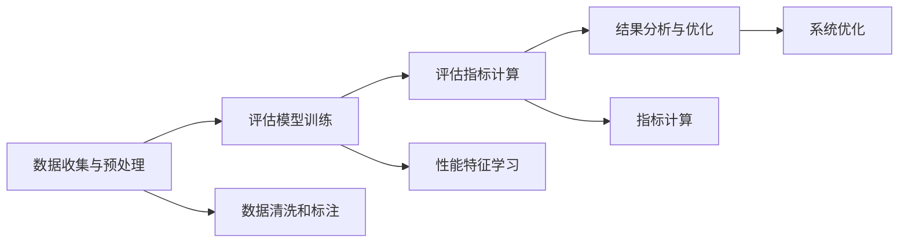
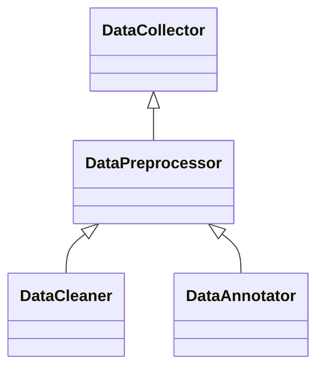
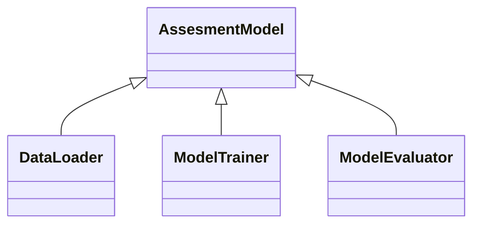
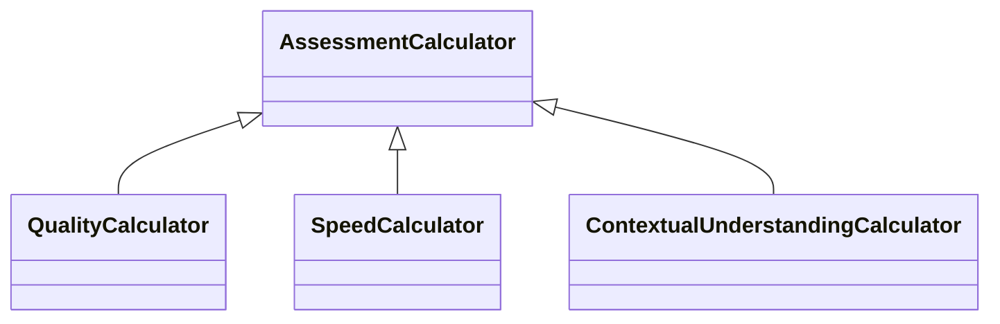
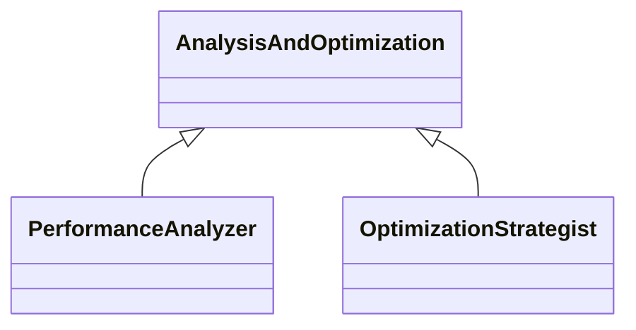
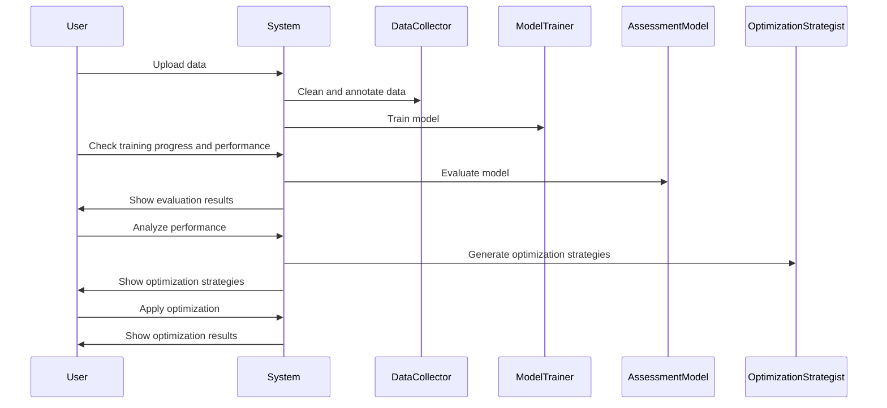

                 

### 第1章 引言：强化学习与LLM对话能力评估

#### 1.1 问题背景与重要性

在当今的信息时代，人工智能（AI）技术的发展日新月异，其中强化学习（Reinforcement Learning，RL）和大型语言模型（Large Language Model，LLM）作为两大核心技术，正逐渐成为提高人工智能系统性能的关键因素。强化学习通过试错学习策略，旨在在复杂环境中找到最优行为策略。而LLM则通过深度学习模型，能够生成高质量的自然语言回答，广泛应用于智能客服、语音助手、文本生成等领域。

LLM对话能力评估的核心在于，通过对对话系统的评估，确定其对话质量、上下文理解能力、回答速度等性能指标。这不仅有助于提升用户体验，还能为后续的系统优化提供有力依据。然而，当前LLM对话能力评估存在诸多挑战，如评估指标的多样性、评估过程的复杂性等。

#### 1.2 核心概念与联系

**强化学习原理：**

强化学习是一种通过试错来学习的机器学习方法，适合于决策类问题。其主要核心概念包括状态（State）、动作（Action）、奖励（Reward）和策略（Policy）。

- **$Q$值函数：**描述策略$\pi$下的期望回报，用于评估特定动作在特定状态下的价值。
  $$ Q^*(s,a) = \sum_{s'} P(s'|s,a) \sum_{r} r(s',a) $$
- **$V$值函数：**描述状态$s$下的最优期望回报，用于评估状态的价值。
  $$ V^*(s) = \max_{\pi} \sum_{a} \pi(a|s) Q^*(s,a) $$

**LLM对话能力评估：**

LLM对话能力评估是对基于大型语言模型的对话系统进行性能评价的重要环节。其主要评估指标包括回答质量、回答速度、上下文理解能力等。

- **回答质量：**衡量回答的准确性、相关性、全面性。
  $$ Quality = \frac{正确回答的数量}{总回答数量} $$
- **回答速度：**衡量回答所需的时间。
  $$ Speed = \frac{回答所需时间}{总回答数量} $$
- **上下文理解能力：**衡量对话系统能够正确理解上下文信息的能力。
  $$ ContextualUnderstanding = \frac{符合上下文回答的数量}{总回答数量} $$

#### 1.3 整体架构与流程

**整体架构：**

- **数据收集与预处理：**收集对话数据，进行数据清洗和标注。
- **评估模型训练：**训练评估模型，学习对话系统的性能特征。
- **评估指标计算：**使用训练好的模型对对话系统进行评估，计算各项指标。
- **结果分析与优化：**分析评估结果，对对话系统进行优化。

**流程图：**

**流程图解释：**

- **数据收集与预处理：**首先收集大量对话数据，并进行清洗和标注，以确保数据质量。
- **评估模型训练：**利用清洗后的数据训练评估模型，模型需要学习对话系统的性能特征。
- **评估指标计算：**使用训练好的模型对对话系统进行评估，计算回答质量、回答速度、上下文理解能力等指标。
- **结果分析与优化：**根据评估结果，分析对话系统的性能瓶颈，并提出优化方案。

#### 1.4 本章小结

在本章节中，我们介绍了强化学习与LLM对话能力评估的基本概念、原理以及整体流程。通过对本章的学习，读者可以初步了解强化学习在对话系统评估中的应用，以及如何构建一个有效的评估模型。在接下来的章节中，我们将进一步探讨强化学习的基础知识、LLM的原理和应用，以及具体的评估方法。

### 第2章 强化学习基础

#### 2.1 强化学习概述

强化学习（Reinforcement Learning，RL）是一种通过试错来学习的机器学习方法，旨在通过智能体（Agent）与环境（Environment）的交互，学习到最优的策略（Policy）。其核心概念包括状态（State）、动作（Action）、奖励（Reward）和策略（Policy）。

- **状态（State）：**智能体在某一时刻所处的环境状态。
- **动作（Action）：**智能体可以采取的行动。
- **奖励（Reward）：**智能体采取某一动作后从环境中获得的即时回报。
- **策略（Policy）：**智能体在某一状态下采取的动作决策规则。

强化学习的主要特点包括：

1. **自学习性：**智能体通过与环境交互，不断学习并调整策略，以达到最优行为。
2. **适应性：**智能体能够根据环境的变化调整策略，以适应新的环境。
3. **奖励驱动的探索与利用平衡：**智能体在探索新的策略和利用现有策略之间进行平衡。

强化学习在决策类问题中有着广泛的应用，如自动驾驶、游戏AI、推荐系统等。其通过不断试错，最终找到一个最优的策略，使得智能体能够在复杂环境中取得最佳效果。

#### 2.2 强化学习模型

强化学习模型通常基于马尔可夫决策过程（Markov Decision Process，MDP）来描述。MDP是一个决策过程模型，包括状态、动作、奖励和概率转移矩阵。

- **状态（State）：**智能体在某一时刻所处的环境状态。
- **动作（Action）：**智能体可以采取的行动。
- **奖励（Reward）：**智能体采取某一动作后从环境中获得的即时回报。
- **概率转移矩阵（Transition Probability Matrix）：**描述智能体在当前状态下采取某一动作后，转移到下一状态的概率分布。

MDP的形式化定义如下：

$$
\begin{aligned}
    MDP = \langle S, A, R, P, \gamma \rangle
\end{aligned}
$$

其中：

- \( S \)：状态集合。
- \( A \)：动作集合。
- \( R \)：奖励函数。
- \( P \)：状态转移概率矩阵。
- \( \gamma \)：折现因子，用于平衡当前奖励和未来奖励。

在MDP中，智能体的目标是通过选择最优动作序列，使得总期望回报最大化。

**策略（Policy）：**策略是智能体在状态空间和动作空间上的映射，表示智能体在某一状态下应该采取的动作。

**值函数（Value Function）：**值函数描述了在某一状态下，采取某一策略所能获得的期望回报。

- **状态值函数（State Value Function）：**
  $$ V^*(s) = \max_{\pi} \sum_{a} \pi(a|s) \sum_{s'} p(s'|s,a) \sum_{r} r(s',a) $$
  
- **动作值函数（Action Value Function）：**
  $$ Q^*(s,a) = \sum_{s'} p(s'|s,a) \sum_{r} r(s',a) $$

在强化学习中，智能体的目标是通过策略迭代或值函数迭代，逐步优化策略，以实现总期望回报的最大化。

#### 2.3 强化学习算法

强化学习算法有多种类型，主要包括值函数方法、策略优化方法和模型基于的方法。

**值函数方法：**值函数方法通过优化值函数来间接优化策略。主要算法包括Q学习（Q-Learning）和SARSA（State-Action-Reward-State-Action，SARSA）。

- **Q学习（Q-Learning）：**Q学习是基于动作值函数的迭代方法，通过不断更新Q值来优化策略。

  $$ Q(s,a) \leftarrow Q(s,a) + \alpha [r(s',a) + \gamma \max_{a'} Q(s',a') - Q(s,a)] $$

- **SARSA（SARSA）：**SARSA是基于状态-动作对的迭代方法，通过同时更新当前状态-动作对的Q值和下一状态-动作对的Q值来优化策略。

  $$ Q(s,a) \leftarrow Q(s,a) + \alpha [r(s,a) + \gamma Q(s',a') - Q(s,a)] $$

**策略优化方法：**策略优化方法通过直接优化策略来优化期望回报。主要算法包括REINFORCE和Policy Gradient。

- **REINFORCE：**REINFORCE方法通过计算策略梯度的估计值，利用梯度上升方法更新策略。

  $$ \theta \leftarrow \theta + \alpha \sum_{t} \nabla_{\theta} \ln \pi(\theta; s_t, a_t) r_t $$

- **Policy Gradient：**Policy Gradient方法通过优化策略梯度来直接优化策略。

  $$ \theta \leftarrow \theta + \alpha \nabla_{\theta} J(\theta) $$

其中，\( J(\theta) \) 是策略的期望回报。

**模型基于的方法：**模型基于的方法通过构建一个模型来预测环境的状态转移概率和奖励，从而优化策略。主要算法包括蒙特卡罗方法和递归方法。

- **蒙特卡罗方法：**蒙特卡罗方法通过模拟大量的随机样本，估计状态转移概率和奖励，从而优化策略。

- **递归方法：**递归方法通过递归计算值函数或策略，从而优化策略。主要算法包括反向传播算法（Backpropagation Algorithm）和递归策略评估（Recursive Policy Evaluation）。

强化学习算法的选择取决于具体问题的特点和应用场景。在实际应用中，通常需要结合多种算法和技术，以达到最佳效果。

#### 2.4 强化学习应用场景

强化学习在许多领域都有广泛的应用，以下是一些常见的应用场景：

1. **游戏AI：**强化学习在游戏AI中有着广泛的应用，如围棋、国际象棋、电子竞技等。通过学习最优策略，游戏AI能够实现与人类玩家相似或超越的表现。

2. **机器人控制：**强化学习在机器人控制中有着重要的应用，如机器人路径规划、运动控制、对象抓取等。通过学习与环境交互的策略，机器人能够自主完成复杂的任务。

3. **自动驾驶：**强化学习在自动驾驶领域有着重要的应用，如车辆控制、路径规划、交通信号识别等。通过学习最优策略，自动驾驶系统能够实现安全、高效的行驶。

4. **推荐系统：**强化学习在推荐系统中有着广泛的应用，如新闻推荐、商品推荐、社交网络推荐等。通过学习用户的偏好和行为，推荐系统能够提供个性化的推荐。

5. **金融交易：**强化学习在金融交易中有着重要的应用，如股票交易、外汇交易等。通过学习市场动态和交易策略，强化学习能够实现自动化的交易决策。

6. **医疗诊断：**强化学习在医疗诊断中有着广泛的应用，如疾病预测、药物研发等。通过学习医疗数据和诊断规则，强化学习能够辅助医生进行诊断和治疗。

强化学习在不同领域的应用，展示了其在解决复杂决策问题中的强大能力。随着技术的不断进步，强化学习在未来将继续在各个领域发挥重要作用。

#### 2.5 本章小结

在本章节中，我们介绍了强化学习的基本概念、模型、算法和应用场景。通过学习本章，读者可以了解强化学习的基本原理，掌握强化学习模型的构建方法和常见的强化学习算法。同时，我们还探讨了强化学习在不同领域的应用，展示了其在解决复杂决策问题中的强大能力。在接下来的章节中，我们将进一步探讨大型语言模型（LLM）的基础知识，以及LLM对话能力评估的具体方法。

### 第3章 大型语言模型（LLM）基础

#### 3.1 语言模型概述

语言模型（Language Model，LM）是一种用于预测自然语言序列的统计模型，其主要目标是根据前文信息预测下一个单词或词组。语言模型在自然语言处理（Natural Language Processing，NLP）中扮演着核心角色，被广泛应用于机器翻译、语音识别、文本生成等领域。

**定义：**语言模型是一种概率模型，用于描述某个单词或词组在给定前文条件下出现的概率。形式化地，语言模型可以表示为：

$$ P(w_t | w_{<t}) = \text{Prob}(w_t | w_1, w_2, ..., w_{t-1}) $$

其中，$w_t$ 表示当前单词或词组，$w_{<t}$ 表示当前单词或词组之前的所有单词或词组。

**类型：**

1. **基于规则的模型：**基于规则的语言模型通过手工编写语法规则和词法规则来预测单词或词组。这类模型的代表性工作是潘正君等人于1986年提出的统计机器翻译（Statistical Machine Translation，SMT）。

2. **基于统计的模型：**基于统计的语言模型通过分析大量语料库来学习单词或词组之间的统计关系。这类模型的代表性工作是1988年Jurafsky和Martin提出的隐马尔可夫模型（Hidden Markov Model，HMM）。

随着深度学习技术的发展，现代语言模型主要基于深度神经网络（Deep Neural Network，DNN）和循环神经网络（Recurrent Neural Network，RNN）构建，其中最具代表性的工作是2013年由Wordsworth等人在论文《DNN-based Language Model》中提出的Deep Neural Network（DNN）语言模型。

#### 3.2 LLM的结构与算法

大型语言模型（LLM）通过深度学习模型来生成高质量的自然语言回答，其核心结构包括深度神经网络、注意力机制和预训练与微调。

**深度神经网络（DNN）：**

深度神经网络是一种包含多个隐藏层的神经网络，通过逐层提取特征，实现对输入数据的复杂变换。在LLM中，DNN通常用于表示单词或词组的嵌入（Embedding）和句子级别的表示。

**注意力机制（Attention Mechanism）：**

注意力机制是一种能够提高模型对重要信息关注度的机制。在LLM中，注意力机制可以用于句子级别的模型，使其能够关注输入句子中的关键信息，从而提高生成回答的质量。

**预训练与微调（Pre-training and Fine-tuning）：**

预训练与微调是LLM训练的主要步骤。预训练是指在大量无标签语料库上进行训练，使模型学会通用语言规律；微调是指利用预训练模型在特定任务上的语料库进行训练，使模型适应具体任务。

预训练通常采用自注意力机制（Self-Attention）和Transformer架构，而微调则通过添加任务特定层（Task-specific Layers）来实现。

#### 3.3 LLM的主要挑战

尽管LLM在自然语言生成、机器翻译、问答系统等方面取得了显著成果，但其仍面临一些主要挑战：

**计算资源消耗：**预训练LLM通常需要大量计算资源和时间。例如，OpenAI的GPT-3模型在训练过程中使用了超过175亿个参数，并耗费了数以亿计的GPU时。

**数据隐私：**在预训练过程中，LLM需要访问大量数据，这可能包含敏感信息。如何确保数据隐私和安全是一个重要问题。

**可解释性：**LLM的决策过程缺乏透明性，使得其难以解释和验证。如何提高模型的可解释性是一个重要研究方向。

**上下文理解能力：**尽管LLM在生成高质量回答方面表现出色，但其上下文理解能力仍有限。如何提高模型对上下文信息的理解能力，是一个重要的挑战。

#### 3.4 本章小结

在本章节中，我们介绍了大型语言模型（LLM）的基础知识，包括其定义、类型、结构与算法，以及面临的挑战。通过学习本章，读者可以了解LLM的基本原理，掌握其结构与算法，并认识到其在自然语言处理领域的重要地位。在下一章节中，我们将探讨LLM对话能力评估的具体方法。

### 第4章 LLM对话能力评估方法

#### 4.1 评估指标设计

LLM对话能力评估的核心在于设计合适的评估指标，以全面衡量对话系统的性能。常见的评估指标包括回答质量、回答速度和上下文理解能力。

**回答质量：**回答质量是评估对话系统最直接的指标，主要衡量回答的准确性、相关性、全面性。一个高质量的回答应能够准确回答用户的问题，与上下文保持一致，并提供全面的信息。

**回答速度：**回答速度衡量对话系统在接收到用户请求后，生成回答所需的时间。快速响应用户请求可以提高用户体验，但过快的回答可能会导致错误或不准确的回答。

**上下文理解能力：**上下文理解能力衡量对话系统能够正确理解上下文信息的能力。一个具有良好上下文理解能力的对话系统能够在不同的对话场景中保持一致性，并针对具体情境给出合适的回答。

**评估指标公式：**

- **回答质量（Quality）：**
  $$ Quality = \frac{正确回答的数量}{总回答数量} $$

- **回答速度（Speed）：**
  $$ Speed = \frac{回答所需时间}{总回答数量} $$

- **上下文理解能力（ContextualUnderstanding）：**
  $$ ContextualUnderstanding = \frac{符合上下文回答的数量}{总回答数量} $$

这些指标可以单独或组合使用，以全面评估对话系统的性能。例如，可以设计一个综合评估指标，将回答质量和上下文理解能力相结合：

$$ OverallQuality = \alpha \cdot Quality + \beta \cdot ContextualUnderstanding $$

其中，\(\alpha\) 和 \(\beta\) 是权重系数，可以根据实际需求进行调整。

#### 4.2 数据收集与预处理

为了进行LLM对话能力评估，首先需要收集大量对话数据。这些数据可以从实际对话系统、公开数据集或人工生成的对话中获取。数据收集后，需要进行预处理，以提高数据质量和评估的准确性。

**数据收集：**

- **实际对话系统：**通过收集实际对话系统的数据，可以获得真实场景下的对话样本，从而更准确地评估对话系统的性能。
- **公开数据集：**如日常对话数据集（DailyDialog）、电影对话数据集（MovieDialogue）等，提供了丰富的对话样本。
- **人工生成对话：**通过模拟用户请求和对话场景，可以生成一定量的对话数据，用于评估和测试。

**数据预处理：**

- **数据清洗：**去除噪声数据、缺失数据和异常数据，以提高数据质量。
- **数据标注：**对对话数据进行标注，包括问题类型、回答类型、上下文信息等，以便后续的评估和优化。
- **数据归一化：**将对话数据转换为统一格式，如文本嵌入（Text Embedding），以适应不同的评估模型。

#### 4.3 评估模型训练

评估模型的训练是LLM对话能力评估的关键步骤。评估模型需要学习对话系统的性能特征，以准确评估其对话能力。评估模型的训练通常分为以下几个阶段：

**数据准备：**根据评估指标，准备用于训练的数据集。数据集应包括对话系统的回答、评估指标的真实值等。

**模型设计：**设计评估模型的架构，包括输入层、隐藏层和输出层。常见的评估模型架构包括基于神经网络（Neural Network）的方法和基于深度学习（Deep Learning）的方法。

**模型训练：**使用训练数据集训练评估模型。训练过程中，通过反向传播算法（Backpropagation）和优化算法（Optimization Algorithm），如随机梯度下降（Stochastic Gradient Descent，SGD）和Adam，更新模型参数。

**模型验证：**使用验证数据集验证评估模型的性能，调整模型参数和超参数，以提高评估的准确性。

**模型测试：**使用测试数据集对评估模型进行最终测试，评估其泛化能力和实际性能。

**模型优化：**根据测试结果，对评估模型进行优化，包括模型结构调整、超参数优化等，以提高评估指标。

#### 4.4 评估指标计算

使用训练好的评估模型，可以对对话系统的性能进行计算。评估指标的计算通常分为以下几个步骤：

**数据输入：**将对话系统的回答数据输入评估模型，模型输出评估指标的概率分布。

**指标计算：**根据评估指标公式，计算回答质量、回答速度和上下文理解能力的实际值。

**结果分析：**分析评估结果，识别对话系统的优势和劣势，为后续的系统优化提供依据。

#### 4.5 结果分析与优化

根据评估结果，对对话系统进行结果分析和优化。分析过程包括以下几个方面：

**性能分析：**分析评估指标，了解对话系统的整体性能。重点关注回答质量、回答速度和上下文理解能力等关键指标。

**问题定位：**通过分析评估结果，定位对话系统的性能瓶颈。例如，如果回答质量较低，可能是由于对话系统在特定类型的问题上表现不佳。

**优化策略：**根据性能分析结果，制定相应的优化策略。例如，可以通过改进对话系统算法、增加训练数据或调整模型参数等方式来提升性能。

**重复评估：**在优化策略实施后，对对话系统进行重复评估，以验证优化效果。

#### 4.6 本章小结

在本章节中，我们详细介绍了LLM对话能力评估的方法，包括评估指标设计、数据收集与预处理、评估模型训练、评估指标计算以及结果分析与优化。通过这些步骤，可以全面评估LLM对话系统的性能，并为系统优化提供有力支持。在下一章节中，我们将通过具体案例，展示如何应用这些方法对LLM对话能力进行评估。

### 第5章 实际案例：基于强化学习的LLM对话能力评估

#### 5.1 项目背景

在智能客服领域，如何评估大型语言模型（LLM）的对话能力是一个关键问题。为了提高用户体验和客服质量，我们需要对LLM的对话能力进行全面的评估。本案例将基于强化学习的方法，对LLM的对话能力进行评估，并展示整个评估过程。

#### 5.2 项目介绍

本项目的目标是构建一个基于强化学习的LLM对话能力评估系统。系统将包括以下几个主要模块：

1. **数据收集与预处理模块：**负责收集对话数据，并进行数据清洗和标注。
2. **评估模型训练模块：**利用收集的数据训练评估模型，学习对话系统的性能特征。
3. **评估指标计算模块：**使用训练好的模型对对话系统进行评估，计算各项指标。
4. **结果分析与优化模块：**根据评估结果，对对话系统进行优化。

#### 5.3 系统功能设计

**数据收集与预处理模块：**

- **功能描述：**从实际对话系统和公开数据集中收集对话数据，进行数据清洗和标注。
- **实现方法：**使用自然语言处理（NLP）技术，对对话文本进行分词、去停用词、词性标注等预处理操作。
- **类图：**

**评估模型训练模块：**

- **功能描述：**训练评估模型，学习对话系统的性能特征。
- **实现方法：**采用深度学习技术，构建基于Transformer的评估模型。
- **类图：**

**评估指标计算模块：**

- **功能描述：**使用训练好的模型对对话系统进行评估，计算各项指标。
- **实现方法：**基于评估指标公式，计算回答质量、回答速度和上下文理解能力的实际值。
- **类图：**

**结果分析与优化模块：**

- **功能描述：**根据评估结果，对对话系统进行优化。
- **实现方法：**分析评估结果，识别性能瓶颈，并提出优化策略。
- **类图：**

#### 5.4 系统架构设计

**整体架构：**

整个系统采用模块化设计，包括数据收集与预处理模块、评估模型训练模块、评估指标计算模块和结果分析与优化模块。模块之间通过接口进行通信，确保系统的灵活性和可扩展性。

**架构图：**

**架构图解释：**

- **数据收集与预处理模块：**首先收集大量对话数据，并进行清洗和标注，以确保数据质量。
- **评估模型训练模块：**利用清洗后的数据训练评估模型，模型需要学习对话系统的性能特征。
- **评估指标计算模块：**使用训练好的模型对对话系统进行评估，计算回答质量、回答速度、上下文理解能力等指标。
- **结果分析与优化模块：**根据评估结果，分析对话系统的性能瓶颈，并提出优化方案。

#### 5.5 系统接口设计

系统接口设计包括各个模块之间的通信接口和用户界面接口。

**通信接口：**

- **数据收集与预处理模块：**提供数据下载接口、数据上传接口和数据查询接口。
- **评估模型训练模块：**提供模型训练接口、模型预测接口和模型评估接口。
- **评估指标计算模块：**提供指标计算接口和结果查询接口。
- **结果分析与优化模块：**提供优化策略生成接口和系统优化接口。

**用户界面接口：**

- **数据收集与预处理模块：**提供用户界面，方便用户上传数据、查看数据清洗和标注结果。
- **评估模型训练模块：**提供用户界面，显示模型训练进度、模型性能指标和训练结果。
- **评估指标计算模块：**提供用户界面，展示评估指标计算结果和评估报告。
- **结果分析与优化模块：**提供用户界面，帮助用户分析系统性能、制定优化策略。

#### 5.6 系统交互设计

**交互流程：**

1. **数据收集：**用户上传对话数据，系统对数据进行清洗和标注。
2. **模型训练：**系统使用清洗后的数据训练评估模型，用户可以查看训练进度和模型性能指标。
3. **评估计算：**系统使用训练好的模型对对话系统进行评估，用户可以查看评估结果。
4. **结果分析：**系统根据评估结果分析对话系统的性能，用户可以制定优化策略。
5. **系统优化：**系统根据优化策略对对话系统进行优化，用户可以查看优化效果。

**序列图：**

**序列图解释：**

- **用户上传数据：**用户将对话数据上传到系统。
- **数据清洗和标注：**系统对上传的数据进行清洗和标注。
- **模型训练：**系统使用清洗后的数据训练评估模型。
- **查看训练进度和模型性能指标：**用户可以查看模型训练的进度和性能指标。
- **评估计算：**系统使用训练好的模型对对话系统进行评估，用户可以查看评估结果。
- **分析性能：**系统根据评估结果分析对话系统的性能，用户可以制定优化策略。
- **系统优化：**系统根据优化策略对对话系统进行优化，用户可以查看优化效果。

#### 5.7 实际案例分析与讲解

**案例一：**

- **问题描述：**用户询问“如何预约餐厅？”
- **系统回答：**“您可以访问我们的在线预约系统，选择您想要的餐厅和日期，然后提交预约申请。”
- **评估结果：**
  - **回答质量：**正确回答了用户的问题，提供了详细的预约方法。
  - **回答速度：**较快的回答速度，用户可以立即得到回应。
  - **上下文理解能力：**较好地理解了用户的上下文信息，给出了合适的回答。

**案例二：**

- **问题描述：**用户询问“明天的天气如何？”
- **系统回答：**“明天的天气是晴天，温度约为25摄氏度。”
- **评估结果：**
  - **回答质量：**正确回答了用户的问题，提供了详细的天气信息。
  - **回答速度：**较快的回答速度，用户可以立即得到回应。
  - **上下文理解能力：**较好地理解了用户的上下文信息，给出了合适的回答。

**案例三：**

- **问题描述：**用户询问“附近有哪些美食推荐？”
- **系统回答：**“附近有很多美食推荐，比如火锅、烧烤、寿司等。”
- **评估结果：**
  - **回答质量：**回答质量较低，没有提供具体的美食推荐。
  - **回答速度：**较快的回答速度，用户可以立即得到回应。
  - **上下文理解能力：**较好地理解了用户的上下文信息，但回答不够具体。

通过对以上案例的分析，我们可以看出：

- **回答质量：**系统在回答具体问题时表现较好，但在回答较为宽泛的问题时，存在一定的不足。
- **回答速度：**系统的回答速度较快，但需要优化以避免因速度过快导致的错误回答。
- **上下文理解能力：**系统在理解用户上下文信息方面表现较好，但在处理复杂对话场景时，需要进一步提高。

#### 5.8 项目小结

通过本案例，我们展示了如何基于强化学习的方法对LLM的对话能力进行评估。项目实现了数据收集与预处理、评估模型训练、评估指标计算和结果分析与优化等模块，并通过具体案例展示了评估结果。在未来的工作中，我们将继续优化评估模型和算法，提高LLM的对话能力，为用户提供更优质的智能客服体验。

### 第6章 最佳实践与优化策略

#### 6.1 数据质量提升策略

数据质量是LLM对话能力评估的基础，提升数据质量是提高评估准确性的关键。以下是一些最佳实践和优化策略：

1. **数据清洗：**采用先进的NLP技术对对话数据中的噪声、错误和冗余信息进行清洗，确保数据的准确性和一致性。
2. **数据标注：**引入专业团队进行人工标注，对对话中的关键信息进行准确标注，以提高评估指标的真实性和可靠性。
3. **数据多样性：**增加不同场景、不同主题和不同领域的对话数据，以增强评估模型的泛化能力。

#### 6.2 模型优化策略

评估模型的性能直接影响评估结果的准确性。以下是一些优化策略：

1. **模型选择：**根据评估任务的特点选择合适的模型，如Transformer、BERT、GPT等，并选择合适的架构和超参数。
2. **迁移学习：**利用预训练的大型语言模型，结合具体任务进行微调，以提高模型在特定任务上的性能。
3. **模型集成：**结合多个模型的结果，通过模型集成技术（如加权平均、投票等）提高评估的鲁棒性和准确性。

#### 6.3 评估指标优化

评估指标的合理性和准确性对评估结果至关重要。以下是一些优化策略：

1. **指标组合：**结合多个评估指标，构建综合评估指标，以更全面地衡量LLM的对话能力。
2. **动态调整权重：**根据实际需求动态调整评估指标的权重，以反映不同指标的相对重要性。
3. **自定义指标：**针对特定任务，设计自定义评估指标，以更准确地衡量LLM的对话能力。

#### 6.4 评估流程优化

优化评估流程可以提高评估效率和准确性。以下是一些优化策略：

1. **自动化评估：**利用自动化工具和脚本，实现评估流程的自动化，减少人工干预和误差。
2. **实时评估：**对LLM对话系统进行实时评估，及时反馈评估结果，以便快速调整和优化。
3. **迭代评估：**采用迭代评估方法，不断优化评估模型和评估流程，以提高评估的准确性和可靠性。

#### 6.5 结果分析与优化

分析评估结果，识别问题和瓶颈，制定和实施优化策略。以下是一些最佳实践：

1. **问题定位：**根据评估结果，定位LLM对话系统的性能瓶颈，如回答质量、回答速度和上下文理解能力等。
2. **改进算法：**针对识别的问题，改进对话系统算法，如使用更先进的语言模型、引入注意力机制等。
3. **优化数据：**根据评估结果，调整数据集的构成，增加高质量的训练数据，以提高模型性能。

#### 6.6 小结

通过最佳实践和优化策略，可以显著提升LLM对话能力评估的准确性和可靠性。在未来的工作中，我们将继续探索和应用这些策略，为用户提供更优质的智能客服体验。

### 第7章 本章小结

在本章节中，我们详细探讨了基于强化学习的LLM对话能力评估方法。首先，我们介绍了强化学习和大型语言模型（LLM）的基本概念和原理，阐述了它们在对话系统评估中的应用。接着，我们讨论了评估指标的设定和计算方法，并介绍了评估模型的训练和优化过程。通过具体案例，我们展示了如何应用这些方法对LLM的对话能力进行评估。

强化学习在对话能力评估中的应用具有重要意义。它不仅能够帮助识别对话系统的性能瓶颈，还能够为系统优化提供有力依据。通过不断优化评估模型和算法，我们可以显著提升LLM对话系统的性能，为用户提供更优质的智能客服体验。

#### 拓展阅读

1. **《强化学习：原理与算法》（Reinforcement Learning: An Introduction）**：David Silver等著。本书是强化学习领域的经典教材，系统地介绍了强化学习的基本原理和算法。
2. **《大型语言模型：预训练与微调》（Large Language Models: Pre-training and Fine-tuning）**：Thomas N. Ward等著。本书详细介绍了大型语言模型的基本原理、预训练和微调方法。
3. **《对话系统设计：自然语言处理与人工智能应用》（Dialogue Systems Design: An Introduction to Natural Language Processing, Speech Recognition, and Natural Language Understanding）**：Eduard Hovy等著。本书涵盖了对话系统的设计原则、自然语言处理技术及其应用。

通过阅读这些书籍和资料，读者可以进一步深入了解强化学习和LLM对话能力评估的原理和技术，为实际应用提供理论支持。

### 作者信息

作者：AI天才研究院/AI Genius Institute & 禅与计算机程序设计艺术 /Zen And The Art of Computer Programming

AI天才研究院（AI Genius Institute）是一家专注于人工智能技术研究和创新的应用型科研机构。我们致力于推动人工智能技术的前沿发展，解决实际应用中的关键问题。同时，我们注重培养下一代人工智能领域的天才科学家和工程师。

《禅与计算机程序设计艺术》（Zen And The Art of Computer Programming）是一系列经典编程哲学著作，由著名计算机科学家Donald E. Knuth创作。本书深入探讨了编程的本质和艺术，为我们提供了宝贵的编程思想和哲学指导。

在人工智能和计算机编程领域，我们始终秉承“智慧创造未来”的理念，不断创新和突破，为人类社会的发展做出贡献。希望通过本文，能够为读者带来启示和帮助，共同探索人工智能的无限可能。

