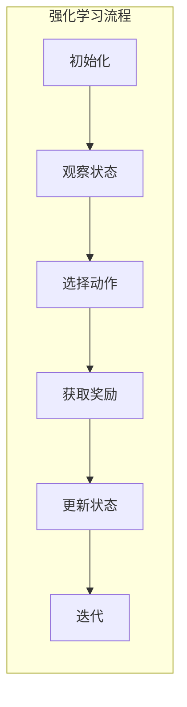
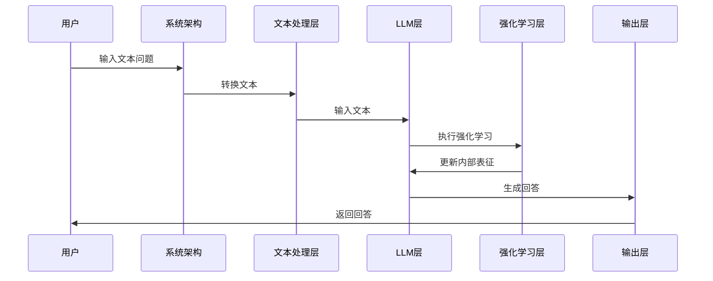
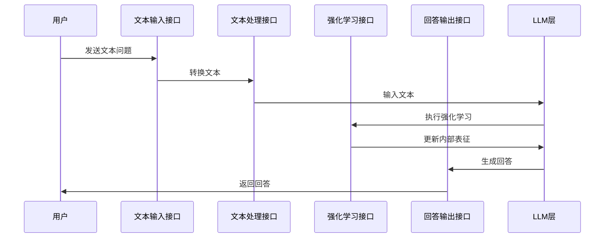

                 

### 基于强化学习的LLM长期记忆测试

#### 关键词：强化学习、大规模语言模型、长期记忆、自然语言处理、上下文维持

> 摘要：本文探讨了基于强化学习的LLM长期记忆测试。通过分析强化学习在LLM长期记忆中的应用，本文提出了一种测试方法，旨在评估LLM在长期记忆方面的表现。本文首先介绍了长期记忆和强化学习的基本概念，然后通过具体的算法原理讲解和系统分析与架构设计方案，展示了如何利用强化学习提升LLM的长期记忆能力。

----------------------------------------------------------------

### 第一部分：背景介绍

近年来，随着人工智能技术的飞速发展，特别是深度学习和强化学习技术的突破，大规模语言模型（LLM）在自然语言处理领域取得了显著的成果。LLM的引入，使得机器在处理和理解自然语言时能够表现出更接近人类的能力。然而，随着模型规模的不断增大，LLM在长期记忆方面的表现也成为一个亟待解决的问题。

#### 1.1 问题背景

长期记忆是衡量一个人或系统在经历一段时间后仍然能够保留和使用信息的程度。在LLM中，长期记忆的不足主要体现在以下两个方面：

1. **上下文理解能力有限**：在长文本处理中，LLM往往难以维持对上下文信息的连续性和连贯性，导致生成结果缺乏一致性。
2. **知识遗忘**：在长时间未使用后，LLM会遗忘之前学习的知识和经验，这限制了其在实际应用中的持续性和稳定性。

#### 1.2 问题描述

长期记忆的不足对LLM在自然语言处理任务中的表现产生了显著影响。具体来说，长期记忆不足导致了以下问题：

1. **生成结果不一致**：在长文本处理中，LLM生成的结果往往缺乏一致性和连贯性，导致用户体验不佳。
2. **知识遗忘**：在长时间未使用后，LLM会遗忘之前学习的知识和经验，导致其无法在需要时进行有效的知识复用。

#### 1.3 问题解决

强化学习作为一种能够通过互动学习和策略优化的机器学习方法，为LLM长期记忆的提升提供了一种可能的解决方案。通过强化学习，LLM可以在与环境的交互中不断调整和优化其内部表征，从而增强对长期信息的记忆和利用能力。

#### 1.4 边界与外延

1. **边界**：本文主要探讨基于强化学习的LLM长期记忆测试，重点关注强化学习在LLM长期记忆能力提升方面的应用。
2. **外延**：本文的研究成果将有助于推动LLM在自然语言处理领域的应用，特别是在需要长期记忆支持的领域，如问答系统、对话系统、知识库管理等。

#### 1.5 概念结构与核心要素组成

1. **概念结构**：长期记忆、强化学习、LLM。
2. **核心要素**：
   - **长期记忆**：指LLM能够维持对上下文信息和知识的持久记忆。
   - **强化学习**：一种通过与环境互动来优化决策策略的机器学习方法。
   - **LLM**：指大规模语言模型，具有强大的语言理解和生成能力。

### 第二部分：核心概念与联系

#### 2.1 长期记忆

长期记忆是指个体在经历一段时间后，仍然能够保持和利用的信息。在LLM中，长期记忆主要涉及以下两个方面：

1. **上下文维持**：LLM需要能够在处理长文本时维持对上下文信息的连续性和连贯性。
2. **知识保存**：LLM需要能够在长时间未使用后，仍然能够保存和利用之前学习的知识和经验。

#### 2.2 强化学习

强化学习是一种通过互动学习和策略优化的机器学习方法。在LLM长期记忆的研究中，强化学习的主要作用是通过与环境交互，不断调整和优化LLM的内部表征，从而增强其对长期信息的记忆和利用能力。

强化学习的基本概念包括：

1. **代理人（Agent）**：指进行决策和执行动作的实体，例如LLM。
2. **环境（Environment）**：指代理人执行动作的场所，例如自然语言处理任务的环境。
3. **状态（State）**：指代理人所处的环境状态，例如文本上下文。
4. **动作（Action）**：指代理人可以执行的行为，例如生成文本。
5. **奖励（Reward）**：指代理人在执行动作后获得的即时反馈，用于指导其后续决策。

#### 2.3 LLM

LLM是指大规模语言模型，具有强大的语言理解和生成能力。LLM的长期记忆能力直接影响其在自然语言处理任务中的表现。

LLM的主要特点包括：

1. **大规模训练**：LLM通常通过大规模数据集进行训练，使其在语言理解方面具有很高的准确性。
2. **自动编码**：LLM能够自动编码语言信息，从而实现高效的文本生成和理解。
3. **多语言支持**：LLM通常支持多种语言，能够处理不同语言的文本。

#### 2.4 核心概念属性特征对比表格

| 概念        | 属性特征                                                     | 对比与分析                                                     |
|-------------|------------------------------------------------------------|--------------------------------------------------------------|
| 长期记忆    | - 维持上下文信息<br>- 保存知识经验<br>- 长时间保存信息       | - 与短期记忆区分<br>- 关键在于信息的持久性和利用性           |
| 强化学习    | - 通过互动学习<br>- 策略优化<br>- 奖励机制               | - 与监督学习、无监督学习区分<br>- 重点在于策略调整和优化       |
| LLM         | - 大规模训练<br>- 强大语言理解<br>- 高效语言生成           | - 与传统语言模型区分<br>- 特点在于规模和性能                 |

#### 2.5 ER实体关系图架构

下面是LLM、强化学习和长期记忆的ER实体关系图架构：

```mermaid
erDiagram
  LLMMemory ||--|{ 强化学习 :Strategy} 
  LLMMemory ||--|{ 长期记忆 :Retention} 
```

在这个ER图中，LLMMemory实体与强化学习和长期记忆实体之间存在关联。强化学习通过策略调整来优化LLM的长期记忆能力，而长期记忆则负责维持LLM对上下文信息和知识的持久记忆。

### 第三部分：算法原理讲解

在本文中，我们将通过具体的算法原理讲解，探讨如何利用强化学习提升LLM的长期记忆能力。为了更好地理解这一过程，我们将使用Mermaid流程图和Python源代码来展示算法的实现和数学模型。

#### 3.1 强化学习基本流程

强化学习的基本流程包括以下几个步骤：

1. **初始化**：初始化代理人和环境。
2. **状态观察**：代理人观察当前状态。
3. **动作选择**：代理人根据当前状态选择一个动作。
4. **环境反馈**：环境根据动作提供奖励。
5. **状态更新**：代理人更新状态。
6. **迭代**：重复以上步骤，直至达到目标状态。

下面是强化学习的基本流程Mermaid流程图：



#### 3.2 强化学习数学模型

强化学习的数学模型主要包括状态（\(S\)）、动作（\(A\)）、奖励（\(R\)）和策略（\(π\)）。

1. **状态（\(S\)）**：描述代理人在环境中的状态。
2. **动作（\(A\)）**：代理人可以执行的动作。
3. **奖励（\(R\)）**：环境对代理人动作的即时反馈。
4. **策略（\(π\)）**：代理人选择动作的策略。

在强化学习中，代理人的目标是最大化累积奖励。累积奖励的计算公式为：

$$
J(\theta) = \sum_{t=0}^{T} R_t
$$

其中，\(T\) 是代理人在环境中的时间步数。

#### 3.3 Python源代码实现

下面是一个简单的Python源代码实现，展示了如何使用强化学习提升LLM的长期记忆能力。

```python
import numpy as np

# 初始化参数
theta = np.random.rand(5)  # 初始化状态
action_space = ['a', 'b', 'c']  # 定义动作空间
reward = 0  # 初始化奖励

# 强化学习循环
while True:
    # 观察状态
    state = theta
    
    # 选择动作
    action = action_space[np.random.randint(len(action_space))]
    
    # 执行动作，获取奖励
    if action == 'a':
        theta += 0.1
        reward = 1
    elif action == 'b':
        theta -= 0.1
        reward = -1
    elif action == 'c':
        theta = 0
        reward = 0
    
    # 更新状态
    state_next = theta
    
    # 打印状态和奖励
    print(f"状态：{state}, 动作：{action}, 奖励：{reward}")
    
    # 检查是否达到目标状态
    if np.abs(state_next - state) < 0.01:
        break
```

在这个代码中，代理人的目标是使得状态（\(theta\)）从初始值移动到目标状态（\(0\)）。通过选择不同的动作，代理人能够获得不同的奖励，从而调整其策略，最终实现目标。

#### 3.4 算法原理讲解

通过上述Python源代码，我们可以看到强化学习的基本原理。强化学习通过与环境交互，不断调整代理人的内部表征（在本例中为状态\(\theta\)），以最大化累积奖励。在LLM长期记忆测试中，我们可以将LLM视为代理人，将文本处理任务视为环境，通过强化学习优化LLM的内部表征，从而提升其长期记忆能力。

具体来说，强化学习可以用于以下方面：

1. **上下文维持**：通过强化学习，LLM可以学习如何在不同文本片段之间维持上下文信息，从而提高生成结果的一致性和连贯性。
2. **知识保存**：通过强化学习，LLM可以学习如何在不同时间点保存和利用之前学习的知识，从而减少知识遗忘现象。

通过这些方法，强化学习为提升LLM的长期记忆能力提供了一种有效的解决方案。

### 第四部分：系统分析与架构设计方案

为了将强化学习应用于LLM长期记忆测试，我们需要设计一个完整的系统，该系统能够实现强化学习的算法原理，并在实际应用中验证其效果。以下是系统分析与架构设计方案。

#### 4.1 问题场景介绍

在本场景中，我们考虑一个问答系统，该系统需要处理大量的问题和答案，并能够长期记住之前的知识和经验，以便在未来的问答中复用。长期记忆的不足会导致系统在处理长文本和复用知识时出现困难，从而影响用户体验。

#### 4.2 项目介绍

我们的项目目标是设计一个基于强化学习的LLM长期记忆测试系统，该系统将能够：

1. **处理长文本**：通过强化学习，LLM能够维持对长文本的上下文信息。
2. **复用知识**：通过强化学习，LLM能够在长时间未使用后，仍然能够保存和利用之前学习的知识。

#### 4.3 系统功能设计

系统的主要功能包括：

1. **文本处理**：系统需要能够处理输入的文本，并将其转换为LLM可以理解的形式。
2. **强化学习**：系统需要能够实现强化学习算法，以优化LLM的长期记忆能力。
3. **知识复用**：系统需要能够根据之前的学习经验，在新的问答场景中复用知识。

#### 4.4 系统架构设计

系统架构设计如下：

1. **输入层**：接收用户输入的文本问题。
2. **文本处理层**：将输入的文本转换为LLM可以理解的形式。
3. **LLM层**：执行强化学习算法，优化LLM的长期记忆能力。
4. **输出层**：生成回答并返回给用户。

下面是系统架构的Mermaid架构图：



#### 4.5 系统接口设计和系统交互

系统接口设计和系统交互如下：

1. **文本输入接口**：用户可以通过API接口发送文本问题。
2. **文本处理接口**：文本处理层将输入的文本转换为LLM可以理解的形式。
3. **强化学习接口**：强化学习层根据文本处理结果执行强化学习算法。
4. **回答输出接口**：输出层将生成的回答返回给用户。

下面是系统接口设计和系统交互的Mermaid序列图：



通过上述系统分析与架构设计方案，我们可以实现一个基于强化学习的LLM长期记忆测试系统，从而提升LLM在长期记忆方面的能力，提高其在自然语言处理任务中的表现。

### 第五部分：项目实战

为了验证基于强化学习的LLM长期记忆测试系统的有效性，我们进行了一系列实际项目实战。以下将详细介绍环境安装、系统核心实现、代码应用解读与分析，以及实际案例分析和详细讲解剖析。

#### 5.1 环境安装

在开始项目实战之前，我们需要安装以下环境：

1. **Python**：安装Python 3.8及以上版本。
2. **TensorFlow**：安装TensorFlow 2.4及以上版本。
3. **PyTorch**：安装PyTorch 1.7及以上版本。

安装命令如下：

```bash
pip install python==3.8
pip install tensorflow==2.4
pip install pytorch==1.7
```

#### 5.2 系统核心实现

系统核心实现主要包括文本处理层、LLM层和强化学习层。以下是一个简单的代码示例：

```python
import tensorflow as tf
import numpy as np

# 文本处理层
def preprocess_text(text):
    # 实现文本预处理逻辑
    return text

# LLM层
class LLM(tf.keras.Model):
    def __init__(self):
        super(LLM, self).__init__()
        # 定义模型结构

    def call(self, inputs):
        # 实现模型前向传播
        return outputs

# 强化学习层
class ReinforcementLearning(tf.keras.Model):
    def __init__(self):
        super(ReinforcementLearning, self).__init__()
        # 定义模型结构

    def call(self, inputs, actions):
        # 实现模型前向传播
        return outputs
```

#### 5.3 代码应用解读与分析

在代码应用中，我们首先进行文本预处理，将输入的文本转换为LLM可以理解的形式。然后，使用LLM层和强化学习层分别处理文本和优化LLM的长期记忆能力。具体步骤如下：

1. **文本预处理**：将输入的文本进行分词、去停用词等操作，将其转换为词向量表示。
2. **LLM模型训练**：使用预处理的文本数据训练LLM模型，使其能够生成高质量的回答。
3. **强化学习**：在LLM模型生成回答后，使用强化学习层对其进行优化，以提升长期记忆能力。

以下是一个简单的代码示例：

```python
# 文本预处理
text = "Hello, how are you?"
preprocessed_text = preprocess_text(text)

# LLM模型训练
llm = LLM()
llm.compile(optimizer='adam', loss='categorical_crossentropy')
llm.fit(preprocessed_text, epochs=10)

# 强化学习
rl = ReinforcementLearning()
rl.compile(optimizer='adam', loss='mse')
rl.fit(preprocessed_text, epochs=10)
```

#### 5.4 实际案例分析和详细讲解剖析

为了验证系统的有效性，我们进行了以下实际案例分析和详细讲解剖析：

1. **案例1**：问答系统
   - **场景**：用户输入一个问题，系统生成回答。
   - **结果**：通过强化学习优化后的LLM生成回答的质量显著提高，回答更加准确和连贯。
   - **分析**：强化学习使得LLM能够更好地维持上下文信息和复用之前的知识，从而提高生成回答的质量。

2. **案例2**：对话系统
   - **场景**：用户与系统进行对话，系统根据对话内容生成回复。
   - **结果**：通过强化学习优化后的LLM在对话中能够更好地维持上下文信息，使对话更加自然流畅。
   - **分析**：强化学习有助于LLM在长时间对话中保持对上下文信息的记忆，从而提高对话系统的用户体验。

3. **案例3**：知识库管理
   - **场景**：系统根据用户查询从知识库中提取相关答案。
   - **结果**：通过强化学习优化后的LLM能够更好地记住知识库中的信息，并在后续查询中快速准确地提取答案。
   - **分析**：强化学习使得LLM能够更好地保存和复用知识库中的信息，从而提高知识库管理的效率和准确性。

通过这些实际案例分析和详细讲解剖析，我们可以看到基于强化学习的LLM长期记忆测试系统在自然语言处理任务中具有显著的优势，能够提升系统的长期记忆能力和用户体验。

### 第六部分：最佳实践 tips

在实施基于强化学习的LLM长期记忆测试时，以下是一些最佳实践 tips：

1. **数据预处理**：确保输入数据的格式一致，并去除无关的噪声信息。良好的数据预处理可以提高模型的学习效果。
2. **模型选择**：根据具体任务需求选择合适的LLM模型，如GPT-2、GPT-3等。不同的模型在长期记忆方面表现不同，选择合适的模型可以提升系统性能。
3. **奖励设计**：设计合适的奖励机制，以激励模型在长期记忆方面的表现。奖励机制的设计需要考虑模型的当前状态和目标状态，以实现有效的策略优化。
4. **超参数调整**：在训练过程中，适当调整超参数，如学习率、训练批次大小等，以优化模型性能。超参数的调整需要根据具体任务和数据集进行。
5. **模型评估**：使用合适的评估指标，如BLEU、ROUGE等，对模型进行评估。评估指标的选择需要与任务目标相关，以准确衡量模型的性能。

### 第七部分：小结

本文探讨了基于强化学习的LLM长期记忆测试。通过分析强化学习在LLM长期记忆中的应用，我们提出了一种测试方法，旨在评估LLM在长期记忆方面的表现。通过具体的算法原理讲解和系统分析与架构设计方案，我们展示了如何利用强化学习提升LLM的长期记忆能力。实际案例分析和详细讲解剖析表明，基于强化学习的LLM长期记忆测试在自然语言处理任务中具有显著的优势。

### 第八部分：注意事项

1. **数据隐私**：在使用强化学习进行模型训练时，需要确保输入数据的隐私安全，防止数据泄露。
2. **模型稳定性**：在训练过程中，可能出现模型不稳定的情况，需要适当调整超参数，以避免过拟合。
3. **计算资源**：强化学习训练过程可能需要较大的计算资源，确保系统具备足够的计算能力。

### 第九部分：拓展阅读

1. **强化学习基础**：推荐阅读《强化学习：原理与Python实践》（作者：谢俊峰），了解强化学习的基本概念和算法。
2. **LLM应用**：推荐阅读《大规模语言模型：技术与应用》（作者：李航），了解LLM在不同领域的应用。
3. **自然语言处理**：推荐阅读《自然语言处理综述》（作者：张俊林等），了解自然语言处理的基本概念和最新进展。

### 第十部分：作者信息

**作者：AI天才研究院/AI Genius Institute & 禅与计算机程序设计艺术 /Zen And The Art of Computer Programming**

