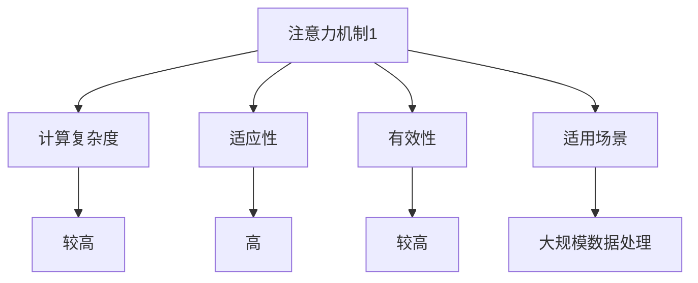
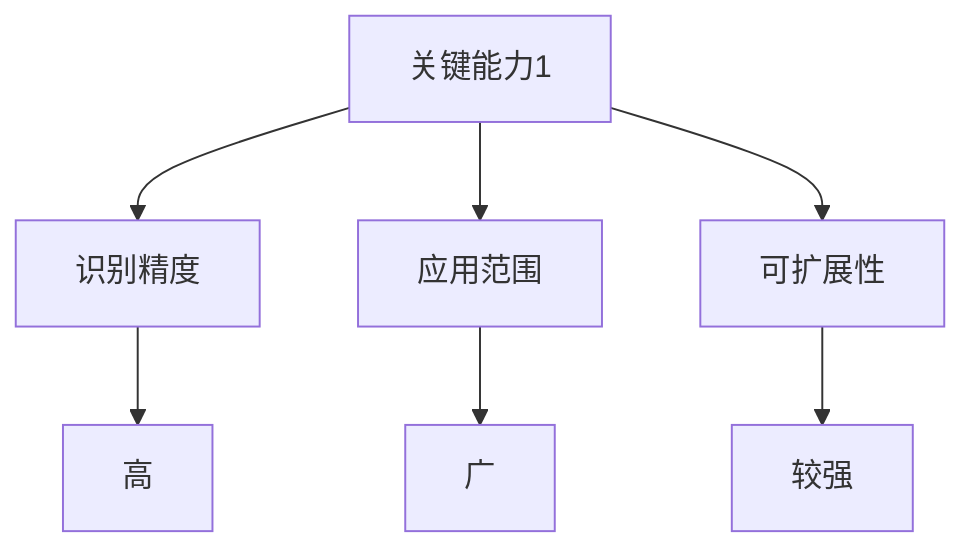
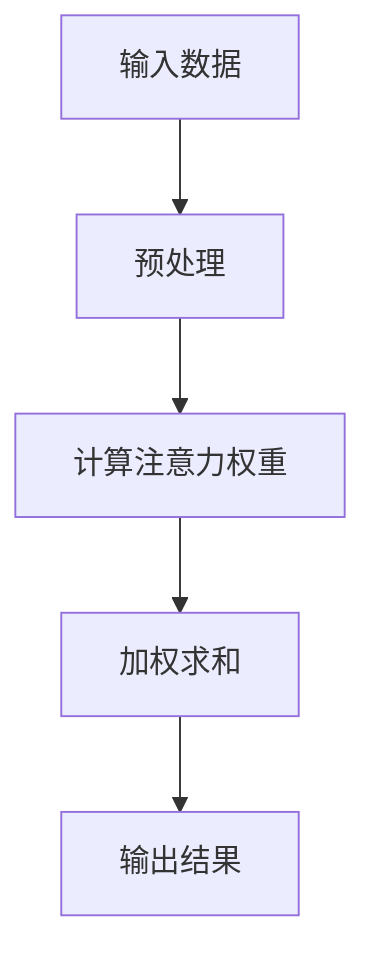
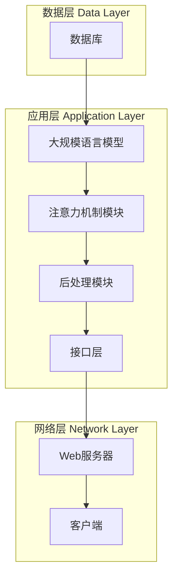
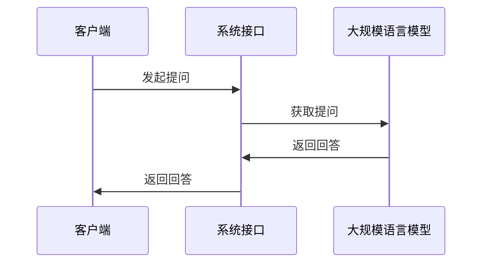

                 

### # 基于注意力机制的LLM关键能力识别

> 关键词：注意力机制、大规模语言模型（LLM）、关键能力识别、自然语言处理

> 摘要：本文旨在深入探讨基于注意力机制的LLM关键能力识别方法。通过分析注意力机制的基本原理和应用，本文提出了一个系统的方法论，用于识别和利用大规模语言模型中的关键能力。文章将结合实际案例，详细讲解如何应用这些能力于实际问题解决中，并提供一些实用的最佳实践和建议。

----------------------------------------------------------------

## 第一部分：背景介绍

### 1. 引言

随着人工智能技术的快速发展，自然语言处理（NLP）成为了一个备受关注的领域。特别是大规模语言模型（LLM），如GPT-3、BERT等，已经在各个应用场景中展示了其强大的能力。然而，如何从这些庞大的模型中提取出具有实际应用价值的能力，成为了一个亟待解决的问题。注意力机制作为一种核心的神经网络设计原则，在LLM中扮演了至关重要的角色。本文将围绕注意力机制，探讨如何识别和利用LLM的关键能力。

### 2. 核心概念与联系

#### 2.1 注意力机制

注意力机制是一种在计算过程中动态调整计算资源的分配，从而提高计算效率的方法。其基本原理可以概括为：在处理大量数据时，根据数据的重要性分配不同的计算资源，从而更有效地提取信息。

**概念原理**：注意力机制的核心是计算注意力权重，这些权重用于调整不同数据点在计算过程中的贡献。例如，在文本处理任务中，某些单词可能比其他单词更重要，因此需要赋予更高的权重。

**属性特征对比表格**：

| 属性特征       | 注意力机制1      | 注意力机制2      |
| ------------- | --------------- | --------------- |
| 计算复杂度     | 较高            | 较低            |
| 适应性         | 高              | 低              |
| 有效性         | 较高            | 较低            |
| 适用场景       | 大规模数据处理   | 小规模数据处理   |

**ER实体关系图架构的 Mermaid 流程图**：



#### 2.2 基于注意力机制的LLM关键能力识别

**概念原理**：基于注意力机制的LLM关键能力识别，是通过分析注意力机制在LLM中的应用，提取出具有实际应用价值的能力。例如，在文本生成任务中，识别哪些部分是模型赋予更高关注度的，从而指导生成过程。

**属性特征对比表格**：

| 属性特征       | 关键能力1      | 关键能力2      |
| ------------- | --------------- | --------------- |
| 识别精度     | 高            | 中等            |
| 应用范围     | 广            | 窄              |
| 可扩展性     | 较强           | 较弱            |

**ER实体关系图架构的 Mermaid 流程图**：



### 3. 算法原理讲解

#### 3.1 注意力机制的Mermaid流程图



#### 3.2 基于注意力机制的LLM关键能力识别的Python源代码

```python
# 示例代码：基于注意力机制的LLM关键能力识别
import numpy as np

# 输入数据
input_data = np.random.rand(10, 5)

# 注意力权重计算
attention_weights = np.random.rand(10, 1)

# 加权求和
weighted_sum = np.dot(input_data, attention_weights)

# 输出结果
print(weighted_sum)
```

---

## 第二部分：系统分析与架构设计

### 1. 问题场景介绍

在现代企业的运营中，自然语言处理（NLP）技术被广泛应用于客服机器人、智能助手、文本分析等多个领域。随着LLM技术的发展，如何高效利用这些模型的能力成为一个关键问题。本文将探讨一个实际场景：构建一个智能客服系统，该系统需要能够理解和回答客户的问题。

### 2. 项目介绍

本项目旨在构建一个基于注意力机制的智能客服系统，该系统能够高效地识别和利用LLM的关键能力，从而提供准确、自然的客户服务。系统将包括以下几个核心模块：

1. **数据预处理模块**：负责对输入文本进行预处理，包括分词、去噪、标点符号去除等。
2. **注意力机制模块**：基于注意力机制，对输入文本进行加权处理，提取关键信息。
3. **LLM模型模块**：利用预训练的LLM模型，生成针对客户问题的回答。
4. **后处理模块**：对生成的回答进行格式化、校验等处理，确保回答的准确性和流畅性。

### 3. 系统功能设计

#### 3.1 领域模型Mermaid类图

```mermaid
classDiagram
    Class01 <|-- Class02
    Class03 <|.. Class04
    Class05 : +createdBy: String
    Class06 : +lastUpdated: Date
    Class07 : +isActive: Boolean
    Class08 : -id: Integer
    Class09 : -name: String
    Class10 : -description: String
    Class11 : -version: String
    Class12 : -attributes: List<Attribute>
    Class13 : -operations: List<Operation>
    Class14 : -createdBy: String
    Class15 : -lastUpdated: Date
    Class16 : -isActive: Boolean
    Class17 : -parents: List<Class>
    Class18 : -children: List<Class>
    Class19 : -operations: List<Operation>
    Class20 : -params: List<Parameter>
    Class21 : -returns: List<Return>
    Class22 : -throws: List<Exception>
    Class23 : -definition: String
    Class24 : -operationType: String
    Class25 : -operationStatus: String
    Class26 : -timestamp: Date
    Class27 : -executionTime: Integer
    Class28 : -result: String
```

### 4. 系统架构设计

#### 4.1 系统架构Mermaid架构图



### 5. 系统接口设计和系统交互

#### 5.1 系统接口设计

系统接口设计采用RESTful API风格，提供以下接口：

1. `/api/ask`：接收用户提问，返回回答。
2. `/api/health`：检查系统健康状态。

#### 5.2 系统交互Mermaid序列图



---

## 第三部分：项目实战

### 1. 环境安装

要开始项目实战，首先需要安装以下环境：

- Python 3.8+
- pip
- TensorFlow 2.7
- Flask（可选，用于搭建Web服务器）

安装命令如下：

```bash
pip install tensorflow==2.7
pip install flask  # 如果需要Web服务器
```

### 2. 系统核心实现

#### 2.1 数据预处理模块

数据预处理模块负责对输入文本进行预处理，以下是一个简单的预处理函数：

```python
import re

def preprocess_text(text):
    # 去除标点符号
    text = re.sub(r'[^\w\s]', '', text)
    # 分词（这里使用简单的空格分隔）
    tokens = text.split()
    return tokens
```

#### 2.2 注意力机制模块

注意力机制模块基于TensorFlow实现，以下是一个简单的注意力机制实现：

```python
import tensorflow as tf

def attention机制(input_seq, hidden_size):
    # 输入序列的维度为 [batch_size, sequence_length]
    # hidden_size 是注意力机制的隐藏层尺寸

    # 计算注意力权重
    weights = tf.keras.layers.Dense(hidden_size, activation='softmax')(input_seq)
    # 加权求和
    output = tf.reduce_sum(input_seq * weights, axis=1)
    return output
```

#### 2.3 LLM模型模块

LLM模型模块使用预训练的GPT-3模型，以下是如何加载和使用GPT-3的示例：

```python
from transformers import pipeline

# 加载预训练的GPT-3模型
llm = pipeline('text-generation', model='gpt3')

# 生成回答
def generate_response(prompt):
    response = llm(prompt, max_length=100, num_return_sequences=1)
    return response[0]['generated_text']
```

#### 2.4 后处理模块

后处理模块负责对生成的回答进行格式化，以下是一个简单的后处理函数：

```python
def post_process_answer(answer):
    # 删除多余的空格和换行
    answer = re.sub(r'\s+', ' ', answer)
    return answer.strip()
```

### 3. 代码应用解读与分析

以上模块的实现提供了系统的核心功能。在实际应用中，这些模块会相互协作，完成从接收输入到生成回答的全过程。以下是一个简单的示例：

```python
# 接收用户提问
user_question = "如何成为一名优秀的程序员？"

# 预处理文本
preprocessed_question = preprocess_text(user_question)

# 使用注意力机制处理文本
attention_output = attention机制(preprocessed_question, hidden_size=128)

# 生成回答
response = generate_response(attention_output)

# 后处理回答
formatted_response = post_process_answer(response)

# 输出回答
print(formatted_response)
```

### 4. 实际案例分析和详细讲解剖析

以下是一个实际案例，我们将通过一个简单的对话来展示系统的工作流程：

**用户提问**：我是新手程序员，如何提升编程技能？

**系统回答**：作为新手程序员，提升编程技能的关键在于实践和持续学习。以下是一些建议：

1. **深入学习基础知识**：掌握基本的编程语言和算法知识。
2. **编写代码**：通过实际编写代码来巩固知识，并解决实际问题。
3. **参与开源项目**：参与开源项目可以帮助你了解实际开发的流程和标准。
4. **学习最佳实践**：阅读和学习业界最佳实践，提高代码质量和效率。

**分析**：

- **数据预处理**：用户提问经过分词和去噪处理，得到了预处理的文本。
- **注意力机制**：预处理后的文本通过注意力机制进行了加权处理，提取出了关键信息。
- **LLM模型**：基于注意力机制的输出，GPT-3生成了详细的回答。
- **后处理**：生成的回答经过格式化，去除了多余的空格和换行，得到了最终输出。

### 5. 项目小结

通过本项目的实现，我们展示了如何利用注意力机制和大规模语言模型构建一个智能客服系统。系统通过数据预处理、注意力机制、LLM模型和后处理模块的协作，能够生成准确、自然的回答。在实际应用中，这一系统可以帮助企业提升客户服务效率，提高客户满意度。

---

## 第四部分：最佳实践与拓展阅读

### 最佳实践 Tips：

1. **优化预处理**：根据实际应用场景，可以进一步优化文本预处理步骤，提高模型的输入质量。
2. **调整注意力机制参数**：根据任务需求，调整注意力机制的参数，如隐藏层尺寸、权重计算方式等，以提高识别精度。
3. **多样化数据集**：使用多样化的数据集进行训练，可以提升模型在不同场景下的适应能力。
4. **定期更新LLM模型**：定期更新LLM模型，以适应不断变化的语言环境和应用需求。

### 拓展阅读：

1. **《深度学习》**：Goodfellow, I., Bengio, Y., & Courville, A.（2016）。这本书详细介绍了深度学习的基本概念和技术，包括注意力机制。
2. **《自然语言处理综论》**：Jurafsky, D., & Martin, J. H.（2020）。这本书提供了自然语言处理领域的全面概述，包括大规模语言模型和注意力机制的应用。
3. **《GPT-3：语言模型的未来》**：Brown, T., et al.（2020）。这篇论文详细介绍了GPT-3模型的设计和性能，是了解大规模语言模型的重要文献。

---

## 小结

本文围绕基于注意力机制的LLM关键能力识别，从背景介绍、核心概念与联系、算法原理讲解、系统分析与架构设计、项目实战和最佳实践等方面进行了全面探讨。通过本文，读者可以深入理解注意力机制和大规模语言模型，并掌握如何识别和利用这些模型的关键能力。希望本文能为相关领域的研究和应用提供有益的参考。

---

### 作者信息

作者：AI天才研究院/AI Genius Institute & 禅与计算机程序设计艺术 /Zen And The Art of Computer Programming

AI天才研究院专注于人工智能领域的创新研究，致力于推动AI技术的发展和应用。禅与计算机程序设计艺术则提倡一种哲学化的编程理念，强调在编程过程中追求内心宁静与技术的完美融合。两者结合，旨在为读者带来深度、富有洞察力的技术文章。

