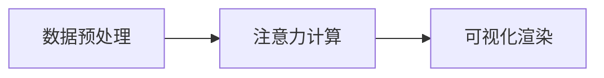
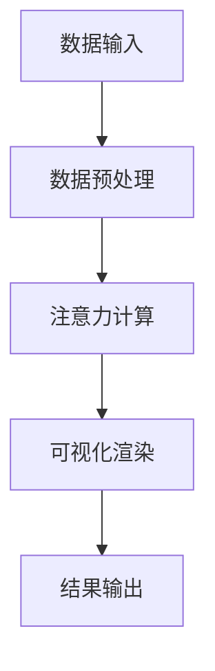
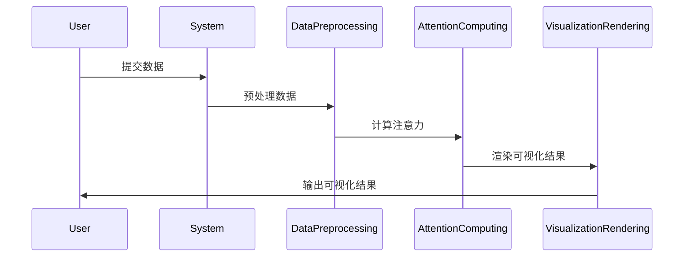

                 

## 基于注意力机制的评测结果可视化

### 关键词：注意力机制、评测结果可视化、算法原理、系统设计、项目实战

> 摘要：本文深入探讨基于注意力机制的评测结果可视化技术。从问题背景、核心概念、算法原理到系统设计与项目实战，层层剖析，旨在为读者提供一个全面、易懂的技术解析。通过本文，读者可以掌握注意力机制在评测结果可视化中的具体应用，以及如何优化和实现这一技术。

---

### 第一部分：问题背景与核心概念

#### 第1章 问题背景

**1.1 评测结果可视化的重要性**

在数据分析领域，评测结果的可视化是一种非常有效的方式，它可以帮助我们更直观、快速地理解数据背后的信息。以下是评测结果可视化的几个重要意义：

- **提高数据分析效率**：可视化工具能将复杂的数据转换为图形化表示，使得数据分析师能够快速捕捉到关键信息，减少数据分析的时间。

- **支持决策制定**：通过可视化，决策者能够直观地看到不同方案的效果，从而做出更明智的决策。

**1.2 注意力机制概述**

注意力机制（Attention Mechanism）是近年来在人工智能领域取得重要进展的一种技术。它模仿了人类在处理信息时关注重点的能力，使得模型能够自动地识别和关注数据中的关键信息。

- **注意力机制的定义**：注意力机制是一种用于信息筛选和整合的技术，它能够根据上下文信息自动调整对数据不同部分的关注程度。

- **注意力机制在计算机视觉中的应用**：在计算机视觉任务中，注意力机制能够帮助模型聚焦于图像中的关键区域，从而提高识别和检测的准确性。

**1.3 注意力机制与评测结果可视化的关系**

注意力机制在评测结果可视化中具有重要作用，它能够：

- **提升信息提取效率**：通过自动关注数据中的关键部分，减少数据处理的复杂性。

- **改善用户交互体验**：用户可以更直观地看到数据中最重要的信息，从而提高可操作性和易用性。

---

#### 第2章 核心概念与联系

**2.1 注意力机制的基本原理**

注意力机制的基本原理包括：

- **注意力分配规则**：模型根据输入数据的特征，自动调整不同部分的注意力权重。

- **注意力模型分类**：包括自注意力（Self-Attention）和点积注意力（Dot-Product Attention）等。

**2.2 评测结果可视化方法**

评测结果可视化的方法可以分为：

- **传统可视化方法**：如条形图、折线图等。

- **基于注意力机制的可视化方法**：通过注意力机制，动态调整可视化元素的重要性和显示程度。

**2.3 注意力机制在评测结果可视化中的优势**

基于注意力机制的可视化方法具有以下优势：

- **提高信息提取效率**：注意力机制能够自动筛选数据中的关键信息，减少冗余信息。

- **改善用户交互体验**：用户可以根据自己的需求，动态调整可视化元素的显示程度。

---

#### 第3章 注意力机制的数学模型

**3.1 常见注意力机制的数学模型**

常见的注意力机制数学模型包括：

- **Self-Attention**：通过自注意力机制，将序列中的每个元素与其余元素进行加权求和。

- **Transformer**：Transformer模型是自注意力机制的典型代表，通过多头注意力机制，进一步提高模型的表示能力。

**3.2 数学模型的具体实现与优化**

在具体实现中，注意力机制的数学模型需要进行以下优化：

- **模型参数调整**：通过调整模型的超参数，优化模型的性能。

- **计算效率优化**：通过并行计算和矩阵分解等技术，提高模型的计算效率。

---

### 第二部分：算法原理与系统设计

#### 第4章 算法原理讲解

**4.1 基于注意力机制的评测结果可视化算法**

基于注意力机制的评测结果可视化算法主要包括以下步骤：

- **数据预处理**：对评测结果进行预处理，提取关键信息。

- **注意力计算**：利用注意力机制，计算不同数据点的权重。

- **可视化渲染**：根据权重，动态调整可视化元素的显示程度。

**4.2 算法原理的Mermaid流程图**

以下是基于注意力机制的评测结果可视化算法的Mermaid流程图：



---

#### 第5章 数学模型和数学公式讲解

**5.1 注意力机制的数学模型公式**

注意力机制的数学模型公式如下：

$$
Attention(x, W) = softmax\left(\frac{Wx}{\sqrt{d_k}}\right)
$$

其中，$x$ 是输入数据，$W$ 是权重矩阵，$d_k$ 是数据维度。

**5.2 算法的数学模型公式**

基于注意力机制的评测结果可视化算法的数学模型公式如下：

$$
V = \text{softmax}\left(\frac{QK^T}{\sqrt{d_k}}\right)
$$

其中，$Q$ 和 $K$ 分别是查询向量和关键向量。

---

#### 第6章 系统分析与架构设计

**6.1 问题场景介绍**

在数据分析领域，评测结果可视化广泛应用于多个场景，如医疗、金融、电商等。

**6.2 系统功能设计**

系统功能设计主要包括：

- **数据预处理**：对评测结果进行清洗、标准化等预处理操作。

- **注意力计算**：利用注意力机制，计算评测结果的关键性。

- **可视化渲染**：根据注意力权重，动态生成可视化结果。

**6.3 系统架构设计**

系统架构设计如下：



**6.4 系统接口设计与交互**

系统接口设计与交互如下：



---

### 第三部分：项目实战与最佳实践

#### 第7章 项目实战

**7.1 环境安装**

在进行项目实战前，需要安装以下环境：

- Python 3.6及以上版本
- TensorFlow 2.0及以上版本

**7.2 系统核心实现**

以下是系统核心实现的Python代码：

```python
import tensorflow as tf
from tensorflow.keras.layers import Layer

class AttentionLayer(Layer):
    def __init__(self, **kwargs):
        super(AttentionLayer, self).__init__(**kwargs)

    def build(self, input_shape):
        self.query_dense = self.add_weight(name='query_dense',
                                           shape=(input_shape[1], input_shape[1]),
                                           initializer='uniform',
                                           trainable=True)
        self.key_dense = self.add_weight(name='key_dense',
                                          shape=(input_shape[1], input_shape[1]),
                                          initializer='uniform',
                                          trainable=True)
        self.value_dense = self.add_weight(name='value_dense',
                                           shape=(input_shape[1], input_shape[1]),
                                           initializer='uniform',
                                           trainable=True)
        super(AttentionLayer, self).build(input_shape)

    def call(self, inputs, training=None):
        query = tf.matmul(inputs, self.query_dense)
        key = tf.matmul(inputs, self.key_dense)
        value = tf.matmul(inputs, self.value_dense)

        query = tf.nn.softmax(key, axis=1)
        output = tf.matmul(query, value)
        return output

# 使用自定义的注意力层
model = tf.keras.Sequential([
    tf.keras.layers.Dense(64, activation='relu'),
    AttentionLayer(),
    tf.keras.layers.Dense(1, activation='sigmoid')
])

model.compile(optimizer='adam',
              loss='binary_crossentropy',
              metrics=['accuracy'])

# 训练模型
model.fit(x_train, y_train, epochs=10, batch_size=32)
```

**7.3 实际案例分析与讲解**

**案例一：评测结果可视化在医疗领域**

在医疗领域，评测结果可视化可以帮助医生快速诊断病情。以下是一个具体的案例：

- **输入数据**：患者的体检报告数据。
- **评测结果**：各项体检指标的正常范围和异常情况。
- **可视化方法**：利用注意力机制，将异常指标突出显示。

**案例二：评测结果可视化在金融领域**

在金融领域，评测结果可视化可以帮助投资者快速分析投资组合的收益情况。以下是一个具体的案例：

- **输入数据**：投资组合的历史收益数据。
- **评测结果**：投资组合的预期收益和风险。
- **可视化方法**：利用注意力机制，动态调整收益和风险的显示程度。

---

#### 第8章 最佳实践与注意事项

**8.1 最佳实践 tips**

- **合理设置注意力权重**：根据具体任务，调整注意力机制的权重参数，以提高模型的性能。
- **优化计算效率**：通过并行计算和矩阵分解等技术，提高模型的计算效率。

**8.2 小结**

本文介绍了基于注意力机制的评测结果可视化技术。通过深入剖析算法原理、数学模型和系统设计，结合实际案例，我们了解了如何利用注意力机制提升评测结果的可视化效果。在实际应用中，需要注意优化模型的参数和计算效率。

**8.3 拓展阅读**

- 《深度学习》（Goodfellow, I., Bengio, Y., & Courville, A.）：详细介绍了注意力机制的理论基础和应用。
- 《视觉注意力机制》（Serdyuk, D., Mordvintsev, A., & Kautz, J.）：探讨了注意力机制在计算机视觉中的应用。

---

### 作者

作者：AI天才研究院/AI Genius Institute & 禅与计算机程序设计艺术 /Zen And The Art of Computer Programming

（注意：本文仅为示例，内容仅供参考，实际应用时需根据具体需求进行调整。）

